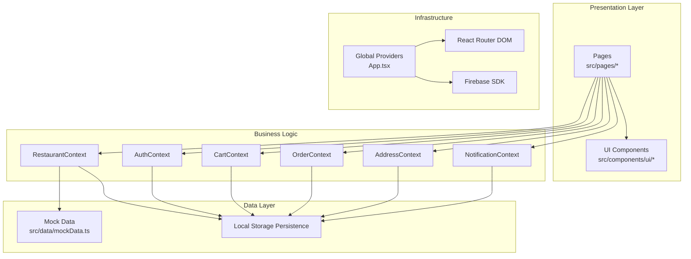
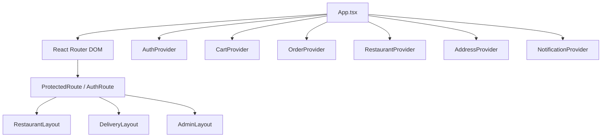
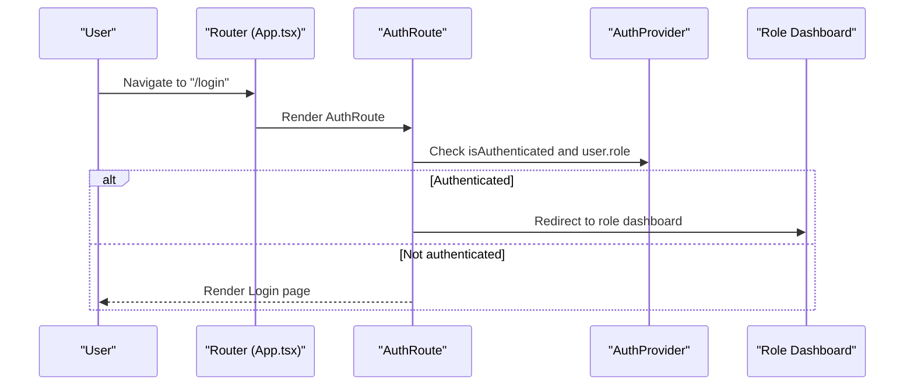
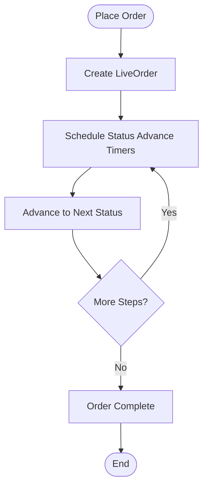
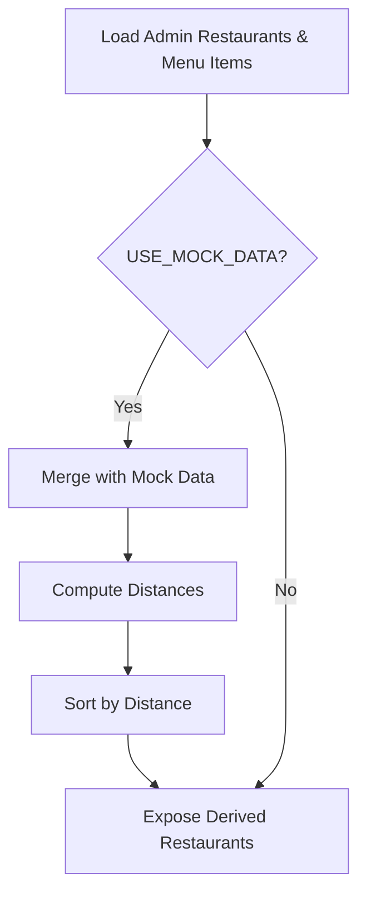
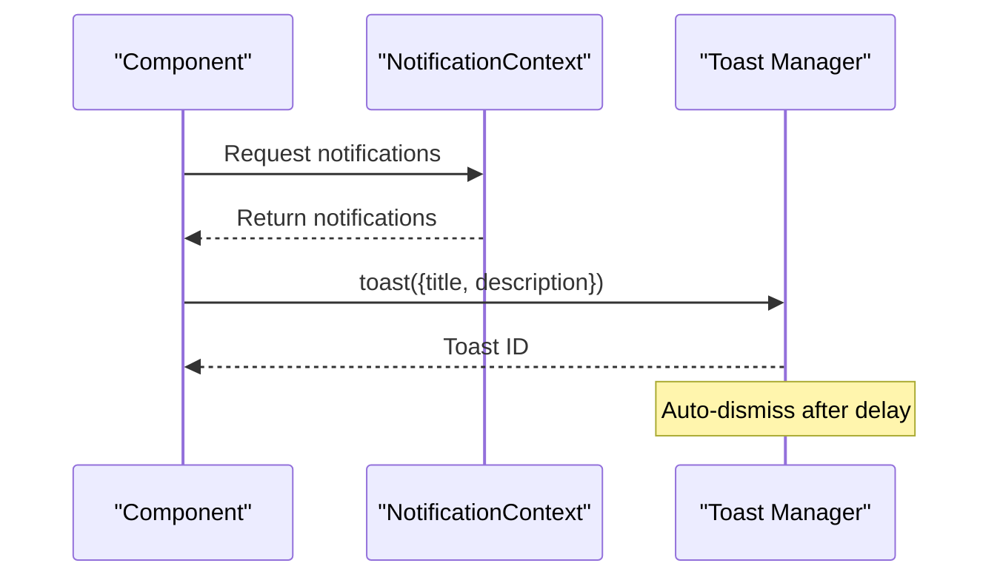
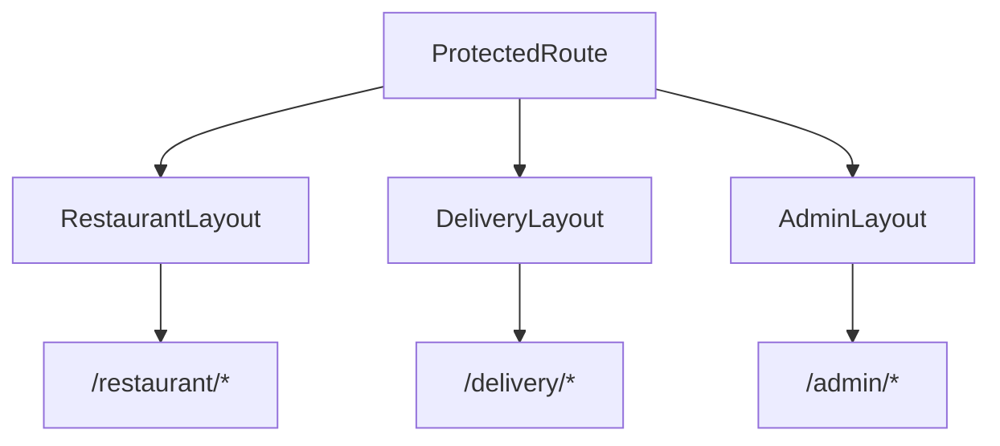
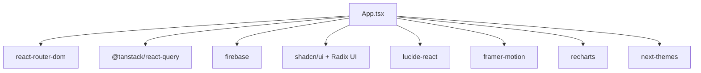

# Architecture Overview

<cite>
**Referenced Files in This Document**
- [App.tsx](file://src/App.tsx)
- [main.tsx](file://src/main.tsx)
- [firebase.ts](file://src/config/firebase.ts)
- [AuthContext.tsx](file://src/context/AuthContext.tsx)
- [CartContext.tsx](file://src/context/CartContext.tsx)
- [OrderContext.tsx](file://src/context/OrderContext.tsx)
- [RestaurantContext.tsx](file://src/context/RestaurantContext.tsx)
- [AddressContext.tsx](file://src/context/AddressContext.tsx)
- [NotificationContext.tsx](file://src/context/NotificationContext.tsx)
- [HomePage.tsx](file://src/pages/HomePage.tsx)
- [RestaurantLayout.tsx](file://src/pages/restaurant/RestaurantLayout.tsx)
- [DeliveryLayout.tsx](file://src/pages/delivery/DeliveryLayout.tsx)
- [AdminLayout.tsx](file://src/pages/admin/AdminLayout.tsx)
- [mockData.ts](file://src/data/mockData.ts)
- [use-toast.ts](file://src/hooks/use-toast.ts)
- [package.json](file://package.json)
</cite>

## Table of Contents
1. [Introduction](#introduction)
2. [Project Structure](#project-structure)
3. [Core Components](#core-components)
4. [Architecture Overview](#architecture-overview)
5. [Detailed Component Analysis](#detailed-component-analysis)
6. [Dependency Analysis](#dependency-analysis)
7. [Performance Considerations](#performance-considerations)
8. [Troubleshooting Guide](#troubleshooting-guide)
9. [Conclusion](#conclusion)

## Introduction
This document describes TIPPAY’s system design and component organization. It explains the React-based architecture with TypeScript type safety, the Context API pattern for state management across multiple independent providers, routing with protected routes and role-based navigation, and integration patterns with Firebase for authentication and data persistence. It also documents system boundaries, data flow patterns, and the separation of concerns between presentation, business logic, and data layers. Finally, it outlines architectural decisions, design patterns, and scalability considerations across customer, restaurant, delivery agent, and admin roles.

## Project Structure
TIPPAY follows a feature-based and layer-based organization:
- Presentation layer: Pages under src/pages and shared UI components under src/components/ui
- Business logic: Context providers under src/context encapsulate domain-specific state and actions
- Data layer: Mock data under src/data and local storage-backed persistence
- Infrastructure: Firebase initialization under src/config and global providers in src/App.tsx
- Routing: Defined in App.tsx with nested dashboards per role

**Diagram sources**
- [App.tsx:124-162](file://src/App.tsx#L124-L162)
- [AuthContext.tsx:40-123](file://src/context/AuthContext.tsx#L40-L123)
- [CartContext.tsx:22-56](file://src/context/CartContext.tsx#L22-L56)
- [OrderContext.tsx:41-130](file://src/context/OrderContext.tsx#L41-L130)
- [RestaurantContext.tsx:36-152](file://src/context/RestaurantContext.tsx#L36-L152)
- [AddressContext.tsx:31-86](file://src/context/AddressContext.tsx#L31-L86)
- [NotificationContext.tsx:68-113](file://src/context/NotificationContext.tsx#L68-L113)
- [mockData.ts:167-264](file://src/data/mockData.ts#L167-L264)

**Section sources**
- [App.tsx:124-162](file://src/App.tsx#L124-L162)
- [main.tsx:1-11](file://src/main.tsx#L1-L11)

## Core Components
- Global Providers: App.tsx composes multiple independent Context providers around the routing tree to supply cross-cutting state (authentication, cart, orders, addresses, notifications, restaurants, location, favorites, cravings, language).
- Routing: App.tsx defines routes for public and protected pages, plus nested dashboards for restaurant, delivery, and admin roles. Two guard components enforce authentication and role redirection.
- Firebase Integration: Firebase SDK is initialized in src/config/firebase.ts and imported in main.tsx to enable auth and Firestore/storage services.
- UI Toast System: A toast manager built on React hooks coordinates notifications across the app.

Key provider stack highlights:
- Authentication: AuthContext manages user session, login/signup, and user status updates.
- Shopping: CartContext handles cart items, quantities, totals, and persistence.
- Ordering: OrderContext simulates live order progression with timers and maintains order history.
- Restaurants: RestaurantContext derives restaurant lists from mock data and local storage, integrating with location-awareness.
- Addresses: AddressContext persists and selects delivery addresses.
- Notifications: NotificationContext generates role-specific notifications and supports read/unread state.

**Section sources**
- [App.tsx:55-71](file://src/App.tsx#L55-L71)
- [App.tsx:73-122](file://src/App.tsx#L73-L122)
- [App.tsx:124-162](file://src/App.tsx#L124-L162)
- [firebase.ts:1-28](file://src/config/firebase.ts#L1-L28)
- [main.tsx:1-11](file://src/main.tsx#L1-L11)
- [AuthContext.tsx:40-123](file://src/context/AuthContext.tsx#L40-L123)
- [CartContext.tsx:22-56](file://src/context/CartContext.tsx#L22-L56)
- [OrderContext.tsx:41-130](file://src/context/OrderContext.tsx#L41-L130)
- [RestaurantContext.tsx:36-152](file://src/context/RestaurantContext.tsx#L36-L152)
- [AddressContext.tsx:31-86](file://src/context/AddressContext.tsx#L31-L86)
- [NotificationContext.tsx:68-113](file://src/context/NotificationContext.tsx#L68-L113)

## Architecture Overview
The system is a single-page React application with:
- A central App.tsx that composes providers and renders routes
- Role-based dashboards with nested routes
- Context providers for state management
- Firebase SDK for authentication and data services
- Local storage for persistence and mock data for runtime datasets

**Diagram sources**
- [App.tsx:73-122](file://src/App.tsx#L73-L122)
- [RestaurantLayout.tsx:5-21](file://src/pages/restaurant/RestaurantLayout.tsx#L5-L21)
- [DeliveryLayout.tsx:5-21](file://src/pages/delivery/DeliveryLayout.tsx#L5-L21)
- [AdminLayout.tsx:5-19](file://src/pages/admin/AdminLayout.tsx#L5-L19)
- [AuthContext.tsx:40-123](file://src/context/AuthContext.tsx#L40-L123)
- [CartContext.tsx:22-56](file://src/context/CartContext.tsx#L22-L56)
- [OrderContext.tsx:41-130](file://src/context/OrderContext.tsx#L41-L130)
- [RestaurantContext.tsx:36-152](file://src/context/RestaurantContext.tsx#L36-L152)
- [AddressContext.tsx:31-86](file://src/context/AddressContext.tsx#L31-L86)
- [NotificationContext.tsx:68-113](file://src/context/NotificationContext.tsx#L68-L113)

## Detailed Component Analysis

### Authentication and Role-Based Navigation
- AuthContext defines the user model, login/signup logic, and user status management. It also detects roles based on email patterns and persists users in local storage.
- App.tsx defines two guards:
  - ProtectedRoute: blocks unauthenticated users from accessing protected pages.
  - AuthRoute: redirects authenticated users to their role-specific dashboard.
- Role redirection logic ensures admins, restaurants, and delivery agents are routed to appropriate dashboards upon login.

**Diagram sources**
- [App.tsx:55-71](file://src/App.tsx#L55-L71)
- [AuthContext.tsx:40-123](file://src/context/AuthContext.tsx#L40-L123)

**Section sources**
- [AuthContext.tsx:31-38](file://src/context/AuthContext.tsx#L31-L38)
- [AuthContext.tsx:58-100](file://src/context/AuthContext.tsx#L58-L100)
- [App.tsx:55-71](file://src/App.tsx#L55-L71)

### Shopping Cart and Ordering Flow
- CartContext manages cart items, quantities, and totals. It exposes add/remove/update/clear operations and computed totals.
- OrderContext simulates live order progression with a finite state machine and timers. It also assigns random delivery agents and maintains status history.
- HomePage demonstrates consumption of CartContext and OrderContext to render restaurant menus and broadcast cravings.

**Diagram sources**
- [OrderContext.tsx:86-97](file://src/context/OrderContext.tsx#L86-L97)
- [OrderContext.tsx:105-120](file://src/context/OrderContext.tsx#L105-L120)

**Section sources**
- [CartContext.tsx:22-56](file://src/context/CartContext.tsx#L22-L56)
- [OrderContext.tsx:41-130](file://src/context/OrderContext.tsx#L41-L130)
- [HomePage.tsx:21-84](file://src/pages/HomePage.tsx#L21-L84)

### Restaurant Discovery and Data Derivation
- RestaurantContext reads admin restaurants and menu items from local storage or seeds, derives a restaurant list, computes distances, and merges with mock data when enabled.
- HomePage filters restaurants by category and search query, and integrates with AddressContext and LocationContext for delivery location and GPS detection.

**Diagram sources**
- [RestaurantContext.tsx:36-152](file://src/context/RestaurantContext.tsx#L36-L152)
- [mockData.ts:167-264](file://src/data/mockData.ts#L167-L264)

**Section sources**
- [RestaurantContext.tsx:36-152](file://src/context/RestaurantContext.tsx#L36-L152)
- [mockData.ts:167-264](file://src/data/mockData.ts#L167-L264)
- [HomePage.tsx:41-52](file://src/pages/HomePage.tsx#L41-L52)

### Notifications and Toast System
- NotificationContext generates role-specific notifications and periodically emits new ones. It tracks unread counts and supports bulk actions.
- The toast system uses a reducer-based hook to manage toast queue limits and dismissal behavior.

**Diagram sources**
- [NotificationContext.tsx:68-113](file://src/context/NotificationContext.tsx#L68-L113)
- [use-toast.ts:137-164](file://src/hooks/use-toast.ts#L137-L164)

**Section sources**
- [NotificationContext.tsx:68-113](file://src/context/NotificationContext.tsx#L68-L113)
- [use-toast.ts:137-164](file://src/hooks/use-toast.ts#L137-L164)

### Role Dashboards and Navigation
- RestaurantLayout, DeliveryLayout, and AdminLayout provide role-specific sidebars and outlet rendering for nested routes.
- App.tsx nests role routes under protected wrappers to ensure access control.

**Diagram sources**
- [RestaurantLayout.tsx:5-21](file://src/pages/restaurant/RestaurantLayout.tsx#L5-L21)
- [DeliveryLayout.tsx:5-21](file://src/pages/delivery/DeliveryLayout.tsx#L5-L21)
- [AdminLayout.tsx:5-19](file://src/pages/admin/AdminLayout.tsx#L5-L19)
- [App.tsx:91-118](file://src/App.tsx#L91-L118)

**Section sources**
- [RestaurantLayout.tsx:5-21](file://src/pages/restaurant/RestaurantLayout.tsx#L5-L21)
- [DeliveryLayout.tsx:5-21](file://src/pages/delivery/DeliveryLayout.tsx#L5-L21)
- [AdminLayout.tsx:5-19](file://src/pages/admin/AdminLayout.tsx#L5-L19)
- [App.tsx:91-118](file://src/App.tsx#L91-L118)

## Dependency Analysis
External dependencies relevant to architecture:
- React Router DOM: Routing and nested routes
- @tanstack/react-query: Query client provider for caching and data fetching abstractions
- Firebase SDK: Authentication, Firestore, and Storage
- UI primitives: Radix UI, shadcn/ui, Lucide icons, Framer Motion, Recharts, Sonner

**Diagram sources**
- [package.json:17-69](file://package.json#L17-L69)
- [App.tsx:53-149](file://src/App.tsx#L53-L149)

**Section sources**
- [package.json:17-69](file://package.json#L17-L69)
- [App.tsx:53-149](file://src/App.tsx#L53-L149)

## Performance Considerations
- Provider composition: App.tsx composes many providers; consider lazy-loading heavy contexts or splitting providers by route to reduce re-renders.
- Local storage usage: Several contexts persist to localStorage; batch updates and avoid frequent writes to improve responsiveness.
- Timers in OrderContext: Status advancement uses timeouts; ensure cleanup on unmount to prevent leaks.
- Mock data and derivations: RestaurantContext merges mock and dynamic data; cache derived lists to minimize recomputation.
- Toast queue limit: use-toast enforces a toast limit; ensure messages are concise and actionable to avoid queue churn.

[No sources needed since this section provides general guidance]

## Troubleshooting Guide
- Authentication issues:
  - Verify login credentials and user status in AuthContext. Pending or suspended users are blocked from logging in.
  - Check role detection logic and ensure emails match expected patterns.
- Routing problems:
  - ProtectedRoute blocks unauthenticated users; ensure AuthContext sets user state correctly.
  - AuthRoute redirects authenticated users to role dashboards; confirm user.role is populated.
- Order progression:
  - If orders do not advance, inspect timers and scheduleAdvance logic in OrderContext.
- Notifications:
  - If notifications do not appear, verify user presence and effect intervals in NotificationContext.
- Toasts:
  - If toasts do not dismiss, review use-toast reducer and timeouts.

**Section sources**
- [AuthContext.tsx:58-100](file://src/context/AuthContext.tsx#L58-L100)
- [App.tsx:55-71](file://src/App.tsx#L55-L71)
- [OrderContext.tsx:86-103](file://src/context/OrderContext.tsx#L86-L103)
- [NotificationContext.tsx:80-95](file://src/context/NotificationContext.tsx#L80-L95)
- [use-toast.ts:53-69](file://src/hooks/use-toast.ts#L53-L69)

## Conclusion
TIPPAY employs a clean React architecture with TypeScript, a robust Context API pattern, and role-based routing. The design separates presentation, business logic, and data concerns while leveraging Firebase for authentication and local storage for persistence. The system is structured to scale across customer, restaurant, delivery agent, and admin roles through nested dashboards and provider-driven state. Future enhancements can focus on modularizing providers, optimizing data derivations, and integrating real-time Firebase features for live updates.