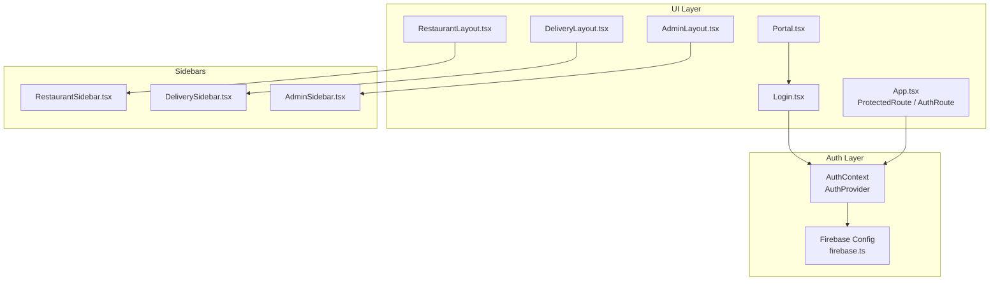
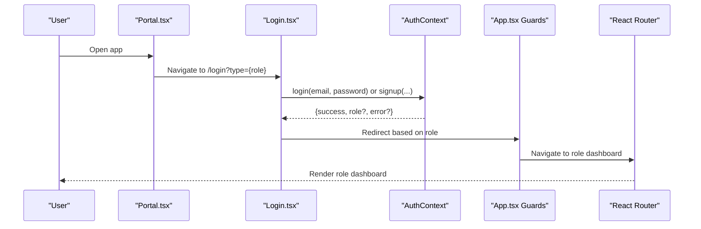
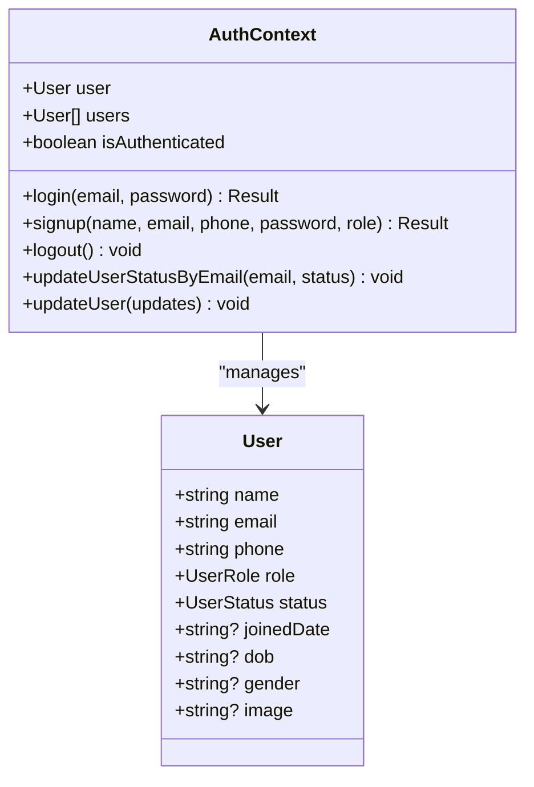
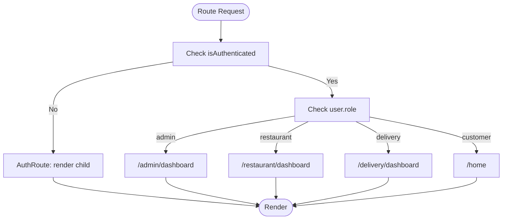
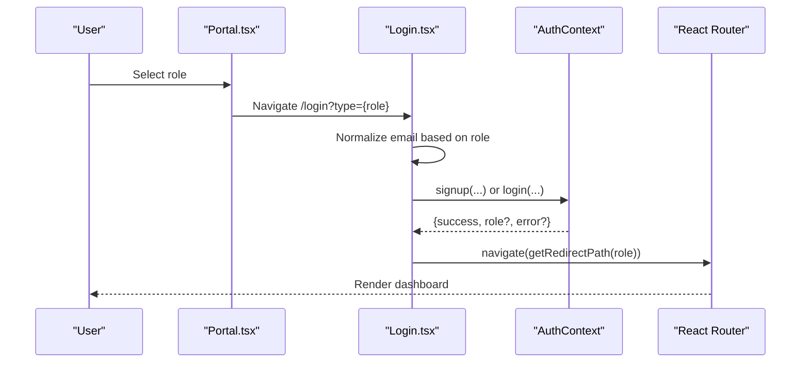
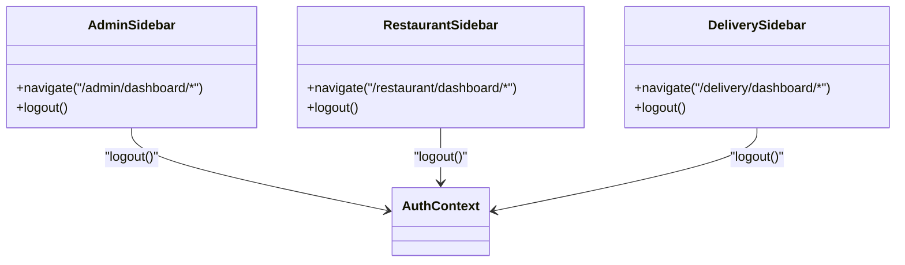
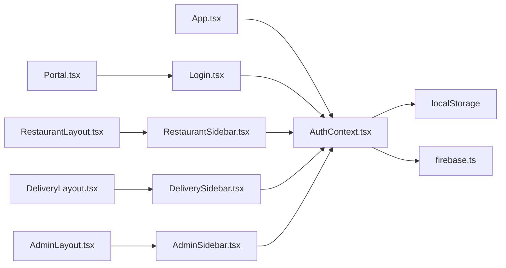

# Authentication & Authorization

<cite>
**Referenced Files in This Document**
- [AuthContext.tsx](file://src/context/AuthContext.tsx)
- [firebase.ts](file://src/config/firebase.ts)
- [Login.tsx](file://src/pages/Login.tsx)
- [Portal.tsx](file://src/pages/Portal.tsx)
- [App.tsx](file://src/App.tsx)
- [RestaurantLayout.tsx](file://src/pages/restaurant/RestaurantLayout.tsx)
- [DeliveryLayout.tsx](file://src/pages/delivery/DeliveryLayout.tsx)
- [AdminLayout.tsx](file://src/pages/admin/AdminLayout.tsx)
- [AdminSidebar.tsx](file://src/components/AdminSidebar.tsx)
- [RestaurantSidebar.tsx](file://src/components/RestaurantSidebar.tsx)
- [DeliverySidebar.tsx](file://src/components/DeliverySidebar.tsx)
- [RestaurantContext.tsx](file://src/context/RestaurantContext.tsx)
- [adminMockData.ts](file://src/data/adminMockData.ts)
- [restaurantMockData.ts](file://src/data/restaurantMockData.ts)
- [deliveryMockData.ts](file://src/data/deliveryMockData.ts)
- [mockData.ts](file://src/data/mockData.ts)
</cite>

## Table of Contents
1. [Introduction](#introduction)
2. [Project Structure](#project-structure)
3. [Core Components](#core-components)
4. [Architecture Overview](#architecture-overview)
5. [Detailed Component Analysis](#detailed-component-analysis)
6. [Dependency Analysis](#dependency-analysis)
7. [Performance Considerations](#performance-considerations)
8. [Troubleshooting Guide](#troubleshooting-guide)
9. [Conclusion](#conclusion)
10. [Appendices](#appendices)

## Introduction
This document explains TIPPAY’s multi-role authentication and authorization system. It covers the user role hierarchy (customer, restaurant partner, delivery agent, administrator), the authentication flow from login through role detection and session management, and the integration with Firebase for authentication services. It also documents role-based routing, permission checks, access control patterns, security considerations, token management, logout procedures, and the portal system for role switching and user account management. Examples of authentication guards, protected routes, and role-specific UI rendering are included.

## Project Structure
The authentication and authorization logic is primarily implemented in the AuthContext provider and integrated with route guards in App.tsx. Role-specific dashboards and sidebars are implemented under pages and components directories. Firebase configuration is centralized in a dedicated module.

**Diagram sources**
- [AuthContext.tsx:40-123](file://src/context/AuthContext.tsx#L40-L123)
- [firebase.ts:1-28](file://src/config/firebase.ts#L1-L28)
- [Portal.tsx:1-97](file://src/pages/Portal.tsx#L1-L97)
- [Login.tsx:13-112](file://src/pages/Login.tsx#L13-L112)
- [App.tsx:55-71](file://src/App.tsx#L55-L71)
- [RestaurantLayout.tsx:1-25](file://src/pages/restaurant/RestaurantLayout.tsx#L1-L25)
- [DeliveryLayout.tsx:1-25](file://src/pages/delivery/DeliveryLayout.tsx#L1-L25)
- [AdminLayout.tsx:1-23](file://src/pages/admin/AdminLayout.tsx#L1-L23)
- [RestaurantSidebar.tsx:1-93](file://src/components/RestaurantSidebar.tsx#L1-L93)
- [DeliverySidebar.tsx:1-90](file://src/components/DeliverySidebar.tsx#L1-L90)
- [AdminSidebar.tsx:1-86](file://src/components/AdminSidebar.tsx#L1-L86)

**Section sources**
- [AuthContext.tsx:1-130](file://src/context/AuthContext.tsx#L1-L130)
- [firebase.ts:1-28](file://src/config/firebase.ts#L1-L28)
- [App.tsx:55-122](file://src/App.tsx#L55-L122)
- [Portal.tsx:1-97](file://src/pages/Portal.tsx#L1-L97)
- [Login.tsx:13-226](file://src/pages/Login.tsx#L13-L226)

## Core Components
- AuthContext: Provides user state, login/signup/logout, role detection, and user updates. Stores users in local storage and exposes an isAuthenticated flag.
- Firebase Config: Initializes Firebase services (auth, Firestore, Storage) for potential future integration.
- App Route Guards: ProtectedRoute enforces authentication; AuthRoute redirects authenticated users to their role dashboard.
- Role Portals: Portal.tsx allows selecting role type; Login.tsx handles role-specific sign-up/login flows and redirects.
- Role Dashboards and Sidebars: RestaurantLayout, DeliveryLayout, AdminLayout with role-specific sidebars and logout actions.

Key responsibilities:
- Role detection based on email suffixes and keywords.
- Local storage-backed user persistence.
- Role-aware redirection after authentication.
- Logout clearing current user state.

**Section sources**
- [AuthContext.tsx:31-123](file://src/context/AuthContext.tsx#L31-L123)
- [firebase.ts:9-26](file://src/config/firebase.ts#L9-L26)
- [App.tsx:55-71](file://src/App.tsx#L55-L71)
- [Portal.tsx:7-23](file://src/pages/Portal.tsx#L7-L23)
- [Login.tsx:26-44](file://src/pages/Login.tsx#L26-L44)

## Architecture Overview
The system uses a client-side authentication model with role detection and local storage persistence. Firebase is configured but not actively used for authentication in the current implementation. Route guards protect role-specific areas and redirect unauthenticated users to the portal.

**Diagram sources**
- [Portal.tsx:8-23](file://src/pages/Portal.tsx#L8-L23)
- [Login.tsx:46-112](file://src/pages/Login.tsx#L46-L112)
- [AuthContext.tsx:58-100](file://src/context/AuthContext.tsx#L58-L100)
- [App.tsx:55-71](file://src/App.tsx#L55-L71)

## Detailed Component Analysis

### Authentication Context and Role Management
AuthContext centralizes authentication state and logic:
- Types: UserRole and UserStatus define the role hierarchy and account states.
- Role Detection: Email suffix and keyword matching determine role.
- Persistence: Users list and current user are persisted to local storage.
- Login/Signup: Validates credentials, sets current user, and returns role or status.
- Status Updates: Supports updating user status and auto-logout on non-active statuses.
- Exports: Provider, hook, and context type definitions.

**Diagram sources**
- [AuthContext.tsx:3-27](file://src/context/AuthContext.tsx#L3-L27)
- [AuthContext.tsx:6-16](file://src/context/AuthContext.tsx#L6-L16)

**Section sources**
- [AuthContext.tsx:3-27](file://src/context/AuthContext.tsx#L3-L27)
- [AuthContext.tsx:31-38](file://src/context/AuthContext.tsx#L31-L38)
- [AuthContext.tsx:43-56](file://src/context/AuthContext.tsx#L43-L56)
- [AuthContext.tsx:58-100](file://src/context/AuthContext.tsx#L58-L100)
- [AuthContext.tsx:104-116](file://src/context/AuthContext.tsx#L104-L116)

### Role-Based Routing and Access Control
App.tsx defines two route guards:
- ProtectedRoute: Ensures a user is authenticated; otherwise redirects to portal.
- AuthRoute: If already authenticated, redirects to the appropriate role dashboard; otherwise renders the child component.

Role-specific dashboards:
- Restaurant: Orders, Menu Editor, Dish Requests, Coupons, Analytics.
- Delivery: Nearby Orders, Active Delivery, Stats, Profile.
- Admin: Overview, Restaurants, Orders, Agents, Users.

**Diagram sources**
- [App.tsx:55-71](file://src/App.tsx#L55-L71)
- [App.tsx:73-122](file://src/App.tsx#L73-L122)

**Section sources**
- [App.tsx:55-71](file://src/App.tsx#L55-L71)
- [App.tsx:73-122](file://src/App.tsx#L73-L122)

### Login and Role Switching Portal
Portal.tsx provides role selection and a double-tap gesture to access the admin login path. Login.tsx:
- Accepts a role type via query param (user, restaurant, delivery, admin).
- Applies role-specific email normalization and validation.
- Handles sign-up for restaurant and delivery with required fields and status transitions.
- Performs login with role detection and redirects to the correct dashboard.

**Diagram sources**
- [Portal.tsx:8-23](file://src/pages/Portal.tsx#L8-L23)
- [Login.tsx:26-44](file://src/pages/Login.tsx#L26-L44)
- [Login.tsx:46-112](file://src/pages/Login.tsx#L46-L112)
- [AuthContext.tsx:58-100](file://src/context/AuthContext.tsx#L58-L100)

**Section sources**
- [Portal.tsx:7-23](file://src/pages/Portal.tsx#L7-L23)
- [Login.tsx:26-44](file://src/pages/Login.tsx#L26-L44)
- [Login.tsx:57-112](file://src/pages/Login.tsx#L57-L112)

### Role-Specific UI Rendering and Logout
Each role dashboard includes a sidebar with role-specific navigation items and a logout action:
- AdminSidebar: Overview, Restaurants, Orders, Delivery Agents, Users; Logout.
- RestaurantSidebar: Orders, Menu Editor, Dish Requests, Coupons, Analytics; Logout.
- DeliverySidebar: Nearby Orders, Active Delivery, My Stats, Profile; Logout.

Logout clears the current user and navigates to the portal.

**Diagram sources**
- [AdminSidebar.tsx:28-86](file://src/components/AdminSidebar.tsx#L28-L86)
- [RestaurantSidebar.tsx:28-93](file://src/components/RestaurantSidebar.tsx#L28-L93)
- [DeliverySidebar.tsx:27-90](file://src/components/DeliverySidebar.tsx#L27-L90)
- [AuthContext.tsx:102](file://src/context/AuthContext.tsx#L102)

**Section sources**
- [AdminSidebar.tsx:28-86](file://src/components/AdminSidebar.tsx#L28-L86)
- [RestaurantSidebar.tsx:28-93](file://src/components/RestaurantSidebar.tsx#L28-L93)
- [DeliverySidebar.tsx:27-90](file://src/components/DeliverySidebar.tsx#L27-L90)
- [AuthContext.tsx:102](file://src/context/AuthContext.tsx#L102)

### Firebase Integration Notes
Firebase is initialized with auth, Firestore, and Storage clients. While the current implementation relies on local state and local storage, the Firebase module is ready for future integration with real authentication, user profiles, and backend data synchronization.

**Section sources**
- [firebase.ts:9-26](file://src/config/firebase.ts#L9-L26)

### Data Models and Mock Integrations
The system integrates with mock data providers for restaurants, orders, coupons, and role-specific dashboards:
- RestaurantContext manages admin restaurants and menu items, deriving restaurant lists and persisting to local storage.
- AdminMockData, restaurantMockData, deliveryMockData, and mockData provide typed structures for dashboards and analytics.

**Section sources**
- [RestaurantContext.tsx:36-161](file://src/context/RestaurantContext.tsx#L36-L161)
- [adminMockData.ts:8-101](file://src/data/adminMockData.ts#L8-L101)
- [restaurantMockData.ts:4-215](file://src/data/restaurantMockData.ts#L4-L215)
- [deliveryMockData.ts:3-134](file://src/data/deliveryMockData.ts#L3-L134)
- [mockData.ts:13-326](file://src/data/mockData.ts#L13-L326)

## Dependency Analysis
- AuthContext depends on local storage for persistence and exports a hook for consuming components.
- App.tsx route guards depend on AuthContext to enforce access control.
- Role dashboards depend on their respective sidebars, which depend on AuthContext for logout.
- Firebase config is imported by AuthContext but not currently used for authentication logic.

**Diagram sources**
- [AuthContext.tsx:43-56](file://src/context/AuthContext.tsx#L43-L56)
- [App.tsx:55-71](file://src/App.tsx#L55-L71)
- [Portal.tsx:8-23](file://src/pages/Portal.tsx#L8-L23)
- [Login.tsx:46-112](file://src/pages/Login.tsx#L46-L112)
- [RestaurantLayout.tsx:1-25](file://src/pages/restaurant/RestaurantLayout.tsx#L1-L25)
- [DeliveryLayout.tsx:1-25](file://src/pages/delivery/DeliveryLayout.tsx#L1-L25)
- [AdminLayout.tsx:1-23](file://src/pages/admin/AdminLayout.tsx#L1-L23)
- [RestaurantSidebar.tsx:28-93](file://src/components/RestaurantSidebar.tsx#L28-L93)
- [DeliverySidebar.tsx:27-90](file://src/components/DeliverySidebar.tsx#L27-L90)
- [AdminSidebar.tsx:28-86](file://src/components/AdminSidebar.tsx#L28-L86)
- [firebase.ts:19-26](file://src/config/firebase.ts#L19-L26)

**Section sources**
- [AuthContext.tsx:43-56](file://src/context/AuthContext.tsx#L43-L56)
- [App.tsx:55-71](file://src/App.tsx#L55-L71)
- [firebase.ts:19-26](file://src/config/firebase.ts#L19-L26)

## Performance Considerations
- Local storage usage: Persisting users and other data improves UX by avoiding re-login, but excessive writes can impact performance. Consider batching updates and minimizing redundant writes.
- Role detection: Email-based detection is O(1) and efficient; avoid heavy computations in render paths.
- Route guards: Keep guard logic lightweight; avoid expensive computations inside ProtectedRoute/AuthRoute.
- Mock data: RestaurantContext derives lists from mock data; ensure derived computations are optimized for large datasets.

[No sources needed since this section provides general guidance]

## Troubleshooting Guide
Common issues and resolutions:
- Incorrect admin password: Login returns an error message when the admin password does not match.
- Pending/suspended accounts: Login prevents access for pending or suspended users and returns an error.
- Duplicate email during signup: Signup returns failure if the email already exists.
- Auto-logout on status change: When a user’s status changes to non-active, the system logs out the current user.
- Double-tap admin access: The portal supports a double-tap gesture on the logo to navigate to admin login.

**Section sources**
- [AuthContext.tsx:59-82](file://src/context/AuthContext.tsx#L59-L82)
- [AuthContext.tsx:104-109](file://src/context/AuthContext.tsx#L104-L109)
- [Login.tsx:58-102](file://src/pages/Login.tsx#L58-L102)
- [Portal.tsx:15-23](file://src/pages/Portal.tsx#L15-L23)

## Conclusion
TIPPAY implements a clear, extensible multi-role authentication and authorization system. The AuthContext provides role detection, local storage persistence, and access control hooks. App.tsx route guards ensure secure, role-aware navigation. The portal system enables role switching, while role-specific dashboards and sidebars deliver tailored UI experiences. Firebase is configured for future backend integration. The system is structured to support secure enhancements such as token-based sessions, server-side validation, and centralized user management.

[No sources needed since this section summarizes without analyzing specific files]

## Appendices

### Authentication Guards and Protected Routes
- ProtectedRoute: Wraps protected pages and ensures authentication.
- AuthRoute: Prevents authenticated users from accessing login/portal and redirects to role dashboard.

**Section sources**
- [App.tsx:55-71](file://src/App.tsx#L55-L71)

### Role-Specific UI Rendering Examples
- Restaurant dashboard layout and sidebar navigation.
- Delivery dashboard layout and sidebar navigation.
- Admin dashboard layout and sidebar navigation.

**Section sources**
- [RestaurantLayout.tsx:1-25](file://src/pages/restaurant/RestaurantLayout.tsx#L1-L25)
- [DeliveryLayout.tsx:1-25](file://src/pages/delivery/DeliveryLayout.tsx#L1-L25)
- [AdminLayout.tsx:1-23](file://src/pages/admin/AdminLayout.tsx#L1-L23)
- [RestaurantSidebar.tsx:20-26](file://src/components/RestaurantSidebar.tsx#L20-L26)
- [DeliverySidebar.tsx:20-25](file://src/components/DeliverySidebar.tsx#L20-L25)
- [AdminSidebar.tsx:20-26](file://src/components/AdminSidebar.tsx#L20-L26)

### Security Considerations
- Password handling: Current implementation stores credentials in memory and uses a hardcoded admin password; consider hashing and server-side validation.
- Token management: Not implemented; plan for JWT or session tokens with secure storage and refresh strategies.
- Session persistence: Uses local storage; consider secure HTTP-only cookies for production.
- Role verification: Enforce role checks on the server for critical operations.

[No sources needed since this section provides general guidance]