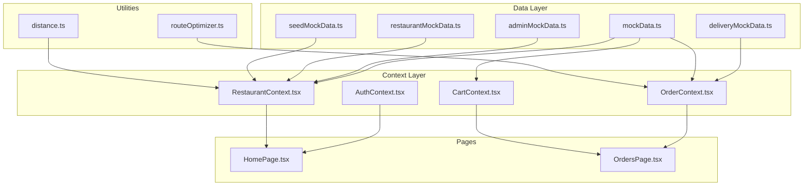
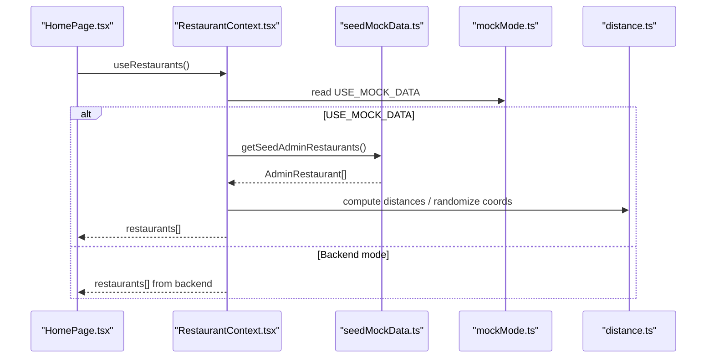
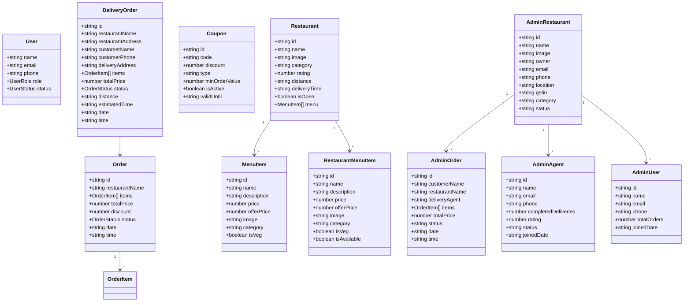
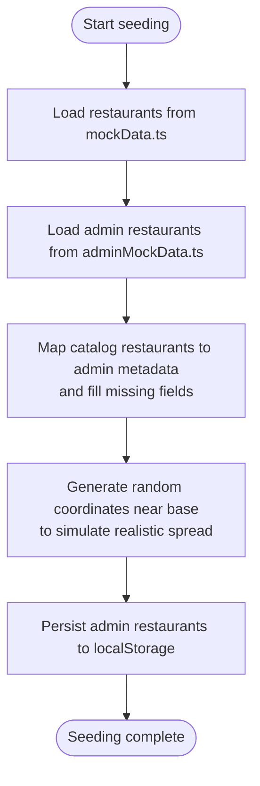
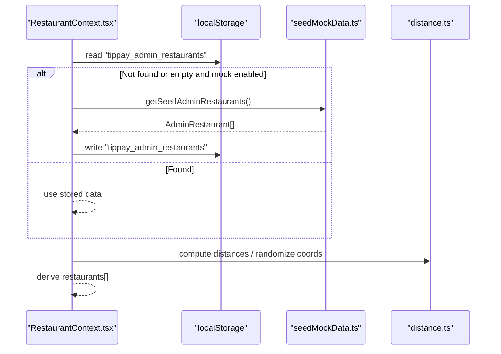
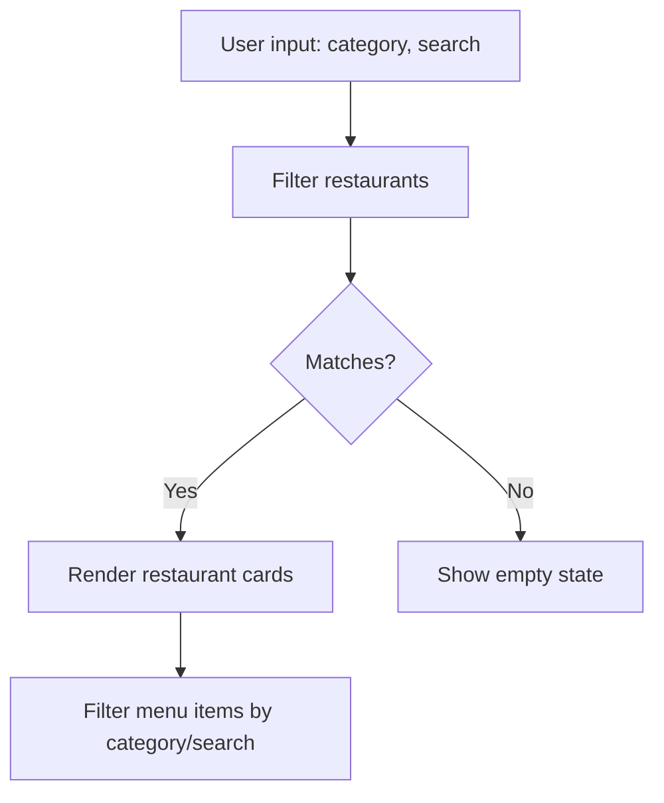
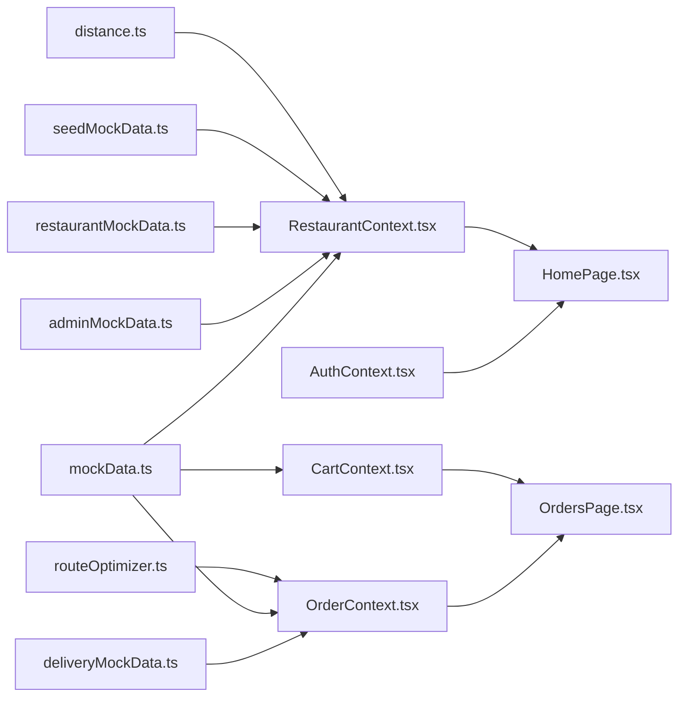

# Data Management

<cite>
**Referenced Files in This Document**
- [mockData.ts](file://src/data/mockData.ts)
- [adminMockData.ts](file://src/data/adminMockData.ts)
- [restaurantMockData.ts](file://src/data/restaurantMockData.ts)
- [deliveryMockData.ts](file://src/data/deliveryMockData.ts)
- [seedMockData.ts](file://src/data/seedMockData.ts)
- [mockMode.ts](file://src/config/mockMode.ts)
- [AuthContext.tsx](file://src/context/AuthContext.tsx)
- [RestaurantContext.tsx](file://src/context/RestaurantContext.tsx)
- [OrderContext.tsx](file://src/context/OrderContext.tsx)
- [CartContext.tsx](file://src/context/CartContext.tsx)
- [HomePage.tsx](file://src/pages/HomePage.tsx)
- [OrdersPage.tsx](file://src/pages/OrdersPage.tsx)
- [distance.ts](file://src/utils/distance.ts)
- [routeOptimizer.ts](file://src/utils/routeOptimizer.ts)
</cite>

## Table of Contents
1. [Introduction](#introduction)
2. [Project Structure](#project-structure)
3. [Core Components](#core-components)
4. [Architecture Overview](#architecture-overview)
5. [Detailed Component Analysis](#detailed-component-analysis)
6. [Dependency Analysis](#dependency-analysis)
7. [Performance Considerations](#performance-considerations)
8. [Troubleshooting Guide](#troubleshooting-guide)
9. [Conclusion](#conclusion)
10. [Appendices](#appendices)

## Introduction
This document describes TIPPAY’s data management system with a focus on mock data architecture and data models. It explains how mock data structures support different user roles (customer, restaurant, delivery agent, admin), how data is seeded and transformed, and how these mocks integrate with contexts and UI pages. It also documents data models, validation patterns, type definitions, transformation utilities, and the relationship between mock data and potential future backend integration.

## Project Structure
The data management layer is organized around:
- Data models and mock catalogs under src/data
- Role-aware contexts under src/context
- Utilities for geolocation and routing under src/utils
- Pages that consume contexts and render data under src/pages

**Diagram sources**
- [mockData.ts:13-326](file://src/data/mockData.ts#L13-L326)
- [adminMockData.ts:8-101](file://src/data/adminMockData.ts#L8-L101)
- [restaurantMockData.ts:4-215](file://src/data/restaurantMockData.ts#L4-L215)
- [deliveryMockData.ts:3-134](file://src/data/deliveryMockData.ts#L3-L134)
- [seedMockData.ts:1-50](file://src/data/seedMockData.ts#L1-L50)
- [RestaurantContext.tsx:36-162](file://src/context/RestaurantContext.tsx#L36-L162)
- [OrderContext.tsx:41-138](file://src/context/OrderContext.tsx#L41-L138)
- [CartContext.tsx:22-64](file://src/context/CartContext.tsx#L22-L64)
- [AuthContext.tsx:40-130](file://src/context/AuthContext.tsx#L40-L130)
- [HomePage.tsx:41-52](file://src/pages/HomePage.tsx#L41-L52)
- [OrdersPage.tsx:32-44](file://src/pages/OrdersPage.tsx#L32-L44)
- [distance.ts:1-34](file://src/utils/distance.ts#L1-L34)
- [routeOptimizer.ts:53-195](file://src/utils/routeOptimizer.ts#L53-L195)

**Section sources**
- [mockData.ts:13-326](file://src/data/mockData.ts#L13-L326)
- [adminMockData.ts:8-101](file://src/data/adminMockData.ts#L8-L101)
- [restaurantMockData.ts:4-215](file://src/data/restaurantMockData.ts#L4-L215)
- [deliveryMockData.ts:3-134](file://src/data/deliveryMockData.ts#L3-L134)
- [seedMockData.ts:1-50](file://src/data/seedMockData.ts#L1-L50)
- [RestaurantContext.tsx:36-162](file://src/context/RestaurantContext.tsx#L36-L162)
- [OrderContext.tsx:41-138](file://src/context/OrderContext.tsx#L41-L138)
- [CartContext.tsx:22-64](file://src/context/CartContext.tsx#L22-L64)
- [AuthContext.tsx:40-130](file://src/context/AuthContext.tsx#L40-L130)
- [HomePage.tsx:41-52](file://src/pages/HomePage.tsx#L41-L52)
- [OrdersPage.tsx:32-44](file://src/pages/OrdersPage.tsx#L32-L44)
- [distance.ts:1-34](file://src/utils/distance.ts#L1-L34)
- [routeOptimizer.ts:53-195](file://src/utils/routeOptimizer.ts#L53-L195)

## Core Components
- Data models and catalogs:
  - Users, restaurants, menu items, orders, coupons, categories, hot deals
  - Admin-specific entities: restaurants, orders, agents, users, overview metrics
  - Restaurant-specific entities: menu items, orders, analytics
  - Delivery-specific entities: orders, agent stats
- Seeding utilities:
  - Combine catalog and admin data to produce consistent mock datasets
- Contexts:
  - Authentication, restaurant discovery, order lifecycle, cart
- Utilities:
  - Distance calculation and coordinate generation
  - Route optimization for delivery agents

**Section sources**
- [mockData.ts:13-326](file://src/data/mockData.ts#L13-L326)
- [adminMockData.ts:8-101](file://src/data/adminMockData.ts#L8-L101)
- [restaurantMockData.ts:4-215](file://src/data/restaurantMockData.ts#L4-L215)
- [deliveryMockData.ts:3-134](file://src/data/deliveryMockData.ts#L3-L134)
- [seedMockData.ts:10-50](file://src/data/seedMockData.ts#L10-L50)
- [AuthContext.tsx:6-27](file://src/context/AuthContext.tsx#L6-L27)
- [RestaurantContext.tsx:21-32](file://src/context/RestaurantContext.tsx#L21-L32)
- [OrderContext.tsx:11-25](file://src/context/OrderContext.tsx#L11-L25)
- [CartContext.tsx:4-18](file://src/context/CartContext.tsx#L4-L18)
- [distance.ts:1-34](file://src/utils/distance.ts#L1-L34)
- [routeOptimizer.ts:1-195](file://src/utils/routeOptimizer.ts#L1-L195)

## Architecture Overview
The mock data architecture is role-centric and context-driven:
- Mock catalogs define typed models and sample data.
- Seed utilities merge catalogs into coherent datasets for admin and restaurant views.
- Contexts manage state and derive computed data (e.g., restaurants from admin + catalog).
- Pages filter, sort, and present data to users.

**Diagram sources**
- [HomePage.tsx:36-52](file://src/pages/HomePage.tsx#L36-L52)
- [RestaurantContext.tsx:36-162](file://src/context/RestaurantContext.tsx#L36-L162)
- [seedMockData.ts:11-36](file://src/data/seedMockData.ts#L11-L36)
- [mockMode.ts:1-3](file://src/config/mockMode.ts#L1-L3)
- [distance.ts:1-34](file://src/utils/distance.ts#L1-L34)

## Detailed Component Analysis

### Data Models and Mock Catalogs
- Users: role-based profiles with status and metadata.
- Restaurants: metadata, open status, delivery info, and menu items.
- Menu Items: pricing, availability, dietary flags, images.
- Orders: lifecycle tracking, items, totals, timestamps.
- Coupons: discount rules persisted in local storage.
- Admin entities: restaurants, orders, agents, users, overview metrics.
- Restaurant-specific: orders, menu items, analytics.
- Delivery-specific: orders, agent stats.

**Diagram sources**
- [mockData.ts:13-326](file://src/data/mockData.ts#L13-L326)
- [adminMockData.ts:8-101](file://src/data/adminMockData.ts#L8-L101)
- [restaurantMockData.ts:4-215](file://src/data/restaurantMockData.ts#L4-L215)
- [deliveryMockData.ts:3-134](file://src/data/deliveryMockData.ts#L3-L134)

**Section sources**
- [mockData.ts:13-326](file://src/data/mockData.ts#L13-L326)
- [adminMockData.ts:8-101](file://src/data/adminMockData.ts#L8-L101)
- [restaurantMockData.ts:4-215](file://src/data/restaurantMockData.ts#L4-L215)
- [deliveryMockData.ts:3-134](file://src/data/deliveryMockData.ts#L3-L134)

### Mock Data Seeding and Transformation
- Admin restaurants are derived from catalog restaurants and admin metadata, with randomized coordinates near a base location.
- Menu items are merged from catalog and restaurant-specific lists, deduplicated by ID.
- Local persistence ensures continuity across sessions.

**Diagram sources**
- [seedMockData.ts:11-36](file://src/data/seedMockData.ts#L11-L36)
- [distance.ts:20-33](file://src/utils/distance.ts#L20-L33)

**Section sources**
- [seedMockData.ts:10-50](file://src/data/seedMockData.ts#L10-L50)
- [distance.ts:1-34](file://src/utils/distance.ts#L1-L34)

### Context Integration and Data Access Patterns
- RestaurantContext:
  - Loads admin restaurants and menu items from localStorage or seeds them when mock mode is enabled.
  - Computes distances and randomizes coordinates based on user location.
  - Derives restaurant list from admin-approved restaurants and merges with catalog or menu items.
- OrderContext:
  - Manages live order lifecycle with status transitions and scheduling.
  - Provides cancellation and retrieval helpers.
- CartContext:
  - Tracks cart items, quantities, and totals, including offer pricing.
- AuthContext:
  - Defines user roles and statuses, persists users to localStorage.

**Diagram sources**
- [RestaurantContext.tsx:37-74](file://src/context/RestaurantContext.tsx#L37-L74)
- [seedMockData.ts:11-36](file://src/data/seedMockData.ts#L11-L36)
- [distance.ts:1-34](file://src/utils/distance.ts#L1-L34)

**Section sources**
- [RestaurantContext.tsx:36-162](file://src/context/RestaurantContext.tsx#L36-L162)
- [OrderContext.tsx:41-138](file://src/context/OrderContext.tsx#L41-L138)
- [CartContext.tsx:22-64](file://src/context/CartContext.tsx#L22-L64)
- [AuthContext.tsx:40-130](file://src/context/AuthContext.tsx#L40-L130)

### Filtering and Presentation Patterns
- Home page filters restaurants by category and search query, and further filters menu items per restaurant.
- Orders page aggregates live orders and historical orders, displaying status with icons and colors.

**Diagram sources**
- [HomePage.tsx:41-52](file://src/pages/HomePage.tsx#L41-L52)

**Section sources**
- [HomePage.tsx:41-52](file://src/pages/HomePage.tsx#L41-L52)
- [OrdersPage.tsx:32-44](file://src/pages/OrdersPage.tsx#L32-L44)

### Data Validation and Type Safety
- Strict TypeScript interfaces define shapes for all entities.
- Enums and unions constrain status values and roles.
- Local storage reads include defensive parsing to avoid runtime errors.

**Section sources**
- [mockData.ts:49-55](file://src/data/mockData.ts#L49-L55)
- [AuthContext.tsx:3-16](file://src/context/AuthContext.tsx#L3-L16)
- [RestaurantContext.tsx:11-19](file://src/context/RestaurantContext.tsx#L11-L19)

### Data Generation Patterns and Persistence
- Coupons are initialized from localStorage or defaults and saved back to localStorage.
- Orders are generated with deterministic IDs and status timelines in mock mode.

**Section sources**
- [mockData.ts:314-325](file://src/data/mockData.ts#L314-L325)
- [OrderContext.tsx:105-120](file://src/context/OrderContext.tsx#L105-L120)

### Relationship to Backend Integration
- Mock mode flag controls whether to use seeded mock data or backend-backed data.
- When backend is enabled, contexts still expose the same APIs; mock data acts as a fallback.

**Section sources**
- [mockMode.ts:1-3](file://src/config/mockMode.ts#L1-L3)
- [RestaurantContext.tsx:37-47](file://src/context/RestaurantContext.tsx#L37-L47)

### Examples of Data Access, Filtering, and Manipulation
- Accessing restaurants and filtering by category/search:
  - [HomePage.tsx:41-52](file://src/pages/HomePage.tsx#L41-L52)
- Aggregating live and historical orders:
  - [OrdersPage.tsx:32-44](file://src/pages/OrdersPage.tsx#L32-L44)
- Managing cart items and totals:
  - [CartContext.tsx:25-50](file://src/context/CartContext.tsx#L25-L50)
- Advancing order status and scheduling:
  - [OrderContext.tsx:66-97](file://src/context/OrderContext.tsx#L66-L97)

## Dependency Analysis
The following diagram shows key dependencies among data modules and contexts.

**Diagram sources**
- [mockData.ts:13-326](file://src/data/mockData.ts#L13-L326)
- [adminMockData.ts:8-101](file://src/data/adminMockData.ts#L8-L101)
- [restaurantMockData.ts:4-215](file://src/data/restaurantMockData.ts#L4-L215)
- [deliveryMockData.ts:3-134](file://src/data/deliveryMockData.ts#L3-L134)
- [seedMockData.ts:1-50](file://src/data/seedMockData.ts#L1-L50)
- [RestaurantContext.tsx:36-162](file://src/context/RestaurantContext.tsx#L36-L162)
- [OrderContext.tsx:41-138](file://src/context/OrderContext.tsx#L41-L138)
- [CartContext.tsx:22-64](file://src/context/CartContext.tsx#L22-L64)
- [AuthContext.tsx:40-130](file://src/context/AuthContext.tsx#L40-L130)
- [HomePage.tsx:36-52](file://src/pages/HomePage.tsx#L36-L52)
- [OrdersPage.tsx:23-26](file://src/pages/OrdersPage.tsx#L23-L26)
- [distance.ts:1-34](file://src/utils/distance.ts#L1-L34)
- [routeOptimizer.ts:53-195](file://src/utils/routeOptimizer.ts#L53-L195)

**Section sources**
- [RestaurantContext.tsx:36-162](file://src/context/RestaurantContext.tsx#L36-L162)
- [OrderContext.tsx:41-138](file://src/context/OrderContext.tsx#L41-L138)
- [CartContext.tsx:22-64](file://src/context/CartContext.tsx#L22-L64)
- [HomePage.tsx:36-52](file://src/pages/HomePage.tsx#L36-L52)
- [OrdersPage.tsx:23-26](file://src/pages/OrdersPage.tsx#L23-L26)
- [distance.ts:1-34](file://src/utils/distance.ts#L1-L34)
- [routeOptimizer.ts:53-195](file://src/utils/routeOptimizer.ts#L53-L195)

## Performance Considerations
- Filtering and sorting are performed in-memory; keep dataset sizes reasonable for large lists.
- Status transitions in OrderContext use timeouts; ensure cleanup on unmount to prevent memory leaks.
- Distance computations and route optimization are lightweight for demo; avoid heavy computations on large datasets in production.

[No sources needed since this section provides general guidance]

## Troubleshooting Guide
- If restaurants do not appear:
  - Verify mock mode is enabled and admin restaurants are seeded.
  - Check that user location is set so distances can be computed.
  - Confirm localStorage persistence of admin restaurants and menu items.
- If orders do not advance:
  - Ensure OrderContext timers are active and not cleared prematurely.
  - Verify status flow array and delays align with expectations.
- If coupons do not persist:
  - Confirm localStorage writes succeed and parse safely on load.

**Section sources**
- [RestaurantContext.tsx:37-74](file://src/context/RestaurantContext.tsx#L37-L74)
- [OrderContext.tsx:99-103](file://src/context/OrderContext.tsx#L99-L103)
- [mockData.ts:314-325](file://src/data/mockData.ts#L314-L325)

## Conclusion
TIPPAY’s mock data system provides a robust, role-aware foundation for development and testing. Typed models, seeding utilities, and context-driven state management enable consistent experiences across customer, restaurant, delivery, and admin roles. The design cleanly separates concerns and can be adapted to integrate with a real backend while preserving the same APIs and data contracts.

## Appendices

### Data Models Reference
- Users: [User:6-16](file://src/context/AuthContext.tsx#L6-L16)
- Restaurants: [Restaurant:24-36](file://src/data/mockData.ts#L24-L36)
- Menu Items: [MenuItem:13-22](file://src/data/mockData.ts#L13-L22)
- Orders: [Order:38-47](file://src/data/mockData.ts#L38-L47), [OrderStatus:49-55](file://src/data/mockData.ts#L49-L55)
- Coupons: [Coupon:304-312](file://src/data/mockData.ts#L304-L312)
- Admin Restaurants: [AdminRestaurant:8-22](file://src/data/adminMockData.ts#L8-L22)
- Admin Orders: [AdminOrder:24-34](file://src/data/adminMockData.ts#L24-L34)
- Admin Agents: [AdminAgent:36-45](file://src/data/adminMockData.ts#L36-L45)
- Admin Users: [AdminUser:47-54](file://src/data/adminMockData.ts#L47-L54)
- Restaurant Menu Items: [RestaurantMenuItem:4-14](file://src/data/restaurantMockData.ts#L4-L14)
- Restaurant Orders: [RestaurantOrder:16-20](file://src/data/restaurantMockData.ts#L16-L20)
- Delivery Orders: [DeliveryOrder:3-17](file://src/data/deliveryMockData.ts#L3-L17)

### Mock Mode and Integration
- Toggle mock mode via environment variable:
  - [mockMode.ts:1-3](file://src/config/mockMode.ts#L1-L3)
- Contexts conditionally seed or persist data:
  - [RestaurantContext.tsx:37-74](file://src/context/RestaurantContext.tsx#L37-L74)
- Order lifecycle and cart operations:
  - [OrderContext.tsx:41-138](file://src/context/OrderContext.tsx#L41-L138)
  - [CartContext.tsx:22-64](file://src/context/CartContext.tsx#L22-L64)