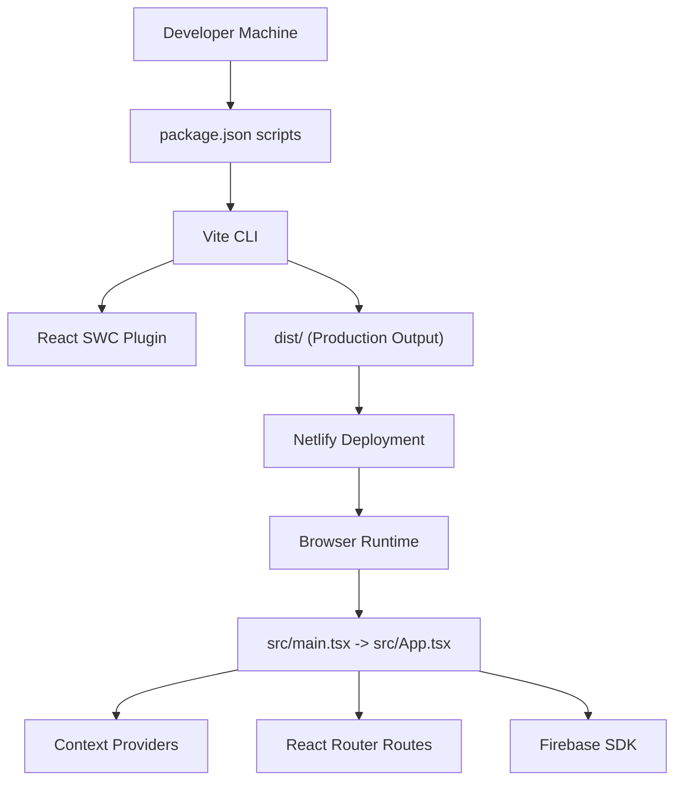
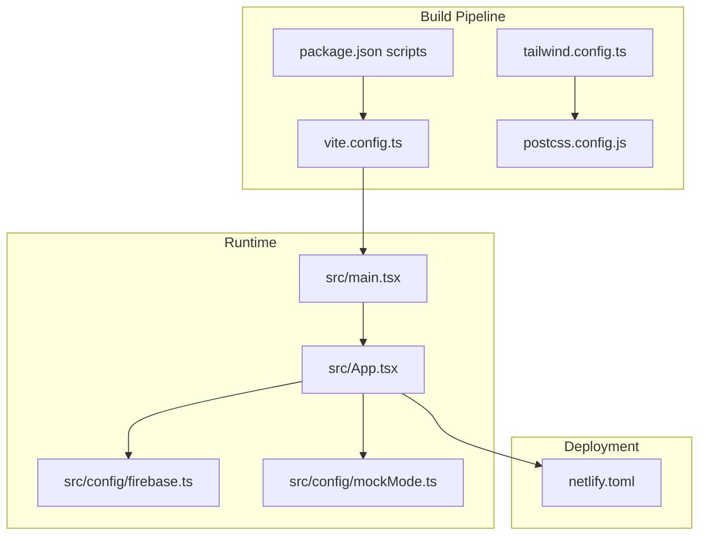
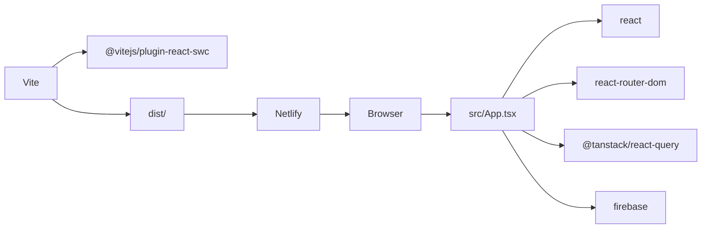

# Deployment & Production

<cite>
**Referenced Files in This Document**
- [vite.config.ts](file://vite.config.ts)
- [package.json](file://package.json)
- [netlify.toml](file://netlify.toml)
- [tailwind.config.ts](file://tailwind.config.ts)
- [postcss.config.js](file://postcss.config.js)
- [src/config/firebase.ts](file://src/config/firebase.ts)
- [src/config/mockMode.ts](file://src/config/mockMode.ts)
- [src/main.tsx](file://src/main.tsx)
- [src/App.tsx](file://src/App.tsx)
- [index.html](file://index.html)
- [vitest.config.ts](file://vitest.config.ts)
- [eslint.config.js](file://eslint.config.js)
- [tsconfig.json](file://tsconfig.json)
</cite>

## Table of Contents
1. [Introduction](#introduction)
2. [Project Structure](#project-structure)
3. [Core Components](#core-components)
4. [Architecture Overview](#architecture-overview)
5. [Detailed Component Analysis](#detailed-component-analysis)
6. [Dependency Analysis](#dependency-analysis)
7. [Performance Considerations](#performance-considerations)
8. [Troubleshooting Guide](#troubleshooting-guide)
9. [Conclusion](#conclusion)
10. [Appendices](#appendices)

## Introduction
This document provides comprehensive guidance for deploying TIPPAY and optimizing it for production. It covers the Vite build process, environment-specific configurations, deployment options (Netlify), CI/CD integration, production performance optimization (code splitting, lazy loading, bundle analysis), environment variable management, API and security considerations, monitoring and error tracking, and operational procedures for troubleshooting, rollbacks, and maintenance.

## Project Structure
TIPPAY is a Vite + React + TypeScript application configured with Tailwind CSS and PostCSS. Build scripts and environment variables are managed via package.json and Netlify configuration. The runtime reads environment variables prefixed with VITE_ and supports a mock mode toggle.

**Diagram sources**
- [package.json:6-16](file://package.json#L6-L16)
- [vite.config.ts:6-20](file://vite.config.ts#L6-L20)
- [src/main.tsx:1-11](file://src/main.tsx#L1-L11)
- [src/App.tsx:126-167](file://src/App.tsx#L126-L167)
- [src/config/firebase.ts:1-28](file://src/config/firebase.ts#L1-L28)

**Section sources**
- [package.json:6-16](file://package.json#L6-L16)
- [vite.config.ts:6-20](file://vite.config.ts#L6-L20)
- [index.html:14-18](file://index.html#L14-L18)

## Core Components
- Build and dev server configuration: Vite configuration defines the dev server host/port, HMR overlay, plugin chain, and path aliases.
- Scripts and modes: npm scripts support development, preview, tests, and multiple build modes (including mock mode).
- Styling pipeline: Tailwind CSS and PostCSS are configured for content scanning and autoprefixing.
- Environment variables: VITE_* variables are exposed to the browser; mock mode is controlled via VITE_USE_MOCK_DATA.
- Routing and providers: App wraps routes and context providers; splash screen is rendered during initialization.

**Section sources**
- [vite.config.ts:6-20](file://vite.config.ts#L6-L20)
- [package.json:6-16](file://package.json#L6-L16)
- [tailwind.config.ts:3-122](file://tailwind.config.ts#L3-L122)
- [postcss.config.js:1-7](file://postcss.config.js#L1-L7)
- [src/config/mockMode.ts:1-3](file://src/config/mockMode.ts#L1-L3)
- [src/main.tsx:1-11](file://src/main.tsx#L1-L11)
- [src/App.tsx:126-167](file://src/App.tsx#L126-L167)

## Architecture Overview
The production runtime initializes Firebase, sets up React Query, and mounts the routed application with multiple context providers. The build pipeline produces optimized static assets for deployment.

**Diagram sources**
- [vite.config.ts:6-20](file://vite.config.ts#L6-L20)
- [package.json:6-16](file://package.json#L6-L16)
- [tailwind.config.ts:3-122](file://tailwind.config.ts#L3-L122)
- [postcss.config.js:1-7](file://postcss.config.js#L1-L7)
- [src/main.tsx:1-11](file://src/main.tsx#L1-L11)
- [src/App.tsx:126-167](file://src/App.tsx#L126-L167)
- [src/config/firebase.ts:1-28](file://src/config/firebase.ts#L1-L28)
- [src/config/mockMode.ts:1-3](file://src/config/mockMode.ts#L1-L3)
- [netlify.toml:1-8](file://netlify.toml#L1-L8)

## Detailed Component Analysis

### Vite Build Configuration
- Dev server: Host and port are configurable; HMR overlay is disabled for cleaner production builds.
- Plugins: React SWC plugin is enabled; path aliases resolve @ to src.
- Implications: Fast rebuilds during development; predictable alias resolution in production builds.

**Section sources**
- [vite.config.ts:6-20](file://vite.config.ts#L6-L20)

### Build Scripts and Modes
- Scripts: dev, preview, lint, test, and multiple build variants including mock and development modes.
- Modes: --mode controls Vite’s mode; mock mode toggles mock data usage via VITE_USE_MOCK_DATA.

**Section sources**
- [package.json:6-16](file://package.json#L6-L16)
- [src/config/mockMode.ts:1-3](file://src/config/mockMode.ts#L1-L3)

### Styling Pipeline (Tailwind + PostCSS)
- Tailwind: Content paths scan components and pages; animations plugin is included.
- PostCSS: Tailwind and Autoprefixer are applied.

**Section sources**
- [tailwind.config.ts:3-122](file://tailwind.config.ts#L3-L122)
- [postcss.config.js:1-7](file://postcss.config.js#L1-L7)

### Environment Variables and Mock Mode
- Vite exposes variables prefixed with VITE_ to the browser.
- Mock mode: When VITE_USE_MOCK_DATA is not "false", the app uses mock data and seeding logic.

**Section sources**
- [src/config/mockMode.ts:1-3](file://src/config/mockMode.ts#L1-L3)
- [netlify.toml:5-8](file://netlify.toml#L5-L8)

### Firebase Initialization
- Initializes Firebase app, analytics, auth, Firestore, and storage.
- Ensure secrets are managed via environment variables or service accounts in production deployments.

**Section sources**
- [src/config/firebase.ts:1-28](file://src/config/firebase.ts#L1-L28)

### Application Bootstrap and Providers
- main.tsx initializes theme and mounts the root React element.
- App.tsx composes routing, context providers, and UI components; includes protected routes and role-based navigation.

**Section sources**
- [src/main.tsx:1-11](file://src/main.tsx#L1-L11)
- [src/App.tsx:126-167](file://src/App.tsx#L126-L167)

### Netlify Deployment Configuration
- Build command and publish directory are defined.
- Environment variables: Node.js version and VITE_USE_MOCK_DATA are set for the build environment.

**Section sources**
- [netlify.toml:1-8](file://netlify.toml#L1-L8)

### Testing and Linting Setup
- Vitest config: jsdom environment, global setup, and alias resolution.
- ESLint: TypeScript recommended rules with React Hooks and React Refresh plugins.

**Section sources**
- [vitest.config.ts:1-17](file://vitest.config.ts#L1-L17)
- [eslint.config.js:1-27](file://eslint.config.js#L1-L27)

### TypeScript Path Mapping
- Path aliases configured for @/* to src/* in tsconfig and Vite configs.

**Section sources**
- [tsconfig.json:7-11](file://tsconfig.json#L7-L11)
- [vite.config.ts:15-19](file://vite.config.ts#L15-L19)

## Dependency Analysis
The build depends on Vite, React SWC plugin, Tailwind CSS, and PostCSS. Runtime dependencies include React, React Router, React Query, and Firebase. The Netlify configuration ties the build command to the dist output.

**Diagram sources**
- [vite.config.ts:6-20](file://vite.config.ts#L6-L20)
- [package.json:17-70](file://package.json#L17-L70)
- [netlify.toml:1-8](file://netlify.toml#L1-L8)
- [src/App.tsx:126-167](file://src/App.tsx#L126-L167)
- [src/config/firebase.ts:1-28](file://src/config/firebase.ts#L1-L28)

**Section sources**
- [package.json:17-70](file://package.json#L17-L70)
- [vite.config.ts:6-20](file://vite.config.ts#L6-L20)
- [netlify.toml:1-8](file://netlify.toml#L1-L8)

## Performance Considerations
- Code splitting and lazy loading
  - Split routes and heavy components to reduce initial bundle size. Use dynamic imports for dashboard sections and feature-heavy pages.
  - Lazy-load images and third-party widgets after initial render.
- Bundle analysis
  - Integrate a Vite plugin for bundle visualization (e.g., vite-bundle-analyzer) to identify large dependencies and optimize tree-shaking.
- Asset optimization
  - Enable compression in Netlify (gzip/brotli) via configuration if needed; ensure Tailwind purges unused styles in production.
- Build-time optimizations
  - Prefer React SWC for faster transforms; keep dev server HMR overlay disabled for production builds.
- Runtime performance
  - Use React Query cache effectively; avoid unnecessary re-renders by memoizing props and using React.useMemo/useCallback.
  - Defer non-critical features until after the splash screen completes.

[No sources needed since this section provides general guidance]

## Troubleshooting Guide
- Build fails on Netlify
  - Verify the build command matches the script and that the publish directory is dist.
  - Confirm Node.js version compatibility and environment variables are present.
- Mock mode unexpected behavior
  - Ensure VITE_USE_MOCK_DATA is set appropriately in the build environment.
- Firebase initialization errors
  - Validate environment variables and credentials; avoid embedding secrets in client-side code.
- Routing issues after deployment
  - Confirm base routing and history mode considerations for SPA hosting; ensure fallback to index.html is configured.
- Performance regressions
  - Run bundle analysis and review Tailwind purge settings; audit slow route components.

**Section sources**
- [netlify.toml:1-8](file://netlify.toml#L1-L8)
- [src/config/mockMode.ts:1-3](file://src/config/mockMode.ts#L1-L3)
- [src/config/firebase.ts:1-28](file://src/config/firebase.ts#L1-L28)
- [index.html:14-18](file://index.html#L14-L18)

## Conclusion
TIPPAY’s build and deployment rely on Vite, React, and Netlify. By leveraging environment variables, mock mode, and a clean build pipeline, teams can deploy reliably and optimize performance through code splitting, lazy loading, and bundle analysis. Establish CI/CD, monitoring, and rollback procedures to maintain a robust production environment.

[No sources needed since this section summarizes without analyzing specific files]

## Appendices

### A. Build and Deploy Checklist
- Local build: run the production build script and preview locally.
- Environment variables: confirm VITE_* variables and mock mode flag.
- Netlify: verify build command, publish directory, and environment variables.
- CI/CD: automate builds and deploys on branch protection rules.
- Monitoring: integrate analytics and error tracking in production.
- Rollback: tag releases and preserve previous dist artifacts for quick rollback.

[No sources needed since this section provides general guidance]

### B. Environment Variable Reference
- VITE_USE_MOCK_DATA: enables mock data mode when not "false".
- NODE_VERSION: pinned for reproducible builds on Netlify.

**Section sources**
- [src/config/mockMode.ts:1-3](file://src/config/mockMode.ts#L1-L3)
- [netlify.toml:5-8](file://netlify.toml#L5-L8)

### C. Example CI/CD Workflow Outline
- Trigger: push to main branch.
- Steps: install dependencies, lint, test, build, preview, deploy to staging/production, notify on failure.
- Artifacts: retain dist for rollback.

[No sources needed since this section provides general guidance]