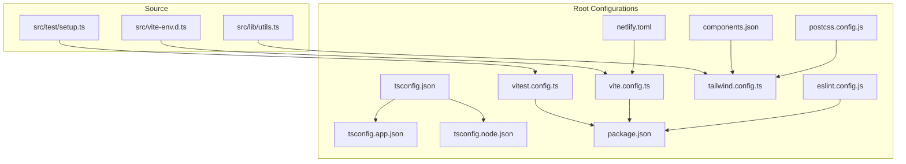
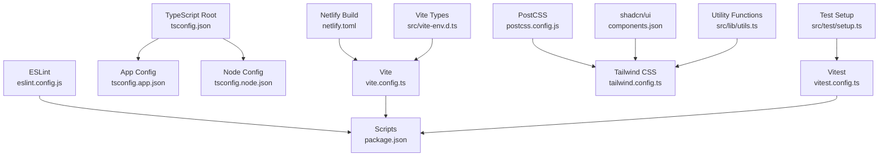
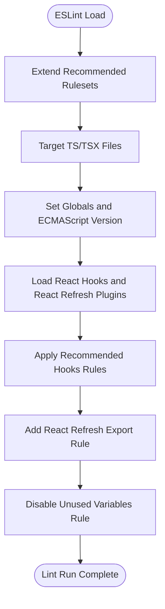
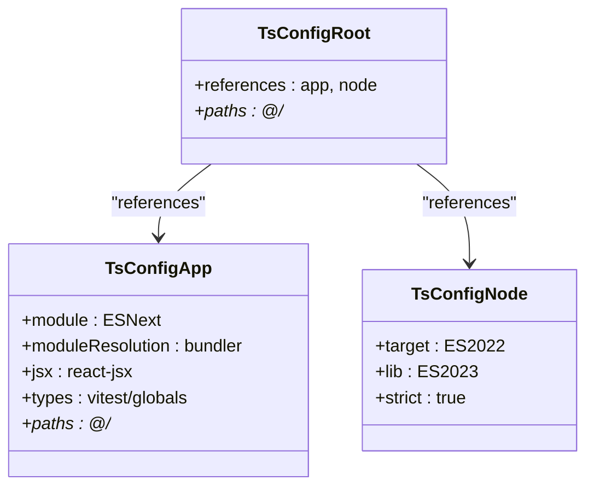
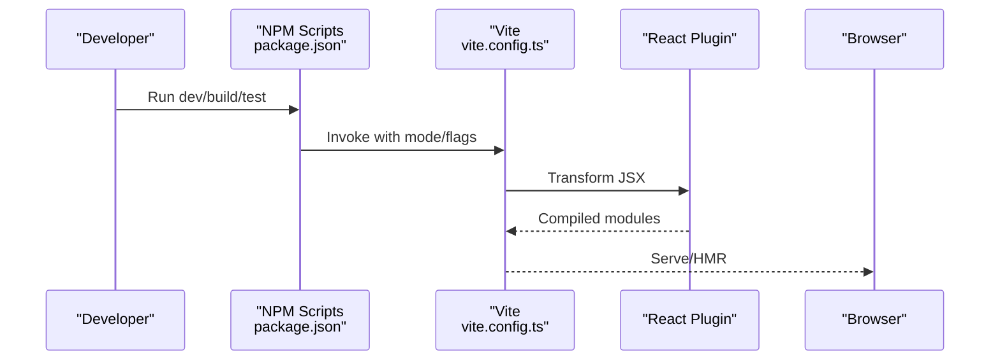
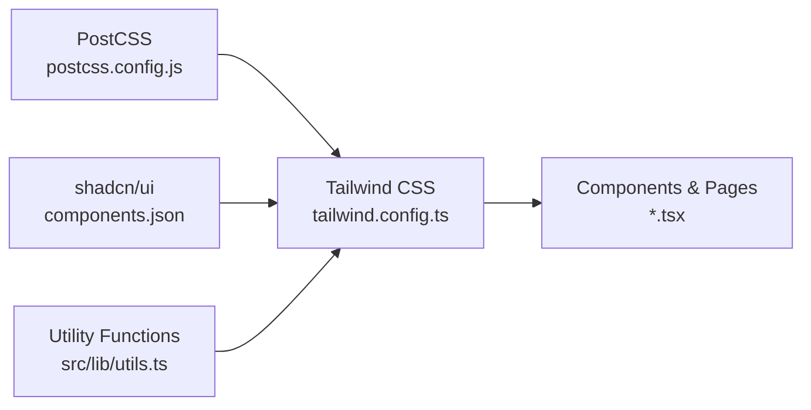
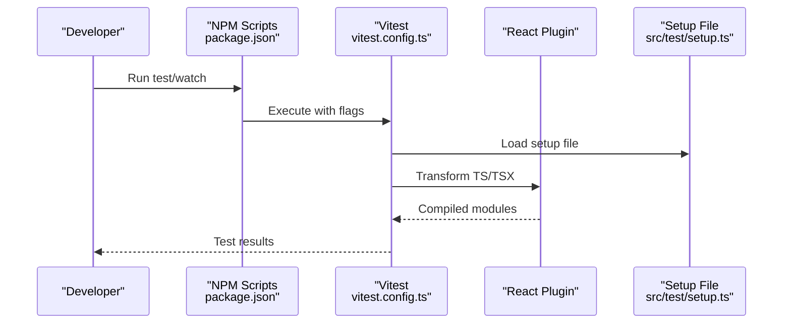
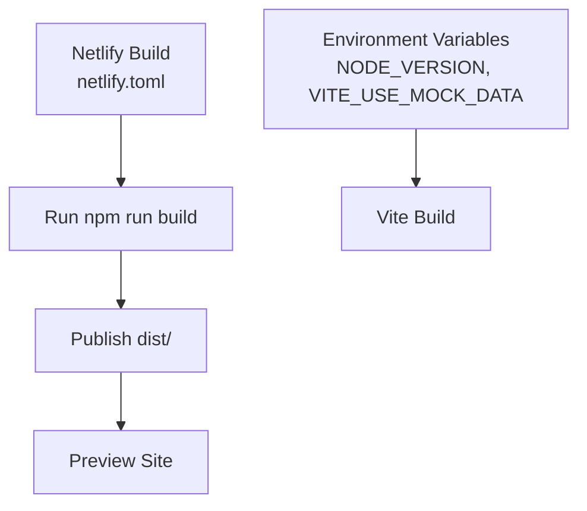
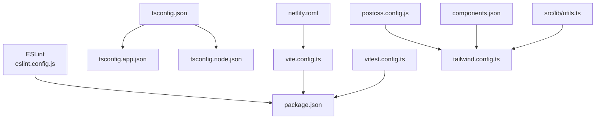

# Development Tools & Configuration

<cite>
**Referenced Files in This Document**
- [eslint.config.js](file://eslint.config.js)
- [tsconfig.json](file://tsconfig.json)
- [tsconfig.app.json](file://tsconfig.app.json)
- [tsconfig.node.json](file://tsconfig.node.json)
- [vite.config.ts](file://vite.config.ts)
- [postcss.config.js](file://postcss.config.js)
- [tailwind.config.ts](file://tailwind.config.ts)
- [components.json](file://components.json)
- [package.json](file://package.json)
- [vitest.config.ts](file://vitest.config.ts)
- [netlify.toml](file://netlify.toml)
- [src/vite-env.d.ts](file://src/vite-env.d.ts)
- [src/lib/utils.ts](file://src/lib/utils.ts)
- [src/test/setup.ts](file://src/test/setup.ts)
</cite>

## Table of Contents
1. [Introduction](#introduction)
2. [Project Structure](#project-structure)
3. [Core Components](#core-components)
4. [Architecture Overview](#architecture-overview)
5. [Detailed Component Analysis](#detailed-component-analysis)
6. [Dependency Analysis](#dependency-analysis)
7. [Performance Considerations](#performance-considerations)
8. [Troubleshooting Guide](#troubleshooting-guide)
9. [Conclusion](#conclusion)
10. [Appendices](#appendices)

## Introduction
This document explains TIPPAY’s development tools and configuration to ensure consistent code quality, predictable builds, and efficient workflows. It covers ESLint configuration (rules, TypeScript integration, and custom linting), TypeScript compiler settings (paths, strictness, and targets), Vite build configuration (plugins, environment modes, and aliases), PostCSS and Tailwind CSS setup, and the shadcn/ui component library configuration. Guidance is included for extending configurations, adding new tools, and keeping the development environment aligned across team members.

## Project Structure
The project uses a modern React + TypeScript stack with Vite for dev/build, ESLint for linting, Vitest for unit testing, and Tailwind CSS with shadcn/ui components. Key configuration files live at the repository root, while TypeScript references split app and node tooling into separate configs.



**Diagram sources**
- [eslint.config.js:1-27](file://eslint.config.js#L1-L27)
- [tsconfig.json:1-24](file://tsconfig.json#L1-L24)
- [tsconfig.app.json:1-35](file://tsconfig.app.json#L1-L35)
- [tsconfig.node.json:1-23](file://tsconfig.node.json#L1-L23)
- [vite.config.ts:1-21](file://vite.config.ts#L1-L21)
- [postcss.config.js:1-7](file://postcss.config.js#L1-L7)
- [tailwind.config.ts:1-123](file://tailwind.config.ts#L1-L123)
- [components.json:1-21](file://components.json#L1-L21)
- [package.json:1-94](file://package.json#L1-L94)
- [vitest.config.ts:1-17](file://vitest.config.ts#L1-L17)
- [netlify.toml:1-8](file://netlify.toml#L1-L8)
- [src/vite-env.d.ts:1-2](file://src/vite-env.d.ts#L1-L2)
- [src/lib/utils.ts:1-7](file://src/lib/utils.ts#L1-L7)
- [src/test/setup.ts:1-16](file://src/test/setup.ts#L1-L16)

**Section sources**
- [package.json:1-94](file://package.json#L1-L94)
- [tsconfig.json:1-24](file://tsconfig.json#L1-L24)
- [vite.config.ts:1-21](file://vite.config.ts#L1-L21)
- [postcss.config.js:1-7](file://postcss.config.js#L1-L7)
- [tailwind.config.ts:1-123](file://tailwind.config.ts#L1-L123)
- [components.json:1-21](file://components.json#L1-L21)
- [vitest.config.ts:1-17](file://vitest.config.ts#L1-L17)
- [netlify.toml:1-8](file://netlify.toml#L1-L8)
- [src/vite-env.d.ts:1-2](file://src/vite-env.d.ts#L1-L2)
- [src/lib/utils.ts:1-7](file://src/lib/utils.ts#L1-L7)
- [src/test/setup.ts:1-16](file://src/test/setup.ts#L1-L16)

## Core Components
- ESLint configuration defines recommended base rules, TypeScript-specific rules, React Hooks plugin, and React Refresh plugin. It disables certain unused-variable checks and adds a custom rule for export behavior during development.
- TypeScript configuration splits into three files: a root config referencing app and node configs, an app config optimized for bundler resolution and JSX runtime, and a node config for tooling scripts.
- Vite configuration enables React SWC plugin, sets up a local dev server with HMR, and aliases imports to the src directory via path aliases.
- PostCSS configuration activates Tailwind CSS and Autoprefixer for CSS processing.
- Tailwind CSS configuration defines dark mode strategy, content scanning globs, theme extensions (fonts, colors, animations), and plugin integrations.
- shadcn/ui configuration maps aliases for components, utilities, UI primitives, lib, and hooks to the src tree and points to the Tailwind config and CSS file.
- Vitest configuration aligns with Vite’s React plugin and aliases, sets jsdom as the test environment, and loads a setup file for DOM mocks.
- Netlify deployment configuration sets the build command, publish directory, Node version, and a Vite environment variable for mock data usage.

**Section sources**
- [eslint.config.js:1-27](file://eslint.config.js#L1-L27)
- [tsconfig.json:1-24](file://tsconfig.json#L1-L24)
- [tsconfig.app.json:1-35](file://tsconfig.app.json#L1-L35)
- [tsconfig.node.json:1-23](file://tsconfig.node.json#L1-L23)
- [vite.config.ts:1-21](file://vite.config.ts#L1-L21)
- [postcss.config.js:1-7](file://postcss.config.js#L1-L7)
- [tailwind.config.ts:1-123](file://tailwind.config.ts#L1-L123)
- [components.json:1-21](file://components.json#L1-L21)
- [vitest.config.ts:1-17](file://vitest.config.ts#L1-L17)
- [netlify.toml:1-8](file://netlify.toml#L1-L8)

## Architecture Overview
The development toolchain orchestrates code quality, type safety, fast builds, and consistent UI composition. The following diagram maps how configuration files connect to each other and to the source tree.



**Diagram sources**
- [eslint.config.js:1-27](file://eslint.config.js#L1-L27)
- [tsconfig.json:1-24](file://tsconfig.json#L1-L24)
- [tsconfig.app.json:1-35](file://tsconfig.app.json#L1-L35)
- [tsconfig.node.json:1-23](file://tsconfig.node.json#L1-L23)
- [vite.config.ts:1-21](file://vite.config.ts#L1-L21)
- [postcss.config.js:1-7](file://postcss.config.js#L1-L7)
- [tailwind.config.ts:1-123](file://tailwind.config.ts#L1-L123)
- [components.json:1-21](file://components.json#L1-L21)
- [vitest.config.ts:1-17](file://vitest.config.ts#L1-L17)
- [netlify.toml:1-8](file://netlify.toml#L1-L8)
- [src/vite-env.d.ts:1-2](file://src/vite-env.d.ts#L1-L2)
- [src/lib/utils.ts:1-7](file://src/lib/utils.ts#L1-L7)
- [src/test/setup.ts:1-16](file://src/test/setup.ts#L1-L16)

## Detailed Component Analysis

### ESLint Configuration
- Extends recommended base JavaScript and TypeScript rule sets.
- Applies React Hooks recommended rules and React Refresh rules.
- Ignores the dist folder and targets TypeScript/TSX files.
- Adds a custom rule to allow constant exports with react-refresh.
- Disables a specific unused-vars rule to reduce noise in development.



**Diagram sources**
- [eslint.config.js:7-26](file://eslint.config.js#L7-L26)

**Section sources**
- [eslint.config.js:1-27](file://eslint.config.js#L1-L27)
- [package.json:6-16](file://package.json#L6-L16)

### TypeScript Configuration
- Root tsconfig references app and node configs for separation of concerns.
- App config enables bundler module resolution, JSX runtime, path mapping, and Vitest types.
- Node config tightens strictness for tooling scripts and uses bundler resolution.
- Path mapping is configured via tsconfig and Vite alias to simplify imports.



**Diagram sources**
- [tsconfig.json:16-23](file://tsconfig.json#L16-L23)
- [tsconfig.app.json:19-31](file://tsconfig.app.json#L19-L31)
- [tsconfig.node.json:2-21](file://tsconfig.node.json#L2-L21)

**Section sources**
- [tsconfig.json:1-24](file://tsconfig.json#L1-L24)
- [tsconfig.app.json:1-35](file://tsconfig.app.json#L1-L35)
- [tsconfig.node.json:1-23](file://tsconfig.node.json#L1-L23)
- [vite.config.ts:15-19](file://vite.config.ts#L15-L19)

### Vite Build Configuration
- Enables React SWC plugin for fast JSX transformation.
- Sets dev server host, port, and HMR overlay behavior.
- Aliases imports to src via path resolution for cleaner imports.
- Provides multiple build modes via npm scripts.



**Diagram sources**
- [package.json:6-16](file://package.json#L6-L16)
- [vite.config.ts:1-21](file://vite.config.ts#L1-L21)

**Section sources**
- [vite.config.ts:1-21](file://vite.config.ts#L1-L21)
- [package.json:6-16](file://package.json#L6-L16)
- [src/vite-env.d.ts:1-2](file://src/vite-env.d.ts#L1-L2)

### PostCSS and Tailwind CSS
- PostCSS pipeline applies Tailwind CSS and Autoprefixer.
- Tailwind scans TS/TSX components and pages, defines dark mode, theme tokens, animations, and integrates additional plugins.
- shadcn/ui aliases map to src paths and point to the Tailwind config and CSS file.



**Diagram sources**
- [postcss.config.js:1-7](file://postcss.config.js#L1-L7)
- [tailwind.config.ts:1-123](file://tailwind.config.ts#L1-L123)
- [components.json:6-19](file://components.json#L6-L19)
- [src/lib/utils.ts:1-7](file://src/lib/utils.ts#L1-L7)

**Section sources**
- [postcss.config.js:1-7](file://postcss.config.js#L1-L7)
- [tailwind.config.ts:1-123](file://tailwind.config.ts#L1-L123)
- [components.json:1-21](file://components.json#L1-L21)
- [src/lib/utils.ts:1-7](file://src/lib/utils.ts#L1-L7)

### shadcn/ui Component Library
- Defines style, TSX usage, and Tailwind integration settings.
- Maps aliases for components, utils, UI primitives, lib, and hooks to src paths.
- Points to the Tailwind config and CSS file for consistent design system usage.

```mermaid
classDiagram
class ShadcnConfig {
+style : "default"
+tsx : true
+tailwind.config : "tailwind.config.ts"
+tailwind.css : "src/index.css"
+aliases.components : "@/components"
+aliases.utils : "@/lib/utils"
+aliases.ui : "@/components/ui"
+aliases.lib : "@/lib"
+aliases.hooks : "@/hooks"
}
ShadcnConfig --> TailwindConfig["References Tailwind Config"]
```

**Diagram sources**
- [components.json:3-19](file://components.json#L3-L19)
- [tailwind.config.ts:1-123](file://tailwind.config.ts#L1-L123)

**Section sources**
- [components.json:1-21](file://components.json#L1-L21)
- [tailwind.config.ts:1-123](file://tailwind.config.ts#L1-L123)

### Testing with Vitest
- Aligns with Vite’s React plugin and path aliasing.
- Uses jsdom environment and global APIs.
- Loads a setup file to mock browser APIs for tests.
- Includes test files under src with test/spec suffixes.



**Diagram sources**
- [package.json:14-15](file://package.json#L14-L15)
- [vitest.config.ts:1-17](file://vitest.config.ts#L1-L17)
- [src/test/setup.ts:1-16](file://src/test/setup.ts#L1-L16)

**Section sources**
- [vitest.config.ts:1-17](file://vitest.config.ts#L1-L17)
- [src/test/setup.ts:1-16](file://src/test/setup.ts#L1-L16)
- [package.json:14-15](file://package.json#L14-L15)

### Deployment with Netlify
- Sets build command and publish directory.
- Pins Node version and exposes a Vite environment variable for mock data usage.



**Diagram sources**
- [netlify.toml:1-8](file://netlify.toml#L1-L8)
- [package.json:9-11](file://package.json#L9-L11)

**Section sources**
- [netlify.toml:1-8](file://netlify.toml#L1-L8)
- [package.json:9-11](file://package.json#L9-L11)

## Dependency Analysis
The configuration files depend on each other as follows:
- ESLint relies on TypeScript and React plugins declared in package.json.
- TypeScript configs depend on each other via references and on Vite aliases.
- Vite depends on React plugin and aliases; Vitest mirrors Vite’s setup.
- Tailwind depends on PostCSS and shadcn/ui aliases; utilities integrate with Tailwind.
- Netlify depends on Vite build scripts and environment variables.



**Diagram sources**
- [eslint.config.js:1-27](file://eslint.config.js#L1-L27)
- [tsconfig.json:16-23](file://tsconfig.json#L16-L23)
- [tsconfig.app.json:1-35](file://tsconfig.app.json#L1-L35)
- [tsconfig.node.json:1-23](file://tsconfig.node.json#L1-L23)
- [vite.config.ts:1-21](file://vite.config.ts#L1-L21)
- [vitest.config.ts:1-17](file://vitest.config.ts#L1-L17)
- [postcss.config.js:1-7](file://postcss.config.js#L1-L7)
- [tailwind.config.ts:1-123](file://tailwind.config.ts#L1-L123)
- [components.json:1-21](file://components.json#L1-L21)
- [src/lib/utils.ts:1-7](file://src/lib/utils.ts#L1-L7)
- [netlify.toml:1-8](file://netlify.toml#L1-L8)
- [package.json:1-94](file://package.json#L1-L94)

**Section sources**
- [package.json:1-94](file://package.json#L1-L94)
- [tsconfig.json:16-23](file://tsconfig.json#L16-L23)
- [vite.config.ts:1-21](file://vite.config.ts#L1-L21)
- [vitest.config.ts:1-17](file://vitest.config.ts#L1-L17)
- [postcss.config.js:1-7](file://postcss.config.js#L1-L7)
- [tailwind.config.ts:1-123](file://tailwind.config.ts#L1-L123)
- [components.json:1-21](file://components.json#L1-L21)
- [src/lib/utils.ts:1-7](file://src/lib/utils.ts#L1-L7)
- [netlify.toml:1-8](file://netlify.toml#L1-L8)

## Performance Considerations
- Prefer bundler module resolution in TypeScript configs for faster builds and accurate imports.
- Keep strictness tuned per config: less strict for app code, stricter for tooling scripts.
- Use path aliases consistently across Vite, TypeScript, and shadcn/ui to avoid deep-relative imports.
- Limit Tailwind content globs to relevant directories to reduce rebuild time.
- Disable HMR overlays in dev for faster feedback loops when needed.

## Troubleshooting Guide
- ESLint rule conflicts: Review the exported rules and adjust severity or disable selectively for specific files.
- TypeScript path mapping mismatches: Ensure tsconfig paths and Vite aliases match the intended src structure.
- Vite HMR issues: Temporarily disable overlay or change host/port settings to diagnose network/firewall problems.
- Tailwind purge/inject issues: Verify content globs and ensure component paths are included.
- Vitest environment errors: Confirm jsdom setup and that setup files are loaded before tests.
- Netlify build failures: Validate build command, publish directory, and environment variables.

**Section sources**
- [eslint.config.js:20-25](file://eslint.config.js#L20-L25)
- [tsconfig.app.json:19-23](file://tsconfig.app.json#L19-L23)
- [vite.config.ts:7-19](file://vite.config.ts#L7-L19)
- [tailwind.config.ts:5](file://tailwind.config.ts#L5)
- [vitest.config.ts:7-12](file://vitest.config.ts#L7-L12)
- [netlify.toml:1-8](file://netlify.toml#L1-L8)

## Conclusion
TIPPAY’s configuration establishes a robust, scalable development environment. ESLint and TypeScript ensure code quality and type safety; Vite delivers fast builds and HMR; Tailwind CSS with shadcn/ui provides a consistent UI system; Vitest supports reliable unit testing; and Netlify automates deployment. Following the extension and maintenance guidelines below will help keep the environment consistent and efficient across contributors.

## Appendices

### Extending ESLint
- Add new plugins to the plugins object and merge their recommended rules.
- Introduce custom rules in the rules object and set severity levels.
- Keep ignores updated to exclude generated or third-party files.

**Section sources**
- [eslint.config.js:16-25](file://eslint.config.js#L16-L25)

### Extending TypeScript
- Add compiler options in the appropriate config (app or node) depending on scope.
- Extend path mapping consistently across tsconfig and Vite alias.
- Reference new configs via tsconfig references when needed.

**Section sources**
- [tsconfig.json:16-23](file://tsconfig.json#L16-L23)
- [tsconfig.app.json:19-31](file://tsconfig.app.json#L19-L31)
- [vite.config.ts:15-19](file://vite.config.ts#L15-L19)

### Extending Vite
- Add plugins to the plugins array and configure options per plugin.
- Define environment variables via Vite env pattern and expose them to the client with a prefix.
- Adjust server settings for host, port, and HMR behavior.

**Section sources**
- [vite.config.ts:14-19](file://vite.config.ts#L14-L19)
- [package.json:6-16](file://package.json#L6-L16)

### Extending Tailwind CSS
- Add new color tokens, spacing scales, or animation variants in the theme.extend block.
- Expand content globs to include new component directories.
- Install and register additional Tailwind plugins in the plugins array.

**Section sources**
- [tailwind.config.ts:7-119](file://tailwind.config.ts#L7-L119)

### Adding New Tools
- Install dependencies via package.json scripts and devDependencies.
- Create a dedicated config file at the repository root and wire it into existing toolchains.
- Mirror path aliases and environment exposure across tools for consistency.

**Section sources**
- [package.json:6-16](file://package.json#L6-L16)

### Maintaining Environment Consistency
- Pin tool versions in package.json and lock files.
- Share configuration files (.eslintrc, tsconfig.*, vite.config.ts, tailwind.config.ts) across the team.
- Document environment variables and their defaults in a CONTRIBUTING guide or README.

**Section sources**
- [package.json:1-94](file://package.json#L1-L94)
- [netlify.toml:5-7](file://netlify.toml#L5-L7)