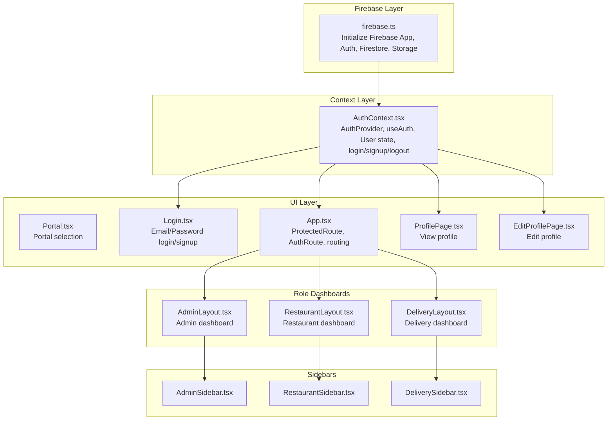
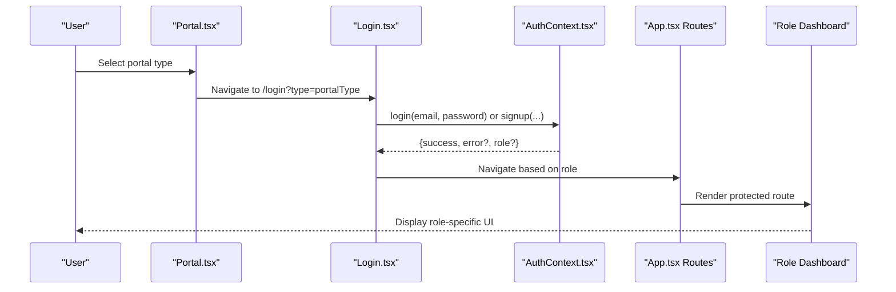
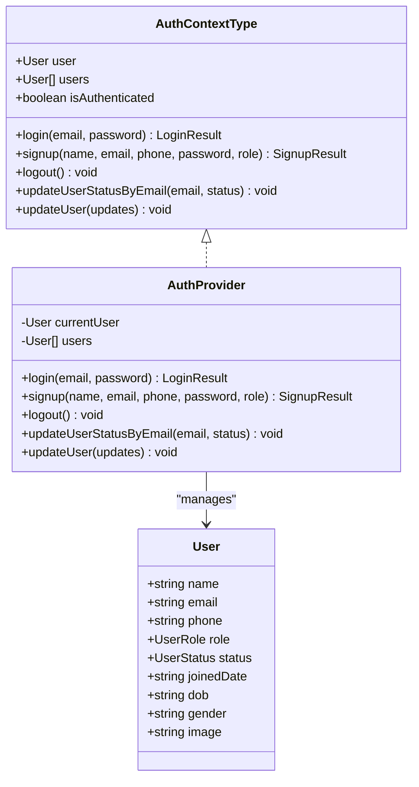
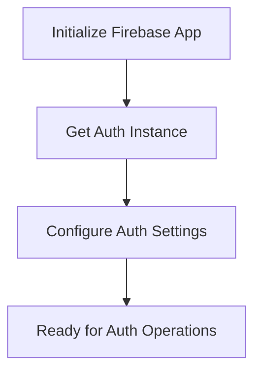
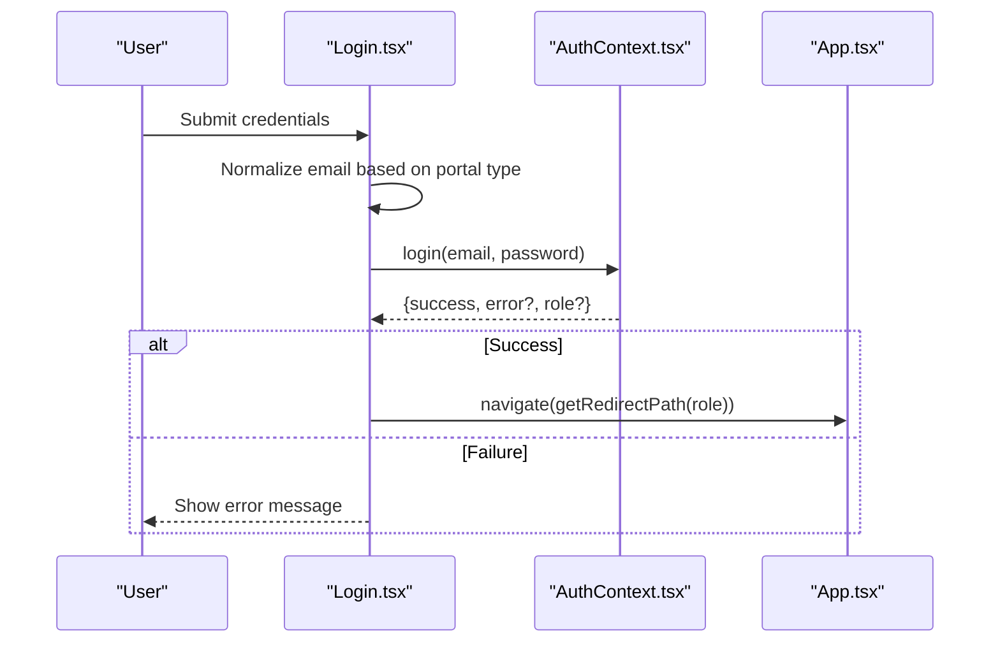
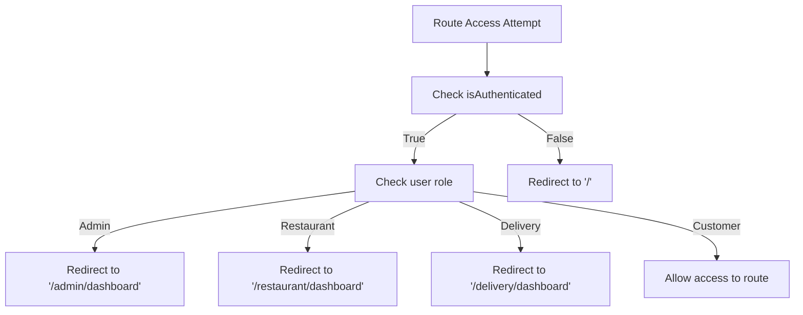
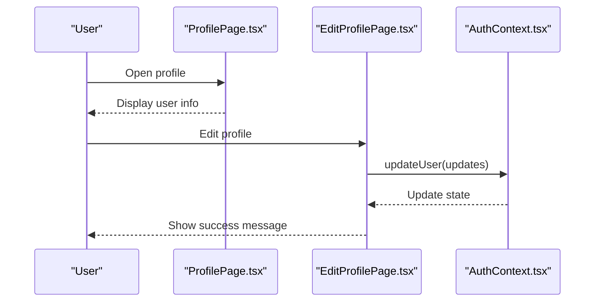
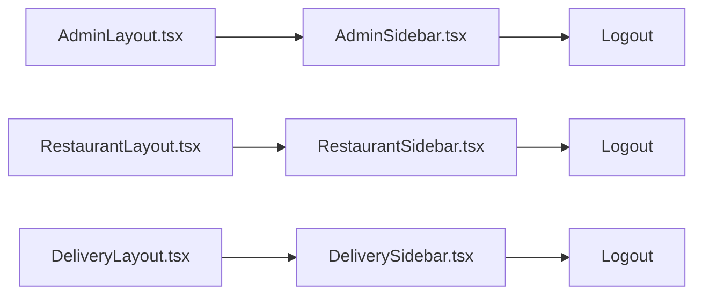
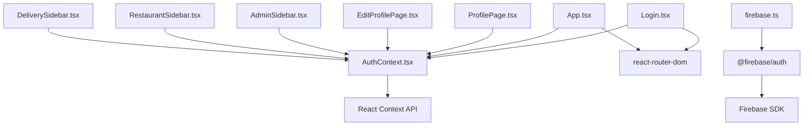

# Authentication System Integration

<cite>
**Referenced Files in This Document**
- [AuthContext.tsx](file://src/context/AuthContext.tsx)
- [firebase.ts](file://src/config/firebase.ts)
- [Login.tsx](file://src/pages/Login.tsx)
- [App.tsx](file://src/App.tsx)
- [Portal.tsx](file://src/pages/Portal.tsx)
- [ProfilePage.tsx](file://src/pages/ProfilePage.tsx)
- [EditProfilePage.tsx](file://src/pages/EditProfilePage.tsx)
- [AdminLayout.tsx](file://src/pages/admin/AdminLayout.tsx)
- [RestaurantLayout.tsx](file://src/pages/restaurant/RestaurantLayout.tsx)
- [DeliveryLayout.tsx](file://src/pages/delivery/DeliveryLayout.tsx)
- [AdminSidebar.tsx](file://src/components/AdminSidebar.tsx)
- [RestaurantSidebar.tsx](file://src/components/RestaurantSidebar.tsx)
- [DeliverySidebar.tsx](file://src/components/DeliverySidebar.tsx)
- [package.json](file://package.json)
</cite>

## Table of Contents
1. [Introduction](#introduction)
2. [Project Structure](#project-structure)
3. [Core Components](#core-components)
4. [Architecture Overview](#architecture-overview)
5. [Detailed Component Analysis](#detailed-component-analysis)
6. [Dependency Analysis](#dependency-analysis)
7. [Performance Considerations](#performance-considerations)
8. [Troubleshooting Guide](#troubleshooting-guide)
9. [Conclusion](#conclusion)

## Introduction
This document provides comprehensive documentation for the Firebase authentication integration in TIPPAY. It explains the AuthContext implementation, user authentication state management, login/logout workflows, and role-based access control. It also covers Firebase Auth integration patterns, session persistence, user credential handling, authentication flow from login through the context provider to protected routes, authentication guards, user profile management, and password reset functionality. Security rules implications, token refresh mechanisms, error handling strategies, and multi-role authentication with user metadata and permission checking are addressed.

## Project Structure
The authentication system spans several key areas:
- Firebase configuration and initialization
- Authentication context provider managing user state and operations
- Login page handling email/password authentication and role detection
- Routing guards protecting routes based on authentication and roles
- Role-specific dashboards and sidebars
- Profile management pages for editing user information

**Diagram sources**
- [firebase.ts:1-28](file://src/config/firebase.ts#L1-L28)
- [AuthContext.tsx:1-130](file://src/context/AuthContext.tsx#L1-L130)
- [Portal.tsx:1-97](file://src/pages/Portal.tsx#L1-L97)
- [Login.tsx:1-226](file://src/pages/Login.tsx#L1-L226)
- [App.tsx:1-167](file://src/App.tsx#L1-L167)
- [ProfilePage.tsx:1-121](file://src/pages/ProfilePage.tsx#L1-L121)
- [EditProfilePage.tsx:1-142](file://src/pages/EditProfilePage.tsx#L1-L142)
- [AdminLayout.tsx:1-23](file://src/pages/admin/AdminLayout.tsx#L1-L23)
- [RestaurantLayout.tsx:1-25](file://src/pages/restaurant/RestaurantLayout.tsx#L1-L25)
- [DeliveryLayout.tsx:1-25](file://src/pages/delivery/DeliveryLayout.tsx#L1-L25)
- [AdminSidebar.tsx:1-86](file://src/components/AdminSidebar.tsx#L1-L86)
- [RestaurantSidebar.tsx:1-93](file://src/components/RestaurantSidebar.tsx#L1-L93)
- [DeliverySidebar.tsx:1-90](file://src/components/DeliverySidebar.tsx#L1-L90)

**Section sources**
- [firebase.ts:1-28](file://src/config/firebase.ts#L1-L28)
- [AuthContext.tsx:1-130](file://src/context/AuthContext.tsx#L1-L130)
- [Login.tsx:1-226](file://src/pages/Login.tsx#L1-L226)
- [App.tsx:1-167](file://src/App.tsx#L1-L167)
- [Portal.tsx:1-97](file://src/pages/Portal.tsx#L1-L97)

## Core Components
- AuthContext: Provides authentication state, login/signup/logout, user updates, and role detection. Manages local user storage and status transitions.
- Firebase Config: Initializes Firebase app, analytics, auth, firestore, and storage.
- Login Page: Handles email/password authentication, role-based email normalization, and redirects based on role.
- Routing Guards: Protect routes using authentication and role checks.
- Role Dashboards: Separate layouts for admin, restaurant, and delivery users.
- Sidebars: Role-specific navigation with logout functionality.
- Profile Management: View and edit user profile information.

Key implementation patterns:
- Local state management with localStorage persistence for user records
- Role detection based on email patterns
- Conditional rendering and navigation based on user role
- Protected routes ensuring only authenticated users can access protected pages

**Section sources**
- [AuthContext.tsx:1-130](file://src/context/AuthContext.tsx#L1-L130)
- [firebase.ts:1-28](file://src/config/firebase.ts#L1-L28)
- [Login.tsx:1-226](file://src/pages/Login.tsx#L1-L226)
- [App.tsx:56-72](file://src/App.tsx#L56-L72)

## Architecture Overview
The authentication architecture integrates Firebase services with a custom React context provider. The flow begins at the portal selection, proceeds through login with role detection, and continues through protected routes gated by authentication and role checks. Role-specific dashboards and sidebars provide contextual navigation.

**Diagram sources**
- [Portal.tsx:1-97](file://src/pages/Portal.tsx#L1-L97)
- [Login.tsx:1-226](file://src/pages/Login.tsx#L1-L226)
- [AuthContext.tsx:1-130](file://src/context/AuthContext.tsx#L1-L130)
- [App.tsx:74-124](file://src/App.tsx#L74-L124)

## Detailed Component Analysis

### AuthContext Implementation
AuthContext manages user authentication state and operations. It defines user roles and statuses, provides login/signup/logout functions, and handles user updates and status changes.

**Diagram sources**
- [AuthContext.tsx:6-27](file://src/context/AuthContext.tsx#L6-L27)
- [AuthContext.tsx:40-123](file://src/context/AuthContext.tsx#L40-L123)

Key features:
- Role detection via email suffix and keywords
- Status-based access control (pending/suspended)
- Local storage persistence for user records
- User update operations with immediate state synchronization

**Section sources**
- [AuthContext.tsx:1-130](file://src/context/AuthContext.tsx#L1-L130)

### Firebase Auth Integration Patterns
Firebase configuration initializes the app, analytics, auth, firestore, and storage. While the current implementation uses a custom context for authentication, the Firebase SDK is available for integration.

**Diagram sources**
- [firebase.ts:19-26](file://src/config/firebase.ts#L19-L26)

Integration patterns:
- Email/password authentication using Firebase Auth
- Session persistence with Firebase Auth state persistence
- Token refresh mechanisms handled by Firebase Auth
- User credential handling through Firebase Auth APIs

Security considerations:
- Enforce Firebase Security Rules for Firestore and Storage
- Implement proper token refresh and expiration handling
- Use secure password policies and multi-factor authentication where applicable

**Section sources**
- [firebase.ts:1-28](file://src/config/firebase.ts#L1-L28)
- [package.json:52-52](file://package.json#L52-L52)

### Login Workflow and Role-Based Access Control
The login workflow handles email normalization based on portal type, performs authentication checks, and redirects users to role-specific dashboards.

**Diagram sources**
- [Login.tsx:46-112](file://src/pages/Login.tsx#L46-L112)
- [AuthContext.tsx:58-82](file://src/context/AuthContext.tsx#L58-L82)
- [App.tsx:37-44](file://src/App.tsx#L37-L44)

Role-based access control:
- Customer: Redirect to home
- Restaurant: Redirect to restaurant dashboard
- Delivery: Redirect to delivery dashboard
- Admin: Redirect to admin dashboard

**Section sources**
- [Login.tsx:1-226](file://src/pages/Login.tsx#L1-L226)
- [App.tsx:37-44](file://src/App.tsx#L37-L44)

### Authentication Guards and Protected Routes
Authentication guards protect routes using two main components: ProtectedRoute and AuthRoute.

**Diagram sources**
- [App.tsx:56-72](file://src/App.tsx#L56-L72)

Guard behavior:
- ProtectedRoute: Only allows authenticated users
- AuthRoute: Allows unauthenticated users but redirects authenticated users to appropriate dashboard

**Section sources**
- [App.tsx:56-72](file://src/App.tsx#L56-L72)

### User Profile Management
Profile management includes viewing user information and editing personal details.

**Diagram sources**
- [ProfilePage.tsx:11-37](file://src/pages/ProfilePage.tsx#L11-L37)
- [EditProfilePage.tsx:19-30](file://src/pages/EditProfilePage.tsx#L19-L30)
- [AuthContext.tsx:111-116](file://src/context/AuthContext.tsx#L111-L116)

Features:
- View current user information
- Edit personal details (name, email, phone, date of birth, gender, image)
- Persist updates to both context and localStorage

**Section sources**
- [ProfilePage.tsx:1-121](file://src/pages/ProfilePage.tsx#L1-L121)
- [EditProfilePage.tsx:1-142](file://src/pages/EditProfilePage.tsx#L1-L142)
- [AuthContext.tsx:111-116](file://src/context/AuthContext.tsx#L111-L116)

### Role-Specific Dashboards and Sidebars
Each role has dedicated dashboards and sidebars with role-appropriate navigation and logout functionality.

**Diagram sources**
- [AdminLayout.tsx:1-23](file://src/pages/admin/AdminLayout.tsx#L1-L23)
- [RestaurantLayout.tsx:1-25](file://src/pages/restaurant/RestaurantLayout.tsx#L1-L25)
- [DeliveryLayout.tsx:1-25](file://src/pages/delivery/DeliveryLayout.tsx#L1-L25)
- [AdminSidebar.tsx:28-84](file://src/components/AdminSidebar.tsx#L28-L84)
- [RestaurantSidebar.tsx:28-93](file://src/components/RestaurantSidebar.tsx#L28-L93)
- [DeliverySidebar.tsx:27-90](file://src/components/DeliverySidebar.tsx#L27-L90)

Navigation patterns:
- Admin: Overview, Restaurants, Orders, Delivery Agents, Users
- Restaurant: Orders, Menu Editor, Dish Requests, Coupons, Analytics
- Delivery: Nearby Orders, Active Delivery, My Stats, Profile

**Section sources**
- [AdminLayout.tsx:1-23](file://src/pages/admin/AdminLayout.tsx#L1-L23)
- [RestaurantLayout.tsx:1-25](file://src/pages/restaurant/RestaurantLayout.tsx#L1-L25)
- [DeliveryLayout.tsx:1-25](file://src/pages/delivery/DeliveryLayout.tsx#L1-L25)
- [AdminSidebar.tsx:20-26](file://src/components/AdminSidebar.tsx#L20-L26)
- [RestaurantSidebar.tsx:20-26](file://src/components/RestaurantSidebar.tsx#L20-L26)
- [DeliverySidebar.tsx:20-25](file://src/components/DeliverySidebar.tsx#L20-L25)

### Password Reset Functionality
Password reset functionality can be integrated using Firebase Auth's password reset capabilities. The current implementation focuses on email/password authentication and does not include explicit password reset handling.

Integration steps:
- Use Firebase Auth's sendPasswordResetEmail
- Implement UI for requesting password reset
- Handle success/error states
- Redirect to login after reset

Security considerations:
- Verify user identity before sending reset emails
- Implement rate limiting to prevent abuse
- Use secure channels for reset links

**Section sources**
- [firebase.ts:22-22](file://src/config/firebase.ts#L22-L22)

## Dependency Analysis
The authentication system relies on several key dependencies and their interactions.

**Diagram sources**
- [AuthContext.tsx:1-130](file://src/context/AuthContext.tsx#L1-L130)
- [Login.tsx:1-226](file://src/pages/Login.tsx#L1-L226)
- [App.tsx:1-167](file://src/App.tsx#L1-L167)
- [ProfilePage.tsx:1-121](file://src/pages/ProfilePage.tsx#L1-L121)
- [EditProfilePage.tsx:1-142](file://src/pages/EditProfilePage.tsx#L1-L142)
- [AdminSidebar.tsx:1-86](file://src/components/AdminSidebar.tsx#L1-L86)
- [RestaurantSidebar.tsx:1-93](file://src/components/RestaurantSidebar.tsx#L1-L93)
- [DeliverySidebar.tsx:1-90](file://src/components/DeliverySidebar.tsx#L1-L90)
- [firebase.ts:1-28](file://src/config/firebase.ts#L1-L28)
- [package.json:52-52](file://package.json#L52-L52)

Key dependencies:
- React Context API for state management
- react-router-dom for routing and guards
- Firebase SDK for authentication services
- Local storage for persistent user data

**Section sources**
- [package.json:17-69](file://package.json#L17-L69)
- [AuthContext.tsx:1-130](file://src/context/AuthContext.tsx#L1-L130)
- [firebase.ts:1-28](file://src/config/firebase.ts#L1-L28)

## Performance Considerations
- Minimize re-renders by using React.memo for components that frequently re-render during authentication state changes
- Debounce user input in login forms to reduce unnecessary validation calls
- Cache user data locally to avoid repeated fetch operations
- Use lazy loading for role-specific dashboards to improve initial load times
- Implement efficient state updates to avoid cascading re-renders across the application

## Troubleshooting Guide
Common authentication issues and solutions:

1. **Login fails with incorrect credentials**
   - Verify email normalization logic for different portal types
   - Check admin password validation for special accounts
   - Ensure proper error messages are displayed

2. **User redirected to wrong dashboard**
   - Confirm role detection logic based on email patterns
   - Verify redirect path mapping in getRedirectPath function
   - Check user status (pending/suspended) affecting redirection

3. **Profile updates not persisting**
   - Verify updateUser function updates both context and localStorage
   - Check for proper error handling in update operations
   - Ensure email uniqueness constraint is enforced

4. **Protected routes accessible without authentication**
   - Verify ProtectedRoute and AuthRoute guard implementations
   - Check isAuthenticated flag calculation
   - Ensure proper route nesting with AuthProvider

5. **Firebase integration issues**
   - Verify Firebase configuration is loaded before auth operations
   - Check network connectivity for Firebase services
   - Ensure proper error handling for Firebase auth errors

**Section sources**
- [AuthContext.tsx:58-100](file://src/context/AuthContext.tsx#L58-L100)
- [Login.tsx:46-112](file://src/pages/Login.tsx#L46-L112)
- [App.tsx:56-72](file://src/App.tsx#L56-L72)

## Conclusion
The TIPPAY authentication system combines a custom React context provider with Firebase services to deliver a robust multi-role authentication solution. The system provides comprehensive user state management, role-based access control, and seamless navigation between dashboards. While the current implementation uses local state management, integrating Firebase Auth would enhance security, scalability, and provide enterprise-grade features like token refresh, session persistence, and advanced security rules. The modular architecture supports easy extension for additional authentication methods, enhanced security measures, and expanded role-based permissions.