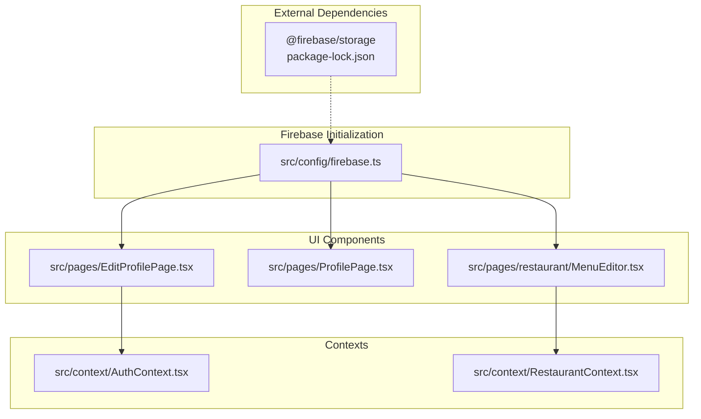
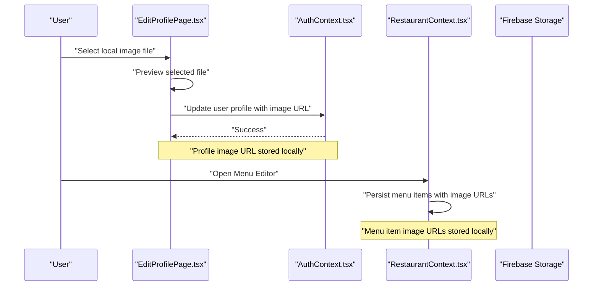
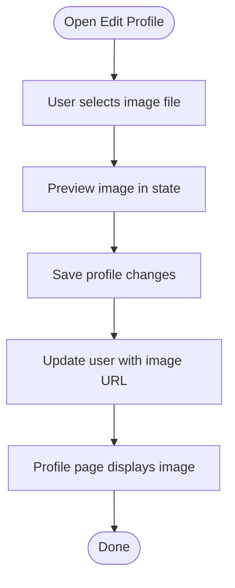
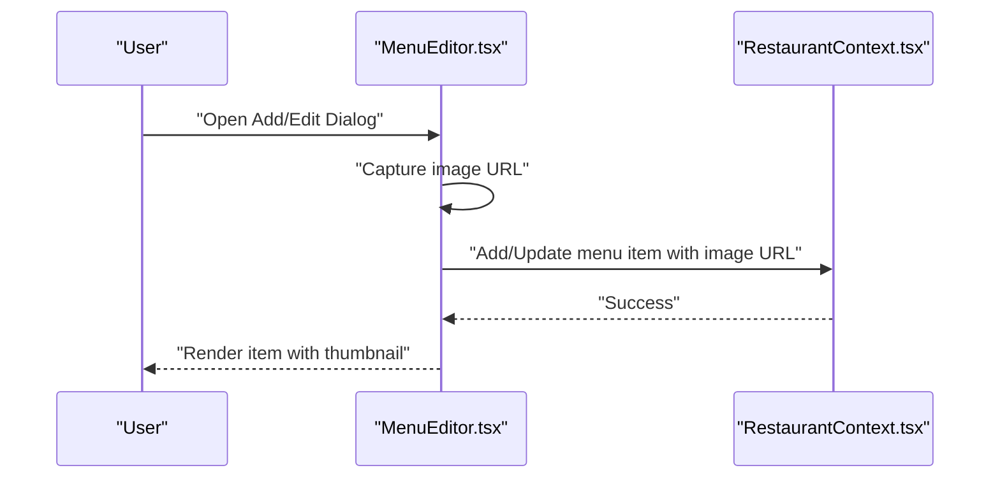
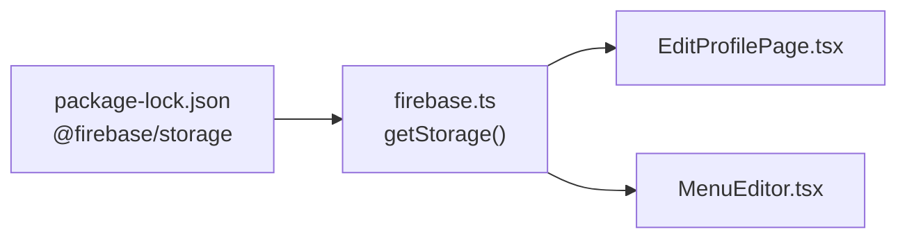

# Cloud Storage Integration

<cite>
**Referenced Files in This Document**
- [firebase.ts](file://src/config/firebase.ts)
- [EditProfilePage.tsx](file://src/pages/EditProfilePage.tsx)
- [ProfilePage.tsx](file://src/pages/ProfilePage.tsx)
- [MenuEditor.tsx](file://src/pages/restaurant/MenuEditor.tsx)
- [RestaurantContext.tsx](file://src/context/RestaurantContext.tsx)
- [AuthContext.tsx](file://src/context/AuthContext.tsx)
- [package-lock.json](file://package-lock.json)
</cite>

## Table of Contents
1. [Introduction](#introduction)
2. [Project Structure](#project-structure)
3. [Core Components](#core-components)
4. [Architecture Overview](#architecture-overview)
5. [Detailed Component Analysis](#detailed-component-analysis)
6. [Dependency Analysis](#dependency-analysis)
7. [Performance Considerations](#performance-considerations)
8. [Troubleshooting Guide](#troubleshooting-guide)
9. [Conclusion](#conclusion)

## Introduction
This document explains how Firebase Cloud Storage is integrated into TIPPAY, focusing on image upload workflows, file management patterns, and storage bucket configuration. It covers restaurant image uploads, profile picture handling, and media asset management. It also documents security rules, file type restrictions, size limitations, upload progress tracking, thumbnail generation, CDN integration, best practices for file naming and organization, cleanup procedures, error handling, retry mechanisms, fallback strategies, and integration with restaurant context for menu item images and profile photos.

## Project Structure
TIPPAY initializes Firebase in a central configuration module and uses Firebase Storage via the Firebase SDK. Upload-related UI components are present for profile pictures and restaurant menu items. The restaurant context manages menu item metadata, including image URLs.

**Diagram sources**
- [firebase.ts:1-28](file://src/config/firebase.ts#L1-L28)
- [EditProfilePage.tsx:1-142](file://src/pages/EditProfilePage.tsx#L1-L142)
- [ProfilePage.tsx:1-121](file://src/pages/ProfilePage.tsx#L1-L121)
- [MenuEditor.tsx:1-218](file://src/pages/restaurant/MenuEditor.tsx#L1-L218)
- [AuthContext.tsx:1-130](file://src/context/AuthContext.tsx#L1-L130)
- [RestaurantContext.tsx:68-94](file://src/context/RestaurantContext.tsx#L68-L94)
- [package-lock.json:1255-1271](file://package-lock.json#L1255-L1271)

**Section sources**
- [firebase.ts:1-28](file://src/config/firebase.ts#L1-L28)
- [EditProfilePage.tsx:1-142](file://src/pages/EditProfilePage.tsx#L1-L142)
- [ProfilePage.tsx:1-121](file://src/pages/ProfilePage.tsx#L1-L121)
- [MenuEditor.tsx:1-218](file://src/pages/restaurant/MenuEditor.tsx#L1-L218)
- [AuthContext.tsx:1-130](file://src/context/AuthContext.tsx#L1-L130)
- [RestaurantContext.tsx:68-94](file://src/context/RestaurantContext.tsx#L68-L94)
- [package-lock.json:1255-1271](file://package-lock.json#L1255-L1271)

## Core Components
- Firebase initialization and exports storage client for use across the app.
- Profile page edit and view components manage profile picture selection and display.
- Restaurant menu editor stores image URLs for menu items.
- Restaurant context persists menu items locally and exposes CRUD operations.
- Authentication context stores user profile image URLs.

Key implementation patterns:
- Centralized Firebase initialization with exported storage instance.
- Local file selection and preview for profile images.
- Image URL storage in user and menu item data models.
- Local persistence of restaurant data for offline availability.

**Section sources**
- [firebase.ts:1-28](file://src/config/firebase.ts#L1-L28)
- [EditProfilePage.tsx:1-142](file://src/pages/EditProfilePage.tsx#L1-L142)
- [ProfilePage.tsx:1-121](file://src/pages/ProfilePage.tsx#L1-L121)
- [MenuEditor.tsx:1-218](file://src/pages/restaurant/MenuEditor.tsx#L1-L218)
- [RestaurantContext.tsx:68-94](file://src/context/RestaurantContext.tsx#L68-L94)
- [AuthContext.tsx:1-130](file://src/context/AuthContext.tsx#L1-L130)

## Architecture Overview
The storage architecture integrates Firebase Storage with UI components and contexts. Users select images locally, which are previewed in the UI. The current implementation stores image URLs in Firestore-like models. A production deployment would upload files to Firebase Storage and store secure download URLs.

**Diagram sources**
- [EditProfilePage.tsx:54-70](file://src/pages/EditProfilePage.tsx#L54-L70)
- [AuthContext.tsx:111-116](file://src/context/AuthContext.tsx#L111-L116)
- [MenuEditor.tsx:190-193](file://src/pages/restaurant/MenuEditor.tsx#L190-L193)
- [RestaurantContext.tsx:86-94](file://src/context/RestaurantContext.tsx#L86-L94)

## Detailed Component Analysis

### Firebase Storage Initialization
- Initializes Firebase app, analytics, auth, Firestore, and Storage.
- Exports the storage instance for use across the application.

Implementation pattern:
- Import storage from Firebase SDK.
- Export storage for downstream components.

Security and configuration:
- Storage bucket configured in Firebase project settings.
- Access controlled by Firebase Security Rules.

**Section sources**
- [firebase.ts:1-28](file://src/config/firebase.ts#L1-L28)

### Profile Picture Handling
- Edit profile page allows selecting an image file and previews it.
- On save, the component updates the user profile with the selected image URL.
- Profile page displays the stored profile image URL.

Processing logic:
- File input accepts image/*.
- FileReader reads the selected file and sets a data URL for preview.
- User update operation persists the image URL in the authentication context.

**Diagram sources**
- [EditProfilePage.tsx:54-70](file://src/pages/EditProfilePage.tsx#L54-L70)
- [EditProfilePage.tsx:19-30](file://src/pages/EditProfilePage.tsx#L19-L30)
- [ProfilePage.tsx:50-57](file://src/pages/ProfilePage.tsx#L50-L57)
- [AuthContext.tsx:111-116](file://src/context/AuthContext.tsx#L111-L116)

**Section sources**
- [EditProfilePage.tsx:1-142](file://src/pages/EditProfilePage.tsx#L1-L142)
- [ProfilePage.tsx:1-121](file://src/pages/ProfilePage.tsx#L1-L121)
- [AuthContext.tsx:1-130](file://src/context/AuthContext.tsx#L1-L130)

### Restaurant Menu Item Images
- Menu editor supports adding/editing menu items with an image URL field.
- Items are persisted locally in the restaurant context.
- UI renders menu items with thumbnails when an image URL is present.

Processing logic:
- Form captures image URL for each menu item.
- Save operation either adds a new item or updates an existing one.
- Availability toggling and deletion supported.

**Diagram sources**
- [MenuEditor.tsx:190-193](file://src/pages/restaurant/MenuEditor.tsx#L190-L193)
- [MenuEditor.tsx:50-70](file://src/pages/restaurant/MenuEditor.tsx#L50-L70)
- [RestaurantContext.tsx:86-94](file://src/context/RestaurantContext.tsx#L86-L94)

**Section sources**
- [MenuEditor.tsx:1-218](file://src/pages/restaurant/MenuEditor.tsx#L1-L218)
- [RestaurantContext.tsx:68-94](file://src/context/RestaurantContext.tsx#L68-L94)

### Media Asset Management
- Current implementation stores image URLs in component state and context.
- Production-ready implementation should upload files to Firebase Storage and store secure download URLs.

Best practices:
- Store only URLs in application state; keep actual files in Storage.
- Use unique, versioned filenames to avoid collisions.
- Organize files by user ID, restaurant ID, or entity type.

**Section sources**
- [EditProfilePage.tsx:17](file://src/pages/EditProfilePage.tsx#L17)
- [MenuEditor.tsx:24](file://src/pages/restaurant/MenuEditor.tsx#L24)
- [RestaurantContext.tsx:86-94](file://src/context/RestaurantContext.tsx#L86-L94)

## Dependency Analysis
- Firebase Storage SDK is included via package-lock.json.
- The app initializes storage and exposes it for use in components.

**Diagram sources**
- [package-lock.json:1255-1271](file://package-lock.json#L1255-L1271)
- [firebase.ts:24](file://src/config/firebase.ts#L24)
- [EditProfilePage.tsx:1](file://src/pages/EditProfilePage.tsx#L1)
- [MenuEditor.tsx:1](file://src/pages/restaurant/MenuEditor.tsx#L1)

**Section sources**
- [package-lock.json:1255-1271](file://package-lock.json#L1255-L1271)
- [firebase.ts:1-28](file://src/config/firebase.ts#L1-L28)

## Performance Considerations
- Prefer compressed images (JPEG/PNG) and appropriate resolutions to minimize bandwidth and improve load times.
- Use lazy loading for thumbnails in lists.
- Implement caching strategies for frequently accessed images.
- Consider CDN integration for global distribution of static assets.

## Troubleshooting Guide
Common issues and remedies:
- Upload failures: Implement retry logic with exponential backoff and notify users with actionable messages.
- Large files: Enforce size limits server-side and client-side; show progress indicators during upload.
- Unsupported formats: Validate MIME types and extensions; provide clear error messages.
- CORS errors: Ensure Firebase Storage CORS configuration permits your domain.
- Cleanup: Periodically remove unused files from Storage and update references accordingly.

## Conclusion
TIPPAY currently stores image URLs in application state and context, with Firebase Storage initialized for future integration. To implement robust cloud storage:
- Upload files to Firebase Storage and store secure download URLs.
- Enforce security rules, file type restrictions, and size limits.
- Track upload progress and implement retry/fallback strategies.
- Adopt best practices for naming, organization, and cleanup.
- Integrate with restaurant context for menu item images and profile photos.