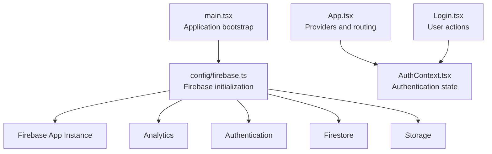
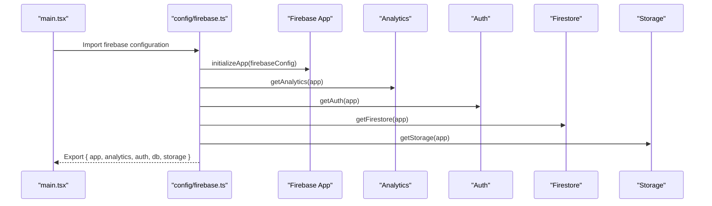
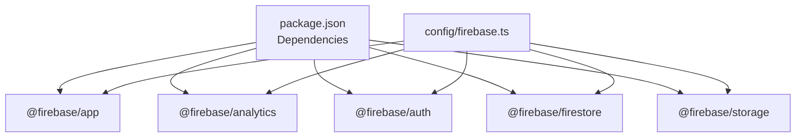

# Firebase Configuration & Initialization

<cite>
**Referenced Files in This Document**
- [firebase.ts](file://src/config/firebase.ts)
- [main.tsx](file://src/main.tsx)
- [App.tsx](file://src/App.tsx)
- [AuthContext.tsx](file://src/context/AuthContext.tsx)
- [Login.tsx](file://src/pages/Login.tsx)
- [mockMode.ts](file://src/config/mockMode.ts)
- [netlify.toml](file://netlify.toml)
- [vite.config.ts](file://vite.config.ts)
- [package.json](file://package.json)
</cite>

## Table of Contents
1. [Introduction](#introduction)
2. [Project Structure](#project-structure)
3. [Core Components](#core-components)
4. [Architecture Overview](#architecture-overview)
5. [Detailed Component Analysis](#detailed-component-analysis)
6. [Dependency Analysis](#dependency-analysis)
7. [Performance Considerations](#performance-considerations)
8. [Troubleshooting Guide](#troubleshooting-guide)
9. [Conclusion](#conclusion)

## Introduction
This document explains how Firebase is configured and initialized in TIPPAY, focusing on the Firebase SDK setup, the structure of the firebaseConfig object, initialization sequence for analytics, authentication, Firestore, and storage, environment variable usage, security considerations, and differences between local development and production. It also covers import patterns, initialization timing, error handling during startup, common configuration issues, debugging techniques, and best practices for Firebase project setup.

## Project Structure
Firebase configuration and initialization are centralized in a dedicated configuration module and imported early in the application lifecycle. The initialization is executed once at startup, ensuring all Firebase services are ready before the UI renders.

**Diagram sources**
- [main.tsx:1-11](file://src/main.tsx#L1-L11)
- [firebase.ts:1-28](file://src/config/firebase.ts#L1-L28)
- [App.tsx:1-167](file://src/App.tsx#L1-L167)
- [AuthContext.tsx:1-130](file://src/context/AuthContext.tsx#L1-L130)
- [Login.tsx:1-226](file://src/pages/Login.tsx#L1-L226)

**Section sources**
- [main.tsx:1-11](file://src/main.tsx#L1-L11)
- [firebase.ts:1-28](file://src/config/firebase.ts#L1-L28)

## Core Components
- Firebase configuration module: Defines the firebaseConfig object and initializes Firebase services.
- Application bootstrap: Imports the Firebase configuration at startup to ensure services are available globally.
- Authentication context: Manages user state and integrates with Firebase Auth for authentication flows.
- Environment configuration: Uses Vite environment variables for feature toggles and deployment settings.

Key responsibilities:
- Centralized Firebase initialization and exports for use across the app.
- Early import pattern to guarantee availability of Firebase services before rendering UI.
- Context-based authentication logic that complements Firebase Auth.

**Section sources**
- [firebase.ts:1-28](file://src/config/firebase.ts#L1-L28)
- [main.tsx:1-11](file://src/main.tsx#L1-L11)
- [AuthContext.tsx:1-130](file://src/context/AuthContext.tsx#L1-L130)

## Architecture Overview
The Firebase initialization follows a straightforward sequence: import SDK modules, define the firebaseConfig object, initialize the Firebase app, and create service instances for analytics, authentication, Firestore, and storage. These services are exported for global use.

**Diagram sources**
- [main.tsx:4](file://src/main.tsx#L4)
- [firebase.ts:9-26](file://src/config/firebase.ts#L9-L26)

## Detailed Component Analysis

### Firebase Configuration Module
The configuration module imports the Firebase SDK functions, defines the firebaseConfig object, initializes the Firebase app, and creates service instances for analytics, authentication, Firestore, and storage. It exports these services for use across the application.

- Import pattern: Individual SDK modules are imported to support tree-shaking and reduce bundle size.
- Configuration object: Contains API keys, project identifiers, and service endpoints.
- Initialization sequence: App initialization precedes service creation.
- Exports: Provides named exports for each service and a default export for the Firebase app instance.

Security considerations:
- The firebaseConfig object currently contains literal values. In production, sensitive configuration should be loaded via environment variables and validated at runtime.
- Avoid committing secrets to version control; use secure secret management systems.

Initialization timing:
- Imported in main.tsx before rendering the root React component, ensuring services are available immediately.

**Section sources**
- [firebase.ts:1-28](file://src/config/firebase.ts#L1-L28)

### Application Bootstrap
The application imports the Firebase configuration module at the top of main.tsx. This ensures Firebase services are initialized before any UI components render, preventing race conditions and missing dependencies.

- Import placement: The configuration import occurs before creating the React root.
- Side effect: The import triggers initialization of Firebase services.

**Section sources**
- [main.tsx:1-11](file://src/main.tsx#L1-L11)

### Authentication Context Integration
The AuthContext manages user state locally and provides login/signup/logout functions. While the context includes role detection and user status management, the current implementation does not rely on Firebase Auth for persistence or real-time updates. Authentication flows can be extended to integrate with Firebase Auth for production-grade user management.

- Role detection: Determined by email patterns and domain suffixes.
- User status: Supports active, pending, and suspended states.
- Local storage: Persists user data for demonstration purposes.

Integration opportunities:
- Replace local state with Firebase Auth for secure, persistent authentication.
- Use Firestore collections to manage user profiles and roles.

**Section sources**
- [AuthContext.tsx:1-130](file://src/context/AuthContext.tsx#L1-L130)

### Login Page and Authentication Flow
The Login page coordinates user registration and authentication, leveraging the AuthContext for state management. It supports multiple portals (user, restaurant, delivery, admin) and enforces role-specific validations.

- Form handling: Manages login and signup modes with role-aware validations.
- Redirect logic: Navigates users to appropriate dashboards based on detected roles.
- Toast notifications: Provides feedback for success and error scenarios.

**Section sources**
- [Login.tsx:1-226](file://src/pages/Login.tsx#L1-L226)

### Environment Variables and Deployment
Environment variables are used to control feature flags and deployment behavior. The project uses Vite for development and Netlify for hosting, with environment variables configured at build time.

- Feature flag: VITE_USE_MOCK_DATA controls mock data usage.
- Build environment: Netlify sets NODE_VERSION and VITE_USE_MOCK_DATA.
- Local development: Vite configuration defines aliases and dev server settings.

**Section sources**
- [mockMode.ts:1-3](file://src/config/mockMode.ts#L1-L3)
- [netlify.toml:1-8](file://netlify.toml#L1-L8)
- [vite.config.ts:1-21](file://vite.config.ts#L1-L21)

## Dependency Analysis
Firebase SDK is included as a dependency in package.json. The configuration module imports individual Firebase SDK modules to enable modular usage and optimize bundle size.

**Diagram sources**
- [package.json:52](file://package.json#L52)
- [firebase.ts:2-6](file://src/config/firebase.ts#L2-L6)

**Section sources**
- [package.json:17-70](file://package.json#L17-L70)
- [firebase.ts:1-28](file://src/config/firebase.ts#L1-L28)

## Performance Considerations
- Tree-shaking: Importing individual Firebase SDK modules reduces bundle size compared to importing the entire SDK.
- Lazy initialization: Consider deferring heavy Firebase operations until after the initial render to improve perceived performance.
- Caching: Use Firestore caching and offline persistence judiciously to balance performance and data freshness.
- Analytics: Disable analytics in development builds or behind feature flags to minimize overhead.

## Troubleshooting Guide
Common configuration issues and resolutions:
- Missing or invalid firebaseConfig: Ensure all required fields are present and match the Firebase project settings.
- Initialization order: Verify that the Firebase configuration is imported before any component attempts to use Firebase services.
- Environment variables: Confirm that Vite environment variables are correctly set for development and production builds.
- CORS and security rules: Validate Firebase project security rules and CORS settings for Firestore and Storage.
- Analytics measurement ID: Ensure the measurementId is correct and analytics is enabled in the Firebase console.

Debugging techniques:
- Enable Firebase debug logging in development to inspect initialization and service errors.
- Use browser developer tools to monitor network requests and verify service endpoints.
- Validate environment variable values at runtime to catch misconfigurations early.

Security considerations:
- Never hardcode secrets in client-side code. Use environment variables and secure secret management.
- Restrict access to Firebase services using appropriate security rules and IAM policies.
- Regularly rotate API keys and service account credentials.

Best practices:
- Centralize Firebase configuration in a single module and export services for reuse.
- Use feature flags to toggle between mock data and live Firebase services during development.
- Implement graceful fallbacks when Firebase services are unavailable.
- Monitor Firebase quotas and usage to avoid unexpected costs.

**Section sources**
- [firebase.ts:9-17](file://src/config/firebase.ts#L9-L17)
- [mockMode.ts:1-3](file://src/config/mockMode.ts#L1-L3)
- [netlify.toml:5-7](file://netlify.toml#L5-L7)

## Conclusion
TIPPAY initializes Firebase at application startup using a centralized configuration module, exporting services for global use. The current implementation focuses on local authentication state management but provides a foundation for integrating Firebase Auth, Firestore, and Storage for production-grade functionality. By adopting environment variables, validating configuration at runtime, and following security best practices, the application can safely scale to production while maintaining reliable performance and maintainability.