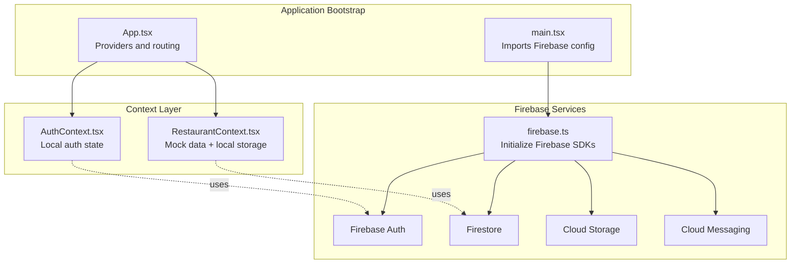
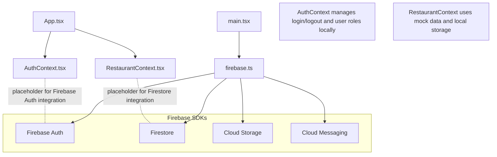
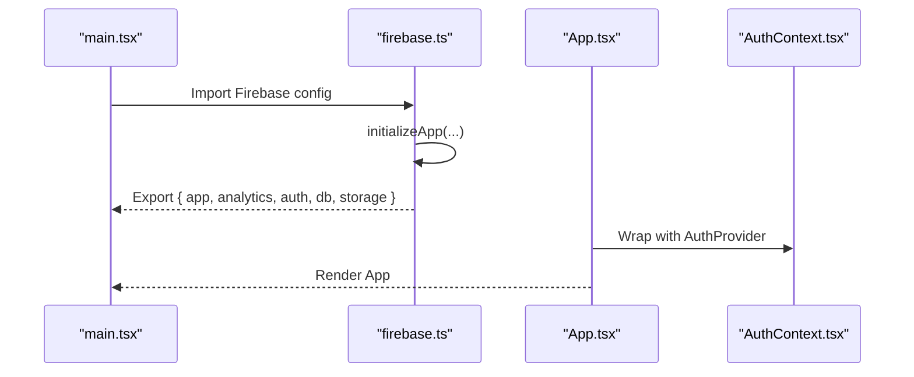
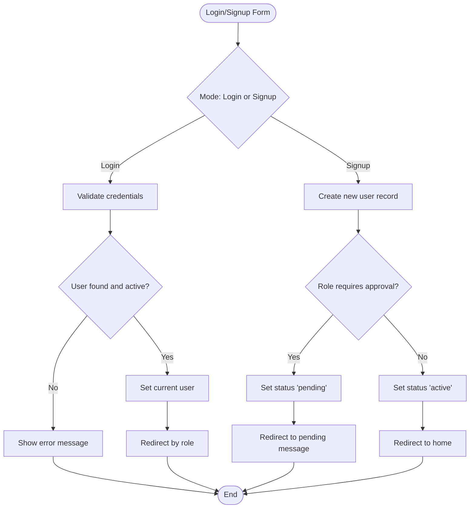
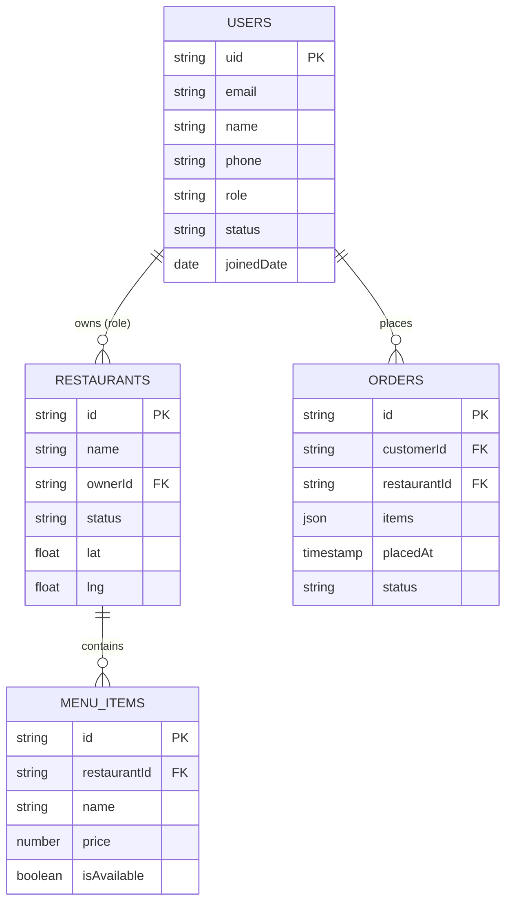
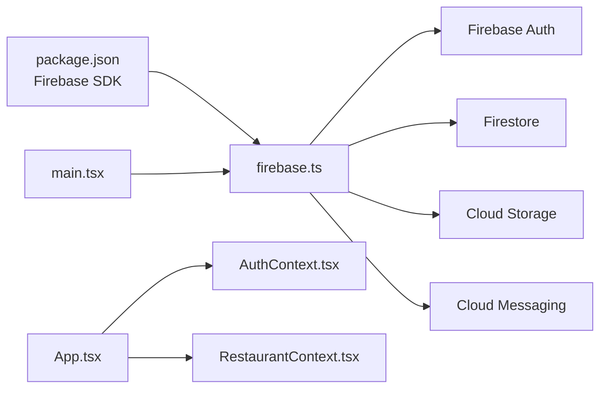

# Firebase Integration

<cite>
**Referenced Files in This Document**
- [firebase.ts](file://src/config/firebase.ts)
- [AuthContext.tsx](file://src/context/AuthContext.tsx)
- [mockMode.ts](file://src/config/mockMode.ts)
- [App.tsx](file://src/App.tsx)
- [main.tsx](file://src/main.tsx)
- [Login.tsx](file://src/pages/Login.tsx)
- [RestaurantContext.tsx](file://src/context/RestaurantContext.tsx)
- [package.json](file://package.json)
</cite>

## Table of Contents
1. [Introduction](#introduction)
2. [Project Structure](#project-structure)
3. [Core Components](#core-components)
4. [Architecture Overview](#architecture-overview)
5. [Detailed Component Analysis](#detailed-component-analysis)
6. [Dependency Analysis](#dependency-analysis)
7. [Performance Considerations](#performance-considerations)
8. [Troubleshooting Guide](#troubleshooting-guide)
9. [Conclusion](#conclusion)
10. [Appendices](#appendices)

## Introduction
This document explains TIPPAY’s Firebase integration strategy across authentication, database, and cloud services. It covers Firebase configuration setup, initialization, and service integration patterns. It also documents current authentication behavior (including user management, email verification, and session handling), Firestore database integration for persistent data storage and real-time updates, and cloud storage and messaging usage. Security rules, data modeling, performance optimization, SDK usage examples, error handling strategies, and migration patterns from mock data to real Firebase services are included.

## Project Structure
TIPPAY initializes Firebase in a dedicated configuration module and integrates it into the application bootstrap. Authentication is handled via a local AuthContext, while data persistence currently relies on mock data and local storage. The project includes Firebase SDK dependencies and supports a mock mode flag to toggle between mock data and real backend behavior.

**Diagram sources**
- [main.tsx:1-11](file://src/main.tsx#L1-L11)
- [firebase.ts:1-28](file://src/config/firebase.ts#L1-L28)
- [AuthContext.tsx:1-130](file://src/context/AuthContext.tsx#L1-L130)
- [RestaurantContext.tsx:1-162](file://src/context/RestaurantContext.tsx#L1-L162)

**Section sources**
- [main.tsx:1-11](file://src/main.tsx#L1-L11)
- [firebase.ts:1-28](file://src/config/firebase.ts#L1-L28)
- [package.json:17-70](file://package.json#L17-L70)

## Core Components
- Firebase configuration and initialization: Centralized in a single module that initializes Firebase App, Analytics, Auth, Firestore, and Storage.
- Authentication context: Provides user login/signup, role detection, and session state management locally (not yet integrated with Firebase Auth).
- Mock mode and data providers: Toggle between mock data and persisted data using local storage and a mock mode flag.
- Application bootstrap: Imports Firebase configuration during startup and wraps the app with providers.

Key implementation references:
- Firebase initialization and exports: [firebase.ts:19-26](file://src/config/firebase.ts#L19-L26)
- Auth provider and user state: [AuthContext.tsx:40-123](file://src/context/AuthContext.tsx#L40-L123)
- Mock mode flag: [mockMode.ts:1-3](file://src/config/mockMode.ts#L1-L3)
- Application providers and routing: [App.tsx:124-162](file://src/App.tsx#L124-L162)
- Bootstrap import: [main.tsx:4](file://src/main.tsx#L4)

**Section sources**
- [firebase.ts:1-28](file://src/config/firebase.ts#L1-L28)
- [AuthContext.tsx:1-130](file://src/context/AuthContext.tsx#L1-L130)
- [mockMode.ts:1-3](file://src/config/mockMode.ts#L1-L3)
- [App.tsx:124-162](file://src/App.tsx#L124-L162)
- [main.tsx:1-11](file://src/main.tsx#L1-L11)

## Architecture Overview
The current architecture initializes Firebase services but does not yet integrate them into the application logic. Authentication is managed locally, and data persistence uses mock data and local storage. The following diagram shows the current state and highlights where Firebase services would be wired in.

**Diagram sources**
- [main.tsx:1-11](file://src/main.tsx#L1-L11)
- [firebase.ts:1-28](file://src/config/firebase.ts#L1-L28)
- [AuthContext.tsx:1-130](file://src/context/AuthContext.tsx#L1-L130)
- [RestaurantContext.tsx:1-162](file://src/context/RestaurantContext.tsx#L1-L162)

## Detailed Component Analysis

### Firebase Configuration and Initialization
- Purpose: Initialize Firebase App and export initialized services (Auth, Firestore, Storage, Analytics).
- Services initialized:
  - Firebase App
  - Analytics
  - Auth
  - Firestore
  - Storage
- Exported for use across the app.

Implementation references:
- Initialization and exports: [firebase.ts:19-26](file://src/config/firebase.ts#L19-L26)
- Firebase SDK dependencies: [package.json:52](file://package.json#L52)

**Diagram sources**
- [main.tsx:4](file://src/main.tsx#L4)
- [firebase.ts:19-26](file://src/config/firebase.ts#L19-L26)
- [App.tsx:124-162](file://src/App.tsx#L124-L162)

**Section sources**
- [firebase.ts:1-28](file://src/config/firebase.ts#L1-L28)
- [package.json:52](file://package.json#L52)

### Authentication Integration (Local AuthContext)
- Role detection logic: Determines user role based on email suffixes.
- Local user store: Maintains a list of users in local storage and supports updates.
- Login flow: Validates credentials against stored users and sets current user.
- Signup flow: Creates new users with appropriate status (pending for restaurant/delivery, active for customer).
- Logout: Clears current user.

**Diagram sources**
- [Login.tsx:46-112](file://src/pages/Login.tsx#L46-L112)
- [AuthContext.tsx:58-100](file://src/context/AuthContext.tsx#L58-L100)

**Section sources**
- [AuthContext.tsx:1-130](file://src/context/AuthContext.tsx#L1-L130)
- [Login.tsx:1-226](file://src/pages/Login.tsx#L1-L226)

### Firestore Integration (Current State and Migration Path)
- Current state: Restaurant data is loaded from mock data and persisted to local storage. There is no Firestore integration yet.
- Migration path:
  - Replace mock data loading with Firestore queries.
  - Use Firestore collections for restaurants, menu items, orders, and user profiles.
  - Implement real-time listeners for live updates.
  - Enable offline persistence for improved reliability.
- Data modeling recommendations:
  - Users collection: user ID, profile fields, role, status.
  - Restaurants collection: restaurant ID, metadata, location, status.
  - MenuItems collection: item ID, restaurant ID, availability, pricing.
  - Orders collection: order ID, customer ID, items, timestamps, status.
  - Admin approvals: pending restaurant applications and status updates.

**Diagram sources**
- [RestaurantContext.tsx:96-142](file://src/context/RestaurantContext.tsx#L96-L142)
- [AuthContext.tsx:6-16](file://src/context/AuthContext.tsx#L6-L16)

**Section sources**
- [RestaurantContext.tsx:1-162](file://src/context/RestaurantContext.tsx#L1-L162)
- [AuthContext.tsx:6-16](file://src/context/AuthContext.tsx#L6-L16)

### Cloud Storage and Messaging (Integration Plan)
- Cloud Storage:
  - Integrate Firebase Storage for user avatars, restaurant images, and promotional assets.
  - Use secure upload/download URLs and implement upload progress tracking.
- Cloud Messaging:
  - Integrate Firebase Cloud Messaging for push notifications (orders, promotions, system alerts).
  - Implement permission prompts and token management.

Note: These services are initialized in the Firebase config but are not yet used in the application logic.

**Section sources**
- [firebase.ts:23-24](file://src/config/firebase.ts#L23-L24)

### Security Rules and Data Modeling
- Security rules:
  - Restrict restaurant creation to admins or authorized users.
  - Enforce read/write permissions per user role.
  - Limit access to own data (orders, profiles).
- Data modeling:
  - Normalize entities (users, restaurants, menu items, orders).
  - Use composite indexes for common queries (status, location, timestamps).
  - Implement soft deletes and audit logs where applicable.

[No sources needed since this section provides general guidance]

### Performance Optimization
- Real-time listeners:
  - Use Firestore listeners judiciously; unsubscribe on unmount.
  - Batch reads/writes to reduce network overhead.
- Offline persistence:
  - Enable Firestore persistence to improve responsiveness.
  - Cache frequently accessed data and invalidate selectively.
- Image optimization:
  - Store optimized images in Cloud Storage with CDN delivery.
  - Lazy-load images and use responsive sizes.

[No sources needed since this section provides general guidance]

## Dependency Analysis
Firebase SDKs are declared as dependencies and initialized in the configuration module. The application bootstrap imports the Firebase config, and providers wrap the app. Authentication and data contexts operate independently of Firebase until integration occurs.

**Diagram sources**
- [package.json:52](file://package.json#L52)
- [main.tsx:4](file://src/main.tsx#L4)
- [firebase.ts:19-26](file://src/config/firebase.ts#L19-L26)

**Section sources**
- [package.json:17-70](file://package.json#L17-L70)
- [main.tsx:1-11](file://src/main.tsx#L1-L11)
- [firebase.ts:1-28](file://src/config/firebase.ts#L1-L28)

## Performance Considerations
- Minimize re-renders by structuring context providers efficiently.
- Debounce location-based computations and avoid unnecessary recomputations.
- Use pagination and server-side filtering for large datasets.
- Implement caching strategies for static resources and images.

[No sources needed since this section provides general guidance]

## Troubleshooting Guide
- Firebase initialization errors:
  - Verify Firebase configuration values and environment variables.
  - Ensure Firebase SDKs are installed and imported correctly.
- Authentication issues:
  - Confirm AuthContext is wrapped around the app.
  - Check role detection logic and email suffixes.
- Data not persisting:
  - Verify local storage writes and mock mode flag behavior.
  - Ensure Firestore rules permit read/write operations for the current user.

**Section sources**
- [firebase.ts:9-17](file://src/config/firebase.ts#L9-L17)
- [AuthContext.tsx:40-123](file://src/context/AuthContext.tsx#L40-L123)
- [mockMode.ts:1-3](file://src/config/mockMode.ts#L1-L3)

## Conclusion
TIPPAY has established a solid foundation for Firebase integration with centralized configuration and initialized services. Authentication and data persistence are currently handled locally with mock data and local storage. The next steps involve integrating Firebase Auth for secure user sessions, Firestore for persistent and real-time data, Cloud Storage for media, and Cloud Messaging for notifications. Implementing robust security rules, optimizing performance, and migrating from mock data to real Firebase services will deliver a scalable and production-ready solution.

## Appendices

### Migration Patterns: From Mock Data to Real Firebase
- Phase 1: Replace mock data with Firestore reads and writes.
- Phase 2: Add real-time listeners for live updates.
- Phase 3: Enable offline persistence and cache management.
- Phase 4: Integrate Cloud Storage for images and Cloud Messaging for notifications.
- Phase 5: Implement security rules and testing strategies.

[No sources needed since this section provides general guidance]