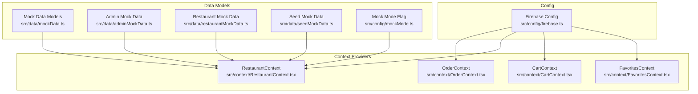
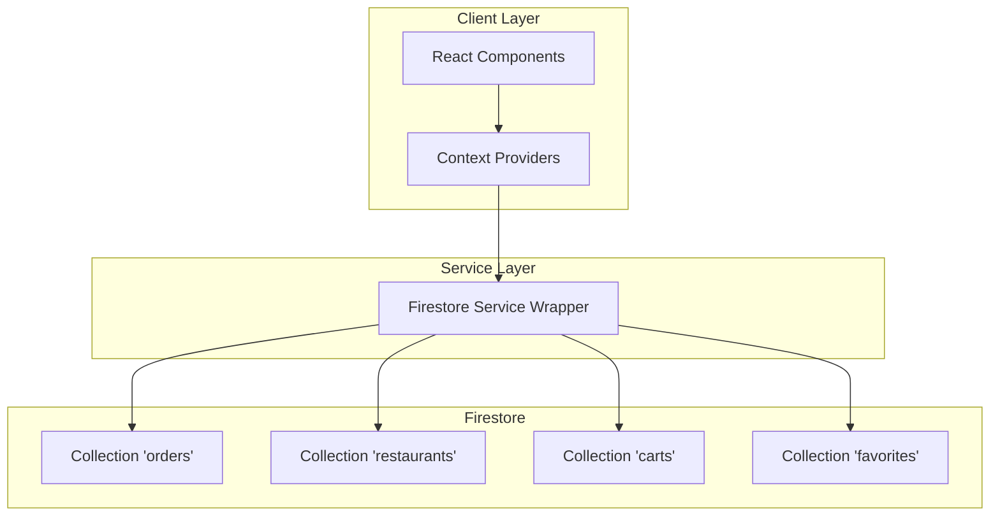
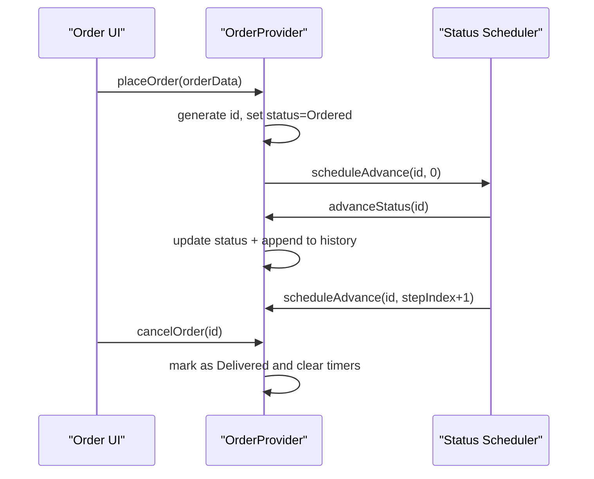
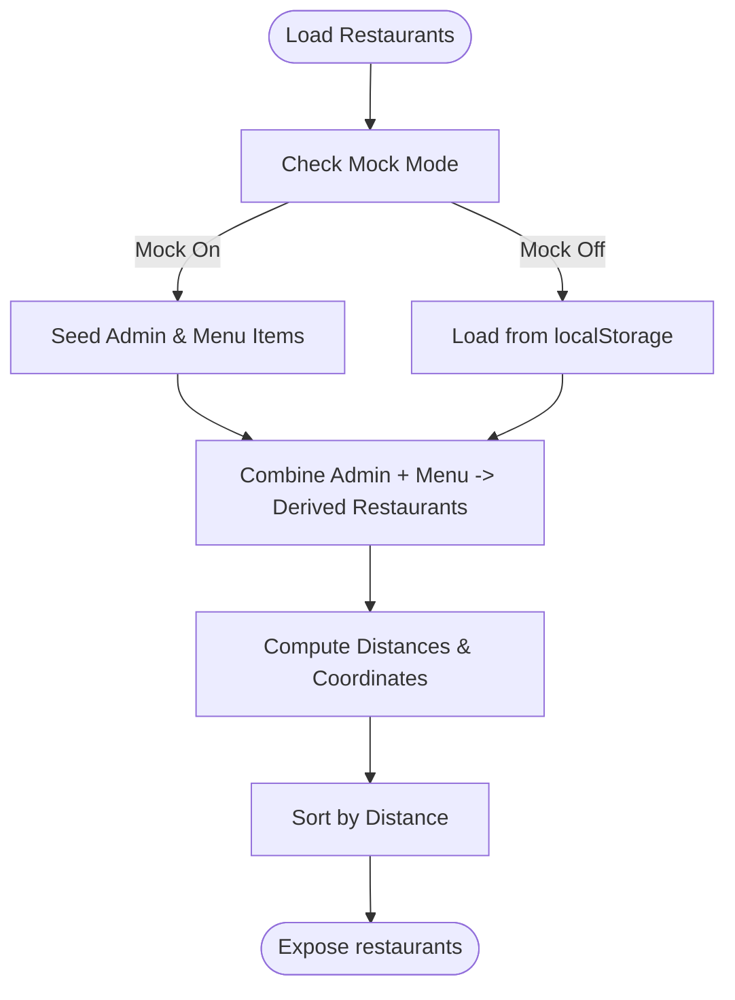
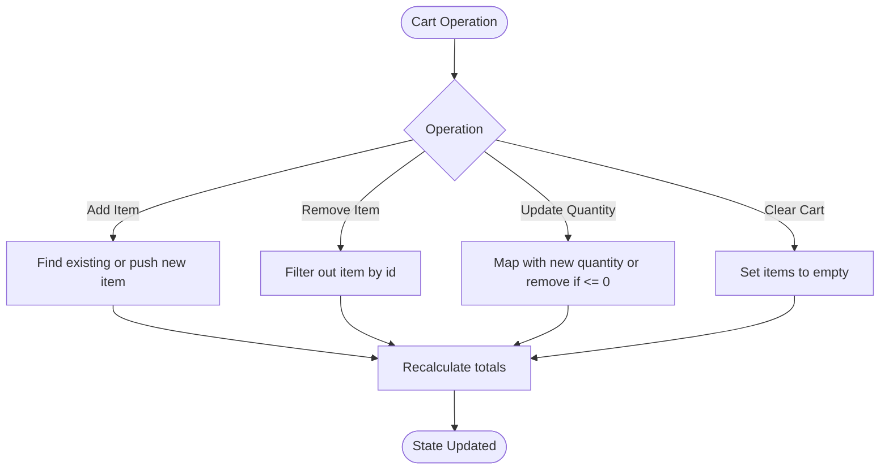
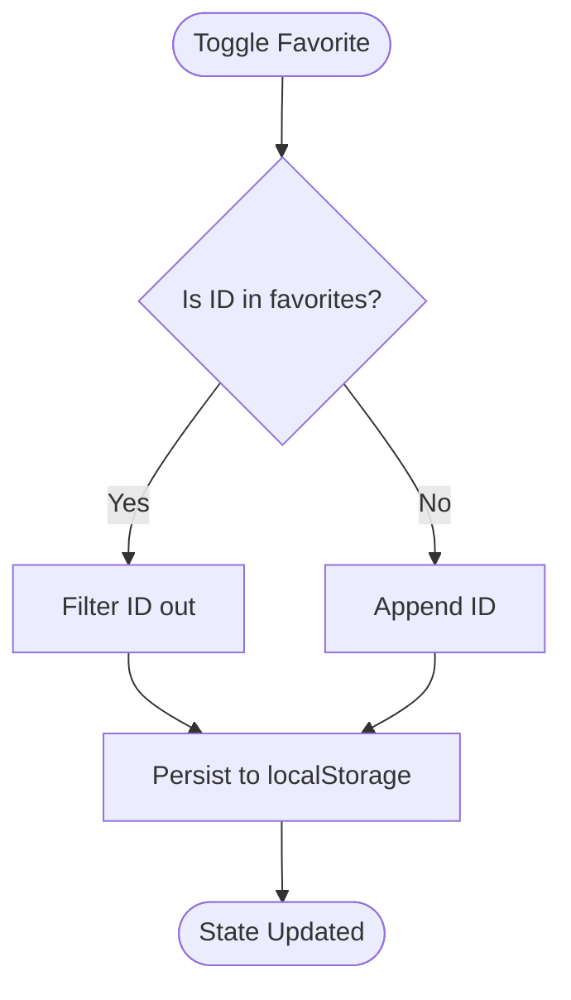
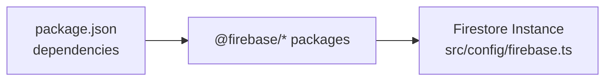

# Firestore Database Integration

<cite>
**Referenced Files in This Document**
- [firebase.ts](file://src/config/firebase.ts)
- [OrderContext.tsx](file://src/context/OrderContext.tsx)
- [RestaurantContext.tsx](file://src/context/RestaurantContext.tsx)
- [CartContext.tsx](file://src/context/CartContext.tsx)
- [FavoritesContext.tsx](file://src/context/FavoritesContext.tsx)
- [mockData.ts](file://src/data/mockData.ts)
- [adminMockData.ts](file://src/data/adminMockData.ts)
- [restaurantMockData.ts](file://src/data/restaurantMockData.ts)
- [seedMockData.ts](file://src/data/seedMockData.ts)
- [mockMode.ts](file://src/config/mockMode.ts)
- [package.json](file://package.json)
</cite>

## Table of Contents
1. [Introduction](#introduction)
2. [Project Structure](#project-structure)
3. [Core Components](#core-components)
4. [Architecture Overview](#architecture-overview)
5. [Detailed Component Analysis](#detailed-component-analysis)
6. [Dependency Analysis](#dependency-analysis)
7. [Performance Considerations](#performance-considerations)
8. [Troubleshooting Guide](#troubleshooting-guide)
9. [Conclusion](#conclusion)
10. [Appendices](#appendices)

## Introduction
This document explains the Firestore database integration strategy for the TIPPAY application. It covers data modeling, real-time query patterns, offline persistence, and the implementation of context providers for orders, restaurants, carts, and favorites. The current implementation relies on local state and mock data for demonstration, with Firebase initialized for Firestore, Authentication, Analytics, and Storage. The document outlines how to evolve the codebase to use Firestore for persistent, real-time, and offline-capable data flows while maintaining clean separation of concerns through React Context providers.

## Project Structure
The project organizes Firebase initialization centrally and exposes Firestore via a singleton module. Context providers encapsulate domain-specific state and operations, enabling a scalable pattern for future migration to Firestore.

**Diagram sources**
- [firebase.ts:1-28](file://src/config/firebase.ts#L1-L28)
- [OrderContext.tsx:1-138](file://src/context/OrderContext.tsx#L1-L138)
- [RestaurantContext.tsx:1-162](file://src/context/RestaurantContext.tsx#L1-L162)
- [CartContext.tsx:1-64](file://src/context/CartContext.tsx#L1-L64)
- [FavoritesContext.tsx:1-45](file://src/context/FavoritesContext.tsx#L1-L45)
- [mockData.ts:1-326](file://src/data/mockData.ts#L1-L326)
- [adminMockData.ts:1-101](file://src/data/adminMockData.ts#L1-L101)
- [restaurantMockData.ts:1-215](file://src/data/restaurantMockData.ts#L1-L215)
- [seedMockData.ts:1-50](file://src/data/seedMockData.ts#L1-L50)
- [mockMode.ts:1-3](file://src/config/mockMode.ts#L1-L3)

**Section sources**
- [firebase.ts:1-28](file://src/config/firebase.ts#L1-L28)
- [OrderContext.tsx:1-138](file://src/context/OrderContext.tsx#L1-L138)
- [RestaurantContext.tsx:1-162](file://src/context/RestaurantContext.tsx#L1-L162)
- [CartContext.tsx:1-64](file://src/context/CartContext.tsx#L1-L64)
- [FavoritesContext.tsx:1-45](file://src/context/FavoritesContext.tsx#L1-L45)
- [mockData.ts:1-326](file://src/data/mockData.ts#L1-L326)
- [adminMockData.ts:1-101](file://src/data/adminMockData.ts#L1-L101)
- [restaurantMockData.ts:1-215](file://src/data/restaurantMockData.ts#L1-L215)
- [seedMockData.ts:1-50](file://src/data/seedMockData.ts#L1-L50)
- [mockMode.ts:1-3](file://src/config/mockMode.ts#L1-L3)

## Core Components
- Firebase initialization and exports Firestore client for use across the app.
- Context providers manage domain state and expose CRUD-like operations:
  - Orders: lifecycle management and simulated status progression.
  - Restaurants: derived lists and admin operations with mock persistence.
  - Cart: additive operations with totals computed from state.
  - Favorites: toggling and persistence via localStorage.

These components are designed to be easily adapted to Firestore by injecting Firestore service methods behind the same interfaces.

**Section sources**
- [firebase.ts:1-28](file://src/config/firebase.ts#L1-L28)
- [OrderContext.tsx:1-138](file://src/context/OrderContext.tsx#L1-L138)
- [RestaurantContext.tsx:1-162](file://src/context/RestaurantContext.tsx#L1-L162)
- [CartContext.tsx:1-64](file://src/context/CartContext.tsx#L1-L64)
- [FavoritesContext.tsx:1-45](file://src/context/FavoritesContext.tsx#L1-L45)

## Architecture Overview
The current architecture uses React Context providers backed by local state and localStorage. To integrate Firestore, we propose:
- Central Firestore service wrapper for collections and transactions.
- Provider methods delegate to Firestore service for create/read/update/delete and real-time listeners.
- Offline persistence enabled via Firestore settings; conflict resolution handled by optimistic updates with server reconciliation.
- Security rules enforced per collection to restrict access and mutations.

[No sources needed since this diagram shows conceptual architecture, not a direct code mapping]

## Detailed Component Analysis

### Firebase Initialization
- Initializes Firebase app, analytics, auth, Firestore, and storage.
- Exports Firestore instance for use in service wrappers.

Implementation notes:
- Firestore is configured for offline persistence by default in the SDK.
- Authentication and storage are initialized for potential future use.

**Section sources**
- [firebase.ts:1-28](file://src/config/firebase.ts#L1-L28)

### Orders Context Provider
- Manages live order state with simulated status progression.
- Provides methods to place orders, cancel orders, and fetch orders.
- Uses timers to advance statuses sequentially.

**Diagram sources**
- [OrderContext.tsx:41-120](file://src/context/OrderContext.tsx#L41-L120)

**Section sources**
- [OrderContext.tsx:1-138](file://src/context/OrderContext.tsx#L1-L138)

### Restaurants Context Provider
- Derives restaurant lists from admin restaurants and menu items.
- Persists admin restaurants and menu items to localStorage.
- Computes distances and sorts restaurants by proximity.

**Diagram sources**
- [RestaurantContext.tsx:36-142](file://src/context/RestaurantContext.tsx#L36-L142)
- [seedMockData.ts:11-49](file://src/data/seedMockData.ts#L11-L49)
- [mockMode.ts:1-3](file://src/config/mockMode.ts#L1-L3)

**Section sources**
- [RestaurantContext.tsx:1-162](file://src/context/RestaurantContext.tsx#L1-L162)
- [seedMockData.ts:1-50](file://src/data/seedMockData.ts#L1-L50)
- [mockMode.ts:1-3](file://src/config/mockMode.ts#L1-L3)

### Cart Context Provider
- Adds, removes, updates quantities, and clears cart items.
- Computes total items and total price from current state.

**Diagram sources**
- [CartContext.tsx:22-56](file://src/context/CartContext.tsx#L22-L56)

**Section sources**
- [CartContext.tsx:1-64](file://src/context/CartContext.tsx#L1-L64)

### Favorites Context Provider
- Toggles favorite food IDs and persists to localStorage.

**Diagram sources**
- [FavoritesContext.tsx:11-37](file://src/context/FavoritesContext.tsx#L11-L37)

**Section sources**
- [FavoritesContext.tsx:1-45](file://src/context/FavoritesContext.tsx#L1-L45)

### Data Models and Mock Data
- Defines core types for restaurants, menu items, orders, and coupons.
- Provides mock datasets and helpers for seeding admin and menu data.
- Supports localStorage-backed persistence for coupons and favorites.

Key model relationships:
- Restaurant contains a list of MenuItems.
- Order references a Restaurant by name/id conceptually; in Firestore, this would be normalized with document references.

**Section sources**
- [mockData.ts:13-326](file://src/data/mockData.ts#L13-L326)
- [adminMockData.ts:8-101](file://src/data/adminMockData.ts#L8-L101)
- [restaurantMockData.ts:4-215](file://src/data/restaurantMockData.ts#L4-L215)
- [seedMockData.ts:11-49](file://src/data/seedMockData.ts#L11-L49)

## Dependency Analysis
- Firebase SDK is included and initialized; Firestore is exported for use.
- No explicit Firestore service wrapper exists yet; this is a natural next step.

**Diagram sources**
- [package.json:52](file://package.json#L52)
- [firebase.ts:23](file://src/config/firebase.ts#L23)

**Section sources**
- [package.json:17-70](file://package.json#L17-L70)
- [firebase.ts:1-28](file://src/config/firebase.ts#L1-L28)

## Performance Considerations
- Use Firestore cursors and pagination for large lists (e.g., orders, menu items).
- Apply field indexing on frequently queried fields (e.g., userId, status, createdAt).
- Batch writes for cart and favorites updates to reduce write amplification.
- Enable Firestore offline persistence; handle conflicts with optimistic UI and server reconciliation.
- Use collection group queries for analytics and admin dashboards.
- Minimize document sizes; denormalize only what improves read performance.

[No sources needed since this section provides general guidance]

## Troubleshooting Guide
- Network failures: Implement retry with exponential backoff and show graceful degradation using cached/local state.
- Write conflicts: Use Firestore transactions for atomic updates; fallback to optimistic retries with conflict resolution.
- Real-time sync: Ensure listeners are attached conditionally and cleaned up on unmount to prevent memory leaks.
- Offline staleness: Periodically refresh data when connectivity resumes; merge local changes with server state.

[No sources needed since this section provides general guidance]

## Conclusion
The TIPPAY project currently uses local state and mock data for rapid prototyping. By introducing a Firestore service layer and adapting the context providers to delegate to Firestore, the app can achieve persistent, real-time, and offline-capable data flows. The proposed architecture preserves clean separation of concerns while scaling to production-grade data management.

[No sources needed since this section summarizes without analyzing specific files]

## Appendices

### Proposed Firestore Collections and Relationships
- Collection: restaurants
  - Fields: id, name, image, owner, email, phone, location, gstin, category, status, appliedDate, lat, lng
- Collection: menu
  - Fields: id, restaurantId, name, description, price, offerPrice, image, category, isVeg, isAvailable
- Collection: orders
  - Fields: id, customerId, restaurantId, items[], totalPrice, discount?, status, placedAt, estimatedDelivery, paymentMethod, deliveryAgent?
- Collection: carts
  - Fields: id, customerId, items[], updatedAt
- Collection: favorites
  - Fields: id, customerId, foodIds[], updatedAt

Relationships:
- One-to-many: restaurants → menu
- Many-to-one: orders.restaurantId → restaurants.id
- One-to-one: carts.customerId → users.id
- One-to-one: favorites.customerId → users.id

[No sources needed since this section describes proposed schema, not current implementation]

### Migration Plan Checklist
- Create Firestore service wrapper with CRUD and listener methods.
- Replace provider state updates with Firestore writes and reads.
- Implement offline persistence and conflict resolution strategies.
- Add Firestore security rules and data validation.
- Optimize queries and indexes; introduce batching and transactions.
- Test retry logic and graceful degradation under network failures.

[No sources needed since this section provides general guidance]