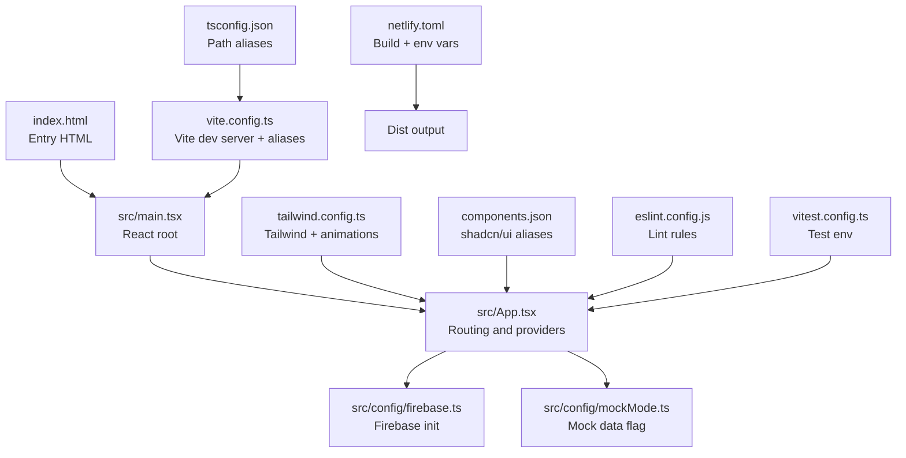
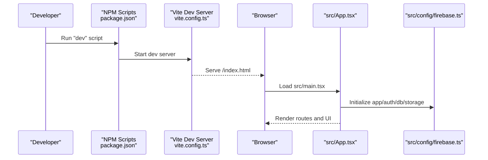
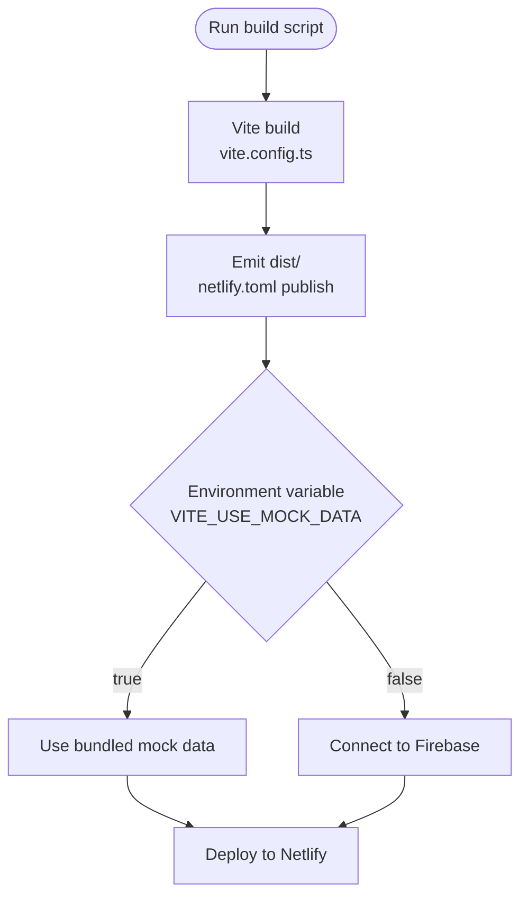
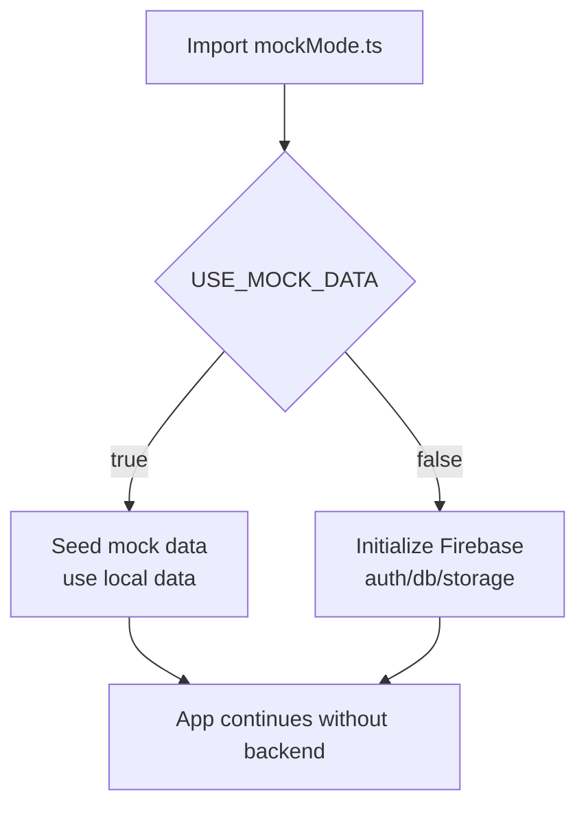
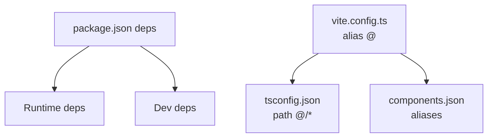

# Getting Started

<cite>
**Referenced Files in This Document**
- [README.md](file://README.md)
- [package.json](file://package.json)
- [vite.config.ts](file://vite.config.ts)
- [netlify.toml](file://netlify.toml)
- [tailwind.config.ts](file://tailwind.config.ts)
- [components.json](file://components.json)
- [tsconfig.json](file://tsconfig.json)
- [eslint.config.js](file://eslint.config.js)
- [vitest.config.ts](file://vitest.config.ts)
- [src/main.tsx](file://src/main.tsx)
- [src/App.tsx](file://src/App.tsx)
- [src/config/firebase.ts](file://src/config/firebase.ts)
- [src/config/mockMode.ts](file://src/config/mockMode.ts)
- [index.html](file://index.html)
</cite>

## Table of Contents
1. [Introduction](#introduction)
2. [Project Structure](#project-structure)
3. [Core Components](#core-components)
4. [Architecture Overview](#architecture-overview)
5. [Detailed Component Analysis](#detailed-component-analysis)
6. [Dependency Analysis](#dependency-analysis)
7. [Performance Considerations](#performance-considerations)
8. [Troubleshooting Guide](#troubleshooting-guide)
9. [Conclusion](#conclusion)
10. [Appendices](#appendices)

## Introduction
This guide helps you set up a complete TIPPAY development environment, covering prerequisites, installation, local development workflow, build processes, and deployment preparation. It also includes troubleshooting, environment configuration, verification steps, IDE setup, debugging tips, and best practices for both manual setups and GitHub Codespaces.

## Project Structure
TIPPAY is a modern React application using Vite, TypeScript, Tailwind CSS, and shadcn/ui. The repository includes:
- Application source under src/
- Configuration files for Vite, Tailwind, ESLint, Vitest, and TypeScript
- Build and deployment configuration for Netlify
- Firebase integration and mock mode support

**Diagram sources**
- [index.html:1-19](file://index.html#L1-L19)
- [src/main.tsx:1-11](file://src/main.tsx#L1-L11)
- [src/App.tsx:1-165](file://src/App.tsx#L1-L165)
- [src/config/firebase.ts:1-28](file://src/config/firebase.ts#L1-L28)
- [src/config/mockMode.ts:1-3](file://src/config/mockMode.ts#L1-L3)
- [vite.config.ts:1-21](file://vite.config.ts#L1-L21)
- [tailwind.config.ts:1-123](file://tailwind.config.ts#L1-L123)
- [components.json:1-21](file://components.json#L1-L21)
- [tsconfig.json:1-24](file://tsconfig.json#L1-L24)
- [eslint.config.js:1-27](file://eslint.config.js#L1-L27)
- [vitest.config.ts:1-17](file://vitest.config.ts#L1-L17)
- [netlify.toml:1-8](file://netlify.toml#L1-L8)

**Section sources**
- [README.md:1-74](file://README.md#L1-L74)
- [package.json:1-94](file://package.json#L1-L94)
- [vite.config.ts:1-21](file://vite.config.ts#L1-L21)
- [tailwind.config.ts:1-123](file://tailwind.config.ts#L1-L123)
- [components.json:1-21](file://components.json#L1-L21)
- [tsconfig.json:1-24](file://tsconfig.json#L1-L24)
- [eslint.config.js:1-27](file://eslint.config.js#L1-L27)
- [vitest.config.ts:1-17](file://vitest.config.ts#L1-L17)
- [netlify.toml:1-8](file://netlify.toml#L1-L8)
- [src/main.tsx:1-11](file://src/main.tsx#L1-L11)
- [src/App.tsx:1-165](file://src/App.tsx#L1-L165)
- [src/config/firebase.ts:1-28](file://src/config/firebase.ts#L1-L28)
- [src/config/mockMode.ts:1-3](file://src/config/mockMode.ts#L1-L3)
- [index.html:1-19](file://index.html#L1-L19)

## Core Components
- Package scripts and dependencies: see [package.json:6-16](file://package.json#L6-L16) for dev/build/lint/test commands and [package.json:17-92](file://package.json#L17-L92) for runtime and dev dependencies.
- Vite configuration: [vite.config.ts:6-20](file://vite.config.ts#L6-L20) defines dev server host/port, HMR, and path aliases.
- Tailwind and shadcn/ui: [tailwind.config.ts:3-122](file://tailwind.config.ts#L3-L122) and [components.json:1-21](file://components.json#L1-L21) configure design tokens, animations, and component aliases.
- TypeScript path aliases: [tsconfig.json:7-11](file://tsconfig.json#L7-L11) mirrors Vite aliases for editor support.
- Linting: [eslint.config.js:7-26](file://eslint.config.js#L7-L26) sets up TypeScript + React Hooks + React Refresh rules.
- Testing: [vitest.config.ts:5-16](file://vitest.config.ts#L5-L16) configures jsdom environment and setup files.
- Environment and deployment: [netlify.toml:1-8](file://netlify.toml#L1-L8) defines build command, publish folder, and environment variables.
- Entry and routing: [index.html:14-16](file://index.html#L14-L16), [src/main.tsx:1-11](file://src/main.tsx#L1-L11), [src/App.tsx:73-122](file://src/App.tsx#L73-L122) bootstrap the app and define routes.
- Firebase and mock mode: [src/config/firebase.ts:9-24](file://src/config/firebase.ts#L9-L24), [src/config/mockMode.ts:2-2](file://src/config/mockMode.ts#L2-L2).

**Section sources**
- [package.json:6-16](file://package.json#L6-L16)
- [package.json:17-92](file://package.json#L17-L92)
- [vite.config.ts:6-20](file://vite.config.ts#L6-L20)
- [tailwind.config.ts:3-122](file://tailwind.config.ts#L3-L122)
- [components.json:1-21](file://components.json#L1-L21)
- [tsconfig.json:7-11](file://tsconfig.json#L7-L11)
- [eslint.config.js:7-26](file://eslint.config.js#L7-L26)
- [vitest.config.ts:5-16](file://vitest.config.ts#L5-L16)
- [netlify.toml:1-8](file://netlify.toml#L1-L8)
- [index.html:14-16](file://index.html#L14-L16)
- [src/main.tsx:1-11](file://src/main.tsx#L1-L11)
- [src/App.tsx:73-122](file://src/App.tsx#L73-L122)
- [src/config/firebase.ts:9-24](file://src/config/firebase.ts#L9-L24)
- [src/config/mockMode.ts:2-2](file://src/config/mockMode.ts#L2-L2)

## Architecture Overview
High-level flow from developer machine to browser and optional mock backend.

**Diagram sources**
- [package.json:6-16](file://package.json#L6-L16)
- [vite.config.ts:6-20](file://vite.config.ts#L6-L20)
- [index.html:14-16](file://index.html#L14-L16)
- [src/main.tsx:1-11](file://src/main.tsx#L1-L11)
- [src/App.tsx:124-162](file://src/App.tsx#L124-L162)
- [src/config/firebase.ts:19-24](file://src/config/firebase.ts#L19-L24)

## Detailed Component Analysis

### Prerequisites and Installation
- Node.js and package manager:
  - The project targets Node.js and expects a package manager compatible with the scripts defined in [package.json:6-16](file://package.json#L6-L16).
  - For Codespaces, Node.js is preinstalled; refer to [README.md:45-51](file://README.md#L45-L51).
- Install dependencies:
  - Use the install script defined in [package.json:6-16](file://package.json#L6-L16).
- Start development server:
  - Use the dev script defined in [package.json:6-16](file://package.json#L6-L16) and served by [vite.config.ts:6-20](file://vite.config.ts#L6-L20).

Verification steps:
- Confirm dev server runs on the configured host/port in [vite.config.ts:7-13](file://vite.config.ts#L7-L13).
- Open the served URL in a browser and verify the splash screen and routing in [src/App.tsx:124-162](file://src/App.tsx#L124-L162).

**Section sources**
- [README.md:45-51](file://README.md#L45-L51)
- [package.json:6-16](file://package.json#L6-L16)
- [vite.config.ts:7-13](file://vite.config.ts#L7-L13)
- [src/App.tsx:124-162](file://src/App.tsx#L124-L162)

### Local Development Workflow
- Run tests:
  - Unit tests via [vitest.config.ts:7-11](file://vitest.config.ts#L7-L11) and scripts in [package.json:14-15](file://package.json#L14-L15).
- Linting:
  - Configure your editor with ESLint rules from [eslint.config.js:7-26](file://eslint.config.js#L7-L26).
- Type checking:
  - Use TypeScript configuration from [tsconfig.json:1-24](file://tsconfig.json#L1-L24) and [tsconfig.app.json](file://tsconfig.app.json), [tsconfig.node.json](file://tsconfig.node.json).

IDE setup recommendations:
- Enable TypeScript and ESLint integrations in your editor.
- Configure path aliases using [tsconfig.json:7-11](file://tsconfig.json#L7-L11) and [components.json:13-19](file://components.json#L13-L19) for shadcn/ui.

Debugging tips:
- Use Vite’s dev server logs and disable the overlay per [vite.config.ts:10-12](file://vite.config.ts#L10-L12).
- Inspect React components and providers in [src/App.tsx:124-162](file://src/App.tsx#L124-L162).

**Section sources**
- [vitest.config.ts:7-11](file://vitest.config.ts#L7-L11)
- [package.json:14-15](file://package.json#L14-L15)
- [eslint.config.js:7-26](file://eslint.config.js#L7-L26)
- [tsconfig.json:7-11](file://tsconfig.json#L7-L11)
- [components.json:13-19](file://components.json#L13-L19)
- [vite.config.ts:10-12](file://vite.config.ts#L10-L12)
- [src/App.tsx:124-162](file://src/App.tsx#L124-L162)

### Build Processes and Deployment Preparation
- Build commands:
  - Production build via [package.json:9-11](file://package.json#L9-L11).
  - Preview build via [package.json](file://package.json#L13).
- Build configuration:
  - Vite config in [vite.config.ts:6-20](file://vite.config.ts#L6-L20) resolves aliases and serves assets.
  - Tailwind scanning paths in [tailwind.config.ts](file://tailwind.config.ts#L5).
- Deployment:
  - Netlify build settings in [netlify.toml:1-8](file://netlify.toml#L1-L8) specify build command, publish folder, Node version, and environment variable for mock data.
  - Mock data toggle via [src/config/mockMode.ts:2-2](file://src/config/mockMode.ts#L2-L2) and [netlify.toml](file://netlify.toml#L7).

**Diagram sources**
- [package.json:9-11](file://package.json#L9-L11)
- [vite.config.ts:6-20](file://vite.config.ts#L6-L20)
- [netlify.toml:1-8](file://netlify.toml#L1-L8)
- [src/config/mockMode.ts:2-2](file://src/config/mockMode.ts#L2-L2)
- [src/config/firebase.ts:9-24](file://src/config/firebase.ts#L9-L24)

**Section sources**
- [package.json:9-11](file://package.json#L9-L11)
- [vite.config.ts:6-20](file://vite.config.ts#L6-L20)
- [tailwind.config.ts](file://tailwind.config.ts#L5)
- [netlify.toml:1-8](file://netlify.toml#L1-L8)
- [src/config/mockMode.ts:2-2](file://src/config/mockMode.ts#L2-L2)
- [src/config/firebase.ts:9-24](file://src/config/firebase.ts#L9-L24)

### Firebase and Mock Mode
- Firebase initialization:
  - App, Analytics, Auth, Firestore, and Storage are initialized in [src/config/firebase.ts:19-24](file://src/config/firebase.ts#L19-L24).
- Mock mode:
  - Toggle controlled by [src/config/mockMode.ts:2-2](file://src/config/mockMode.ts#L2-L2) and configured in [netlify.toml](file://netlify.toml#L7).

**Diagram sources**
- [src/config/mockMode.ts:2-2](file://src/config/mockMode.ts#L2-L2)
- [src/config/firebase.ts:19-24](file://src/config/firebase.ts#L19-L24)
- [netlify.toml](file://netlify.toml#L7)

**Section sources**
- [src/config/firebase.ts:19-24](file://src/config/firebase.ts#L19-L24)
- [src/config/mockMode.ts:2-2](file://src/config/mockMode.ts#L2-L2)
- [netlify.toml](file://netlify.toml#L7)

### Routing and Providers
- Routing:
  - Routes are defined in [src/App.tsx:73-122](file://src/App.tsx#L73-L122) with protected and role-based routes.
- Providers:
  - Multiple contexts are composed in [src/App.tsx:124-162](file://src/App.tsx#L124-L162) to manage auth, cart, orders, locations, favorites, and more.

**Diagram sources**
- [src/App.tsx:124-162](file://src/App.tsx#L124-L162)

**Section sources**
- [src/App.tsx:73-122](file://src/App.tsx#L73-L122)
- [src/App.tsx:124-162](file://src/App.tsx#L124-L162)

## Dependency Analysis
- Runtime dependencies include React, React Router, Radix UI primitives, shadcn/ui components, Tailwind-based design utilities, Firebase, and others as listed in [package.json:17-69](file://package.json#L17-L69).
- Dev dependencies include Vite, TypeScript, Tailwind, ESLint, and Vitest as listed in [package.json:71-92](file://package.json#L71-L92).
- Aliases and path resolution:
  - Vite aliases in [vite.config.ts:15-19](file://vite.config.ts#L15-L19) mirror TypeScript path aliases in [tsconfig.json:7-11](file://tsconfig.json#L7-L11) and shadcn/ui aliases in [components.json:13-19](file://components.json#L13-L19).

**Diagram sources**
- [package.json:17-92](file://package.json#L17-L92)
- [vite.config.ts:15-19](file://vite.config.ts#L15-L19)
- [tsconfig.json:7-11](file://tsconfig.json#L7-L11)
- [components.json:13-19](file://components.json#L13-L19)

**Section sources**
- [package.json:17-92](file://package.json#L17-L92)
- [vite.config.ts:15-19](file://vite.config.ts#L15-L19)
- [tsconfig.json:7-11](file://tsconfig.json#L7-L11)
- [components.json:13-19](file://components.json#L13-L19)

## Performance Considerations
- Keep dev server HMR overlay disabled for cleaner console output during development as configured in [vite.config.ts:10-12](file://vite.config.ts#L10-L12).
- Use production builds for performance profiling and testing as defined in [package.json:9-11](file://package.json#L9-L11).
- Tailwind purging and animations are configured in [tailwind.config.ts](file://tailwind.config.ts#L5) and [tailwind.config.ts](file://tailwind.config.ts#L121).

[No sources needed since this section provides general guidance]

## Troubleshooting Guide
Common setup and runtime issues:

- Node.js version mismatch
  - Ensure your local Node.js version aligns with the project’s expectations. For Netlify deployments, the environment uses Node version defined in [netlify.toml](file://netlify.toml#L6).
- Port conflicts
  - The dev server binds to the host and port configured in [vite.config.ts:7-13](file://vite.config.ts#L7-L13). Change port or stop conflicting services.
- Missing environment variables
  - Verify environment variables used by the app, especially mock mode in [src/config/mockMode.ts:2-2](file://src/config/mockMode.ts#L2-L2) and [netlify.toml](file://netlify.toml#L7).
- Firebase initialization errors
  - Confirm Firebase configuration in [src/config/firebase.ts:9-17](file://src/config/firebase.ts#L9-L17) matches your project and that network access is available.
- Path alias issues in editor
  - Ensure your editor respects TypeScript path aliases from [tsconfig.json:7-11](file://tsconfig.json#L7-L11) and shadcn/ui aliases from [components.json:13-19](file://components.json#L13-L19).
- Lint and type errors
  - Fix lint warnings per [eslint.config.js:20-24](file://eslint.config.js#L20-L24) and ensure TypeScript checks pass with [tsconfig.json:1-24](file://tsconfig.json#L1-L24).
- Test environment problems
  - Confirm jsdom environment and setup files in [vitest.config.ts:7-11](file://vitest.config.ts#L7-L11).

**Section sources**
- [netlify.toml](file://netlify.toml#L6)
- [vite.config.ts:7-13](file://vite.config.ts#L7-L13)
- [src/config/mockMode.ts:2-2](file://src/config/mockMode.ts#L2-L2)
- [src/config/firebase.ts:9-17](file://src/config/firebase.ts#L9-L17)
- [tsconfig.json:7-11](file://tsconfig.json#L7-L11)
- [components.json:13-19](file://components.json#L13-L19)
- [eslint.config.js:20-24](file://eslint.config.js#L20-L24)
- [vitest.config.ts:7-11](file://vitest.config.ts#L7-L11)

## Conclusion
You now have a complete understanding of how to set up TIPPAY locally, configure development and deployment, and troubleshoot common issues. Use the provided references to align your environment with the project’s configuration and maintain a smooth development experience.

[No sources needed since this section summarizes without analyzing specific files]

## Appendices

### A. Step-by-step Setup (Manual)
- Clone the repository and navigate into the project directory.
- Install dependencies using the install script defined in [package.json:6-16](file://package.json#L6-L16).
- Start the development server using the dev script in [package.json:6-16](file://package.json#L6-L16).
- Verify the dev server host/port in [vite.config.ts:7-13](file://vite.config.ts#L7-L13) and open the served URL in your browser.
- Confirm the app renders routes from [src/App.tsx:73-122](file://src/App.tsx#L73-L122).

**Section sources**
- [package.json:6-16](file://package.json#L6-L16)
- [vite.config.ts:7-13](file://vite.config.ts#L7-L13)
- [src/App.tsx:73-122](file://src/App.tsx#L73-L122)

### B. GitHub Codespaces Alternative
- Open the repository in GitHub Codespaces as described in [README.md:45-51](file://README.md#L45-L51).
- Codespaces provides a ready-to-use Node.js environment; install dependencies and start the dev server using the same scripts in [package.json:6-16](file://package.json#L6-L16).

**Section sources**
- [README.md:45-51](file://README.md#L45-L51)
- [package.json:6-16](file://package.json#L6-L16)

### C. Build and Deploy Checklist
- Run the production build script in [package.json:9-11](file://package.json#L9-L11).
- Confirm Tailwind scanning paths in [tailwind.config.ts](file://tailwind.config.ts#L5).
- Prepare Netlify deployment using [netlify.toml:1-8](file://netlify.toml#L1-L8) and environment variables.
- Toggle mock mode via [src/config/mockMode.ts:2-2](file://src/config/mockMode.ts#L2-L2) and [netlify.toml](file://netlify.toml#L7).

**Section sources**
- [package.json:9-11](file://package.json#L9-L11)
- [tailwind.config.ts](file://tailwind.config.ts#L5)
- [netlify.toml:1-8](file://netlify.toml#L1-L8)
- [src/config/mockMode.ts:2-2](file://src/config/mockMode.ts#L2-L2)