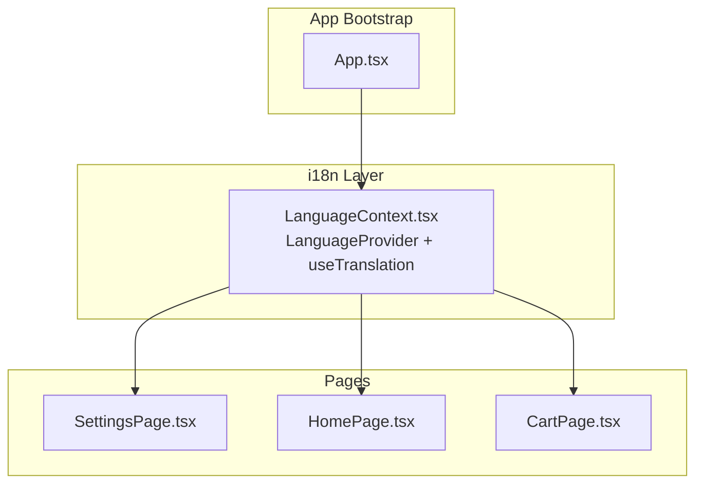
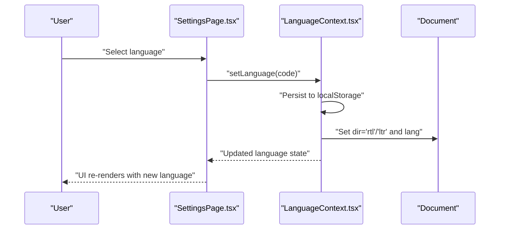
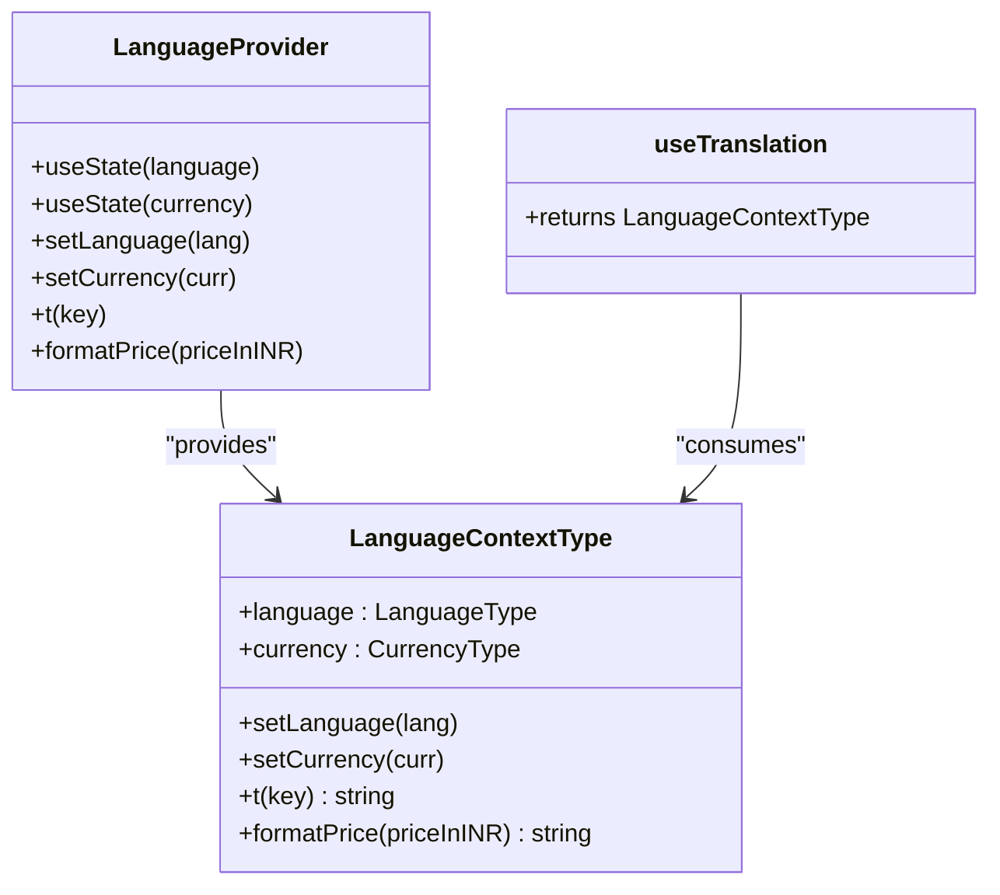
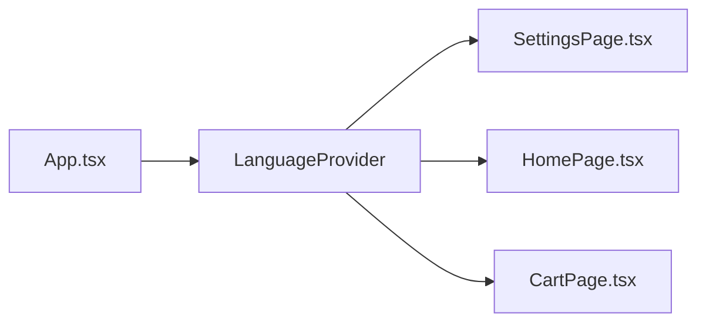

# Internationalization

<cite>
**Referenced Files in This Document**
- [LanguageContext.tsx](file://src/context/LanguageContext.tsx)
- [App.tsx](file://src/App.tsx)
- [SettingsPage.tsx](file://src/pages/SettingsPage.tsx)
- [HomePage.tsx](file://src/pages/HomePage.tsx)
- [CartPage.tsx](file://src/pages/CartPage.tsx)
- [README.md](file://README.md)
</cite>

## Table of Contents
1. [Introduction](#introduction)
2. [Project Structure](#project-structure)
3. [Core Components](#core-components)
4. [Architecture Overview](#architecture-overview)
5. [Detailed Component Analysis](#detailed-component-analysis)
6. [Dependency Analysis](#dependency-analysis)
7. [Performance Considerations](#performance-considerations)
8. [Troubleshooting Guide](#troubleshooting-guide)
9. [Conclusion](#conclusion)

## Introduction
This document explains TIPPAY’s internationalization (i18n) system and multi-language support. It focuses on the LanguageContext implementation for managing user language preferences and locale settings, the translation system architecture, message formatting, and pluralization handling. It also documents integration with UI components to support right-to-left languages and bidirectional text, locale detection and fallback mechanisms, dynamic language switching, best practices for adding new languages, managing translation files, and handling date/time formatting across locales. Examples of implementing translations in components and context usage patterns are included, along with performance considerations for large translation datasets.

## Project Structure
The i18n system is centered around a single LanguageContext provider that exposes:
- Language selection and persistence
- Currency selection and formatting
- Translation lookup by message keys
- Dynamic directionality for right-to-left languages

Key locations:
- Provider and hooks: src/context/LanguageContext.tsx
- Application bootstrap: src/App.tsx
- Example consumers: src/pages/SettingsPage.tsx, src/pages/HomePage.tsx, src/pages/CartPage.tsx

**Diagram sources**
- [App.tsx:126-164](file://src/App.tsx#L126-L164)
- [LanguageContext.tsx:93-151](file://src/context/LanguageContext.tsx#L93-L151)
- [SettingsPage.tsx:1-128](file://src/pages/SettingsPage.tsx#L1-L128)
- [HomePage.tsx:1-200](file://src/pages/HomePage.tsx#L1-L200)
- [CartPage.tsx:1-200](file://src/pages/CartPage.tsx#L1-L200)

**Section sources**
- [App.tsx:126-164](file://src/App.tsx#L126-L164)
- [LanguageContext.tsx:93-151](file://src/context/LanguageContext.tsx#L93-L151)

## Core Components
- LanguageContext provider
  - Manages language and currency state
  - Persists selections to localStorage
  - Exposes translation function and price formatter
  - Sets HTML dir/lang attributes for RTL support
- useTranslation hook
  - Returns language, setters, t(key), and formatPrice(priceInINR)

Key capabilities:
- Translation dictionary keyed by message IDs with values per supported language
- Fallback chain: requested language → English → message key
- Currency conversion and symbol rendering
- Directionality switching for Arabic

**Section sources**
- [LanguageContext.tsx:3-135](file://src/context/LanguageContext.tsx#L3-L135)
- [LanguageContext.tsx:153-159](file://src/context/LanguageContext.tsx#L153-L159)

## Architecture Overview
The i18n architecture is a lightweight, in-app solution that avoids external libraries. It relies on:
- A centralized provider for state and helpers
- Consumers retrieving translations and formatted values via hooks
- Local storage for persistence across sessions
- Inline directionality adjustments for RTL languages

**Diagram sources**
- [SettingsPage.tsx:50-71](file://src/pages/SettingsPage.tsx#L50-L71)
- [LanguageContext.tsx:102-113](file://src/context/LanguageContext.tsx#L102-L113)

## Detailed Component Analysis

### LanguageContext Implementation
- Types and constants
  - LanguageType: "en" | "hi" | "kn" | "es" | "ar"
  - CurrencyType: "INR" | "USD" | "EUR" | "GBP"
  - Translations dictionary keyed by message IDs with per-language values
  - Currency symbols and rates
- Provider state
  - Initializes language and currency from localStorage or defaults
  - setLanguage persists and toggles HTML dir/lang attributes
  - setCurrency persists currency preference
- Helpers
  - t(key): resolves translation with fallback chain
  - formatPrice(priceInINR): converts and formats using selected currency

**Diagram sources**
- [LanguageContext.tsx:82-159](file://src/context/LanguageContext.tsx#L82-L159)

**Section sources**
- [LanguageContext.tsx:3-135](file://src/context/LanguageContext.tsx#L3-L135)
- [LanguageContext.tsx:153-159](file://src/context/LanguageContext.tsx#L153-L159)

### Translation System and Message Keys
- Message IDs are organized by feature (e.g., nav.*, home.*, search.*, cart.*, settings.*, craving.*)
- Lookup is performed via t(key)
- Fallback behavior ensures resilience against missing keys

Usage examples in pages:
- Settings: displays labels and lists for language and currency selectors
- Home: renders header, placeholders, and prompts
- Cart: formats totals and promotional messaging

**Section sources**
- [SettingsPage.tsx:11-128](file://src/pages/SettingsPage.tsx#L11-L128)
- [HomePage.tsx:86-200](file://src/pages/HomePage.tsx#L86-L200)
- [CartPage.tsx:134-200](file://src/pages/CartPage.tsx#L134-L200)

### Price Formatting and Currency Conversion
- Converts base INR amounts to selected currency using fixed rates
- Applies currency symbol and rounding rules
- Used across UI to present consistent pricing

**Section sources**
- [LanguageContext.tsx:68-80](file://src/context/LanguageContext.tsx#L68-L80)
- [LanguageContext.tsx:137-144](file://src/context/LanguageContext.tsx#L137-L144)
- [CartPage.tsx:40-132](file://src/pages/CartPage.tsx#L40-L132)

### Right-to-Left (RTL) and Bidirectional Text Support
- On selecting Arabic, the provider sets documentElement.dir to "rtl" and lang to "ar"
- Other languages default to "ltr"
- This enables proper text direction and mirroring of UI layouts

**Section sources**
- [LanguageContext.tsx:102-113](file://src/context/LanguageContext.tsx#L102-L113)
- [LanguageContext.tsx:120-129](file://src/context/LanguageContext.tsx#L120-L129)

### Locale Detection and Fallback Mechanisms
- Initial language and currency are loaded from localStorage
- Defaults to English and INR if no stored preference exists
- Translation fallback: requested language → English → message key itself

**Section sources**
- [LanguageContext.tsx:94-100](file://src/context/LanguageContext.tsx#L94-L100)
- [LanguageContext.tsx:131-135](file://src/context/LanguageContext.tsx#L131-L135)

### Dynamic Language Switching
- Settings page provides a grid of selectable languages
- Clicking a language invokes setLanguage, persisting the choice and updating directionality

**Section sources**
- [SettingsPage.tsx:18-24](file://src/pages/SettingsPage.tsx#L18-L24)
- [SettingsPage.tsx:57-70](file://src/pages/SettingsPage.tsx#L57-L70)
- [LanguageContext.tsx:102-113](file://src/context/LanguageContext.tsx#L102-L113)

### Date and Time Formatting Across Locales
- The current codebase uses JavaScript’s built-in toLocaleDateString/toLocaleTimeString with a locale string
- Examples:
  - Order tracking page uses a locale-specific time format
  - Orders page uses a locale-specific date format
  - Restaurant analytics page uses a locale-specific date format
- These usages demonstrate consistent cross-locale time/date rendering

**Section sources**
- [CartPage.tsx:69-90](file://src/pages/CartPage.tsx#L69-L90)
- [HomePage.tsx:138-140](file://src/pages/HomePage.tsx#L138-L140)
- [HomePage.tsx:176-198](file://src/pages/HomePage.tsx#L176-L198)

### Pluralization Handling
- The current implementation does not include dedicated pluralization logic
- For scenarios requiring pluralization, consider integrating a library or adopting a pattern that selects message variants based on counts

[No sources needed since this section provides general guidance]

## Dependency Analysis
- Provider placement: LanguageProvider wraps the app in App.tsx, ensuring global availability
- Consumers: Multiple pages import and use useTranslation to render localized content and format prices
- Persistence: localStorage keys for language and currency enable state continuity across reloads

**Diagram sources**
- [App.tsx:130-160](file://src/App.tsx#L130-L160)
- [LanguageContext.tsx:93-151](file://src/context/LanguageContext.tsx#L93-L151)

**Section sources**
- [App.tsx:130-160](file://src/App.tsx#L130-L160)
- [LanguageContext.tsx:93-151](file://src/context/LanguageContext.tsx#L93-L151)

## Performance Considerations
- Translation lookup is O(1) via dictionary access
- Price formatting is constant-time arithmetic
- For very large translation datasets:
  - Consider splitting translations into feature-based chunks and lazy-loading them
  - Memoize translation results per component if repeated lookups occur frequently
  - Keep message keys concise and hierarchical to simplify maintenance
- Avoid unnecessary re-renders by extracting translation calls outside of hot loops and memoizing derived values

[No sources needed since this section provides general guidance]

## Troubleshooting Guide
Common issues and resolutions:
- Missing translation key
  - Symptom: Key appears in UI
  - Cause: Key not present in translations dictionary
  - Resolution: Add key to the dictionary with values for all supported languages
- Incorrect fallback behavior
  - Symptom: Fallback to English not occurring
  - Cause: Missing English value for a key
  - Resolution: Ensure English fallback is provided for all keys
- RTL layout not applied
  - Symptom: Arabic text reads left-to-right
  - Cause: HTML dir/lang not updated
  - Resolution: Verify setLanguage is invoked and side effects are executed
- Currency formatting anomalies
  - Symptom: Unexpected decimals or symbols
  - Cause: Incorrect currency rate or rounding logic
  - Resolution: Validate rates and rounding rules in the formatter

**Section sources**
- [LanguageContext.tsx:131-135](file://src/context/LanguageContext.tsx#L131-L135)
- [LanguageContext.tsx:102-113](file://src/context/LanguageContext.tsx#L102-L113)
- [LanguageContext.tsx:137-144](file://src/context/LanguageContext.tsx#L137-L144)

## Conclusion
TIPPAY’s i18n system centers on a compact, in-app LanguageContext that manages language and currency, persists preferences, and exposes translation and formatting helpers. It supports dynamic language switching, RTL directionality, and locale-aware date/time formatting. For future enhancements, consider modularizing translations, adopting pluralization strategies, and evaluating performance optimizations for larger datasets.

[No sources needed since this section summarizes without analyzing specific files]