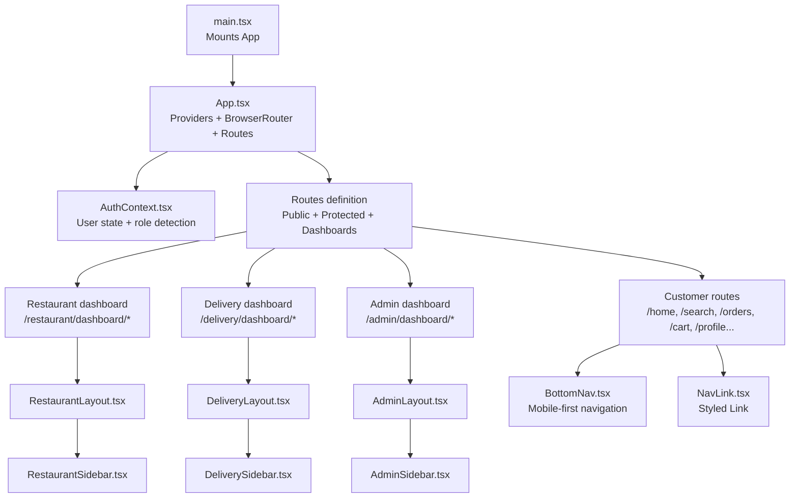
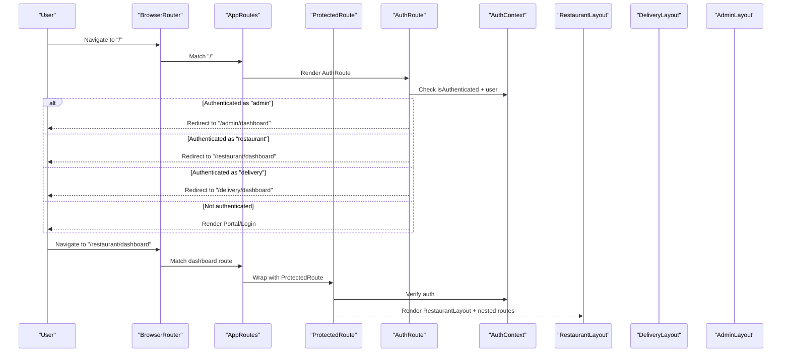
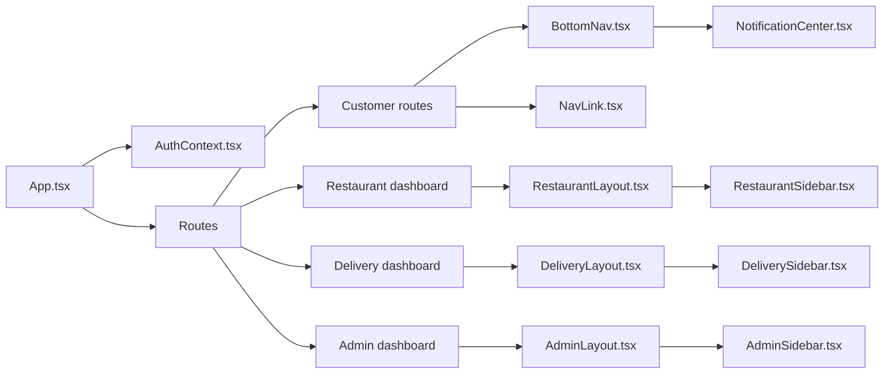

# Navigation & Routing

<cite>
**Referenced Files in This Document**
- [App.tsx](file://src/App.tsx)
- [main.tsx](file://src/main.tsx)
- [AuthContext.tsx](file://src/context/AuthContext.tsx)
- [BottomNav.tsx](file://src/components/BottomNav.tsx)
- [NavLink.tsx](file://src/components/NavLink.tsx)
- [RestaurantSidebar.tsx](file://src/components/RestaurantSidebar.tsx)
- [RestaurantLayout.tsx](file://src/pages/restaurant/RestaurantLayout.tsx)
- [DeliverySidebar.tsx](file://src/components/DeliverySidebar.tsx)
- [DeliveryLayout.tsx](file://src/pages/delivery/DeliveryLayout.tsx)
- [AdminSidebar.tsx](file://src/components/AdminSidebar.tsx)
- [AdminLayout.tsx](file://src/pages/admin/AdminLayout.tsx)
- [use-mobile.tsx](file://src/hooks/use-mobile.tsx)
- [NotificationCenter.tsx](file://src/components/NotificationCenter.tsx)
- [Portal.tsx](file://src/pages/Portal.tsx)
- [Login.tsx](file://src/pages/Login.tsx)
</cite>

## Table of Contents
1. [Introduction](#introduction)
2. [Project Structure](#project-structure)
3. [Core Components](#core-components)
4. [Architecture Overview](#architecture-overview)
5. [Detailed Component Analysis](#detailed-component-analysis)
6. [Dependency Analysis](#dependency-analysis)
7. [Performance Considerations](#performance-considerations)
8. [Troubleshooting Guide](#troubleshooting-guide)
9. [Conclusion](#conclusion)

## Introduction
This document explains TIPPAY’s navigation and routing system built with React Router DOM. It covers route definitions, protected routes, role-based navigation patterns, sidebar components for restaurant owners, delivery agents, and administrators, a mobile-friendly bottom navigation, and reusable link components. It also documents routing guards, authentication checks, dynamic redirection based on user roles, URL structure, route parameters, query string handling, programmatic navigation, and responsive navigation patterns across desktop and mobile.

## Project Structure
The routing system is initialized at the application root and organized around role-specific dashboards and shared UI components:
- Application bootstrap wires providers and router configuration.
- Route definitions group public, authenticated, and role-specific dashboards.
- Role-based layouts embed role-aware sidebars and nested routes.
- Mobile navigation is handled via a bottom bar with animated indicators and cart integration.

**Diagram sources**
- [main.tsx:1-11](file://src/main.tsx#L1-L11)
- [App.tsx:124-165](file://src/App.tsx#L124-L165)
- [AuthContext.tsx:1-130](file://src/context/AuthContext.tsx#L1-L130)
- [RestaurantLayout.tsx:1-25](file://src/pages/restaurant/RestaurantLayout.tsx#L1-L25)
- [RestaurantSidebar.tsx:1-93](file://src/components/RestaurantSidebar.tsx#L1-L93)
- [DeliveryLayout.tsx:1-25](file://src/pages/delivery/DeliveryLayout.tsx#L1-L25)
- [DeliverySidebar.tsx:1-90](file://src/components/DeliverySidebar.tsx#L1-L90)
- [AdminLayout.tsx:1-23](file://src/pages/admin/AdminLayout.tsx#L1-L23)
- [AdminSidebar.tsx:1-86](file://src/components/AdminSidebar.tsx#L1-L86)
- [BottomNav.tsx:1-65](file://src/components/BottomNav.tsx#L1-L65)
- [NavLink.tsx:1-29](file://src/components/NavLink.tsx#L1-L29)

**Section sources**
- [main.tsx:1-11](file://src/main.tsx#L1-L11)
- [App.tsx:73-122](file://src/App.tsx#L73-L122)

## Core Components
- ProtectedRoute: Wraps routes requiring authentication.
- AuthRoute: Redirects authenticated users to their role-specific dashboard; otherwise renders public pages.
- AppRoutes: Central route registry grouping public, customer, restaurant, delivery, and admin routes.
- Role-aware layouts and sidebars: RestaurantLayout, DeliveryLayout, AdminLayout with embedded sidebars.
- BottomNav: Mobile bottom navigation with animated indicators and cart badge.
- NavLink: Styled link component compatible with react-router’s NavLink.

Key responsibilities:
- Authentication gating and role-based redirection.
- Nested dashboard routes with index redirects.
- Consistent navigation UX across desktop and mobile.

**Section sources**
- [App.tsx:55-71](file://src/App.tsx#L55-L71)
- [App.tsx:73-122](file://src/App.tsx#L73-L122)
- [BottomNav.tsx:14-62](file://src/components/BottomNav.tsx#L14-L62)
- [NavLink.tsx:11-24](file://src/components/NavLink.tsx#L11-L24)

## Architecture Overview
The routing architecture separates concerns by role while sharing common UI and contexts:
- Providers (Auth, Cart, Order, Address, etc.) wrap the router to enable global state.
- Public portal routes redirect to Login with a type query parameter.
- Authenticated users are redirected to role-specific dashboards.
- Role dashboards define nested routes for sub-pages.

**Diagram sources**
- [App.tsx:55-71](file://src/App.tsx#L55-L71)
- [App.tsx:73-122](file://src/App.tsx#L73-L122)
- [AuthContext.tsx:18-27](file://src/context/AuthContext.tsx#L18-L27)

## Detailed Component Analysis

### ProtectedRoute and AuthRoute
- ProtectedRoute enforces authentication for customer and role-specific routes.
- AuthRoute prevents authenticated users from accessing Login or Portal and redirects based on role.

Behavior highlights:
- Redirects unauthenticated users to the portal.
- Redirects authenticated users to:
  - Admin: /admin/dashboard
  - Restaurant: /restaurant/dashboard
  - Delivery: /delivery/dashboard
  - Others: /home

**Section sources**
- [App.tsx:55-71](file://src/App.tsx#L55-L71)

### Route Definitions and URL Structure
Primary routes:
- Public: "/", "/login"
- Customer: "/home", "/restaurant/:id", "/cart", "/search", "/orders", "/order/:id", "/profile", "/addresses", "/favorites", "/settings", etc.
- Restaurant dashboard: "/restaurant/dashboard" with nested routes:
  - Index redirects to "/restaurant/dashboard/orders"
  - Sub-routes: orders, menu, requests, coupons, analytics
- Delivery dashboard: "/delivery/dashboard" with nested routes:
  - Index redirects to "/delivery/dashboard/orders"
  - Sub-routes: orders, active, stats, profile
- Admin dashboard: "/admin/dashboard" with nested routes:
  - Index redirects to "/admin/dashboard/overview"
  - Sub-routes: overview, restaurants, orders, agents, users
- Fallback: "*" -> NotFound

URL parameters and query strings:
- Route parameters: ":id" in "/restaurant/:id" and "/order/:id".
- Query string: "type" in "/login?type=..." to determine role during login/signup.

Programmatic navigation examples:
- From Portal to Login with role type.
- From Login to role-specific dashboard after authentication.
- From sidebars to dashboard sub-pages.

**Section sources**
- [App.tsx:73-122](file://src/App.tsx#L73-L122)
- [Login.tsx:24-44](file://src/pages/Login.tsx#L24-L44)
- [Portal.tsx:8-23](file://src/pages/Portal.tsx#L8-L23)

### Role-Based Navigation Patterns

#### Customer Navigation
- Desktop: Uses layout headers and links; sidebars are not shown.
- Mobile: BottomNav provides five primary destinations:
  - Home, Search, Cart, Orders, Profile
- Cart badge updates dynamically; active tab is highlighted with an animated indicator.

Responsive behavior:
- Uses a mobile detection hook to adapt UI affordances; BottomNav is fixed at the bottom on small screens.

**Section sources**
- [BottomNav.tsx:14-62](file://src/components/BottomNav.tsx#L14-L62)
- [use-mobile.tsx:5-18](file://src/hooks/use-mobile.tsx#L5-L18)

#### Restaurant Owner Menus
- Layout: RestaurantLayout wraps RestaurantSidebar and outlet.
- Sidebar items: Orders, Menu Editor, Dish Requests, Coupons, Analytics.
- Logout action clears session and navigates to home.

Dynamic generation:
- Sidebar items are defined as a static list and rendered via NavLink with active state styling.

**Section sources**
- [RestaurantLayout.tsx:5-22](file://src/pages/restaurant/RestaurantLayout.tsx#L5-L22)
- [RestaurantSidebar.tsx:20-76](file://src/components/RestaurantSidebar.tsx#L20-L76)

#### Delivery Agent Dashboards
- Layout: DeliveryLayout with DeliverySidebar and outlet.
- Sidebar items: Nearby Orders, Active Delivery, My Stats, Profile.
- Logout action clears session and navigates to home.

**Section sources**
- [DeliveryLayout.tsx:5-22](file://src/pages/delivery/DeliveryLayout.tsx#L5-L22)
- [DeliverySidebar.tsx:20-75](file://src/components/DeliverySidebar.tsx#L20-L75)

#### Administrator Panels
- Layout: AdminLayout with AdminSidebar and outlet.
- Sidebar items: Overview, Restaurants, Orders, Delivery Agents, Users.
- Logout action clears session and navigates to home.

**Section sources**
- [AdminLayout.tsx:5-20](file://src/pages/admin/AdminLayout.tsx#L5-L20)
- [AdminSidebar.tsx:20-71](file://src/components/AdminSidebar.tsx#L20-L71)

### Sidebar Components and Link Behavior
- Shared NavLink component integrates with react-router’s NavLink to apply active/pending classes conditionally.
- Sidebars use the NavLink wrapper to maintain consistent active-state styling and navigation behavior.
- NotificationCenter appears in sidebars and bottom navigation, displaying unread counts with animations.

**Section sources**
- [NavLink.tsx:11-24](file://src/components/NavLink.tsx#L11-L24)
- [RestaurantSidebar.tsx:64-72](file://src/components/RestaurantSidebar.tsx#L64-L72)
- [DeliverySidebar.tsx:61-69](file://src/components/DeliverySidebar.tsx#L61-L69)
- [AdminSidebar.tsx:57-65](file://src/components/AdminSidebar.tsx#L57-L65)
- [NotificationCenter.tsx:56-120](file://src/components/NotificationCenter.tsx#L56-L120)

### Authentication Checks and Dynamic Redirection
- AuthContext provides user state, login/signup, and role detection logic.
- Role detection considers email suffixes to infer role.
- AuthRoute redirects authenticated users to appropriate dashboard.
- Login handles role-specific inputs and redirects to role-specific dashboard upon success.

**Section sources**
- [AuthContext.tsx:31-38](file://src/context/AuthContext.tsx#L31-L38)
- [App.tsx:60-71](file://src/App.tsx#L60-L71)
- [Login.tsx:46-112](file://src/pages/Login.tsx#L46-L112)

### Programmatic Navigation and Transitions
- BottomNav programmatically navigates to paths and highlights active items.
- Portal routes to Login with a type query parameter to preselect role.
- Login computes redirect path based on detected role and navigates accordingly.
- Sidebars trigger logout and navigate to home.

**Section sources**
- [BottomNav.tsx:14-62](file://src/components/BottomNav.tsx#L14-L62)
- [Portal.tsx:8-23](file://src/pages/Portal.tsx#L8-L23)
- [Login.tsx:37-44](file://src/pages/Login.tsx#L37-L44)
- [RestaurantSidebar.tsx:35-38](file://src/components/RestaurantSidebar.tsx#L35-L38)
- [DeliverySidebar.tsx:33-36](file://src/components/DeliverySidebar.tsx#L33-L36)
- [AdminSidebar.tsx:75-81](file://src/components/AdminSidebar.tsx#L75-L81)

### Responsive Navigation Patterns
- BottomNav is fixed at the bottom on small screens; icons and badges animate on change.
- Sidebars collapse to icons when the sidebar is collapsed, preserving navigation affordances.
- useIsMobile detects viewport width to adapt behavior; BottomNav is ideal for mobile usage.

**Section sources**
- [BottomNav.tsx:20-60](file://src/components/BottomNav.tsx#L20-L60)
- [RestaurantSidebar.tsx:28-30](file://src/components/RestaurantSidebar.tsx#L28-L30)
- [use-mobile.tsx:5-18](file://src/hooks/use-mobile.tsx#L5-L18)

## Dependency Analysis
Routing depends on:
- React Router DOM for routing primitives and navigation.
- AuthContext for authentication state and role inference.
- UI sidebar components for role-specific navigation containers.
- Contexts for cart and notifications to enrich navigation UX.

**Diagram sources**
- [App.tsx:73-122](file://src/App.tsx#L73-L122)
- [AuthContext.tsx:18-27](file://src/context/AuthContext.tsx#L18-L27)
- [RestaurantLayout.tsx:1-25](file://src/pages/restaurant/RestaurantLayout.tsx#L1-L25)
- [RestaurantSidebar.tsx:1-93](file://src/components/RestaurantSidebar.tsx#L1-L93)
- [DeliveryLayout.tsx:1-25](file://src/pages/delivery/DeliveryLayout.tsx#L1-L25)
- [DeliverySidebar.tsx:1-90](file://src/components/DeliverySidebar.tsx#L1-L90)
- [AdminLayout.tsx:1-23](file://src/pages/admin/AdminLayout.tsx#L1-L23)
- [AdminSidebar.tsx:1-86](file://src/components/AdminSidebar.tsx#L1-L86)
- [BottomNav.tsx:1-65](file://src/components/BottomNav.tsx#L1-L65)
- [NavLink.tsx:1-29](file://src/components/NavLink.tsx#L1-L29)
- [NotificationCenter.tsx:1-123](file://src/components/NotificationCenter.tsx#L1-L123)

**Section sources**
- [App.tsx:73-122](file://src/App.tsx#L73-L122)
- [AuthContext.tsx:18-27](file://src/context/AuthContext.tsx#L18-L27)

## Performance Considerations
- Keep route components lightweight; defer heavy computations to lazy-loaded chunks if needed.
- Avoid unnecessary re-renders by using stable references for sidebar items and navigation handlers.
- Use NavLink’s active/pending classes to avoid manual pathname comparisons in components.
- Minimize cart and notification subscriptions to only where needed (e.g., BottomNav and NotificationCenter).

## Troubleshooting Guide
Common issues and resolutions:
- Users stuck on Portal: Ensure AuthRoute redirects authenticated users to the correct dashboard based on role.
- Login failures: Verify email normalization and role-specific validations in Login; check AuthContext login outcomes.
- Cart badge not updating: Confirm BottomNav subscribes to cart context and that cart updates propagate.
- Active tab highlighting: Ensure NavLink is used consistently and receives activeClassName/pendingClassName props.
- Notifications not visible: Confirm NotificationCenter is present in both sidebars and bottom bar; verify unread count updates.

**Section sources**
- [App.tsx:60-71](file://src/App.tsx#L60-L71)
- [Login.tsx:46-112](file://src/pages/Login.tsx#L46-L112)
- [AuthContext.tsx:58-82](file://src/context/AuthContext.tsx#L58-L82)
- [BottomNav.tsx:14-62](file://src/components/BottomNav.tsx#L14-L62)
- [NavLink.tsx:11-24](file://src/components/NavLink.tsx#L11-L24)
- [NotificationCenter.tsx:56-120](file://src/components/NotificationCenter.tsx#L56-L120)

## Conclusion
TIPPAY’s navigation and routing system cleanly separates public, authenticated, and role-specific experiences. ProtectedRoute and AuthRoute enforce security and guide users to appropriate dashboards. Role-aware layouts and sidebars provide consistent navigation across desktop and mobile, while BottomNav and NavLink deliver a cohesive UX. Query string handling and programmatic navigation support flexible onboarding and seamless transitions.