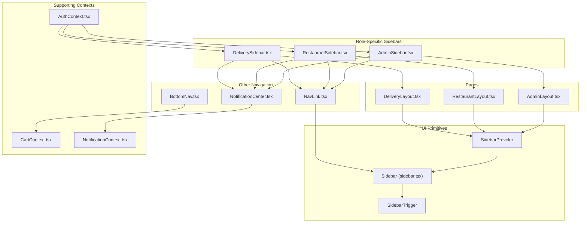
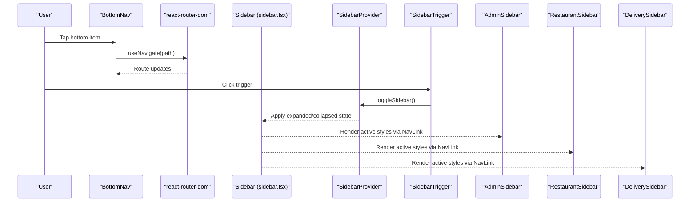
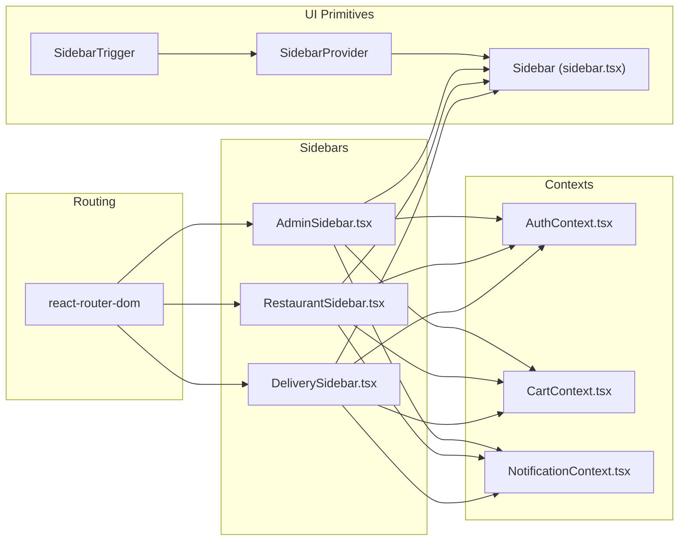

# Navigation Components

<cite>
**Referenced Files in This Document**
- [NavLink.tsx](file://src/components/NavLink.tsx)
- [BottomNav.tsx](file://src/components/BottomNav.tsx)
- [AdminSidebar.tsx](file://src/components/AdminSidebar.tsx)
- [RestaurantSidebar.tsx](file://src/components/RestaurantSidebar.tsx)
- [DeliverySidebar.tsx](file://src/components/DeliverySidebar.tsx)
- [sidebar.tsx](file://src/components/ui/sidebar.tsx)
- [NotificationCenter.tsx](file://src/components/NotificationCenter.tsx)
- [AdminLayout.tsx](file://src/pages/admin/AdminLayout.tsx)
- [RestaurantLayout.tsx](file://src/pages/restaurant/RestaurantLayout.tsx)
- [DeliveryLayout.tsx](file://src/pages/delivery/DeliveryLayout.tsx)
- [AuthContext.tsx](file://src/context/AuthContext.tsx)
- [CartContext.tsx](file://src/context/CartContext.tsx)
- [NotificationContext.tsx](file://src/context/NotificationContext.tsx)
- [use-mobile.tsx](file://src/hooks/use-mobile.tsx)
</cite>

## Table of Contents
1. [Introduction](#introduction)
2. [Project Structure](#project-structure)
3. [Core Components](#core-components)
4. [Architecture Overview](#architecture-overview)
5. [Detailed Component Analysis](#detailed-component-analysis)
6. [Dependency Analysis](#dependency-analysis)
7. [Performance Considerations](#performance-considerations)
8. [Accessibility and Responsiveness](#accessibility-and-responsiveness)
9. [Troubleshooting Guide](#troubleshooting-guide)
10. [Conclusion](#conclusion)
11. [Appendices](#appendices)

## Introduction
This document explains TIPPAY’s navigation components system with a focus on:
- NavLink: a styled router link wrapper with active/pending states and consistent styling.
- BottomNav: a mobile-first bottom navigation bar with cart integration and animations.
- Role-based sidebars: AdminSidebar, RestaurantSidebar, and DeliverySidebar, each with tailored menus and navigation patterns.
- Integration with routing, contexts, and UI primitives to deliver a cohesive UX across devices.

It covers component props, styling customization, accessibility, keyboard navigation, and guidance for creating and extending navigation components.

## Project Structure
The navigation system spans three areas:
- UI primitives: reusable sidebar building blocks and helpers.
- Role-specific navigators: admin, restaurant, and delivery dashboards.
- Page layouts: per-role page shells that embed the sidebars and trigger routing.
- Supporting contexts: authentication, cart, and notifications inform active states and badges.

**Diagram sources**
- [sidebar.tsx:128-216](file://src/components/ui/sidebar.tsx#L128-L216)
- [AdminLayout.tsx:5-19](file://src/pages/admin/AdminLayout.tsx#L5-L19)
- [RestaurantLayout.tsx:5-21](file://src/pages/restaurant/RestaurantLayout.tsx#L5-L21)
- [DeliveryLayout.tsx:5-21](file://src/pages/delivery/DeliveryLayout.tsx#L5-L21)
- [AdminSidebar.tsx:28-85](file://src/components/AdminSidebar.tsx#L28-L85)
- [RestaurantSidebar.tsx:28-92](file://src/components/RestaurantSidebar.tsx#L28-L92)
- [DeliverySidebar.tsx:27-89](file://src/components/DeliverySidebar.tsx#L27-L89)
- [NavLink.tsx:11-26](file://src/components/NavLink.tsx#L11-L26)
- [BottomNav.tsx:15-63](file://src/components/BottomNav.tsx#L15-L63)
- [NotificationCenter.tsx:56-120](file://src/components/NotificationCenter.tsx#L56-L120)
- [AuthContext.tsx:40-123](file://src/context/AuthContext.tsx#L40-L123)
- [CartContext.tsx:22-57](file://src/context/CartContext.tsx#L22-L57)
- [NotificationContext.tsx:68-114](file://src/context/NotificationContext.tsx#L68-L114)

**Section sources**
- [sidebar.tsx:128-216](file://src/components/ui/sidebar.tsx#L128-L216)
- [AdminLayout.tsx:5-19](file://src/pages/admin/AdminLayout.tsx#L5-L19)
- [RestaurantLayout.tsx:5-21](file://src/pages/restaurant/RestaurantLayout.tsx#L5-L21)
- [DeliveryLayout.tsx:5-21](file://src/pages/delivery/DeliveryLayout.tsx#L5-L21)

## Core Components
- NavLink: A forward-ref wrapper around the router’s NavLink that merges a base className with active/pending classes. It exposes props for className, activeClassName, pendingClassName, and forwards all other NavLinkProps.
- BottomNav: A fixed bottom navigation bar for mobile with six primary destinations, animated indicators, cart badge, and smooth transitions.

Key behaviors:
- Active state is derived from the current pathname.
- Pending state is handled via the router’s isPending flag.
- Cart badge appears conditionally when totalItems > 0.

**Section sources**
- [NavLink.tsx:11-26](file://src/components/NavLink.tsx#L11-L26)
- [BottomNav.tsx:15-63](file://src/components/BottomNav.tsx#L15-L63)

## Architecture Overview
The navigation stack integrates routing, UI primitives, and role-aware sidebars:

**Diagram sources**
- [BottomNav.tsx:15-63](file://src/components/BottomNav.tsx#L15-L63)
- [sidebar.tsx:74-76](file://src/components/ui/sidebar.tsx#L74-L76)
- [AdminSidebar.tsx:57-66](file://src/components/AdminSidebar.tsx#L57-L66)
- [RestaurantSidebar.tsx:64-72](file://src/components/RestaurantSidebar.tsx#L64-L72)
- [DeliverySidebar.tsx:61-69](file://src/components/DeliverySidebar.tsx#L61-L69)

## Detailed Component Analysis

### NavLink Component
Purpose:
- Provide a consistent, styled link that respects active and pending states.
- Allow consumers to pass additional className and override active/pending styles.

Implementation highlights:
- Accepts className, activeClassName, pendingClassName, and forwards all other NavLinkProps.
- Uses router’s isActive/isPending to compute final className.
- Exposes forwardRef for DOM access.

Usage pattern:
- Used inside SidebarMenuButton asChild to integrate with the sidebar’s menu system.

Props summary:
- className: Base link class.
- activeClassName: Class applied when active.
- pendingClassName: Class applied when pending.
- Other NavLinkProps: Forwarded to the underlying router NavLink.

Styling customization:
- Combine base className with conditional active/pending classes.
- Works seamlessly with the sidebar’s menu button styling.

**Section sources**
- [NavLink.tsx:5-26](file://src/components/NavLink.tsx#L5-L26)
- [AdminSidebar.tsx:57-66](file://src/components/AdminSidebar.tsx#L57-L66)
- [RestaurantSidebar.tsx:64-72](file://src/components/RestaurantSidebar.tsx#L64-L72)
- [DeliverySidebar.tsx:61-69](file://src/components/DeliverySidebar.tsx#L61-L69)

### BottomNav Component
Purpose:
- Provide a mobile-first bottom navigation bar with six destinations.
- Integrate cart badge and subtle animations for visual feedback.

Key features:
- Fixed positioning at the bottom with backdrop blur.
- Uses Lucide icons mapped to labels and routes.
- Highlights active item with color, stroke, and an animated indicator.
- Cart badge shows totalItems count with animation.

Responsive behavior:
- Designed for mobile; on larger screens, it remains fixed at the bottom.

Accessibility:
- Buttons are interactive; consider adding aria-current for the active item if needed.

Integration:
- Reads current route via useLocation and navigates via useNavigate.
- Uses CartContext to render the badge.

**Section sources**
- [BottomNav.tsx:6-63](file://src/components/BottomNav.tsx#L6-L63)
- [CartContext.tsx:49-50](file://src/context/CartContext.tsx#L49-L50)

### AdminSidebar
Purpose:
- Role-specific sidebar for administrators with dashboard navigation.

Structure:
- Header with logo, portal label, and notification bell.
- Management group with menu items for overview, restaurants, orders, agents, and users.
- Footer with logout action.

Active state management:
- Uses NavLink with activeClassName to highlight the current route.
- Collapsed state toggles text visibility and spacing.

Integration:
- Embedded in AdminLayout via SidebarProvider and SidebarTrigger.
- Uses AuthContext for logout and navigates to home on logout.

**Section sources**
- [AdminSidebar.tsx:28-85](file://src/components/AdminSidebar.tsx#L28-L85)
- [AdminLayout.tsx:5-19](file://src/pages/admin/AdminLayout.tsx#L5-L19)
- [AuthContext.tsx:102](file://src/context/AuthContext.tsx#L102)

### RestaurantSidebar
Purpose:
- Restaurant dashboard navigation with order management, menu editing, analytics, and coupons.

Structure:
- Header with portal label and notification bell.
- Management group with menu items for orders, menu editor, dish requests, coupons, and analytics.
- Footer with logout action.

Active state management:
- Same pattern as AdminSidebar using NavLink with activeClassName.

**Section sources**
- [RestaurantSidebar.tsx:28-92](file://src/components/RestaurantSidebar.tsx#L28-L92)
- [RestaurantLayout.tsx:5-21](file://src/pages/restaurant/RestaurantLayout.tsx#L5-L21)

### DeliverySidebar
Purpose:
- Delivery agent dashboard with nearby orders, active delivery, stats, and profile.

Structure:
- Header with portal label and notification bell.
- Dashboard group with menu items for nearby orders, active delivery, stats, and profile.
- Footer with logout action.

Active state management:
- Same pattern as other sidebars using NavLink with activeClassName.

**Section sources**
- [DeliverySidebar.tsx:27-89](file://src/components/DeliverySidebar.tsx#L27-L89)
- [DeliveryLayout.tsx:5-21](file://src/pages/delivery/DeliveryLayout.tsx#L5-L21)

### UI Sidebar Primitive (sidebar.tsx)
Purpose:
- Reusable sidebar infrastructure supporting desktop, mobile, collapse/expand, keyboard shortcuts, cookies, and tooltips.

Highlights:
- SidebarProvider manages open/collapsed state, mobile overlay, and cookie persistence.
- Sidebar supports variants (sidebar/floating/inset) and collapsible modes (offcanvas/icon/none).
- SidebarTrigger toggles the sidebar and renders a screen-reader accessible label.
- useSidebar exposes state and helpers for consumers.

Keyboard navigation:
- Ctrl/Cmd + B toggles the sidebar.

Responsive behavior:
- Mobile uses a Sheet overlay; desktop uses a fixed sidebar with configurable width.

Accessibility:
- Proper aria labeling and focus management via Radix slots and tooltips.

**Section sources**
- [sidebar.tsx:43-128](file://src/components/ui/sidebar.tsx#L43-L128)
- [sidebar.tsx:131-216](file://src/components/ui/sidebar.tsx#L131-L216)
- [sidebar.tsx:219-242](file://src/components/ui/sidebar.tsx#L219-L242)
- [sidebar.tsx:34-41](file://src/components/ui/sidebar.tsx#L34-L41)
- [use-mobile.tsx:5-18](file://src/hooks/use-mobile.tsx#L5-L18)

### NotificationCenter Integration
Purpose:
- Provides a bell-triggered notification panel with unread counts and actions.

Integration with sidebars:
- Each sidebar header includes the notification bell component.
- Uses NotificationContext to manage notifications and unread counts.

**Section sources**
- [NotificationCenter.tsx:56-120](file://src/components/NotificationCenter.tsx#L56-L120)
- [NotificationContext.tsx:68-114](file://src/context/NotificationContext.tsx#L68-L114)
- [AdminSidebar.tsx:45](file://src/components/AdminSidebar.tsx#L45)
- [RestaurantSidebar.tsx:52](file://src/components/RestaurantSidebar.tsx#L52)
- [DeliverySidebar.tsx:49](file://src/components/DeliverySidebar.tsx#L49)

## Dependency Analysis
The navigation system exhibits clear separation of concerns:
- UI primitives (sidebar.tsx) encapsulate cross-cutting concerns (state, responsive behavior, keyboard).
- Role-specific sidebars depend on UI primitives and routing to render active states.
- Pages embed providers and triggers to host sidebars.
- Contexts (Auth, Cart, Notifications) feed data into navigation components.

**Diagram sources**
- [sidebar.tsx:43-128](file://src/components/ui/sidebar.tsx#L43-L128)
- [AdminSidebar.tsx:28-85](file://src/components/AdminSidebar.tsx#L28-L85)
- [RestaurantSidebar.tsx:28-92](file://src/components/RestaurantSidebar.tsx#L28-L92)
- [DeliverySidebar.tsx:27-89](file://src/components/DeliverySidebar.tsx#L27-L89)
- [AuthContext.tsx:40-123](file://src/context/AuthContext.tsx#L40-L123)
- [CartContext.tsx:22-57](file://src/context/CartContext.tsx#L22-L57)
- [NotificationContext.tsx:68-114](file://src/context/NotificationContext.tsx#L68-L114)

**Section sources**
- [sidebar.tsx:43-128](file://src/components/ui/sidebar.tsx#L43-L128)
- [AdminSidebar.tsx:28-85](file://src/components/AdminSidebar.tsx#L28-L85)
- [RestaurantSidebar.tsx:28-92](file://src/components/RestaurantSidebar.tsx#L28-L92)
- [DeliverySidebar.tsx:27-89](file://src/components/DeliverySidebar.tsx#L27-L89)

## Performance Considerations
- Prefer memoized callbacks for cart operations to avoid unnecessary re-renders.
- Keep sidebar menu items static or memoized to prevent re-render churn.
- Use collapsed mode on desktop to reduce layout shifts and improve perceived performance.
- Avoid heavy computations in active state checks; rely on shallow comparisons of pathname.

## Accessibility and Responsiveness
Accessibility:
- SidebarTrigger includes an accessible label for screen readers.
- useSidebar provides keyboard shortcut support (Ctrl/Cmd + B) to toggle the sidebar.
- Tooltip usage in menu buttons is hidden when sidebar is not collapsed, preventing redundant announcements.

Responsiveness:
- use-mobile determines mobile behavior; mobile uses a Sheet overlay for the sidebar.
- Desktop applies fixed sidebar widths and responsive variants (floating/inset).
- BottomNav is designed for mobile touch targets and fixed positioning.

Keyboard navigation:
- Ctrl/Cmd + B toggles the sidebar globally.
- Focus management is handled by Radix UI components.

Touch and gesture:
- BottomNav uses motion animations for smooth transitions and cart badge scaling.

**Section sources**
- [sidebar.tsx:79-89](file://src/components/ui/sidebar.tsx#L79-L89)
- [sidebar.tsx:219-242](file://src/components/ui/sidebar.tsx#L219-L242)
- [use-mobile.tsx:5-18](file://src/hooks/use-mobile.tsx#L5-L18)
- [BottomNav.tsx:38-46](file://src/components/BottomNav.tsx#L38-L46)

## Troubleshooting Guide
Common issues and resolutions:
- Active state not highlighting:
  - Ensure NavLink receives end prop for exact matches and activeClassName is set.
  - Verify the to prop matches the current route.
- Cart badge not appearing:
  - Confirm CartContext is provided and totalItems > 0.
  - Check BottomNav reads totalItems from useCart.
- Logout not redirecting:
  - Ensure AuthContext.logout is called and navigate("/") is invoked after logout.
- Sidebar not toggling:
  - Verify SidebarProvider wraps the layout and SidebarTrigger is rendered.
  - Check keyboard shortcut conflicts with browser extensions.
- Notification bell not updating:
  - Confirm NotificationContext is provided and unreadCount reflects changes.

**Section sources**
- [AdminSidebar.tsx:75-81](file://src/components/AdminSidebar.tsx#L75-L81)
- [RestaurantSidebar.tsx:82-88](file://src/components/RestaurantSidebar.tsx#L82-L88)
- [DeliverySidebar.tsx:79-85](file://src/components/DeliverySidebar.tsx#L79-L85)
- [BottomNav.tsx:18](file://src/components/BottomNav.tsx#L18)
- [CartContext.tsx:49-50](file://src/context/CartContext.tsx#L49-L50)
- [NotificationContext.tsx:97](file://src/context/NotificationContext.tsx#L97)

## Conclusion
TIPPAY’s navigation system combines a flexible UI primitive (Sidebar) with role-specific sidebars and a mobile-focused bottom navigation. The NavLink wrapper ensures consistent active/pending styling, while contexts power dynamic badges and notifications. The architecture supports responsive behavior, keyboard shortcuts, and accessibility, enabling scalable extension and customization.

## Appendices

### Creating a Custom Navigation Component
Steps:
- Wrap your link with NavLink to inherit active/pending classes.
- Use SidebarMenuButton asChild to integrate with the sidebar’s menu system.
- Manage collapsed state via useSidebar to adjust text and spacing.
- Add badges or counters via relevant contexts (Cart, Notifications).
- Ensure proper keyboard and screen-reader support.

Example patterns:
- Use activeClassName and pendingClassName to style active states.
- Use SidebarTrigger to toggle the sidebar from within your custom header.
- Leverage motion animations sparingly for smooth transitions.

**Section sources**
- [NavLink.tsx:11-26](file://src/components/NavLink.tsx#L11-L26)
- [sidebar.tsx:43-128](file://src/components/ui/sidebar.tsx#L43-L128)
- [NotificationCenter.tsx:56-120](file://src/components/NotificationCenter.tsx#L56-L120)
- [CartContext.tsx:49-50](file://src/context/CartContext.tsx#L49-L50)