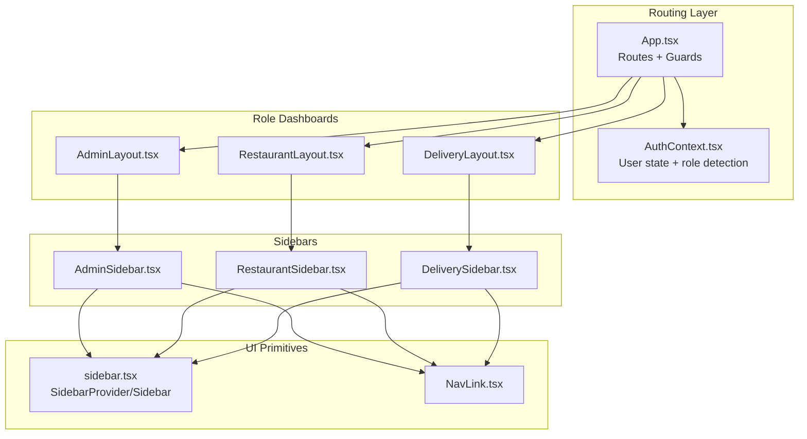
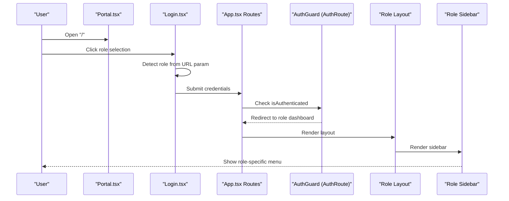
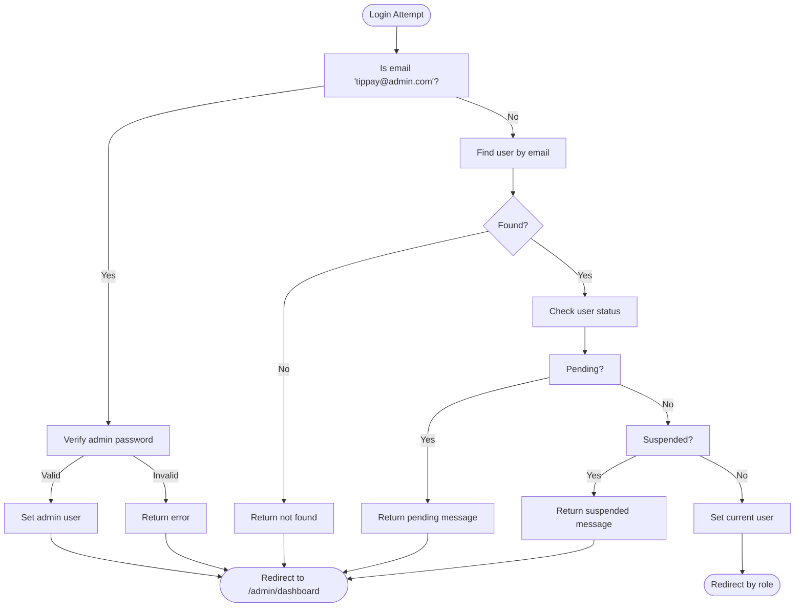
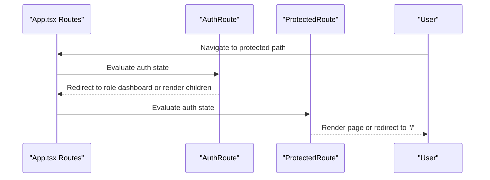
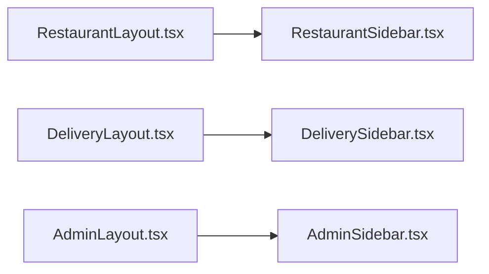
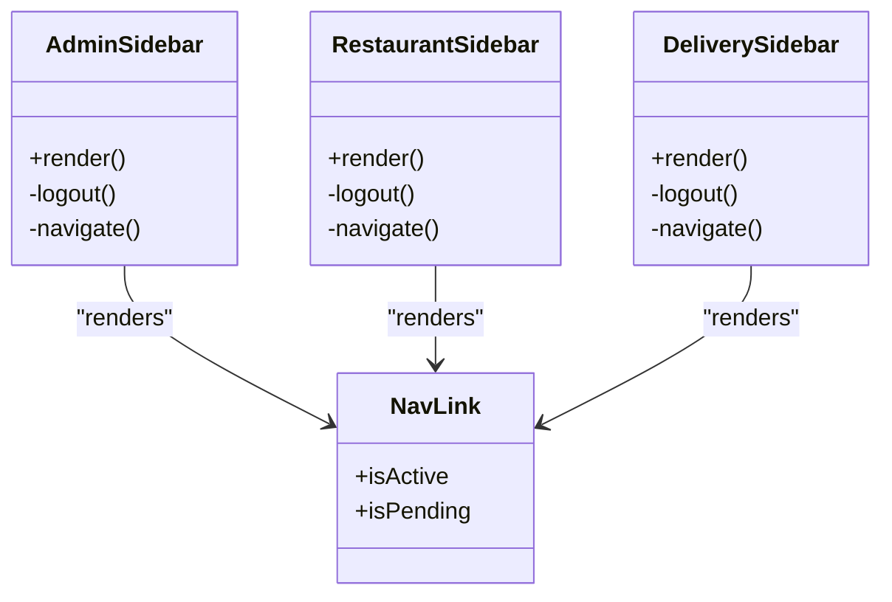
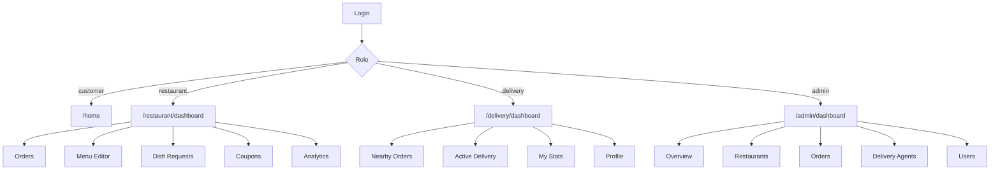
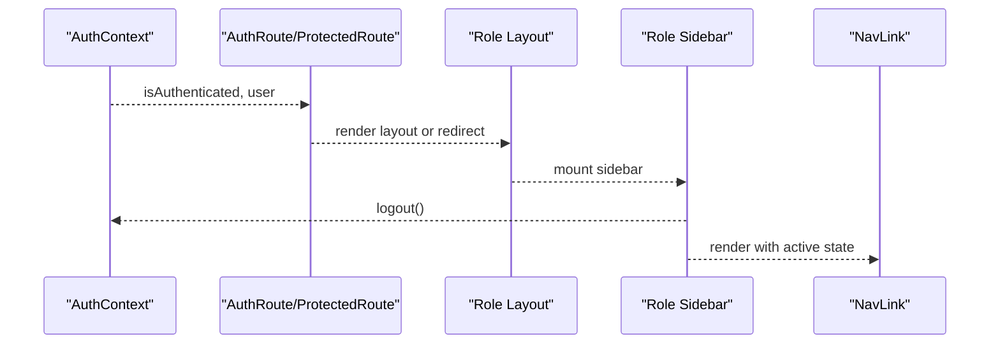
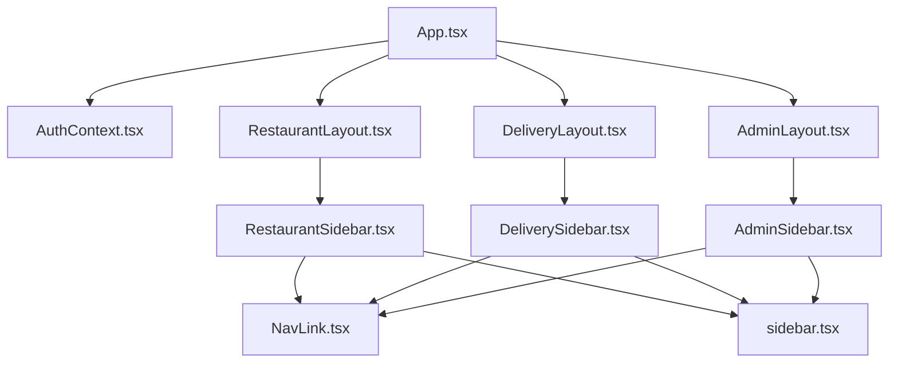

# Role-Based Navigation

<cite>
**Referenced Files in This Document**
- [AuthContext.tsx](file://src/context/AuthContext.tsx)
- [App.tsx](file://src/App.tsx)
- [Login.tsx](file://src/pages/Login.tsx)
- [Portal.tsx](file://src/pages/Portal.tsx)
- [AdminLayout.tsx](file://src/pages/admin/AdminLayout.tsx)
- [RestaurantLayout.tsx](file://src/pages/restaurant/RestaurantLayout.tsx)
- [DeliveryLayout.tsx](file://src/pages/delivery/DeliveryLayout.tsx)
- [AdminSidebar.tsx](file://src/components/AdminSidebar.tsx)
- [RestaurantSidebar.tsx](file://src/components/RestaurantSidebar.tsx)
- [DeliverySidebar.tsx](file://src/components/DeliverySidebar.tsx)
- [NavLink.tsx](file://src/components/NavLink.tsx)
- [sidebar.tsx](file://src/components/ui/sidebar.tsx)
</cite>

## Table of Contents
1. [Introduction](#introduction)
2. [Project Structure](#project-structure)
3. [Core Components](#core-components)
4. [Architecture Overview](#architecture-overview)
5. [Detailed Component Analysis](#detailed-component-analysis)
6. [Dependency Analysis](#dependency-analysis)
7. [Performance Considerations](#performance-considerations)
8. [Troubleshooting Guide](#troubleshooting-guide)
9. [Conclusion](#conclusion)

## Introduction
This document explains TIPPAY's role-based navigation system. It details how user roles (customer, restaurant, delivery agent, admin) determine navigation patterns, dynamic sidebar generation, menu item visibility, and role-specific route protection. It also covers default redirects, dashboard layouts, feature access patterns, and integration between authentication context and navigation components. Guidance is included for extending the system to support additional user roles.

## Project Structure
The navigation system spans three primary areas:
- Authentication and routing orchestration in the main application shell
- Role-aware dashboards with dedicated layouts and sidebars
- Shared UI primitives for navigation and sidebar behavior

**Diagram sources**
- [App.tsx:74-124](file://src/App.tsx#L74-L124)
- [AuthContext.tsx:40-130](file://src/context/AuthContext.tsx#L40-L130)
- [AdminLayout.tsx:1-23](file://src/pages/admin/AdminLayout.tsx#L1-L23)
- [RestaurantLayout.tsx:1-25](file://src/pages/restaurant/RestaurantLayout.tsx#L1-L25)
- [DeliveryLayout.tsx:1-25](file://src/pages/delivery/DeliveryLayout.tsx#L1-L25)
- [AdminSidebar.tsx:28-86](file://src/components/AdminSidebar.tsx#L28-L86)
- [RestaurantSidebar.tsx:28-93](file://src/components/RestaurantSidebar.tsx#L28-L93)
- [DeliverySidebar.tsx:27-90](file://src/components/DeliverySidebar.tsx#L27-L90)
- [sidebar.tsx:43-129](file://src/components/ui/sidebar.tsx#L43-L129)
- [NavLink.tsx:11-29](file://src/components/NavLink.tsx#L11-L29)

**Section sources**
- [App.tsx:74-124](file://src/App.tsx#L74-L124)
- [AuthContext.tsx:40-130](file://src/context/AuthContext.tsx#L40-L130)

## Core Components
- Authentication Context: Provides user identity, role, login/signup/logout, and role detection logic.
- Routing and Guards: Protects routes and redirects authenticated users to role-appropriate dashboards.
- Role Layouts: Provide shared header and sidebar container for each role.
- Role Sidebars: Define role-specific navigation menus and logout actions.
- Navigation Link: Wraps router links with active/pending styling.
- Sidebar UI: Provides provider, trigger, and structural components for responsive sidebars.

**Section sources**
- [AuthContext.tsx:3-27](file://src/context/AuthContext.tsx#L3-L27)
- [App.tsx:56-72](file://src/App.tsx#L56-L72)
- [AdminLayout.tsx:5-20](file://src/pages/admin/AdminLayout.tsx#L5-L20)
- [RestaurantLayout.tsx:5-21](file://src/pages/restaurant/RestaurantLayout.tsx#L5-L21)
- [DeliveryLayout.tsx:5-21](file://src/pages/delivery/DeliveryLayout.tsx#L5-L21)
- [AdminSidebar.tsx:28-86](file://src/components/AdminSidebar.tsx#L28-L86)
- [RestaurantSidebar.tsx:28-93](file://src/components/RestaurantSidebar.tsx#L28-L93)
- [DeliverySidebar.tsx:27-90](file://src/components/DeliverySidebar.tsx#L27-L90)
- [NavLink.tsx:11-29](file://src/components/NavLink.tsx#L11-L29)
- [sidebar.tsx:43-129](file://src/components/ui/sidebar.tsx#L43-L129)

## Architecture Overview
The system integrates authentication with routing and role-specific UI:
- Unauthenticated users see the portal and login screens.
- After login, users are redirected to a role-specific dashboard.
- Each dashboard composes a layout with a sidebar and an outlet for nested routes.
- Sidebars render role-specific menu items and a logout handler.

**Diagram sources**
- [Portal.tsx:7-97](file://src/pages/Portal.tsx#L7-L97)
- [Login.tsx:13-112](file://src/pages/Login.tsx#L13-L112)
- [App.tsx:56-72](file://src/App.tsx#L56-L72)
- [AdminLayout.tsx:5-20](file://src/pages/admin/AdminLayout.tsx#L5-L20)
- [RestaurantLayout.tsx:5-21](file://src/pages/restaurant/RestaurantLayout.tsx#L5-L21)
- [DeliveryLayout.tsx:5-21](file://src/pages/delivery/DeliveryLayout.tsx#L5-L21)
- [AdminSidebar.tsx:28-86](file://src/components/AdminSidebar.tsx#L28-L86)
- [RestaurantSidebar.tsx:28-93](file://src/components/RestaurantSidebar.tsx#L28-L93)
- [DeliverySidebar.tsx:27-90](file://src/components/DeliverySidebar.tsx#L27-L90)

## Detailed Component Analysis

### Authentication and Role Detection
- Role types and user model define four roles: customer, restaurant, delivery, admin.
- Role detection logic derives role from email suffix and keywords.
- Login enforces role-specific constraints and status checks.
- Signup auto-approves customers; restaurants and delivery agents are pending until admin approval.

**Diagram sources**
- [AuthContext.tsx:58-82](file://src/context/AuthContext.tsx#L58-L82)
- [AuthContext.tsx:31-38](file://src/context/AuthContext.tsx#L31-L38)

**Section sources**
- [AuthContext.tsx:3-27](file://src/context/AuthContext.tsx#L3-L27)
- [AuthContext.tsx:31-38](file://src/context/AuthContext.tsx#L31-L38)
- [AuthContext.tsx:58-82](file://src/context/AuthContext.tsx#L58-L82)
- [AuthContext.tsx:84-100](file://src/context/AuthContext.tsx#L84-L100)

### Route Protection and Redirects
- AuthRoute protects unauthenticated users from role dashboards and redirects authenticated users to their role’s dashboard.
- ProtectedRoute ensures general protected pages are only accessible when authenticated.
- Index route redirects to "/" to bootstrap the portal.

**Diagram sources**
- [App.tsx:56-72](file://src/App.tsx#L56-L72)
- [App.tsx:56-59](file://src/App.tsx#L56-L59)
- [App.tsx:113-123](file://src/App.tsx#L113-L123)

**Section sources**
- [App.tsx:56-72](file://src/App.tsx#L56-L72)
- [App.tsx:56-59](file://src/App.tsx#L56-L59)
- [App.tsx:113-123](file://src/App.tsx#L113-L123)

### Role Dashboards and Layouts
- AdminLayout, RestaurantLayout, and DeliveryLayout provide a consistent header and sidebar container for each role.
- Each layout mounts an outlet for nested routes under their respective dashboards.

**Diagram sources**
- [RestaurantLayout.tsx:5-21](file://src/pages/restaurant/RestaurantLayout.tsx#L5-L21)
- [DeliveryLayout.tsx:5-21](file://src/pages/delivery/DeliveryLayout.tsx#L5-L21)
- [AdminLayout.tsx:5-20](file://src/pages/admin/AdminLayout.tsx#L5-L20)
- [RestaurantSidebar.tsx:28-93](file://src/components/RestaurantSidebar.tsx#L28-L93)
- [DeliverySidebar.tsx:27-90](file://src/components/DeliverySidebar.tsx#L27-L90)
- [AdminSidebar.tsx:28-86](file://src/components/AdminSidebar.tsx#L28-L86)

**Section sources**
- [RestaurantLayout.tsx:5-21](file://src/pages/restaurant/RestaurantLayout.tsx#L5-L21)
- [DeliveryLayout.tsx:5-21](file://src/pages/delivery/DeliveryLayout.tsx#L5-L21)
- [AdminLayout.tsx:5-20](file://src/pages/admin/AdminLayout.tsx#L5-L20)

### Dynamic Sidebar Generation and Menu Visibility
- Each role sidebar defines a static menu array with title, URL, and icon.
- Sidebars render menu items via a mapped loop and use NavLink for active state styling.
- Logout triggers context logout and navigates to home.

**Diagram sources**
- [AdminSidebar.tsx:28-86](file://src/components/AdminSidebar.tsx#L28-L86)
- [RestaurantSidebar.tsx:28-93](file://src/components/RestaurantSidebar.tsx#L28-L93)
- [DeliverySidebar.tsx:27-90](file://src/components/DeliverySidebar.tsx#L27-L90)
- [NavLink.tsx:11-29](file://src/components/NavLink.tsx#L11-L29)

**Section sources**
- [AdminSidebar.tsx:20-26](file://src/components/AdminSidebar.tsx#L20-L26)
- [RestaurantSidebar.tsx:20-26](file://src/components/RestaurantSidebar.tsx#L20-L26)
- [DeliverySidebar.tsx:20-25](file://src/components/DeliverySidebar.tsx#L20-L25)
- [AdminSidebar.tsx:54-68](file://src/components/AdminSidebar.tsx#L54-L68)
- [RestaurantSidebar.tsx:61-75](file://src/components/RestaurantSidebar.tsx#L61-L75)
- [DeliverySidebar.tsx:58-72](file://src/components/DeliverySidebar.tsx#L58-L72)
- [NavLink.tsx:11-24](file://src/components/NavLink.tsx#L11-L24)

### Navigation Flow by Role
- Customer
  - Default redirect: home after login.
  - Access: general pages (home, cart, orders, profile, settings).
  - No role-specific dashboard.
- Restaurant Partner
  - Default redirect: restaurant dashboard.
  - Access: orders, menu editor, dish requests, coupons, analytics.
- Delivery Agent
  - Default redirect: delivery dashboard.
  - Access: nearby orders, active delivery, stats, profile.
- Admin
  - Default redirect: admin dashboard.
  - Access: overview, restaurants, orders, agents, users.

**Diagram sources**
- [App.tsx:64-69](file://src/App.tsx#L64-L69)
- [App.tsx:94-120](file://src/App.tsx#L94-L120)
- [Login.tsx:37-44](file://src/pages/Login.tsx#L37-L44)
- [RestaurantSidebar.tsx:20-26](file://src/components/RestaurantSidebar.tsx#L20-L26)
- [DeliverySidebar.tsx:20-25](file://src/components/DeliverySidebar.tsx#L20-L25)
- [AdminSidebar.tsx:20-26](file://src/components/AdminSidebar.tsx#L20-L26)

**Section sources**
- [App.tsx:64-69](file://src/App.tsx#L64-L69)
- [App.tsx:94-120](file://src/App.tsx#L94-L120)
- [Login.tsx:37-44](file://src/pages/Login.tsx#L37-L44)

### Conditional Rendering and Permission-Based UI
- Role detection and login outcomes drive redirect paths.
- Sidebars conditionally render menu items based on role.
- Logout clears user state and navigates to home.

**Section sources**
- [AuthContext.tsx:31-38](file://src/context/AuthContext.tsx#L31-L38)
- [AdminSidebar.tsx:74-82](file://src/components/AdminSidebar.tsx#L74-L82)
- [RestaurantSidebar.tsx:81-89](file://src/components/RestaurantSidebar.tsx#L81-L89)
- [DeliverySidebar.tsx:78-86](file://src/components/DeliverySidebar.tsx#L78-L86)

### Integration Between Authentication Context and Navigation
- AuthContext supplies user role and authentication state to guards and sidebars.
- Sidebars consume useAuth for logout and useSidebar for responsive behavior.
- NavLink uses router state to apply active/pending styles.

**Diagram sources**
- [AuthContext.tsx:118-123](file://src/context/AuthContext.tsx#L118-L123)
- [App.tsx:56-72](file://src/App.tsx#L56-L72)
- [AdminLayout.tsx:5-20](file://src/pages/admin/AdminLayout.tsx#L5-L20)
- [RestaurantSidebar.tsx:32-38](file://src/components/RestaurantSidebar.tsx#L32-L38)
- [DeliverySidebar.tsx:30-36](file://src/components/DeliverySidebar.tsx#L30-L36)
- [AdminSidebar.tsx:31-32](file://src/components/AdminSidebar.tsx#L31-L32)
- [NavLink.tsx:11-24](file://src/components/NavLink.tsx#L11-L24)

**Section sources**
- [AuthContext.tsx:118-123](file://src/context/AuthContext.tsx#L118-L123)
- [App.tsx:56-72](file://src/App.tsx#L56-L72)
- [AdminLayout.tsx:5-20](file://src/pages/admin/AdminLayout.tsx#L5-L20)
- [RestaurantSidebar.tsx:32-38](file://src/components/RestaurantSidebar.tsx#L32-L38)
- [DeliverySidebar.tsx:30-36](file://src/components/DeliverySidebar.tsx#L30-L36)
- [AdminSidebar.tsx:31-32](file://src/components/AdminSidebar.tsx#L31-L32)
- [NavLink.tsx:11-24](file://src/components/NavLink.tsx#L11-L24)

## Dependency Analysis
- App.tsx orchestrates routes, guards, and nested role dashboards.
- AuthContext provides role and authentication state used by guards and sidebars.
- Role layouts depend on shared sidebar UI components.
- Sidebars depend on NavLink for active state styling and on AuthContext for logout.

**Diagram sources**
- [App.tsx:74-124](file://src/App.tsx#L74-L124)
- [AuthContext.tsx:40-130](file://src/context/AuthContext.tsx#L40-L130)
- [RestaurantLayout.tsx:5-21](file://src/pages/restaurant/RestaurantLayout.tsx#L5-L21)
- [DeliveryLayout.tsx:5-21](file://src/pages/delivery/DeliveryLayout.tsx#L5-L21)
- [AdminLayout.tsx:5-20](file://src/pages/admin/AdminLayout.tsx#L5-L20)
- [RestaurantSidebar.tsx:28-93](file://src/components/RestaurantSidebar.tsx#L28-L93)
- [DeliverySidebar.tsx:27-90](file://src/components/DeliverySidebar.tsx#L27-L90)
- [AdminSidebar.tsx:28-86](file://src/components/AdminSidebar.tsx#L28-L86)
- [NavLink.tsx:11-29](file://src/components/NavLink.tsx#L11-L29)
- [sidebar.tsx:43-129](file://src/components/ui/sidebar.tsx#L43-L129)

**Section sources**
- [App.tsx:74-124](file://src/App.tsx#L74-L124)
- [AuthContext.tsx:40-130](file://src/context/AuthContext.tsx#L40-L130)
- [RestaurantSidebar.tsx:28-93](file://src/components/RestaurantSidebar.tsx#L28-L93)
- [DeliverySidebar.tsx:27-90](file://src/components/DeliverySidebar.tsx#L27-L90)
- [AdminSidebar.tsx:28-86](file://src/components/AdminSidebar.tsx#L28-L86)
- [NavLink.tsx:11-29](file://src/components/NavLink.tsx#L11-L29)
- [sidebar.tsx:43-129](file://src/components/ui/sidebar.tsx#L43-L129)

## Performance Considerations
- Keep sidebar menu arrays small and static to minimize re-renders.
- Use NavLink’s active state efficiently; avoid heavy computations in active/pending callbacks.
- Persist sidebar collapse state via cookies handled by the sidebar provider to reduce layout thrash on reload.
- Defer non-critical UI updates during route transitions.

## Troubleshooting Guide
- Login fails with incorrect admin password
  - Symptom: Error returned on admin login.
  - Cause: Password mismatch for admin email.
  - Fix: Use the documented admin password.
  - Section sources
    - [AuthContext.tsx:58-64](file://src/context/AuthContext.tsx#L58-L64)
- Account pending or suspended
  - Symptom: Login returns pending or suspended message.
  - Cause: User status check blocks access.
  - Fix: Wait for admin approval or contact support.
  - Section sources
    - [AuthContext.tsx:67-81](file://src/context/AuthContext.tsx#L67-L81)
    - [AuthContext.tsx:73-78](file://src/context/AuthContext.tsx#L73-L78)
- Role redirection unexpected
  - Symptom: Redirects to wrong dashboard.
  - Cause: Role derived from email suffix/keywords.
  - Fix: Ensure email conforms to expected patterns for roles.
  - Section sources
    - [AuthContext.tsx:31-38](file://src/context/AuthContext.tsx#L31-L38)
    - [App.tsx:64-69](file://src/App.tsx#L64-L69)
- Sidebar not collapsing/expanding
  - Symptom: Sidebar does not respond to toggle.
  - Cause: Sidebar provider state not initialized.
  - Fix: Ensure SidebarProvider wraps role layouts.
  - Section sources
    - [sidebar.tsx:43-129](file://src/components/ui/sidebar.tsx#L43-L129)
    - [AdminLayout.tsx:5-20](file://src/pages/admin/AdminLayout.tsx#L5-L20)
    - [RestaurantLayout.tsx:5-21](file://src/pages/restaurant/RestaurantLayout.tsx#L5-L21)
    - [DeliveryLayout.tsx:5-21](file://src/pages/delivery/DeliveryLayout.tsx#L5-L21)

## Conclusion
TIPPAY’s role-based navigation is built around a clean separation of concerns: authentication context, route guards, role-specific layouts, and dynamic sidebars. The system supports four user roles with clear defaults, protected routes, and role-appropriate dashboards. Extending the system for additional roles involves adding a new layout, sidebar, and updating guards and role detection logic.