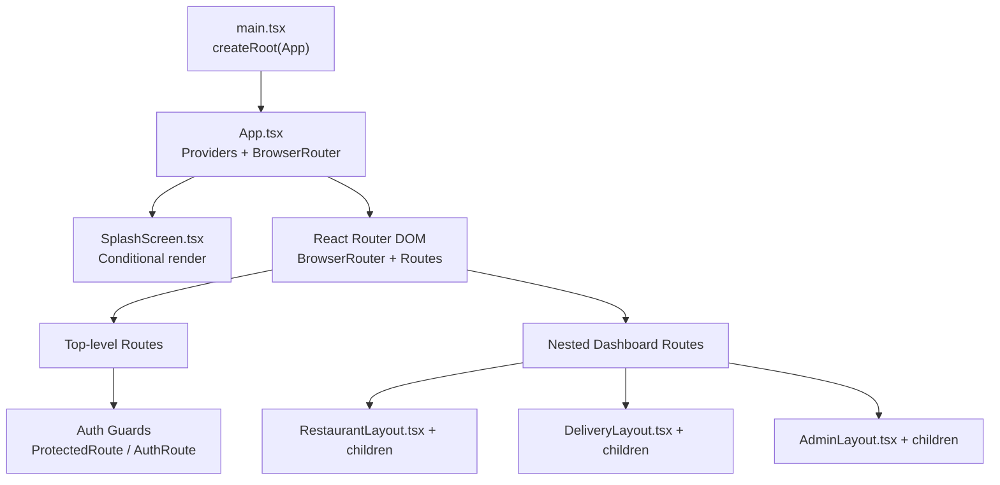
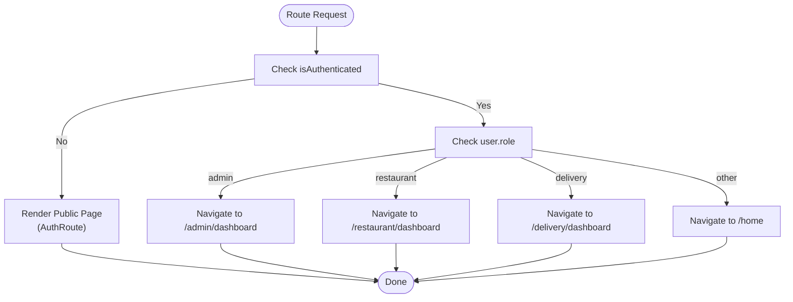
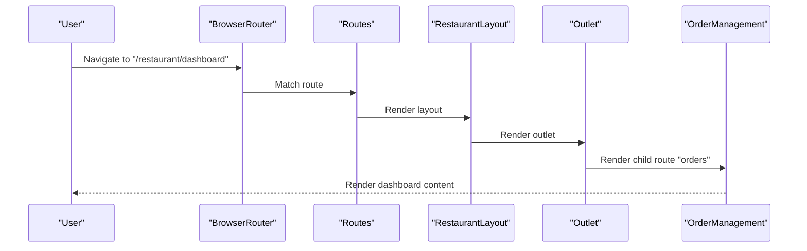
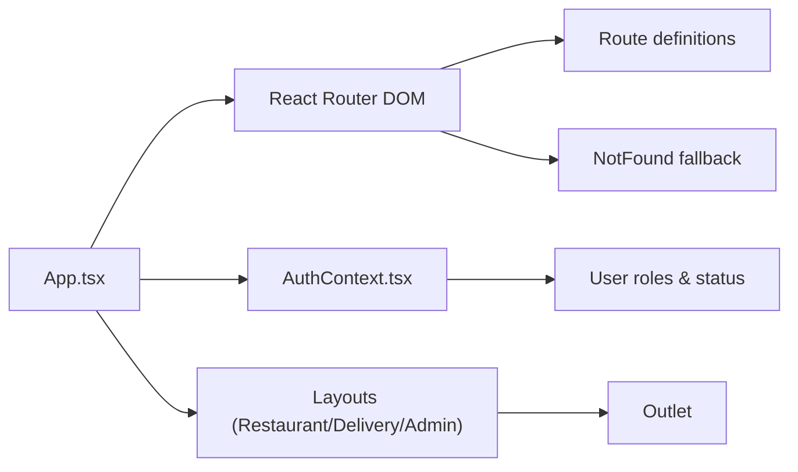

# Routing Configuration

<cite>
**Referenced Files in This Document**
- [App.tsx](file://src/App.tsx)
- [main.tsx](file://src/main.tsx)
- [AuthContext.tsx](file://src/context/AuthContext.tsx)
- [RestaurantLayout.tsx](file://src/pages/restaurant/RestaurantLayout.tsx)
- [DeliveryLayout.tsx](file://src/pages/delivery/DeliveryLayout.tsx)
- [AdminLayout.tsx](file://src/pages/admin/AdminLayout.tsx)
- [SplashScreen.tsx](file://src/pages/SplashScreen.tsx)
- [NotFound.tsx](file://src/pages/NotFound.tsx)
- [Index.tsx](file://src/pages/Index.tsx)
- [RestaurantSidebar.tsx](file://src/components/RestaurantSidebar.tsx)
- [DeliverySidebar.tsx](file://src/components/DeliverySidebar.tsx)
</cite>

## Table of Contents
1. [Introduction](#introduction)
2. [Project Structure](#project-structure)
3. [Core Components](#core-components)
4. [Architecture Overview](#architecture-overview)
5. [Detailed Component Analysis](#detailed-component-analysis)
6. [Dependency Analysis](#dependency-analysis)
7. [Performance Considerations](#performance-considerations)
8. [Troubleshooting Guide](#troubleshooting-guide)
9. [Conclusion](#conclusion)
10. [Appendices](#appendices)

## Introduction
This document explains TIPPAY’s routing configuration built with React Router DOM. It covers the router setup, route definitions, URL structure, authentication guards, role-based redirection, nested dashboard routing, and integration with the splash screen. It also provides guidance for extending routes, modifying existing ones, and implementing route-based lazy loading.

## Project Structure
The routing system is centered around a single-page application that mounts the router inside the main application shell. Providers wrap the app to supply global state (authentication, cart, orders, etc.). The router defines top-level routes and nested routes for dashboards.

**Diagram sources**
- [main.tsx:1-11](file://src/main.tsx#L1-L11)
- [App.tsx:126-167](file://src/App.tsx#L126-L167)
- [SplashScreen.tsx:1-66](file://src/pages/SplashScreen.tsx#L1-L66)

**Section sources**
- [main.tsx:1-11](file://src/main.tsx#L1-L11)
- [App.tsx:126-167](file://src/App.tsx#L126-L167)

## Core Components
- Router bootstrap: The app initializes providers and mounts the router.
- Authentication context: Supplies user state, login/signup/logout, and role detection.
- Guard components:
  - AuthRoute: Redirects authenticated users to role-specific dashboards; otherwise renders public pages.
  - ProtectedRoute: Wraps pages requiring authentication.
- Layouts with nested routes: Restaurant, Delivery, and Admin dashboards define child routes under shared layouts.

Key responsibilities:
- App.tsx orchestrates providers, splash screen lifecycle, and route definitions.
- AuthContext.tsx manages user roles and statuses, enabling role-based redirects.
- Layouts expose an outlet for nested route rendering.

**Section sources**
- [App.tsx:56-72](file://src/App.tsx#L56-L72)
- [AuthContext.tsx:18-27](file://src/context/AuthContext.tsx#L18-L27)
- [AuthContext.tsx:31-38](file://src/context/AuthContext.tsx#L31-L38)

## Architecture Overview
The routing architecture separates public and protected areas, enforces authentication, and redirects users to role-appropriate dashboards. Nested routes encapsulate dashboard sections with shared sidebars and outlets.

```mermaid
graph TB
subgraph "Public Area"
Portal["/ (Portal)"]
Login["/login (Login)"]
end
subgraph "Authenticated Area"
Home["/home"]
RestaurantDetail["/restaurant/:id"]
Cart["/cart"]
Search["/search"]
Orders["/orders"]
OrderTracking["/order/:id"]
Profile["/profile"]
Addresses["/addresses"]
Favorites["/favorites"]
Offers["/offers"]
Settings["/settings (+ subroutes)"]
end
subgraph "Role Dashboards"
subgraph "Restaurant"
RBase["/restaurant/dashboard"]
ROrders["/restaurant/dashboard/orders"]
RMenu["/restaurant/dashboard/menu"]
RRequests["/restaurant/dashboard/requests"]
RCoupons["/restaurant/dashboard/coupons"]
RAnalytics["/restaurant/dashboard/analytics"]
end
subgraph "Delivery"
DBase["/delivery/dashboard"]
DOrders["/delivery/dashboard/orders"]
DActive["/delivery/dashboard/active"]
DStats["/delivery/dashboard/stats"]
DProfile["/delivery/dashboard/profile"]
end
subgraph "Admin"
ABase["/admin/dashboard"]
AOverview["/admin/dashboard/overview"]
ARestaurants["/admin/dashboard/restaurants"]
AOrders["/admin/dashboard/orders"]
AAgents["/admin/dashboard/agents"]
AUsers["/admin/dashboard/users"]
end
end
NotFound["/* (NotFound)"]
AuthRoute --> Portal
AuthRoute --> Login
ProtectedRoute --> Home
ProtectedRoute --> RestaurantDetail
ProtectedRoute --> Cart
ProtectedRoute --> Search
ProtectedRoute --> Orders
ProtectedRoute --> OrderTracking
ProtectedRoute --> Profile
ProtectedRoute --> Addresses
ProtectedRoute --> Favorites
ProtectedRoute --> Offers
ProtectedRoute --> Settings
ProtectedRoute --> RBase
RBase --> ROrders
RBase --> RMenu
RBase --> RRequests
RBase --> RCoupons
RBase --> RAnalytics
ProtectedRoute --> DBase
DBase --> DOrders
DBase --> DActive
DBase --> DStats
DBase --> DProfile
ProtectedRoute --> ABase
ABase --> AOverview
ABase --> ARestaurants
ABase --> AOrders
ABase --> AAgents
ABase --> AUsers
Router["BrowserRouter + Routes"] --> AuthRoute
Router --> ProtectedRoute
Router --> NotFound
```

**Diagram sources**
- [App.tsx:74-124](file://src/App.tsx#L74-L124)
- [RestaurantLayout.tsx:1-25](file://src/pages/restaurant/RestaurantLayout.tsx#L1-L25)
- [DeliveryLayout.tsx:1-25](file://src/pages/delivery/DeliveryLayout.tsx#L1-L25)
- [AdminLayout.tsx:1-23](file://src/pages/admin/AdminLayout.tsx#L1-L23)

## Detailed Component Analysis

### Router Bootstrap and Providers
- The app initializes TanStack Query, location/language providers, and the authentication provider before mounting the router.
- The splash screen conditionally renders until finished, after which the router becomes active.

Implementation highlights:
- Providers are stacked to ensure context availability across routes.
- The splash screen integrates via a callback to signal completion.

**Section sources**
- [App.tsx:126-167](file://src/App.tsx#L126-L167)
- [SplashScreen.tsx:9-17](file://src/pages/SplashScreen.tsx#L9-L17)

### Authentication Guards
- AuthRoute: If authenticated, redirects to role-specific dashboard; otherwise renders the requested public page.
- ProtectedRoute: Renders children only if authenticated; otherwise navigates to the home route.

Behavioral notes:
- Role-based redirect logic is centralized in AuthRoute.
- ProtectedRoute acts as a blanket wrapper for authenticated-only pages.

**Diagram sources**
- [App.tsx:61-72](file://src/App.tsx#L61-L72)
- [AuthContext.tsx:18-27](file://src/context/AuthContext.tsx#L18-L27)

**Section sources**
- [App.tsx:56-72](file://src/App.tsx#L56-L72)
- [AuthContext.tsx:18-27](file://src/context/AuthContext.tsx#L18-L27)

### URL Structure and Route Definitions
Top-level routes:
- "/", "/login" (public)
- "/home", "/restaurant/:id", "/cart", "/search", "/orders", "/order/:id", "/profile", "/addresses", "/favorites", "/offers", "/settings" and related subroutes (authenticated)

Nested dashboard routes:
- Restaurant dashboard: base "/restaurant/dashboard" with children "orders", "menu", "requests", "coupons", "analytics"
- Delivery dashboard: base "/delivery/dashboard" with children "orders", "active", "stats", "profile"
- Admin dashboard: base "/admin/dashboard" with children "overview", "restaurants", "orders", "agents", "users"

Dynamic routing:
- ":id" is used for restaurant detail and order tracking.

Query strings:
- No explicit query string handling is present in the router configuration; query parameters would be accessed via the router APIs in individual components.

Index redirect:
- An index route redirects "/" to the portal page.

**Section sources**
- [App.tsx:74-124](file://src/App.tsx#L74-L124)
- [Index.tsx:1-6](file://src/pages/Index.tsx#L1-L6)

### Nested Routing Patterns and Layouts
Each dashboard uses a layout component that exposes an outlet for nested children. The layouts integrate sidebars and a main content area.

**Diagram sources**
- [App.tsx:94-101](file://src/App.tsx#L94-L101)
- [RestaurantLayout.tsx:1-25](file://src/pages/restaurant/RestaurantLayout.tsx#L1-L25)

Additional nested routes:
- Delivery: orders, active, stats, profile
- Admin: overview, restaurants, orders, agents, users

**Section sources**
- [App.tsx:104-110](file://src/App.tsx#L104-L110)
- [App.tsx:113-120](file://src/App.tsx#L113-L120)
- [RestaurantLayout.tsx:1-25](file://src/pages/restaurant/RestaurantLayout.tsx#L1-L25)
- [DeliveryLayout.tsx:1-25](file://src/pages/delivery/DeliveryLayout.tsx#L1-L25)
- [AdminLayout.tsx:1-23](file://src/pages/admin/AdminLayout.tsx#L1-L23)

### Sidebars and Navigation Within Dashboards
- RestaurantSidebar and DeliverySidebar provide navigation to dashboard children and a logout handler.
- They integrate with the shared layout outlet to render the selected child route.

**Section sources**
- [RestaurantSidebar.tsx:20-26](file://src/components/RestaurantSidebar.tsx#L20-L26)
- [RestaurantSidebar.tsx:35-38](file://src/components/RestaurantSidebar.tsx#L35-L38)
- [DeliverySidebar.tsx:20-25](file://src/components/DeliverySidebar.tsx#L20-L25)
- [DeliverySidebar.tsx:33-36](file://src/components/DeliverySidebar.tsx#L33-L36)

### Splash Screen Integration and Fallback Handling
- The splash screen renders during app initialization and signals completion to the router.
- A global NotFound route handles unmatched URLs.

**Section sources**
- [SplashScreen.tsx:9-17](file://src/pages/SplashScreen.tsx#L9-L17)
- [App.tsx:126-149](file://src/App.tsx#L126-L149)
- [App.tsx:122](file://src/App.tsx#L122)
- [NotFound.tsx:1-25](file://src/pages/NotFound.tsx#L1-L25)

## Dependency Analysis
The routing system depends on:
- React Router DOM for routing primitives.
- AuthContext for authentication and role checks.
- Layout components for nested routing and UI scaffolding.

**Diagram sources**
- [App.tsx:61-72](file://src/App.tsx#L61-L72)
- [AuthContext.tsx:18-27](file://src/context/AuthContext.tsx#L18-L27)
- [RestaurantLayout.tsx:1-25](file://src/pages/restaurant/RestaurantLayout.tsx#L1-L25)
- [DeliveryLayout.tsx:1-25](file://src/pages/delivery/DeliveryLayout.tsx#L1-L25)
- [AdminLayout.tsx:1-23](file://src/pages/admin/AdminLayout.tsx#L1-L23)

**Section sources**
- [App.tsx:61-72](file://src/App.tsx#L61-L72)
- [AuthContext.tsx:18-27](file://src/context/AuthContext.tsx#L18-L27)

## Performance Considerations
- Keep guard components lightweight; they re-render on authentication state changes.
- Avoid heavy computations in route matchers; defer to components.
- Use minimal state updates in AuthContext to reduce unnecessary re-renders.
- Consider route-based lazy loading for large dashboard sections to improve initial load performance.

## Troubleshooting Guide
Common issues and resolutions:
- Unauthenticated users stuck on protected routes: Verify ProtectedRoute wraps the intended pages and that AuthContext.isAuthenticated reflects the current session.
- Incorrect role redirection: Confirm AuthRoute logic aligns with user.role values and that role detection rules are met.
- Nested route not rendering: Ensure the layout exposes an outlet and that child routes are defined under the parent route.
- 404 errors: NotFound is configured globally; confirm the route path matches the definition.

**Section sources**
- [App.tsx:56-72](file://src/App.tsx#L56-L72)
- [App.tsx:122](file://src/App.tsx#L122)
- [NotFound.tsx:1-25](file://src/pages/NotFound.tsx#L1-L25)

## Conclusion
TIPPAY’s routing system cleanly separates public and authenticated areas, centralizes authentication logic, and organizes role-specific dashboards with nested routes and shared layouts. The design supports straightforward extension and maintenance while providing a robust foundation for future enhancements.

## Appendices

### Adding New Routes
Steps:
- Define the new route in the Routes tree with appropriate guards.
- For authenticated-only pages, wrap with ProtectedRoute.
- For public pages, wrap with AuthRoute.
- For nested dashboards, add a parent route with an outlet and child routes.

Guidance:
- Use ":id" for dynamic segments.
- Prefer relative paths for nested routes under a layout.
- Add a fallback "*" route for unknown paths.

**Section sources**
- [App.tsx:74-124](file://src/App.tsx#L74-L124)

### Modifying Existing Routes
Steps:
- Update the route path or guard in the Routes tree.
- Adjust nested routes if changing the parent path.
- Update sidebar navigation items to reflect new paths.

**Section sources**
- [RestaurantSidebar.tsx:20-26](file://src/components/RestaurantSidebar.tsx#L20-L26)
- [DeliverySidebar.tsx:20-25](file://src/components/DeliverySidebar.tsx#L20-L25)

### Implementing Route-Based Lazy Loading
Approach:
- Wrap route components with React.lazy and Suspense.
- Ensure components are exported as default exports.
- Place Suspense boundaries around the router or specific routes as needed.

Note: This document does not include code examples; apply standard React.lazy patterns around the route components listed in the routing tree.