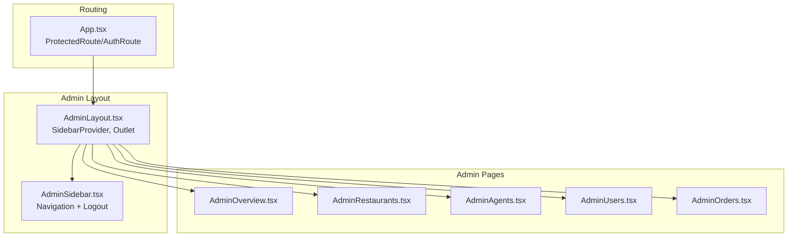
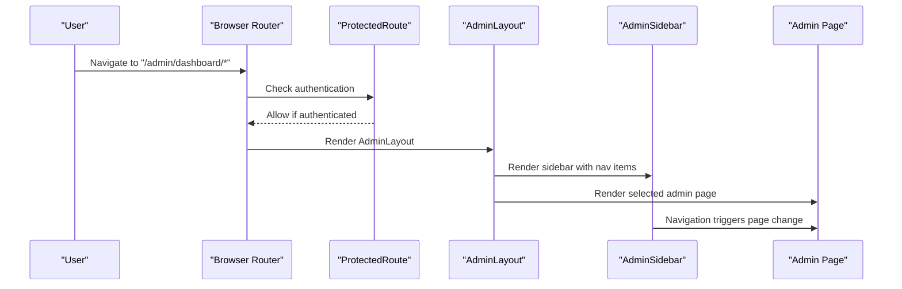
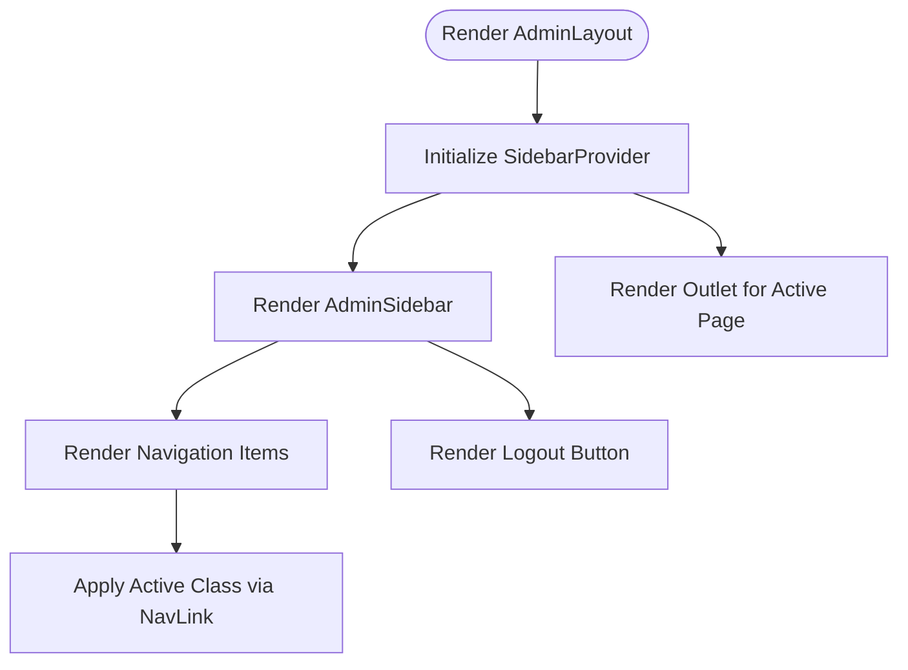
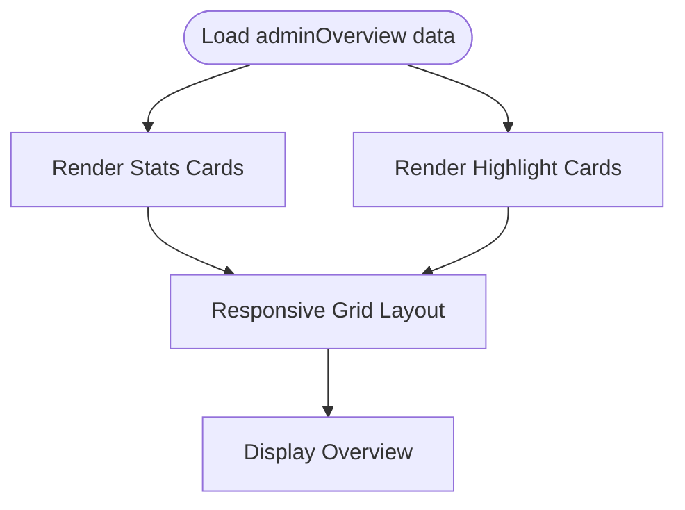
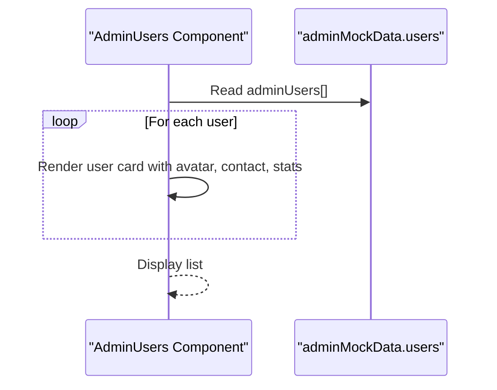
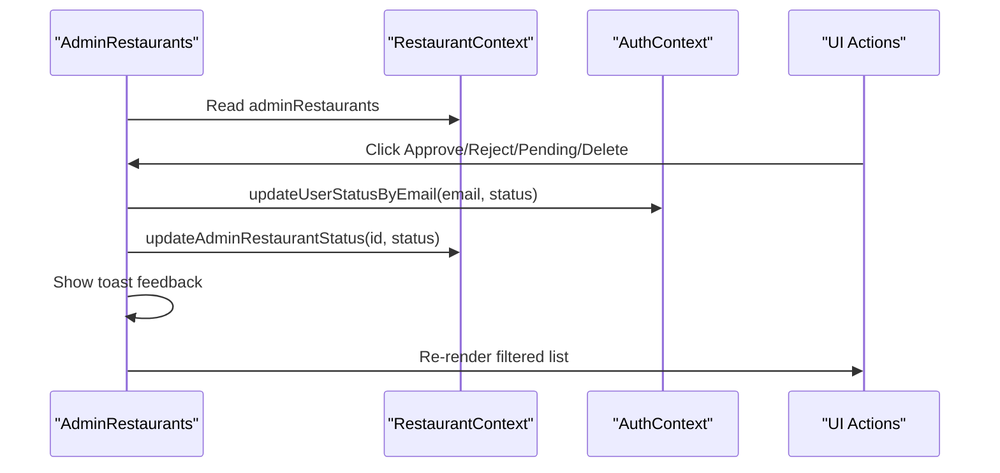
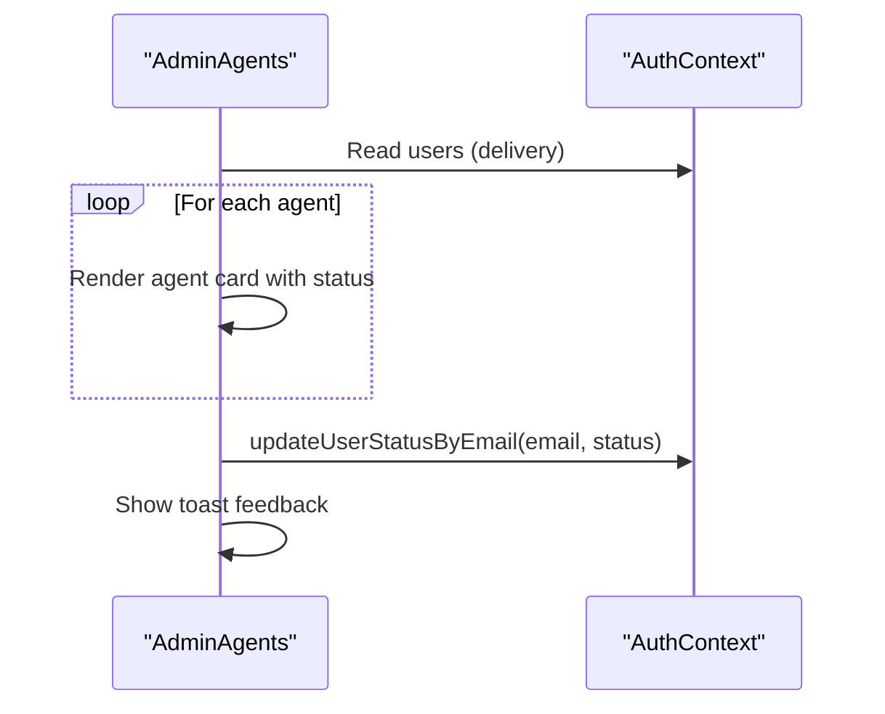
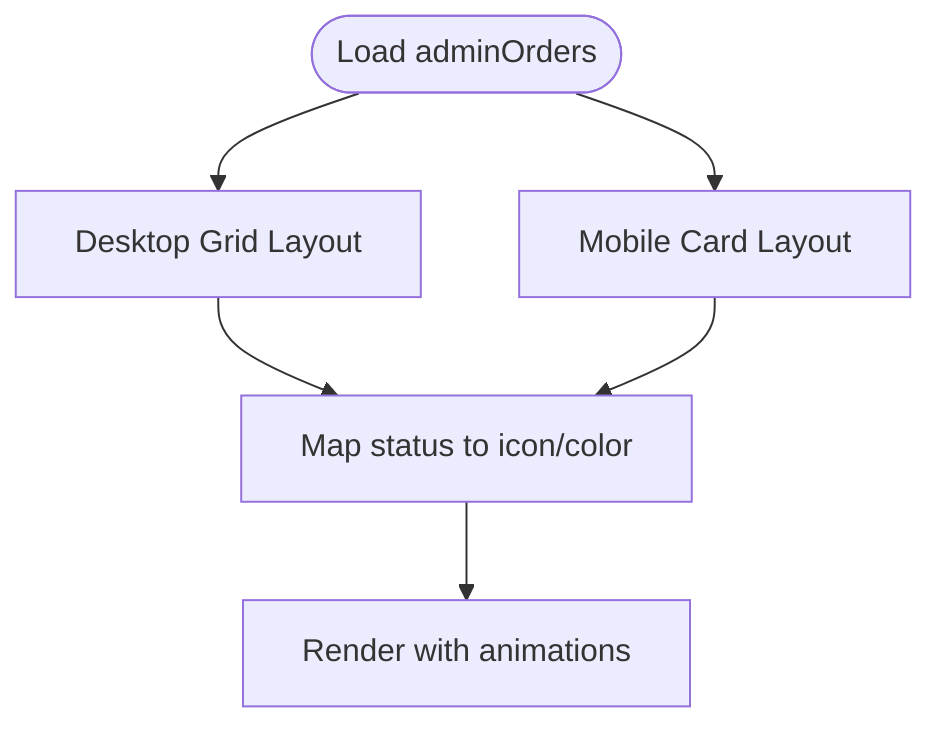
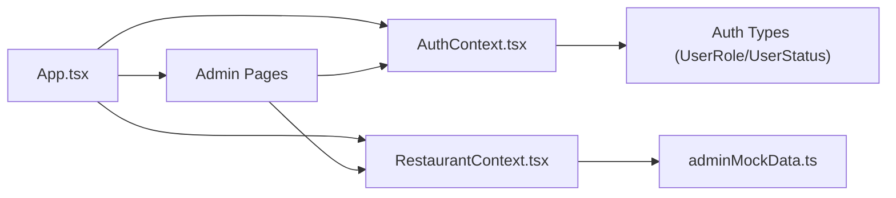

# Administrator Pages

<cite>
**Referenced Files in This Document**
- [AdminLayout.tsx](file://src/pages/admin/AdminLayout.tsx)
- [AdminSidebar.tsx](file://src/components/AdminSidebar.tsx)
- [AdminOverview.tsx](file://src/pages/admin/AdminOverview.tsx)
- [AdminUsers.tsx](file://src/pages/admin/AdminUsers.tsx)
- [AdminRestaurants.tsx](file://src/pages/admin/AdminRestaurants.tsx)
- [AdminAgents.tsx](file://src/pages/admin/AdminAgents.tsx)
- [AdminOrders.tsx](file://src/pages/admin/AdminOrders.tsx)
- [adminMockData.ts](file://src/data/adminMockData.ts)
- [AuthContext.tsx](file://src/context/AuthContext.tsx)
- [RestaurantContext.tsx](file://src/context/RestaurantContext.tsx)
- [App.tsx](file://src/App.tsx)
- [NavLink.tsx](file://src/components/NavLink.tsx)
- [mockData.ts](file://src/data/mockData.ts)
</cite>

## Table of Contents
1. [Introduction](#introduction)
2. [Project Structure](#project-structure)
3. [Core Components](#core-components)
4. [Architecture Overview](#architecture-overview)
5. [Detailed Component Analysis](#detailed-component-analysis)
6. [Dependency Analysis](#dependency-analysis)
7. [Performance Considerations](#performance-considerations)
8. [Troubleshooting Guide](#troubleshooting-guide)
9. [Conclusion](#conclusion)
10. [Appendices](#appendices)

## Introduction
This document describes the administrator dashboard pages in TIPPAY. It covers the admin layout and navigation, the system overview dashboard, user management, restaurant management, delivery agent management, and order monitoring. It also explains administrative workflows, user role management, data analytics dashboards, and system monitoring capabilities. Examples of permission systems, audit trails, and administrative reporting are included to guide implementation and operational procedures.

## Project Structure
The admin dashboard is organized under the admin namespace with a dedicated layout and modular pages. Routing is protected and role-aware, ensuring only authenticated users with the admin role can access admin routes. Mock data supports demonstration of analytics and management views.

**Diagram sources**
- [App.tsx:112-120](file://src/App.tsx#L112-L120)
- [AdminLayout.tsx:5-19](file://src/pages/admin/AdminLayout.tsx#L5-L19)
- [AdminSidebar.tsx:28-82](file://src/components/AdminSidebar.tsx#L28-L82)
- [AdminOverview.tsx:1-67](file://src/pages/admin/AdminOverview.tsx#L1-L67)
- [AdminRestaurants.tsx:19-173](file://src/pages/admin/AdminRestaurants.tsx#L19-L173)
- [AdminAgents.tsx:6-79](file://src/pages/admin/AdminAgents.tsx#L6-L79)
- [AdminUsers.tsx:5-50](file://src/pages/admin/AdminUsers.tsx#L5-L50)
- [AdminOrders.tsx:14-102](file://src/pages/admin/AdminOrders.tsx#L14-L102)

**Section sources**
- [App.tsx:112-120](file://src/App.tsx#L112-L120)
- [AdminLayout.tsx:5-19](file://src/pages/admin/AdminLayout.tsx#L5-L19)
- [AdminSidebar.tsx:28-82](file://src/components/AdminSidebar.tsx#L28-L82)

## Core Components
- Admin layout and navigation: Provides a persistent sidebar with branding, notifications, and navigation links to overview, restaurants, orders, agents, and users. The header displays the current page title and triggers the sidebar collapse.
- Overview dashboard: Displays platform-wide statistics and highlights such as total restaurants, orders, users, agents, pending approvals, daily orders, daily revenue, and growth.
- User management: Lists registered users with profile details and order counts, enabling administrative visibility.
- Restaurant management: Manages restaurant applications with status transitions (pending/approved/suspended), detailed view modal, and deletion capability.
- Delivery agent management: Shows delivery agents with status badges and allows status updates (approve/suspend/pending).
- Order monitoring: Presents a table-like view of orders with status icons and colors, supporting system-wide tracking and dispute resolution.

**Section sources**
- [AdminLayout.tsx:5-19](file://src/pages/admin/AdminLayout.tsx#L5-L19)
- [AdminSidebar.tsx:20-26](file://src/components/AdminSidebar.tsx#L20-L26)
- [AdminOverview.tsx:8-20](file://src/pages/admin/AdminOverview.tsx#L8-L20)
- [AdminUsers.tsx:13-44](file://src/pages/admin/AdminUsers.tsx#L13-L44)
- [AdminRestaurants.tsx:11-17](file://src/pages/admin/AdminRestaurants.tsx#L11-L17)
- [AdminAgents.tsx:10-13](file://src/pages/admin/AdminAgents.tsx#L10-L13)
- [AdminOrders.tsx:5-12](file://src/pages/admin/AdminOrders.tsx#L5-L12)

## Architecture Overview
The admin dashboard leverages React Router for protected routing, Context APIs for authentication and restaurant data, and mock data for demonstration. The layout composes a sidebar and a content area, with each page rendering analytics or management UI.

**Diagram sources**
- [App.tsx:56-72](file://src/App.tsx#L56-L72)
- [App.tsx:112-120](file://src/App.tsx#L112-L120)
- [AdminLayout.tsx:5-19](file://src/pages/admin/AdminLayout.tsx#L5-L19)
- [AdminSidebar.tsx:20-26](file://src/components/AdminSidebar.tsx#L20-L26)

## Detailed Component Analysis

### Admin Layout and Navigation
- Purpose: Provides a consistent admin shell with a collapsible sidebar, branding, notification center, and logout.
- Navigation: Uses a navigation list with icons and labels mapped to admin routes. Active state is handled via a compatible NavLink wrapper.
- Header: Sticky header with a sidebar trigger and page title.

**Diagram sources**
- [AdminLayout.tsx:5-19](file://src/pages/admin/AdminLayout.tsx#L5-L19)
- [AdminSidebar.tsx:28-82](file://src/components/AdminSidebar.tsx#L28-L82)
- [NavLink.tsx:11-24](file://src/components/NavLink.tsx#L11-L24)

**Section sources**
- [AdminLayout.tsx:5-19](file://src/pages/admin/AdminLayout.tsx#L5-L19)
- [AdminSidebar.tsx:28-82](file://src/components/AdminSidebar.tsx#L28-L82)
- [NavLink.tsx:11-24](file://src/components/NavLink.tsx#L11-L24)

### System Overview Dashboard
- Purpose: Present high-level platform metrics and highlights.
- Metrics: Total restaurants, total orders, total users, total agents.
- Highlights: Pending approvals, today’s orders, today’s revenue, growth percentage.
- Implementation: Uses motion animations for entrance effects and responsive grid layouts.

**Diagram sources**
- [AdminOverview.tsx:8-20](file://src/pages/admin/AdminOverview.tsx#L8-L20)
- [adminMockData.ts:92-100](file://src/data/adminMockData.ts#L92-L100)

**Section sources**
- [AdminOverview.tsx:8-20](file://src/pages/admin/AdminOverview.tsx#L8-L20)
- [adminMockData.ts:92-100](file://src/data/adminMockData.ts#L92-L100)

### User Management
- Purpose: Display registered users with profile details and order counts.
- Data: Consumes mock user data and renders avatars, contact info, order totals, and join dates.
- UX: Animated list entries with staggered animation timing.

**Diagram sources**
- [AdminUsers.tsx:13-44](file://src/pages/admin/AdminUsers.tsx#L13-L44)
- [adminMockData.ts:83-90](file://src/data/adminMockData.ts#L83-L90)

**Section sources**
- [AdminUsers.tsx:13-44](file://src/pages/admin/AdminUsers.tsx#L13-L44)
- [adminMockData.ts:83-90](file://src/data/adminMockData.ts#L83-L90)

### Restaurant Management
- Purpose: Moderate restaurant content and oversee performance.
- Features:
  - Filter by status (All, Pending, Approved, Suspended).
  - Approve/reject/pending actions with immediate status updates and toast feedback.
  - Delete restaurants with confirmation.
  - View detailed restaurant information in a modal.
- Data: Uses RestaurantContext for admin restaurants and AuthContext for user status updates.

**Diagram sources**
- [AdminRestaurants.tsx:19-45](file://src/pages/admin/AdminRestaurants.tsx#L19-L45)
- [RestaurantContext.tsx:76-84](file://src/context/RestaurantContext.tsx#L76-L84)
- [AuthContext.tsx:104-109](file://src/context/AuthContext.tsx#L104-L109)

**Section sources**
- [AdminRestaurants.tsx:19-45](file://src/pages/admin/AdminRestaurants.tsx#L19-L45)
- [RestaurantContext.tsx:76-84](file://src/context/RestaurantContext.tsx#L76-L84)
- [AuthContext.tsx:104-109](file://src/context/AuthContext.tsx#L104-L109)

### Delivery Agent Management
- Purpose: Manage driver performance and assignments.
- Features:
  - List delivery agents with status badges.
  - Toggle statuses (active/suspended/pending) with toast feedback.
- Data: Filters users by role "delivery" and updates status via AuthContext.

**Diagram sources**
- [AdminAgents.tsx:6-13](file://src/pages/admin/AdminAgents.tsx#L6-L13)
- [AuthContext.tsx:104-109](file://src/context/AuthContext.tsx#L104-L109)

**Section sources**
- [AdminAgents.tsx:6-13](file://src/pages/admin/AdminAgents.tsx#L6-L13)
- [AuthContext.tsx:104-109](file://src/context/AuthContext.tsx#L104-L109)

### Order Monitoring
- Purpose: Track system-wide orders and support dispute resolution.
- Features:
  - Desktop: Grid table with columns for order ID, customer, restaurant, agent, total, status, and time.
  - Mobile: Card-based layout per order with status indicator.
  - Status mapping: Icons and colors for each lifecycle stage (Ordered, Accepted, Preparing, Ready, Picked Up, Delivered).

**Diagram sources**
- [AdminOrders.tsx:14-98](file://src/pages/admin/AdminOrders.tsx#L14-L98)
- [adminMockData.ts:66-73](file://src/data/adminMockData.ts#L66-L73)

**Section sources**
- [AdminOrders.tsx:14-98](file://src/pages/admin/AdminOrders.tsx#L14-L98)
- [adminMockData.ts:66-73](file://src/data/adminMockData.ts#L66-L73)

## Dependency Analysis
- Routing and protection:
  - ProtectedRoute ensures only authenticated users can access admin routes.
  - AuthRoute redirects authenticated users to their respective dashboards; admin users go to /admin/dashboard.
- Authentication:
  - AuthContext manages user roles and statuses, with role detection based on email patterns.
  - updateUserStatusByEmail updates user status and logs out if the affected user is the current session holder.
- Restaurant data:
  - RestaurantContext stores admin restaurants and menu items, persists to localStorage, and derives restaurant listings for consumers.
- Mock data:
  - adminMockData provides typed datasets for restaurants, orders, agents, users, and overview metrics.

**Diagram sources**
- [App.tsx:56-72](file://src/App.tsx#L56-L72)
- [AuthContext.tsx:3-27](file://src/context/AuthContext.tsx#L3-L27)
- [RestaurantContext.tsx:21-32](file://src/context/RestaurantContext.tsx#L21-L32)
- [adminMockData.ts:8-54](file://src/data/adminMockData.ts#L8-L54)

**Section sources**
- [App.tsx:56-72](file://src/App.tsx#L56-L72)
- [AuthContext.tsx:3-27](file://src/context/AuthContext.tsx#L3-L27)
- [RestaurantContext.tsx:21-32](file://src/context/RestaurantContext.tsx#L21-L32)
- [adminMockData.ts:8-54](file://src/data/adminMockData.ts#L8-L54)

## Performance Considerations
- Rendering optimization:
  - Use of motion animations and staggered delays enhances perceived performance but should be tuned for large lists.
  - AnimatePresence and layout animations are used in restaurant and agent lists; consider virtualization for very large datasets.
- Data persistence:
  - LocalStorage-backed contexts reduce server round-trips during development and demo scenarios.
- Responsive design:
  - Separate desktop grid and mobile card layouts minimize reflows and improve readability across devices.

## Troubleshooting Guide
- Admin login issues:
  - Verify credentials and role detection. The admin login checks a specific email pattern and password; incorrect credentials will return an error message.
- User status changes:
  - updateUserStatusByEmail updates the in-memory users array and logs out the affected user if their status changes to inactive. Confirm the change persisted in localStorage.
- Restaurant status updates:
  - Ensure the restaurant exists and the update operation is called with the correct id and status. Toast feedback confirms the action.
- Order monitoring:
  - Status icons and colors are mapped by status string; ensure order status values match expected keys to avoid fallback rendering.

**Section sources**
- [AuthContext.tsx:58-82](file://src/context/AuthContext.tsx#L58-L82)
- [AuthContext.tsx:104-109](file://src/context/AuthContext.tsx#L104-L109)
- [AdminRestaurants.tsx:29-37](file://src/pages/admin/AdminRestaurants.tsx#L29-L37)
- [AdminOrders.tsx:5-12](file://src/pages/admin/AdminOrders.tsx#L5-L12)

## Conclusion
The TIPPAY administrator dashboard provides a cohesive, role-aware interface for system-wide oversight. The layout and navigation enable efficient access to overview metrics, user insights, restaurant moderation, agent management, and order tracking. With mock data and context-driven state management, the admin pages demonstrate practical workflows for permissions, status management, and analytics. Extending these patterns supports audit trails, administrative reporting, and scalable monitoring.

## Appendices

### Administrative Workflows
- Approve or reject restaurant applications:
  - Navigate to Restaurant Management, filter by Pending, and click approve or reject. The action updates both restaurant status and the associated user’s account status.
- Manage delivery agents:
  - Go to Delivery Agent Management and toggle agent status (active/suspended/pending). Immediate feedback is shown via toast messages.
- Monitor orders:
  - Use Order Monitoring to track order lifecycles. Status indicators help identify bottlenecks and unresolved disputes.

**Section sources**
- [AdminRestaurants.tsx:29-37](file://src/pages/admin/AdminRestaurants.tsx#L29-L37)
- [AdminAgents.tsx:10-13](file://src/pages/admin/AdminAgents.tsx#L10-L13)
- [AdminOrders.tsx:5-12](file://src/pages/admin/AdminOrders.tsx#L5-L12)

### Permission Systems and Role Management
- Roles:
  - customer, restaurant, delivery, admin are supported. Role detection is email-based.
- Permissions:
  - Admin users are redirected to the admin dashboard upon successful login. Restaurant and delivery users are redirected to their respective dashboards.

**Section sources**
- [AuthContext.tsx:31-38](file://src/context/AuthContext.tsx#L31-L38)
- [App.tsx:61-72](file://src/App.tsx#L61-L72)

### Audit Trails and Reporting
- Audit trail:
  - Status changes for restaurants and users are logged via toast feedback and persisted in localStorage. Extend this to a backend service for permanent audit records.
- Reporting:
  - Overview dashboard aggregates high-level metrics suitable for dashboards. Expand to include exportable reports for compliance and stakeholder reviews.

**Section sources**
- [AdminRestaurants.tsx:35-36](file://src/pages/admin/AdminRestaurants.tsx#L35-L36)
- [AdminAgents.tsx:12](file://src/pages/admin/AdminAgents.tsx#L12)
- [AdminOverview.tsx:8-20](file://src/pages/admin/AdminOverview.tsx#L8-L20)