# Customer Pages

<cite>
**Referenced Files in This Document**
- [App.tsx](file://src/App.tsx)
- [main.tsx](file://src/main.tsx)
- [HomePage.tsx](file://src/pages/HomePage.tsx)
- [SearchPage.tsx](file://src/pages/SearchPage.tsx)
- [RestaurantPage.tsx](file://src/pages/RestaurantPage.tsx)
- [CartPage.tsx](file://src/pages/CartPage.tsx)
- [OrdersPage.tsx](file://src/pages/OrdersPage.tsx)
- [OrderTrackingPage.tsx](file://src/pages/OrderTrackingPage.tsx)
- [AddressPage.tsx](file://src/pages/AddressPage.tsx)
- [FavoritesPage.tsx](file://src/pages/FavoritesPage.tsx)
- [ProfilePage.tsx](file://src/pages/ProfilePage.tsx)
- [CartContext.tsx](file://src/context/CartContext.tsx)
- [OrderContext.tsx](file://src/context/OrderContext.tsx)
- [FavoritesContext.tsx](file://src/context/FavoritesContext.tsx)
- [AddressContext.tsx](file://src/context/AddressContext.tsx)
</cite>

## Table of Contents
1. [Introduction](#introduction)
2. [Project Structure](#project-structure)
3. [Core Components](#core-components)
4. [Architecture Overview](#architecture-overview)
5. [Detailed Component Analysis](#detailed-component-analysis)
6. [Dependency Analysis](#dependency-analysis)
7. [Performance Considerations](#performance-considerations)
8. [Troubleshooting Guide](#troubleshooting-guide)
9. [Conclusion](#conclusion)

## Introduction
This document explains the customer-facing pages of TIPPAY, focusing on how users discover restaurants, search and filter, browse menus, manage their cart, place and track orders, manage addresses, save favorites, and view their profile. It also covers page-level state management, integration with CartContext and OrderContext, responsive design patterns, and user interaction flows. Examples of routing, protected routes, and mobile-first design considerations are included.

## Project Structure
Customer-facing pages are organized under src/pages and integrate with shared contexts under src/context. Routing is centralized in App.tsx with protected routes and role-aware redirects. Providers wrap the app to supply global state for cart, orders, favorites, addresses, and more.

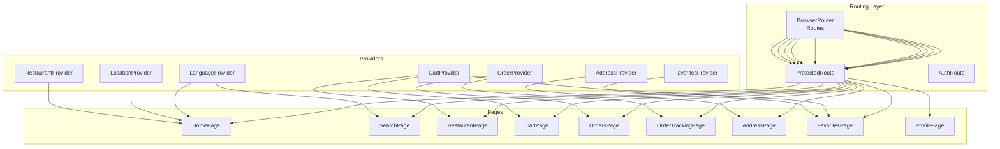

**Diagram sources**
- [App.tsx:74-124](file://src/App.tsx#L74-L124)
- [CartContext.tsx:22-57](file://src/context/CartContext.tsx#L22-L57)
- [OrderContext.tsx:41-131](file://src/context/OrderContext.tsx#L41-L131)
- [FavoritesContext.tsx:11-37](file://src/context/FavoritesContext.tsx#L11-L37)
- [AddressContext.tsx:31-86](file://src/context/AddressContext.tsx#L31-L86)

**Section sources**
- [App.tsx:56-72](file://src/App.tsx#L56-L72)
- [App.tsx:74-124](file://src/App.tsx#L74-L124)
- [main.tsx:6-10](file://src/main.tsx#L6-L10)

## Core Components
- HomePage: Restaurant discovery, category filtering, search, hot deals, craving broadcast.
- SearchPage: Standard and AI-powered search with sorting and cart actions.
- RestaurantPage: Menu display, favorites toggle, add/buy actions, floating cart bar.
- CartPage: Cart management, coupons, payment selection, checkout and order placement.
- OrdersPage: Order list with live status and cravings panel.
- OrderTrackingPage: Real-time status stepper, WhatsApp updates, delivery agent info, review prompt.
- AddressPage: CRUD for saved addresses, defaults, and validations.
- FavoritesPage: Favorite dishes list with quick add/buy actions.
- ProfilePage: Personal info, saved addresses, favorites, settings, logout.

**Section sources**
- [HomePage.tsx:21-409](file://src/pages/HomePage.tsx#L21-L409)
- [SearchPage.tsx:13-264](file://src/pages/SearchPage.tsx#L13-L264)
- [RestaurantPage.tsx:13-253](file://src/pages/RestaurantPage.tsx#L13-L253)
- [CartPage.tsx:40-366](file://src/pages/CartPage.tsx#L40-L366)
- [OrdersPage.tsx:21-295](file://src/pages/OrdersPage.tsx#L21-L295)
- [OrderTrackingPage.tsx:22-348](file://src/pages/OrderTrackingPage.tsx#L22-L348)
- [AddressPage.tsx:17-265](file://src/pages/AddressPage.tsx#L17-L265)
- [FavoritesPage.tsx:11-174](file://src/pages/FavoritesPage.tsx#L11-L174)
- [ProfilePage.tsx:11-121](file://src/pages/ProfilePage.tsx#L11-L121)

## Architecture Overview
The customer journey integrates UI pages with domain-specific contexts:
- CartContext manages cart items, quantities, totals, and persistence helpers.
- OrderContext manages live orders, status transitions, scheduling, and retrieval.
- FavoritesContext persists favorite food IDs in localStorage.
- AddressContext manages saved addresses, defaults, and selection.

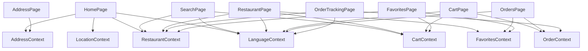

**Diagram sources**
- [HomePage.tsx:32-39](file://src/pages/HomePage.tsx#L32-L39)
- [SearchPage.tsx:17-20](file://src/pages/SearchPage.tsx#L17-L20)
- [RestaurantPage.tsx:16-20](file://src/pages/RestaurantPage.tsx#L16-L20)
- [CartPage.tsx:41-43](file://src/pages/CartPage.tsx#L41-L43)
- [OrdersPage.tsx:23-26](file://src/pages/OrdersPage.tsx#L23-L26)
- [OrderTrackingPage.tsx:25-27](file://src/pages/OrderTrackingPage.tsx#L25-L27)
- [AddressPage.tsx:19-28](file://src/pages/AddressPage.tsx#L19-L28)
- [FavoritesPage.tsx:13-16](file://src/pages/FavoritesPage.tsx#L13-L16)

## Detailed Component Analysis

### Homepage
Key behaviors:
- Header shows selected address and location detection button.
- Search input filters restaurants and menu items.
- Category chips filter by category or search term.
- “Hot Deals” carousel and crave-a-dish banner.
- Restaurant rows with horizontal scrolling menu previews.
- Bottom navigation and crave-a-dish modal.

Page-level state:
- Local state for active category, search query, craving form, and category modal visibility.

Integration highlights:
- Uses RestaurantContext for restaurants, AddressContext for selected address, LocationContext for GPS detection, LanguageContext for translations, and FavoritesContext for cravings broadcasting.

Responsive patterns:
- Sticky header with backdrop blur, horizontal scrolling lists with snap behavior, and bottom navigation.

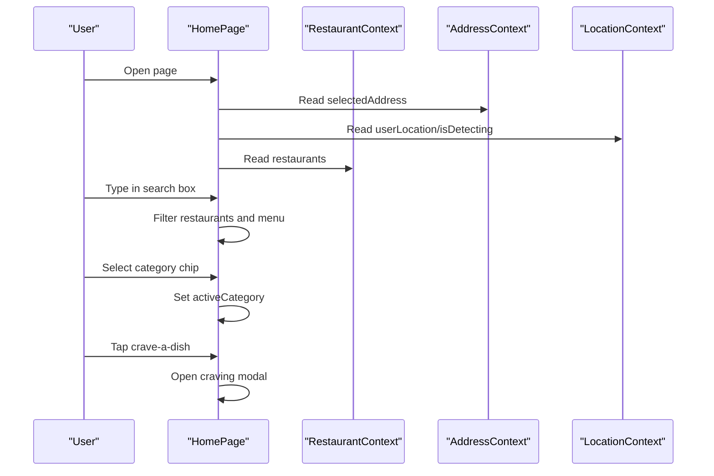

**Diagram sources**
- [HomePage.tsx:32-52](file://src/pages/HomePage.tsx#L32-L52)
- [HomePage.tsx:91-124](file://src/pages/HomePage.tsx#L91-L124)
- [HomePage.tsx:177-201](file://src/pages/HomePage.tsx#L177-L201)
- [HomePage.tsx:209-265](file://src/pages/HomePage.tsx#L209-L265)

**Section sources**
- [HomePage.tsx:21-409](file://src/pages/HomePage.tsx#L21-L409)

### Search Page
Key behaviors:
- Toggle between standard and AI smart search modes.
- Standard search filters restaurants; sorts by rating, distance, or name.
- AI search shows match score and reasons; allows quick add to cart.

Page-level state:
- Local state for query, sort mode, and search mode.

Integration highlights:
- Uses RestaurantContext, LanguageContext, and CartContext.
- Integrates AI search utility for smart recommendations.

Responsive patterns:
- Collapsible controls, grid for standard results, stacked cards for AI results.

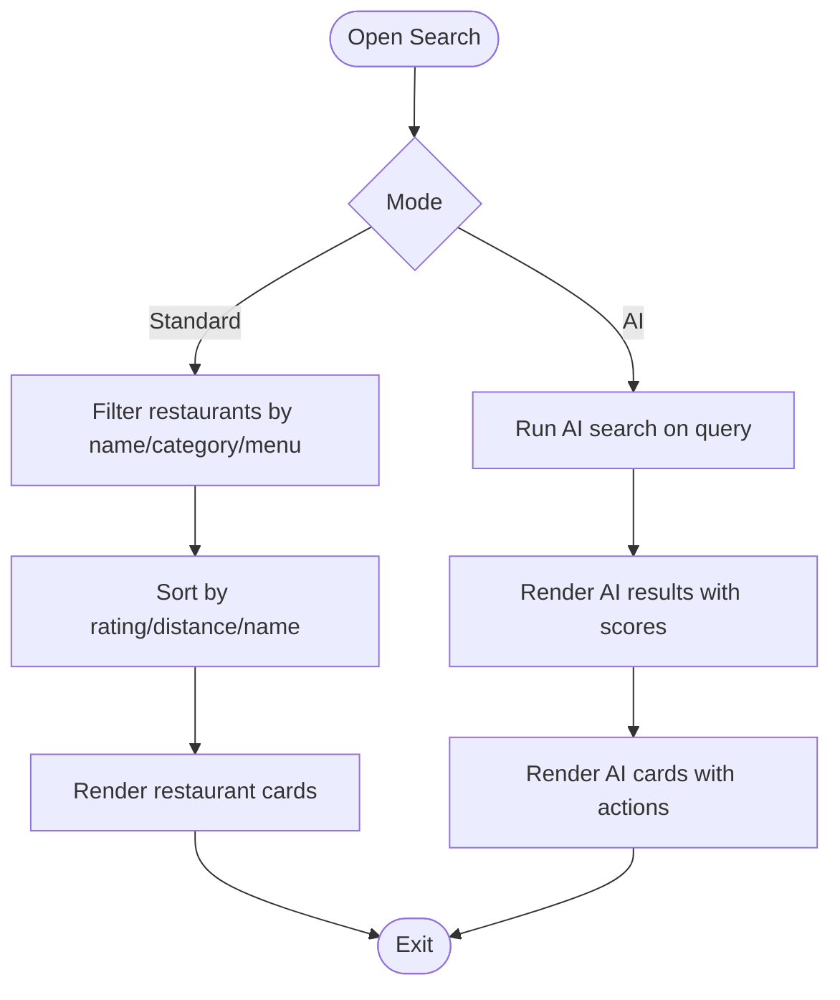

**Diagram sources**
- [SearchPage.tsx:17-44](file://src/pages/SearchPage.tsx#L17-L44)
- [SearchPage.tsx:118-130](file://src/pages/SearchPage.tsx#L118-L130)
- [SearchPage.tsx:131-255](file://src/pages/SearchPage.tsx#L131-L255)

**Section sources**
- [SearchPage.tsx:13-264](file://src/pages/SearchPage.tsx#L13-L264)

### Restaurant Page
Key behaviors:
- Displays banner, reviews, and menu grouped by category.
- Adds items to cart or buys now directly.
- Favorites toggle per food item.
- Floating cart bar appears when cart has items.

Page-level state:
- Local state for item quantities derived from CartContext.

Integration highlights:
- Uses CartContext for add/update/remove, OrderContext for reviews lookup, FavoritesContext for toggling favorites, LanguageContext for formatting.

Responsive patterns:
- Category-based vertical stacking, horizontal image overlays, and floating cart bar.

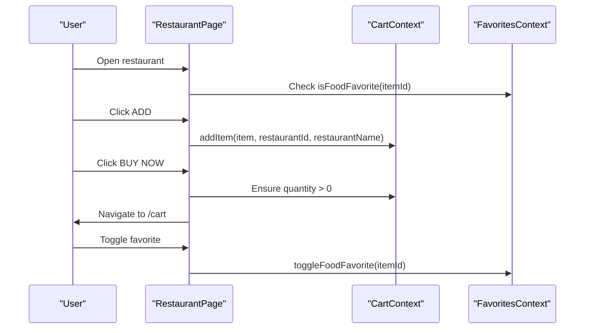

**Diagram sources**
- [RestaurantPage.tsx:16-43](file://src/pages/RestaurantPage.tsx#L16-L43)
- [RestaurantPage.tsx:115-123](file://src/pages/RestaurantPage.tsx#L115-L123)
- [RestaurantPage.tsx:141-198](file://src/pages/RestaurantPage.tsx#L141-L198)

**Section sources**
- [RestaurantPage.tsx:13-253](file://src/pages/RestaurantPage.tsx#L13-L253)

### Cart Page
Key behaviors:
- Lists cart items with quantity controls and remove.
- Applies coupons with validation and displays savings.
- Selects payment method (Cash on Delivery, Google Pay, PhonePe, UPI).
- Calculates subtotal, discount, delivery fee, COD fee, and grand total.
- Places order via OrderContext and navigates to order tracking.

Page-level state:
- Local state for promo input, applied promo, errors, payment method, and UPI ID.

Integration highlights:
- Uses CartContext for items and totals, OrderContext for placing orders, LanguageContext for formatting.

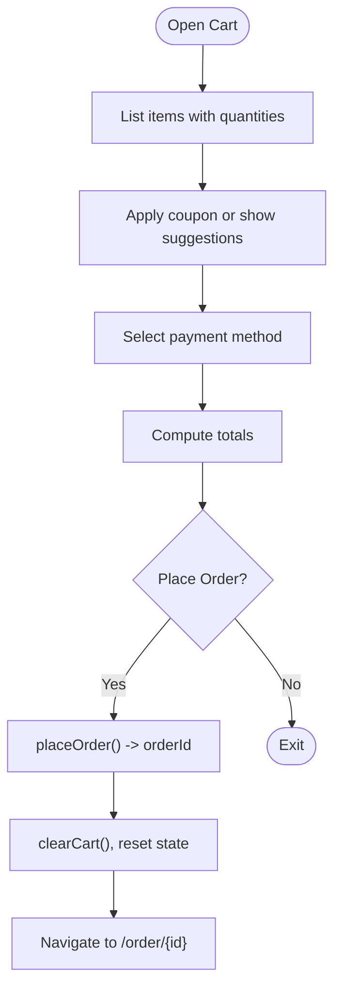

**Diagram sources**
- [CartPage.tsx:41-132](file://src/pages/CartPage.tsx#L41-L132)
- [CartPage.tsx:187-357](file://src/pages/CartPage.tsx#L187-L357)

**Section sources**
- [CartPage.tsx:40-366](file://src/pages/CartPage.tsx#L40-L366)

### Orders and Order Tracking
Key behaviors:
- OrdersPage shows live orders with status indicators and cravings panel.
- OrderTrackingPage shows live status stepper, ETA, WhatsApp updates, delivery agent, order summary, and post-delivery review prompt.

Page-level state:
- OrdersPage: active tab switching.
- OrderTrackingPage: WhatsApp opt-in state, status change detection, review dialog toggle.

Integration highlights:
- OrdersPage uses OrderContext for live orders and CravingsContext for custom cravings.
- OrderTrackingPage uses OrderContext for order retrieval, ReviewContext for reviews, and LanguageContext for formatting.

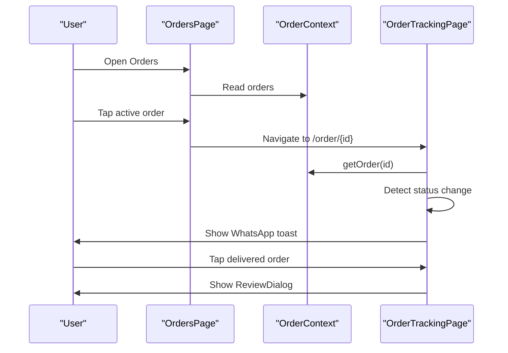

**Diagram sources**
- [OrdersPage.tsx:23-146](file://src/pages/OrdersPage.tsx#L23-L146)
- [OrderTrackingPage.tsx:25-54](file://src/pages/OrderTrackingPage.tsx#L25-L54)
- [OrderTrackingPage.tsx:315-340](file://src/pages/OrderTrackingPage.tsx#L315-L340)

**Section sources**
- [OrdersPage.tsx:21-295](file://src/pages/OrdersPage.tsx#L21-L295)
- [OrderTrackingPage.tsx:22-348](file://src/pages/OrderTrackingPage.tsx#L22-L348)

### Address Management
Key behaviors:
- Add, edit, delete, and set default addresses.
- Form validation for address length, phone format, and optional landmark.
- Animated list with layout animations.

Page-level state:
- Local state for form fields, editing ID, and error map.

Integration highlights:
- Uses AddressContext for CRUD operations and default selection.

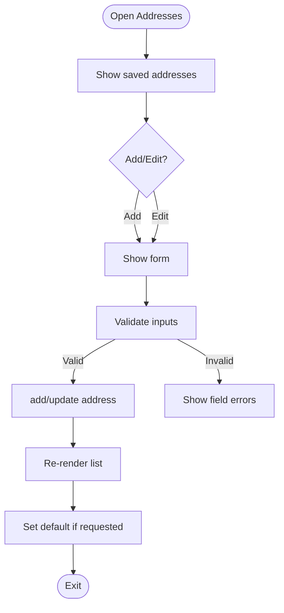

**Diagram sources**
- [AddressPage.tsx:19-87](file://src/pages/AddressPage.tsx#L19-L87)
- [AddressPage.tsx:193-246](file://src/pages/AddressPage.tsx#L193-L246)

**Section sources**
- [AddressPage.tsx:17-265](file://src/pages/AddressPage.tsx#L17-L265)

### Favorites System
Key behaviors:
- Displays favorite dishes across restaurants.
- Quick add to cart or buy now.
- Toggle favorites from list or restaurant menu.

Page-level state:
- Local state for item quantities derived from CartContext.

Integration highlights:
- Uses FavoritesContext for persisted favorites and RestaurantContext for menu data.

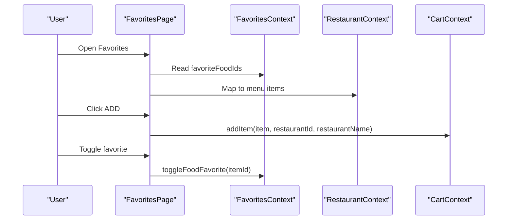

**Diagram sources**
- [FavoritesPage.tsx:13-34](file://src/pages/FavoritesPage.tsx#L13-L34)
- [FavoritesPage.tsx:50-152](file://src/pages/FavoritesPage.tsx#L50-L152)

**Section sources**
- [FavoritesPage.tsx:11-174](file://src/pages/FavoritesPage.tsx#L11-L174)

### Profile Management
Key behaviors:
- Displays user info and links to saved addresses, favorites, and settings.
- Dark mode toggle persisted in localStorage.
- Logout clears session and navigates to home.

Page-level state:
- Local state for dark mode synced to document class and localStorage.

Integration highlights:
- Uses AuthContext for user/session and AddressContext for address count.

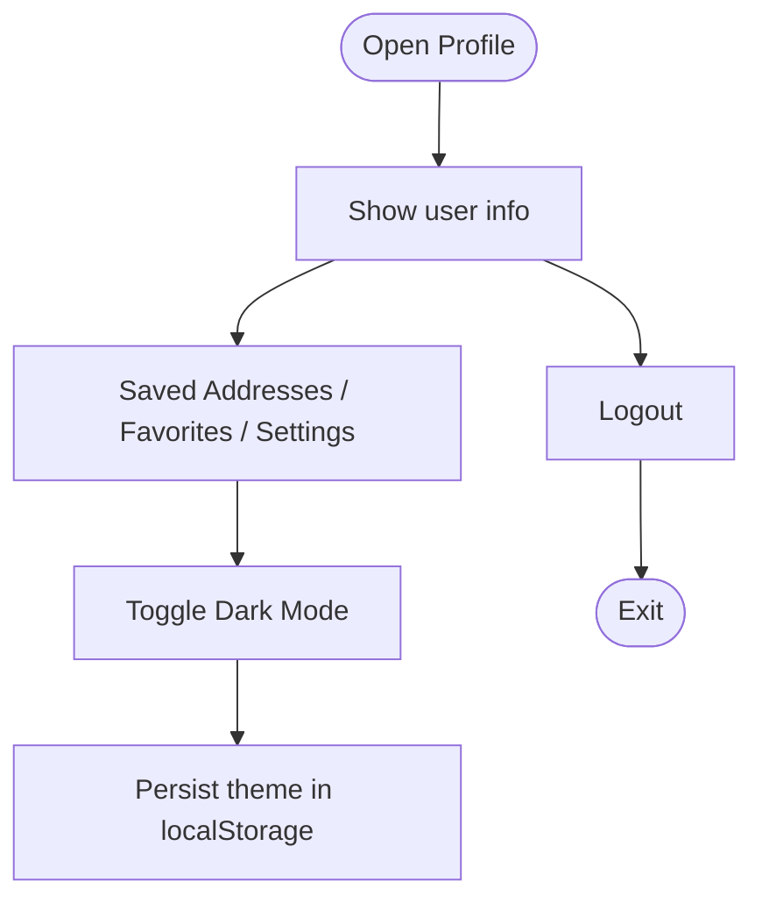

**Diagram sources**
- [ProfilePage.tsx:12-37](file://src/pages/ProfilePage.tsx#L12-L37)
- [ProfilePage.tsx:92-113](file://src/pages/ProfilePage.tsx#L92-L113)

**Section sources**
- [ProfilePage.tsx:11-121](file://src/pages/ProfilePage.tsx#L11-L121)

## Dependency Analysis
- Routing and protection:
  - ProtectedRoute enforces authentication for customer pages.
  - AuthRoute redirects authenticated users by role to appropriate dashboards.
- Provider stack:
  - App.tsx composes providers in a nested order to ensure downstream consumers can access CartContext, OrderContext, FavoritesContext, AddressContext, and others.
- Cross-page integrations:
  - RestaurantPage reads from CartContext and FavoritesContext.
  - CartPage writes to OrderContext and reads from CartContext.
  - OrdersPage reads from OrderContext and FavoritesContext.
  - OrderTrackingPage reads from OrderContext and ReviewContext.

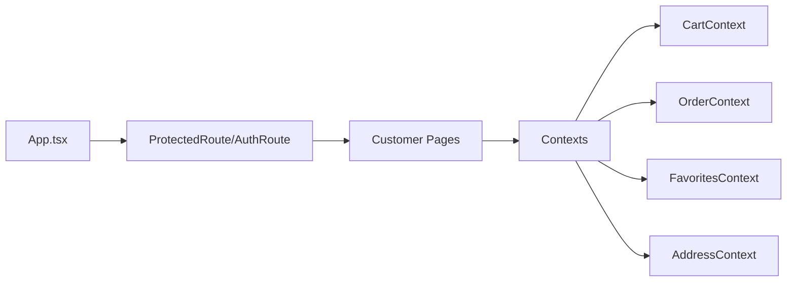

**Diagram sources**
- [App.tsx:56-72](file://src/App.tsx#L56-L72)
- [App.tsx:74-124](file://src/App.tsx#L74-L124)

**Section sources**
- [App.tsx:126-167](file://src/App.tsx#L126-L167)

## Performance Considerations
- Rendering optimization:
  - Use of motion and AnimatePresence for smooth transitions reduces jank during state changes.
  - Horizontal scrolling lists with snap behavior improve perceived performance for menu previews.
- State locality:
  - Prefer local component state for UI-only concerns (e.g., search query, modal visibility) to minimize provider re-renders.
- Context granularity:
  - Keep CartContext and OrderContext focused to avoid unnecessary re-renders in pages that do not consume them.
- Memoization:
  - Favor memoized callbacks in providers to prevent re-creations on each render.

## Troubleshooting Guide
- Cart shows zero items despite adding:
  - Verify CartContext.addItem is called with correct restaurantId and restaurantName.
  - Confirm updateQuantity does not drop below 1.
- Order not appearing in OrdersPage:
  - Ensure placeOrder returns an id and that the order is pushed to orders array.
  - Check status scheduling and timers are not cleared prematurely.
- Favorites not persisting:
  - Confirm localStorage key exists and is readable.
  - Ensure toggleFoodFavorite updates the array correctly.
- Address validation errors:
  - Validate full address length, phone format, and optional landmark constraints.
  - Ensure default address is set if none exists after deletion.

**Section sources**
- [CartContext.tsx:25-47](file://src/context/CartContext.tsx#L25-L47)
- [OrderContext.tsx:105-120](file://src/context/OrderContext.tsx#L105-L120)
- [FavoritesContext.tsx:25-29](file://src/context/FavoritesContext.tsx#L25-L29)
- [AddressPage.tsx:51-63](file://src/pages/AddressPage.tsx#L51-L63)

## Conclusion
The customer-facing pages in TIPPAY are structured around clear page responsibilities and robust context-driven state management. Protected routing ensures secure access, while CartContext and OrderContext orchestrate the core commerce flows. Responsive design and animation libraries enhance usability on mobile devices. The modular provider stack enables scalable growth and maintainable interactions across the customer journey.