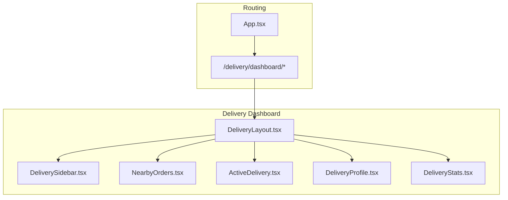
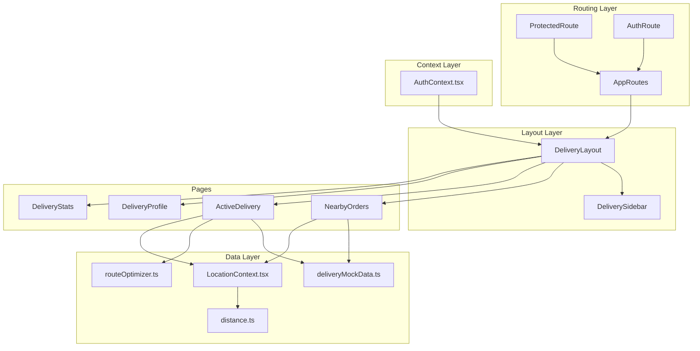
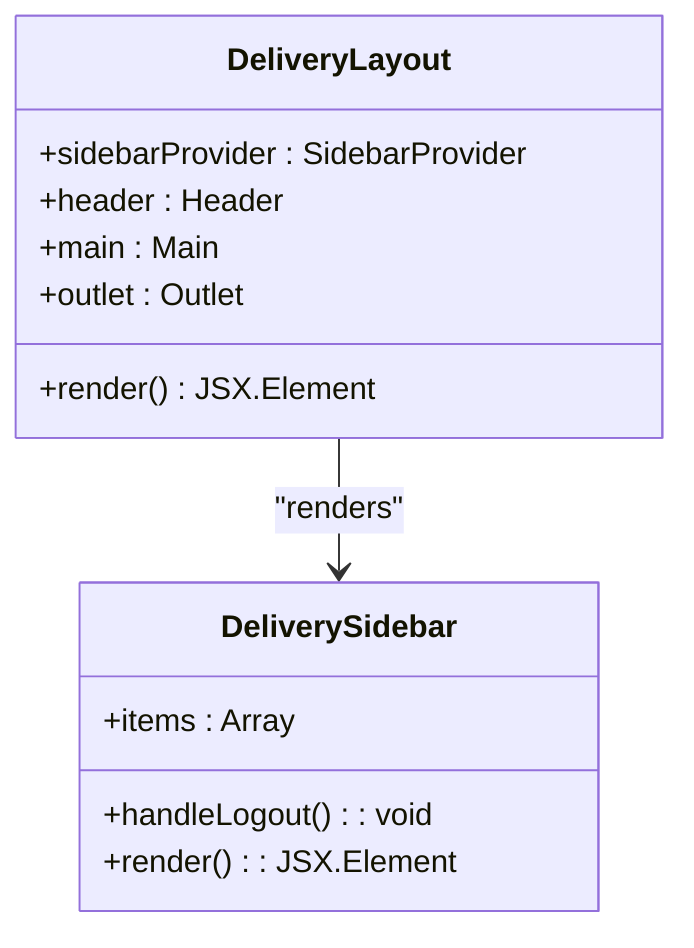
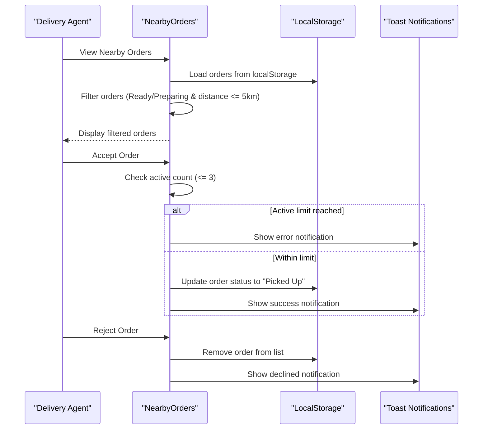
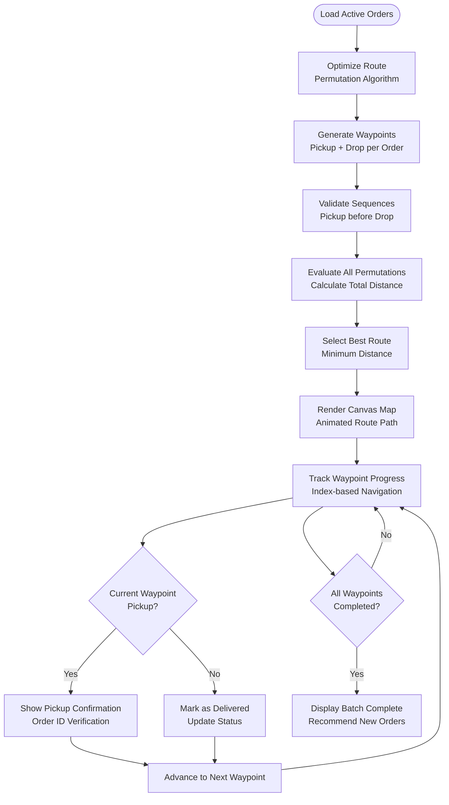
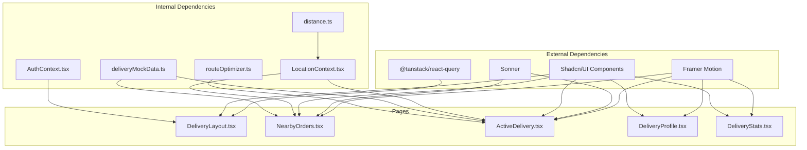

# Delivery Agent Pages

<cite>
**Referenced Files in This Document**
- [DeliveryLayout.tsx](file://src/pages/delivery/DeliveryLayout.tsx)
- [DeliverySidebar.tsx](file://src/components/DeliverySidebar.tsx)
- [NearbyOrders.tsx](file://src/pages/delivery/NearbyOrders.tsx)
- [ActiveDelivery.tsx](file://src/pages/delivery/ActiveDelivery.tsx)
- [DeliveryProfile.tsx](file://src/pages/delivery/DeliveryProfile.tsx)
- [DeliveryStats.tsx](file://src/pages/delivery/DeliveryStats.tsx)
- [deliveryMockData.ts](file://src/data/deliveryMockData.ts)
- [routeOptimizer.ts](file://src/utils/routeOptimizer.ts)
- [LocationContext.tsx](file://src/context/LocationContext.tsx)
- [distance.ts](file://src/utils/distance.ts)
- [App.tsx](file://src/App.tsx)
- [AuthContext.tsx](file://src/context/AuthContext.tsx)
</cite>

## Table of Contents
1. [Introduction](#introduction)
2. [Project Structure](#project-structure)
3. [Core Components](#core-components)
4. [Architecture Overview](#architecture-overview)
5. [Detailed Component Analysis](#detailed-component-analysis)
6. [Dependency Analysis](#dependency-analysis)
7. [Performance Considerations](#performance-considerations)
8. [Troubleshooting Guide](#troubleshooting-guide)
9. [Conclusion](#conclusion)

## Introduction
This document provides comprehensive documentation for the delivery agent interface pages in TIPPAY. It covers the delivery layout component for consistent navigation and branding, the nearby orders page with order filtering and assignment functionality, the active delivery page with real-time tracking and delivery management, the delivery agent profile for personal information and vehicle details, and the delivery statistics dashboard with performance metrics and earnings reports. The documentation explains location-based services integration, real-time order tracking, GPS navigation integration, and delivery workflow automation, including examples of order assignment algorithms, route optimization, and performance monitoring.

## Project Structure
The delivery agent interface is organized under the `/delivery` namespace with dedicated pages and shared components. The routing structure ensures protected access and role-based navigation.

**Diagram sources**
- [App.tsx:103-110](file://src/App.tsx#L103-L110)
- [DeliveryLayout.tsx:1-25](file://src/pages/delivery/DeliveryLayout.tsx#L1-L25)
- [DeliverySidebar.tsx:20-25](file://src/components/DeliverySidebar.tsx#L20-L25)

**Section sources**
- [App.tsx:103-110](file://src/App.tsx#L103-L110)
- [DeliveryLayout.tsx:1-25](file://src/pages/delivery/DeliveryLayout.tsx#L1-L25)

## Core Components
This section outlines the primary components that compose the delivery agent interface and their responsibilities.

- DeliveryLayout: Provides the main layout with sidebar navigation and outlet rendering for child routes.
- DeliverySidebar: Implements the navigation menu for delivery agent pages, including branding and logout functionality.
- NearbyOrders: Displays available orders within a 5 km radius, filters by status, and manages order acceptance/rejection.
- ActiveDelivery: Manages active delivery batches, optimizes routes, renders interactive maps, and handles delivery progression.
- DeliveryProfile: Shows agent personal information and verification status.
- DeliveryStats: Presents performance metrics, earnings, and achievement badges.

**Section sources**
- [DeliveryLayout.tsx:5-22](file://src/pages/delivery/DeliveryLayout.tsx#L5-L22)
- [DeliverySidebar.tsx:27-89](file://src/components/DeliverySidebar.tsx#L27-L89)
- [NearbyOrders.tsx:8-46](file://src/pages/delivery/NearbyOrders.tsx#L8-L46)
- [ActiveDelivery.tsx:16-397](file://src/pages/delivery/ActiveDelivery.tsx#L16-L397)
- [DeliveryProfile.tsx:5-53](file://src/pages/delivery/DeliveryProfile.tsx#L5-L53)
- [DeliveryStats.tsx:5-96](file://src/pages/delivery/DeliveryStats.tsx#L5-L96)

## Architecture Overview
The delivery agent interface follows a structured architecture with clear separation of concerns:
- Routing: Protected routes ensure only authenticated users access delivery pages.
- Layout: Shared layout component provides consistent navigation and branding.
- Data Management: Local storage persists order state and user preferences.
- Utility Services: Route optimization and distance calculations support real-time operations.
- Context Providers: Authentication and location contexts enable seamless integration.

**Diagram sources**
- [App.tsx:56-72](file://src/App.tsx#L56-L72)
- [App.tsx:103-110](file://src/App.tsx#L103-L110)
- [DeliveryLayout.tsx:1-25](file://src/pages/delivery/DeliveryLayout.tsx#L1-L25)
- [DeliverySidebar.tsx:27-89](file://src/components/DeliverySidebar.tsx#L27-L89)
- [NearbyOrders.tsx:1-170](file://src/pages/delivery/NearbyOrders.tsx#L1-L170)
- [ActiveDelivery.tsx:1-398](file://src/pages/delivery/ActiveDelivery.tsx#L1-L398)
- [deliveryMockData.ts:19-133](file://src/data/deliveryMockData.ts#L19-L133)
- [routeOptimizer.ts:53-194](file://src/utils/routeOptimizer.ts#L53-L194)
- [LocationContext.tsx:17-56](file://src/context/LocationContext.tsx#L17-L56)
- [distance.ts:1-34](file://src/utils/distance.ts#L1-L34)
- [AuthContext.tsx:40-123](file://src/context/AuthContext.tsx#L40-L123)

## Detailed Component Analysis

### Delivery Layout Component
The delivery layout component establishes the foundational structure for the delivery dashboard, providing consistent navigation and branding across all delivery pages.

Key characteristics:
- Uses SidebarProvider for responsive sidebar behavior
- Renders header with sticky positioning and backdrop blur
- Provides outlet for dynamic page content
- Integrates DeliverySidebar for navigation

**Diagram sources**
- [DeliveryLayout.tsx:5-22](file://src/pages/delivery/DeliveryLayout.tsx#L5-L22)
- [DeliverySidebar.tsx:27-89](file://src/components/DeliverySidebar.tsx#L27-L89)

**Section sources**
- [DeliveryLayout.tsx:5-22](file://src/pages/delivery/DeliveryLayout.tsx#L5-L22)
- [DeliverySidebar.tsx:27-89](file://src/components/DeliverySidebar.tsx#L27-L89)

### Nearby Orders Page
The nearby orders page displays available orders within a 5 km radius, filters by status ("Ready" or "Preparing"), and manages order assignment with dispatch limits.

Core functionality:
- Filters orders based on proximity and status
- Enforces a maximum of 3 active orders per rider
- Provides visual indicators for order details and estimated time
- Implements order acceptance with confirmation and rejection actions

**Diagram sources**
- [NearbyOrders.tsx:19-46](file://src/pages/delivery/NearbyOrders.tsx#L19-L46)
- [NearbyOrders.tsx:26-46](file://src/pages/delivery/NearbyOrders.tsx#L26-L46)

**Section sources**
- [NearbyOrders.tsx:8-46](file://src/pages/delivery/NearbyOrders.tsx#L8-L46)
- [NearbyOrders.tsx:19-46](file://src/pages/delivery/NearbyOrders.tsx#L19-L46)

### Active Delivery Page
The active delivery page manages real-time tracking and delivery management with route optimization and interactive map visualization.

Key features:
- Route optimization using permutation-based algorithm
- Canvas-based map rendering with animated route visualization
- Waypoint progression with pickup and delivery confirmation
- Real-time analytics for distance, duration, and fuel savings

**Diagram sources**
- [ActiveDelivery.tsx:26-27](file://src/pages/delivery/ActiveDelivery.tsx#L26-L27)
- [routeOptimizer.ts:106-135](file://src/utils/routeOptimizer.ts#L106-L135)
- [routeOptimizer.ts:168-181](file://src/utils/routeOptimizer.ts#L168-L181)

**Section sources**
- [ActiveDelivery.tsx:16-397](file://src/pages/delivery/ActiveDelivery.tsx#L16-L397)
- [routeOptimizer.ts:53-194](file://src/utils/routeOptimizer.ts#L53-L194)

### Delivery Agent Profile
The delivery profile page presents agent information and verification status using the authentication context.

Features:
- Displays agent name, verified status badge, and contact information
- Shows zone assignment for the agent
- Uses motion animations for enhanced user experience

**Section sources**
- [DeliveryProfile.tsx:5-53](file://src/pages/delivery/DeliveryProfile.tsx#L5-L53)
- [AuthContext.tsx:18-27](file://src/context/AuthContext.tsx#L18-L27)

### Delivery Statistics Dashboard
The statistics dashboard provides performance metrics, earnings reports, and achievement badges.

Components:
- Top stats cards for total deliveries, daily performance, ratings, and completion rate
- Earnings breakdown by day, week, and month
- Achievement badges highlighting performance milestones

**Section sources**
- [DeliveryStats.tsx:5-96](file://src/pages/delivery/DeliveryStats.tsx#L5-L96)
- [deliveryMockData.ts:128-133](file://src/data/deliveryMockData.ts#L128-L133)

## Dependency Analysis
The delivery agent interface relies on several key dependencies and integration points:

**Diagram sources**
- [App.tsx:1-167](file://src/App.tsx#L1-L167)
- [DeliveryLayout.tsx:1-25](file://src/pages/delivery/DeliveryLayout.tsx#L1-L25)
- [NearbyOrders.tsx:1-170](file://src/pages/delivery/NearbyOrders.tsx#L1-L170)
- [ActiveDelivery.tsx:1-398](file://src/pages/delivery/ActiveDelivery.tsx#L1-L398)
- [DeliveryProfile.tsx:1-54](file://src/pages/delivery/DeliveryProfile.tsx#L1-L54)
- [DeliveryStats.tsx:1-97](file://src/pages/delivery/DeliveryStats.tsx#L1-L97)
- [AuthContext.tsx:1-130](file://src/context/AuthContext.tsx#L1-L130)
- [LocationContext.tsx:1-63](file://src/context/LocationContext.tsx#L1-L63)
- [deliveryMockData.ts:1-134](file://src/data/deliveryMockData.ts#L1-L134)
- [routeOptimizer.ts:1-195](file://src/utils/routeOptimizer.ts#L1-L195)
- [distance.ts:1-34](file://src/utils/distance.ts#L1-L34)

**Section sources**
- [App.tsx:1-167](file://src/App.tsx#L1-L167)
- [AuthContext.tsx:1-130](file://src/context/AuthContext.tsx#L1-L130)
- [LocationContext.tsx:1-63](file://src/context/LocationContext.tsx#L1-L63)
- [deliveryMockData.ts:1-134](file://src/data/deliveryMockData.ts#L1-L134)
- [routeOptimizer.ts:1-195](file://src/utils/routeOptimizer.ts#L1-L195)
- [distance.ts:1-34](file://src/utils/distance.ts#L1-L34)

## Performance Considerations
Several performance aspects are implemented to ensure smooth operation:

- Route Optimization Algorithm: The permutation-based approach evaluates all valid sequences while maintaining acceptable performance for small order counts (≤ 3 orders).
- Canvas Rendering: Efficient canvas-based map rendering with requestAnimationFrame for smooth animations.
- Local Storage Persistence: State persistence reduces server load and improves responsiveness.
- Lazy Loading: Components use motion animations judiciously to balance performance and user experience.
- Geolocation Accuracy: High-accuracy geolocation with timeout and maximum age constraints for reliable location detection.

## Troubleshooting Guide
Common issues and their resolutions:

### Location Detection Issues
- Symptom: Location detection fails or shows permission errors
- Resolution: Verify browser geolocation permissions and network connectivity
- Implementation: Error handling in LocationContext with user feedback

### Order Assignment Limits
- Symptom: Cannot accept more than 3 active orders
- Resolution: Complete current deliveries before accepting new ones
- Implementation: Dispatch limit enforcement in NearbyOrders component

### Route Optimization Failures
- Symptom: Route optimization returns default values
- Resolution: Ensure sufficient order data and valid coordinates
- Implementation: Fallback mechanisms in routeOptimizer utility

**Section sources**
- [LocationContext.tsx:21-49](file://src/context/LocationContext.tsx#L21-L49)
- [NearbyOrders.tsx:26-33](file://src/pages/delivery/NearbyOrders.tsx#L26-L33)
- [routeOptimizer.ts:139-147](file://src/utils/routeOptimizer.ts#L139-L147)

## Conclusion
The TIPPAY delivery agent interface provides a comprehensive solution for managing delivery operations with intuitive navigation, real-time order tracking, and performance monitoring. The modular architecture ensures maintainability and scalability, while the integration of location services and route optimization enhances operational efficiency. The implementation demonstrates best practices in React development, including proper context usage, component composition, and performance optimization techniques.