# Page Components

<cite>
**Referenced Files in This Document**
- [App.tsx](file://src/App.tsx)
- [Index.tsx](file://src/pages/Index.tsx)
- [HomePage.tsx](file://src/pages/HomePage.tsx)
- [SearchPage.tsx](file://src/pages/SearchPage.tsx)
- [CartPage.tsx](file://src/pages/CartPage.tsx)
- [OrdersPage.tsx](file://src/pages/OrdersPage.tsx)
- [ProfilePage.tsx](file://src/pages/ProfilePage.tsx)
- [RestaurantPage.tsx](file://src/pages/RestaurantPage.tsx)
- [RestaurantLayout.tsx](file://src/pages/restaurant/RestaurantLayout.tsx)
- [OrderManagement.tsx](file://src/pages/restaurant/OrderManagement.tsx)
- [MenuEditor.tsx](file://src/pages/restaurant/MenuEditor.tsx)
- [RestaurantAnalytics.tsx](file://src/pages/restaurant/RestaurantAnalytics.tsx)
- [CouponManagement.tsx](file://src/pages/restaurant/CouponManagement.tsx)
- [DishRequests.tsx](file://src/pages/restaurant/DishRequests.tsx)
- [DeliveryLayout.tsx](file://src/pages/delivery/DeliveryLayout.tsx)
- [NearbyOrders.tsx](file://src/pages/delivery/NearbyOrders.tsx)
- [ActiveDelivery.tsx](file://src/pages/delivery/ActiveDelivery.tsx)
- [DeliveryStats.tsx](file://src/pages/delivery/DeliveryStats.tsx)
- [DeliveryProfile.tsx](file://src/pages/delivery/DeliveryProfile.tsx)
</cite>

## Table of Contents
1. [Introduction](#introduction)
2. [Project Structure](#project-structure)
3. [Core Components](#core-components)
4. [Architecture Overview](#architecture-overview)
5. [Detailed Component Analysis](#detailed-component-analysis)
6. [Dependency Analysis](#dependency-analysis)
7. [Performance Considerations](#performance-considerations)
8. [Troubleshooting Guide](#troubleshooting-guide)
9. [Conclusion](#conclusion)

## Introduction
This document explains TIPPAY’s page component architecture organized by user roles. It covers customer-facing pages (home, search, restaurant browsing, cart, orders, profile), restaurant owner dashboard pages (menu management, order processing, analytics, coupons, dish requests), delivery agent interface (order assignment, route tracking, stats), and administrator panel (system monitoring and user management). It also documents shared layout components, navigation patterns, role-specific page compositions, page-level state management, data fetching patterns, integration with context providers, routing and protected routes, and responsive design considerations.

## Project Structure
TIPPAY uses React with React Router for routing and React Query for caching. Providers wrap the app to supply global state (authentication, cart, orders, addresses, favorites, language, location, reviews, restaurant metadata, cravings). Pages are grouped by role under dedicated folders for restaurant, delivery, and admin dashboards.

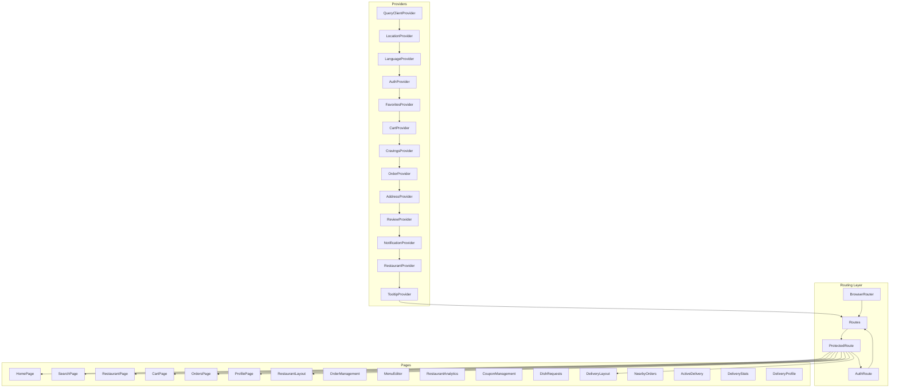

**Diagram sources**
- [App.tsx:73-122](file://src/App.tsx#L73-L122)
- [App.tsx:124-162](file://src/App.tsx#L124-L162)

**Section sources**
- [App.tsx:1-165](file://src/App.tsx#L1-L165)

## Core Components
- Routing and guards:
  - ProtectedRoute enforces authentication for most pages.
  - AuthRoute redirects authenticated users to their role-specific dashboard.
- Providers:
  - Global state is supplied via nested providers for cart, orders, addresses, favorites, language, location, reviews, restaurant metadata, cravings, notifications, and tooltips.
- Layouts:
  - Role-specific layouts provide sidebar navigation and outlet rendering for nested routes.

Key provider stack and routing are defined in the application entry.

**Section sources**
- [App.tsx:55-71](file://src/App.tsx#L55-L71)
- [App.tsx:73-122](file://src/App.tsx#L73-L122)
- [App.tsx:124-162](file://src/App.tsx#L124-L162)

## Architecture Overview
The routing layer defines public and protected routes. Authentication determines redirection for unauthenticated users and role-based redirection for authenticated users. Role-specific dashboards render nested routes inside shared layouts.

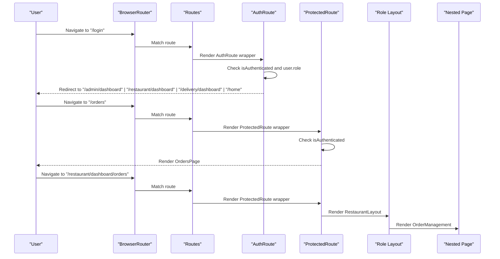

**Diagram sources**
- [App.tsx:55-71](file://src/App.tsx#L55-L71)
- [App.tsx:73-122](file://src/App.tsx#L73-L122)

## Detailed Component Analysis

### Customer-Facing Pages

#### Home Page
- Purpose: Discover restaurants, filter by category/search, broadcast cravings, and preview deals.
- State management:
  - Local state for category filtering, search query, craving modal visibility, and craving form fields.
  - Context usage: Auth, Address, Restaurant list, Location, Language, Cravings.
- Data flow:
  - Filters restaurants and menu items based on category and search query.
  - Supports craving broadcasting to notify nearby chefs.
- UX highlights: Animated transitions, bottom navigation, category chips, hot deals carousel.

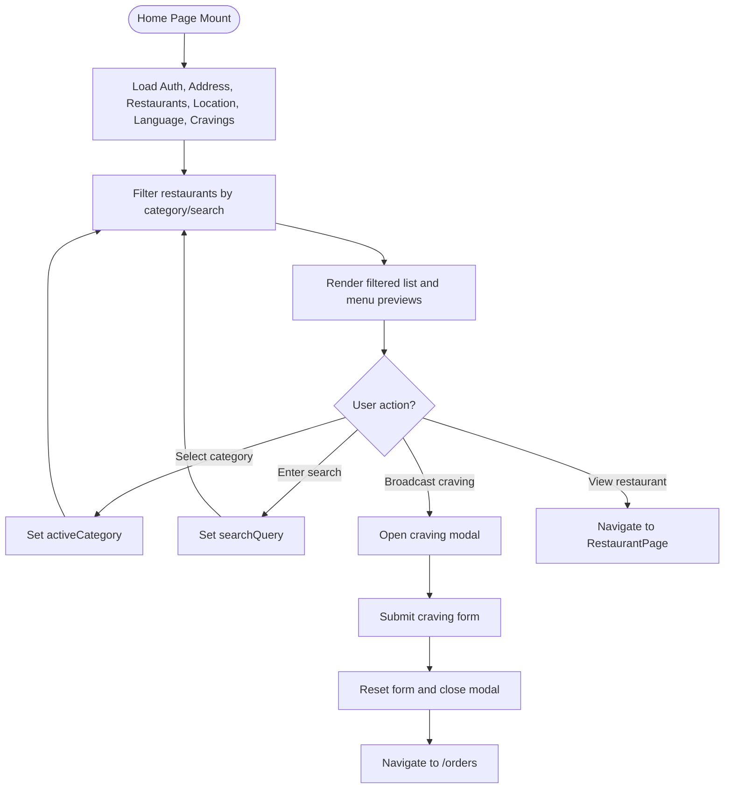

**Diagram sources**
- [HomePage.tsx:21-84](file://src/pages/HomePage.tsx#L21-L84)
- [HomePage.tsx:41-52](file://src/pages/HomePage.tsx#L41-L52)

**Section sources**
- [HomePage.tsx:1-409](file://src/pages/HomePage.tsx#L1-L409)

#### Search Page
- Purpose: Standard and AI-powered smart search for dishes/restaurants.
- State management:
  - Local state for query, sort mode, and search mode (standard vs AI).
  - Context usage: Restaurant list, Cart, Language, AI search utility.
- Data flow:
  - Standard mode filters restaurants by name/category/menu keywords and supports sorting.
  - AI mode computes relevance scores and displays match metrics and reasons.
- UX highlights: Animated cards, match score bars, add-to-cart actions with cart updates.

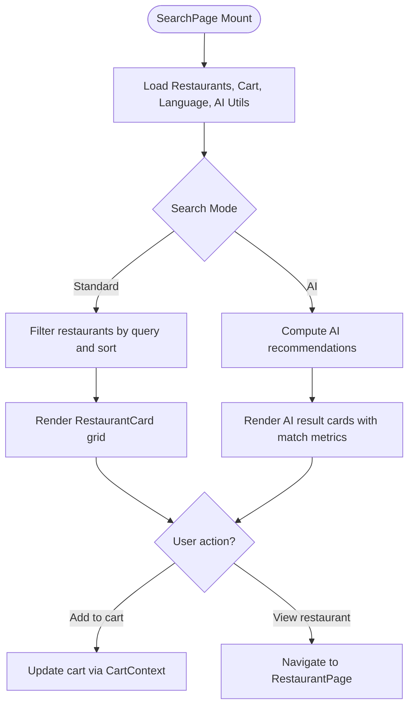

**Diagram sources**
- [SearchPage.tsx:13-44](file://src/pages/SearchPage.tsx#L13-L44)
- [SearchPage.tsx:118-130](file://src/pages/SearchPage.tsx#L118-L130)
- [SearchPage.tsx:131-255](file://src/pages/SearchPage.tsx#L131-L255)

**Section sources**
- [SearchPage.tsx:1-264](file://src/pages/SearchPage.tsx#L1-L264)

#### Restaurant Page
- Purpose: Browse restaurant menu, add items to cart, favorite dishes, and see reviews.
- State management:
  - Local state for item quantities and floating cart bar visibility.
  - Context usage: Cart, Favorites, Reviews, Restaurant metadata, Language.
- Data flow:
  - Groups menu by category, handles add/update/remove from cart, and navigates to cart.
- UX highlights: Animated menu items, floating cart bar, favorite toggling, star ratings.

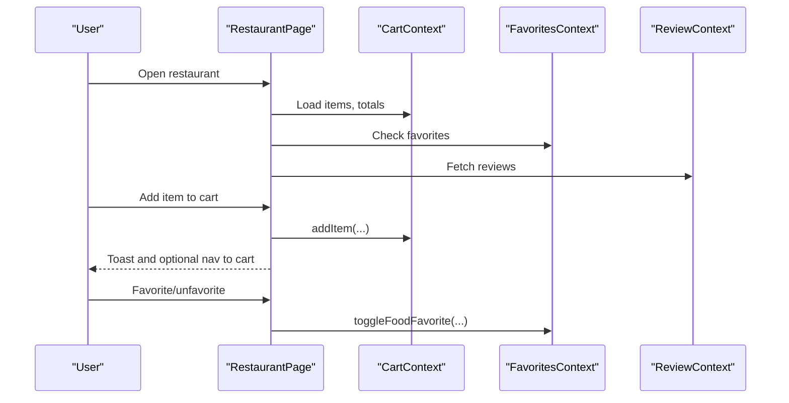

**Diagram sources**
- [RestaurantPage.tsx:13-43](file://src/pages/RestaurantPage.tsx#L13-L43)
- [RestaurantPage.tsx:106-202](file://src/pages/RestaurantPage.tsx#L106-L202)

**Section sources**
- [RestaurantPage.tsx:1-253](file://src/pages/RestaurantPage.tsx#L1-L253)

#### Cart Page
- Purpose: Manage cart items, apply coupons, choose payment method, and place orders.
- State management:
  - Local state for promo code, applied coupon, payment method, and UPI ID.
  - Context usage: Cart, Orders, Language.
- Data flow:
  - Calculates subtotal, discount, delivery fee, COD fee, and grand total.
  - Places order via OrdersContext and clears cart.
- UX highlights: Animated cart items, coupon application, payment method selection, checkout button.

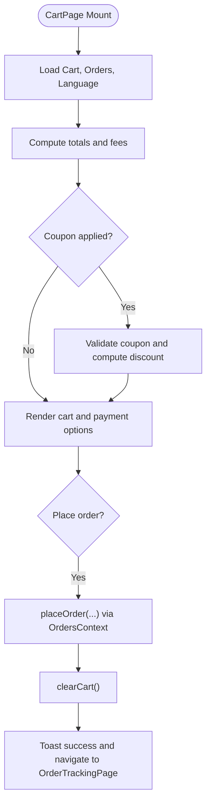

**Diagram sources**
- [CartPage.tsx:40-132](file://src/pages/CartPage.tsx#L40-L132)
- [CartPage.tsx:134-362](file://src/pages/CartPage.tsx#L134-L362)

**Section sources**
- [CartPage.tsx:1-366](file://src/pages/CartPage.tsx#L1-L366)

#### Orders Page
- Purpose: View order history and live orders; manage custom cravings offers.
- State management:
  - Local state for active tab (orders vs cravings).
  - Context usage: Orders, Cravings, Language, Auth.
- Data flow:
  - Merges live orders with mock orders; renders status timeline with animations.
  - Handles accepting/rejecting chef offers for cravings.
- UX highlights: Animated order cards, status indicators, tabbed interface, craving offer cards.

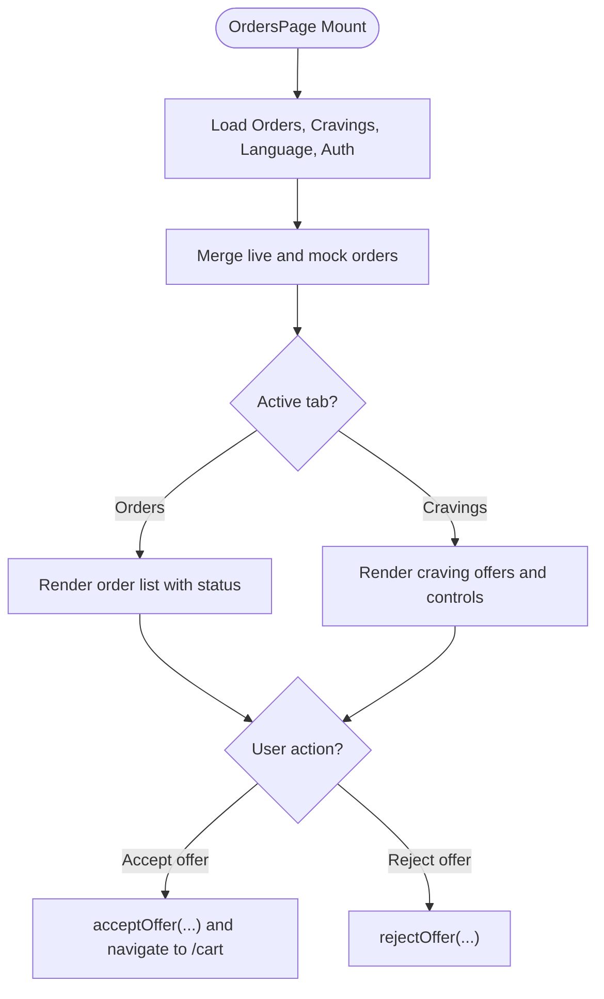

**Diagram sources**
- [OrdersPage.tsx:21-44](file://src/pages/OrdersPage.tsx#L21-L44)
- [OrdersPage.tsx:152-285](file://src/pages/OrdersPage.tsx#L152-L285)

**Section sources**
- [OrdersPage.tsx:1-295](file://src/pages/OrdersPage.tsx#L1-L295)

#### Profile Page
- Purpose: View and edit personal information, manage saved addresses, favorites, settings, and theme.
- State management:
  - Local state for dark mode with persistence.
  - Context usage: Auth, Address.
- UX highlights: Animated menu items, dark mode toggle, logout action.

**Section sources**
- [ProfilePage.tsx:1-121](file://src/pages/ProfilePage.tsx#L1-L121)

### Restaurant Owner Dashboard

#### Restaurant Layout
- Purpose: Shared layout for restaurant owner dashboard with sidebar and outlet.
- Behavior: Provides header with sidebar trigger and renders nested routes.

**Section sources**
- [RestaurantLayout.tsx:1-25](file://src/pages/restaurant/RestaurantLayout.tsx#L1-L25)

#### Order Management
- Purpose: View and advance order statuses (new, active, completed).
- State management:
  - Local state for orders and active tab.
  - Context usage: Mock restaurant orders.
- Data flow:
  - Filters orders by tab; advances status through predefined flow.
- UX highlights: Animated order cards, status badges, action buttons.

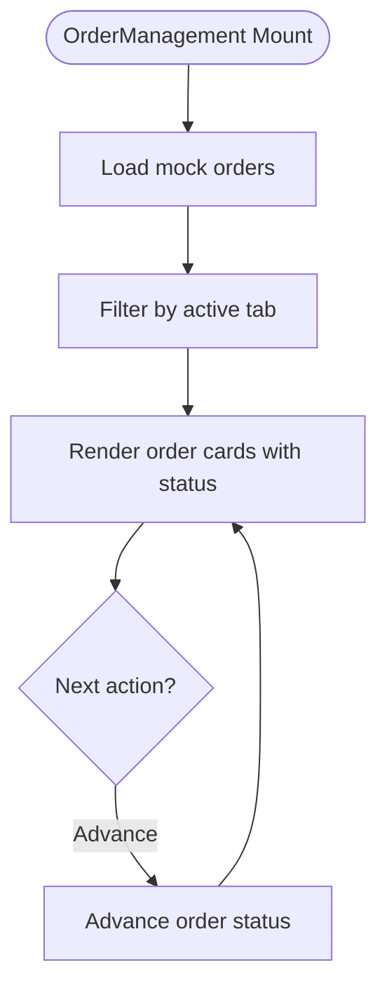

**Diagram sources**
- [OrderManagement.tsx:26-54](file://src/pages/restaurant/OrderManagement.tsx#L26-L54)
- [OrderManagement.tsx:96-170](file://src/pages/restaurant/OrderManagement.tsx#L96-L170)

**Section sources**
- [OrderManagement.tsx:1-175](file://src/pages/restaurant/OrderManagement.tsx#L1-L175)

#### Menu Editor
- Purpose: Add, edit, delete, and toggle availability of menu items.
- State management:
  - Local state for editing item, add/edit dialog, and form data.
  - Context usage: Restaurant menu operations.
- UX highlights: Animated item list, availability toggle, add/edit dialog with validation.

**Section sources**
- [MenuEditor.tsx:1-218](file://src/pages/restaurant/MenuEditor.tsx#L1-L218)

#### Restaurant Analytics
- Purpose: Display performance metrics and charts for orders and popular items.
- State management:
  - Local state for selected period (daily/weekly/monthly/yearly).
  - Context usage: Mock analytics data.
- UX highlights: Responsive bar and pie charts, stat cards, animated entries.

**Section sources**
- [RestaurantAnalytics.tsx:1-163](file://src/pages/restaurant/RestaurantAnalytics.tsx#L1-L163)

#### Coupon Management
- Purpose: Create, activate/deactivate, and delete discount coupons.
- State management:
  - Local state for coupon form and dialog.
  - Context usage: Mock coupons persisted via data module.
- UX highlights: Animated coupon cards, copy-to-clipboard, availability toggle.

**Section sources**
- [CouponManagement.tsx:1-187](file://src/pages/restaurant/CouponManagement.tsx#L1-L187)

#### Dish Requests
- Purpose: Receive and respond to customer-custom dish requests with offers.
- State management:
  - Local state for per-craving form inputs (price, prep time, message).
  - Context usage: Cravings and restaurant metadata.
- UX highlights: Animated request cards, offer submission form, offer status display.

**Section sources**
- [DishRequests.tsx:1-221](file://src/pages/restaurant/DishRequests.tsx#L1-L221)

### Delivery Agent Interface

#### Delivery Layout
- Purpose: Shared layout for delivery dashboard with sidebar and outlet.
- Behavior: Provides header with sidebar trigger and renders nested routes.

**Section sources**
- [DeliveryLayout.tsx:1-25](file://src/pages/delivery/DeliveryLayout.tsx#L1-L25)

#### Nearby Orders
- Purpose: Discover and accept nearby ready orders within a 5km radius.
- State management:
  - Local state for orders synced to localStorage.
  - Context usage: Mock delivery orders.
- Data flow:
  - Filters orders by status and distance; enforces a limit of 3 active orders.
- UX highlights: Animated order cards, acceptance/rejection actions, online indicator.

**Section sources**
- [NearbyOrders.tsx:1-170](file://src/pages/delivery/NearbyOrders.tsx#L1-L170)

#### Active Delivery
- Purpose: Optimize and execute delivery batches with route visualization and waypoint progression.
- State management:
  - Local state for orders, current waypoint index, pickup code dialog, and canvas animation.
  - Context usage: Mock delivery orders and route optimizer utility.
- Data flow:
  - Computes optimized route; draws a canvas map; handles pickup/drop-off confirmations.
- UX highlights: Animated route path, interactive waypoint queue, batch completion state.

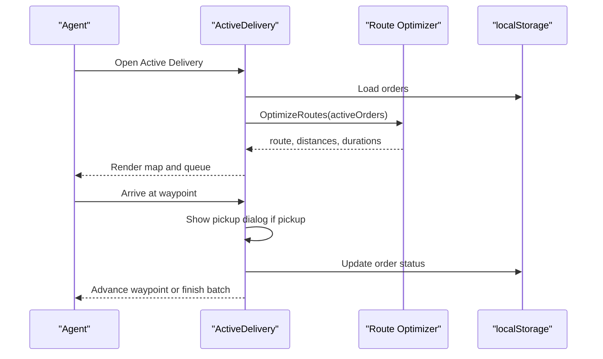

**Diagram sources**
- [ActiveDelivery.tsx:16-42](file://src/pages/delivery/ActiveDelivery.tsx#L16-L42)
- [ActiveDelivery.tsx:26-397](file://src/pages/delivery/ActiveDelivery.tsx#L26-L397)

**Section sources**
- [ActiveDelivery.tsx:1-398](file://src/pages/delivery/ActiveDelivery.tsx#L1-L398)

#### Delivery Stats
- Purpose: Display performance metrics and earnings overview.
- State management:
  - Local state for stats data.
  - Context usage: Mock agent stats.
- UX highlights: Animated stat cards, earnings breakdown, achievement badges.

**Section sources**
- [DeliveryStats.tsx:1-97](file://src/pages/delivery/DeliveryStats.tsx#L1-L97)

#### Delivery Profile
- Purpose: Display agent identity and verification status.
- State management:
  - Context usage: Auth.
- UX highlights: Animated profile card with verified badge.

**Section sources**
- [DeliveryProfile.tsx:1-54](file://src/pages/delivery/DeliveryProfile.tsx#L1-L54)

### Administrator Panel
- Pages: Overview, restaurants, orders, agents, users.
- Implementation pattern:
  - Uses AdminLayout with nested routes similar to restaurant and delivery dashboards.
  - AdminOverview, AdminRestaurants, AdminOrders, AdminAgents, AdminUsers are defined in the admin folder and rendered under the admin route group.

Note: The admin pages are declared in routing and layout but not included in the current workspace snapshot. The documented structure follows the established pattern seen in other role dashboards.

**Section sources**
- [App.tsx:110-118](file://src/App.tsx#L110-L118)

### Shared Layout Components and Navigation Patterns
- Shared layouts:
  - RestaurantLayout, DeliveryLayout provide sidebar-triggered navigation and outlet rendering.
- Navigation:
  - BottomNav appears on mobile-friendly pages (home, search, restaurant, cart, orders, profile).
  - Sidebar menus are integrated into role layouts for desktop-like navigation.

**Section sources**
- [RestaurantLayout.tsx:1-25](file://src/pages/restaurant/RestaurantLayout.tsx#L1-L25)
- [DeliveryLayout.tsx:1-25](file://src/pages/delivery/DeliveryLayout.tsx#L1-L25)
- [HomePage.tsx:267](file://src/pages/HomePage.tsx#L267)
- [SearchPage.tsx:258](file://src/pages/SearchPage.tsx#L258)
- [RestaurantPage.tsx:247](file://src/pages/RestaurantPage.tsx#L247)
- [CartPage.tsx:360](file://src/pages/CartPage.tsx#L360)
- [OrdersPage.tsx:289](file://src/pages/OrdersPage.tsx#L289)
- [ProfilePage.tsx:115](file://src/pages/ProfilePage.tsx#L115)

### Role-Specific Page Compositions
- Customer:
  - Home, Search, Restaurant, Cart, Orders, Profile.
- Restaurant Owner:
  - Dashboard with nested OrderManagement, MenuEditor, RestaurantAnalytics, CouponManagement, DishRequests.
- Delivery Agent:
  - Dashboard with nested NearbyOrders, ActiveDelivery, DeliveryStats, DeliveryProfile.
- Administrator:
  - Dashboard with nested AdminOverview, AdminRestaurants, AdminOrders, AdminAgents, AdminUsers.

**Section sources**
- [App.tsx:73-122](file://src/App.tsx#L73-L122)

### Page-Level State Management and Data Fetching
- Page-level state:
  - Local useState/useEffect for UI state (filters, modals, forms, counters).
- Context providers:
  - Cart, Orders, Address, Favorites, Language, Location, Review, Restaurant, Cravings, Notification, Auth supply cross-page data and actions.
- Data fetching:
  - React Query client is configured globally; pages consume contexts for data and mutations.
- Persistence:
  - Some role dashboards persist state to localStorage (e.g., delivery orders).

**Section sources**
- [App.tsx:53](file://src/App.tsx#L53)
- [App.tsx:124-162](file://src/App.tsx#L124-L162)
- [NearbyOrders.tsx:9-17](file://src/pages/delivery/NearbyOrders.tsx#L9-L17)
- [ActiveDelivery.tsx:17-42](file://src/pages/delivery/ActiveDelivery.tsx#L17-L42)

### Routing, Protected Routes, and Redirections
- Public routes:
  - "/", "/login" guarded by AuthRoute.
- Protected routes:
  - "/home", "/restaurant/:id", "/cart", "/search", "/orders", "/order/:id", "/profile", "/addresses", "/favorites", "/settings", etc., guarded by ProtectedRoute.
- Role redirection:
  - Authenticated users are redirected based on user.role to appropriate dashboard.

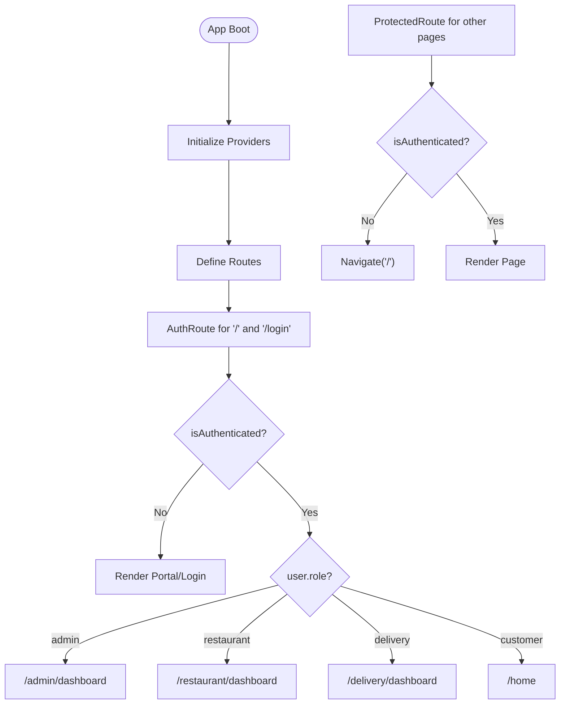

**Diagram sources**
- [App.tsx:55-71](file://src/App.tsx#L55-L71)
- [App.tsx:73-122](file://src/App.tsx#L73-L122)

**Section sources**
- [App.tsx:55-71](file://src/App.tsx#L55-L71)
- [App.tsx:73-122](file://src/App.tsx#L73-L122)
- [Index.tsx:1-6](file://src/pages/Index.tsx#L1-L6)

### Responsive Design Considerations
- Mobile-first patterns:
  - BottomNav on bottom of viewport for primary navigation on small screens.
  - Animated transitions and gestures for smooth interactions.
- Desktop-like experiences:
  - Sidebar-based navigation in role layouts for larger screens.
  - Responsive grids for lists and analytics charts.

**Section sources**
- [HomePage.tsx:267](file://src/pages/HomePage.tsx#L267)
- [SearchPage.tsx:258](file://src/pages/SearchPage.tsx#L258)
- [RestaurantPage.tsx:247](file://src/pages/RestaurantPage.tsx#L247)
- [CartPage.tsx:360](file://src/pages/CartPage.tsx#L360)
- [OrdersPage.tsx:289](file://src/pages/OrdersPage.tsx#L289)
- [ProfilePage.tsx:115](file://src/pages/ProfilePage.tsx#L115)
- [RestaurantLayout.tsx:1-25](file://src/pages/restaurant/RestaurantLayout.tsx#L1-L25)
- [DeliveryLayout.tsx:1-25](file://src/pages/delivery/DeliveryLayout.tsx#L1-L25)

## Dependency Analysis
- Provider nesting ensures that pages can consume multiple contexts simultaneously.
- Pages depend on:
  - AuthContext for authentication and role checks.
  - CartContext for shopping actions.
  - OrderContext for placing and viewing orders.
  - AddressContext for delivery locations.
  - FavoritesContext for saving favorite dishes.
  - LanguageContext for translations and formatting.
  - LocationContext for geolocation and detection.
  - ReviewContext for restaurant reviews.
  - RestaurantContext for menu and metadata.
  - CravingsContext for customer cravings and chef offers.
  - NotificationContext for system notifications.

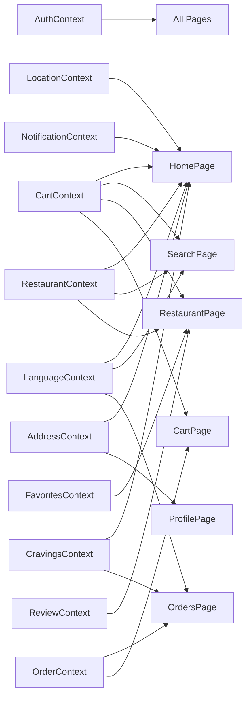

**Diagram sources**
- [App.tsx:124-162](file://src/App.tsx#L124-L162)
- [HomePage.tsx:34-39](file://src/pages/HomePage.tsx#L34-L39)
- [SearchPage.tsx:17-19](file://src/pages/SearchPage.tsx#L17-L19)
- [RestaurantPage.tsx:16-20](file://src/pages/RestaurantPage.tsx#L16-L20)
- [CartPage.tsx:41-43](file://src/pages/CartPage.tsx#L41-L43)
- [OrdersPage.tsx:23-26](file://src/pages/OrdersPage.tsx#L23-L26)
- [ProfilePage.tsx:12-14](file://src/pages/ProfilePage.tsx#L12-L14)

**Section sources**
- [App.tsx:124-162](file://src/App.tsx#L124-L162)

## Performance Considerations
- Prefer context-based state to avoid prop drilling and reduce re-renders.
- Use React Query for caching and background refetching where applicable.
- Keep local state minimal; delegate long-lived state to providers.
- Use animations judiciously; leverage layout animations only where necessary.
- Persist critical state to localStorage for continuity across sessions (e.g., delivery orders).

## Troubleshooting Guide
- Authentication redirection loops:
  - Verify AuthRoute logic and ensure user.role is correctly populated after login.
- Protected route failures:
  - Confirm ProtectedRoute wraps pages and that AuthContext.isAuthenticated is accurate.
- Cart/order state inconsistencies:
  - Ensure CartProvider and OrderProvider are initialized in the provider stack.
- Local storage persistence:
  - Delivery dashboards rely on localStorage; verify browser support and permissions.

**Section sources**
- [App.tsx:55-71](file://src/App.tsx#L55-L71)
- [App.tsx:73-122](file://src/App.tsx#L73-L122)
- [NearbyOrders.tsx:9-17](file://src/pages/delivery/NearbyOrders.tsx#L9-L17)
- [ActiveDelivery.tsx:17-42](file://src/pages/delivery/ActiveDelivery.tsx#L17-L42)

## Conclusion
TIPPAY’s page component architecture cleanly separates concerns by role, leveraging React Router for routing and nested layouts, and React Query plus context providers for state and data. Customer, restaurant owner, delivery agent, and administrator experiences are composed consistently, with shared patterns for navigation, state management, and responsiveness. The documented structure enables maintainable enhancements and role-specific feature additions.