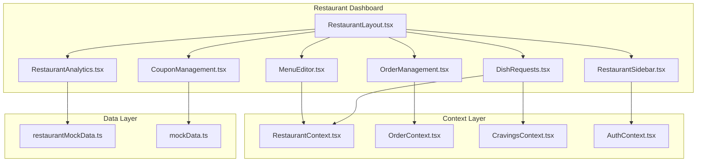
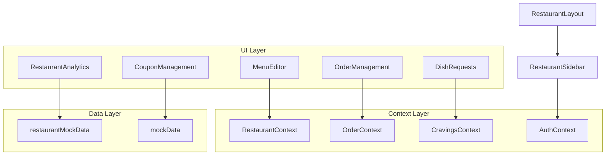
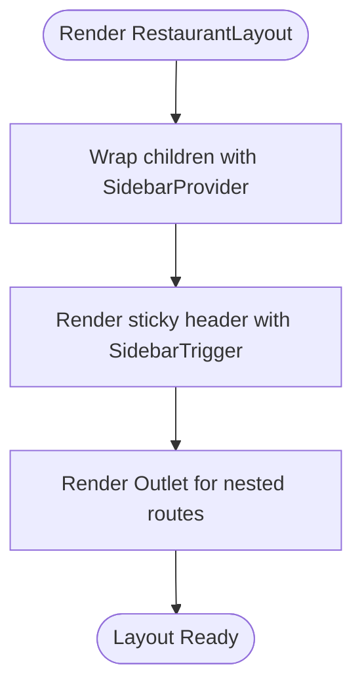
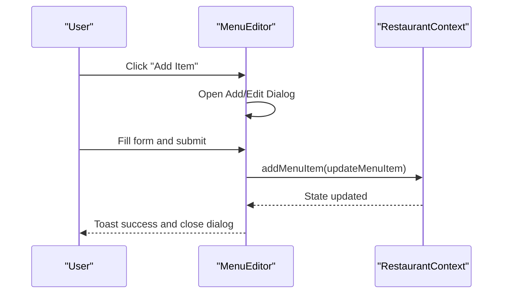
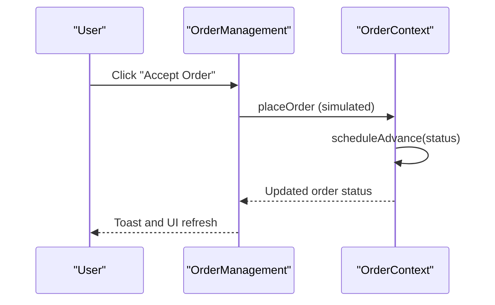
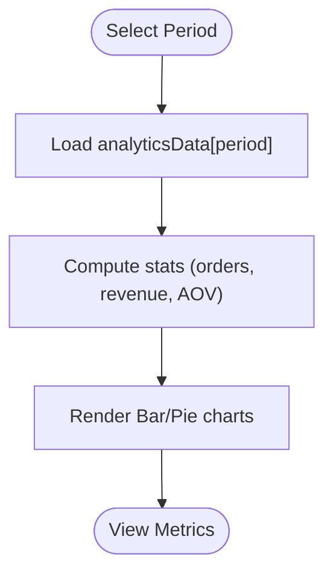
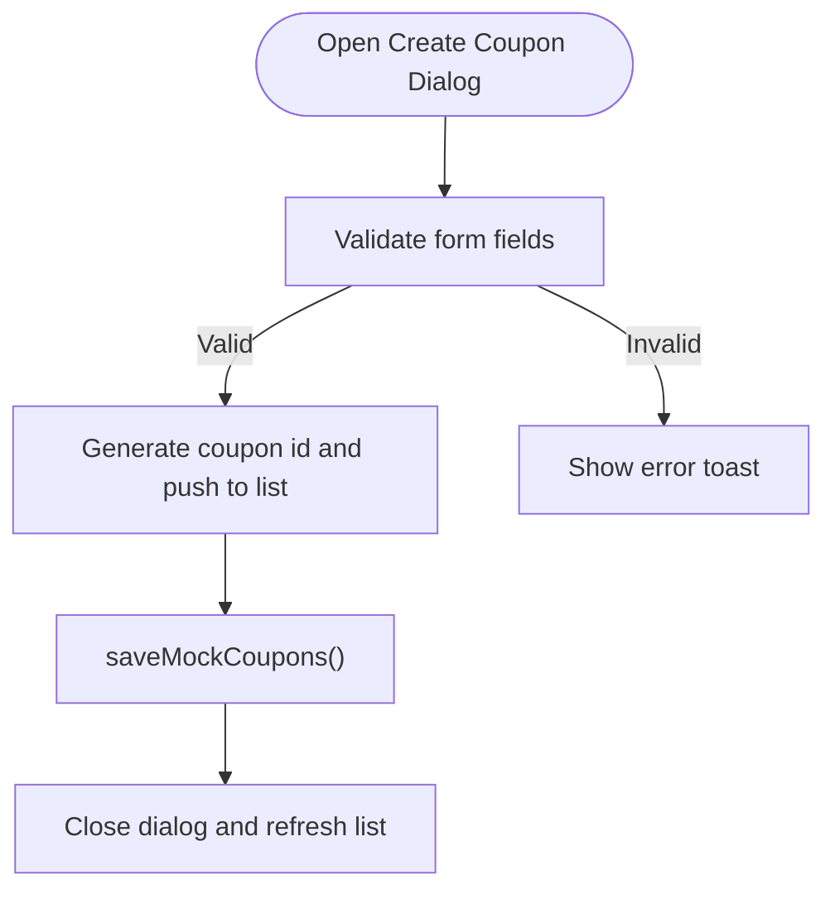
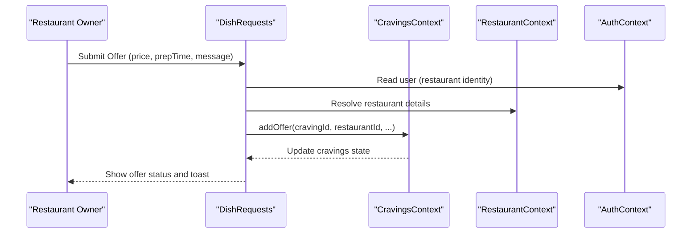
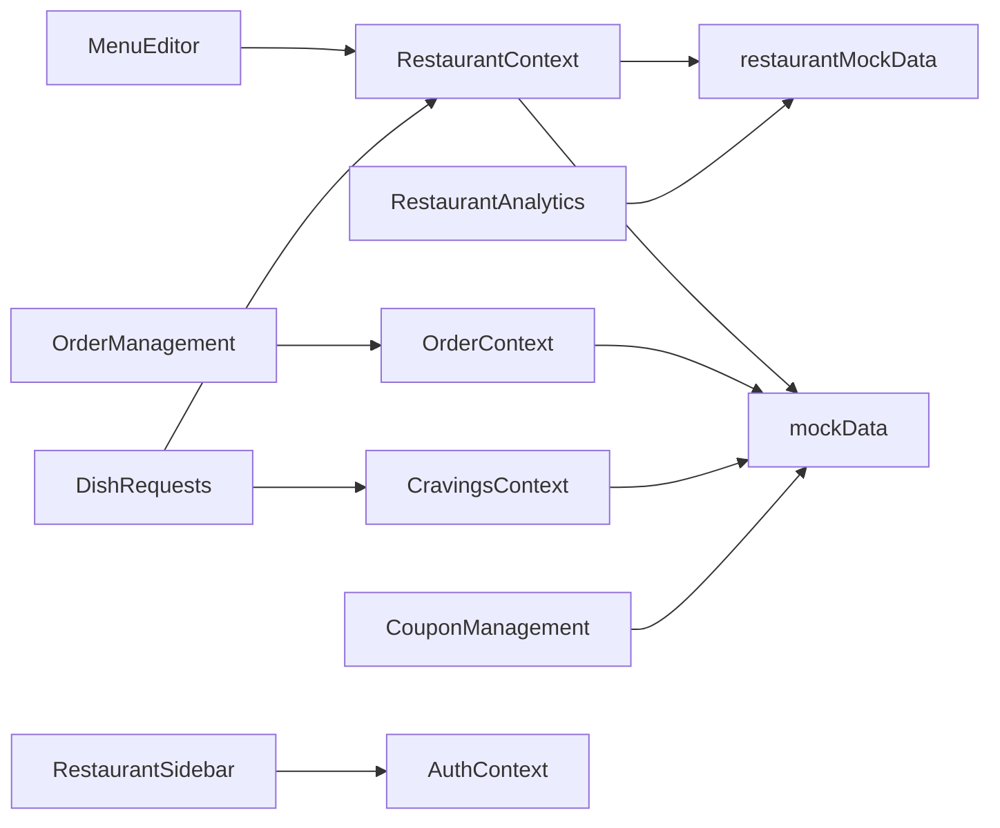

# Restaurant Owner Pages

<cite>
**Referenced Files in This Document**
- [RestaurantLayout.tsx](file://src/pages/restaurant/RestaurantLayout.tsx)
- [RestaurantSidebar.tsx](file://src/components/RestaurantSidebar.tsx)
- [MenuEditor.tsx](file://src/pages/restaurant/MenuEditor.tsx)
- [OrderManagement.tsx](file://src/pages/restaurant/OrderManagement.tsx)
- [RestaurantAnalytics.tsx](file://src/pages/restaurant/RestaurantAnalytics.tsx)
- [CouponManagement.tsx](file://src/pages/restaurant/CouponManagement.tsx)
- [DishRequests.tsx](file://src/pages/restaurant/DishRequests.tsx)
- [RestaurantContext.tsx](file://src/context/RestaurantContext.tsx)
- [OrderContext.tsx](file://src/context/OrderContext.tsx)
- [CravingsContext.tsx](file://src/context/CravingsContext.tsx)
- [AuthContext.tsx](file://src/context/AuthContext.tsx)
- [restaurantMockData.ts](file://src/data/restaurantMockData.ts)
- [mockData.ts](file://src/data/mockData.ts)
</cite>

## Table of Contents
1. [Introduction](#introduction)
2. [Project Structure](#project-structure)
3. [Core Components](#core-components)
4. [Architecture Overview](#architecture-overview)
5. [Detailed Component Analysis](#detailed-component-analysis)
6. [Dependency Analysis](#dependency-analysis)
7. [Performance Considerations](#performance-considerations)
8. [Troubleshooting Guide](#troubleshooting-guide)
9. [Conclusion](#conclusion)

## Introduction
This document explains the restaurant owner dashboard pages in TIPPAY. It covers the restaurant layout component for consistent navigation and branding, the menu editor for dish creation and inventory management, the order management system with real-time order processing and status updates, the analytics dashboard with performance metrics and sales reports, coupon management for promotional campaigns, and dish requests handling for customer feedback. It also documents restaurant-specific state management, integration with RestaurantContext and OrderContext, data visualization patterns, and administrative workflows, including role-based access control, data filtering, and reporting functionality.

## Project Structure
The restaurant owner pages are organized under the restaurant namespace and share a common layout and sidebar. Each page encapsulates a specific functional domain and integrates with shared contexts for state and data.

**Diagram sources**
- [RestaurantLayout.tsx:1-25](file://src/pages/restaurant/RestaurantLayout.tsx#L1-L25)
- [RestaurantSidebar.tsx:1-93](file://src/components/RestaurantSidebar.tsx#L1-L93)
- [MenuEditor.tsx:1-218](file://src/pages/restaurant/MenuEditor.tsx#L1-L218)
- [OrderManagement.tsx:1-175](file://src/pages/restaurant/OrderManagement.tsx#L1-L175)
- [RestaurantAnalytics.tsx:1-163](file://src/pages/restaurant/RestaurantAnalytics.tsx#L1-L163)
- [CouponManagement.tsx:1-187](file://src/pages/restaurant/CouponManagement.tsx#L1-L187)
- [DishRequests.tsx:1-221](file://src/pages/restaurant/DishRequests.tsx#L1-L221)
- [RestaurantContext.tsx:1-162](file://src/context/RestaurantContext.tsx#L1-L162)
- [OrderContext.tsx:1-138](file://src/context/OrderContext.tsx#L1-L138)
- [CravingsContext.tsx:1-194](file://src/context/CravingsContext.tsx#L1-L194)
- [AuthContext.tsx:1-130](file://src/context/AuthContext.tsx#L1-L130)
- [restaurantMockData.ts:1-215](file://src/data/restaurantMockData.ts#L1-L215)
- [mockData.ts:1-326](file://src/data/mockData.ts#L1-L326)

**Section sources**
- [RestaurantLayout.tsx:1-25](file://src/pages/restaurant/RestaurantLayout.tsx#L1-L25)
- [RestaurantSidebar.tsx:1-93](file://src/components/RestaurantSidebar.tsx#L1-L93)

## Core Components
- RestaurantLayout: Provides a responsive sidebar-enabled layout with a sticky header and outlet rendering for child routes.
- RestaurantSidebar: Implements the left navigation with icons, labels, and a logout action, integrating with the notification center.
- RestaurantContext: Centralizes restaurant and menu state, persistence, and derived restaurant data.
- OrderContext: Manages live order lifecycle, scheduling, and status transitions for real-time order processing.
- CravingsContext: Handles customer dish cravings and restaurant offers, enabling custom dish fulfillment workflows.

**Section sources**
- [RestaurantLayout.tsx:1-25](file://src/pages/restaurant/RestaurantLayout.tsx#L1-L25)
- [RestaurantSidebar.tsx:1-93](file://src/components/RestaurantSidebar.tsx#L1-L93)
- [RestaurantContext.tsx:1-162](file://src/context/RestaurantContext.tsx#L1-L162)
- [OrderContext.tsx:1-138](file://src/context/OrderContext.tsx#L1-L138)
- [CravingsContext.tsx:1-194](file://src/context/CravingsContext.tsx#L1-L194)

## Architecture Overview
The restaurant owner dashboard follows a layered architecture:
- UI Layer: Page components render domain-specific views and forms.
- Context Layer: Shared React contexts manage cross-cutting concerns (restaurants, orders, cravings, auth).
- Data Layer: Mock datasets provide structured data for menus, orders, coupons, and analytics.

**Diagram sources**
- [MenuEditor.tsx:1-218](file://src/pages/restaurant/MenuEditor.tsx#L1-L218)
- [OrderManagement.tsx:1-175](file://src/pages/restaurant/OrderManagement.tsx#L1-L175)
- [RestaurantAnalytics.tsx:1-163](file://src/pages/restaurant/RestaurantAnalytics.tsx#L1-L163)
- [CouponManagement.tsx:1-187](file://src/pages/restaurant/CouponManagement.tsx#L1-L187)
- [DishRequests.tsx:1-221](file://src/pages/restaurant/DishRequests.tsx#L1-L221)
- [RestaurantContext.tsx:1-162](file://src/context/RestaurantContext.tsx#L1-L162)
- [OrderContext.tsx:1-138](file://src/context/OrderContext.tsx#L1-L138)
- [CravingsContext.tsx:1-194](file://src/context/CravingsContext.tsx#L1-L194)
- [AuthContext.tsx:1-130](file://src/context/AuthContext.tsx#L1-L130)
- [restaurantMockData.ts:1-215](file://src/data/restaurantMockData.ts#L1-L215)
- [mockData.ts:1-326](file://src/data/mockData.ts#L1-L326)

## Detailed Component Analysis

### Restaurant Layout Component
- Purpose: Establishes a consistent layout with a collapsible sidebar, sticky header, and outlet for nested routes.
- Navigation: Integrates RestaurantSidebar and exposes a SidebarTrigger for toggling.
- Responsiveness: Uses Tailwind classes for responsive spacing and background styling.

**Diagram sources**
- [RestaurantLayout.tsx:5-22](file://src/pages/restaurant/RestaurantLayout.tsx#L5-L22)

**Section sources**
- [RestaurantLayout.tsx:1-25](file://src/pages/restaurant/RestaurantLayout.tsx#L1-L25)

### Menu Editor
- Functionality:
  - CRUD operations for menu items: add, edit, delete, and availability toggle.
  - Categorization and filtering of menu items.
  - Rich form with validation and image placeholders.
- State Management:
  - Uses RestaurantContext for menuItems and mutation actions.
  - Local state for editing dialog and form data.
- UI Patterns:
  - Animated list transitions using Framer Motion.
  - Conditional rendering for vegetarian badges and pricing display.

**Diagram sources**
- [MenuEditor.tsx:30-79](file://src/pages/restaurant/MenuEditor.tsx#L30-L79)
- [RestaurantContext.tsx:86-94](file://src/context/RestaurantContext.tsx#L86-L94)

**Section sources**
- [MenuEditor.tsx:1-218](file://src/pages/restaurant/MenuEditor.tsx#L1-L218)
- [RestaurantContext.tsx:21-32](file://src/context/RestaurantContext.tsx#L21-L32)

### Order Management System
- Real-time Order Processing:
  - Simulated status progression with scheduled advances and agent assignment.
  - Manual advancement via action buttons mapped to status flow.
- Filtering and Tabs:
  - New/Active/Completed tabs filter orders by status.
- UI Elements:
  - Status chips with icons and color coding.
  - Customer info and itemized totals per order card.

**Diagram sources**
- [OrderManagement.tsx:26-54](file://src/pages/restaurant/OrderManagement.tsx#L26-L54)
- [OrderContext.tsx:41-120](file://src/context/OrderContext.tsx#L41-L120)

**Section sources**
- [OrderManagement.tsx:1-175](file://src/pages/restaurant/OrderManagement.tsx#L1-L175)
- [OrderContext.tsx:1-138](file://src/context/OrderContext.tsx#L1-L138)

### Analytics Dashboard
- Metrics:
  - Total orders, revenue, average order value, and top item.
- Visualizations:
  - Bar chart for order trends by period (daily/weekly/monthly/yearly).
  - Pie chart for popular items with tooltips and color coding.
- Controls:
  - Period selector toggles data across timeframes.

**Diagram sources**
- [RestaurantAnalytics.tsx:24-74](file://src/pages/restaurant/RestaurantAnalytics.tsx#L24-L74)
- [restaurantMockData.ts:125-214](file://src/data/restaurantMockData.ts#L125-L214)

**Section sources**
- [RestaurantAnalytics.tsx:1-163](file://src/pages/restaurant/RestaurantAnalytics.tsx#L1-L163)
- [restaurantMockData.ts:125-214](file://src/data/restaurantMockData.ts#L125-L214)

### Coupon Management
- Features:
  - Create coupons with type (percentage/fixed), discount value, minimum order, validity date, and activation toggle.
  - Copy coupon codes to clipboard.
  - Delete coupons.
- Persistence:
  - Uses mock data storage with saveMockCoupons for updates.

**Diagram sources**
- [CouponManagement.tsx:25-51](file://src/pages/restaurant/CouponManagement.tsx#L25-L51)
- [mockData.ts:304-326](file://src/data/mockData.ts#L304-L326)

**Section sources**
- [CouponManagement.tsx:1-187](file://src/pages/restaurant/CouponManagement.tsx#L1-L187)
- [mockData.ts:304-326](file://src/data/mockData.ts#L304-L326)

### Dish Requests Handling
- Workflow:
  - Restaurant owners view active cravings and submit offers with price, prep time, and chef message.
  - Offers are stored per craving; acceptance adds a custom item to the cart and updates statuses.
- Integration:
  - Uses CravingsContext for CRUD operations on cravings and offers.
  - Uses RestaurantContext to resolve restaurant identity.
  - Uses AuthContext to derive the current restaurant user.

**Diagram sources**
- [DishRequests.tsx:12-44](file://src/pages/restaurant/DishRequests.tsx#L12-L44)
- [CravingsContext.tsx:100-128](file://src/context/CravingsContext.tsx#L100-L128)
- [RestaurantContext.tsx:18-21](file://src/context/RestaurantContext.tsx#L18-L21)
- [AuthContext.tsx:1-130](file://src/context/AuthContext.tsx#L1-L130)

**Section sources**
- [DishRequests.tsx:1-221](file://src/pages/restaurant/DishRequests.tsx#L1-L221)
- [CravingsContext.tsx:1-194](file://src/context/CravingsContext.tsx#L1-L194)
- [RestaurantContext.tsx:18-21](file://src/context/RestaurantContext.tsx#L18-L21)
- [AuthContext.tsx:1-130](file://src/context/AuthContext.tsx#L1-L130)

## Dependency Analysis
- RestaurantContext
  - Exposes menuItems and restaurant lists, with persistence to localStorage.
  - Derives Restaurant model from AdminRestaurant and menuItems.
- OrderContext
  - Manages LiveOrder lifecycle with scheduled status advances and cancellation.
- CravingsContext
  - Coordinates customer cravings and restaurant offers, including cart integration.
- Data Dependencies
  - restaurantMockData provides menu items, orders, and analytics datasets.
  - mockData provides coupon definitions and categories.

**Diagram sources**
- [RestaurantContext.tsx:1-162](file://src/context/RestaurantContext.tsx#L1-L162)
- [OrderContext.tsx:1-138](file://src/context/OrderContext.tsx#L1-L138)
- [CravingsContext.tsx:1-194](file://src/context/CravingsContext.tsx#L1-L194)
- [restaurantMockData.ts:1-215](file://src/data/restaurantMockData.ts#L1-L215)
- [mockData.ts:1-326](file://src/data/mockData.ts#L1-L326)

**Section sources**
- [RestaurantContext.tsx:1-162](file://src/context/RestaurantContext.tsx#L1-L162)
- [OrderContext.tsx:1-138](file://src/context/OrderContext.tsx#L1-L138)
- [CravingsContext.tsx:1-194](file://src/context/CravingsContext.tsx#L1-L194)
- [restaurantMockData.ts:1-215](file://src/data/restaurantMockData.ts#L1-L215)
- [mockData.ts:1-326](file://src/data/mockData.ts#L1-L326)

## Performance Considerations
- Rendering Optimizations
  - Use of Framer Motion animations should be scoped to avoid unnecessary re-renders; keep animation keys stable and minimal.
  - Memoize derived data (e.g., categorized menu items) to prevent recomputation on every render.
- State Updates
  - Batch updates to localStorage in RestaurantContext reduce write frequency.
  - Prefer immutable updates to arrays and objects to maintain referential stability.
- Data Fetching
  - Mock data is preloaded; in production, consider lazy-loading and caching strategies for larger datasets.
- Visualizations
  - Recharts components are efficient but can be optimized by limiting data points and disabling tooltips on low-end devices.

## Troubleshooting Guide
- Menu Editor Issues
  - Validation errors: Ensure required fields (name, category, price) are filled before saving.
  - Image placeholders: If no image URL is provided, a default icon is shown.
- Order Management Problems
  - Status not advancing: Verify the current status matches the expected next step in the flow.
  - Agent assignment: Occurs automatically on "Picked Up" if none exists.
- Analytics Gaps
  - Missing data: Ensure the selected period has entries in analyticsData.
- Coupon Management
  - Saving failures: Confirm discount value is positive and validity date is set.
  - Clipboard copy: Requires browser permission for clipboard access.
- Dish Requests
  - Offer duplication: Prevents resubmission when an offer already exists for the same craving.
  - Cart integration: Accepting an offer adds a custom menu item to the cart.

**Section sources**
- [MenuEditor.tsx:50-69](file://src/pages/restaurant/MenuEditor.tsx#L50-L69)
- [OrderManagement.tsx:32-44](file://src/pages/restaurant/OrderManagement.tsx#L32-L44)
- [RestaurantAnalytics.tsx:24-28](file://src/pages/restaurant/RestaurantAnalytics.tsx#L24-L28)
- [CouponManagement.tsx:35-51](file://src/pages/restaurant/CouponManagement.tsx#L35-L51)
- [DishRequests.tsx:30-44](file://src/pages/restaurant/DishRequests.tsx#L30-L44)

## Conclusion
The restaurant owner dashboard integrates a cohesive layout, robust state management, and domain-specific pages to streamline menu management, order processing, analytics, promotions, and customer feedback. RestaurantContext and OrderContext centralize restaurant and order lifecycles, while CravingsContext enables dynamic custom dish workflows. The design emphasizes usability, real-time updates, and clear data visualization to support informed decision-making.