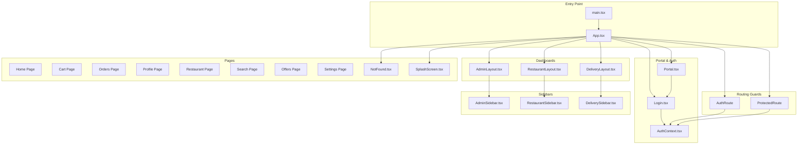
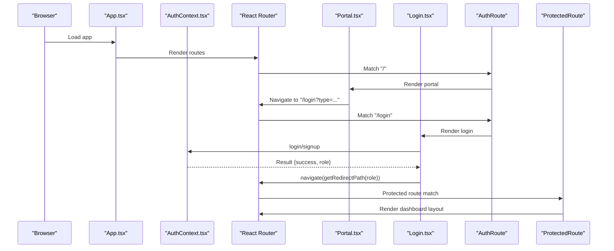
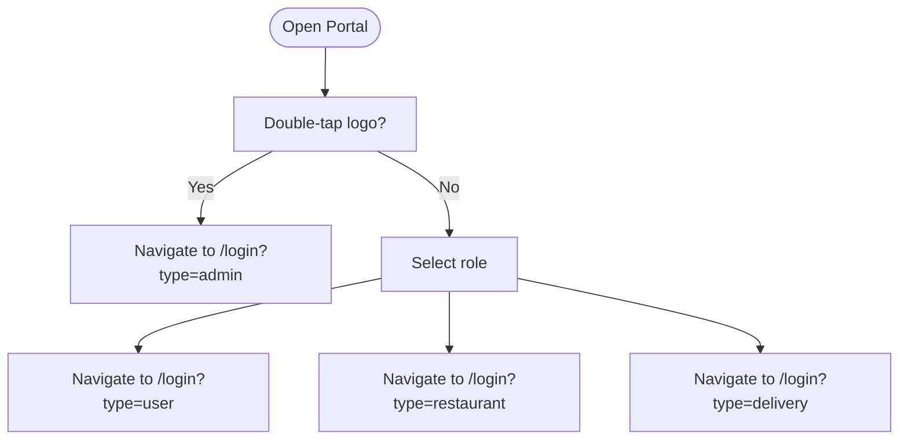
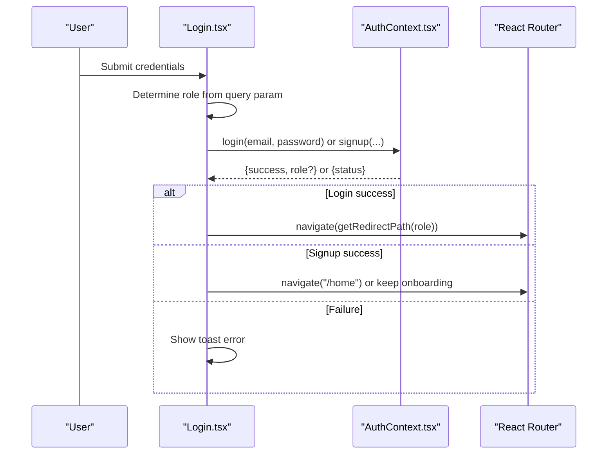
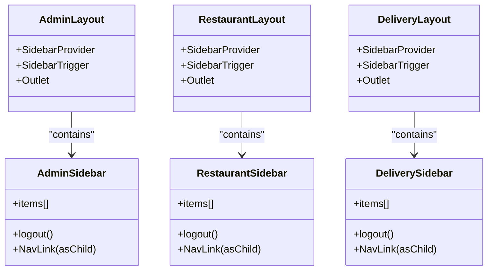
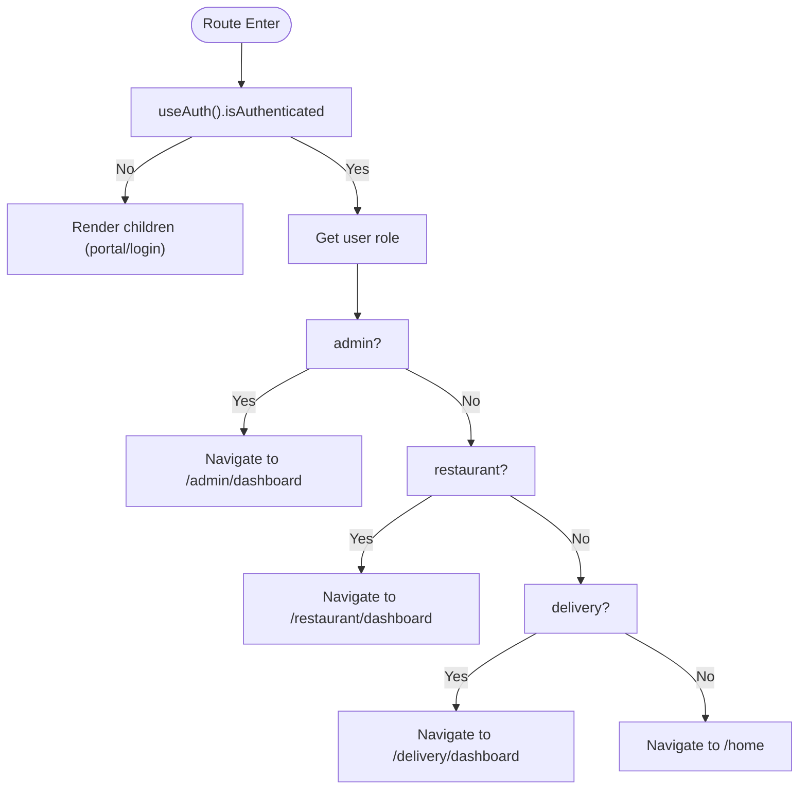
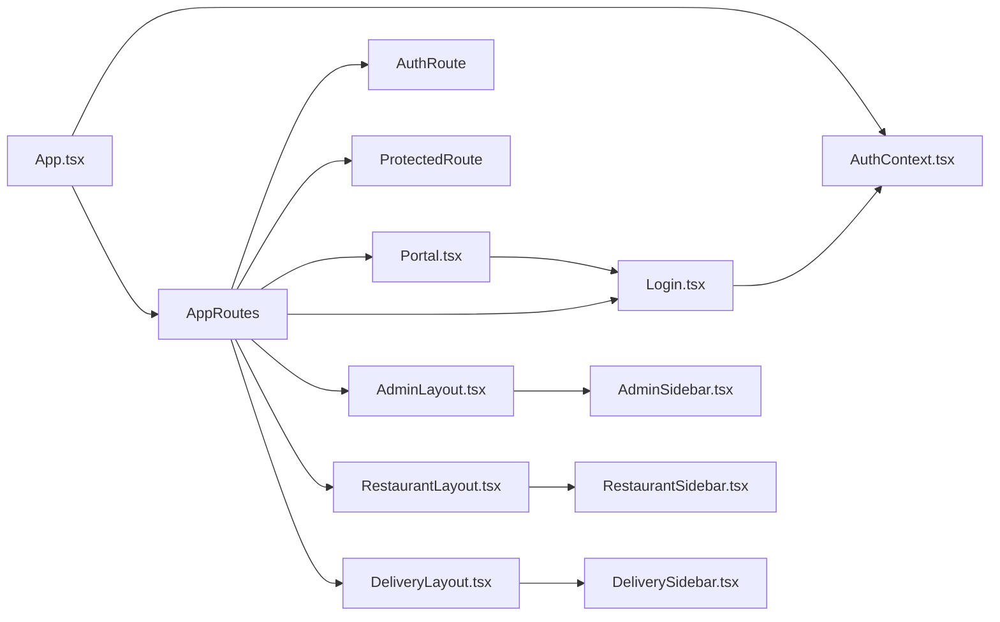

# Shared Layout Components

<cite>
**Referenced Files in This Document**
- [App.tsx](file://src/App.tsx)
- [main.tsx](file://src/main.tsx)
- [Portal.tsx](file://src/pages/Portal.tsx)
- [Index.tsx](file://src/pages/Index.tsx)
- [Login.tsx](file://src/pages/Login.tsx)
- [NotFound.tsx](file://src/pages/NotFound.tsx)
- [SplashScreen.tsx](file://src/pages/SplashScreen.tsx)
- [AdminLayout.tsx](file://src/pages/admin/AdminLayout.tsx)
- [AdminSidebar.tsx](file://src/components/AdminSidebar.tsx)
- [DeliveryLayout.tsx](file://src/pages/delivery/DeliveryLayout.tsx)
- [DeliverySidebar.tsx](file://src/components/DeliverySidebar.tsx)
- [RestaurantLayout.tsx](file://src/pages/restaurant/RestaurantLayout.tsx)
- [RestaurantSidebar.tsx](file://src/components/RestaurantSidebar.tsx)
- [AuthContext.tsx](file://src/context/AuthContext.tsx)
- [NavLink.tsx](file://src/components/NavLink.tsx)
</cite>

## Table of Contents
1. [Introduction](#introduction)
2. [Project Structure](#project-structure)
3. [Core Components](#core-components)
4. [Architecture Overview](#architecture-overview)
5. [Detailed Component Analysis](#detailed-component-analysis)
6. [Dependency Analysis](#dependency-analysis)
7. [Performance Considerations](#performance-considerations)
8. [Troubleshooting Guide](#troubleshooting-guide)
9. [Conclusion](#conclusion)

## Introduction
This document explains the shared layout components and portal pages in TIPPAY, focusing on:
- Role selection and initial navigation via the portal page
- Default routing and landing behavior
- Authentication flow and role-based redirection
- Error handling with a dedicated 404 page
- Splash screen for loading states
- Role-specific sidebars for consistent navigation
It also covers layout composition patterns, responsive design implementation, authentication guards, and role-based navigation logic, with examples of layout switching, conditional rendering, and user experience optimization across screen sizes.

## Project Structure
The application is organized around role-based dashboards and shared UI components:
- Pages: portal, login, home, cart, orders, profile, restaurants, settings, and 404
- Layouts: admin, restaurant, and delivery dashboards
- Shared UI: sidebar components per role, NavLink wrapper, and global providers
- Context: authentication and user state management
- Entry point: App routes and providers, main.tsx theme initialization

**Diagram sources**
- [main.tsx:1-11](file://src/main.tsx#L1-L11)
- [App.tsx:126-167](file://src/App.tsx#L126-L167)
- [App.tsx:56-72](file://src/App.tsx#L56-L72)
- [AdminLayout.tsx:1-23](file://src/pages/admin/AdminLayout.tsx#L1-L23)
- [RestaurantLayout.tsx:1-25](file://src/pages/restaurant/RestaurantLayout.tsx#L1-L25)
- [DeliveryLayout.tsx:1-25](file://src/pages/delivery/DeliveryLayout.tsx#L1-L25)
- [AdminSidebar.tsx:1-86](file://src/components/AdminSidebar.tsx#L1-L86)
- [RestaurantSidebar.tsx:1-93](file://src/components/RestaurantSidebar.tsx#L1-L93)
- [DeliverySidebar.tsx:1-90](file://src/components/DeliverySidebar.tsx#L1-L90)
- [Portal.tsx:1-97](file://src/pages/Portal.tsx#L1-L97)
- [Login.tsx:1-226](file://src/pages/Login.tsx#L1-L226)
- [AuthContext.tsx:1-130](file://src/context/AuthContext.tsx#L1-L130)
- [NotFound.tsx:1-25](file://src/pages/NotFound.tsx#L1-L25)
- [SplashScreen.tsx:1-66](file://src/pages/SplashScreen.tsx#L1-L66)

**Section sources**
- [main.tsx:1-11](file://src/main.tsx#L1-L11)
- [App.tsx:126-167](file://src/App.tsx#L126-L167)

## Core Components
- Portal page: Role selection with animated entries and double-tap admin shortcut
- Login page: Unified authentication with role-aware forms and redirects
- Dashboards: Admin, Restaurant, and Delivery layouts with shared sidebar components
- Sidebars: Role-specific navigation menus with responsive collapsing behavior
- Routing guards: AuthRoute and ProtectedRoute enforce access policies
- 404 page: Centralized error handling with logging
- Splash screen: Animated onboarding-like loading state

**Section sources**
- [Portal.tsx:1-97](file://src/pages/Portal.tsx#L1-L97)
- [Login.tsx:1-226](file://src/pages/Login.tsx#L1-L226)
- [AdminLayout.tsx:1-23](file://src/pages/admin/AdminLayout.tsx#L1-L23)
- [RestaurantLayout.tsx:1-25](file://src/pages/restaurant/RestaurantLayout.tsx#L1-L25)
- [DeliveryLayout.tsx:1-25](file://src/pages/delivery/DeliveryLayout.tsx#L1-L25)
- [AdminSidebar.tsx:1-86](file://src/components/AdminSidebar.tsx#L1-L86)
- [RestaurantSidebar.tsx:1-93](file://src/components/RestaurantSidebar.tsx#L1-L93)
- [DeliverySidebar.tsx:1-90](file://src/components/DeliverySidebar.tsx#L1-L90)
- [App.tsx:56-72](file://src/App.tsx#L56-L72)
- [NotFound.tsx:1-25](file://src/pages/NotFound.tsx#L1-L25)
- [SplashScreen.tsx:1-66](file://src/pages/SplashScreen.tsx#L1-L66)

## Architecture Overview
The app composes role-specific dashboards using shared layout components. Providers wrap the app to supply global contexts. Routing guards protect authenticated routes and redirect based on user roles. The portal page is the entry point for unauthenticated users, who then choose a role and authenticate.

**Diagram sources**
- [App.tsx:74-124](file://src/App.tsx#L74-L124)
- [Portal.tsx:11-23](file://src/pages/Portal.tsx#L11-L23)
- [Login.tsx:37-44](file://src/pages/Login.tsx#L37-L44)
- [AuthContext.tsx:58-82](file://src/context/AuthContext.tsx#L58-L82)

## Detailed Component Analysis

### Portal Page (Role Selection)
- Purpose: Present role choices and initiate authentication flow
- Behavior:
  - Double-tap the logo triggers admin login
  - Buttons navigate to login with role type query param
  - Uses animations for entrance and hover effects
- UX:
  - Clear role cards with icons and descriptions
  - Responsive layout with centered content and max widths

**Diagram sources**
- [Portal.tsx:11-23](file://src/pages/Portal.tsx#L11-L23)
- [Portal.tsx:44-90](file://src/pages/Portal.tsx#L44-L90)

**Section sources**
- [Portal.tsx:1-97](file://src/pages/Portal.tsx#L1-L97)

### Login Page (Authentication Flow and Role-Based Redirection)
- Purpose: Unified authentication with role-aware logic
- Features:
  - Theme selection based on role type
  - Conditional form fields (restaurant requires location/GSTIN)
  - Auto-append domain suffixes for non-customer roles
  - Redirects to role-specific dashboards or home
- Validation:
  - Admin self-signup disabled
  - Restaurant/Delivery emails validated for domain suffix
  - Toast notifications for errors and info

**Diagram sources**
- [Login.tsx:46-112](file://src/pages/Login.tsx#L46-L112)
- [AuthContext.tsx:58-100](file://src/context/AuthContext.tsx#L58-L100)
- [Login.tsx:37-44](file://src/pages/Login.tsx#L37-L44)

**Section sources**
- [Login.tsx:1-226](file://src/pages/Login.tsx#L1-L226)
- [AuthContext.tsx:18-27](file://src/context/AuthContext.tsx#L18-L27)

### Dashboards and Sidebars (Layout Composition Patterns)
- Layouts:
  - AdminLayout, RestaurantLayout, DeliveryLayout share a common pattern:
    - SidebarProvider
    - SidebarTrigger in header
    - Outlet for nested routes
- Sidebars:
  - AdminSidebar, RestaurantSidebar, DeliverySidebar provide role-specific navigation
  - Collapsible behavior via useSidebar state
  - Logout action navigates to root and clears session

**Diagram sources**
- [AdminLayout.tsx:1-23](file://src/pages/admin/AdminLayout.tsx#L1-L23)
- [RestaurantLayout.tsx:1-25](file://src/pages/restaurant/RestaurantLayout.tsx#L1-L25)
- [DeliveryLayout.tsx:1-25](file://src/pages/delivery/DeliveryLayout.tsx#L1-L25)
- [AdminSidebar.tsx:20-26](file://src/components/AdminSidebar.tsx#L20-L26)
- [RestaurantSidebar.tsx:20-26](file://src/components/RestaurantSidebar.tsx#L20-L26)
- [DeliverySidebar.tsx:20-25](file://src/components/DeliverySidebar.tsx#L20-L25)

**Section sources**
- [AdminLayout.tsx:1-23](file://src/pages/admin/AdminLayout.tsx#L1-L23)
- [RestaurantLayout.tsx:1-25](file://src/pages/restaurant/RestaurantLayout.tsx#L1-L25)
- [DeliveryLayout.tsx:1-25](file://src/pages/delivery/DeliveryLayout.tsx#L1-L25)
- [AdminSidebar.tsx:1-86](file://src/components/AdminSidebar.tsx#L1-L86)
- [RestaurantSidebar.tsx:1-93](file://src/components/RestaurantSidebar.tsx#L1-L93)
- [DeliverySidebar.tsx:1-90](file://src/components/DeliverySidebar.tsx#L1-L90)

### Routing Guards (Authentication Guards and Role-Based Navigation)
- AuthRoute:
  - If authenticated, redirects to role-specific dashboard or home
  - Otherwise renders children (portal/login)
- ProtectedRoute:
  - Redirects anonymous users to portal
  - Renders children for authenticated users
- Redirect logic:
  - Admin → /admin/dashboard
  - Restaurant → /restaurant/dashboard
  - Delivery → /delivery/dashboard
  - Customer → /home

**Diagram sources**
- [App.tsx:56-72](file://src/App.tsx#L56-L72)
- [App.tsx:56-59](file://src/App.tsx#L56-L59)
- [Login.tsx:37-44](file://src/pages/Login.tsx#L37-L44)

**Section sources**
- [App.tsx:56-72](file://src/App.tsx#L56-L72)
- [Login.tsx:37-44](file://src/pages/Login.tsx#L37-L44)

### 404 Not Found Page (Error Handling)
- Purpose: Centralized error page for unmatched routes
- Behavior:
  - Logs attempted pathname
  - Provides a friendly message and a link to home

**Section sources**
- [NotFound.tsx:1-25](file://src/pages/NotFound.tsx#L1-L25)

### Splash Screen (Loading States)
- Purpose: Onboarding-like animation during startup
- Behavior:
  - Phases: logo, text, exit
  - Timers orchestrate transitions
  - Calls onFinish to hide splash after completion

**Section sources**
- [SplashScreen.tsx:1-66](file://src/pages/SplashScreen.tsx#L1-L66)

### Responsive Design Implementation
- Layouts:
  - Sticky headers with backdrop blur
  - SidebarProvider enables collapsible sidebars
  - Tailwind utilities for padding and responsive breakpoints
- Sidebars:
  - Collapsible mode controlled by useSidebar state
  - Conditional rendering of labels based on collapsed state
- Portal/Login:
  - Centered containers with max widths and spacing
  - Motion animations for smooth entrance

**Section sources**
- [AdminLayout.tsx:10-14](file://src/pages/admin/AdminLayout.tsx#L10-L14)
- [RestaurantLayout.tsx:11-15](file://src/pages/restaurant/RestaurantLayout.tsx#L11-L15)
- [DeliveryLayout.tsx:11-15](file://src/pages/delivery/DeliveryLayout.tsx#L11-L15)
- [AdminSidebar.tsx:29-30](file://src/components/AdminSidebar.tsx#L29-L30)
- [RestaurantSidebar.tsx:29-30](file://src/components/RestaurantSidebar.tsx#L29-L30)
- [DeliverySidebar.tsx:28-29](file://src/components/DeliverySidebar.tsx#L28-L29)
- [Portal.tsx:26-41](file://src/pages/Portal.tsx#L26-L41)
- [Login.tsx:115-128](file://src/pages/Login.tsx#L115-L128)

### Conditional Rendering Examples
- Role-specific form fields:
  - Restaurant signup requires location and GSTIN
- Theme customization:
  - Dynamic title, description, and button styles based on role
- Admin self-signup disabled:
  - Conditional rendering prevents admin registration
- Sidebar labels:
  - Collapsed state hides labels for compactness

**Section sources**
- [Login.tsx:137-185](file://src/pages/Login.tsx#L137-L185)
- [Login.tsx:28-35](file://src/pages/Login.tsx#L28-L35)
- [Login.tsx:57-61](file://src/pages/Login.tsx#L57-L61)
- [AdminSidebar.tsx:49-50](file://src/components/AdminSidebar.tsx#L49-L50)
- [RestaurantSidebar.tsx:56-57](file://src/components/RestaurantSidebar.tsx#L56-L57)
- [DeliverySidebar.tsx:53-54](file://src/components/DeliverySidebar.tsx#L53-L54)

### User Experience Optimization
- Smooth transitions:
  - Framer Motion animations for portal and login
  - Animated splash screen with spring easing
- Accessibility:
  - Proper labels and focusable buttons
  - Toast notifications for feedback
- Consistency:
  - Shared NavLink component for active/pending states
  - Uniform sidebar structure across roles

**Section sources**
- [Portal.tsx:27-41](file://src/pages/Portal.tsx#L27-L41)
- [Login.tsx:116-128](file://src/pages/Login.tsx#L116-L128)
- [SplashScreen.tsx:22-61](file://src/pages/SplashScreen.tsx#L22-L61)
- [NavLink.tsx:11-24](file://src/components/NavLink.tsx#L11-L24)

## Dependency Analysis
- Providers and contexts:
  - App.tsx composes multiple providers around the router
  - AuthContext supplies authentication state and methods
- Routing:
  - AppRoutes defines all routes and nested routes
  - AuthRoute and ProtectedRoute enforce access
- Layouts depend on shared UI primitives:
  - SidebarProvider/SidebarTrigger from shared UI
  - NavLink wrapper for active state styling

**Diagram sources**
- [App.tsx:74-124](file://src/App.tsx#L74-L124)
- [AuthContext.tsx:40-123](file://src/context/AuthContext.tsx#L40-L123)
- [AdminLayout.tsx:1-23](file://src/pages/admin/AdminLayout.tsx#L1-L23)
- [RestaurantLayout.tsx:1-25](file://src/pages/restaurant/RestaurantLayout.tsx#L1-L25)
- [DeliveryLayout.tsx:1-25](file://src/pages/delivery/DeliveryLayout.tsx#L1-L25)
- [AdminSidebar.tsx:1-86](file://src/components/AdminSidebar.tsx#L1-L86)
- [RestaurantSidebar.tsx:1-93](file://src/components/RestaurantSidebar.tsx#L1-L93)
- [DeliverySidebar.tsx:1-90](file://src/components/DeliverySidebar.tsx#L1-L90)
- [Portal.tsx:1-97](file://src/pages/Portal.tsx#L1-L97)
- [Login.tsx:1-226](file://src/pages/Login.tsx#L1-L226)

**Section sources**
- [App.tsx:74-124](file://src/App.tsx#L74-L124)
- [AuthContext.tsx:40-123](file://src/context/AuthContext.tsx#L40-L123)

## Performance Considerations
- Provider nesting:
  - Minimize re-renders by keeping heavy providers higher in the tree
  - Use memoization for callbacks passed to splash and routes
- Animations:
  - Keep motion durations reasonable to avoid blocking UI
  - Prefer transform/opacity for GPU-accelerated animations
- Routing:
  - Use lazy loading for large dashboard sections if needed
  - Keep guard logic synchronous to prevent unnecessary delays

## Troubleshooting Guide
- Login fails:
  - Verify role detection and email suffix logic
  - Check user status (pending/suspended) returned by AuthContext
- Redirect loops:
  - Confirm AuthRoute redirects align with user role
  - Ensure nested dashboard indices navigate to valid child routes
- Sidebar not collapsing:
  - Ensure SidebarProvider wraps the layout
  - Verify useSidebar state is respected in sidebar components
- 404 not found:
  - Confirm wildcard route is defined last
  - Check console logs for attempted pathnames

**Section sources**
- [AuthContext.tsx:58-82](file://src/context/AuthContext.tsx#L58-L82)
- [App.tsx:113-122](file://src/App.tsx#L113-L122)
- [AdminLayout.tsx:6-19](file://src/pages/admin/AdminLayout.tsx#L6-L19)
- [RestaurantLayout.tsx:5-21](file://src/pages/restaurant/RestaurantLayout.tsx#L5-L21)
- [DeliveryLayout.tsx:5-21](file://src/pages/delivery/DeliveryLayout.tsx#L5-L21)
- [NotFound.tsx:7-9](file://src/pages/NotFound.tsx#L7-L9)

## Conclusion
TIPPAY’s shared layout components and portal pages form a cohesive, role-driven navigation system. The portal initiates role selection, the unified login handles authentication and redirects, and role-specific dashboards provide consistent navigation via shared sidebars. Routing guards enforce access policies, while the splash screen and animations enhance the user experience. The architecture supports responsive design and offers clear extension points for future enhancements.