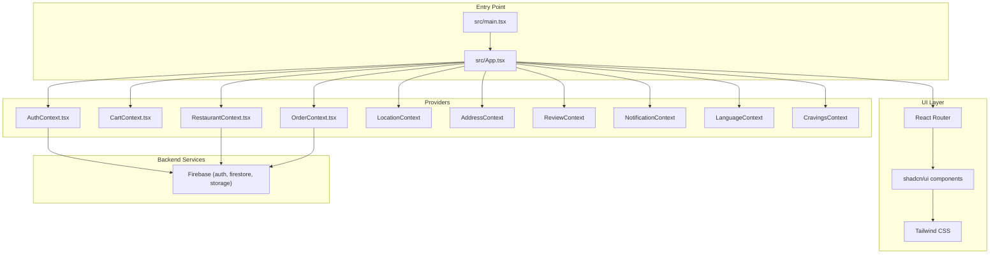
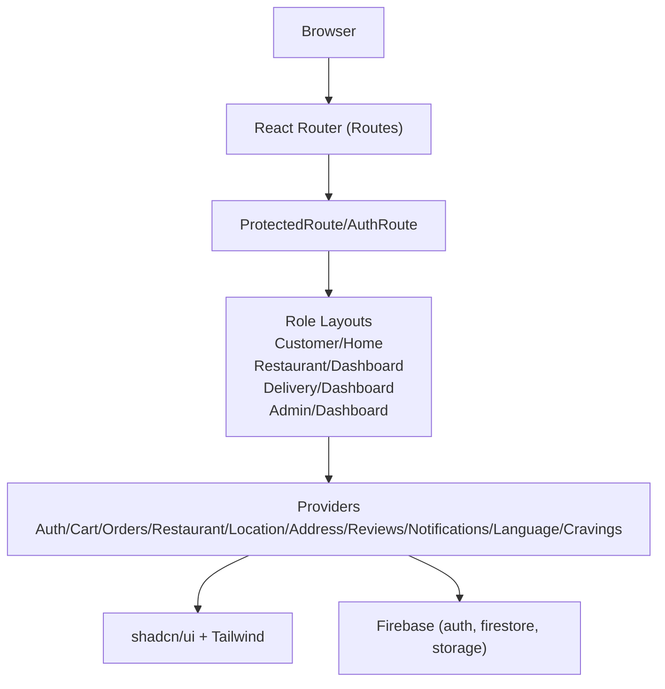
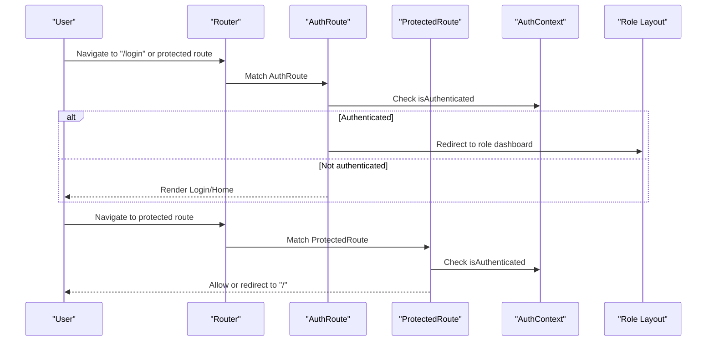
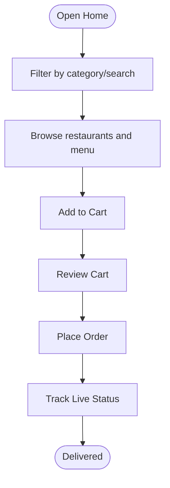
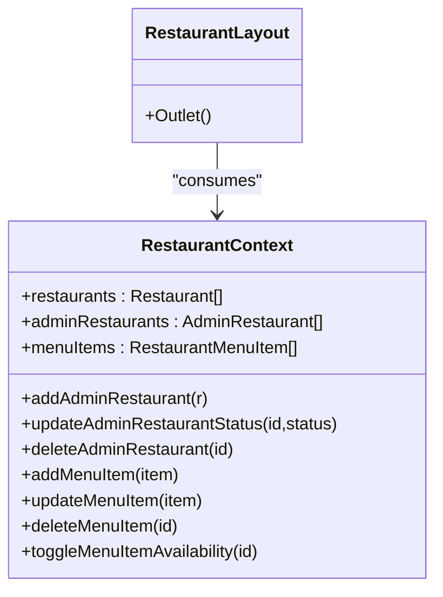
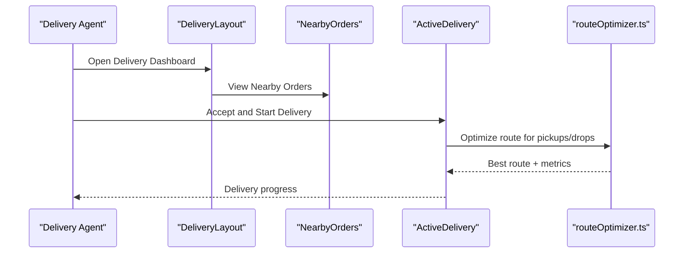
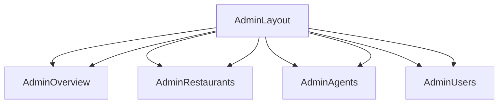
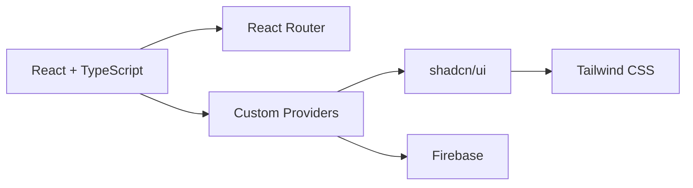

# Project Overview

<cite>
**Referenced Files in This Document**
- [README.md](file://README.md)
- [package.json](file://package.json)
- [src/main.tsx](file://src/main.tsx)
- [src/App.tsx](file://src/App.tsx)
- [src/config/firebase.ts](file://src/config/firebase.ts)
- [src/context/AuthContext.tsx](file://src/context/AuthContext.tsx)
- [src/context/OrderContext.tsx](file://src/context/OrderContext.tsx)
- [src/context/CartContext.tsx](file://src/context/CartContext.tsx)
- [src/context/RestaurantContext.tsx](file://src/context/RestaurantContext.tsx)
- [src/pages/HomePage.tsx](file://src/pages/HomePage.tsx)
- [src/pages/restaurant/RestaurantLayout.tsx](file://src/pages/restaurant/RestaurantLayout.tsx)
- [src/pages/delivery/DeliveryLayout.tsx](file://src/pages/delivery/DeliveryLayout.tsx)
- [src/pages/admin/AdminLayout.tsx](file://src/pages/admin/AdminLayout.tsx)
- [src/data/mockData.ts](file://src/data/mockData.ts)
- [src/utils/routeOptimizer.ts](file://src/utils/routeOptimizer.ts)
- [components.json](file://components.json)
- [tailwind.config.ts](file://tailwind.config.ts)
</cite>

## Table of Contents
1. [Introduction](#introduction)
2. [Project Structure](#project-structure)
3. [Core Components](#core-components)
4. [Architecture Overview](#architecture-overview)
5. [Detailed Component Analysis](#detailed-component-analysis)
6. [Dependency Analysis](#dependency-analysis)
7. [Performance Considerations](#performance-considerations)
8. [Troubleshooting Guide](#troubleshooting-guide)
9. [Conclusion](#conclusion)

## Introduction
TIPPAY is a multi-role food delivery platform designed to streamline the end-to-end food ordering experience across three primary user personas: customers, restaurants, and delivery agents—plus administrative oversight. Its core value proposition centers on a unified, role-aware interface that connects diners with nearby restaurants, enables restaurant operators to manage menus and orders efficiently, supports delivery agents with actionable order workflows, and empowers administrators to monitor and govern the ecosystem.

Key positioning highlights:
- Customer-first discovery and ordering with crave-to-order capabilities and live order tracking.
- Restaurant operator dashboards for order intake, menu management, coupon campaigns, and analytics.
- Delivery agent workflows for nearby order discovery, active deliveries, and performance insights.
- Administrative controls for restaurant onboarding, order oversight, agent management, and user administration.

The platform addresses market needs by reducing friction in discovery, order placement, and logistics coordination while offering scalable operational tools tailored to each role.

## Project Structure
The project follows a feature-centric, layered architecture with React and TypeScript, integrated with Firebase for backend services and shadcn/ui for UI primitives. Providers encapsulate cross-cutting concerns (authentication, cart, orders, locations), while modular pages and layouts define role-specific experiences.

**Diagram sources**
- [src/main.tsx:1-11](file://src/main.tsx#L1-L11)
- [src/App.tsx:124-165](file://src/App.tsx#L124-L165)
- [src/context/AuthContext.tsx:40-130](file://src/context/AuthContext.tsx#L40-L130)
- [src/context/CartContext.tsx:22-64](file://src/context/CartContext.tsx#L22-L64)
- [src/context/OrderContext.tsx:41-138](file://src/context/OrderContext.tsx#L41-L138)
- [src/context/RestaurantContext.tsx:36-162](file://src/context/RestaurantContext.tsx#L36-L162)
- [src/config/firebase.ts:1-28](file://src/config/firebase.ts#L1-L28)
- [components.json:1-21](file://components.json#L1-L21)
- [tailwind.config.ts:1-123](file://tailwind.config.ts#L1-L123)

**Section sources**
- [README.md:53-61](file://README.md#L53-L61)
- [package.json:17-69](file://package.json#L17-L69)
- [src/main.tsx:1-11](file://src/main.tsx#L1-L11)
- [src/App.tsx:124-165](file://src/App.tsx#L124-L165)

## Core Components
- Multi-role authentication and routing: Role-aware login, protected routes, and automatic redirection to role-specific dashboards.
- Customer experience: Home feed, restaurant browsing, cart management, cravings broadcast, order placement, and live tracking.
- Restaurant operator tools: Order management, menu editor, coupon management, dish requests, and analytics.
- Delivery agent workflows: Nearby orders, active delivery, stats, and profile management.
- Administrative oversight: Restaurant, order, agent, and user management dashboards.
- Backend integration: Firebase for authentication, persistence, and storage; local providers for state orchestration.

**Section sources**
- [src/context/AuthContext.tsx:3-27](file://src/context/AuthContext.tsx#L3-L27)
- [src/App.tsx:55-71](file://src/App.tsx#L55-L71)
- [src/pages/HomePage.tsx:1-409](file://src/pages/HomePage.tsx#L1-L409)
- [src/context/CartContext.tsx:10-18](file://src/context/CartContext.tsx#L10-L18)
- [src/context/OrderContext.tsx:27-33](file://src/context/OrderContext.tsx#L27-L33)
- [src/pages/restaurant/RestaurantLayout.tsx:1-25](file://src/pages/restaurant/RestaurantLayout.tsx#L1-L25)
- [src/pages/delivery/DeliveryLayout.tsx:1-25](file://src/pages/delivery/DeliveryLayout.tsx#L1-L25)
- [src/pages/admin/AdminLayout.tsx:1-23](file://src/pages/admin/AdminLayout.tsx#L1-L23)
- [src/config/firebase.ts:1-28](file://src/config/firebase.ts#L1-L28)

## Architecture Overview
TIPPAY employs a provider-based state architecture layered atop React Router. Providers encapsulate role-specific state and orchestrate cross-cutting concerns. Routing enforces authentication and role-based access, while Firebase provides identity, data, and media services. UI components leverage shadcn/ui and Tailwind for consistent, accessible design.

**Diagram sources**
- [src/App.tsx:73-122](file://src/App.tsx#L73-L122)
- [src/context/AuthContext.tsx:40-130](file://src/context/AuthContext.tsx#L40-L130)
- [src/pages/HomePage.tsx:1-409](file://src/pages/HomePage.tsx#L1-L409)
- [src/pages/restaurant/RestaurantLayout.tsx:1-25](file://src/pages/restaurant/RestaurantLayout.tsx#L1-L25)
- [src/pages/delivery/DeliveryLayout.tsx:1-25](file://src/pages/delivery/DeliveryLayout.tsx#L1-L25)
- [src/pages/admin/AdminLayout.tsx:1-23](file://src/pages/admin/AdminLayout.tsx#L1-L23)
- [src/config/firebase.ts:1-28](file://src/config/firebase.ts#L1-L28)

## Detailed Component Analysis

### Authentication and Role-Based Access
- Role model supports four user types: customer, restaurant, delivery, and admin.
- Login/signup logic determines roles via email patterns and manages user statuses (active, pending, suspended).
- Protected routes redirect authenticated users to appropriate dashboards based on role.

**Diagram sources**
- [src/App.tsx:55-71](file://src/App.tsx#L55-L71)
- [src/context/AuthContext.tsx:58-82](file://src/context/AuthContext.tsx#L58-L82)

**Section sources**
- [src/context/AuthContext.tsx:3-27](file://src/context/AuthContext.tsx#L3-L27)
- [src/context/AuthContext.tsx:40-130](file://src/context/AuthContext.tsx#L40-L130)
- [src/App.tsx:55-71](file://src/App.tsx#L55-L71)

### Customer Ordering Workflow
- Discovery and selection: Home page filters restaurants by category/search and displays menu items.
- Cart management: Add/remove/update quantities; compute totals and offers.
- Order placement: Place order and receive a generated order ID; live status updates simulate progression.
- Tracking: View order history and current active order with timeline of status changes.

**Diagram sources**
- [src/pages/HomePage.tsx:41-52](file://src/pages/HomePage.tsx#L41-L52)
- [src/context/CartContext.tsx:22-64](file://src/context/CartContext.tsx#L22-L64)
- [src/context/OrderContext.tsx:105-120](file://src/context/OrderContext.tsx#L105-L120)
- [src/context/OrderContext.tsx:66-84](file://src/context/OrderContext.tsx#L66-L84)

**Section sources**
- [src/pages/HomePage.tsx:1-409](file://src/pages/HomePage.tsx#L1-L409)
- [src/context/CartContext.tsx:10-18](file://src/context/CartContext.tsx#L10-L18)
- [src/context/OrderContext.tsx:27-33](file://src/context/OrderContext.tsx#L27-L33)

### Restaurant Management
- Dashboard structure with nested routes for orders, menu, requests, coupons, and analytics.
- Context-derived restaurant list integrates with mock data and dynamic location-awareness.
- Provider actions support adding/updating/deleting menu items and toggling availability.

**Diagram sources**
- [src/context/RestaurantContext.tsx:21-32](file://src/context/RestaurantContext.tsx#L21-L32)
- [src/pages/restaurant/RestaurantLayout.tsx:1-25](file://src/pages/restaurant/RestaurantLayout.tsx#L1-L25)

**Section sources**
- [src/pages/restaurant/RestaurantLayout.tsx:1-25](file://src/pages/restaurant/RestaurantLayout.tsx#L1-L25)
- [src/context/RestaurantContext.tsx:36-162](file://src/context/RestaurantContext.tsx#L36-L162)
- [src/data/mockData.ts:167-264](file://src/data/mockData.ts#L167-L264)

### Delivery Coordination
- Nearby orders and active delivery views enable agents to accept and track deliveries.
- Route optimization utility simulates efficient waypoint sequencing for pickups and drops.

**Diagram sources**
- [src/pages/delivery/DeliveryLayout.tsx:1-25](file://src/pages/delivery/DeliveryLayout.tsx#L1-L25)
- [src/utils/routeOptimizer.ts:53-195](file://src/utils/routeOptimizer.ts#L53-L195)

**Section sources**
- [src/pages/delivery/DeliveryLayout.tsx:1-25](file://src/pages/delivery/DeliveryLayout.tsx#L1-L25)
- [src/utils/routeOptimizer.ts:1-195](file://src/utils/routeOptimizer.ts#L1-L195)

### Administrative Oversight
- Admin dashboard provides overview, restaurant management, order monitoring, agent management, and user administration.
- Mock data and seed utilities support onboarding and testing scenarios.

**Diagram sources**
- [src/pages/admin/AdminLayout.tsx:1-23](file://src/pages/admin/AdminLayout.tsx#L1-L23)

**Section sources**
- [src/pages/admin/AdminLayout.tsx:1-23](file://src/pages/admin/AdminLayout.tsx#L1-L23)

## Dependency Analysis
Technology stack integration:
- Frontend framework: React with TypeScript for type-safe components and contexts.
- Routing: React Router for declarative navigation and role-based route guards.
- State orchestration: Custom providers for cart, orders, restaurants, locations, addresses, reviews, notifications, language, and cravings.
- UI components: shadcn/ui with Radix UI primitives, styled via Tailwind CSS.
- Backend services: Firebase for authentication, Firestore for structured data, and Storage for media.
- Styling: Tailwind CSS with custom theme tokens and animations.

**Diagram sources**
- [package.json:17-69](file://package.json#L17-L69)
- [src/config/firebase.ts:1-28](file://src/config/firebase.ts#L1-L28)
- [components.json:13-19](file://components.json#L13-L19)
- [tailwind.config.ts:15-118](file://tailwind.config.ts#L15-L118)

**Section sources**
- [README.md:53-61](file://README.md#L53-L61)
- [package.json:17-69](file://package.json#L17-L69)
- [components.json:1-21](file://components.json#L1-L21)
- [tailwind.config.ts:1-123](file://tailwind.config.ts#L1-L123)

## Performance Considerations
- Provider scope: Keep provider boundaries focused to minimize re-renders; avoid placing unrelated state under heavy providers.
- Virtualization: For long lists (e.g., restaurants and menu items), consider virtualized lists to improve scrolling performance.
- Debounced search: Apply debouncing for search queries to reduce unnecessary recomputation.
- Lazy loading: Defer non-critical UI and images to reduce initial bundle size.
- Local caching: Persist frequently accessed lists (restaurants, menu) to localStorage to reduce fetch overhead during development or offline-like modes.
- Route-level code splitting: Split dashboard routes to load only the necessary code per role.

## Troubleshooting Guide
Common issues and resolutions:
- Authentication loops: Verify AuthRoute and ProtectedRoute logic and ensure user roles are correctly inferred and persisted.
- Role redirection anomalies: Confirm role detection rules and that authenticated users are redirected to the correct dashboard.
- Order status not advancing: Check scheduled timers and status flow transitions; ensure timers are cleared on cancellation.
- Cart totals incorrect: Validate offer pricing and quantity updates; confirm recomputation on state changes.
- Restaurant list not updating: Ensure location context updates trigger restaurant recalculation and sorting.

**Section sources**
- [src/context/AuthContext.tsx:58-82](file://src/context/AuthContext.tsx#L58-L82)
- [src/context/OrderContext.tsx:45-64](file://src/context/OrderContext.tsx#L45-L64)
- [src/context/OrderContext.tsx:66-84](file://src/context/OrderContext.tsx#L66-L84)
- [src/context/CartContext.tsx:49-50](file://src/context/CartContext.tsx#L49-L50)
- [src/context/RestaurantContext.tsx:51-66](file://src/context/RestaurantContext.tsx#L51-L66)

## Conclusion
TIPPAY delivers a cohesive, role-aware food delivery ecosystem that balances customer convenience, restaurant productivity, delivery efficiency, and administrative control. Built with modern web technologies and a clean provider-based architecture, it provides a scalable foundation for real-time order orchestration, location-aware discovery, and operational insights—positioning itself as a flexible platform suitable for diverse urban food ecosystems.