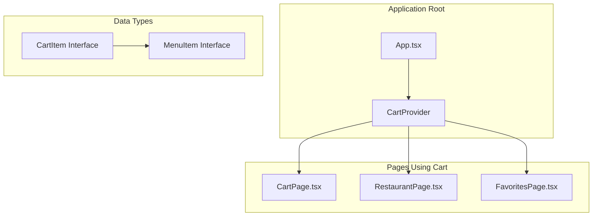
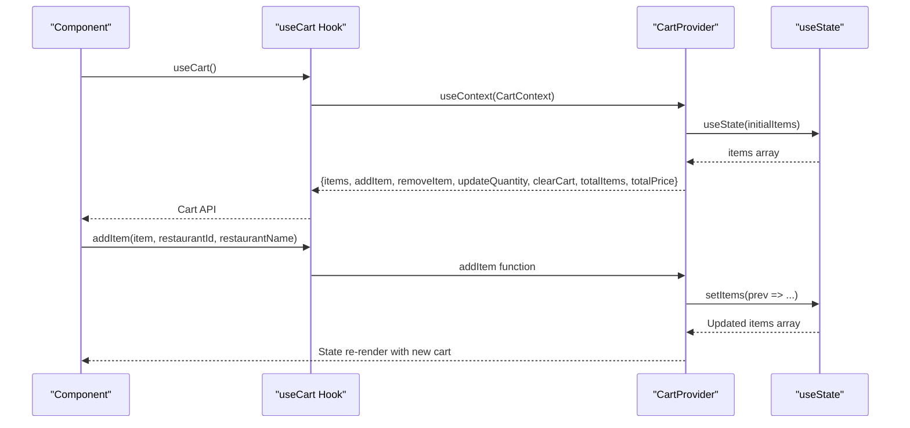
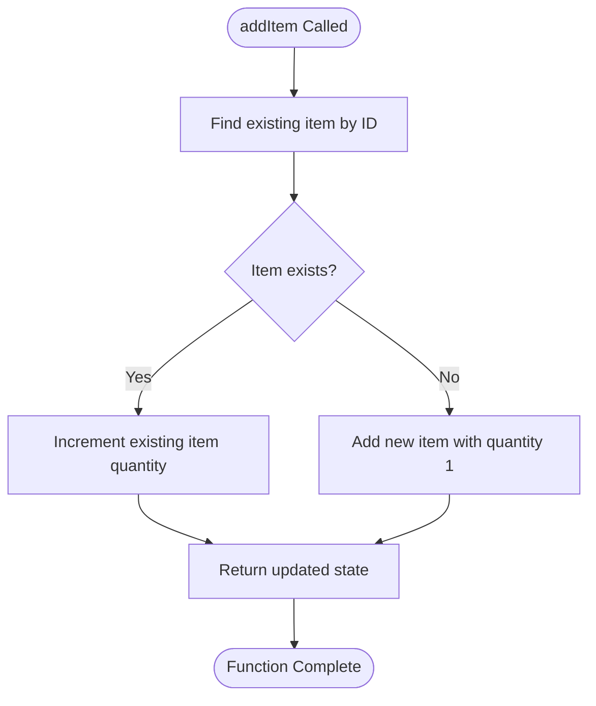
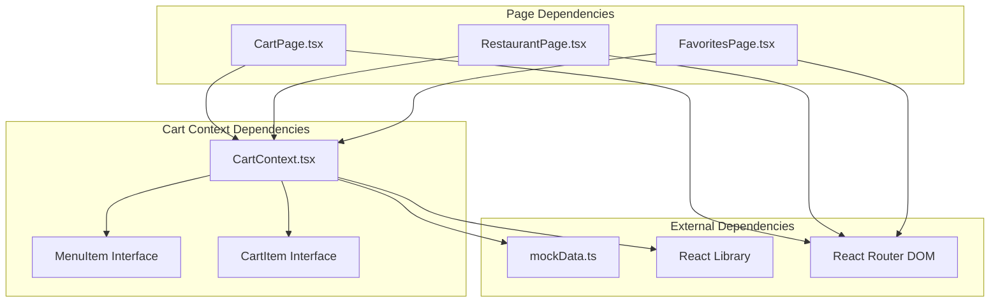

# Cart Context

<cite>
**Referenced Files in This Document**
- [CartContext.tsx](file://src/context/CartContext.tsx)
- [CartPage.tsx](file://src/pages/CartPage.tsx)
- [RestaurantPage.tsx](file://src/pages/RestaurantPage.tsx)
- [FavoritesPage.tsx](file://src/pages/FavoritesPage.tsx)
- [mockData.ts](file://src/data/mockData.ts)
- [App.tsx](file://src/App.tsx)
- [CravingsContext.tsx](file://src/context/CravingsContext.tsx)
</cite>

## Table of Contents
1. [Introduction](#introduction)
2. [Project Structure](#project-structure)
3. [Core Components](#core-components)
4. [Architecture Overview](#architecture-overview)
5. [Detailed Component Analysis](#detailed-component-analysis)
6. [Dependency Analysis](#dependency-analysis)
7. [Performance Considerations](#performance-considerations)
8. [Troubleshooting Guide](#troubleshooting-guide)
9. [Conclusion](#conclusion)

## Introduction
This document provides comprehensive technical documentation for TIPPAY's Cart Context implementation, which manages shopping cart state across the application. The Cart Context enables seamless cart operations including adding items, removing items, adjusting quantities, and clearing the cart, while automatically calculating totals and handling offer pricing.

## Project Structure
The Cart Context is implemented as a React Context Provider that wraps the entire application, making cart state globally accessible to components. It integrates with several pages and contexts to provide a cohesive ordering experience.



**Diagram sources**
- [App.tsx:126-163](file://src/App.tsx#L126-L163)
- [CartContext.tsx:22-56](file://src/context/CartContext.tsx#L22-L56)

**Section sources**
- [App.tsx:126-163](file://src/App.tsx#L126-L163)
- [CartContext.tsx:22-56](file://src/context/CartContext.tsx#L22-L56)

## Core Components
The Cart Context consists of two primary components: the CartProvider and the useCart hook. The provider manages the cart state and exposes cart operations, while the hook provides convenient access to cart functionality within components.

### CartItem Interface Structure
The CartItem interface extends the base MenuItem with cart-specific properties:

- **quantity**: Number of items in the cart
- **restaurantId**: Identifier of the restaurant that owns the item
- **restaurantName**: Name of the restaurant that owns the item

These properties enable cart operations to track item ownership and facilitate order creation.

**Section sources**
- [CartContext.tsx:4-8](file://src/context/CartContext.tsx#L4-L8)
- [mockData.ts:13-22](file://src/data/mockData.ts#L13-L22)

### Cart Context Type Definition
The CartContextType interface defines the complete cart API surface:

- **items**: Array of CartItem objects representing current cart contents
- **addItem**: Function to add items to cart with automatic duplicate detection
- **removeItem**: Function to remove specific items from cart
- **updateQuantity**: Function to adjust item quantities with zero-quantity handling
- **clearCart**: Function to empty the entire cart
- **totalItems**: Calculated total number of items in cart
- **totalPrice**: Calculated total cost considering offer prices

**Section sources**
- [CartContext.tsx:10-18](file://src/context/CartContext.tsx#L10-L18)

## Architecture Overview
The Cart Context follows a centralized state management pattern where all cart operations are handled within a single provider component. This design ensures consistent state management across the application and prevents prop drilling.



**Diagram sources**
- [CartContext.tsx:22-56](file://src/context/CartContext.tsx#L22-L56)
- [CartContext.tsx:59-63](file://src/context/CartContext.tsx#L59-L63)

## Detailed Component Analysis

### CartProvider Implementation
The CartProvider component serves as the central state manager for cart operations. It maintains cart items in React state and provides optimized callback functions for cart manipulation.

#### State Management
- **items**: React state array containing all cart items
- **totalItems**: Computed sum of all item quantities
- **totalPrice**: Computed sum using offerPrice when available, otherwise price

#### Cart Operations

##### addItem Function
The addItem function implements intelligent duplicate detection:
1. Searches for existing items with matching IDs
2. If found, increments quantity by 1
3. If not found, adds new item with quantity 1
4. Preserves restaurant metadata (restaurantId, restaurantName)



**Diagram sources**
- [CartContext.tsx:25-33](file://src/context/CartContext.tsx#L25-L33)

##### removeItem Function
Removes items from cart by filtering out items with matching IDs. This operation preserves cart integrity by maintaining array immutability.

##### updateQuantity Function
Handles quantity adjustments with special zero-quantity logic:
1. If quantity ≤ 0, removes item from cart
2. Otherwise, updates item quantity
3. Maintains item identity through spread operator

##### clearCart Function
Resets cart state to empty array, clearing all items instantly.

**Section sources**
- [CartContext.tsx:25-47](file://src/context/CartContext.tsx#L25-L47)

### useCart Hook Implementation
The useCart hook provides convenient access to cart functionality with robust error handling:

```mermaid
flowchart TD
HookCall[useCart Called] --> ContextAccess[useContext(CartContext)]
ContextAccess --> HasContext{Context Available?}
HasContext --> |Yes| ReturnAPI[Return Cart API]
HasContext --> |No| ThrowError[Throw Error]
ThrowError --> ErrorMsg["Error: useCart must be used within CartProvider"]
ReturnAPI --> Component[Component Receives Cart API]
```

**Diagram sources**
- [CartContext.tsx:59-63](file://src/context/CartContext.tsx#L59-L63)

**Section sources**
- [CartContext.tsx:59-63](file://src/context/CartContext.tsx#L59-L63)

### Calculation Logic
The cart implements efficient calculation logic for totals:

#### totalItems Calculation
Sums all item quantities using reduce operation with O(n) time complexity.

#### totalPrice Calculation
Calculates total cost using conditional offer pricing:
- Uses offerPrice when available (promotional pricing)
- Falls back to regular price when offerPrice is undefined
- Multiplies price by quantity for each item

**Section sources**
- [CartContext.tsx:49-50](file://src/context/CartContext.tsx#L49-L50)

## Dependency Analysis
The Cart Context integrates with multiple application components and data structures:



**Diagram sources**
- [CartContext.tsx:1-2](file://src/context/CartContext.tsx#L1-L2)
- [CartPage.tsx:1-12](file://src/pages/CartPage.tsx#L1-L12)
- [RestaurantPage.tsx:1-11](file://src/pages/RestaurantPage.tsx#L1-L11)
- [FavoritesPage.tsx:1-10](file://src/pages/FavoritesPage.tsx#L1-L10)

### Component Usage Patterns
Several components utilize the cart context for different purposes:

#### CartPage Integration
The CartPage demonstrates comprehensive cart usage:
- Displays cart items with images, names, and quantities
- Implements quantity adjustment controls (+/- buttons)
- Handles item removal via trash icons
- Integrates with order placement flow
- Manages promotional discounts and payment methods

#### RestaurantPage Integration
The RestaurantPage showcases cart integration during menu browsing:
- Shows current item quantities in menu items
- Provides "ADD" and "BUY NOW" functionality
- Implements floating cart bar with total items and price
- Handles buy-now flow with immediate cart addition

#### FavoritesPage Integration
The FavoritesPage demonstrates cart usage in favorites context:
- Shows favorite food items with cart quantity indicators
- Enables quick add-to-cart functionality
- Supports buy-now flow from favorites list

**Section sources**
- [CartPage.tsx:40-132](file://src/pages/CartPage.tsx#L40-L132)
- [RestaurantPage.tsx:13-43](file://src/pages/RestaurantPage.tsx#L13-L43)
- [FavoritesPage.tsx:11-34](file://src/pages/FavoritesPage.tsx#L11-L34)

## Performance Considerations

### useCallback Optimization
The CartProvider utilizes useCallback for all cart operations to prevent unnecessary re-renders:
- addItem: Prevents recreation of add function on each render
- removeItem: Optimizes removal function stability
- updateQuantity: Ensures quantity update function identity
- clearCart: Maintains cart clearing function reference

### State Mutation Patterns
The implementation follows immutable state patterns:
- Uses functional setState updates with previous state
- Creates new arrays and objects rather than mutating existing ones
- Leverages spread operators for object copying
- Maintains referential equality for unchanged items

### Edge Case Handling
The cart handles several edge cases efficiently:
- Zero quantity updates automatically remove items
- Duplicate item detection prevents cart bloat
- Offer price fallback ensures pricing consistency
- Empty cart scenarios return zeros for totals

### Memory Management
- Cart state is garbage collected when component unmounts
- No memory leaks from callback functions
- Efficient array filtering operations
- Minimal state duplication across components

## Troubleshooting Guide

### Common Issues and Solutions

#### Error: "useCart must be used within CartProvider"
**Cause**: Components accessing cart without proper provider wrapping
**Solution**: Ensure CartProvider is included in App.tsx provider chain

#### Items Not Updating Quantity
**Cause**: Incorrect itemId passed to updateQuantity
**Solution**: Verify item IDs match between cart and menu items

#### Duplicate Items Not Merging
**Cause**: Items with different IDs but same product
**Solution**: Ensure consistent item ID generation across application

#### Pricing Display Issues
**Cause**: Missing offerPrice values in menu items
**Solution**: Implement proper offerPrice fallback logic

**Section sources**
- [CartContext.tsx:59-63](file://src/context/CartContext.tsx#L59-L63)
- [CartContext.tsx:39-45](file://src/context/CartContext.tsx#L39-L45)

### Debugging Tips
- Use React DevTools to inspect cart state updates
- Monitor console for context errors during development
- Verify item IDs remain consistent across navigation
- Check offerPrice availability for promotional items

## Conclusion
The Cart Context implementation provides a robust, performant solution for managing shopping cart state in TIPPAY. Its design emphasizes immutability, efficient state updates, and comprehensive error handling. The integration with multiple pages demonstrates its flexibility and scalability for complex e-commerce scenarios. The implementation successfully balances simplicity with functionality, making it easy for developers to extend and maintain while providing excellent user experience through responsive cart operations.