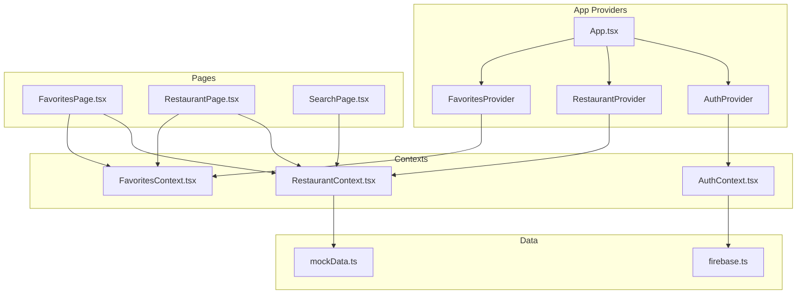
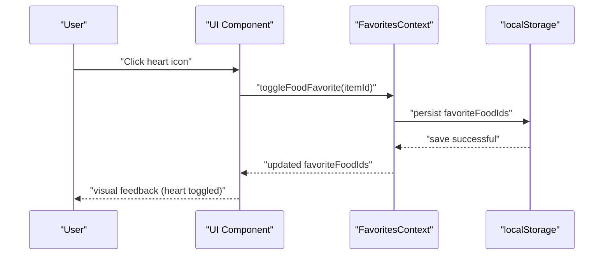
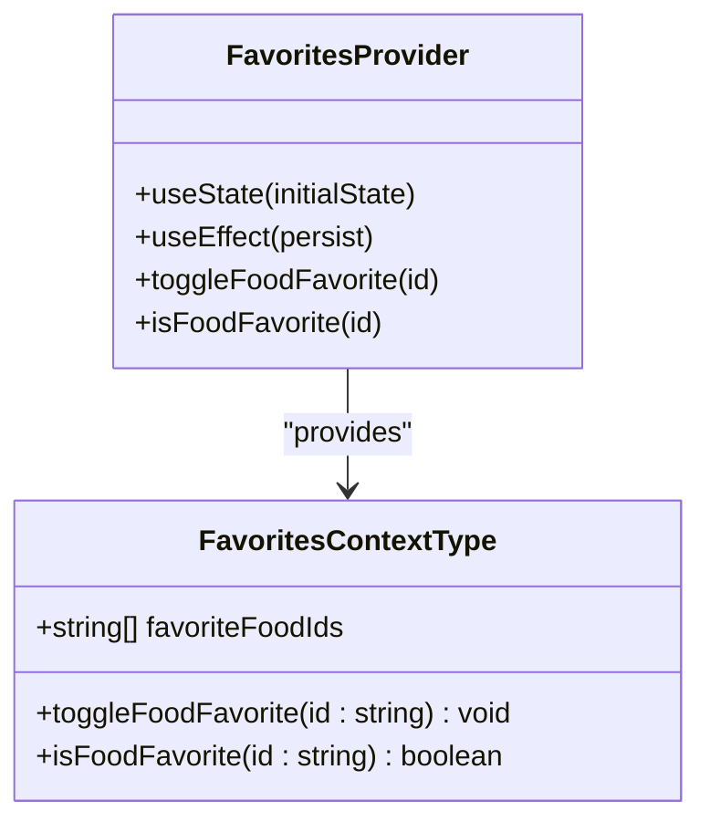
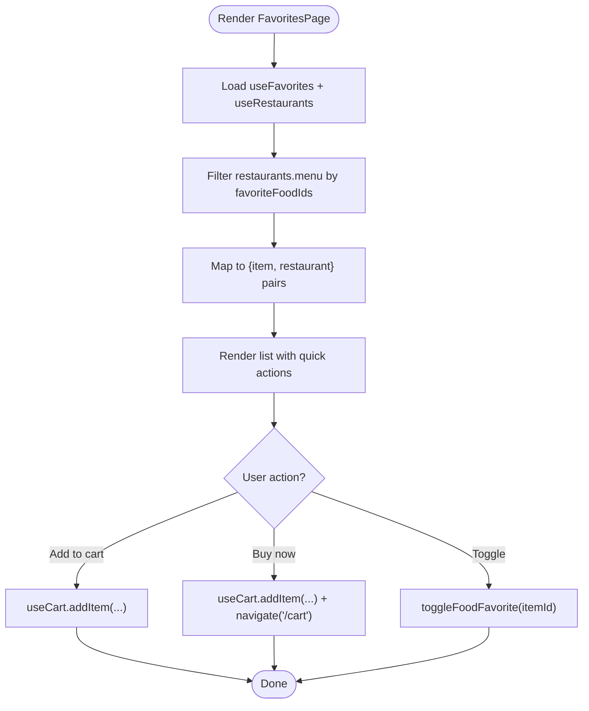
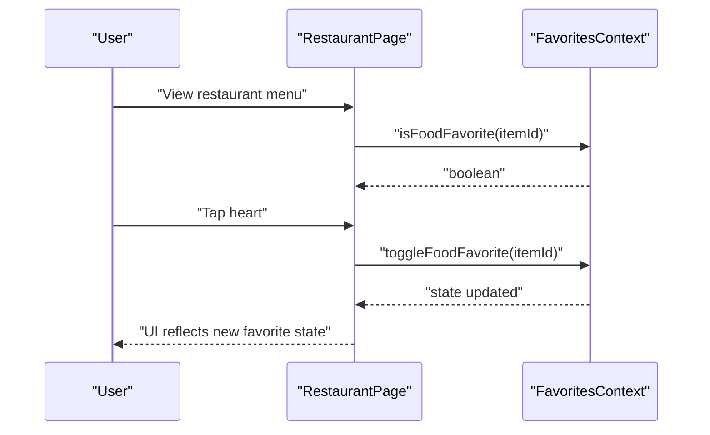
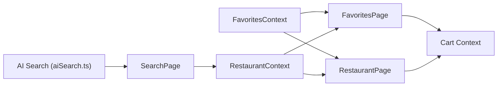
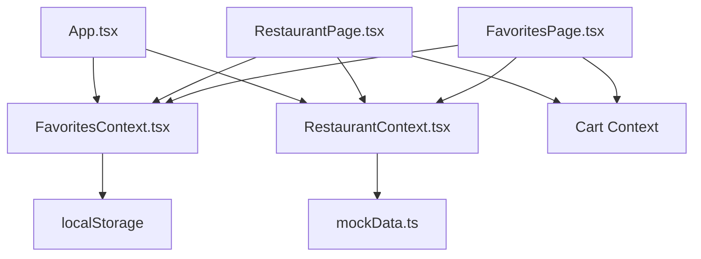

# Favorites Context

<cite>
**Referenced Files in This Document**
- [FavoritesContext.tsx](file://src/context/FavoritesContext.tsx)
- [FavoritesPage.tsx](file://src/pages/FavoritesPage.tsx)
- [RestaurantPage.tsx](file://src/pages/RestaurantPage.tsx)
- [App.tsx](file://src/App.tsx)
- [AuthContext.tsx](file://src/context/AuthContext.tsx)
- [firebase.ts](file://src/config/firebase.ts)
- [mockData.ts](file://src/data/mockData.ts)
- [RestaurantContext.tsx](file://src/context/RestaurantContext.tsx)
- [SearchPage.tsx](file://src/pages/SearchPage.tsx)
- [aiSearch.ts](file://src/utils/aiSearch.ts)
</cite>

## Table of Contents
1. [Introduction](#introduction)
2. [Project Structure](#project-structure)
3. [Core Components](#core-components)
4. [Architecture Overview](#architecture-overview)
5. [Detailed Component Analysis](#detailed-component-analysis)
6. [Dependency Analysis](#dependency-analysis)
7. [Performance Considerations](#performance-considerations)
8. [Troubleshooting Guide](#troubleshooting-guide)
9. [Conclusion](#conclusion)

## Introduction
This document explains the Favorites Context that powers user preferences and saved items in TIPPAY. It covers the Favorite interface structure for dishes, favorite addition/removal operations, persistence across browser sessions, and integration with restaurant discovery, cart functionality, and personalized experiences. It also outlines current limitations around cross-device synchronization and data export, and suggests pathways for extending the system with user accounts and recommendation engines.

## Project Structure
The Favorites system is implemented as a React Context provider and consumed by multiple pages and components:
- Favorites Context: central state for favorite dish IDs and operations
- Favorites Page: renders favorite dishes and enables quick actions
- Restaurant Page: allows toggling favorites per dish
- App Provider: wraps the app with FavoritesProvider
- Auth Context and Firebase: provide user identity (used for future account integration)
- Restaurant Context and Mock Data: supply menu items used by favorites
- Search Page and AI Search: demonstrate preference-driven discovery

**Diagram sources**
- [App.tsx:126-164](file://src/App.tsx#L126-L164)
- [FavoritesContext.tsx:11-38](file://src/context/FavoritesContext.tsx#L11-L38)
- [FavoritesPage.tsx:11-171](file://src/pages/FavoritesPage.tsx#L11-L171)
- [RestaurantPage.tsx:14-458](file://src/pages/RestaurantPage.tsx#L14-L458)
- [RestaurantContext.tsx:36-152](file://src/context/RestaurantContext.tsx#L36-L152)
- [AuthContext.tsx:40-123](file://src/context/AuthContext.tsx#L40-L123)
- [firebase.ts:1-28](file://src/config/firebase.ts#L1-L28)
- [mockData.ts:167-264](file://src/data/mockData.ts#L167-L264)

**Section sources**
- [App.tsx:126-164](file://src/App.tsx#L126-L164)
- [FavoritesContext.tsx:11-38](file://src/context/FavoritesContext.tsx#L11-L38)

## Core Components
- Favorites Context
  - Exposes favoriteFoodIds array and two operations: toggleFoodFavorite and isFoodFavorite
  - Persists state to localStorage keyed as "tippay_food_favorites"
  - Provides a hook useFavorites for consumers
- Favorites Page
  - Filters restaurants' menu items by favoriteFoodIds
  - Renders favorite dishes with quick add/buy actions and favorites toggle
- Restaurant Page
  - Integrates favorites toggle directly in the dish cards
  - Uses the same toggle/isFavorite helpers
- App Provider
  - Wraps the application with FavoritesProvider so the context is available globally

Key behaviors:
- Local-first persistence: favorites survive page reloads but are scoped to the browser
- Simple string ID model: favorites are identified by menu item IDs
- UI integration: heart icons reflect favorite state and allow toggling

**Section sources**
- [FavoritesContext.tsx:3-38](file://src/context/FavoritesContext.tsx#L3-L38)
- [FavoritesPage.tsx:11-171](file://src/pages/FavoritesPage.tsx#L11-L171)
- [RestaurantPage.tsx:14-458](file://src/pages/RestaurantPage.tsx#L14-L458)
- [App.tsx:134-158](file://src/App.tsx#L134-L158)

## Architecture Overview
The Favorites Context sits alongside other domain contexts (Restaurant, Cart, Auth) and is consumed by pages that render personalized content. The current implementation stores favorites locally; future enhancements can synchronize with user accounts and recommendation systems.

**Diagram sources**
- [FavoritesContext.tsx:25-31](file://src/context/FavoritesContext.tsx#L25-L31)
- [FavoritesContext.tsx:21-23](file://src/context/FavoritesContext.tsx#L21-L23)

**Section sources**
- [FavoritesContext.tsx:21-31](file://src/context/FavoritesContext.tsx#L21-L31)

## Detailed Component Analysis

### Favorites Context
The Favorites Context defines the contract and behavior for managing favorite dishes:
- State: favoriteFoodIds (string[])
- Operations:
  - toggleFoodFavorite(id): adds if missing, removes if present
  - isFoodFavorite(id): checks membership
- Persistence: writes to localStorage on state change

**Diagram sources**
- [FavoritesContext.tsx:3-38](file://src/context/FavoritesContext.tsx#L3-L38)

**Section sources**
- [FavoritesContext.tsx:3-38](file://src/context/FavoritesContext.tsx#L3-L38)

### Favorites Page
The Favorites Page consumes the Favorites Context and Restaurant Context to:
- Build a list of favorite dishes by filtering restaurants' menu items
- Render each favorite with image, name, restaurant, pricing, and quick actions
- Allow adding to cart or buying now directly from the favorites list
- Toggle favorites from the list itself

**Diagram sources**
- [FavoritesPage.tsx:13-34](file://src/pages/FavoritesPage.tsx#L13-L34)
- [FavoritesPage.tsx:18-20](file://src/pages/FavoritesPage.tsx#L18-L20)

**Section sources**
- [FavoritesPage.tsx:11-171](file://src/pages/FavoritesPage.tsx#L11-L171)

### Restaurant Page Integration
The Restaurant Page integrates favorites at the dish level:
- Each menu item displays a heart icon reflecting isFoodFavorite
- Clicking the heart toggles the favorite state
- This mirrors the Favorites Page behavior for consistency

**Diagram sources**
- [RestaurantPage.tsx:20-21](file://src/pages/RestaurantPage.tsx#L20-L21)
- [RestaurantPage.tsx:322-327](file://src/pages/RestaurantPage.tsx#L322-L327)

**Section sources**
- [RestaurantPage.tsx:14-458](file://src/pages/RestaurantPage.tsx#L14-L458)

### Personalization Features and Integration Points
- Preference-driven search: The Search Page supports AI Smart Search, which can incorporate user preferences indirectly by aligning results with dietary tags and keywords. While not directly tied to favorites, AI search can surface items consistent with user preferences.
- Restaurant discovery: Favorites Page aggregates items across restaurants, enabling discovery of favorite dishes in new contexts.
- Cart integration: Favorites Page allows quick-add and buy-now actions, linking favorites to purchase intent.

**Diagram sources**
- [FavoritesPage.tsx:13-16](file://src/pages/FavoritesPage.tsx#L13-L16)
- [RestaurantPage.tsx:19-21](file://src/pages/RestaurantPage.tsx#L19-L21)
- [SearchPage.tsx:17-20](file://src/pages/SearchPage.tsx#L17-L20)
- [aiSearch.ts:50-95](file://src/utils/aiSearch.ts#L50-L95)

**Section sources**
- [SearchPage.tsx:13-263](file://src/pages/SearchPage.tsx#L13-L263)
- [aiSearch.ts:50-95](file://src/utils/aiSearch.ts#L50-L95)

## Dependency Analysis
- Favorites Context depends on:
  - localStorage for persistence
  - Restaurant Context for menu data used to filter favorites
- Favorites Page depends on:
  - Favorites Context for state
  - Restaurant Context for menu data
  - Cart Context for quick actions
  - Translation Context for price formatting
- Restaurant Page depends on:
  - Favorites Context for toggle and state
  - Restaurant Context for menu data
  - Cart Context for quick actions
- App Provider composes providers in a strict order, ensuring FavoritesProvider is available to all routes.

**Diagram sources**
- [FavoritesContext.tsx:21-23](file://src/context/FavoritesContext.tsx#L21-L23)
- [FavoritesPage.tsx:13-16](file://src/pages/FavoritesPage.tsx#L13-L16)
- [RestaurantPage.tsx:19-21](file://src/pages/RestaurantPage.tsx#L19-L21)
- [App.tsx:134-158](file://src/App.tsx#L134-L158)
- [RestaurantContext.tsx:36-152](file://src/context/RestaurantContext.tsx#L36-L152)
- [mockData.ts:167-264](file://src/data/mockData.ts#L167-L264)

**Section sources**
- [App.tsx:134-158](file://src/App.tsx#L134-L158)
- [FavoritesContext.tsx:21-31](file://src/context/FavoritesContext.tsx#L21-L31)

## Performance Considerations
- Current implementation
  - Uses localStorage for persistence; this is lightweight but synchronous and bounded by device storage limits
  - Filtering favorites by iterating restaurants.menu is acceptable for mock datasets but may need optimization for large datasets
- Recommendations
  - For production, consider moving to IndexedDB or a backend service to support larger datasets and cross-device sync
  - Debounce or batch UI updates when toggling favorites to avoid frequent re-renders
  - Memoize computed favorites lists using selectors or similar patterns to reduce recomputation

[No sources needed since this section provides general guidance]

## Troubleshooting Guide
Common issues and resolutions:
- Favorites not persisting after refresh
  - Cause: localStorage errors during parsing or saving
  - Resolution: Verify localStorage availability and quota; ensure the key "tippay_food_favorites" exists and is valid JSON
- Favorites not updating UI immediately after toggle
  - Cause: Component not subscribed to context changes
  - Resolution: Ensure components use useFavorites and re-render on state updates
- Favorites not visible on Favorites Page
  - Cause: No matching menu items in restaurants or mismatched IDs
  - Resolution: Confirm restaurants contain items with IDs present in favoriteFoodIds; check mock data consistency

**Section sources**
- [FavoritesContext.tsx:12-19](file://src/context/FavoritesContext.tsx#L12-L19)
- [FavoritesContext.tsx:21-23](file://src/context/FavoritesContext.tsx#L21-L23)
- [FavoritesPage.tsx:18-20](file://src/pages/FavoritesPage.tsx#L18-L20)

## Conclusion
The Favorites Context provides a simple, effective mechanism for storing and rendering user-preferred dishes. It integrates seamlessly with restaurant discovery and cart actions, enabling a personalized ordering experience. For enterprise-grade deployment, consider integrating with user accounts (via Auth and Firebase) to enable cross-device synchronization and data export, and augment recommendation systems to leverage favorites as signals for personalization.