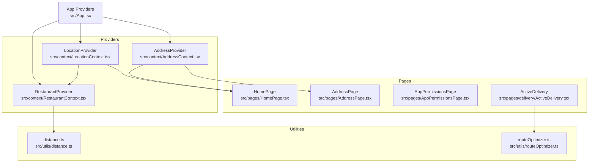
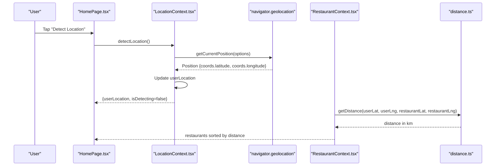
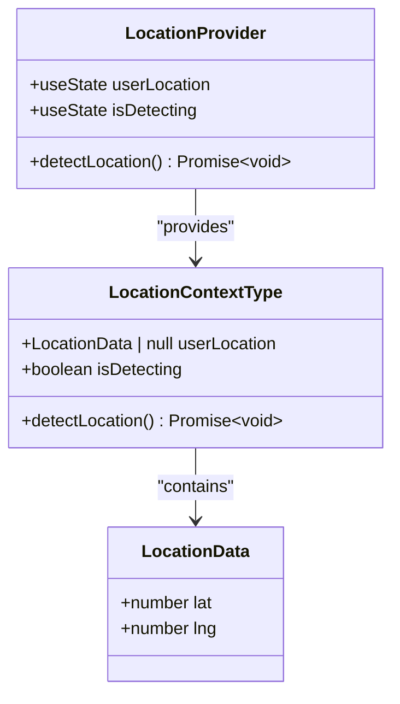
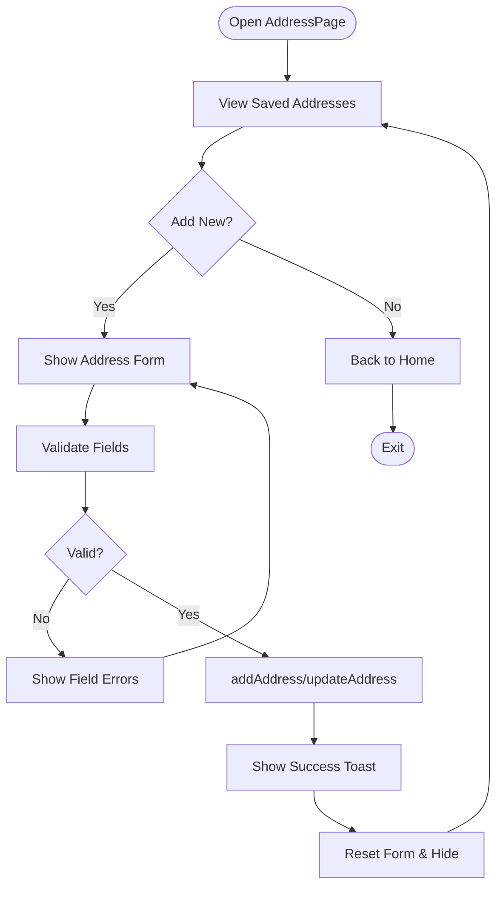
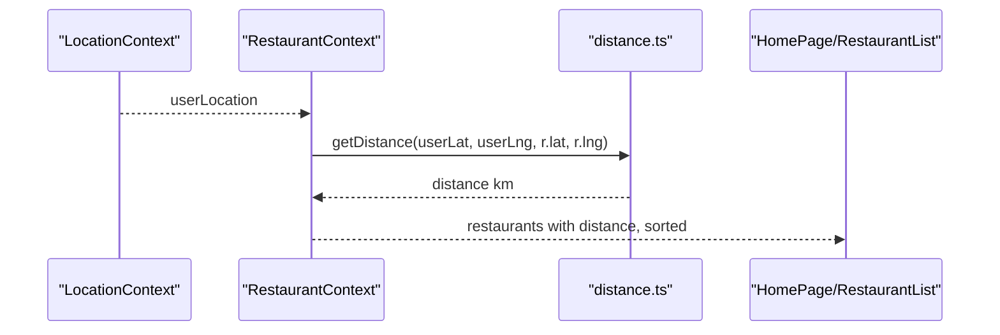
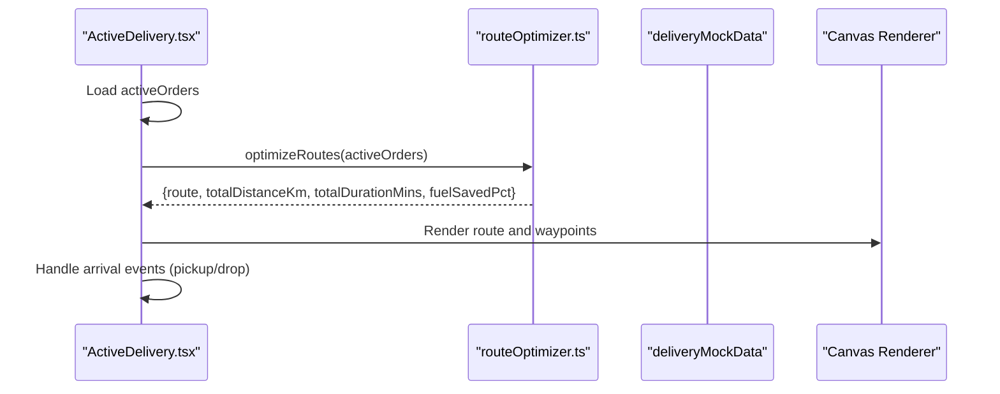
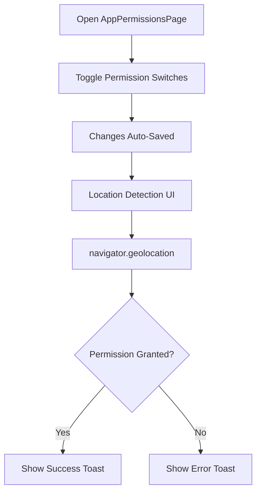
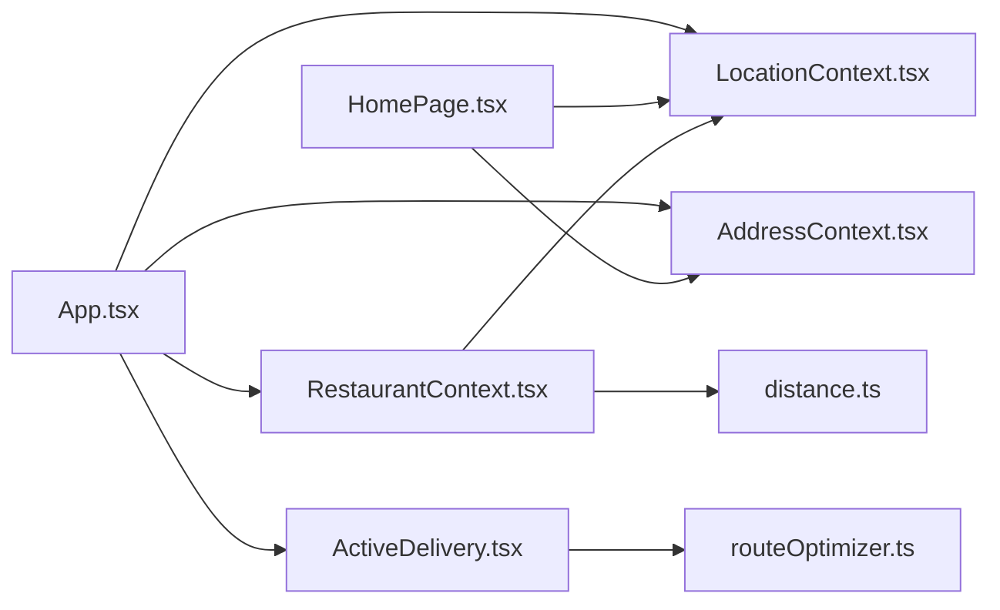

# Location Context

<cite>
**Referenced Files in This Document**
- [LocationContext.tsx](file://src/context/LocationContext.tsx)
- [AddressContext.tsx](file://src/context/AddressContext.tsx)
- [distance.ts](file://src/utils/distance.ts)
- [routeOptimizer.ts](file://src/utils/routeOptimizer.ts)
- [App.tsx](file://src/App.tsx)
- [HomePage.tsx](file://src/pages/HomePage.tsx)
- [RestaurantContext.tsx](file://src/context/RestaurantContext.tsx)
- [ActiveDelivery.tsx](file://src/pages/delivery/ActiveDelivery.tsx)
- [AddressPage.tsx](file://src/pages/AddressPage.tsx)
- [AppPermissionsPage.tsx](file://src/pages/AppPermissionsPage.tsx)
</cite>

## Table of Contents
1. [Introduction](#introduction)
2. [Project Structure](#project-structure)
3. [Core Components](#core-components)
4. [Architecture Overview](#architecture-overview)
5. [Detailed Component Analysis](#detailed-component-analysis)
6. [Dependency Analysis](#dependency-analysis)
7. [Performance Considerations](#performance-considerations)
8. [Troubleshooting Guide](#troubleshooting-guide)
9. [Privacy and Security](#privacy-and-security)
10. [Conclusion](#conclusion)

## Introduction
This document explains the Location Context that powers geolocation services and address management in TIPPAY. It covers the Location interface, automatic and manual location workflows, integration with distance calculations and route optimization, and how location data influences restaurant discovery, order delivery, and navigation features. It also addresses privacy considerations, permission handling, and fallback mechanisms.

## Project Structure
The Location Context is part of the global application providers and integrates with Address Management, Restaurant Discovery, and Delivery Route Optimization.

**Diagram sources**
- [App.tsx:132-161](file://src/App.tsx#L132-L161)
- [LocationContext.tsx:17-56](file://src/context/LocationContext.tsx#L17-L56)
- [AddressContext.tsx:31-87](file://src/context/AddressContext.tsx#L31-L87)
- [RestaurantContext.tsx:36-153](file://src/context/RestaurantContext.tsx#L36-L153)
- [HomePage.tsx:37](file://src/pages/HomePage.tsx#L37)
- [AddressPage.tsx:19](file://src/pages/AddressPage.tsx#L19)
- [AppPermissionsPage.tsx:10-13](file://src/pages/AppPermissionsPage.tsx#L10-L13)
- [ActiveDelivery.tsx:27](file://src/pages/delivery/ActiveDelivery.tsx#L27)
- [distance.ts:1-34](file://src/utils/distance.ts#L1-L34)
- [routeOptimizer.ts:53-194](file://src/utils/routeOptimizer.ts#L53-L194)

**Section sources**
- [App.tsx:132-161](file://src/App.tsx#L132-L161)
- [LocationContext.tsx:17-56](file://src/context/LocationContext.tsx#L17-L56)
- [AddressContext.tsx:31-87](file://src/context/AddressContext.tsx#L31-L87)
- [RestaurantContext.tsx:36-153](file://src/context/RestaurantContext.tsx#L36-L153)
- [HomePage.tsx:37](file://src/pages/HomePage.tsx#L37)
- [ActiveDelivery.tsx:27](file://src/pages/delivery/ActiveDelivery.tsx#L27)
- [distance.ts:1-34](file://src/utils/distance.ts#L1-L34)
- [routeOptimizer.ts:53-194](file://src/utils/routeOptimizer.ts#L53-L194)

## Core Components
- Location Context: Provides user coordinates, detection state, and a method to trigger geolocation detection. It uses the browser’s Geolocation API with high accuracy and a short timeout.
- Address Context: Manages saved addresses with labels, landmarks, phones, and default selection. Persists to local storage and provides CRUD operations.
- Distance Utilities: Implements the Haversine formula for accurate distance calculation and helpers to generate random coordinates near a center point.
- Route Optimization: Computes optimized delivery routes for active orders, considering pickup-drop constraints and minimizing total travel distance.

Key interfaces and exports:
- LocationData: latitude and longitude numbers.
- LocationContextType: exposes userLocation, isDetecting, and detectLocation.
- Address interface: id, label, fullAddress, optional landmark, phone, isDefault.
- RouteWaypoint and OptimizationResult: define waypoints and optimization metrics.

**Section sources**
- [LocationContext.tsx:4-13](file://src/context/LocationContext.tsx#L4-L13)
- [LocationContext.tsx:9-13](file://src/context/LocationContext.tsx#L9-L13)
- [AddressContext.tsx:3-10](file://src/context/AddressContext.tsx#L3-L10)
- [AddressContext.tsx:12-20](file://src/context/AddressContext.tsx#L12-L20)
- [distance.ts:1-17](file://src/utils/distance.ts#L1-L17)
- [routeOptimizer.ts:1-21](file://src/utils/routeOptimizer.ts#L1-L21)

## Architecture Overview
The Location Context is initialized at the app root and consumed by pages and contexts that require location-aware features. Restaurant discovery uses location to compute distances and sort nearby restaurants. Delivery agents use route optimization with waypoints derived from active orders and the rider’s current location.

**Diagram sources**
- [HomePage.tsx:102-108](file://src/pages/HomePage.tsx#L102-L108)
- [LocationContext.tsx:21-49](file://src/context/LocationContext.tsx#L21-L49)
- [RestaurantContext.tsx:49-66](file://src/context/RestaurantContext.tsx#L49-L66)
- [distance.ts:2-13](file://src/utils/distance.ts#L2-L13)

**Section sources**
- [HomePage.tsx:102-108](file://src/pages/HomePage.tsx#L102-L108)
- [LocationContext.tsx:21-49](file://src/context/LocationContext.tsx#L21-L49)
- [RestaurantContext.tsx:49-66](file://src/context/RestaurantContext.tsx#L49-L66)
- [distance.ts:2-13](file://src/utils/distance.ts#L2-L13)

## Detailed Component Analysis

### Location Context
Responsibilities:
- Expose userLocation (nullable) and isDetecting flag.
- Detect user location via browser Geolocation API with high accuracy and timeout.
- Provide a toast-based UX for success/error feedback.
- Guard against unsupported environments.

Implementation highlights:
- Uses HTML5 Geolocation API with enableHighAccuracy, timeout, and maximumAge.
- Updates state and shows notifications on success/failure.
- Enforces provider usage via a dedicated hook.

**Diagram sources**
- [LocationContext.tsx:9-13](file://src/context/LocationContext.tsx#L9-L13)
- [LocationContext.tsx:4-7](file://src/context/LocationContext.tsx#L4-L7)
- [LocationContext.tsx:17-56](file://src/context/LocationContext.tsx#L17-L56)

**Section sources**
- [LocationContext.tsx:4-13](file://src/context/LocationContext.tsx#L4-L13)
- [LocationContext.tsx:17-56](file://src/context/LocationContext.tsx#L17-L56)

### Address Context and Manual Address Entry
Responsibilities:
- Persist addresses to local storage with a default set if none exists.
- Provide add/update/delete/setDefault/selectAddress operations.
- Supply selectedAddress for UI rendering and checkout flows.

Manual address entry workflow:
- Users navigate to AddressPage, choose a label, enter full address, optional landmark, phone, and optionally set as default.
- Validation ensures minimum length, phone format, and reasonable lengths.
- On save, the system either adds a new address or updates an existing one and shows a success toast.

**Diagram sources**
- [AddressPage.tsx:17-82](file://src/pages/AddressPage.tsx#L17-L82)
- [AddressContext.tsx:31-87](file://src/context/AddressContext.tsx#L31-L87)

**Section sources**
- [AddressPage.tsx:17-82](file://src/pages/AddressPage.tsx#L17-L82)
- [AddressContext.tsx:31-87](file://src/context/AddressContext.tsx#L31-L87)

### Restaurant Proximity Filtering and Distance Calculation
Integration points:
- RestaurantContext consumes userLocation and computes distances using the Haversine formula.
- If a restaurant lacks stored coordinates, it generates plausible nearby coordinates around the user’s location.
- Derived restaurants include a distance field and are sorted by proximity.

**Diagram sources**
- [RestaurantContext.tsx:49-66](file://src/context/RestaurantContext.tsx#L49-L66)
- [RestaurantContext.tsx:97-142](file://src/context/RestaurantContext.tsx#L97-L142)
- [distance.ts:2-13](file://src/utils/distance.ts#L2-L13)

**Section sources**
- [RestaurantContext.tsx:49-66](file://src/context/RestaurantContext.tsx#L49-L66)
- [RestaurantContext.tsx:97-142](file://src/context/RestaurantContext.tsx#L97-L142)
- [distance.ts:2-13](file://src/utils/distance.ts#L2-L13)

### Delivery Route Optimization and Navigation
Integration points:
- ActiveDelivery loads active orders and calls optimizeRoutes to compute the best sequence.
- RouteWaypoint includes rider start, pickups, and drops; OptimizationResult includes total distance, estimated duration, and fuel savings percentage.
- The page renders an animated map and a queue of waypoints, enabling riders to mark arrivals and advance through the route.

**Diagram sources**
- [ActiveDelivery.tsx:16-42](file://src/pages/delivery/ActiveDelivery.tsx#L16-L42)
- [ActiveDelivery.tsx:27](file://src/pages/delivery/ActiveDelivery.tsx#L27)
- [routeOptimizer.ts:53-194](file://src/utils/routeOptimizer.ts#L53-L194)

**Section sources**
- [ActiveDelivery.tsx:16-42](file://src/pages/delivery/ActiveDelivery.tsx#L16-L42)
- [ActiveDelivery.tsx:27](file://src/pages/delivery/ActiveDelivery.tsx#L27)
- [routeOptimizer.ts:53-194](file://src/utils/routeOptimizer.ts#L53-L194)

### Permission Handling and Privacy Settings
- AppPermissionsPage exposes toggles for Location, Search, Notifications, and Live Activities. These are presented as interactive switches with labels and icons.
- Location detection is gated by browser support and user consent. The Location Context surfaces errors via toast and disables further attempts until resolved.

**Diagram sources**
- [AppPermissionsPage.tsx:10-13](file://src/pages/AppPermissionsPage.tsx#L10-L13)
- [LocationContext.tsx:24-28](file://src/context/LocationContext.tsx#L24-L28)
- [LocationContext.tsx:44-46](file://src/context/LocationContext.tsx#L44-L46)

**Section sources**
- [AppPermissionsPage.tsx:10-13](file://src/pages/AppPermissionsPage.tsx#L10-L13)
- [LocationContext.tsx:24-28](file://src/context/LocationContext.tsx#L24-L28)
- [LocationContext.tsx:44-46](file://src/context/LocationContext.tsx#L44-L46)

## Dependency Analysis
- App initializes LocationProvider, AddressProvider, RestaurantProvider, and others in a nested hierarchy.
- HomePage depends on LocationContext for detection and AddressContext for selected address display.
- RestaurantContext depends on LocationContext for proximity computation and on distance.ts for distance calculations.
- ActiveDelivery depends on routeOptimizer.ts for route planning and on local delivery data.

**Diagram sources**
- [App.tsx:132-161](file://src/App.tsx#L132-L161)
- [HomePage.tsx:37](file://src/pages/HomePage.tsx#L37)
- [RestaurantContext.tsx:49-66](file://src/context/RestaurantContext.tsx#L49-L66)
- [distance.ts:1-34](file://src/utils/distance.ts#L1-L34)
- [ActiveDelivery.tsx:27](file://src/pages/delivery/ActiveDelivery.tsx#L27)
- [routeOptimizer.ts:53-194](file://src/utils/routeOptimizer.ts#L53-L194)

**Section sources**
- [App.tsx:132-161](file://src/App.tsx#L132-L161)
- [HomePage.tsx:37](file://src/pages/HomePage.tsx#L37)
- [RestaurantContext.tsx:49-66](file://src/context/RestaurantContext.tsx#L49-L66)
- [distance.ts:1-34](file://src/utils/distance.ts#L1-L34)
- [ActiveDelivery.tsx:27](file://src/pages/delivery/ActiveDelivery.tsx#L27)
- [routeOptimizer.ts:53-194](file://src/utils/routeOptimizer.ts#L53-L194)

## Performance Considerations
- Geolocation detection: High accuracy and timeout are configured to balance precision and responsiveness. Consider debouncing repeated requests and caching recent positions to reduce API calls.
- Distance calculations: The Haversine formula is efficient for small to medium ranges. For large-scale computations, consider spatial indexing or bounding box filtering before precise distance checks.
- Route optimization: The current implementation enumerates permutations and validates pickup-before-drop constraints. For larger batches, consider heuristic or metaheuristic approaches to reduce computational complexity.

[No sources needed since this section provides general guidance]

## Troubleshooting Guide
Common issues and resolutions:
- Geolocation not supported: The provider detects lack of browser support and displays an error toast. Advise users to enable location services and retry.
- Permission denied: The promise rejection triggers an error toast. Direct users to AppPermissionsPage to grant location access.
- No restaurants found: Verify userLocation is set; otherwise, RestaurantContext falls back to mock distances. Ensure the device has a valid location fix.
- Delivery route empty: Occurs when no active orders exist. Accept orders first to populate the route.

**Section sources**
- [LocationContext.tsx:24-28](file://src/context/LocationContext.tsx#L24-L28)
- [LocationContext.tsx:44-46](file://src/context/LocationContext.tsx#L44-L46)
- [RestaurantContext.tsx:52-66](file://src/context/RestaurantContext.tsx#L52-L66)
- [ActiveDelivery.tsx:179-193](file://src/pages/delivery/ActiveDelivery.tsx#L179-L193)

## Privacy and Security
- Location sharing permissions: Exposed via AppPermissionsPage. Users can toggle location access independently of other permissions.
- Local storage usage: AddressContext persists addresses locally. Sensitive data should be handled carefully; avoid storing personally identifiable information unnecessarily.
- Fallback mechanisms: When location is unavailable, the system uses mock coordinates or defaults to mock data to maintain functionality.

**Section sources**
- [AppPermissionsPage.tsx:10-13](file://src/pages/AppPermissionsPage.tsx#L10-L13)
- [AddressContext.tsx:32-45](file://src/context/AddressContext.tsx#L32-L45)
- [RestaurantContext.tsx:56-62](file://src/context/RestaurantContext.tsx#L56-L62)

## Conclusion
The Location Context forms the backbone of TIPPAY’s location-aware features. It enables automatic geolocation detection, integrates with address management for manual entries, powers restaurant proximity filtering, and supports delivery route optimization. With clear permission controls and robust fallbacks, it balances functionality with user privacy and performance.