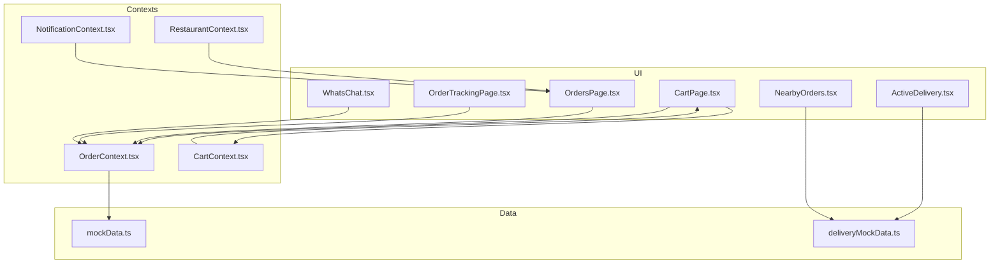
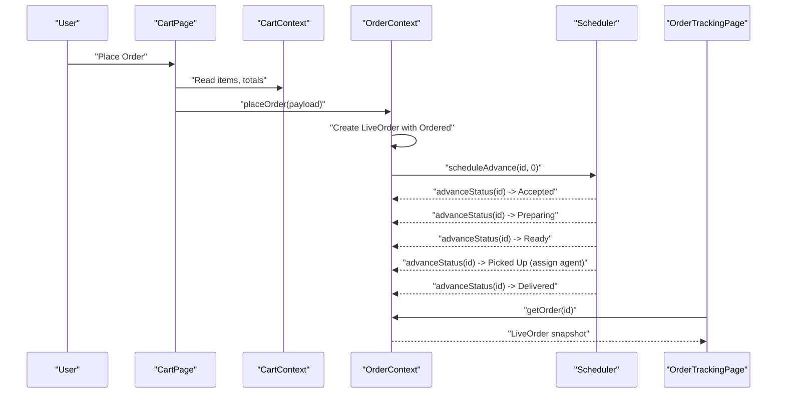
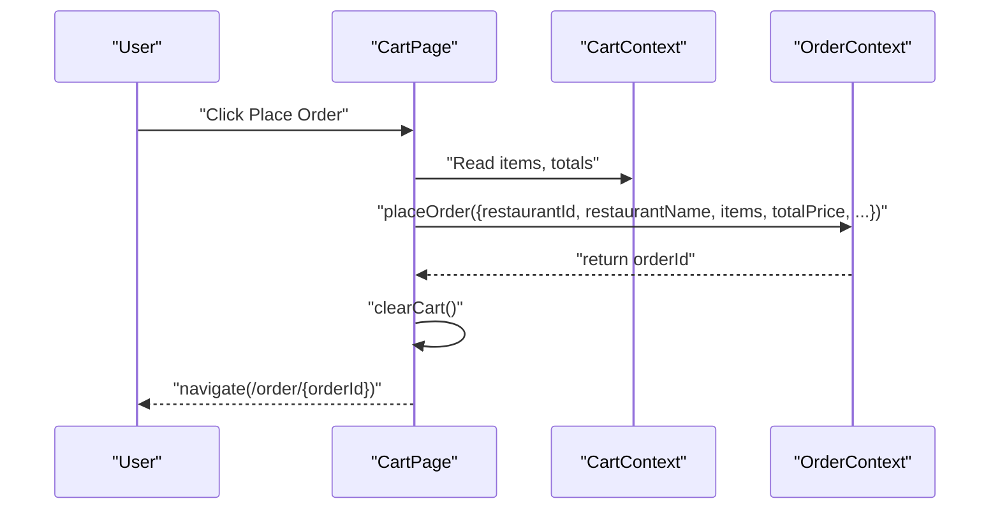
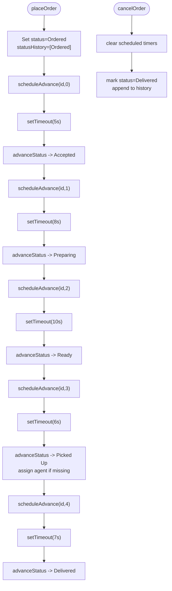
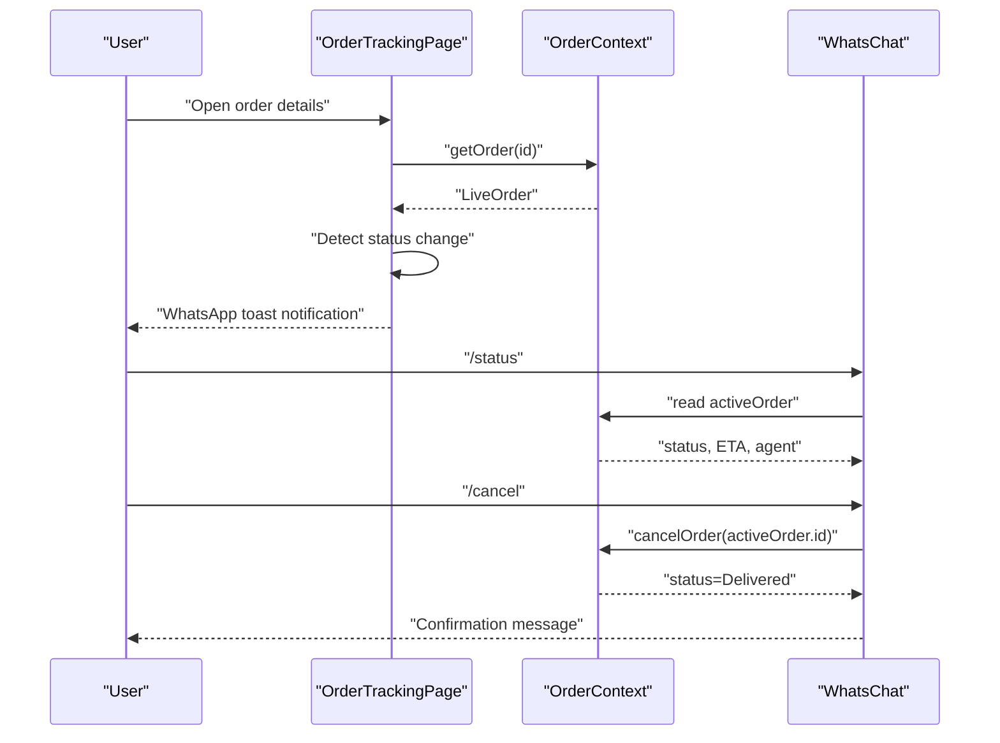
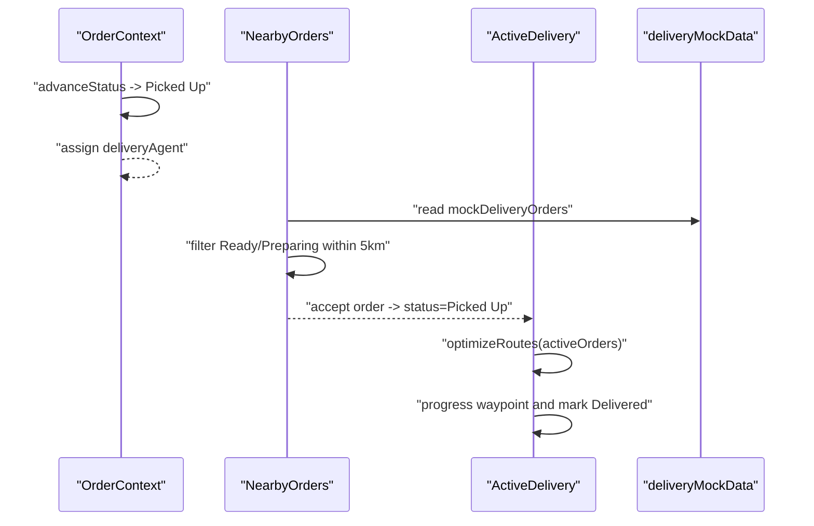
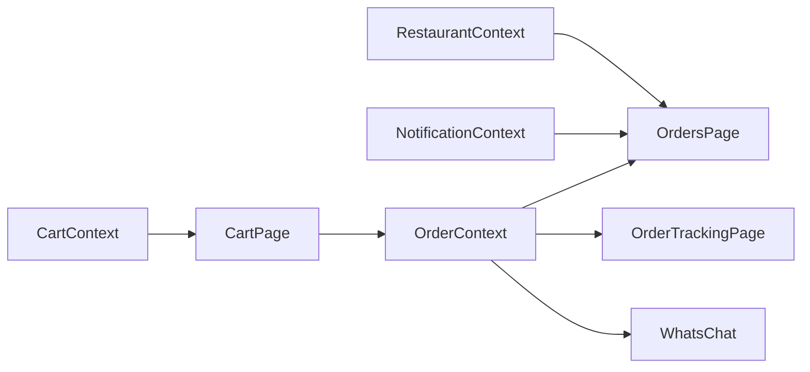
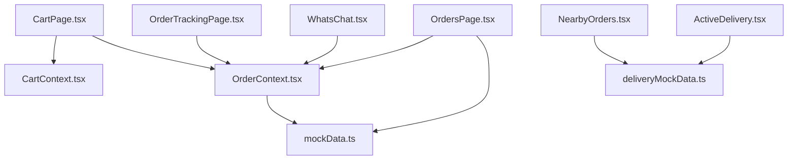

# Order Context

<cite>
**Referenced Files in This Document**
- [OrderContext.tsx](file://src/context/OrderContext.tsx)
- [OrdersPage.tsx](file://src/pages/OrdersPage.tsx)
- [OrderTrackingPage.tsx](file://src/pages/OrderTrackingPage.tsx)
- [CartPage.tsx](file://src/pages/CartPage.tsx)
- [mockData.ts](file://src/data/mockData.ts)
- [CartContext.tsx](file://src/context/CartContext.tsx)
- [RestaurantContext.tsx](file://src/context/RestaurantContext.tsx)
- [NotificationContext.tsx](file://src/context/NotificationContext.tsx)
- [WhatsChat.tsx](file://src/components/WhatsChat.tsx)
- [ActiveDelivery.tsx](file://src/pages/delivery/ActiveDelivery.tsx)
- [NearbyOrders.tsx](file://src/pages/delivery/NearbyOrders.tsx)
- [deliveryMockData.ts](file://src/data/deliveryMockData.ts)
</cite>

## Table of Contents
1. [Introduction](#introduction)
2. [Project Structure](#project-structure)
3. [Core Components](#core-components)
4. [Architecture Overview](#architecture-overview)
5. [Detailed Component Analysis](#detailed-component-analysis)
6. [Dependency Analysis](#dependency-analysis)
7. [Performance Considerations](#performance-considerations)
8. [Troubleshooting Guide](#troubleshooting-guide)
9. [Conclusion](#conclusion)

## Introduction
This document explains the Order Context that manages the order lifecycle in TIPPAY. It covers the Order interface structure, status tracking, timeline management, order item details, creation workflows, status progression, automated updates, persistence, real-time tracking, delivery agent integration, cancellation and refund procedures, customer notifications, and the relationships among Order Context, Cart Context, Restaurant Context, and Delivery Context.

## Project Structure
The order lifecycle spans several contexts and pages:
- Order Context maintains live orders, schedules status transitions, and exposes actions to place/cancel orders.
- Cart Page constructs order payloads from the shopping cart and invokes the Order Context to place orders.
- Orders Page lists historical and live orders and links to tracking.
- Order Tracking Page visualizes live order progress, agent info, and simulates WhatsApp notifications.
- Delivery Pages manage delivery batches and agent workflows.
- Mock data defines order statuses and static order records.
- Notification and Chat components integrate customer communication.



**Diagram sources**
- [OrderContext.tsx:1-138](file://src/context/OrderContext.tsx#L1-L138)
- [CartPage.tsx:1-366](file://src/pages/CartPage.tsx#L1-L366)
- [OrdersPage.tsx:1-295](file://src/pages/OrdersPage.tsx#L1-L295)
- [OrderTrackingPage.tsx:1-348](file://src/pages/OrderTrackingPage.tsx#L1-L348)
- [ActiveDelivery.tsx:1-398](file://src/pages/delivery/ActiveDelivery.tsx#L1-L398)
- [NearbyOrders.tsx:1-170](file://src/pages/delivery/NearbyOrders.tsx#L1-L170)
- [mockData.ts:1-326](file://src/data/mockData.ts#L1-L326)
- [deliveryMockData.ts:1-134](file://src/data/deliveryMockData.ts#L1-L134)
- [CartContext.tsx:1-64](file://src/context/CartContext.tsx#L1-L64)
- [RestaurantContext.tsx:1-162](file://src/context/RestaurantContext.tsx#L1-L162)
- [NotificationContext.tsx:1-121](file://src/context/NotificationContext.tsx#L1-L121)
- [WhatsChat.tsx:1-235](file://src/components/WhatsChat.tsx#L1-L235)

**Section sources**
- [OrderContext.tsx:1-138](file://src/context/OrderContext.tsx#L1-L138)
- [CartPage.tsx:103-132](file://src/pages/CartPage.tsx#L103-L132)
- [OrdersPage.tsx:21-44](file://src/pages/OrdersPage.tsx#L21-L44)
- [OrderTrackingPage.tsx:22-54](file://src/pages/OrderTrackingPage.tsx#L22-L54)
- [ActiveDelivery.tsx:16-42](file://src/pages/delivery/ActiveDelivery.tsx#L16-L42)
- [NearbyOrders.tsx:8-46](file://src/pages/delivery/NearbyOrders.tsx#L8-L46)
- [mockData.ts:38-56](file://src/data/mockData.ts#L38-L56)
- [CartContext.tsx:10-18](file://src/context/CartContext.tsx#L10-L18)
- [RestaurantContext.tsx:21-32](file://src/context/RestaurantContext.tsx#L21-L32)
- [NotificationContext.tsx:14-20](file://src/context/NotificationContext.tsx#L14-L20)
- [WhatsChat.tsx:24-118](file://src/components/WhatsChat.tsx#L24-L118)

## Core Components
- Order interface and status flow:
  - LiveOrder includes order identity, restaurant metadata, items, pricing, status, timestamps, ETA, payment method, optional delivery agent, and immutable status history.
  - OrderStatus is a union of Ordered, Accepted, Preparing, Ready, Picked Up, Delivered.
- Order Context provider:
  - Stores live orders and active order.
  - Provides placeOrder, getOrder, and cancelOrder.
  - Schedules automatic status advancement with delays per stage.
  - Assigns a random delivery agent upon reaching Picked Up if none exists.
- Cart integration:
  - CartPage builds the payload from CartContext and calls placeOrder.
- UI integrations:
  - OrdersPage aggregates live orders with mock historical orders.
  - OrderTrackingPage renders live status, agent info, and WhatsApp notifications.
  - Delivery pages maintain separate delivery order lists and agent workflows.

**Section sources**
- [OrderContext.tsx:4-25](file://src/context/OrderContext.tsx#L4-L25)
- [OrderContext.tsx:37-84](file://src/context/OrderContext.tsx#L37-L84)
- [OrderContext.tsx:105-120](file://src/context/OrderContext.tsx#L105-L120)
- [OrderContext.tsx:122-124](file://src/context/OrderContext.tsx#L122-L124)
- [mockData.ts:49-56](file://src/data/mockData.ts#L49-L56)
- [CartPage.tsx:111-127](file://src/pages/CartPage.tsx#L111-L127)
- [OrdersPage.tsx:32-44](file://src/pages/OrdersPage.tsx#L32-L44)
- [OrderTrackingPage.tsx:13-20](file://src/pages/OrderTrackingPage.tsx#L13-L20)

## Architecture Overview
The Order Context orchestrates the order lifecycle:
- Creation: CartPage collects items and totals, then delegates to OrderContext.placeOrder.
- Automation: OrderContext schedules timed status transitions from Ordered to Delivered.
- Real-time tracking: OrderTrackingPage subscribes to order state and displays progress.
- Delivery integration: Delivery pages operate against a separate delivery dataset; however, OrderContext’s delivery agent assignment aligns with delivery workflows.
- Notifications: WhatsApp chat simulates customer notifications and supports cancellation commands.



**Diagram sources**
- [CartPage.tsx:111-131](file://src/pages/CartPage.tsx#L111-L131)
- [OrderContext.tsx:105-120](file://src/context/OrderContext.tsx#L105-L120)
- [OrderContext.tsx:86-97](file://src/context/OrderContext.tsx#L86-L97)
- [OrderContext.tsx:66-84](file://src/context/OrderContext.tsx#L66-L84)
- [OrderTrackingPage.tsx:29](file://src/pages/OrderTrackingPage.tsx#L29)

## Detailed Component Analysis

### Order Context and Live Order Model
- LiveOrder fields:
  - Identity: id, restaurantId, restaurantName
  - Items: array of { name, quantity, price, image? }
  - Pricing: totalPrice, deliveryFee, discount?
  - Timeline: placedAt, estimatedDelivery, statusHistory
  - Status: Ordered | Accepted | Preparing | Ready | Picked Up | Delivered
  - Agent: optional { name, phone }
  - Payment: paymentMethod
- Status flow and automation:
  - Fixed sequence: Ordered → Accepted → Preparing → Ready → Picked Up → Delivered
  - Delays per stage: [5s, 8s, 10s, 6s, 7s] approximate realistic progression
  - On Picked Up, a delivery agent is assigned randomly if missing
- Actions:
  - placeOrder: generates id, sets initial status and history, enqueues scheduler
  - cancelOrder: marks as Delivered and clears scheduled timers
  - getOrder: fetches by id
  - activeOrder: first non-Delivered order

```mermaid
classDiagram
class LiveOrder {
+string id
+string restaurantId
+string restaurantName
+OrderItem[] items
+number totalPrice
+number deliveryFee
+number? discount
+OrderStatus status
+Date placedAt
+string estimatedDelivery
+string paymentMethod
+DeliveryAgent? deliveryAgent
+StatusHistory[] statusHistory
}
class OrderContextType {
+LiveOrder[] orders
+LiveOrder? activeOrder
+placeOrder(orderData) string
+getOrder(id) LiveOrder?
+cancelOrder(id) void
}
class OrderStatus {
<<enumeration>>
"Ordered"
"Accepted"
"Preparing"
"Ready"
"Picked Up"
"Delivered"
}
OrderContextType --> LiveOrder : "manages"
LiveOrder --> OrderStatus : "has"
```

**Diagram sources**
- [OrderContext.tsx:4-25](file://src/context/OrderContext.tsx#L4-L25)
- [OrderContext.tsx:27-33](file://src/context/OrderContext.tsx#L27-L33)
- [mockData.ts:49-56](file://src/data/mockData.ts#L49-L56)

**Section sources**
- [OrderContext.tsx:4-25](file://src/context/OrderContext.tsx#L4-L25)
- [OrderContext.tsx:37-84](file://src/context/OrderContext.tsx#L37-L84)
- [OrderContext.tsx:105-120](file://src/context/OrderContext.tsx#L105-L120)
- [OrderContext.tsx:122-124](file://src/context/OrderContext.tsx#L122-L124)

### Order Creation Workflow
- CartPage collects:
  - restaurantId and restaurantName from cart items
  - items transformed to { name, quantity, price, image }
  - totalPrice, deliveryFee, discount (optional)
  - estimatedDelivery, paymentMethod
- Calls OrderContext.placeOrder and navigates to the new order page.



**Diagram sources**
- [CartPage.tsx:111-131](file://src/pages/CartPage.tsx#L111-L131)
- [CartContext.tsx:49-50](file://src/context/CartContext.tsx#L49-L50)
- [OrderContext.tsx:105-120](file://src/context/OrderContext.tsx#L105-L120)

**Section sources**
- [CartPage.tsx:111-131](file://src/pages/CartPage.tsx#L111-L131)
- [CartContext.tsx:10-18](file://src/context/CartContext.tsx#L10-L18)

### Status Progression and Automated Updates
- Scheduled advancement:
  - scheduleAdvance(id, stepIndex) enqueues a timer with delays per stage
  - advanceStatus(id) computes next status, appends to statusHistory, assigns agent on Picked Up
  - cancelOrder(id) stops further scheduling and marks as Delivered
- UI rendering:
  - OrdersPage shows live orders with status badges and items
  - OrderTrackingPage visualizes the current step and history entries



**Diagram sources**
- [OrderContext.tsx:86-97](file://src/context/OrderContext.tsx#L86-L97)
- [OrderContext.tsx:66-84](file://src/context/OrderContext.tsx#L66-L84)
- [OrderContext.tsx:45-64](file://src/context/OrderContext.tsx#L45-L64)
- [OrderContext.tsx:105-120](file://src/context/OrderContext.tsx#L105-L120)

**Section sources**
- [OrderContext.tsx:37-84](file://src/context/OrderContext.tsx#L37-L84)
- [OrderContext.tsx:86-97](file://src/context/OrderContext.tsx#L86-L97)
- [OrdersPage.tsx:89-146](file://src/pages/OrdersPage.tsx#L89-L146)
- [OrderTrackingPage.tsx:173-257](file://src/pages/OrderTrackingPage.tsx#L173-L257)

### Real-Time Tracking and Customer Notifications
- OrderTrackingPage:
  - Displays live status banner, ETA, and status history
  - Shows delivery agent details when available
  - Simulates WhatsApp notifications on status changes when opted in
- WhatsChat:
  - Provides quick commands: /status, /track, /menu, /cancel
  - Supports cancellation confirmation flow and integrates with OrderContext.cancelOrder



**Diagram sources**
- [OrderTrackingPage.tsx:39-54](file://src/pages/OrderTrackingPage.tsx#L39-L54)
- [OrderTrackingPage.tsx:29](file://src/pages/OrderTrackingPage.tsx#L29)
- [WhatsChat.tsx:24](file://src/components/WhatsChat.tsx#L24)
- [WhatsChat.tsx:61-75](file://src/components/WhatsChat.tsx#L61-L75)
- [OrderContext.tsx:45-64](file://src/context/OrderContext.tsx#L45-L64)

**Section sources**
- [OrderTrackingPage.tsx:13-20](file://src/pages/OrderTrackingPage.tsx#L13-L20)
- [OrderTrackingPage.tsx:39-54](file://src/pages/OrderTrackingPage.tsx#L39-L54)
- [OrderTrackingPage.tsx:261-284](file://src/pages/OrderTrackingPage.tsx#L261-L284)
- [WhatsChat.tsx:24-118](file://src/components/WhatsChat.tsx#L24-L118)

### Delivery Agent Integration
- OrderContext:
  - Assigns a random delivery agent when status reaches Picked Up and none exists
- Delivery Pages:
  - NearbyOrders: filters ready/preparing orders within 5 km and allows accepting up to 3 active orders
  - ActiveDelivery: loads delivery orders from localStorage, optimizes routes, and progresses delivery steps



**Diagram sources**
- [OrderContext.tsx:77-79](file://src/context/OrderContext.tsx#L77-L79)
- [NearbyOrders.tsx:19-41](file://src/pages/delivery/NearbyOrders.tsx#L19-L41)
- [ActiveDelivery.tsx:26-42](file://src/pages/delivery/ActiveDelivery.tsx#L26-L42)
- [deliveryMockData.ts:19-126](file://src/data/deliveryMockData.ts#L19-L126)

**Section sources**
- [OrderContext.tsx:77-79](file://src/context/OrderContext.tsx#L77-L79)
- [NearbyOrders.tsx:19-41](file://src/pages/delivery/NearbyOrders.tsx#L19-L41)
- [ActiveDelivery.tsx:26-42](file://src/pages/delivery/ActiveDelivery.tsx#L26-L42)
- [deliveryMockData.ts:19-126](file://src/data/deliveryMockData.ts#L19-L126)

### Order History Management
- OrdersPage merges:
  - Live orders from OrderContext
  - Historical orders from mockData
- Each order record includes status, items, totals, and timestamps for display.

**Section sources**
- [OrdersPage.tsx:32-44](file://src/pages/OrdersPage.tsx#L32-L44)
- [mockData.ts:266-302](file://src/data/mockData.ts#L266-L302)

### Cancellation Procedures and Refunds
- Cancellation from UI:
  - OrderTrackingPage: tapping “Tap to track” on active orders navigates to the tracking page; cancellation is handled via WhatsChat
  - WhatsChat: responds to “/cancel”, prompts confirmation, and calls OrderContext.cancelOrder
- Cancellation behavior:
  - cancelOrder marks status as Delivered and appends to statusHistory
  - Clears scheduled timers to prevent further status changes
- Refund process:
  - The current implementation does not model refund logic; it marks the order as completed for UI purposes

**Section sources**
- [OrderTrackingPage.tsx:135-143](file://src/pages/OrderTrackingPage.tsx#L135-L143)
- [WhatsChat.tsx:101-118](file://src/components/WhatsChat.tsx#L101-L118)
- [OrderContext.tsx:45-64](file://src/context/OrderContext.tsx#L45-L64)

### Relationship Between Orders and Other Contexts
- Cart Context:
  - Supplies items, quantities, and totals to construct the order payload
- Restaurant Context:
  - Provides restaurant metadata used in order creation and display
- Notification Context:
  - Generates role-specific notifications; order-related events surface as notifications



**Diagram sources**
- [CartContext.tsx:10-18](file://src/context/CartContext.tsx#L10-L18)
- [CartPage.tsx:111-131](file://src/pages/CartPage.tsx#L111-L131)
- [OrderContext.tsx:105-120](file://src/context/OrderContext.tsx#L105-L120)
- [RestaurantContext.tsx:21-32](file://src/context/RestaurantContext.tsx#L21-L32)
- [OrdersPage.tsx:23-26](file://src/pages/OrdersPage.tsx#L23-L26)
- [NotificationContext.tsx:14-20](file://src/context/NotificationContext.tsx#L14-L20)

**Section sources**
- [CartContext.tsx:10-18](file://src/context/CartContext.tsx#L10-L18)
- [CartPage.tsx:111-131](file://src/pages/CartPage.tsx#L111-L131)
- [RestaurantContext.tsx:21-32](file://src/context/RestaurantContext.tsx#L21-L32)
- [OrdersPage.tsx:23-26](file://src/pages/OrdersPage.tsx#L23-L26)
- [NotificationContext.tsx:14-20](file://src/context/NotificationContext.tsx#L14-L20)

## Dependency Analysis
- Internal dependencies:
  - OrderContext depends on mockData for OrderStatus
  - CartPage depends on CartContext and OrderContext
  - OrdersPage depends on OrderContext and mockData
  - OrderTrackingPage depends on OrderContext and ReviewContext
  - Delivery pages depend on deliveryMockData and route optimization utilities
  - WhatsChat depends on OrderContext for cancellation and status queries
- External integration points:
  - LocalStorage used in delivery pages for persistence
  - Framer Motion and Sonner for animations and toasts



**Diagram sources**
- [OrderContext.tsx:1-3](file://src/context/OrderContext.tsx#L1-L3)
- [CartPage.tsx:1-12](file://src/pages/CartPage.tsx#L1-L12)
- [OrdersPage.tsx:1-11](file://src/pages/OrdersPage.tsx#L1-L11)
- [OrderTrackingPage.tsx:1-11](file://src/pages/OrderTrackingPage.tsx#L1-L11)
- [NearbyOrders.tsx:1-7](file://src/pages/delivery/NearbyOrders.tsx#L1-L7)
- [ActiveDelivery.tsx:1-8](file://src/pages/delivery/ActiveDelivery.tsx#L1-L8)
- [WhatsChat.tsx:1-4](file://src/components/WhatsChat.tsx#L1-L4)
- [mockData.ts:1-12](file://src/data/mockData.ts#L1-L12)
- [deliveryMockData.ts:1-17](file://src/data/deliveryMockData.ts#L1-L17)

**Section sources**
- [OrderContext.tsx:1-3](file://src/context/OrderContext.tsx#L1-L3)
- [CartPage.tsx:1-12](file://src/pages/CartPage.tsx#L1-L12)
- [OrdersPage.tsx:1-11](file://src/pages/OrdersPage.tsx#L1-L11)
- [OrderTrackingPage.tsx:1-11](file://src/pages/OrderTrackingPage.tsx#L1-L11)
- [NearbyOrders.tsx:1-7](file://src/pages/delivery/NearbyOrders.tsx#L1-L7)
- [ActiveDelivery.tsx:1-8](file://src/pages/delivery/ActiveDelivery.tsx#L1-L8)
- [WhatsChat.tsx:1-4](file://src/components/WhatsChat.tsx#L1-L4)
- [mockData.ts:1-12](file://src/data/mockData.ts#L1-L12)
- [deliveryMockData.ts:1-17](file://src/data/deliveryMockData.ts#L1-L17)

## Performance Considerations
- Timed status transitions:
  - Using setTimeout per order increases timer overhead; consider consolidating timers or batching updates if many concurrent orders are expected
- Rendering:
  - OrdersPage and OrderTrackingPage render lists and stepper UI; memoization via callbacks and keys helps avoid unnecessary re-renders
- Persistence:
  - Delivery pages use localStorage; for larger datasets, consider IndexedDB or server sync

## Troubleshooting Guide
- Order not found:
  - OrderTrackingPage handles missing orders by redirecting to the orders list
- No active orders:
  - WhatsChat responds with guidance when no active order exists
- Cancellation not working:
  - Ensure the active order is not already Picked Up/Delivered; cancellation is blocked in these stages
- Stuck status:
  - If timers were not cleared during cancellation, verify that cancelOrder clears all scheduled timers

**Section sources**
- [OrderTrackingPage.tsx:56-65](file://src/pages/OrderTrackingPage.tsx#L56-L65)
- [WhatsChat.tsx:82-96](file://src/components/WhatsChat.tsx#L82-L96)
- [OrderContext.tsx:45-64](file://src/context/OrderContext.tsx#L45-L64)
- [OrderContext.tsx:105-120](file://src/context/OrderContext.tsx#L105-L120)

## Conclusion
The Order Context centralizes order lifecycle management with a clear status flow, automated progression, and robust UI integrations. It connects shopping cart data to live order state, enables real-time tracking, and integrates with delivery workflows and customer communication channels. While cancellation and refund logic are not modeled beyond marking orders as completed, the context provides a solid foundation for extending refund and agent coordination features.