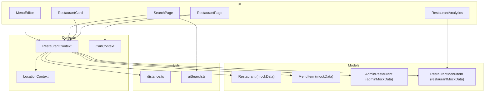
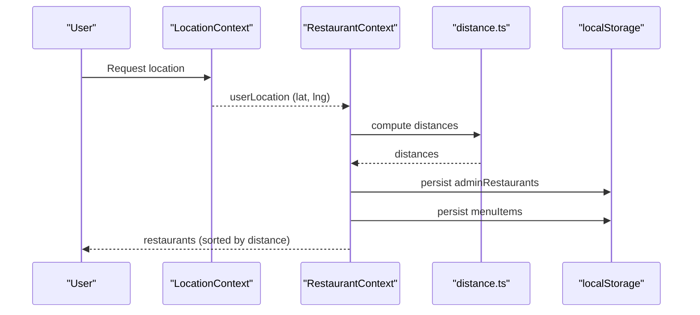
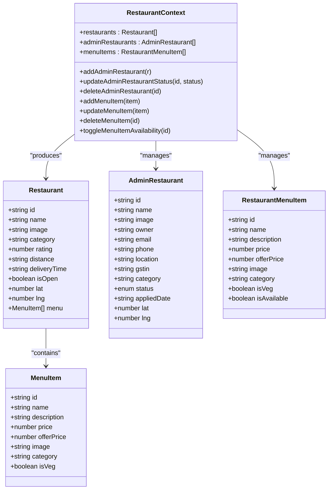
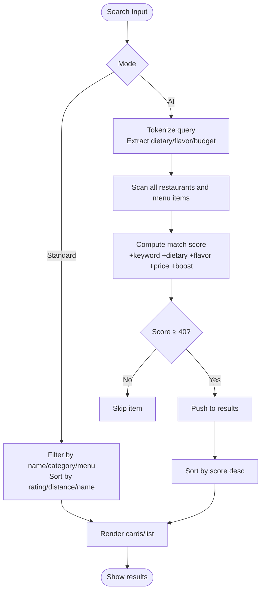
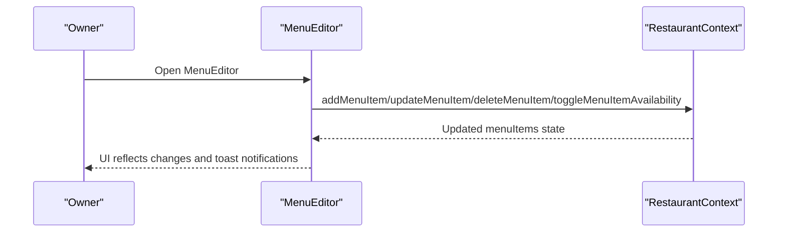
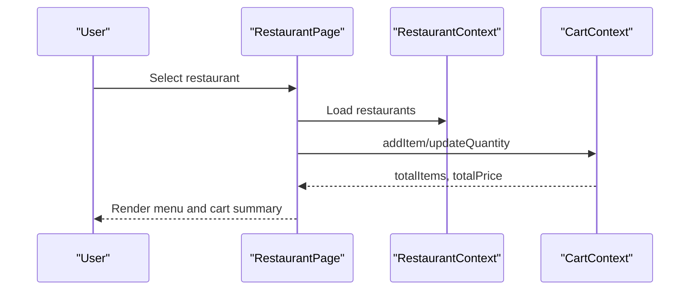
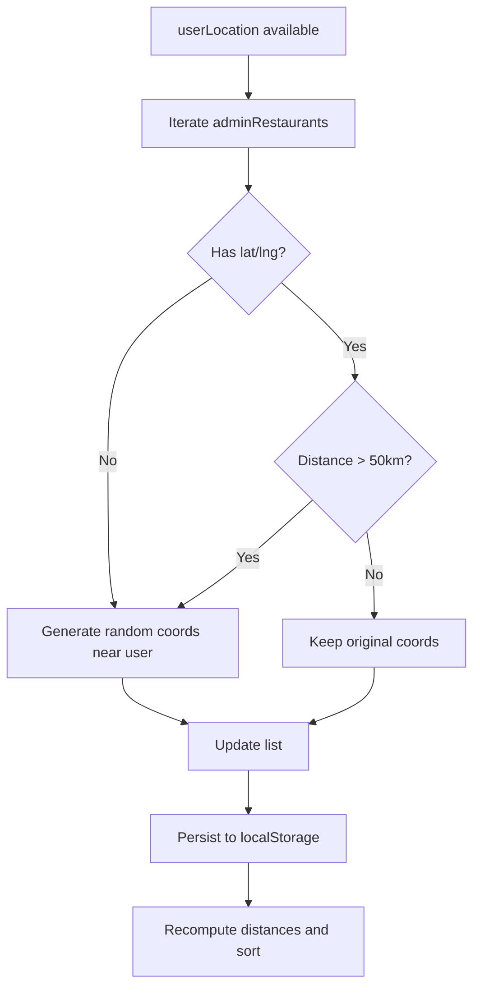
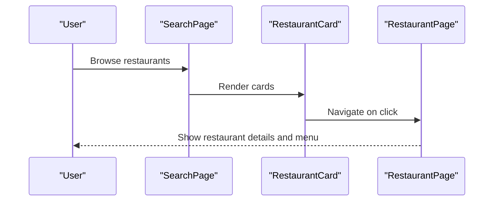
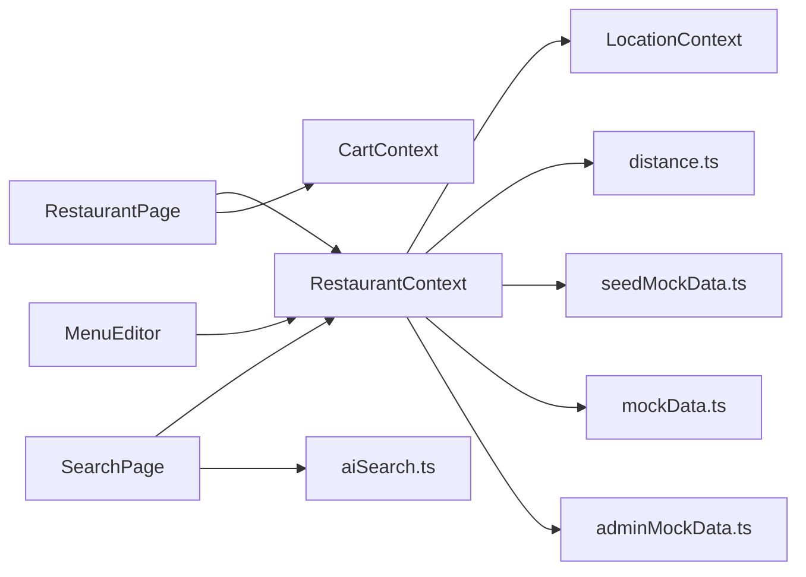

# Restaurant Context

<cite>
**Referenced Files in This Document**
- [RestaurantContext.tsx](file://src/context/RestaurantContext.tsx)
- [RestaurantCard.tsx](file://src/components/RestaurantCard.tsx)
- [RestaurantPage.tsx](file://src/pages/RestaurantPage.tsx)
- [MenuEditor.tsx](file://src/pages/restaurant/MenuEditor.tsx)
- [RestaurantAnalytics.tsx](file://src/pages/restaurant/RestaurantAnalytics.tsx)
- [mockData.ts](file://src/data/mockData.ts)
- [restaurantMockData.ts](file://src/data/restaurantMockData.ts)
- [adminMockData.ts](file://src/data/adminMockData.ts)
- [seedMockData.ts](file://src/data/seedMockData.ts)
- [distance.ts](file://src/utils/distance.ts)
- [CartContext.tsx](file://src/context/CartContext.tsx)
- [LocationContext.tsx](file://src/context/LocationContext.tsx)
- [SearchPage.tsx](file://src/pages/SearchPage.tsx)
- [aiSearch.ts](file://src/utils/aiSearch.ts)
</cite>

## Table of Contents
1. [Introduction](#introduction)
2. [Project Structure](#project-structure)
3. [Core Components](#core-components)
4. [Architecture Overview](#architecture-overview)
5. [Detailed Component Analysis](#detailed-component-analysis)
6. [Dependency Analysis](#dependency-analysis)
7. [Performance Considerations](#performance-considerations)
8. [Troubleshooting Guide](#troubleshooting-guide)
9. [Conclusion](#conclusion)
10. [Appendices](#appendices)

## Introduction
This document explains the Restaurant Context that powers restaurant data, discovery, and management in TIPPAY. It covers the Restaurant interface and menu model, search and filtering, category-based discovery, recommendation algorithms, data loading and caching, real-time updates, owner integrations, menu management, analytics, and the relationship between Restaurant Context, Cart Context, and Location Context.

## Project Structure
The restaurant domain spans context providers, data models, UI components, and utility functions:
- Contexts: RestaurantContext, CartContext, LocationContext
- Data models: Restaurant, MenuItem, AdminRestaurant, RestaurantMenuItem
- Pages and components: RestaurantPage, RestaurantCard, MenuEditor, RestaurantAnalytics, SearchPage
- Utilities: distance calculations, AI-powered search

**Diagram sources**
- [RestaurantContext.tsx:1-162](file://src/context/RestaurantContext.tsx#L1-L162)
- [RestaurantPage.tsx:1-456](file://src/pages/RestaurantPage.tsx#L1-L456)
- [RestaurantCard.tsx:1-64](file://src/components/RestaurantCard.tsx#L1-L64)
- [SearchPage.tsx:1-264](file://src/pages/SearchPage.tsx#L1-L264)
- [MenuEditor.tsx:1-218](file://src/pages/restaurant/MenuEditor.tsx#L1-L218)
- [RestaurantAnalytics.tsx:1-163](file://src/pages/restaurant/RestaurantAnalytics.tsx#L1-L163)
- [mockData.ts:1-326](file://src/data/mockData.ts#L1-L326)
- [restaurantMockData.ts:1-215](file://src/data/restaurantMockData.ts#L1-L215)
- [adminMockData.ts:1-101](file://src/data/adminMockData.ts#L1-L101)
- [seedMockData.ts:1-50](file://src/data/seedMockData.ts#L1-L50)
- [distance.ts:1-34](file://src/utils/distance.ts#L1-L34)
- [aiSearch.ts:1-152](file://src/utils/aiSearch.ts#L1-L152)

**Section sources**
- [RestaurantContext.tsx:1-162](file://src/context/RestaurantContext.tsx#L1-L162)
- [mockData.ts:1-326](file://src/data/mockData.ts#L1-L326)
- [adminMockData.ts:1-101](file://src/data/adminMockData.ts#L1-L101)
- [restaurantMockData.ts:1-215](file://src/data/restaurantMockData.ts#L1-L215)
- [seedMockData.ts:1-50](file://src/data/seedMockData.ts#L1-L50)
- [distance.ts:1-34](file://src/utils/distance.ts#L1-L34)
- [CartContext.tsx:1-64](file://src/context/CartContext.tsx#L1-L64)
- [LocationContext.tsx:1-63](file://src/context/LocationContext.tsx#L1-L63)
- [SearchPage.tsx:1-264](file://src/pages/SearchPage.tsx#L1-L264)
- [aiSearch.ts:1-152](file://src/utils/aiSearch.ts#L1-L152)

## Core Components
- RestaurantContext: Central provider for restaurants, admin restaurants, and menu items; exposes CRUD operations for admin restaurants and menu items; derives computed restaurant lists with distance, rating, and menu composition; persists state to localStorage; integrates with LocationContext for proximity updates.
- Restaurant model: Includes identity, branding, category, rating, distance, delivery time, open status, optional geocoordinates, and a menu of items.
- MenuItem model: Includes identity, name, description, pricing, offer pricing, image, category, and dietary flag.
- AdminRestaurant model: Owner and registration metadata, plus approval status and optional geocoordinates.
- RestaurantMenuItem model: Owner/menu management model with availability flag.
- CartContext: Manages per-item quantities, totals, and cross-item restaurant association for ordering.
- LocationContext: Provides current user location detection and state.
- SearchPage: Implements standard and AI-powered search with sorting and recommendations.
- AI search: Token-based matching with dietary, flavor, and budget filters.
- RestaurantPage: Renders restaurant details, offers, reviews, and menu with add-to-cart and buy-now actions.
- MenuEditor: Allows owners to manage menu items (add/edit/delete/toggle availability).
- RestaurantAnalytics: Visualizes orders, revenue, and popular items over time.

**Section sources**
- [RestaurantContext.tsx:21-162](file://src/context/RestaurantContext.tsx#L21-L162)
- [mockData.ts:24-36](file://src/data/mockData.ts#L24-L36)
- [mockData.ts:13-22](file://src/data/mockData.ts#L13-L22)
- [adminMockData.ts:8-22](file://src/data/adminMockData.ts#L8-L22)
- [restaurantMockData.ts:4-14](file://src/data/restaurantMockData.ts#L4-L14)
- [CartContext.tsx:4-18](file://src/context/CartContext.tsx#L4-L18)
- [LocationContext.tsx:4-13](file://src/context/LocationContext.tsx#L4-L13)
- [SearchPage.tsx:13-264](file://src/pages/SearchPage.tsx#L13-L264)
- [aiSearch.ts:3-9](file://src/utils/aiSearch.ts#L3-L9)
- [RestaurantPage.tsx:14-456](file://src/pages/RestaurantPage.tsx#L14-L456)
- [MenuEditor.tsx:30-218](file://src/pages/restaurant/MenuEditor.tsx#L30-L218)
- [RestaurantAnalytics.tsx:24-163](file://src/pages/restaurant/RestaurantAnalytics.tsx#L24-L163)

## Architecture Overview
The Restaurant Context orchestrates restaurant data flow:
- Data sources: mockData for restaurants and categories, adminMockData for approvals, restaurantMockData for menu analytics, seedMockData to bootstrap admin restaurants and menu items.
- Real-time updates: On user location change, admin restaurants are adjusted with randomized coordinates within a threshold and re-sorted by distance.
- Caching: LocalStorage-backed persistence for admin restaurants and menu items.
- Discovery: Standard search across restaurant name, category, and menu items; AI-powered smart search scoring matches.
- Ordering: RestaurantPage integrates with CartContext to add items and proceed to checkout.
- Owner features: MenuEditor and RestaurantAnalytics pages enable menu management and performance insights.

**Diagram sources**
- [RestaurantContext.tsx:49-74](file://src/context/RestaurantContext.tsx#L49-L74)
- [distance.ts:1-34](file://src/utils/distance.ts#L1-L34)
- [LocationContext.tsx:21-49](file://src/context/LocationContext.tsx#L21-L49)

**Section sources**
- [RestaurantContext.tsx:36-162](file://src/context/RestaurantContext.tsx#L36-L162)
- [seedMockData.ts:11-49](file://src/data/seedMockData.ts#L11-L49)
- [distance.ts:1-34](file://src/utils/distance.ts#L1-L34)
- [LocationContext.tsx:17-63](file://src/context/LocationContext.tsx#L17-L63)

## Detailed Component Analysis

### Restaurant Context and Data Models
RestaurantContext defines the contract and lifecycle for restaurant data:
- State: adminRestaurants, menuItems, derived restaurants.
- Actions: add/update/delete admin restaurants; add/update/delete/toggle menu items.
- Derived computations: distance calculation, menu projection, sorting by distance.
- Persistence: localStorage reads/writes for adminRestaurants and menuItems.
- Integration: consumes userLocation from LocationContext and recomputes nearby coordinates.

**Diagram sources**
- [RestaurantContext.tsx:21-162](file://src/context/RestaurantContext.tsx#L21-L162)
- [mockData.ts:24-36](file://src/data/mockData.ts#L24-L36)
- [mockData.ts:13-22](file://src/data/mockData.ts#L13-L22)
- [adminMockData.ts:8-22](file://src/data/adminMockData.ts#L8-L22)
- [restaurantMockData.ts:4-14](file://src/data/restaurantMockData.ts#L4-L14)

**Section sources**
- [RestaurantContext.tsx:21-162](file://src/context/RestaurantContext.tsx#L21-L162)
- [mockData.ts:24-36](file://src/data/mockData.ts#L24-L36)
- [adminMockData.ts:8-22](file://src/data/adminMockData.ts#L8-L22)
- [restaurantMockData.ts:4-14](file://src/data/restaurantMockData.ts#L4-L14)

### Restaurant Discovery and Filtering
- Standard search: Filters restaurants by name, category, or menu item name; supports sorting by rating, distance, or name.
- AI-powered search: Tokenizes queries, applies dietary, flavor, and budget filters, computes match scores, and ranks results with reasons.

**Diagram sources**
- [SearchPage.tsx:26-45](file://src/pages/SearchPage.tsx#L26-L45)
- [aiSearch.ts:11-151](file://src/utils/aiSearch.ts#L11-L151)

**Section sources**
- [SearchPage.tsx:13-264](file://src/pages/SearchPage.tsx#L13-L264)
- [aiSearch.ts:11-152](file://src/utils/aiSearch.ts#L11-L152)

### Menu Management and Owner Workflows
- MenuEditor enables owners to add, edit, delete, and toggle availability of menu items; maintains categories and displays items grouped by category; uses local toast feedback.
- RestaurantAnalytics visualizes orders, revenue, and popular items across daily/weekly/monthly/yearly periods with charts.

**Diagram sources**
- [MenuEditor.tsx:30-94](file://src/pages/restaurant/MenuEditor.tsx#L30-L94)
- [RestaurantContext.tsx:76-94](file://src/context/RestaurantContext.tsx#L76-L94)

**Section sources**
- [MenuEditor.tsx:30-218](file://src/pages/restaurant/MenuEditor.tsx#L30-L218)
- [RestaurantAnalytics.tsx:24-163](file://src/pages/restaurant/RestaurantAnalytics.tsx#L24-L163)
- [RestaurantContext.tsx:76-94](file://src/context/RestaurantContext.tsx#L76-L94)

### Restaurant Page and Ordering Integration
- RestaurantPage loads a selected restaurant, renders offers, reviews, and menu organized by category.
- Integrates with CartContext to add items, adjust quantities, and navigate to checkout.
- Supports favorites toggling and localized pricing.

**Diagram sources**
- [RestaurantPage.tsx:14-61](file://src/pages/RestaurantPage.tsx#L14-L61)
- [CartContext.tsx:25-50](file://src/context/CartContext.tsx#L25-L50)
- [RestaurantContext.tsx:137-142](file://src/context/RestaurantContext.tsx#L137-L142)

**Section sources**
- [RestaurantPage.tsx:14-456](file://src/pages/RestaurantPage.tsx#L14-L456)
- [CartContext.tsx:1-64](file://src/context/CartContext.tsx#L1-L64)

### Proximity-Based Discovery and Real-Time Updates
- On receiving userLocation, RestaurantContext recalculates distances and may adjust admin restaurant coordinates within a radius, then sorts restaurants by distance.
- Uses distance.ts for Haversine distance and coordinate generation.

**Diagram sources**
- [RestaurantContext.tsx:49-66](file://src/context/RestaurantContext.tsx#L49-L66)
- [distance.ts:19-33](file://src/utils/distance.ts#L19-L33)

**Section sources**
- [RestaurantContext.tsx:49-74](file://src/context/RestaurantContext.tsx#L49-L74)
- [distance.ts:1-34](file://src/utils/distance.ts#L1-34)

### Restaurant Card and Selection Workflow
- RestaurantCard renders restaurant preview with rating, delivery time, distance, and open status; clicking navigates to RestaurantPage.

**Diagram sources**
- [SearchPage.tsx:120-129](file://src/pages/SearchPage.tsx#L120-L129)
- [RestaurantCard.tsx:11-20](file://src/components/RestaurantCard.tsx#L11-L20)
- [RestaurantPage.tsx:19-26](file://src/pages/RestaurantPage.tsx#L19-L26)

**Section sources**
- [RestaurantCard.tsx:11-64](file://src/components/RestaurantCard.tsx#L11-L64)
- [SearchPage.tsx:120-129](file://src/pages/SearchPage.tsx#L120-L129)

## Dependency Analysis
- RestaurantContext depends on:
  - LocationContext for userLocation
  - distance.ts for proximity calculations
  - localStorage for persistence
  - seedMockData for initial seeding of admin restaurants and menu items
  - mockData and adminMockData for base models and categories
- RestaurantPage depends on CartContext and ReviewContext for ordering and reviews.
- SearchPage depends on RestaurantContext and aiSearch for discovery.
- MenuEditor depends on RestaurantContext for owner operations.

**Diagram sources**
- [RestaurantContext.tsx:1-10](file://src/context/RestaurantContext.tsx#L1-L10)
- [seedMockData.ts:1-6](file://src/data/seedMockData.ts#L1-L6)
- [SearchPage.tsx:4-8](file://src/pages/SearchPage.tsx#L4-L8)
- [aiSearch.ts:1-2](file://src/utils/aiSearch.ts#L1-L2)

**Section sources**
- [RestaurantContext.tsx:1-10](file://src/context/RestaurantContext.tsx#L1-L10)
- [seedMockData.ts:1-6](file://src/data/seedMockData.ts#L1-L6)
- [SearchPage.tsx:4-8](file://src/pages/SearchPage.tsx#L4-L8)
- [aiSearch.ts:1-2](file://src/utils/aiSearch.ts#L1-L2)

## Performance Considerations
- Sorting by distance: O(n log n) for derived restaurants; consider memoization if restaurants list is large.
- AI search: O(R × M) where R is restaurants and M is menu items; consider precomputing indices or debouncing queries.
- Rendering: RestaurantCard and RestaurantPage use animations; batch updates and avoid unnecessary re-renders.
- Storage: LocalStorage writes occur on state changes; throttle to reduce write frequency.

## Troubleshooting Guide
- Location not detected: Verify geolocation permissions and error handling in LocationContext.
- Restaurants not updating: Ensure userLocation is set and useEffect triggers distance recalculation.
- Menu changes not persisted: Confirm localStorage keys and write effects in RestaurantContext.
- AI search returns no results: Adjust query keywords or relax budget thresholds.

**Section sources**
- [LocationContext.tsx:21-49](file://src/context/LocationContext.tsx#L21-L49)
- [RestaurantContext.tsx:51-66](file://src/context/RestaurantContext.tsx#L51-L66)
- [RestaurantContext.tsx:68-74](file://src/context/RestaurantContext.tsx#L68-L74)
- [aiSearch.ts:11-151](file://src/utils/aiSearch.ts#L11-L151)

## Conclusion
The Restaurant Context centralizes restaurant data, discovery, and owner operations in TIPPAY. It combines static and dynamic data, integrates location-awareness, and provides robust search and ordering experiences. The modular design allows for easy extension of features like recommendation algorithms, analytics dashboards, and advanced filtering.

## Appendices
- Example data seeds: Admin restaurants and menu items are seeded from mock catalogs for consistent demo environments.
- Mock categories: Comprehensive category list supports diverse cuisines and quick discovery.

**Section sources**
- [seedMockData.ts:11-49](file://src/data/seedMockData.ts#L11-L49)
- [mockData.ts:63-129](file://src/data/mockData.ts#L63-L129)