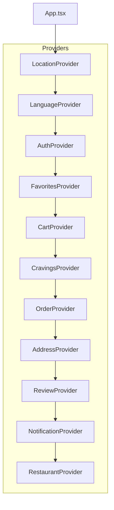
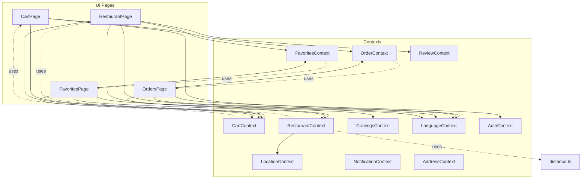
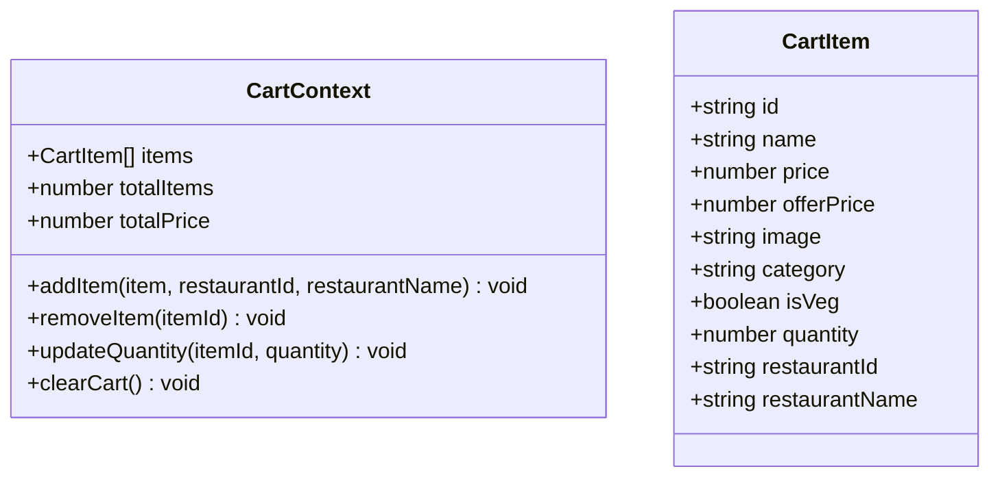
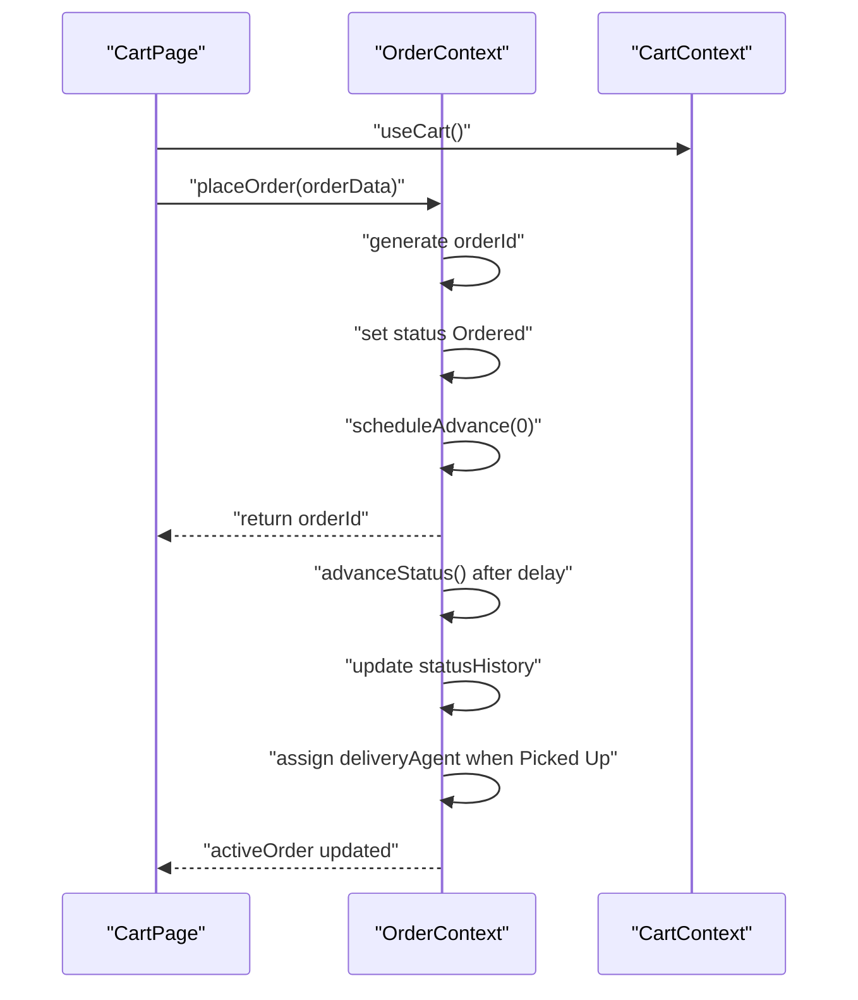
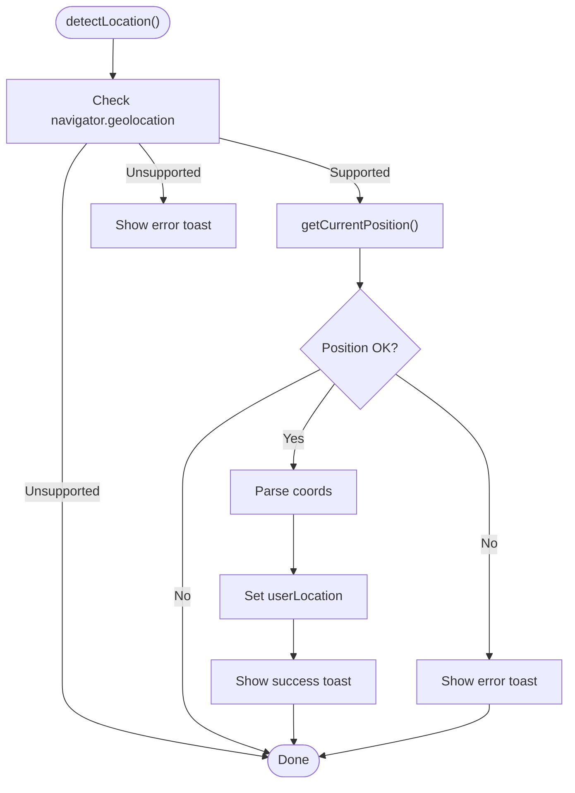
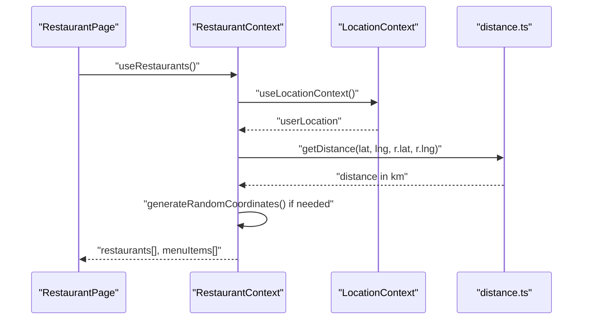
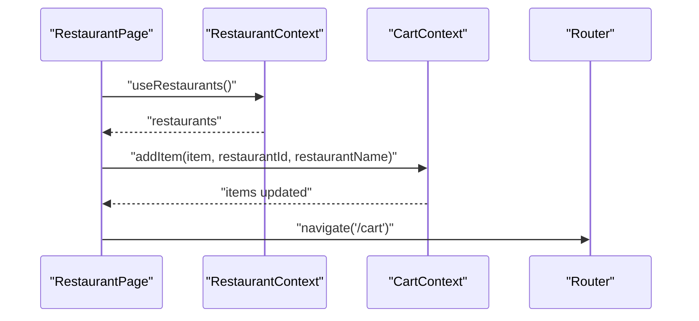
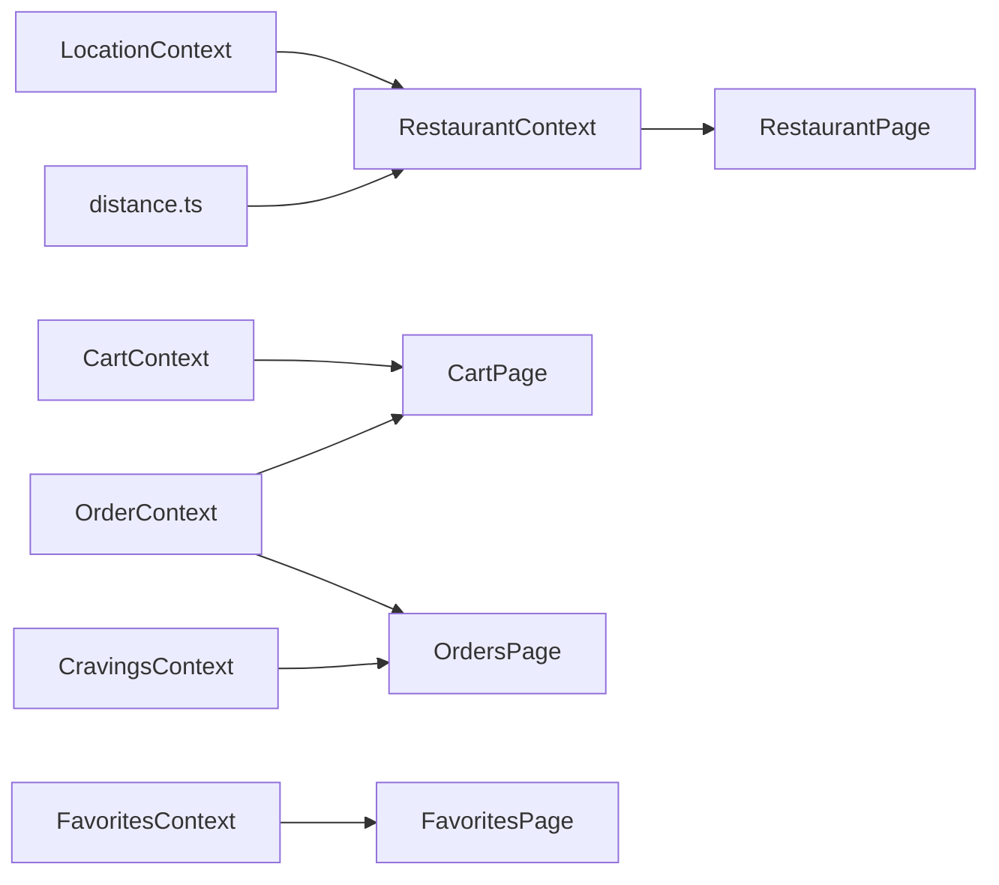

# State Management System

<cite>
**Referenced Files in This Document**
- [App.tsx](file://src/App.tsx)
- [CartContext.tsx](file://src/context/CartContext.tsx)
- [OrderContext.tsx](file://src/context/OrderContext.tsx)
- [LocationContext.tsx](file://src/context/LocationContext.tsx)
- [RestaurantContext.tsx](file://src/context/RestaurantContext.tsx)
- [FavoritesContext.tsx](file://src/context/FavoritesContext.tsx)
- [CravingsContext.tsx](file://src/context/CravingsContext.tsx)
- [ReviewContext.tsx](file://src/context/ReviewContext.tsx)
- [NotificationContext.tsx](file://src/context/NotificationContext.tsx)
- [distance.ts](file://src/utils/distance.ts)
- [CartPage.tsx](file://src/pages/CartPage.tsx)
- [OrdersPage.tsx](file://src/pages/OrdersPage.tsx)
- [RestaurantPage.tsx](file://src/pages/RestaurantPage.tsx)
- [FavoritesPage.tsx](file://src/pages/FavoritesPage.tsx)
</cite>

## Table of Contents
1. [Introduction](#introduction)
2. [Project Structure](#project-structure)
3. [Core Components](#core-components)
4. [Architecture Overview](#architecture-overview)
5. [Detailed Component Analysis](#detailed-component-analysis)
6. [Dependency Analysis](#dependency-analysis)
7. [Performance Considerations](#performance-considerations)
8. [Troubleshooting Guide](#troubleshooting-guide)
9. [Conclusion](#conclusion)

## Introduction
This document explains TIPPAY’s Context API-based state management system. It focuses on independent context providers and their responsibilities, including CartContext for shopping operations, OrderContext for order lifecycle management, LocationContext for geolocation services, RestaurantContext for restaurant data, and FavoritesContext for user preferences. It documents state update patterns, data flow between contexts, and inter-context communication. It also covers complex state operations such as cart item management, order status progression, and real-time location updates, along with best practices for context usage, performance optimization, and avoiding unnecessary re-renders.

## Project Structure
TIPPAY organizes state via independent React Context providers wrapped around the routing tree. Providers are composed in App.tsx to create a layered state environment. Each provider encapsulates a domain-specific state and exposes a typed hook for consumption.

**Diagram sources**
- [App.tsx:124-162](file://src/App.tsx#L124-L162)

**Section sources**
- [App.tsx:124-162](file://src/App.tsx#L124-L162)

## Core Components
This section introduces the primary state-managed domains and their responsibilities.

- CartContext: Manages shopping cart items, quantities, totals, and clears the cart. Provides add, remove, update quantity, and clear operations.
- OrderContext: Manages live orders, places new orders, tracks status progression, and supports cancellation. Uses timers to advance statuses automatically.
- LocationContext: Handles user geolocation detection with permission handling and loading states.
- RestaurantContext: Derives restaurant lists from admin restaurants and menu items, integrates with LocationContext for dynamic distances, and persists to localStorage.
- FavoritesContext: Tracks user favorite food IDs with persistence and toggling helpers.

**Section sources**
- [CartContext.tsx:1-64](file://src/context/CartContext.tsx#L1-L64)
- [OrderContext.tsx:1-138](file://src/context/OrderContext.tsx#L1-L138)
- [LocationContext.tsx:1-63](file://src/context/LocationContext.tsx#L1-L63)
- [RestaurantContext.tsx:1-162](file://src/context/RestaurantContext.tsx#L1-L162)
- [FavoritesContext.tsx:1-45](file://src/context/FavoritesContext.tsx#L1-L45)

## Architecture Overview
The state architecture is provider-centric and layered. Providers are composed in App.tsx to ensure all pages and components can consume state from any context. RestaurantContext depends on LocationContext for proximity calculations and uses localStorage for persistence. CartContext and OrderContext coordinate during checkout to finalize an order and reset cart state.

**Diagram sources**
- [App.tsx:124-162](file://src/App.tsx#L124-L162)
- [CartPage.tsx:1-366](file://src/pages/CartPage.tsx#L1-L366)
- [OrdersPage.tsx:1-295](file://src/pages/OrdersPage.tsx#L1-L295)
- [RestaurantPage.tsx:1-253](file://src/pages/RestaurantPage.tsx#L1-L253)
- [FavoritesPage.tsx:1-174](file://src/pages/FavoritesPage.tsx#L1-L174)
- [RestaurantContext.tsx:1-162](file://src/context/RestaurantContext.tsx#L1-L162)
- [distance.ts:1-34](file://src/utils/distance.ts#L1-L34)

## Detailed Component Analysis

### CartContext
Responsibilities:
- Maintain a list of CartItem entries with quantity, restaurant metadata, and pricing.
- Provide add/remove/update/clear operations.
- Compute total items and total price.

Key patterns:
- Uses memoized callbacks for action functions to prevent re-renders.
- Calculates derived totals on render to keep consumers simple.

**Diagram sources**
- [CartContext.tsx:4-18](file://src/context/CartContext.tsx#L4-L18)

**Section sources**
- [CartContext.tsx:22-63](file://src/context/CartContext.tsx#L22-L63)

### OrderContext
Responsibilities:
- Manage LiveOrder lifecycle: place, fetch, cancel, and track status history.
- Automatically advance order status through a fixed flow with randomized delays.
- Assign delivery agents upon reaching a specific status.

Key patterns:
- Uses a ref to track timers per order and clears them on cancel or unmount.
- Maintains status history for auditability.
- Exposes active order derived from latest non-Delivered order.

**Diagram sources**
- [CartPage.tsx:103-132](file://src/pages/CartPage.tsx#L103-L132)
- [OrderContext.tsx:41-131](file://src/context/OrderContext.tsx#L41-L131)

**Section sources**
- [OrderContext.tsx:27-131](file://src/context/OrderContext.tsx#L27-L131)

### LocationContext
Responsibilities:
- Detect user location via browser Geolocation API.
- Manage loading state and show toast feedback.
- Provide structured LocationData.

Key patterns:
- Guarded API usage with fallbacks and error handling.
- Uses async/await with a Promise wrapper for geolocation.

**Diagram sources**
- [LocationContext.tsx:21-49](file://src/context/LocationContext.tsx#L21-L49)

**Section sources**
- [LocationContext.tsx:9-62](file://src/context/LocationContext.tsx#L9-L62)

### RestaurantContext
Responsibilities:
- Persist admin restaurants and menu items to localStorage.
- Derive Restaurant list from admin restaurants and menu items.
- Integrate with LocationContext to compute and adjust distances.
- Provide CRUD-like actions for admin restaurants and menu items.

Key patterns:
- Reads stored data on mount; falls back to mock seeds when enabled.
- On user location change, recalculates distances and may jitter coordinates to simulate realistic movement.
- Converts menu items to MenuItem for UI rendering.

**Diagram sources**
- [RestaurantContext.tsx:49-142](file://src/context/RestaurantContext.tsx#L49-L142)
- [distance.ts:1-34](file://src/utils/distance.ts#L1-L34)

**Section sources**
- [RestaurantContext.tsx:36-162](file://src/context/RestaurantContext.tsx#L36-L162)

### FavoritesContext
Responsibilities:
- Track favorite food IDs with persistence.
- Toggle favorites and check favorite status.

Key patterns:
- Persists to localStorage on changes.
- Exposes helpers for UI toggles and checks.

**Section sources**
- [FavoritesContext.tsx:11-44](file://src/context/FavoritesContext.tsx#L11-L44)

### Inter-Context Communication Examples
- Cart to Order: CartPage consumes CartContext and OrderContext to place an order and navigate to the order tracking page.
- Restaurant to Cart: RestaurantPage adds items to CartContext and navigates to CartPage.
- Favorites to Cart: FavoritesPage reads favorites and adds matching items to CartContext.

**Diagram sources**
- [RestaurantPage.tsx:13-43](file://src/pages/RestaurantPage.tsx#L13-L43)
- [RestaurantContext.tsx:155-161](file://src/context/RestaurantContext.tsx#L155-L161)
- [CartContext.tsx:59-63](file://src/context/CartContext.tsx#L59-L63)

**Section sources**
- [CartPage.tsx:103-132](file://src/pages/CartPage.tsx#L103-L132)
- [RestaurantPage.tsx:13-43](file://src/pages/RestaurantPage.tsx#L13-L43)
- [FavoritesPage.tsx:27-34](file://src/pages/FavoritesPage.tsx#L27-L34)

## Dependency Analysis
- Provider composition order matters: LocationProvider and LanguageProvider wrap AuthProvider, which wraps FavoritesProvider, CartProvider, CravingsProvider, OrderProvider, AddressProvider, ReviewProvider, NotificationProvider, and RestaurantProvider. This ensures downstream contexts can depend on upstream ones (e.g., RestaurantContext depends on LocationContext).
- RestaurantContext depends on distance utilities for proximity computations.
- CartPage depends on CartContext and OrderContext for checkout flow.
- OrdersPage depends on OrderContext and CravingsContext for order and craving listings.

**Diagram sources**
- [App.tsx:124-162](file://src/App.tsx#L124-L162)
- [RestaurantContext.tsx:49-142](file://src/context/RestaurantContext.tsx#L49-L142)
- [distance.ts:1-34](file://src/utils/distance.ts#L1-L34)
- [CartPage.tsx:1-366](file://src/pages/CartPage.tsx#L1-L366)
- [OrdersPage.tsx:1-295](file://src/pages/OrdersPage.tsx#L1-L295)
- [FavoritesPage.tsx:1-174](file://src/pages/FavoritesPage.tsx#L1-L174)
- [RestaurantPage.tsx:1-253](file://src/pages/RestaurantPage.tsx#L1-L253)

**Section sources**
- [App.tsx:124-162](file://src/App.tsx#L124-L162)

## Performance Considerations
- Memoization: CartContext uses memoized callbacks for actions to avoid unnecessary re-renders when parent props change.
- Derived computations: CartContext computes totalItems and totalPrice on render; consider extracting to useMemo if the dataset grows large.
- Timers and intervals: OrderContext maintains timers per order; ensure cleanup on cancel and unmount to prevent memory leaks.
- Local storage: RestaurantContext, FavoritesContext, and others persist state; batch writes if frequent updates occur to reduce IO overhead.
- Conditional rendering: Pages like OrdersPage conditionally render tabs; keep heavy computations inside lazy-loaded sections to minimize initial cost.
- Avoid prop drilling: Providers are composed at the root, eliminating deep prop chains and reducing re-renders.

[No sources needed since this section provides general guidance]

## Troubleshooting Guide
Common issues and resolutions:
- Context not wrapped: Using a hook like useCart outside its provider throws an error. Ensure the provider is included in the App tree.
- Geolocation errors: LocationContext handles unsupported browsers and permission denials. Verify browser permissions and network connectivity.
- Order status stuck: If an order does not advance, check timers and logs; ensure scheduleAdvance is invoked after placing an order.
- Favorites not persisting: Confirm localStorage availability and absence of parse errors.
- Restaurant list not updating: Verify LocationContext userLocation is set and RestaurantContext effects are running.

**Section sources**
- [CartContext.tsx:59-63](file://src/context/CartContext.tsx#L59-L63)
- [LocationContext.tsx:21-49](file://src/context/LocationContext.tsx#L21-L49)
- [OrderContext.tsx:86-103](file://src/context/OrderContext.tsx#L86-L103)
- [FavoritesContext.tsx:11-44](file://src/context/FavoritesContext.tsx#L11-L44)
- [RestaurantContext.tsx:49-74](file://src/context/RestaurantContext.tsx#L49-L74)

## Conclusion
TIPPAY’s state management leverages independent, domain-focused Context providers to deliver a clean separation of concerns. CartContext and OrderContext orchestrate the checkout flow, LocationContext powers proximity features, RestaurantContext integrates geolocation and persistence, and FavoritesContext manages user preferences. The provider composition in App.tsx enables seamless inter-context communication, while memoization and careful lifecycle management help maintain performance and reliability.