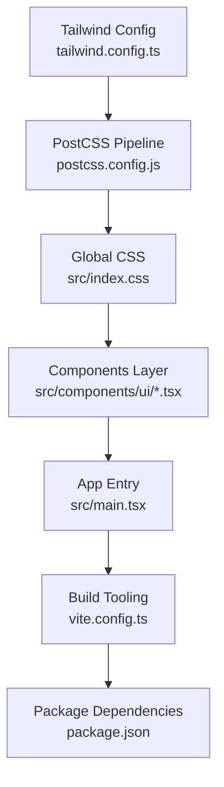
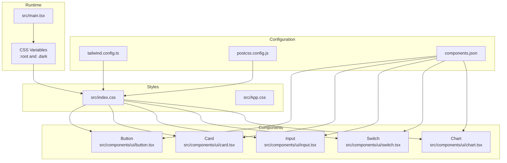
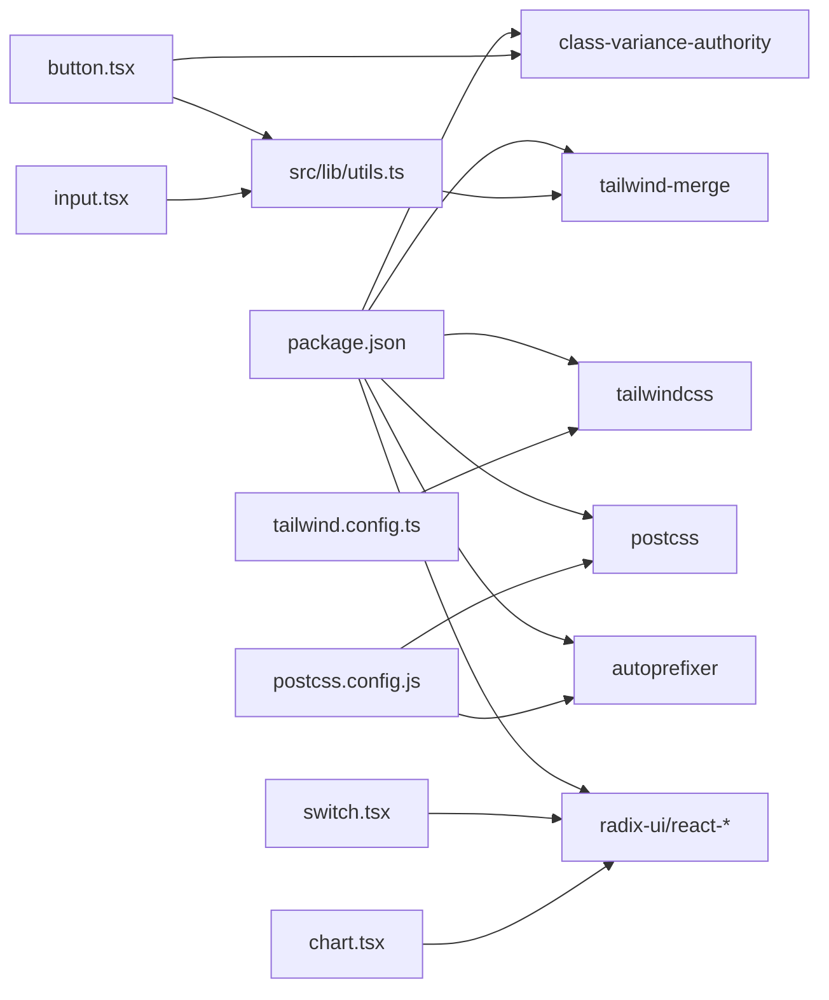

# Styling & Theming

<cite>
**Referenced Files in This Document**
- [tailwind.config.ts](file://tailwind.config.ts)
- [postcss.config.js](file://postcss.config.js)
- [components.json](file://components.json)
- [src/index.css](file://src/index.css)
- [src/App.css](file://src/App.css)
- [src/main.tsx](file://src/main.tsx)
- [src/lib/utils.ts](file://src/lib/utils.ts)
- [src/components/ui/button.tsx](file://src/components/ui/button.tsx)
- [src/components/ui/card.tsx](file://src/components/ui/card.tsx)
- [src/components/ui/input.tsx](file://src/components/ui/input.tsx)
- [src/components/ui/switch.tsx](file://src/components/ui/switch.tsx)
- [src/components/ui/chart.tsx](file://src/components/ui/chart.tsx)
- [src/pages/HomePage.tsx](file://src/pages/HomePage.tsx)
- [src/pages/ProfilePage.tsx](file://src/pages/ProfilePage.tsx)
- [package.json](file://package.json)
- [vite.config.ts](file://vite.config.ts)
</cite>

## Table of Contents
1. [Introduction](#introduction)
2. [Project Structure](#project-structure)
3. [Core Components](#core-components)
4. [Architecture Overview](#architecture-overview)
5. [Detailed Component Analysis](#detailed-component-analysis)
6. [Dependency Analysis](#dependency-analysis)
7. [Performance Considerations](#performance-considerations)
8. [Troubleshooting Guide](#troubleshooting-guide)
9. [Conclusion](#conclusion)

## Introduction
This document explains TIPPAY’s styling and theming system built with Tailwind CSS and shadcn/ui. It covers Tailwind configuration, custom theme variables, color schemes, responsive breakpoints, dark mode implementation, theme switching, and accessibility considerations. It also documents component customization patterns, CSS utility usage, build and optimization strategies, and browser compatibility.

## Project Structure
The styling pipeline is organized around:
- Tailwind configuration extending design tokens and animations
- PostCSS pipeline enabling Tailwind and Autoprefixer
- shadcn/ui component library configured with CSS variables and TSX support
- Global CSS layers defining base styles, utilities, and theme tokens
- Utility helpers for merging Tailwind classes
- UI components leveraging design tokens and variants

**Diagram sources**
- [tailwind.config.ts:1-123](file://tailwind.config.ts#L1-L123)
- [postcss.config.js:1-7](file://postcss.config.js#L1-L7)
- [src/index.css:1-105](file://src/index.css#L1-L105)
- [src/main.tsx:1-10](file://src/main.tsx#L1-L10)
- [vite.config.ts:1-21](file://vite.config.ts#L1-L21)
- [package.json:1-94](file://package.json#L1-L94)

**Section sources**
- [tailwind.config.ts:1-123](file://tailwind.config.ts#L1-L123)
- [postcss.config.js:1-7](file://postcss.config.js#L1-L7)
- [components.json:1-21](file://components.json#L1-L21)
- [src/index.css:1-105](file://src/index.css#L1-L105)
- [src/main.tsx:1-10](file://src/main.tsx#L1-L10)
- [vite.config.ts:1-21](file://vite.config.ts#L1-L21)
- [package.json:1-94](file://package.json#L1-L94)

## Core Components
- Tailwind configuration defines dark mode strategy, content scanning, container sizing, typography, color palette, border radius, and keyframe animations.
- Global CSS establishes CSS variables for theme tokens, base layer styles, and utility classes.
- shadcn/ui components integrate design tokens via CSS variables and variant systems.
- Utilities merge Tailwind classes deterministically.

Key implementation references:
- Tailwind theme extensions and tokens: [tailwind.config.ts:15-120](file://tailwind.config.ts#L15-L120)
- Theme tokens and dark overrides: [src/index.css:7-84](file://src/index.css#L7-L84)
- Base and utility layers: [src/index.css:86-104](file://src/index.css#L86-L104)
- Utility class merging: [src/lib/utils.ts:1-7](file://src/lib/utils.ts#L1-L7)

**Section sources**
- [tailwind.config.ts:15-120](file://tailwind.config.ts#L15-L120)
- [src/index.css:7-84](file://src/index.css#L7-L84)
- [src/index.css:86-104](file://src/index.css#L86-L104)
- [src/lib/utils.ts:1-7](file://src/lib/utils.ts#L1-L7)

## Architecture Overview
The theming architecture ties together configuration, tokens, components, and runtime theme switching.

**Diagram sources**
- [tailwind.config.ts:1-123](file://tailwind.config.ts#L1-L123)
- [postcss.config.js:1-7](file://postcss.config.js#L1-L7)
- [components.json:1-21](file://components.json#L1-L21)
- [src/index.css:1-105](file://src/index.css#L1-L105)
- [src/App.css:1-43](file://src/App.css#L1-L43)
- [src/main.tsx:1-10](file://src/main.tsx#L1-L10)
- [src/components/ui/button.tsx:1-48](file://src/components/ui/button.tsx#L1-L48)
- [src/components/ui/card.tsx:1-44](file://src/components/ui/card.tsx#L1-L44)
- [src/components/ui/input.tsx:1-23](file://src/components/ui/input.tsx#L1-L23)
- [src/components/ui/switch.tsx:1-28](file://src/components/ui/switch.tsx#L1-L28)
- [src/components/ui/chart.tsx:1-124](file://src/components/ui/chart.tsx#L1-L124)

## Detailed Component Analysis

### Tailwind Configuration and Tokens
- Dark mode uses the class strategy targeting the html element.
- Content scanning includes pages, components, app, and src directories.
- Typography extends sans and display fonts.
- Color palette maps to CSS variables for semantic roles (background, foreground, primary, secondary, muted, accent, destructive, popover, card, sidebar).
- Custom brand tokens (wheat, gold, success, warning, info) are defined with light/dark variants.
- Border radius uses a CSS variable for consistent scaling.
- Animations include accordion transitions, fade-in, slide-up, and scale-in.

References:
- [tailwind.config.ts:3-122](file://tailwind.config.ts#L3-L122)

**Section sources**
- [tailwind.config.ts:3-122](file://tailwind.config.ts#L3-L122)

### Global CSS Layers and Theme Tokens
- CSS variables define light and dark themes under :root and .dark selectors.
- Base layer applies borders, background, and text colors globally.
- Display headings use a dedicated display font.
- Utility layer adds a text-balance utility.

References:
- [src/index.css:7-98](file://src/index.css#L7-L98)
- [src/index.css:100-104](file://src/index.css#L100-L104)

**Section sources**
- [src/index.css:7-98](file://src/index.css#L7-L98)
- [src/index.css:100-104](file://src/index.css#L100-L104)

### shadcn/ui Integration and Component Customization
- Components use class merging utilities and variant systems to align with design tokens.
- Buttons leverage variant props and size props mapped to tokens.
- Cards apply semantic tokens for background and text.
- Inputs inherit border and background tokens.
- Switch toggles use primary/accent tokens for checked/unchecked states.
- Charts dynamically set CSS variables per theme.

References:
- [src/components/ui/button.tsx:1-48](file://src/components/ui/button.tsx#L1-L48)
- [src/components/ui/card.tsx:1-44](file://src/components/ui/card.tsx#L1-L44)
- [src/components/ui/input.tsx:1-23](file://src/components/ui/input.tsx#L1-L23)
- [src/components/ui/switch.tsx:1-28](file://src/components/ui/switch.tsx#L1-L28)
- [src/components/ui/chart.tsx:1-124](file://src/components/ui/chart.tsx#L1-L124)
- [src/lib/utils.ts:1-7](file://src/lib/utils.ts#L1-L7)

**Section sources**
- [src/components/ui/button.tsx:1-48](file://src/components/ui/button.tsx#L1-L48)
- [src/components/ui/card.tsx:1-44](file://src/components/ui/card.tsx#L1-L44)
- [src/components/ui/input.tsx:1-23](file://src/components/ui/input.tsx#L1-L23)
- [src/components/ui/switch.tsx:1-28](file://src/components/ui/switch.tsx#L1-L28)
- [src/components/ui/chart.tsx:1-124](file://src/components/ui/chart.tsx#L1-L124)
- [src/lib/utils.ts:1-7](file://src/lib/utils.ts#L1-L7)

### Dark Mode Implementation and Theme Switching
- Runtime theme detection reads a persisted theme preference and applies the dark class to the root element.
- Theme tokens switch between light and dark values via CSS variables.
- Example usage appears in profile settings with a switch control and button variants reflecting destructive states.

References:
- [src/main.tsx:6-8](file://src/main.tsx#L6-L8)
- [src/index.css:7-84](file://src/index.css#L7-L84)
- [src/pages/ProfilePage.tsx:96-120](file://src/pages/ProfilePage.tsx#L96-L120)

**Section sources**
- [src/main.tsx:6-8](file://src/main.tsx#L6-L8)
- [src/index.css:7-84](file://src/index.css#L7-L84)
- [src/pages/ProfilePage.tsx:96-120](file://src/pages/ProfilePage.tsx#L96-L120)

### Accessibility Considerations
- Focus-visible rings use ring tokens for keyboard navigation affordance.
- Contrast ratios are maintained via foreground/background tokens.
- Semantic roles (primary, secondary, destructive, muted, accent) guide color choices for accessibility.
- Headings use a dedicated display font for readability.

References:
- [src/components/ui/button.tsx:8](file://src/components/ui/button.tsx#L8)
- [src/components/ui/input.tsx:11](file://src/components/ui/input.tsx#L11)
- [src/index.css:95-97](file://src/index.css#L95-L97)

**Section sources**
- [src/components/ui/button.tsx:8](file://src/components/ui/button.tsx#L8)
- [src/components/ui/input.tsx:11](file://src/components/ui/input.tsx#L11)
- [src/index.css:95-97](file://src/index.css#L95-L97)

### Responsive Design Patterns
- Container sizing and padding are defined centrally for consistent spacing.
- Breakpoint targets are tailored for larger screens.
- Components use responsive utilities and variants to adapt layout and typography.

References:
- [tailwind.config.ts:8-14](file://tailwind.config.ts#L8-L14)
- [src/pages/HomePage.tsx:286-301](file://src/pages/HomePage.tsx#L286-L301)

**Section sources**
- [tailwind.config.ts:8-14](file://tailwind.config.ts#L8-L14)
- [src/pages/HomePage.tsx:286-301](file://src/pages/HomePage.tsx#L286-L301)

### Build Process, Optimization, and Browser Compatibility
- PostCSS pipeline enables Tailwind and Autoprefixer.
- Vite resolves aliases and serves the app.
- Package dependencies include Tailwind, Tailwind Merge, class variance authority, and related UI libraries.
- Browser support is implied by Autoprefixer and modern Tailwind features.

References:
- [postcss.config.js:1-7](file://postcss.config.js#L1-L7)
- [vite.config.ts:14-19](file://vite.config.ts#L14-L19)
- [package.json:71-92](file://package.json#L71-L92)

**Section sources**
- [postcss.config.js:1-7](file://postcss.config.js#L1-L7)
- [vite.config.ts:14-19](file://vite.config.ts#L14-L19)
- [package.json:71-92](file://package.json#L71-L92)

## Dependency Analysis
The styling stack depends on Tailwind, PostCSS, and shadcn/ui configuration. Components depend on shared utilities and design tokens.

**Diagram sources**
- [package.json:17-69](file://package.json#L17-L69)
- [tailwind.config.ts:1-123](file://tailwind.config.ts#L1-L123)
- [postcss.config.js:1-7](file://postcss.config.js#L1-L7)
- [src/lib/utils.ts:1-7](file://src/lib/utils.ts#L1-L7)
- [src/components/ui/button.tsx:1-48](file://src/components/ui/button.tsx#L1-L48)
- [src/components/ui/input.tsx:1-23](file://src/components/ui/input.tsx#L1-L23)
- [src/components/ui/switch.tsx:1-28](file://src/components/ui/switch.tsx#L1-L28)
- [src/components/ui/chart.tsx:1-124](file://src/components/ui/chart.tsx#L1-L124)

**Section sources**
- [package.json:17-69](file://package.json#L17-L69)
- [tailwind.config.ts:1-123](file://tailwind.config.ts#L1-L123)
- [postcss.config.js:1-7](file://postcss.config.js#L1-L7)
- [src/lib/utils.ts:1-7](file://src/lib/utils.ts#L1-L7)
- [src/components/ui/button.tsx:1-48](file://src/components/ui/button.tsx#L1-L48)
- [src/components/ui/input.tsx:1-23](file://src/components/ui/input.tsx#L1-L23)
- [src/components/ui/switch.tsx:1-28](file://src/components/ui/switch.tsx#L1-L28)
- [src/components/ui/chart.tsx:1-124](file://src/components/ui/chart.tsx#L1-L124)

## Performance Considerations
- Keep content scanning scoped to relevant directories to minimize rebuilds.
- Prefer CSS variables for theme tokens to avoid duplicating color values.
- Use Tailwind Merge to prevent conflicting classes and reduce CSS bloat.
- Limit heavy animations to interactive states; leverage hardware-accelerated transforms.
- Use responsive utilities judiciously to avoid excessive media queries.

[No sources needed since this section provides general guidance]

## Troubleshooting Guide
- Dark mode not applying: verify the presence of the dark class on the root element and correct CSS variable values in the dark selector.
- Missing shadcn/ui styles: confirm Tailwind config path and CSS variables setting in the shadcn/ui configuration.
- Build errors with Tailwind or PostCSS: ensure plugin versions match configuration and aliases resolve correctly in Vite.

**Section sources**
- [src/main.tsx:6-8](file://src/main.tsx#L6-L8)
- [components.json:6-12](file://components.json#L6-L12)
- [postcss.config.js:1-7](file://postcss.config.js#L1-L7)
- [vite.config.ts:15-19](file://vite.config.ts#L15-L19)

## Conclusion
TIPPAY’s styling system combines Tailwind CSS with shadcn/ui to deliver a consistent, themeable design. CSS variables centralize theme tokens, while component variants and utilities ensure predictable styling. Dark mode is implemented via a class strategy with runtime persistence. The build pipeline integrates Tailwind and Autoprefixer, and performance is optimized through deterministic class merging and scoped scanning.