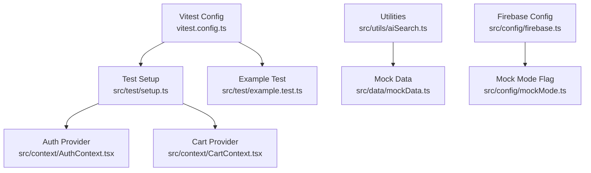
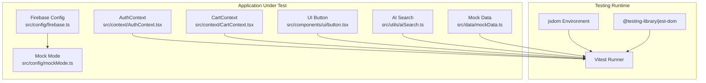
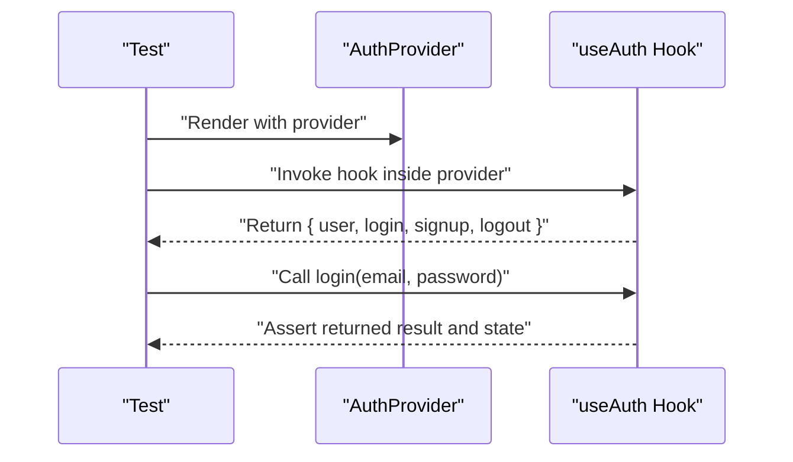
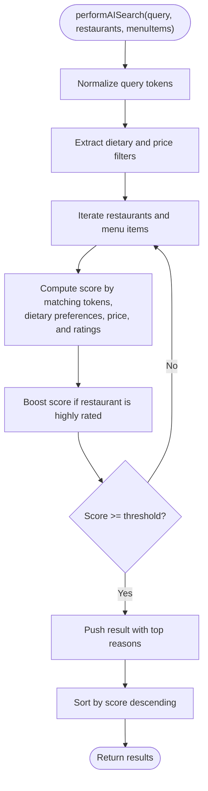
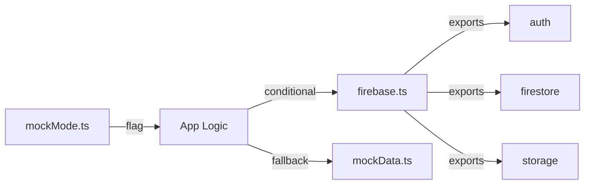
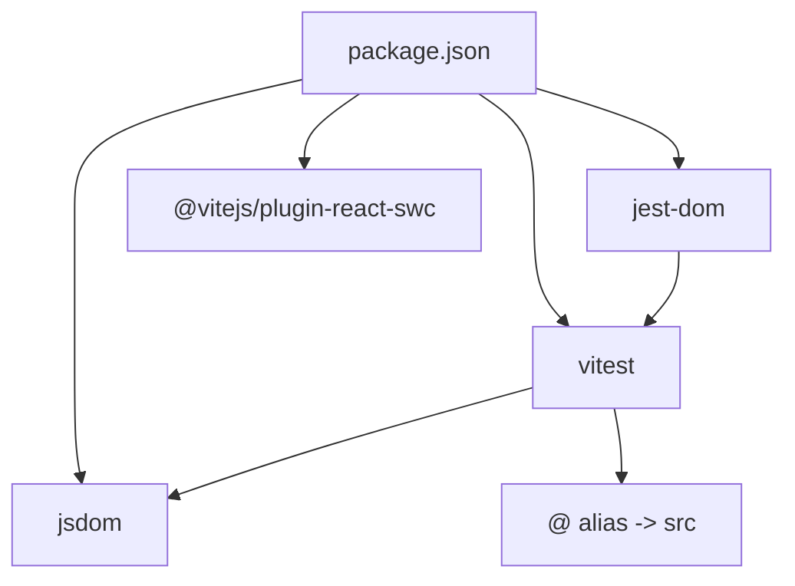

# Testing Strategy

<cite>
**Referenced Files in This Document**
- [vitest.config.ts](file://vitest.config.ts)
- [setup.ts](file://src/test/setup.ts)
- [example.test.ts](file://src/test/example.test.ts)
- [package.json](file://package.json)
- [vite.config.ts](file://vite.config.ts)
- [firebase.ts](file://src/config/firebase.ts)
- [mockMode.ts](file://src/config/mockMode.ts)
- [AuthContext.tsx](file://src/context/AuthContext.tsx)
- [CartContext.tsx](file://src/context/CartContext.tsx)
- [button.tsx](file://src/components/ui/button.tsx)
- [mockData.ts](file://src/data/mockData.ts)
- [aiSearch.ts](file://src/utils/aiSearch.ts)
</cite>

## Table of Contents
1. [Introduction](#introduction)
2. [Project Structure](#project-structure)
3. [Core Components](#core-components)
4. [Architecture Overview](#architecture-overview)
5. [Detailed Component Analysis](#detailed-component-analysis)
6. [Dependency Analysis](#dependency-analysis)
7. [Performance Considerations](#performance-considerations)
8. [Troubleshooting Guide](#troubleshooting-guide)
9. [Conclusion](#conclusion)
10. [Appendices](#appendices)

## Introduction
This document describes TIPPAY’s testing strategy and implementation using Vitest. It covers configuration, setup, and environment initialization; unit testing patterns for React components, context providers, and utility functions; mocking strategies for Firebase and external dependencies; best practices for asynchronous operations, React hooks, and component interactions; component testing approaches, snapshot testing, and integration testing patterns; examples of writing effective tests and organizing them; and considerations for continuous integration, performance optimization, coverage measurement, and debugging test failures.

## Project Structure
TIPPAY adopts a straightforward testing layout:
- Vitest configuration defines the jsdom environment, global setup, include patterns, and module aliases.
- A dedicated setup file initializes DOM helpers and global polyfills for browser APIs.
- Example tests demonstrate the minimal passing test pattern.
- Context providers encapsulate state and side effects, enabling isolated provider-based tests.
- Utility modules provide deterministic logic suitable for unit testing.
- Mock data and mock mode flags enable backend-free testing.

**Diagram sources**
- [vitest.config.ts](file://vitest.config.ts)
- [setup.ts](file://src/test/setup.ts)
- [example.test.ts](file://src/test/example.test.ts)
- [AuthContext.tsx](file://src/context/AuthContext.tsx)
- [CartContext.tsx](file://src/context/CartContext.tsx)
- [aiSearch.ts](file://src/utils/aiSearch.ts)
- [mockData.ts](file://src/data/mockData.ts)
- [firebase.ts](file://src/config/firebase.ts)
- [mockMode.ts](file://src/config/mockMode.ts)

**Section sources**
- [vitest.config.ts](file://vitest.config.ts)
- [setup.ts](file://src/test/setup.ts)
- [example.test.ts](file://src/test/example.test.ts)
- [package.json](file://package.json)
- [vite.config.ts](file://vite.config.ts)

## Core Components
- Vitest configuration
  - Environment: jsdom
  - Globals enabled
  - Setup file: src/test/setup.ts
  - Include pattern: src/**/*.{test,spec}.{ts,tsx}
  - Module alias: @ -> src
- Test setup
  - Adds jest-dom matchers
  - Polyfills window.matchMedia for responsive/testing compatibility
- Example test
  - Demonstrates describe/it/expect usage

**Section sources**
- [vitest.config.ts](file://vitest.config.ts)
- [setup.ts](file://src/test/setup.ts)
- [example.test.ts](file://src/test/example.test.ts)

## Architecture Overview
The testing architecture centers on jsdom for DOM simulation, React Testing Library utilities via jest-dom, and modular setup for cross-cutting concerns. Providers and utilities are designed for easy isolation and mocking, while mock mode and mock data support offline testing.

**Diagram sources**
- [vitest.config.ts](file://vitest.config.ts)
- [setup.ts](file://src/test/setup.ts)
- [firebase.ts](file://src/config/firebase.ts)
- [mockMode.ts](file://src/config/mockMode.ts)
- [AuthContext.tsx](file://src/context/AuthContext.tsx)
- [CartContext.tsx](file://src/context/CartContext.tsx)
- [button.tsx](file://src/components/ui/button.tsx)
- [aiSearch.ts](file://src/utils/aiSearch.ts)
- [mockData.ts](file://src/data/mockData.ts)

## Detailed Component Analysis

### Unit Testing Patterns for React Components
- UI primitives
  - Use forwardRef and variant props; test rendering with different variants/sizes and slot composition.
  - Reference: [button.tsx](file://src/components/ui/button.tsx)
- Provider-based components
  - Wrap tests with provider components to supply context values.
  - Reference: [AuthContext.tsx](file://src/context/AuthContext.tsx), [CartContext.tsx](file://src/context/CartContext.tsx)

Best practices:
- Render components in isolation with appropriate providers.
- Assert on visible text, roles, and attributes exposed by the UI.
- Prefer user-centric assertions over implementation details.

**Section sources**
- [button.tsx](file://src/components/ui/button.tsx)
- [AuthContext.tsx](file://src/context/AuthContext.tsx)
- [CartContext.tsx](file://src/context/CartContext.tsx)

### Context Providers Testing
- AuthContext
  - Tests should verify login/signup/logout flows, user state persistence, and role detection.
  - Use provider wrapper to supply initial state and assert side effects (e.g., localStorage updates).
  - Reference: [AuthContext.tsx](file://src/context/AuthContext.tsx)
- CartContext
  - Tests should cover add/remove/update/clear operations, totals computation, and immutability of state updates.
  - Reference: [CartContext.tsx](file://src/context/CartContext.tsx)

**Diagram sources**
- [AuthContext.tsx](file://src/context/AuthContext.tsx)

**Section sources**
- [AuthContext.tsx](file://src/context/AuthContext.tsx)
- [CartContext.tsx](file://src/context/CartContext.tsx)

### Utility Functions Testing
- AI search
  - Test keyword matching, dietary filters, price filtering, scoring, and sorting.
  - Use mock data to ensure deterministic results.
  - Reference: [aiSearch.ts](file://src/utils/aiSearch.ts), [mockData.ts](file://src/data/mockData.ts)

**Diagram sources**
- [aiSearch.ts](file://src/utils/aiSearch.ts)
- [mockData.ts](file://src/data/mockData.ts)

**Section sources**
- [aiSearch.ts](file://src/utils/aiSearch.ts)
- [mockData.ts](file://src/data/mockData.ts)

### Mocking Strategies
- Firebase integration
  - Keep Firebase initialization in a separate module and avoid side effects during import.
  - Use environment flags to conditionally enable mock mode and skip real network calls.
  - Reference: [firebase.ts](file://src/config/firebase.ts), [mockMode.ts](file://src/config/mockMode.ts)
- External dependencies
  - Replace network calls with deterministic stubs or in-memory stores.
  - Use mock data modules to simulate backend responses.
  - Reference: [mockData.ts](file://src/data/mockData.ts)

**Diagram sources**
- [firebase.ts](file://src/config/firebase.ts)
- [mockMode.ts](file://src/config/mockMode.ts)
- [mockData.ts](file://src/data/mockData.ts)

**Section sources**
- [firebase.ts](file://src/config/firebase.ts)
- [mockMode.ts](file://src/config/mockMode.ts)
- [mockData.ts](file://src/data/mockData.ts)

### Asynchronous Operations, Hooks, and Interactions
- Asynchronous flows
  - Use async/await with act-like patterns to flush effects and promises.
  - Assert state transitions after async work completes.
- React hooks
  - Test custom hooks by rendering them in a component wrapper and asserting returned values.
- Component interactions
  - Simulate user events (clicks, input changes) and assert resulting UI changes.

[No sources needed since this section provides general guidance]

### Component Testing Approaches and Snapshot Testing
- Component testing
  - Render components with props and assert on rendered output.
  - Use user-centric selectors (labels, roles) rather than internal class names.
- Snapshot testing
  - Optional for regression detection; prefer component tests for behavior verification.
  - Limit snapshots to UI components unlikely to change frequently.

[No sources needed since this section provides general guidance]

### Integration Testing Patterns
- Provider integration
  - Compose multiple providers and test cross-context interactions.
- End-to-end-like scenarios
  - Simulate multi-step user journeys (login -> browse -> add to cart -> checkout) using mocked contexts and data.

[No sources needed since this section provides general guidance]

### Writing Effective Tests, Organization, and CI Considerations
- Effective tests
  - One assertion per expectation; clear describe/it titles; minimal setup per test.
- Organization
  - Group tests by feature folder or domain (e.g., context, components, utils).
  - Place setup files under src/test and include them via Vitest config.
- Continuous Integration
  - Run tests in headless environments; ensure jsdom and setup files are configured.
  - Use scripts to run tests and watch mode for development.

**Section sources**
- [vitest.config.ts](file://vitest.config.ts)
- [setup.ts](file://src/test/setup.ts)
- [package.json](file://package.json)

## Dependency Analysis
Testing dependencies and their roles:
- Vitest: test runner and assertion library
- jsdom: DOM environment for React components
- @testing-library/jest-dom: DOM matchers and assertions
- React plugin: JSX transformation and component support
- Aliasing: @ resolves to src for clean imports

**Diagram sources**
- [package.json](file://package.json)
- [vitest.config.ts](file://vitest.config.ts)

**Section sources**
- [package.json](file://package.json)
- [vitest.config.ts](file://vitest.config.ts)

## Performance Considerations
- Minimize DOM-heavy tests; prefer unit tests for pure logic.
- Reuse test setup and avoid heavy fixtures.
- Use selective test runs during development; rely on full suites in CI.
- Leverage caching and parallelization supported by Vitest.

[No sources needed since this section provides general guidance]

## Troubleshooting Guide
Common issues and resolutions:
- matchMedia errors
  - Ensure setup initializes window.matchMedia polyfill.
  - Reference: [setup.ts](file://src/test/setup.ts)
- Missing DOM matchers
  - Confirm @testing-library/jest-dom is imported in setup.
  - Reference: [setup.ts](file://src/test/setup.ts)
- Provider context errors
  - Wrap tests with the appropriate provider; ensure useX hooks are used within provider boundaries.
  - References: [AuthContext.tsx](file://src/context/AuthContext.tsx), [CartContext.tsx](file://src/context/CartContext.tsx)
- Firebase initialization in tests
  - Guard Firebase initialization behind mock mode flags to avoid network calls.
  - References: [firebase.ts](file://src/config/firebase.ts), [mockMode.ts](file://src/config/mockMode.ts)

**Section sources**
- [setup.ts](file://src/test/setup.ts)
- [AuthContext.tsx](file://src/context/AuthContext.tsx)
- [CartContext.tsx](file://src/context/CartContext.tsx)
- [firebase.ts](file://src/config/firebase.ts)
- [mockMode.ts](file://src/config/mockMode.ts)

## Conclusion
TIPPAY’s testing strategy leverages Vitest with jsdom, a concise setup, and modular provider/utilities that are easy to isolate and mock. By combining provider-based tests, deterministic utility tests, and mock-driven data flows, teams can achieve reliable, fast, and maintainable test suites. Adopting the recommended patterns and practices ensures robust coverage and smooth integration into CI pipelines.

## Appendices
- Test commands
  - Run tests: npm test
  - Watch mode: npm run test:watch
- Configuration references
  - Vitest config: [vitest.config.ts](file://vitest.config.ts)
  - Setup: [setup.ts](file://src/test/setup.ts)
  - Example: [example.test.ts](file://src/test/example.test.ts)
  - Package scripts: [package.json](file://package.json)