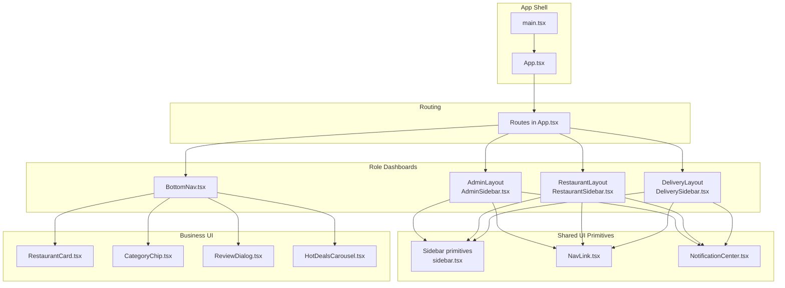
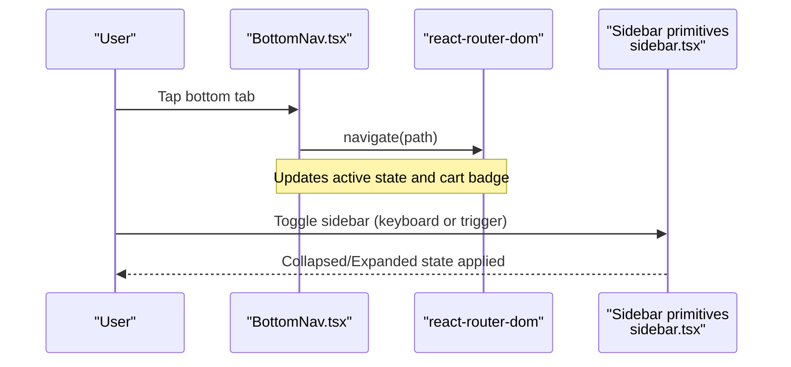
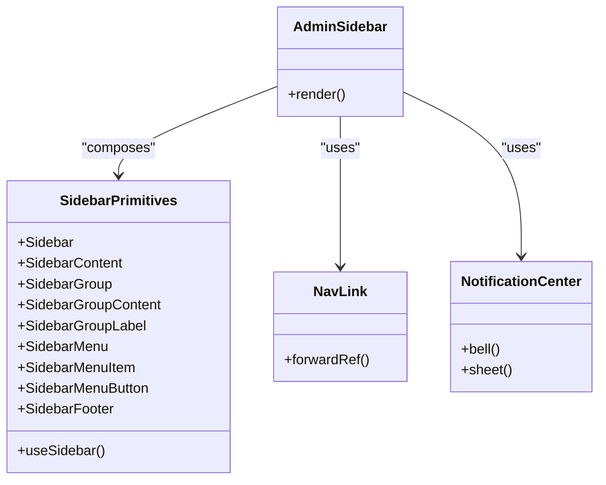
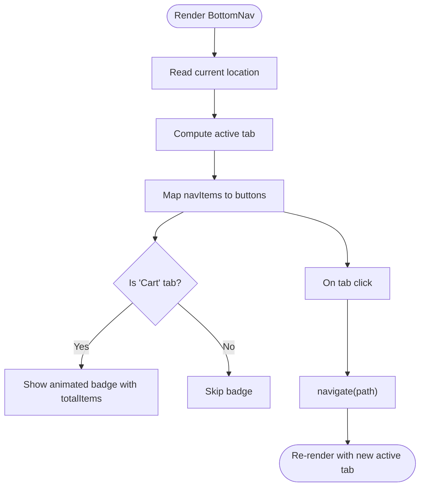
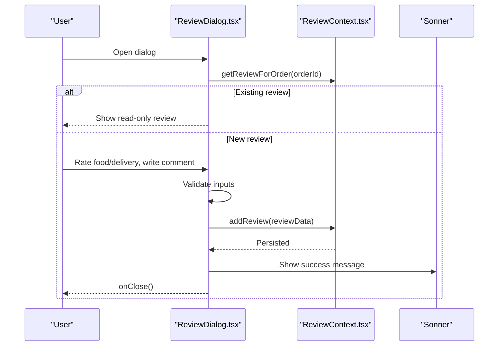
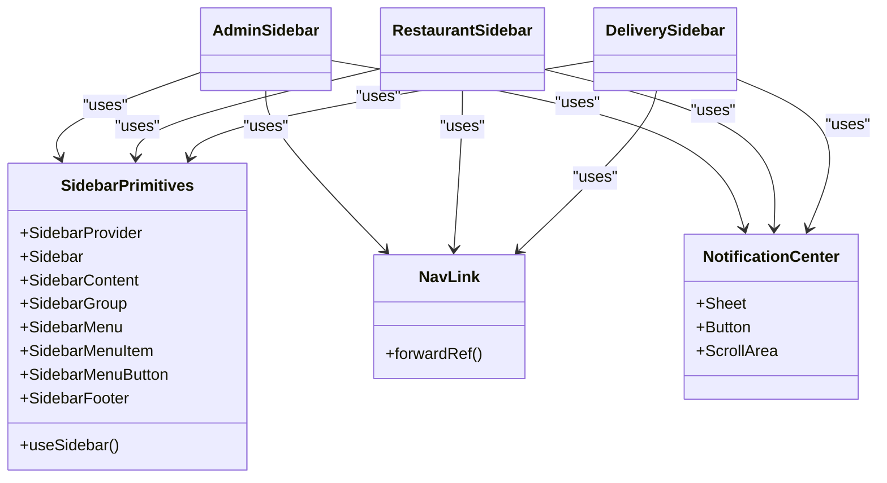
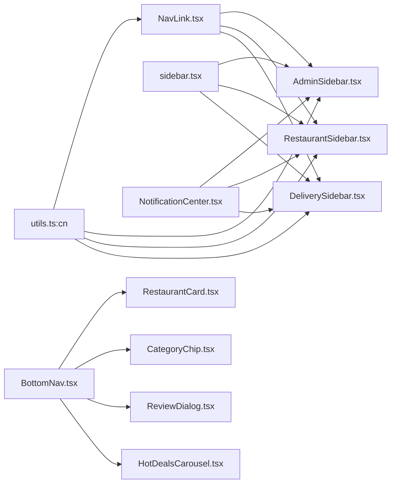

# Custom Component Architecture

<cite>
**Referenced Files in This Document**
- [AdminSidebar.tsx](file://src/components/AdminSidebar.tsx)
- [BottomNav.tsx](file://src/components/BottomNav.tsx)
- [RestaurantSidebar.tsx](file://src/components/RestaurantSidebar.tsx)
- [DeliverySidebar.tsx](file://src/components/DeliverySidebar.tsx)
- [RestaurantCard.tsx](file://src/components/RestaurantCard.tsx)
- [CategoryChip.tsx](file://src/components/CategoryChip.tsx)
- [ReviewDialog.tsx](file://src/components/ReviewDialog.tsx)
- [HotDealsCarousel.tsx](file://src/components/HotDealsCarousel.tsx)
- [NavLink.tsx](file://src/components/NavLink.tsx)
- [NotificationCenter.tsx](file://src/components/NotificationCenter.tsx)
- [sidebar.tsx](file://src/components/ui/sidebar.tsx)
- [ReviewContext.tsx](file://src/context/ReviewContext.tsx)
- [mockData.ts](file://src/data/mockData.ts)
- [App.tsx](file://src/App.tsx)
- [main.tsx](file://src/main.tsx)
- [utils.ts](file://src/lib/utils.ts)
</cite>

## Table of Contents
1. [Introduction](#introduction)
2. [Project Structure](#project-structure)
3. [Core Components](#core-components)
4. [Architecture Overview](#architecture-overview)
5. [Detailed Component Analysis](#detailed-component-analysis)
6. [Dependency Analysis](#dependency-analysis)
7. [Performance Considerations](#performance-considerations)
8. [Troubleshooting Guide](#troubleshooting-guide)
9. [Conclusion](#conclusion)
10. [Appendices](#appendices)

## Introduction
This document explains TIPPAY’s custom component architecture and specialized UI elements. It focuses on:
- Role-specific navigation components: AdminSidebar, BottomNav, RestaurantSidebar, and DeliverySidebar
- Business-specific components: RestaurantCard, CategoryChip, ReviewDialog, and HotDealsCarousel
- Composition patterns integrating custom components with shadcn/ui primitives
- Prop interfaces, state management, styling approaches, and guidelines for extending the design system

## Project Structure
TIPPAY organizes components under src/components, with role-specific navigations and business UI elements co-located alongside shared UI primitives in src/components/ui. Context providers wrap the app to supply global state (auth, cart, orders, reviews, notifications, etc.). Routing is handled centrally in App.tsx with nested dashboards per role.

**Diagram sources**
- [App.tsx:74-124](file://src/App.tsx#L74-L124)
- [AdminSidebar.tsx:28-86](file://src/components/AdminSidebar.tsx#L28-L86)
- [RestaurantSidebar.tsx:28-93](file://src/components/RestaurantSidebar.tsx#L28-L93)
- [DeliverySidebar.tsx:27-90](file://src/components/DeliverySidebar.tsx#L27-L90)
- [BottomNav.tsx:15-66](file://src/components/BottomNav.tsx#L15-L66)
- [sidebar.tsx:131-216](file://src/components/ui/sidebar.tsx#L131-L216)
- [NavLink.tsx:11-29](file://src/components/NavLink.tsx#L11-L29)
- [NotificationCenter.tsx:56-123](file://src/components/NotificationCenter.tsx#L56-L123)
- [RestaurantCard.tsx:11-64](file://src/components/RestaurantCard.tsx#L11-L64)
- [CategoryChip.tsx:11-32](file://src/components/CategoryChip.tsx#L11-L32)
- [ReviewDialog.tsx:48-170](file://src/components/ReviewDialog.tsx#L48-L170)
- [HotDealsCarousel.tsx:8-48](file://src/components/HotDealsCarousel.tsx#L8-L48)

**Section sources**
- [App.tsx:126-167](file://src/App.tsx#L126-L167)
- [main.tsx:1-11](file://src/main.tsx#L1-L11)

## Core Components
This section introduces the primary custom components and their responsibilities.

- AdminSidebar: Role-based admin navigation with dashboard links, collapsible behavior, and logout action.
- RestaurantSidebar: Restaurant portal navigation with menu management, analytics, and logout.
- DeliverySidebar: Delivery agent dashboard navigation with nearby orders, active delivery, stats, and profile.
- BottomNav: Mobile-first bottom navigation with cart badge, animated indicators, and route activation.
- RestaurantCard: Restaurant discovery card with image overlay, offer badges, and rating/distance metadata.
- CategoryChip: Interactive category chips with selection state and animation.
- ReviewDialog: Star-rating form for food and delivery, optional comment, and submission flow.
- HotDealsCarousel: Horizontal scrolling offers carousel with gradient overlays and discount badges.

**Section sources**
- [AdminSidebar.tsx:28-86](file://src/components/AdminSidebar.tsx#L28-L86)
- [RestaurantSidebar.tsx:28-93](file://src/components/RestaurantSidebar.tsx#L28-L93)
- [DeliverySidebar.tsx:27-90](file://src/components/DeliverySidebar.tsx#L27-L90)
- [BottomNav.tsx:15-66](file://src/components/BottomNav.tsx#L15-L66)
- [RestaurantCard.tsx:11-64](file://src/components/RestaurantCard.tsx#L11-L64)
- [CategoryChip.tsx:11-32](file://src/components/CategoryChip.tsx#L11-L32)
- [ReviewDialog.tsx:48-170](file://src/components/ReviewDialog.tsx#L48-L170)
- [HotDealsCarousel.tsx:8-48](file://src/components/HotDealsCarousel.tsx#L8-L48)

## Architecture Overview
TIPPAY composes role-specific sidebars using a shared Sidebar primitive. Navigation links are built with a custom NavLink wrapper that integrates with react-router and supports active/pending states. Notifications are centralized via a Sheet-based NotificationCenter. Business UI components leverage motion animations and responsive layouts.

**Diagram sources**
- [BottomNav.tsx:15-66](file://src/components/BottomNav.tsx#L15-L66)
- [sidebar.tsx:131-216](file://src/components/ui/sidebar.tsx#L131-L216)

**Section sources**
- [BottomNav.tsx:15-66](file://src/components/BottomNav.tsx#L15-L66)
- [sidebar.tsx:131-216](file://src/components/ui/sidebar.tsx#L131-L216)

## Detailed Component Analysis

### Role-Specific Navigation Components

#### AdminSidebar
- Purpose: Admin dashboard navigation with collapsible sidebar, logo branding, and logout.
- Key props and behavior:
  - Uses Sidebar provider state to compute collapsed state.
  - Renders grouped menu items mapped from a static list.
  - Integrates NavLink for active state styling and NotificationCenter for alerts.
  - Logout triggers auth logout and navigates to home.
- Styling and composition:
  - Uses SidebarContent, SidebarGroup, SidebarMenu, SidebarMenuItem, SidebarMenuButton, SidebarFooter.
  - Conditional rendering for collapsed vs expanded labels and icons.

**Diagram sources**
- [AdminSidebar.tsx:28-86](file://src/components/AdminSidebar.tsx#L28-L86)
- [sidebar.tsx:131-216](file://src/components/ui/sidebar.tsx#L131-L216)
- [NavLink.tsx:11-29](file://src/components/NavLink.tsx#L11-L29)
- [NotificationCenter.tsx:56-123](file://src/components/NotificationCenter.tsx#L56-L123)

**Section sources**
- [AdminSidebar.tsx:28-86](file://src/components/AdminSidebar.tsx#L28-L86)
- [sidebar.tsx:131-216](file://src/components/ui/sidebar.tsx#L131-L216)
- [NavLink.tsx:11-29](file://src/components/NavLink.tsx#L11-L29)
- [NotificationCenter.tsx:56-123](file://src/components/NotificationCenter.tsx#L56-L123)

#### RestaurantSidebar
- Purpose: Restaurant portal navigation with orders, menu editor, requests, coupons, analytics.
- Behavior:
  - Mirrors AdminSidebar structure but with restaurant-specific routes.
  - Uses useAuth for logout and navigate to home.

**Section sources**
- [RestaurantSidebar.tsx:28-93](file://src/components/RestaurantSidebar.tsx#L28-L93)

#### DeliverySidebar
- Purpose: Delivery agent dashboard navigation with nearby orders, active delivery, stats, and profile.
- Behavior:
  - Uses the same Sidebar composition pattern with delivery-specific routes.
  - Handles logout via auth context.

**Section sources**
- [DeliverySidebar.tsx:27-90](file://src/components/DeliverySidebar.tsx#L27-L90)

#### BottomNav
- Purpose: Mobile-first bottom navigation bar with cart badge, animated active indicator, and route activation.
- Behavior:
  - Reads current location to determine active tab.
  - Uses CartContext to render cart item count badge.
  - Uses motion for animated transitions and indicators.

**Diagram sources**
- [BottomNav.tsx:15-66](file://src/components/BottomNav.tsx#L15-L66)

**Section sources**
- [BottomNav.tsx:15-66](file://src/components/BottomNav.tsx#L15-L66)

### Business-Specific Components

#### RestaurantCard
- Purpose: Display a single restaurant with image, status overlay, offer badge, and metadata.
- Props:
  - restaurant: Restaurant model from mock data
  - index?: number for staggered entrance animation
- Behavior:
  - Click navigates to restaurant page.
  - Closed overlay shown when restaurant.isOpen is false.
  - Offer badge shown if any menu item has offerPrice.

**Section sources**
- [RestaurantCard.tsx:11-64](file://src/components/RestaurantCard.tsx#L11-L64)
- [mockData.ts:24-36](file://src/data/mockData.ts#L24-L36)

#### CategoryChip
- Purpose: Interactive category chip with selection state and animation.
- Props:
  - category: Category model
  - isActive: boolean
  - onClick: callback
  - index?: number for staggered entrance animation
- Behavior:
  - Applies accent ring and background when selected.
  - Uses motion for entrance animation.

**Section sources**
- [CategoryChip.tsx:11-32](file://src/components/CategoryChip.tsx#L11-L32)
- [mockData.ts:57-61](file://src/data/mockData.ts#L57-L61)

#### ReviewDialog
- Purpose: Star-rating form for food and delivery quality, optional comment, and submission.
- Props:
  - orderId: string
  - restaurantId: string
  - restaurantName: string
  - onClose?: () => void
- State and validation:
  - Tracks foodRating, deliveryRating, and comment.
  - Validates ratings and comment length.
  - Persists reviews via ReviewContext and stores in local storage.
- Composition:
  - Uses Button, motion, and toast for UX.
  - Reuses a StarRating sub-component.

**Diagram sources**
- [ReviewDialog.tsx:48-170](file://src/components/ReviewDialog.tsx#L48-L170)
- [ReviewContext.tsx:25-69](file://src/context/ReviewContext.tsx#L25-L69)

**Section sources**
- [ReviewDialog.tsx:48-170](file://src/components/ReviewDialog.tsx#L48-L170)
- [ReviewContext.tsx:25-69](file://src/context/ReviewContext.tsx#L25-L69)

#### HotDealsCarousel
- Purpose: Horizontal carousel of hot deals with gradient overlays and discount badges.
- Props:
  - deals: HotDeal[]
- Behavior:
  - Renders each deal as a horizontally scrollable slide.
  - Uses motion for entrance animation and Tailwind for responsive widths.

**Section sources**
- [HotDealsCarousel.tsx:8-48](file://src/components/HotDealsCarousel.tsx#L8-L48)
- [mockData.ts:131-138](file://src/data/mockData.ts#L131-L138)

### Integration Patterns with shadcn/ui Primitives
- Sidebar composition:
  - Admin/Restaurant/Delivery sidebars compose SidebarContent, SidebarGroup, SidebarMenu, SidebarMenuItem, SidebarMenuButton, and SidebarFooter.
  - They rely on useSidebar for collapsed state and collapsible="icon".
- NavLink compatibility:
  - NavLink wraps react-router NavLink and merges custom className with active/pending states using cn from utils.
- NotificationCenter:
  - Uses Sheet, Button, ScrollArea, and motion for a drawer-like notification panel with unread indicators and actions.

**Diagram sources**
- [sidebar.tsx:131-216](file://src/components/ui/sidebar.tsx#L131-L216)
- [NavLink.tsx:11-29](file://src/components/NavLink.tsx#L11-L29)
- [NotificationCenter.tsx:56-123](file://src/components/NotificationCenter.tsx#L56-L123)
- [AdminSidebar.tsx:28-86](file://src/components/AdminSidebar.tsx#L28-L86)
- [RestaurantSidebar.tsx:28-93](file://src/components/RestaurantSidebar.tsx#L28-L93)
- [DeliverySidebar.tsx:27-90](file://src/components/DeliverySidebar.tsx#L27-L90)

**Section sources**
- [sidebar.tsx:131-216](file://src/components/ui/sidebar.tsx#L131-L216)
- [NavLink.tsx:11-29](file://src/components/NavLink.tsx#L11-L29)
- [NotificationCenter.tsx:56-123](file://src/components/NotificationCenter.tsx#L56-L123)

## Dependency Analysis
- Component coupling:
  - Sidebars depend on Sidebar primitives and share common composition patterns.
  - BottomNav depends on routing, cart state, and motion.
  - Business components depend on mock data models and context providers.
- External dependencies:
  - lucide-react for icons
  - framer-motion for animations
  - date-fns for relative time formatting
  - sonner for toast notifications
- Utility functions:
  - cn from utils.ts merges Tailwind classes safely.

**Diagram sources**
- [utils.ts:4-7](file://src/lib/utils.ts#L4-L7)
- [sidebar.tsx:131-216](file://src/components/ui/sidebar.tsx#L131-L216)
- [NavLink.tsx:11-29](file://src/components/NavLink.tsx#L11-L29)
- [NotificationCenter.tsx:56-123](file://src/components/NotificationCenter.tsx#L56-L123)
- [AdminSidebar.tsx:28-86](file://src/components/AdminSidebar.tsx#L28-L86)
- [RestaurantSidebar.tsx:28-93](file://src/components/RestaurantSidebar.tsx#L28-L93)
- [DeliverySidebar.tsx:27-90](file://src/components/DeliverySidebar.tsx#L27-L90)
- [BottomNav.tsx:15-66](file://src/components/BottomNav.tsx#L15-L66)
- [RestaurantCard.tsx:11-64](file://src/components/RestaurantCard.tsx#L11-L64)
- [CategoryChip.tsx:11-32](file://src/components/CategoryChip.tsx#L11-L32)
- [ReviewDialog.tsx:48-170](file://src/components/ReviewDialog.tsx#L48-L170)
- [HotDealsCarousel.tsx:8-48](file://src/components/HotDealsCarousel.tsx#L8-L48)

**Section sources**
- [utils.ts:4-7](file://src/lib/utils.ts#L4-L7)
- [App.tsx:126-167](file://src/App.tsx#L126-L167)

## Performance Considerations
- Motion and animations:
  - Prefer minimal motion for low-power devices; disable or throttle where appropriate.
  - Use initial/animate only for essential entrance effects.
- Rendering:
  - Use index-based staggering judiciously; avoid deep lists with heavy animations.
  - Memoize callbacks passed to child components to reduce re-renders.
- Images:
  - Lazy-load restaurant images and use appropriate sizes to minimize bandwidth.
- State:
  - Keep local component state minimal; prefer context providers for cross-component sharing.

## Troubleshooting Guide
- Sidebar not toggling:
  - Ensure SidebarProvider wraps the app and useSidebar is used inside Sidebar.
- Active link styles not applying:
  - Verify NavLink receives activeClassName and that the route matches exactly.
- Cart badge not updating:
  - Confirm CartContext is provided and totalItems updates on cart changes.
- Notifications not appearing:
  - Check NotificationProvider is mounted and unreadCount is tracked.
- Review submission errors:
  - Validate rating and comment constraints; ensure ReviewProvider is present.

**Section sources**
- [sidebar.tsx:34-41](file://src/components/ui/sidebar.tsx#L34-L41)
- [NavLink.tsx:11-29](file://src/components/NavLink.tsx#L11-L29)
- [App.tsx:126-167](file://src/App.tsx#L126-L167)
- [ReviewContext.tsx:25-69](file://src/context/ReviewContext.tsx#L25-L69)

## Conclusion
TIPPAY’s custom component architecture emphasizes role-specific navigation using a shared Sidebar primitive, compositional UI with shadcn/ui, and context-driven state. The business components showcase reusable patterns for cards, chips, dialogs, and carousels, integrating animations and responsive design. Following the outlined guidelines ensures consistency and maintainability as the system evolves.

## Appendices

### Component Composition Guidelines
- Use Sidebar primitives for role-specific sidebars; keep item lists declarative.
- Wrap navigation with NavLink to inherit router state and custom className merging.
- Centralize notifications in NotificationCenter for consistent UX.
- Keep business components self-contained with clear prop interfaces and minimal internal state.
- Leverage motion sparingly and ensure accessibility (keyboard navigation, screen reader support).

### Prop Interfaces Summary
- AdminSidebar, RestaurantSidebar, DeliverySidebar: No explicit props; rely on context and routing.
- BottomNav: No props; reads location and cart state internally.
- RestaurantCard: restaurant (Restaurant), index (number).
- CategoryChip: category (Category), isActive (boolean), onClick (function), index (number).
- ReviewDialog: orderId (string), restaurantId (string), restaurantName (string), onClose (function?).
- HotDealsCarousel: deals (HotDeal[]).

**Section sources**
- [AdminSidebar.tsx:28-86](file://src/components/AdminSidebar.tsx#L28-L86)
- [RestaurantSidebar.tsx:28-93](file://src/components/RestaurantSidebar.tsx#L28-L93)
- [DeliverySidebar.tsx:27-90](file://src/components/DeliverySidebar.tsx#L27-L90)
- [BottomNav.tsx:15-66](file://src/components/BottomNav.tsx#L15-L66)
- [RestaurantCard.tsx:6-9](file://src/components/RestaurantCard.tsx#L6-L9)
- [CategoryChip.tsx:4-9](file://src/components/CategoryChip.tsx#L4-L9)
- [ReviewDialog.tsx:8-13](file://src/components/ReviewDialog.tsx#L8-L13)
- [HotDealsCarousel.tsx:4-6](file://src/components/HotDealsCarousel.tsx#L4-L6)