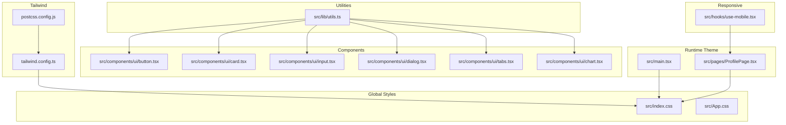
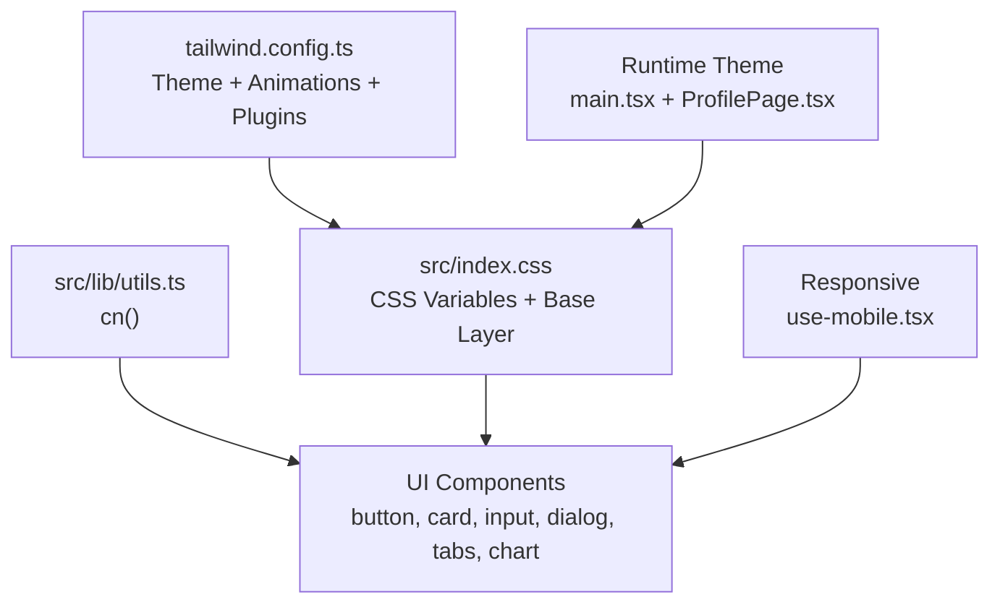
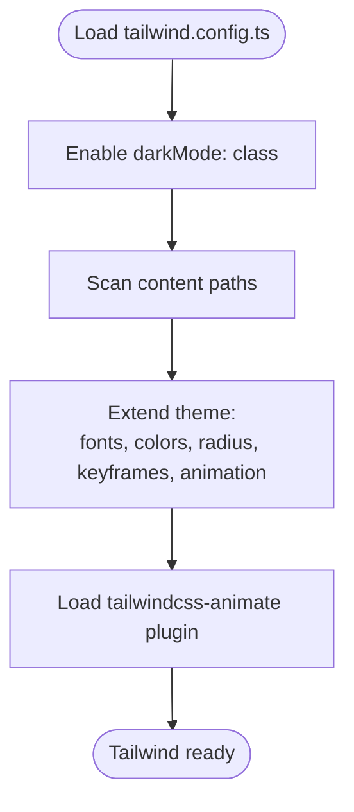
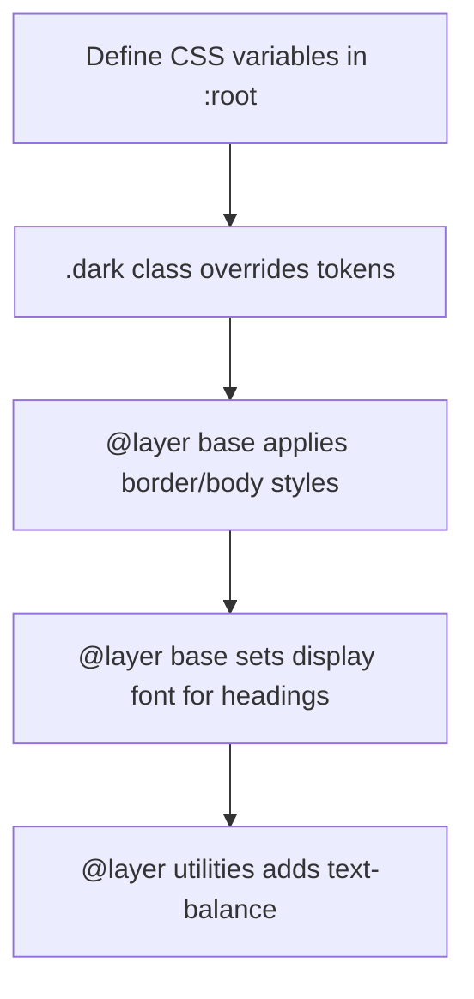
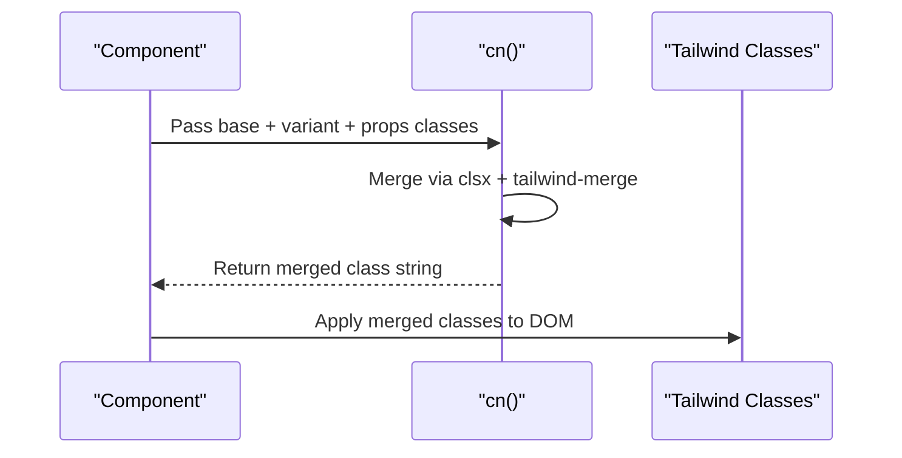
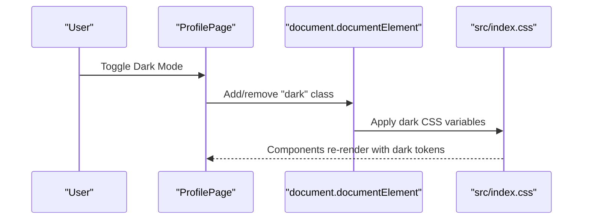
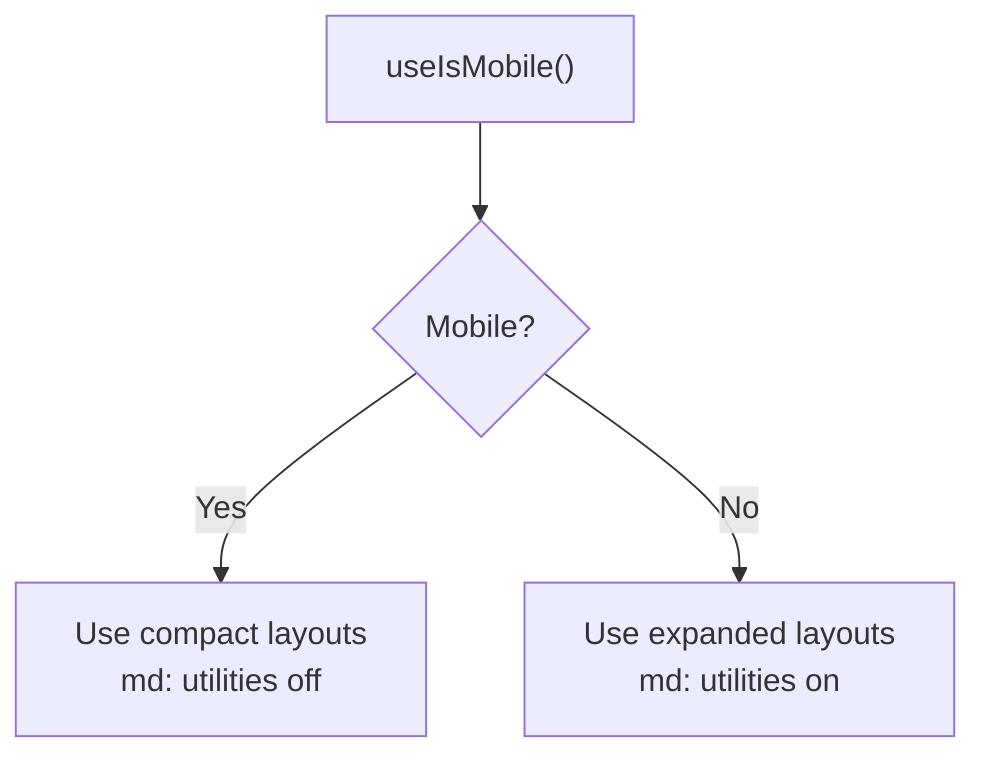
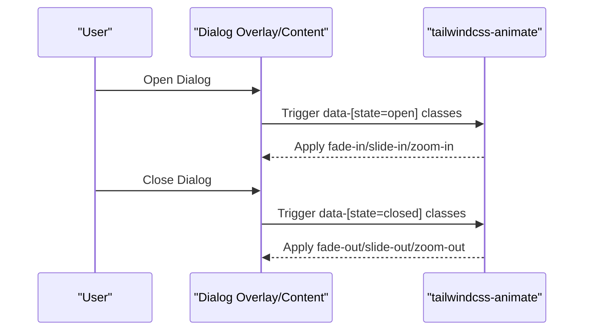
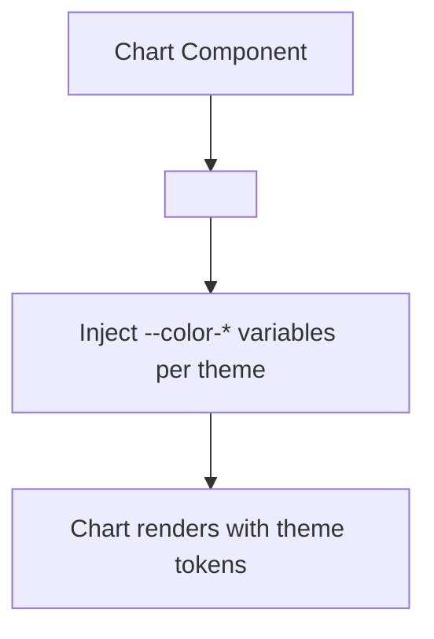
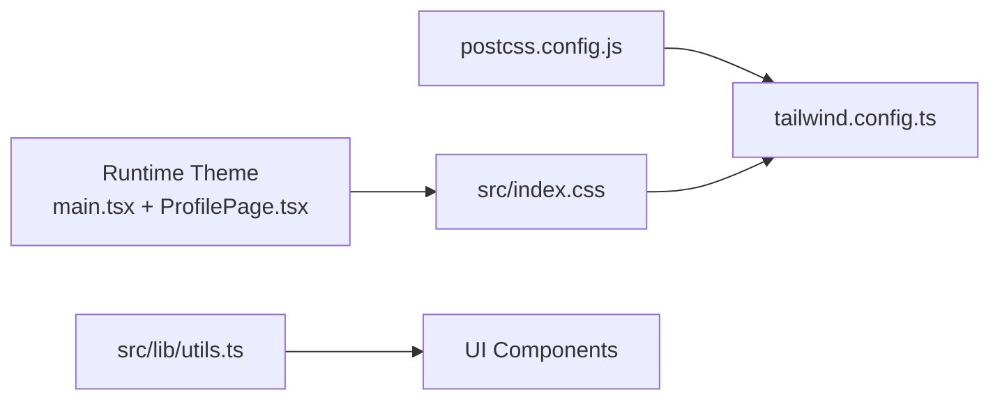

# Styling and Theming System

<cite>
**Referenced Files in This Document**
- [tailwind.config.ts](file://tailwind.config.ts)
- [postcss.config.js](file://postcss.config.js)
- [index.css](file://src/index.css)
- [utils.ts](file://src/lib/utils.ts)
- [button.tsx](file://src/components/ui/button.tsx)
- [card.tsx](file://src/components/ui/card.tsx)
- [input.tsx](file://src/components/ui/input.tsx)
- [dialog.tsx](file://src/components/ui/dialog.tsx)
- [tabs.tsx](file://src/components/ui/tabs.tsx)
- [chart.tsx](file://src/components/ui/chart.tsx)
- [use-mobile.tsx](file://src/hooks/use-mobile.tsx)
- [main.tsx](file://src/main.tsx)
- [ProfilePage.tsx](file://src/pages/ProfilePage.tsx)
- [components.json](file://components.json)
</cite>

## Table of Contents
1. [Introduction](#introduction)
2. [Project Structure](#project-structure)
3. [Core Components](#core-components)
4. [Architecture Overview](#architecture-overview)
5. [Detailed Component Analysis](#detailed-component-analysis)
6. [Dependency Analysis](#dependency-analysis)
7. [Performance Considerations](#performance-considerations)
8. [Troubleshooting Guide](#troubleshooting-guide)
9. [Conclusion](#conclusion)
10. [Appendices](#appendices)

## Introduction
This document explains TIPPAY’s styling and theming system built on Tailwind CSS. It covers the Tailwind configuration, custom theme variables, color schemes, spacing and typography, dark mode, responsive design patterns, and utility class usage. It also documents the styling architecture (global styles, component-specific styling), the cn() utility for conditional class merging, and best practices for maintaining design consistency and extending the theme system. Examples of responsive breakpoints, animation utilities, and interactive state styling are included.

## Project Structure
The styling system is organized around:
- Tailwind configuration defining theme extensions, animations, and plugins
- Global CSS layers establishing base tokens and dark mode
- Utility functions for class merging
- UI components using Tailwind utilities and variants
- Responsive helpers and hooks



**Diagram sources**
- [tailwind.config.ts:1-123](file://tailwind.config.ts#L1-L123)
- [postcss.config.js:1-7](file://postcss.config.js#L1-L7)
- [index.css:1-105](file://src/index.css#L1-L105)
- [utils.ts:1-7](file://src/lib/utils.ts#L1-L7)
- [button.tsx:1-48](file://src/components/ui/button.tsx#L1-L48)
- [card.tsx:1-44](file://src/components/ui/card.tsx#L1-L44)
- [input.tsx:1-23](file://src/components/ui/input.tsx#L1-L23)
- [dialog.tsx:1-96](file://src/components/ui/dialog.tsx#L1-L96)
- [tabs.tsx:1-54](file://src/components/ui/tabs.tsx#L1-L54)
- [chart.tsx:63-124](file://src/components/ui/chart.tsx#L63-L124)
- [use-mobile.tsx:1-20](file://src/hooks/use-mobile.tsx#L1-L20)
- [main.tsx:1-10](file://src/main.tsx#L1-L10)
- [ProfilePage.tsx:96-120](file://src/pages/ProfilePage.tsx#L96-L120)

**Section sources**
- [tailwind.config.ts:1-123](file://tailwind.config.ts#L1-L123)
- [postcss.config.js:1-7](file://postcss.config.js#L1-L7)
- [index.css:1-105](file://src/index.css#L1-L105)
- [components.json:1-21](file://components.json#L1-L21)

## Core Components
- Tailwind configuration defines:
  - Dark mode strategy using a class-based approach
  - Content paths scanned for class extraction
  - Extended theme variables for fonts, colors, border radius, keyframes, and animations
  - Plugin integration for advanced animations
- Global CSS establishes:
  - CSS variables for light and dark themes
  - Base layer styles applying border and text colors globally
  - Typography tokens and utility overrides
- Utility function cn():
  - Merges conditional Tailwind classes safely using clsx and tailwind-merge

**Section sources**
- [tailwind.config.ts:3-122](file://tailwind.config.ts#L3-L122)
- [index.css:7-98](file://src/index.css#L7-L98)
- [utils.ts:4-6](file://src/lib/utils.ts#L4-L6)

## Architecture Overview
The styling architecture follows a layered approach:
- Tailwind configuration extends base tokens and registers animations
- Global CSS sets CSS variables per theme and applies base styles
- Components compose Tailwind utilities and variants via cn()
- Runtime theme toggling updates the root element class for dark mode
- Responsive patterns use Tailwind breakpoints and a mobile detection hook



**Diagram sources**
- [tailwind.config.ts:3-122](file://tailwind.config.ts#L3-L122)
- [index.css:7-98](file://src/index.css#L7-L98)
- [utils.ts:4-6](file://src/lib/utils.ts#L4-L6)
- [button.tsx:39-44](file://src/components/ui/button.tsx#L39-L44)
- [card.tsx:5-6](file://src/components/ui/card.tsx#L5-L6)
- [input.tsx:10-13](file://src/components/ui/input.tsx#L10-L13)
- [dialog.tsx:38-41](file://src/components/ui/dialog.tsx#L38-L41)
- [tabs.tsx:27-34](file://src/components/ui/tabs.tsx#L27-L34)
- [chart.tsx:69-87](file://src/components/ui/chart.tsx#L69-L87)
- [main.tsx:6-8](file://src/main.tsx#L6-L8)
- [ProfilePage.tsx:96-105](file://src/pages/ProfilePage.tsx#L96-L105)
- [use-mobile.tsx:3-18](file://src/hooks/use-mobile.tsx#L3-L18)

## Detailed Component Analysis

### Tailwind Configuration and Theme Extensions
- Dark mode: configured as class-based, enabling seamless runtime switching
- Content scanning: includes pages, components, app, and src directories
- Fonts: extended sans and display families
- Colors: semantic palette with primary, secondary, destructive, muted, accent, popover, card, and sidebar palettes; includes custom tokens (wheat, gold, success, warning, info)
- Border radius: variable-driven sizing
- Animations: accordion, fade-in, slide-up, scale-in with durations and easing
- Plugin: tailwindcss-animate for enhanced transitions



**Diagram sources**
- [tailwind.config.ts:3-122](file://tailwind.config.ts#L3-L122)

**Section sources**
- [tailwind.config.ts:3-122](file://tailwind.config.ts#L3-L122)

### Global Styles and CSS Variables
- CSS variables define light and dark theme tokens for backgrounds, foregrounds, borders, inputs, rings, cards, popovers, accents, and custom tokens
- Base layer applies border color to all elements and body background/foreground with antialiasing
- Typography layer sets display font for headings
- Utility layer adds a text-wrap balance utility



**Diagram sources**
- [index.css:7-98](file://src/index.css#L7-L98)

**Section sources**
- [index.css:7-98](file://src/index.css#L7-L98)

### cn() Utility Function
- Purpose: merge conditional Tailwind classes while avoiding conflicts
- Implementation: combines clsx and tailwind-merge
- Usage: applied across components to compose base, variant, and prop-driven classes



**Diagram sources**
- [utils.ts:4-6](file://src/lib/utils.ts#L4-L6)
- [button.tsx:42](file://src/components/ui/button.tsx#L42)
- [card.tsx:6](file://src/components/ui/card.tsx#L6)
- [input.tsx:10-13](file://src/components/ui/input.tsx#L10-L13)
- [dialog.tsx:38-41](file://src/components/ui/dialog.tsx#L38-L41)
- [tabs.tsx:27-34](file://src/components/ui/tabs.tsx#L27-L34)
- [chart.tsx:69-87](file://src/components/ui/chart.tsx#L69-L87)

**Section sources**
- [utils.ts:4-6](file://src/lib/utils.ts#L4-L6)

### Component Styling Patterns
- Variants with class-variance-authority: define consistent variants and sizes for buttons
- Semantic color tokens: components use tokens like bg-card, text-card-foreground, border-input, ring-ring
- Interactive states: focus-visible outlines, hover states, disabled states
- Responsive utilities: md:text-sm and similar breakpoint modifiers
- Animation utilities: animate-in/out, fade-in/out, zoom, slide transitions

```mermaid
classDiagram
class Button {
+variant : "default|destructive|outline|secondary|ghost|link"
+size : "default|sm|lg|icon"
+className : string
+asChild : boolean
}
class Card {
+Card
+CardHeader
+CardTitle
+CardDescription
+CardContent
+CardFooter
}
class Input {
+type : string
+className : string
}
class Dialog {
+DialogOverlay
+DialogContent
+DialogTitle
+DialogDescription
+DialogFooter
}
class Tabs {
+TabsList
+TabsTrigger
+TabsContent
}
class Chart {
+ChartStyle
+ChartTooltip
+ChartTooltipContent
}
Button --> Utils["uses cn()"]
Card --> Utils["uses cn()"]
Input --> Utils["uses cn()"]
Dialog --> Utils["uses cn()"]
Tabs --> Utils["uses cn()"]
Chart --> Utils["uses cn()"]
```

**Diagram sources**
- [button.tsx:7-31](file://src/components/ui/button.tsx#L7-L31)
- [card.tsx:5-43](file://src/components/ui/card.tsx#L5-L43)
- [input.tsx:5-18](file://src/components/ui/input.tsx#L5-L18)
- [dialog.tsx:15-52](file://src/components/ui/dialog.tsx#L15-L52)
- [tabs.tsx:8-51](file://src/components/ui/tabs.tsx#L8-L51)
- [chart.tsx:69-87](file://src/components/ui/chart.tsx#L69-L87)
- [utils.ts:4-6](file://src/lib/utils.ts#L4-L6)

**Section sources**
- [button.tsx:7-31](file://src/components/ui/button.tsx#L7-L31)
- [card.tsx:5-43](file://src/components/ui/card.tsx#L5-L43)
- [input.tsx:5-18](file://src/components/ui/input.tsx#L5-L18)
- [dialog.tsx:15-52](file://src/components/ui/dialog.tsx#L15-L52)
- [tabs.tsx:8-51](file://src/components/ui/tabs.tsx#L8-L51)
- [chart.tsx:69-87](file://src/components/ui/chart.tsx#L69-L87)

### Dark Mode Implementation
- Runtime theme toggle: reads localStorage and adds the dark class to the root element
- Theme-aware components: use semantic tokens that automatically flip with the dark class
- Example usage: a profile page setting toggles the dark class and reflects in component styling



**Diagram sources**
- [main.tsx:6-8](file://src/main.tsx#L6-L8)
- [ProfilePage.tsx:96-105](file://src/pages/ProfilePage.tsx#L96-L105)
- [index.css:63-83](file://src/index.css#L63-L83)

**Section sources**
- [main.tsx:6-8](file://src/main.tsx#L6-L8)
- [ProfilePage.tsx:96-105](file://src/pages/ProfilePage.tsx#L96-L105)
- [index.css:63-83](file://src/index.css#L63-L83)

### Responsive Design Patterns
- Breakpoint usage: md:text-sm and similar utilities adjust typography at medium viewport widths
- Mobile detection hook: a media query-based hook determines mobile layout conditions
- Component responsiveness: dialogs and tabs adapt layouts for small screens



**Diagram sources**
- [use-mobile.tsx:3-18](file://src/hooks/use-mobile.tsx#L3-L18)
- [input.tsx:10-13](file://src/components/ui/input.tsx#L10-L13)
- [dialog.tsx:38-41](file://src/components/ui/dialog.tsx#L38-L41)
- [tabs.tsx:27-34](file://src/components/ui/tabs.tsx#L27-L34)

**Section sources**
- [use-mobile.tsx:3-18](file://src/hooks/use-mobile.tsx#L3-L18)
- [input.tsx:10-13](file://src/components/ui/input.tsx#L10-L13)
- [dialog.tsx:38-41](file://src/components/ui/dialog.tsx#L38-L41)
- [tabs.tsx:27-34](file://src/components/ui/tabs.tsx#L27-L34)

### Animation Utilities and Interactive States
- Extended keyframes and animations: accordion, fade-in, slide-up, scale-in
- Interactive states: focus-visible outlines, hover effects, disabled states
- Animated transitions: overlay and dialog content use animate-in/out and fade/slide/zoom variants



**Diagram sources**
- [tailwind.config.ts:90-118](file://tailwind.config.ts#L90-L118)
- [dialog.tsx:21-27](file://src/components/ui/dialog.tsx#L21-L27)
- [dialog.tsx:38-41](file://src/components/ui/dialog.tsx#L38-L41)

**Section sources**
- [tailwind.config.ts:90-118](file://tailwind.config.ts#L90-L118)
- [dialog.tsx:21-27](file://src/components/ui/dialog.tsx#L21-L27)
- [dialog.tsx:38-41](file://src/components/ui/dialog.tsx#L38-L41)

### CSS-in-JS Pattern in Charts
- Dynamic CSS injection: chart components generate scoped CSS variables for theme-aware charts
- Theming per chart theme: injects --color-* variables for datasets



**Diagram sources**
- [chart.tsx:69-87](file://src/components/ui/chart.tsx#L69-L87)

**Section sources**
- [chart.tsx:69-87](file://src/components/ui/chart.tsx#L69-L87)

## Dependency Analysis
- Tailwind configuration depends on:
  - PostCSS pipeline for Tailwind and Autoprefixer
  - Global CSS for theme tokens and base styles
- Components depend on:
  - cn() utility for safe class merging
  - Semantic color tokens from global CSS variables
- Runtime theme depends on:
  - localStorage persistence and root class toggling



**Diagram sources**
- [postcss.config.js:1-7](file://postcss.config.js#L1-L7)
- [tailwind.config.ts:1-123](file://tailwind.config.ts#L1-L123)
- [index.css:1-105](file://src/index.css#L1-L105)
- [utils.ts:1-7](file://src/lib/utils.ts#L1-L7)
- [main.tsx:1-10](file://src/main.tsx#L1-L10)
- [ProfilePage.tsx:96-120](file://src/pages/ProfilePage.tsx#L96-L120)

**Section sources**
- [postcss.config.js:1-7](file://postcss.config.js#L1-L7)
- [tailwind.config.ts:1-123](file://tailwind.config.ts#L1-L123)
- [index.css:1-105](file://src/index.css#L1-L105)
- [utils.ts:1-7](file://src/lib/utils.ts#L1-L7)
- [main.tsx:1-10](file://src/main.tsx#L1-L10)
- [ProfilePage.tsx:96-120](file://src/pages/ProfilePage.tsx#L96-L120)

## Performance Considerations
- Keep content paths in Tailwind configuration minimal to reduce build size
- Prefer semantic tokens over hardcoded values to leverage CSS variables efficiently
- Use responsive utilities judiciously to avoid excessive generated CSS
- Consolidate repeated class patterns into variants to reduce duplication

## Troubleshooting Guide
- Dark mode not applying:
  - Verify the dark class is present on the root element
  - Confirm CSS variables are defined under .dark
- Conflicting classes:
  - Ensure cn() is used to merge classes consistently
- Animations not triggering:
  - Check data-state attributes and ensure tailwindcss-animate is loaded
- Responsive layout issues:
  - Validate breakpoint utilities and media query hook usage

**Section sources**
- [main.tsx:6-8](file://src/main.tsx#L6-L8)
- [index.css:63-83](file://src/index.css#L63-L83)
- [utils.ts:4-6](file://src/lib/utils.ts#L4-L6)
- [tailwind.config.ts:121](file://tailwind.config.ts#L121)
- [use-mobile.tsx:3-18](file://src/hooks/use-mobile.tsx#L3-L18)

## Conclusion
TIPPAY’s styling system centers on a robust Tailwind configuration with semantic tokens, CSS variables for theme switching, and a consistent component architecture. The cn() utility ensures predictable class composition, while responsive and animation utilities deliver polished UX. Following the documented patterns and best practices will help maintain design consistency and enable easy extension of the theme system.

## Appendices

### Tailwind Configuration Highlights
- Dark mode: class-based strategy
- Fonts: sans and display families
- Colors: semantic palette plus custom tokens
- Radius: variable-driven
- Animations: accordion, fade-in, slide-up, scale-in
- Plugin: tailwindcss-animate

**Section sources**
- [tailwind.config.ts:3-122](file://tailwind.config.ts#L3-L122)

### Global CSS Tokens Reference
- Light and dark CSS variables for backgrounds, foregrounds, borders, inputs, rings, cards, popovers, accents, and custom tokens
- Base layer: border and body styles
- Typography layer: display font for headings
- Utility layer: text-balance

**Section sources**
- [index.css:7-98](file://src/index.css#L7-L98)

### Responsive Breakpoints and Patterns
- md:text-sm and similar utilities for medium and up
- useIsMobile hook for programmatic responsive logic

**Section sources**
- [input.tsx:10-13](file://src/components/ui/input.tsx#L10-L13)
- [use-mobile.tsx:3-18](file://src/hooks/use-mobile.tsx#L3-L18)

### Animation Utilities
- Keyframes: accordion-down/up, fade-in, slide-up, scale-in
- Animations: mapped to transitions and durations

**Section sources**
- [tailwind.config.ts:90-118](file://tailwind.config.ts#L90-L118)

### Styling Best Practices
- Use semantic tokens (e.g., bg-card, text-card-foreground) for consistency
- Compose classes with cn() to prevent conflicts
- Prefer variants for component states
- Leverage responsive utilities for adaptive layouts
- Inject theme-aware CSS dynamically for specialized components (charts)

**Section sources**
- [utils.ts:4-6](file://src/lib/utils.ts#L4-L6)
- [button.tsx:7-31](file://src/components/ui/button.tsx#L7-L31)
- [card.tsx:5-43](file://src/components/ui/card.tsx#L5-L43)
- [input.tsx:10-13](file://src/components/ui/input.tsx#L10-L13)
- [chart.tsx:69-87](file://src/components/ui/chart.tsx#L69-L87)