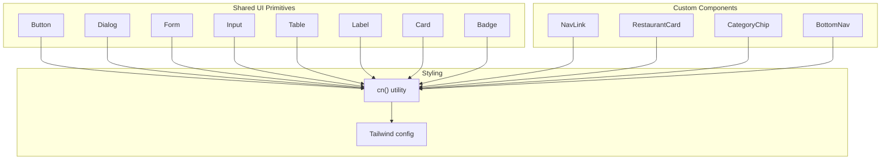
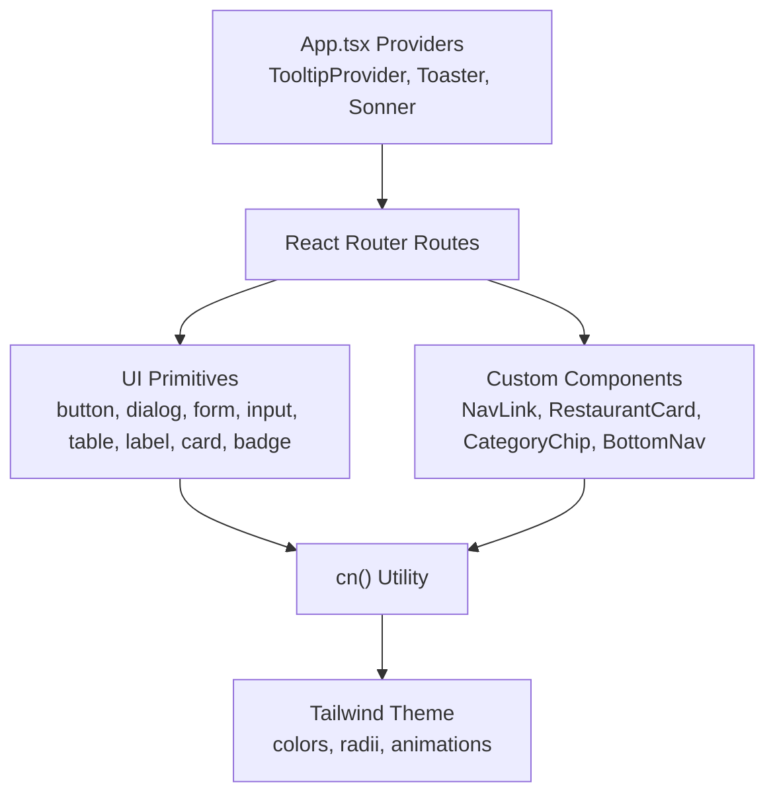
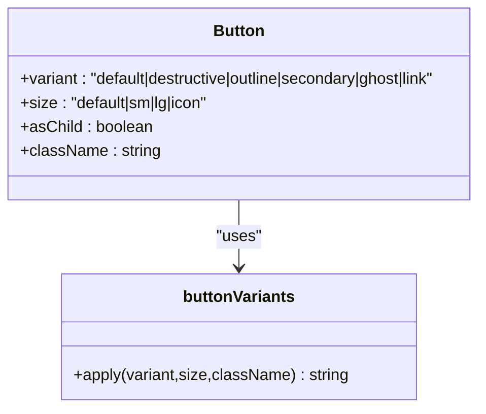
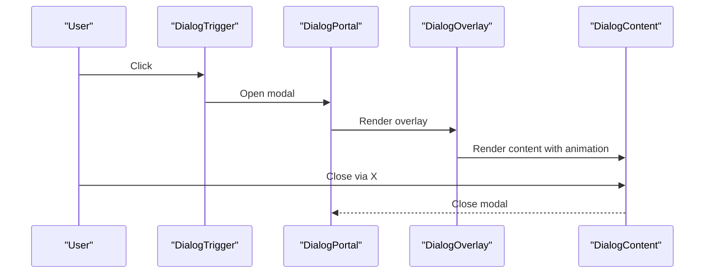
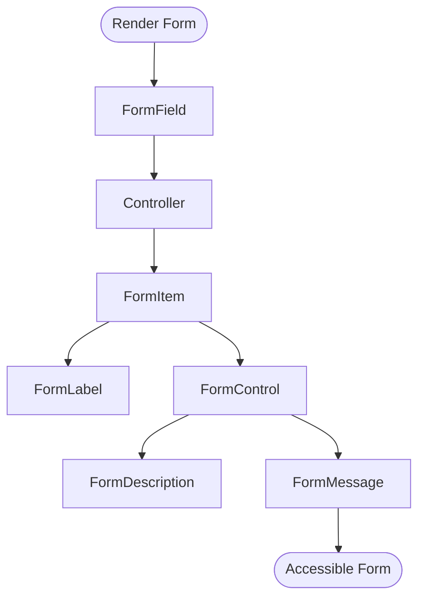
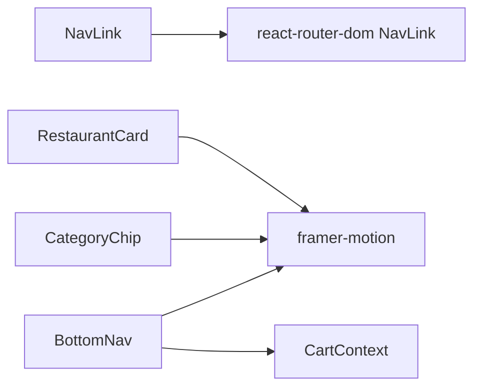
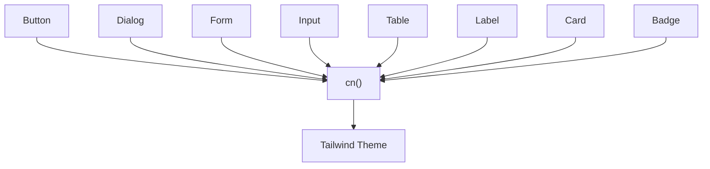

# UI Component System

<cite>
**Referenced Files in This Document**
- [button.tsx](file://src/components/ui/button.tsx)
- [dialog.tsx](file://src/components/ui/dialog.tsx)
- [form.tsx](file://src/components/ui/form.tsx)
- [input.tsx](file://src/components/ui/input.tsx)
- [table.tsx](file://src/components/ui/table.tsx)
- [label.tsx](file://src/components/ui/label.tsx)
- [card.tsx](file://src/components/ui/card.tsx)
- [badge.tsx](file://src/components/ui/badge.tsx)
- [utils.ts](file://src/lib/utils.ts)
- [tailwind.config.ts](file://tailwind.config.ts)
- [App.tsx](file://src/App.tsx)
- [NavLink.tsx](file://src/components/NavLink.tsx)
- [RestaurantCard.tsx](file://src/components/RestaurantCard.tsx)
- [CategoryChip.tsx](file://src/components/CategoryChip.tsx)
- [BottomNav.tsx](file://src/components/BottomNav.tsx)
</cite>

## Table of Contents
1. [Introduction](#introduction)
2. [Project Structure](#project-structure)
3. [Core Components](#core-components)
4. [Architecture Overview](#architecture-overview)
5. [Detailed Component Analysis](#detailed-component-analysis)
6. [Dependency Analysis](#dependency-analysis)
7. [Performance Considerations](#performance-considerations)
8. [Troubleshooting Guide](#troubleshooting-guide)
9. [Conclusion](#conclusion)
10. [Appendices](#appendices)

## Introduction
This document describes TIPPAY’s UI component system with a focus on the shadcn/ui-inspired primitives integrated into the application and the custom components that compose the product experience. It explains how components are structured, styled, composed, and extended, along with accessibility, dark mode, responsive design, and best practices for building consistent UIs.

## Project Structure
The UI system is organized around:
- A shared design system under src/components/ui implementing shadcn-style primitives (Button, Dialog, Form, Input, Table, Label, Card, Badge, etc.).
- A set of custom components that build higher-level experiences (Navigation, Cards, Chips, etc.).
- A centralized styling strategy powered by Tailwind CSS with a custom theme and a utility merging function.

**Diagram sources**
- [button.tsx:1-48](file://src/components/ui/button.tsx#L1-L48)
- [dialog.tsx:1-96](file://src/components/ui/dialog.tsx#L1-L96)
- [form.tsx:1-130](file://src/components/ui/form.tsx#L1-L130)
- [input.tsx:1-23](file://src/components/ui/input.tsx#L1-L23)
- [table.tsx:1-73](file://src/components/ui/table.tsx#L1-L73)
- [label.tsx:1-18](file://src/components/ui/label.tsx#L1-L18)
- [card.tsx:1-44](file://src/components/ui/card.tsx#L1-L44)
- [badge.tsx:1-30](file://src/components/ui/badge.tsx#L1-L30)
- [utils.ts:1-7](file://src/lib/utils.ts#L1-L7)
- [tailwind.config.ts:1-123](file://tailwind.config.ts#L1-L123)
- [NavLink.tsx:1-29](file://src/components/NavLink.tsx#L1-L29)
- [RestaurantCard.tsx:1-64](file://src/components/RestaurantCard.tsx#L1-L64)
- [CategoryChip.tsx:1-32](file://src/components/CategoryChip.tsx#L1-L32)
- [BottomNav.tsx:1-65](file://src/components/BottomNav.tsx#L1-L65)

**Section sources**
- [tailwind.config.ts:1-123](file://tailwind.config.ts#L1-L123)
- [utils.ts:1-7](file://src/lib/utils.ts#L1-L7)
- [App.tsx:1-165](file://src/App.tsx#L1-L165)

## Core Components
This section documents the core UI primitives and their composition patterns.

- Button
  - Purpose: Unified button primitive with variants and sizes, supporting both button and slot semantics.
  - Key features:
    - Variants: default, destructive, outline, secondary, ghost, link.
    - Sizes: default, sm, lg, icon.
    - asChild pattern via @radix-ui/react-slot to render alternate elements while preserving behavior.
  - Accessibility: Inherits native button semantics; supports focus-visible ring and disabled state.
  - Styling: Uses class-variance-authority for variant logic and cn() for merging.

- Dialog
  - Purpose: Modal overlay with animated content, header/footer, title, and description slots.
  - Key features:
    - Root, Trigger, Portal, Overlay, Close, Content, Header, Footer, Title, Description.
    - Animations for open/close transitions.
    - Focus management and keyboard interactions via Radix UI.
  - Accessibility: Proper ARIA roles and focus trapping through Radix primitives.

- Form
  - Purpose: React Hook Form provider with form field composition helpers.
  - Key features:
    - Form, FormField, FormItem, FormLabel, FormControl, FormDescription, FormMessage.
    - useFormField hook integrates field state with accessibility attributes.
    - Controlled components rendered via Slot for flexibility.
  - Accessibility: Auto-injects aria-* attributes and error messaging.

- Input
  - Purpose: Styled text input with consistent sizing and focus states.
  - Key features:
    - Inherits base styles for border, background, placeholder, and focus-visible ring.
    - Responsive font sizing via md:text-sm.

- Table
  - Purpose: Scrollable, accessible table with semantic sections and rows.
  - Key features:
    - Container div for horizontal scrolling.
    - Semantic head/body/footer and cell/head/caption components.
    - Hover and selection states via data attributes.

- Label
  - Purpose: Accessible label for form controls.
  - Key features:
    - Variants via class-variance-authority.
    - Disabled state styling.

- Card
  - Purpose: Container with header/title/description/content/footer segments.
  - Key features:
    - Consistent spacing and typography.
    - Foreground/background color tokens.

- Badge
  - Purpose: Tag-like indicator with variants.
  - Key features:
    - Variants: default, secondary, destructive, outline.
    - Border and ring focus support.

**Section sources**
- [button.tsx:1-48](file://src/components/ui/button.tsx#L1-L48)
- [dialog.tsx:1-96](file://src/components/ui/dialog.tsx#L1-L96)
- [form.tsx:1-130](file://src/components/ui/form.tsx#L1-L130)
- [input.tsx:1-23](file://src/components/ui/input.tsx#L1-L23)
- [table.tsx:1-73](file://src/components/ui/table.tsx#L1-L73)
- [label.tsx:1-18](file://src/components/ui/label.tsx#L1-L18)
- [card.tsx:1-44](file://src/components/ui/card.tsx#L1-L44)
- [badge.tsx:1-30](file://src/components/ui/badge.tsx#L1-L30)

## Architecture Overview
The UI architecture centers on:
- Shared primitives under src/components/ui that encapsulate styling and behavior.
- A cn() utility that merges Tailwind classes safely.
- A Tailwind theme extending color palettes, radii, and animations.
- Custom components that compose primitives and integrate with routing and contexts.

**Diagram sources**
- [App.tsx:124-162](file://src/App.tsx#L124-L162)
- [button.tsx:1-48](file://src/components/ui/button.tsx#L1-L48)
- [dialog.tsx:1-96](file://src/components/ui/dialog.tsx#L1-L96)
- [form.tsx:1-130](file://src/components/ui/form.tsx#L1-L130)
- [input.tsx:1-23](file://src/components/ui/input.tsx#L1-L23)
- [table.tsx:1-73](file://src/components/ui/table.tsx#L1-L73)
- [label.tsx:1-18](file://src/components/ui/label.tsx#L1-L18)
- [card.tsx:1-44](file://src/components/ui/card.tsx#L1-L44)
- [badge.tsx:1-30](file://src/components/ui/badge.tsx#L1-L30)
- [NavLink.tsx:1-29](file://src/components/NavLink.tsx#L1-L29)
- [RestaurantCard.tsx:1-64](file://src/components/RestaurantCard.tsx#L1-L64)
- [CategoryChip.tsx:1-32](file://src/components/CategoryChip.tsx#L1-L32)
- [BottomNav.tsx:1-65](file://src/components/BottomNav.tsx#L1-L65)
- [utils.ts:1-7](file://src/lib/utils.ts#L1-L7)
- [tailwind.config.ts:1-123](file://tailwind.config.ts#L1-L123)

## Detailed Component Analysis

### Button
- Composition pattern:
  - Accepts variant and size props, merges with className via cn().
  - Supports asChild to render a different tag while keeping event handlers and semantics.
- Prop interfaces:
  - Inherits button HTML attributes plus variant/size from class-variance-authority.
- Accessibility:
  - Focus-visible ring and disabled pointer-events.
- Customization:
  - Extend variants/sizes in buttonVariants; maintain contrast with theme tokens.

**Diagram sources**
- [button.tsx:7-31](file://src/components/ui/button.tsx#L7-L31)

**Section sources**
- [button.tsx:1-48](file://src/components/ui/button.tsx#L1-L48)

### Dialog
- Composition pattern:
  - Provides overlay, portal, and animated content; exposes header/footer/title/description slots.
  - Close button includes screen-reader text and focus ring.
- Accessibility:
  - Uses Radix UI primitives for ARIA roles and focus management.
- Animation:
  - Fade/zoom/slide transitions on open/close.

**Diagram sources**
- [dialog.tsx:7-52](file://src/components/ui/dialog.tsx#L7-L52)

**Section sources**
- [dialog.tsx:1-96](file://src/components/ui/dialog.tsx#L1-L96)

### Form
- Composition pattern:
  - FormField wraps Controller and manages field context.
  - useFormField reads field state and generates IDs for accessibility.
  - FormControl injects aria attributes and forwards ref to child.
- Accessibility:
  - aria-invalid, aria-describedby, and explicit labeling via FormLabel/FormDescription/FormMessage.
- Error handling:
  - Renders error messages when present; otherwise renders children.

**Diagram sources**
- [form.tsx:20-54](file://src/components/ui/form.tsx#L20-L54)

**Section sources**
- [form.tsx:1-130](file://src/components/ui/form.tsx#L1-L130)

### Input
- Composition pattern:
  - Wraps native input with consistent border, background, and focus-visible ring.
  - Inherits placeholder and file input styles via shared base classes.
- Customization:
  - Add variants via additional class sets if needed; keep responsive font sizing.

**Section sources**
- [input.tsx:1-23](file://src/components/ui/input.tsx#L1-L23)

### Table
- Composition pattern:
  - Table container ensures horizontal scrolling on small screens.
  - Semantic sections and cells with hover and selection states.
- Customization:
  - Extend row/cell classes for striped or bordered tables; maintain contrast with theme tokens.

**Section sources**
- [table.tsx:1-73](file://src/components/ui/table.tsx#L1-L73)

### Label
- Composition pattern:
  - Uses class-variance-authority for label-specific variants.
  - Integrates with form components for disabled state styling.

**Section sources**
- [label.tsx:1-18](file://src/components/ui/label.tsx#L1-L18)

### Card
- Composition pattern:
  - Standardized segments for header, title, description, content, footer.
  - Consistent spacing and typography tokens.

**Section sources**
- [card.tsx:1-44](file://src/components/ui/card.tsx#L1-L44)

### Badge
- Composition pattern:
  - Variants for primary/secondary/destructive/outline.
  - Focus ring support via inherited tokens.

**Section sources**
- [badge.tsx:1-30](file://src/components/ui/badge.tsx#L1-L30)

### Custom Navigation Components
- NavLink
  - Wrapper around react-router’s NavLink with className composition and active/pending states.
  - Uses cn() to merge base and active/pending classes.

- RestaurantCard
  - Motion-enhanced card with image, rating, delivery time, distance, and offer badges.
  - Uses theme tokens for backgrounds and accents.

- CategoryChip
  - Animated chip with active state highlighting and icon images.

- BottomNav
  - Mobile-first bottom navigation with cart item count indicator and active state animation.

**Diagram sources**
- [NavLink.tsx:11-24](file://src/components/NavLink.tsx#L11-L24)
- [RestaurantCard.tsx:14-60](file://src/components/RestaurantCard.tsx#L14-L60)
- [CategoryChip.tsx:11-29](file://src/components/CategoryChip.tsx#L11-L29)
- [BottomNav.tsx:14-62](file://src/components/BottomNav.tsx#L14-L62)

**Section sources**
- [NavLink.tsx:1-29](file://src/components/NavLink.tsx#L1-L29)
- [RestaurantCard.tsx:1-64](file://src/components/RestaurantCard.tsx#L1-L64)
- [CategoryChip.tsx:1-32](file://src/components/CategoryChip.tsx#L1-L32)
- [BottomNav.tsx:1-65](file://src/components/BottomNav.tsx#L1-L65)

## Dependency Analysis
- Styling dependency chain:
  - Components depend on cn() to merge classes.
  - cn() depends on clsx and tailwind-merge to deduplicate and merge Tailwind utilities.
  - Tailwind config defines theme tokens and animations used across components.
- Provider stack:
  - App.tsx composes providers for routing, auth, cart, orders, locations, favorites, languages, restaurants, reviews, notifications, tooltips, toasts, and React Query.

**Diagram sources**
- [utils.ts:1-7](file://src/lib/utils.ts#L1-L7)
- [tailwind.config.ts:1-123](file://tailwind.config.ts#L1-L123)
- [button.tsx:1-48](file://src/components/ui/button.tsx#L1-L48)
- [dialog.tsx:1-96](file://src/components/ui/dialog.tsx#L1-L96)
- [form.tsx:1-130](file://src/components/ui/form.tsx#L1-L130)
- [input.tsx:1-23](file://src/components/ui/input.tsx#L1-L23)
- [table.tsx:1-73](file://src/components/ui/table.tsx#L1-L73)
- [label.tsx:1-18](file://src/components/ui/label.tsx#L1-L18)
- [card.tsx:1-44](file://src/components/ui/card.tsx#L1-L44)
- [badge.tsx:1-30](file://src/components/ui/badge.tsx#L1-L30)

**Section sources**
- [utils.ts:1-7](file://src/lib/utils.ts#L1-L7)
- [tailwind.config.ts:1-123](file://tailwind.config.ts#L1-L123)
- [App.tsx:124-162](file://src/App.tsx#L124-L162)

## Performance Considerations
- Prefer variants and sizes defined in primitives to minimize custom CSS and reduce repaints.
- Use motion sparingly; leverage layout animations (e.g., BottomNav indicator) with layoutId for smooth transitions.
- Keep className merging minimal per render; reuse constant class strings where possible.
- Use responsive utilities judiciously; avoid excessive breakpoints in custom components.

## Troubleshooting Guide
- Dialog does not close or focus is lost:
  - Ensure DialogTrigger and DialogClose are used correctly and that portals are rendered.
  - Verify that the close button has proper focus-visible ring and aria-labels.
- Form validation errors not visible:
  - Confirm FormField is wrapping Controller and useFormField is used inside FormLabel/FormControl/FormMessage.
  - Check that aria-invalid and aria-describedby are being set.
- Button styles not applying:
  - Verify variant/size props and that cn() merges classes correctly.
  - Confirm Tailwind content paths include the component directories.
- Dark mode not working:
  - Ensure darkMode is configured and theme tokens are defined in Tailwind config.
  - Toggle the dark class on the root element if needed.

**Section sources**
- [dialog.tsx:1-96](file://src/components/ui/dialog.tsx#L1-L96)
- [form.tsx:1-130](file://src/components/ui/form.tsx#L1-L130)
- [button.tsx:1-48](file://src/components/ui/button.tsx#L1-L48)
- [tailwind.config.ts:1-123](file://tailwind.config.ts#L1-L123)

## Conclusion
TIPPAY’s UI system blends shadcn/ui-inspired primitives with custom components to deliver a cohesive, accessible, and theme-consistent interface. The cn() utility and Tailwind theme enable scalable styling, while the provider stack and routing integrate components into a full application experience. Following the documented patterns ensures consistency, accessibility, and maintainability across the product.

## Appendices

### Styling Strategy and Theme Configuration
- Theme tokens:
  - Colors are defined as HSL values with semantic groups (primary, secondary, destructive, muted, accent, popover, card, sidebar, wheat, gold, success, warning, info).
  - Typography uses DM Sans and Space Grotesk; radius tokens drive border-radius across components.
- Animations:
  - Custom keyframes and animation durations are provided for consistent micro-interactions.
- Dark mode:
  - Enabled via class-based configuration; ensure the dark class propagates to the root element when needed.

**Section sources**
- [tailwind.config.ts:1-123](file://tailwind.config.ts#L1-L123)

### Accessibility Features
- Buttons:
  - Focus-visible ring and disabled state handling.
- Dialogs:
  - Overlay and content animations; close button with sr-only label.
- Forms:
  - useFormField injects aria-invalid and aria-describedby; FormLabel associates labels with controls.
- Labels:
  - Disabled state styling for form controls.

**Section sources**
- [button.tsx:1-48](file://src/components/ui/button.tsx#L1-L48)
- [dialog.tsx:1-96](file://src/components/ui/dialog.tsx#L1-L96)
- [form.tsx:1-130](file://src/components/ui/form.tsx#L1-L130)
- [label.tsx:1-18](file://src/components/ui/label.tsx#L1-L18)

### Responsive Design Patterns
- Use md:text-sm for responsive font scaling in inputs.
- Wrap tables in overflow containers for mobile readability.
- Utilize flex utilities and gap tokens for adaptive layouts in cards and chips.

**Section sources**
- [input.tsx:1-23](file://src/components/ui/input.tsx#L1-L23)
- [table.tsx:1-73](file://src/components/ui/table.tsx#L1-L73)
- [card.tsx:1-44](file://src/components/ui/card.tsx#L1-L44)
- [badge.tsx:1-30](file://src/components/ui/badge.tsx#L1-L30)

### Best Practices for Component Development
- Encapsulate styling in cn() and class-variance-authority variants.
- Compose primitives to build higher-level components (e.g., cards, chips).
- Respect accessibility by managing focus, ARIA attributes, and keyboard interactions.
- Keep custom components declarative and context-aware (e.g., BottomNav uses CartContext).
- Maintain a single source of truth for theme tokens via Tailwind config.

**Section sources**
- [utils.ts:1-7](file://src/lib/utils.ts#L1-L7)
- [tailwind.config.ts:1-123](file://tailwind.config.ts#L1-L123)
- [BottomNav.tsx:1-65](file://src/components/BottomNav.tsx#L1-L65)