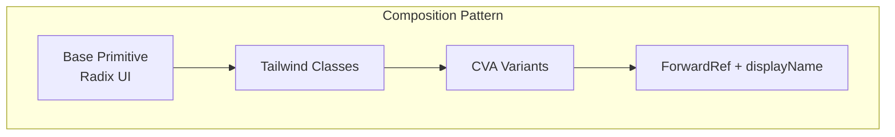
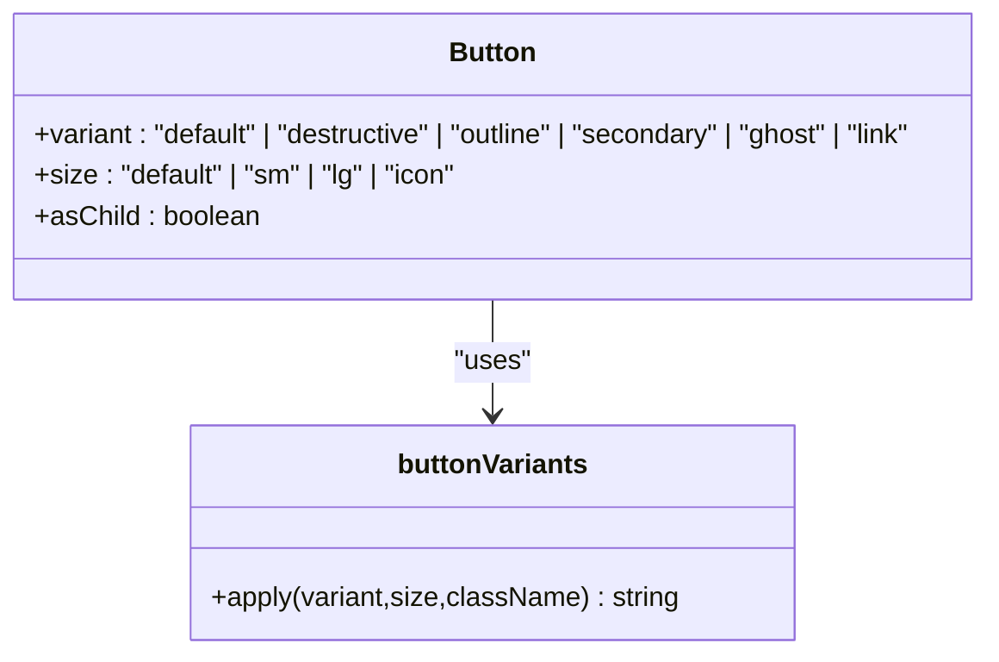
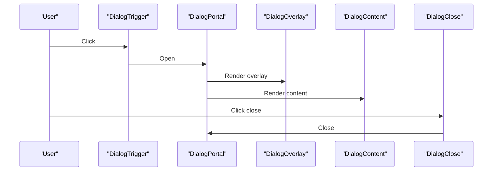
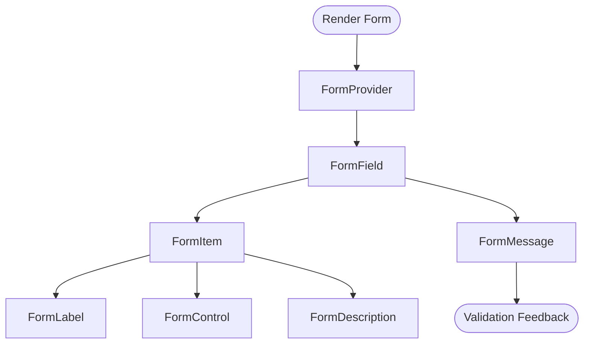
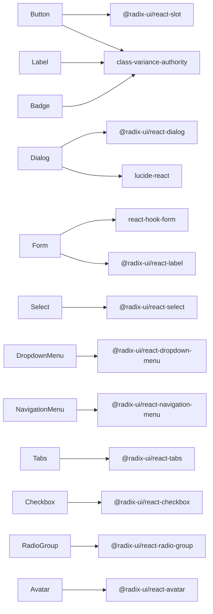

# shadcn/ui Component Library

<cite>
**Referenced Files in This Document**
- [button.tsx](file://src/components/ui/button.tsx)
- [dialog.tsx](file://src/components/ui/dialog.tsx)
- [form.tsx](file://src/components/ui/form.tsx)
- [input.tsx](file://src/components/ui/input.tsx)
- [table.tsx](file://src/components/ui/table.tsx)
- [card.tsx](file://src/components/ui/card.tsx)
- [dropdown-menu.tsx](file://src/components/ui/dropdown-menu.tsx)
- [navigation-menu.tsx](file://src/components/ui/navigation-menu.tsx)
- [label.tsx](file://src/components/ui/label.tsx)
- [textarea.tsx](file://src/components/ui/textarea.tsx)
- [select.tsx](file://src/components/ui/select.tsx)
- [checkbox.tsx](file://src/components/ui/checkbox.tsx)
- [radio-group.tsx](file://src/components/ui/radio-group.tsx)
- [tabs.tsx](file://src/components/ui/tabs.tsx)
- [badge.tsx](file://src/components/ui/badge.tsx)
- [avatar.tsx](file://src/components/ui/avatar.tsx)
- [components.json](file://components.json)
- [tailwind.config.ts](file://tailwind.config.ts)
- [utils.ts](file://src/lib/utils.ts)
</cite>

## Table of Contents
1. [Introduction](#introduction)
2. [Project Structure](#project-structure)
3. [Core Components](#core-components)
4. [Architecture Overview](#architecture-overview)
5. [Detailed Component Analysis](#detailed-component-analysis)
6. [Dependency Analysis](#dependency-analysis)
7. [Performance Considerations](#performance-considerations)
8. [Troubleshooting Guide](#troubleshooting-guide)
9. [Conclusion](#conclusion)
10. [Appendices](#appendices)

## Introduction
This document describes TIPPAY’s integration of the shadcn/ui component library. It explains how components are structured, composed, and styled using Tailwind CSS and Radix UI primitives. It also documents configuration via components.json, prop interfaces, customization options, accessibility features, and patterns for state management and composition. The guide focuses on the available components: Button, Dialog, Form, Input, Table, Card, DropdownMenu, NavigationMenu, and related form controls and layout helpers.

## Project Structure
The UI components live under src/components/ui and are built with:
- Radix UI primitives for accessibility and composability
- Tailwind CSS for styling and theme tokens
- class-variance-authority (CVA) for variant-driven styling
- react-hook-form for form integration
- lucide-react icons for visual indicators

```mermaid
graph TB
subgraph "UI Components"
Btn["Button<br/>variants + sizes"]
Dlg["Dialog<br/>Root/Trigger/Portal/Overlay/Content/Close"]
Frm["Form<br/>Form/FormLabel/FormControl/FormMessage"]
Inp["Input"]
Tbl["Table<br/>Table/TableHeader/TableBody/TableRow/TableCell"]
C["Card<br/>Card/CardHeader/CardTitle/CardContent"]
DM["DropdownMenu<br/>Root/Trigger/Content/Items"]
NM["NavigationMenu<br/>Root/List/Trigger/Content"]
Sel["Select<br/>Root/Trigger/Content/Items"]
Chk["Checkbox"]
Rdg["RadioGroup"]
Tab["Tabs"]
Lbl["Label"]
Txt["Textarea"]
Bad["Badge"]
Ava["Avatar"]
end
subgraph "Styling"
TW["Tailwind CSS"]
Cfg["components.json"]
Utils["cn() utils"]
end
Btn --> TW
Dlg --> TW
Frm --> TW
Inp --> TW
Tbl --> TW
C --> TW
DM --> TW
NM --> TW
Sel --> TW
Chk --> TW
Rdg --> TW
Tab --> TW
Lbl --> TW
Txt --> TW
Bad --> TW
Ava --> TW
Cfg --> TW
Utils --> Btn
Utils --> Dlg
Utils --> Frm
Utils --> Inp
Utils --> Tbl
Utils --> C
Utils --> DM
Utils --> NM
Utils --> Sel
Utils --> Chk
Utils --> Rdg
Utils --> Tab
Utils --> Lbl
Utils --> Txt
Utils --> Bad
Utils --> Ava
```

**Diagram sources**
- [button.tsx:1-48](file://src/components/ui/button.tsx#L1-L48)
- [dialog.tsx:1-96](file://src/components/ui/dialog.tsx#L1-L96)
- [form.tsx:1-130](file://src/components/ui/form.tsx#L1-L130)
- [input.tsx:1-23](file://src/components/ui/input.tsx#L1-L23)
- [table.tsx:1-73](file://src/components/ui/table.tsx#L1-L73)
- [card.tsx:1-44](file://src/components/ui/card.tsx#L1-L44)
- [dropdown-menu.tsx:1-180](file://src/components/ui/dropdown-menu.tsx#L1-L180)
- [navigation-menu.tsx:1-121](file://src/components/ui/navigation-menu.tsx#L1-L121)
- [select.tsx:1-144](file://src/components/ui/select.tsx#L1-L144)
- [checkbox.tsx:1-27](file://src/components/ui/checkbox.tsx#L1-L27)
- [radio-group.tsx:1-37](file://src/components/ui/radio-group.tsx#L1-L37)
- [tabs.tsx:1-54](file://src/components/ui/tabs.tsx#L1-L54)
- [label.tsx:1-18](file://src/components/ui/label.tsx#L1-L18)
- [textarea.tsx:1-22](file://src/components/ui/textarea.tsx#L1-L22)
- [badge.tsx:1-30](file://src/components/ui/badge.tsx#L1-L30)
- [avatar.tsx:1-39](file://src/components/ui/avatar.tsx#L1-L39)
- [components.json](file://components.json)
- [utils.ts](file://src/lib/utils.ts)

**Section sources**
- [components.json](file://components.json)
- [tailwind.config.ts](file://tailwind.config.ts)
- [utils.ts](file://src/lib/utils.ts)

## Core Components
This section summarizes the primary components and their roles in the system.

- Button: Variants (default, destructive, outline, secondary, ghost, link) and sizes (default, sm, lg, icon). Supports asChild composition via @radix-ui/react-slot.
- Dialog: Root, Trigger, Portal, Overlay, Content, Close, Header/Footer, Title, Description. Includes animation classes and accessibility attributes.
- Form: Provider, FormField, FormItem, FormLabel, FormControl, FormDescription, FormMessage. Integrates with react-hook-form and exposes useFormField for accessibility IDs.
- Input: Styled text input with focus-visible ring and placeholder styling.
- Table: Wrapper with horizontal scrolling, plus Table, TableHeader, TableBody, TableFooter, TableRow, TableHead, TableCell, TableCaption.
- Card: Card container with header, footer, title, description, and content slots.
- DropdownMenu: Root, Trigger, Portal, Content, Items (item, checkbox item, radio item), Label, Separator, Sub (trigger/content), RadioGroup.
- NavigationMenu: Root, List, Item, Trigger (with indicator), Content, Link, Viewport, Indicator.
- Select: Root, Group, Value, Trigger, Content (with scroll buttons), Label, Item, Separator.
- Checkbox, RadioGroup: Accessible primitives with indicator visuals.
- Tabs: Root, List, Trigger, Content.
- Label, Textarea: Label styling and textarea base styles.
- Badge, Avatar: Auxiliary UI elements.

**Section sources**
- [button.tsx:1-48](file://src/components/ui/button.tsx#L1-L48)
- [dialog.tsx:1-96](file://src/components/ui/dialog.tsx#L1-L96)
- [form.tsx:1-130](file://src/components/ui/form.tsx#L1-L130)
- [input.tsx:1-23](file://src/components/ui/input.tsx#L1-L23)
- [table.tsx:1-73](file://src/components/ui/table.tsx#L1-L73)
- [card.tsx:1-44](file://src/components/ui/card.tsx#L1-L44)
- [dropdown-menu.tsx:1-180](file://src/components/ui/dropdown-menu.tsx#L1-L180)
- [navigation-menu.tsx:1-121](file://src/components/ui/navigation-menu.tsx#L1-L121)
- [select.tsx:1-144](file://src/components/ui/select.tsx#L1-L144)
- [checkbox.tsx:1-27](file://src/components/ui/checkbox.tsx#L1-L27)
- [radio-group.tsx:1-37](file://src/components/ui/radio-group.tsx#L1-L37)
- [tabs.tsx:1-54](file://src/components/ui/tabs.tsx#L1-L54)
- [label.tsx:1-18](file://src/components/ui/label.tsx#L1-L18)
- [textarea.tsx:1-22](file://src/components/ui/textarea.tsx#L1-L22)
- [badge.tsx:1-30](file://src/components/ui/badge.tsx#L1-L30)
- [avatar.tsx:1-39](file://src/components/ui/avatar.tsx#L1-L39)

## Architecture Overview
The components follow a consistent pattern:
- Use Radix UI primitives for semantics and keyboard navigation.
- Apply Tailwind utility classes for layout and color tokens.
- Use class-variance-authority to define variant sets and defaults.
- Compose small building blocks into larger compound components.
- Expose forwardRef and displayName for better devtools and accessibility.

[No sources needed since this diagram shows conceptual workflow, not actual code structure]

## Detailed Component Analysis

### Button
- Purpose: Unified button with variants and sizes.
- Props: Inherits button attributes; adds variant, size, and asChild.
- Composition: Uses Slot when asChild is true to render any element as the button.
- Accessibility: Inherits focus-visible ring and disabled states.

**Diagram sources**
- [button.tsx:7-31](file://src/components/ui/button.tsx#L7-L31)

**Section sources**
- [button.tsx:33-47](file://src/components/ui/button.tsx#L33-L47)

### Dialog
- Purpose: Modal overlay with animated content and close trigger.
- Composition: Root, Trigger, Portal, Overlay, Content, Close, Header/Footer, Title, Description.
- Accessibility: Focus trapping via Radix UI; screen-reader support via sr-only close label.

**Diagram sources**
- [dialog.tsx:7-52](file://src/components/ui/dialog.tsx#L7-L52)

**Section sources**
- [dialog.tsx:1-96](file://src/components/ui/dialog.tsx#L1-L96)

### Form (react-hook-form integration)
- Purpose: Structured form fields with labels, controls, descriptions, and messages.
- Composition: Form (provider), FormField (context provider), FormItem (context provider), FormLabel, FormControl, FormDescription, FormMessage.
- Accessibility: useFormField derives aria-* attributes and IDs for assistive tech.

**Diagram sources**
- [form.tsx:9-129](file://src/components/ui/form.tsx#L9-L129)

**Section sources**
- [form.tsx:1-130](file://src/components/ui/form.tsx#L1-L130)

### Input
- Purpose: Styled text input with focus-visible ring and placeholder styling.
- Props: Inherits input HTML attributes; className merged with defaults.

**Section sources**
- [input.tsx:1-23](file://src/components/ui/input.tsx#L1-L23)

### Table
- Purpose: Scrollable table wrapper with semantic sections and rows.
- Composition: Table (wrapper), TableHeader, TableBody, TableFooter, TableRow, TableHead, TableCell, TableCaption.

**Section sources**
- [table.tsx:1-73](file://src/components/ui/table.tsx#L1-L73)

### Card
- Purpose: Content container with header, footer, title, description, and content areas.
- Composition: Card, CardHeader, CardTitle, CardDescription, CardContent, CardFooter.

**Section sources**
- [card.tsx:1-44](file://src/components/ui/card.tsx#L1-L44)

### DropdownMenu
- Purpose: Menu with nested submenus, checkboxes, radios, and separators.
- Composition: Root, Trigger, Portal, Content, Items, Sub (trigger/content), RadioGroup, Label, Separator.

**Section sources**
- [dropdown-menu.tsx:1-180](file://src/components/ui/dropdown-menu.tsx#L1-L180)

### NavigationMenu
- Purpose: Multi-level navigation with animated viewport and indicator.
- Composition: Root, List, Item, Trigger (with chevron), Content, Link, Viewport, Indicator.

**Section sources**
- [navigation-menu.tsx:1-121](file://src/components/ui/navigation-menu.tsx#L1-L121)

### Select
- Purpose: Single/multi-selection dropdown with scrollable viewport and icons.
- Composition: Root, Group, Value, Trigger, Content (with scroll buttons), Label, Item, Separator.

**Section sources**
- [select.tsx:1-144](file://src/components/ui/select.tsx#L1-L144)

### Checkbox, RadioGroup
- Purpose: Accessible selection controls with visual indicators.
- Composition: Checkbox primitive with check icon; RadioGroup with indicator circle.

**Section sources**
- [checkbox.tsx:1-27](file://src/components/ui/checkbox.tsx#L1-L27)
- [radio-group.tsx:1-37](file://src/components/ui/radio-group.tsx#L1-L37)

### Tabs
- Purpose: Tabbed content switching with accessible triggers.
- Composition: Root, List, Trigger, Content.

**Section sources**
- [tabs.tsx:1-54](file://src/components/ui/tabs.tsx#L1-L54)

### Label, Textarea
- Purpose: Label styling and textarea base styles.
- Composition: Label uses CVA; Textarea wraps textarea with focus-visible ring.

**Section sources**
- [label.tsx:1-18](file://src/components/ui/label.tsx#L1-L18)
- [textarea.tsx:1-22](file://src/components/ui/textarea.tsx#L1-L22)

### Badge, Avatar
- Purpose: Auxiliary UI elements for tags and user avatars.
- Composition: Badge with variants; Avatar with image and fallback.

**Section sources**
- [badge.tsx:1-30](file://src/components/ui/badge.tsx#L1-L30)
- [avatar.tsx:1-39](file://src/components/ui/avatar.tsx#L1-L39)

## Dependency Analysis
Components share common dependencies and patterns:
- Radix UI primitives for semantics and keyboard navigation
- Tailwind CSS for styling and theme tokens
- class-variance-authority for variant sets
- lucide-react for icons
- react-hook-form for form integration
- cn() utility for merging Tailwind classes

**Diagram sources**
- [button.tsx:1-6](file://src/components/ui/button.tsx#L1-L6)
- [dialog.tsx:1-6](file://src/components/ui/dialog.tsx#L1-L6)
- [form.tsx:1-8](file://src/components/ui/form.tsx#L1-L8)
- [select.tsx:1-6](file://src/components/ui/select.tsx#L1-L6)
- [dropdown-menu.tsx:1-6](file://src/components/ui/dropdown-menu.tsx#L1-L6)
- [navigation-menu.tsx:1-6](file://src/components/ui/navigation-menu.tsx#L1-L6)
- [tabs.tsx:1-5](file://src/components/ui/tabs.tsx#L1-L5)
- [checkbox.tsx:1-6](file://src/components/ui/checkbox.tsx#L1-L6)
- [radio-group.tsx:1-6](file://src/components/ui/radio-group.tsx#L1-L6)
- [label.tsx:1-6](file://src/components/ui/label.tsx#L1-L6)
- [badge.tsx:1-6](file://src/components/ui/badge.tsx#L1-L6)
- [avatar.tsx:1-6](file://src/components/ui/avatar.tsx#L1-L6)

**Section sources**
- [utils.ts](file://src/lib/utils.ts)

## Performance Considerations
- Prefer variant composition over runtime conditionals to keep render paths predictable.
- Use asChild where appropriate to avoid unnecessary DOM wrappers.
- Keep className merging minimal; leverage default variants to reduce per-instance overrides.
- Avoid heavy computations inside component render functions; memoize derived values at the nearest parent when needed.

[No sources needed since this section provides general guidance]

## Troubleshooting Guide
- Missing focus rings or incorrect focus styles: Verify Tailwind configuration and ensure focus-visible utilities are enabled.
- Form validation not announced: Confirm useFormField is used within FormField and that aria-invalid and aria-describedby are set on the control.
- Dialog not closing or focus not trapped: Ensure DialogTrigger and DialogClose are used correctly and that Portal renders Overlay and Content.
- Select/Menu items not visible: Check that Portal is rendering and that viewport sizing classes are applied.

**Section sources**
- [form.tsx:85-99](file://src/components/ui/form.tsx#L85-L99)
- [dialog.tsx:30-52](file://src/components/ui/dialog.tsx#L30-L52)
- [select.tsx:61-91](file://src/components/ui/select.tsx#L61-L91)

## Conclusion
TIPPAY’s shadcn/ui integration leverages Radix UI for accessibility, Tailwind for styling, and CVA for variant-driven design. Components are composable, customizable, and accessible out of the box. By following the documented patterns, developers can extend components, maintain design consistency, and integrate state management seamlessly.

[No sources needed since this section summarizes without analyzing specific files]

## Appendices

### Configuration and Styling
- components.json: Defines component aliases and paths for shadcn/cli usage.
- Tailwind CSS: Provides design tokens (colors, spacing, typography) consumed by components.
- cn(): Utility for safely merging Tailwind classes with defaults.

**Section sources**
- [components.json](file://components.json)
- [tailwind.config.ts](file://tailwind.config.ts)
- [utils.ts](file://src/lib/utils.ts)

### Usage Patterns and Examples
Below are conceptual usage patterns for each component category. Replace placeholders with your app’s data and state.

- Button
  - Import: [button.tsx:1-48](file://src/components/ui/button.tsx#L1-L48)
  - Props: variant, size, asChild
  - Pattern: Wrap actionable elements; use variant="destructive" for danger actions; use size="icon" with icons.

- Dialog
  - Import: [dialog.tsx:1-96](file://src/components/ui/dialog.tsx#L1-L96)
  - Pattern: Place DialogTrigger inside a Button; wrap DialogContent with DialogHeader/DialogFooter and DialogTitle/DialogDescription.

- Form
  - Import: [form.tsx:1-130](file://src/components/ui/form.tsx#L1-L130)
  - Pattern: Wrap fields in FormItem; pair FormLabel with FormControl; show FormMessage conditionally.

- Input
  - Import: [input.tsx:1-23](file://src/components/ui/input.tsx#L1-L23)
  - Pattern: Pass type and className; rely on focus-visible ring for accessibility.

- Table
  - Import: [table.tsx:1-73](file://src/components/ui/table.tsx#L1-L73)
  - Pattern: Use Table wrapper for overflow; populate TableHeader/TableBody/TableFooter.

- Card
  - Import: [card.tsx:1-44](file://src/components/ui/card.tsx#L1-L44)
  - Pattern: Use CardHeader/CardTitle/CardDescription/CardContent/CardFooter to structure content.

- DropdownMenu
  - Import: [dropdown-menu.tsx:1-180](file://src/components/ui/dropdown-menu.tsx#L1-L180)
  - Pattern: Nest DropdownMenuSub for hierarchical menus; use DropdownMenuCheckboxItem for toggles.

- NavigationMenu
  - Import: [navigation-menu.tsx:1-121](file://src/components/ui/navigation-menu.tsx#L1-L121)
  - Pattern: Pair NavigationMenuTrigger with NavigationMenuContent; use NavigationMenuViewport for animations.

- Select
  - Import: [select.tsx:1-144](file://src/components/ui/select.tsx#L1-L144)
  - Pattern: Use SelectTrigger and SelectContent; populate with SelectItem entries.

- Checkbox, RadioGroup
  - Import: [checkbox.tsx:1-27](file://src/components/ui/checkbox.tsx#L1-L27), [radio-group.tsx:1-37](file://src/components/ui/radio-group.tsx#L1-L37)
  - Pattern: Use controlled values with onChange; ensure labels are associated via htmlFor.

- Tabs
  - Import: [tabs.tsx:1-54](file://src/components/ui/tabs.tsx#L1-L54)
  - Pattern: Use TabsList and TabsTrigger for navigation; TabsContent for panels.

- Label, Textarea
  - Import: [label.tsx:1-18](file://src/components/ui/label.tsx#L1-L18), [textarea.tsx:1-22](file://src/components/ui/textarea.tsx#L1-L22)
  - Pattern: Associate labels with inputs/areas; apply focus-visible ring.

- Badge, Avatar
  - Import: [badge.tsx:1-30](file://src/components/ui/badge.tsx#L1-L30), [avatar.tsx:1-39](file://src/components/ui/avatar.tsx#L1-L39)
  - Pattern: Use Badge for status/tags; Avatar for user/profile images.

**Section sources**
- [button.tsx:1-48](file://src/components/ui/button.tsx#L1-L48)
- [dialog.tsx:1-96](file://src/components/ui/dialog.tsx#L1-L96)
- [form.tsx:1-130](file://src/components/ui/form.tsx#L1-L130)
- [input.tsx:1-23](file://src/components/ui/input.tsx#L1-L23)
- [table.tsx:1-73](file://src/components/ui/table.tsx#L1-L73)
- [card.tsx:1-44](file://src/components/ui/card.tsx#L1-L44)
- [dropdown-menu.tsx:1-180](file://src/components/ui/dropdown-menu.tsx#L1-L180)
- [navigation-menu.tsx:1-121](file://src/components/ui/navigation-menu.tsx#L1-L121)
- [select.tsx:1-144](file://src/components/ui/select.tsx#L1-L144)
- [checkbox.tsx:1-27](file://src/components/ui/checkbox.tsx#L1-L27)
- [radio-group.tsx:1-37](file://src/components/ui/radio-group.tsx#L1-L37)
- [tabs.tsx:1-54](file://src/components/ui/tabs.tsx#L1-L54)
- [label.tsx:1-18](file://src/components/ui/label.tsx#L1-L18)
- [textarea.tsx:1-22](file://src/components/ui/textarea.tsx#L1-L22)
- [badge.tsx:1-30](file://src/components/ui/badge.tsx#L1-L30)
- [avatar.tsx:1-39](file://src/components/ui/avatar.tsx#L1-L39)