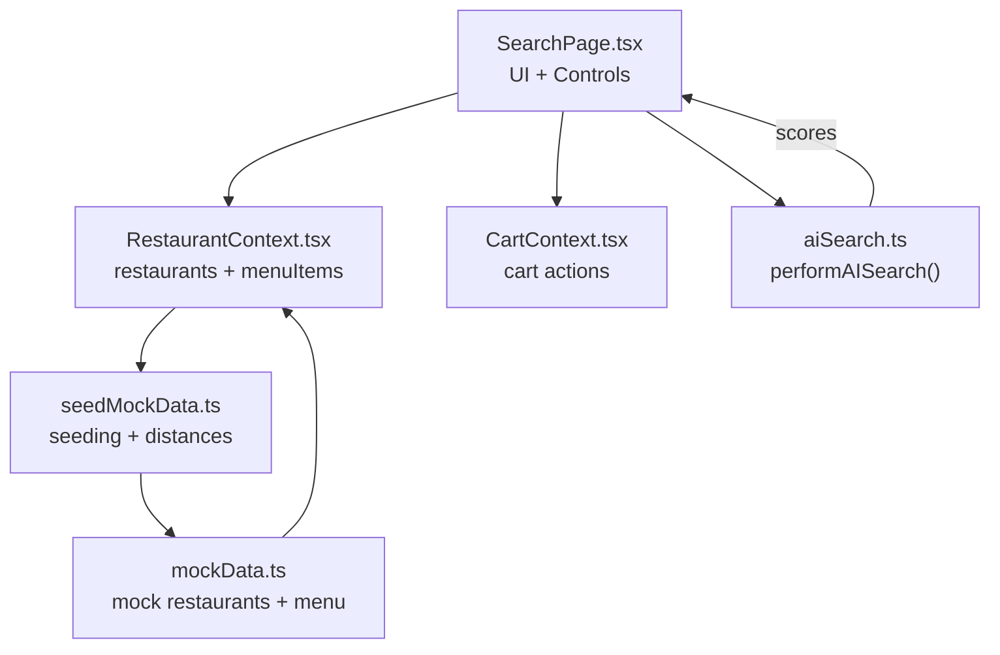
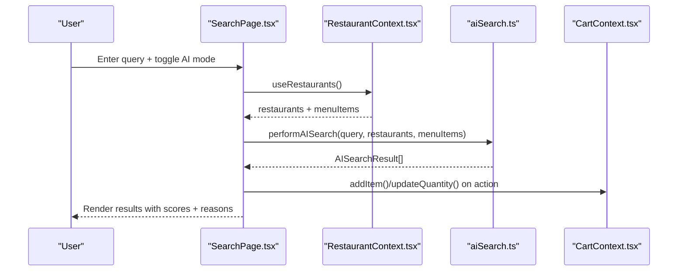
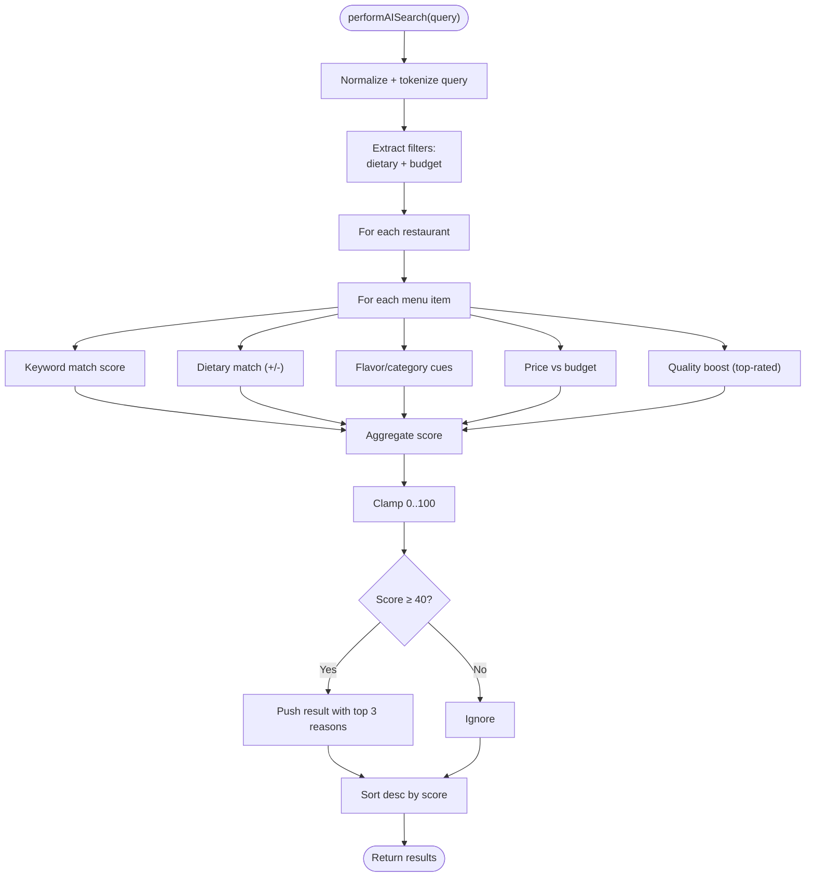
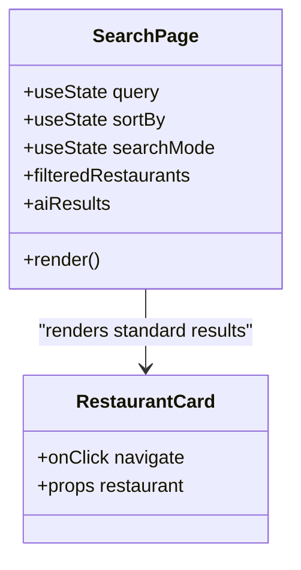
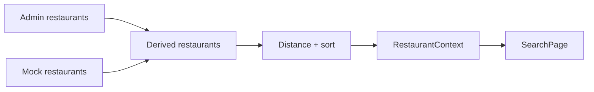
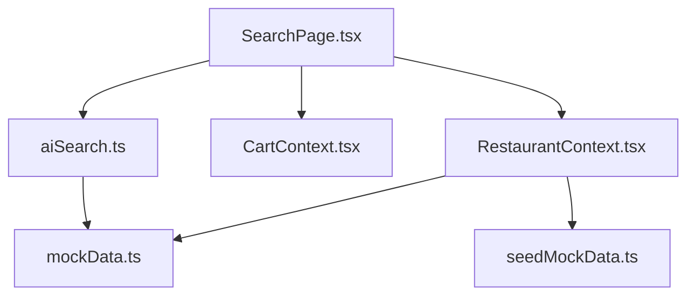

# AI-Powered Search

<cite>
**Referenced Files in This Document**
- [aiSearch.ts](file://src/utils/aiSearch.ts)
- [SearchPage.tsx](file://src/pages/SearchPage.tsx)
- [RestaurantContext.tsx](file://src/context/RestaurantContext.tsx)
- [CartContext.tsx](file://src/context/CartContext.tsx)
- [mockData.ts](file://src/data/mockData.ts)
- [seedMockData.ts](file://src/data/seedMockData.ts)
- [mockMode.ts](file://src/config/mockMode.ts)
</cite>

## Table of Contents
1. [Introduction](#introduction)
2. [Project Structure](#project-structure)
3. [Core Components](#core-components)
4. [Architecture Overview](#architecture-overview)
5. [Detailed Component Analysis](#detailed-component-analysis)
6. [Dependency Analysis](#dependency-analysis)
7. [Performance Considerations](#performance-considerations)
8. [Troubleshooting Guide](#troubleshooting-guide)
9. [Conclusion](#conclusion)

## Introduction
This document explains TIPPAY’s AI-enhanced search that enables intelligent restaurant and dish discovery. It covers how user queries are processed, how intent is understood through keyword extraction and dietary/flavor filters, and how results are scored and ranked. It also documents presentation of AI-driven recommendations, integration points with the restaurant catalog, and practical considerations for performance and reliability.

## Project Structure
The AI search spans three layers:
- Presentation layer: Search UI and result rendering
- Business logic layer: AI search algorithm and scoring
- Data layer: Restaurant catalogs and mock data seeding

**Diagram sources**
- [SearchPage.tsx:13-261](file://src/pages/SearchPage.tsx#L13-L261)
- [aiSearch.ts:11-151](file://src/utils/aiSearch.ts#L11-L151)
- [RestaurantContext.tsx:36-161](file://src/context/RestaurantContext.tsx#L36-L161)
- [seedMockData.ts:11-49](file://src/data/seedMockData.ts#L11-L49)
- [mockData.ts:167-264](file://src/data/mockData.ts#L167-L264)

**Section sources**
- [SearchPage.tsx:13-261](file://src/pages/SearchPage.tsx#L13-L261)
- [aiSearch.ts:11-151](file://src/utils/aiSearch.ts#L11-L151)
- [RestaurantContext.tsx:36-161](file://src/context/RestaurantContext.tsx#L36-L161)
- [seedMockData.ts:11-49](file://src/data/seedMockData.ts#L11-L49)
- [mockData.ts:167-264](file://src/data/mockData.ts#L167-L264)

## Core Components
- AI search algorithm: Tokenizes the query, extracts dietary and flavor filters, parses budget constraints, scores menu items across multiple dimensions, and returns top-ranked results with explainable reasons.
- Search UI: Provides standard and AI modes, renders AI results with match scores and reasons, and integrates cart actions.
- Context providers: Supply restaurants and menu items, derive distances, and manage cart state.

Key responsibilities:
- Query parsing and intent detection
- Multi-criteria scoring (keyword, diet, flavor, price, quality)
- Ranking and filtering thresholds
- Result presentation with reasons and cart integration

**Section sources**
- [aiSearch.ts:3-151](file://src/utils/aiSearch.ts#L3-L151)
- [SearchPage.tsx:13-261](file://src/pages/SearchPage.tsx#L13-L261)
- [RestaurantContext.tsx:96-142](file://src/context/RestaurantContext.tsx#L96-L142)

## Architecture Overview
The AI search pipeline connects the UI to the data layer and applies a deterministic scoring model.

**Diagram sources**
- [SearchPage.tsx:17-44](file://src/pages/SearchPage.tsx#L17-L44)
- [aiSearch.ts:11-151](file://src/utils/aiSearch.ts#L11-L151)
- [RestaurantContext.tsx:155-161](file://src/context/RestaurantContext.tsx#L155-L161)
- [CartContext.tsx:25-45](file://src/context/CartContext.tsx#L25-L45)

## Detailed Component Analysis

### AI Search Algorithm
The algorithm performs:
- Query normalization and tokenization
- Intent extraction:
  - Dietary filters: vegetarian, non-vegetarian, sweet, spicy, cheesy
  - Budget constraint parsing (“under X”, “below Y”, “less Z”, or currency hints)
- Scoring across criteria:
  - Keyword match (primary)
  - Dietary alignment (with penalties for mismatches)
  - Flavor/category cues (spicy, sweet, cheesy)
  - Price proximity to budget
  - Quality boost for highly rated restaurants
- Filtering and sorting:
  - Minimum score threshold
  - Final sort by score descending
  - Top reasons included per result

**Diagram sources**
- [aiSearch.ts:11-151](file://src/utils/aiSearch.ts#L11-L151)

**Section sources**
- [aiSearch.ts:11-151](file://src/utils/aiSearch.ts#L11-L151)

### Search UI and Presentation
The UI supports:
- Two modes: standard and AI smart search
- Dynamic placeholders and icons for AI mode
- Result cards with:
  - Image, name, restaurant attribution
  - Description, price
  - Match score bar and top reasons chips
  - Add-to-cart controls with quantity adjustment
- Empty states and guidance for AI mode

**Diagram sources**
- [SearchPage.tsx:13-261](file://src/pages/SearchPage.tsx#L13-L261)
- [RestaurantCard.tsx:11-64](file://src/components/RestaurantCard.tsx#L11-L64)

**Section sources**
- [SearchPage.tsx:13-261](file://src/pages/SearchPage.tsx#L13-L261)

### Data Layer and Catalog Integration
- RestaurantContext derives a list of restaurants from:
  - Admin restaurants (approved)
  - Mock data fallback
  - Derived distance calculation and sorting
- Menu items are mapped from either mock or restaurant catalog
- Mock mode toggled via environment flag

**Diagram sources**
- [RestaurantContext.tsx:96-142](file://src/context/RestaurantContext.tsx#L96-L142)
- [seedMockData.ts:11-49](file://src/data/seedMockData.ts#L11-L49)
- [mockData.ts:167-264](file://src/data/mockData.ts#L167-L264)
- [mockMode.ts:1-3](file://src/config/mockMode.ts#L1-L3)

**Section sources**
- [RestaurantContext.tsx:96-142](file://src/context/RestaurantContext.tsx#L96-L142)
- [seedMockData.ts:11-49](file://src/data/seedMockData.ts#L11-L49)
- [mockData.ts:167-264](file://src/data/mockData.ts#L167-L264)
- [mockMode.ts:1-3](file://src/config/mockMode.ts#L1-L3)

## Dependency Analysis
- SearchPage depends on:
  - RestaurantContext for restaurants and menu items
  - CartContext for adding items and adjusting quantities
  - aiSearch for AI ranking
- aiSearch depends on MenuItem typing and operates on normalized tokens and restaurant metadata
- RestaurantContext depends on mock data and seed utilities, and optionally on location context for distances

**Diagram sources**
- [SearchPage.tsx:4-7](file://src/pages/SearchPage.tsx#L4-L7)
- [aiSearch.ts:1](file://src/utils/aiSearch.ts#L1)
- [RestaurantContext.tsx:3-8](file://src/context/RestaurantContext.tsx#L3-L8)
- [mockData.ts:13-36](file://src/data/mockData.ts#L13-L36)
- [seedMockData.ts:1-6](file://src/data/seedMockData.ts#L1-L6)

**Section sources**
- [SearchPage.tsx:4-7](file://src/pages/SearchPage.tsx#L4-L7)
- [aiSearch.ts:1](file://src/utils/aiSearch.ts#L1)
- [RestaurantContext.tsx:3-8](file://src/context/RestaurantContext.tsx#L3-L8)
- [mockData.ts:13-36](file://src/data/mockData.ts#L13-L36)
- [seedMockData.ts:1-6](file://src/data/seedMockData.ts#L1-L6)

## Performance Considerations
- Complexity:
  - Current algorithm scans all restaurants and menu items, yielding O(R × M) comparisons per query.
  - Tokenization and filtering are linear in query length and item attributes.
- Optimization opportunities:
  - Pre-index keywords and categories for faster substring checks
  - Cache recent queries and results keyed by normalized query and filters
  - Debounce input to avoid frequent recomputation during typing
  - Limit search scope to nearby restaurants or currently open ones
  - Use a hybrid scoring pipeline with early pruning for low-scoring items
- Real-time responsiveness:
  - Keep heavy computations off the main thread (Web Workers)
  - Paginate or lazy-render long result lists
  - Memoize derived data (e.g., distances) when location does not change

[No sources needed since this section provides general guidance]

## Troubleshooting Guide
Common issues and mitigations:
- No results in AI mode:
  - Ensure query includes recognizable keywords, dietary terms, or a price hint
  - Verify restaurants have non-empty menus
- Unexpected penalties:
  - Dietary filters apply strict penalties; confirm item.isVeg aligns with expectations
- Budget parsing errors:
  - Use explicit “under X” phrasing or standalone numbers; currency prefixes are supported
- Slow search:
  - Debounce input and avoid re-running search on every keystroke
  - Consider caching and precomputation for repeated queries
- Data inconsistencies:
  - Confirm RestaurantContext is seeded properly and mock mode is configured as intended

**Section sources**
- [aiSearch.ts:16-151](file://src/utils/aiSearch.ts#L16-L151)
- [SearchPage.tsx:133-140](file://src/pages/SearchPage.tsx#L133-L140)
- [mockMode.ts:1-3](file://src/config/mockMode.ts#L1-L3)

## Conclusion
TIPPAY’s AI-powered search blends natural language understanding with structured scoring to surface relevant dishes. By extracting intent from queries, applying multi-dimensional scoring, and presenting explainable reasons, the system helps users discover personalized options quickly. With modest indexing and caching enhancements, the search can remain responsive at scale while preserving its intuitive, conversational UX.