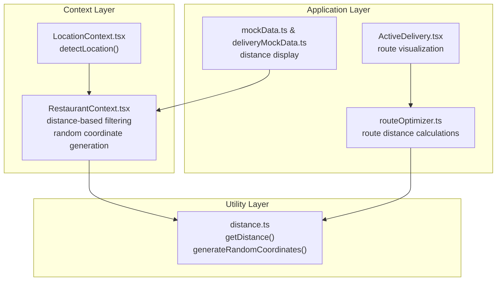
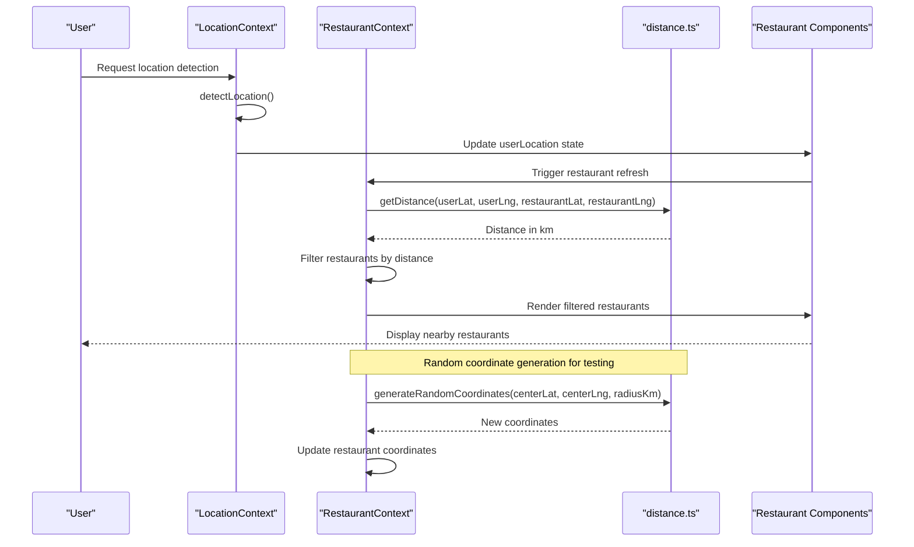
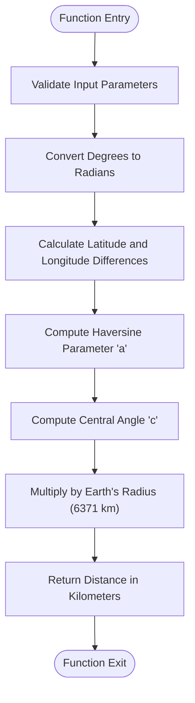
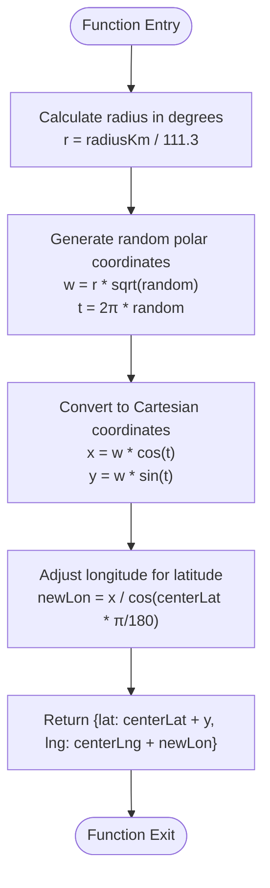
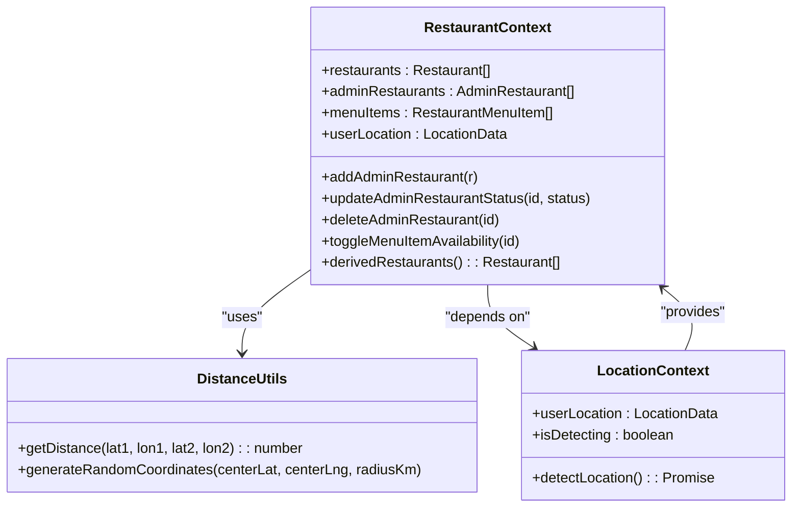
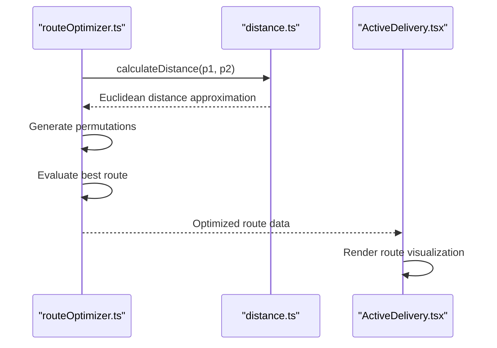
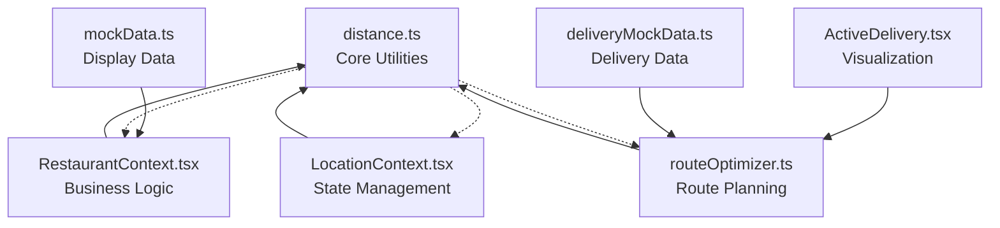

# Geolocation Utilities

<cite>
**Referenced Files in This Document**
- [distance.ts](file://src/utils/distance.ts)
- [RestaurantContext.tsx](file://src/context/RestaurantContext.tsx)
- [LocationContext.tsx](file://src/context/LocationContext.tsx)
- [routeOptimizer.ts](file://src/utils/routeOptimizer.ts)
- [ActiveDelivery.tsx](file://src/pages/delivery/ActiveDelivery.tsx)
- [mockData.ts](file://src/data/mockData.ts)
- [deliveryMockData.ts](file://src/data/deliveryMockData.ts)
</cite>

## Table of Contents
1. [Introduction](#introduction)
2. [Project Structure](#project-structure)
3. [Core Components](#core-components)
4. [Architecture Overview](#architecture-overview)
5. [Detailed Component Analysis](#detailed-component-analysis)
6. [Dependency Analysis](#dependency-analysis)
7. [Performance Considerations](#performance-considerations)
8. [Troubleshooting Guide](#troubleshooting-guide)
9. [Conclusion](#conclusion)

## Introduction
This document provides comprehensive documentation for TIPPAY's geolocation utility functions, focusing on:
- The Haversine formula implementation for calculating distances between geographic coordinates in kilometers
- The getDistance function parameters and return value specifications
- The coordinate generation utility for creating random locations within a specified radius
- Mathematical background of the Haversine formula, Earth's radius assumptions, and accuracy considerations
- Practical examples for restaurant proximity calculations, delivery radius determination, and coordinate-based filtering
- Performance implications for large-scale distance calculations and optimization strategies for batch operations

## Project Structure
The geolocation utilities are implemented in a dedicated module and integrated across the application through contexts and components:
- Utility module: distance.ts
- Context integration: RestaurantContext.tsx and LocationContext.tsx
- Additional usage: routeOptimizer.ts and ActiveDelivery.tsx
- Mock data demonstrating distance usage: mockData.ts and deliveryMockData.ts



**Diagram sources**
- [distance.ts:1-34](file://src/utils/distance.ts#L1-L34)
- [RestaurantContext.tsx:1-162](file://src/context/RestaurantContext.tsx#L1-L162)
- [LocationContext.tsx:1-63](file://src/context/LocationContext.tsx#L1-L63)
- [routeOptimizer.ts:1-194](file://src/utils/routeOptimizer.ts#L1-L194)
- [ActiveDelivery.tsx:61-104](file://src/pages/delivery/ActiveDelivery.tsx#L61-L104)
- [mockData.ts:167-264](file://src/data/mockData.ts#L167-L264)
- [deliveryMockData.ts:19-126](file://src/data/deliveryMockData.ts#L19-L126)

**Section sources**
- [distance.ts:1-34](file://src/utils/distance.ts#L1-L34)
- [RestaurantContext.tsx:1-162](file://src/context/RestaurantContext.tsx#L1-L162)
- [LocationContext.tsx:1-63](file://src/context/LocationContext.tsx#L1-L63)
- [routeOptimizer.ts:1-194](file://src/utils/routeOptimizer.ts#L1-L194)
- [ActiveDelivery.tsx:61-104](file://src/pages/delivery/ActiveDelivery.tsx#L61-L104)
- [mockData.ts:167-264](file://src/data/mockData.ts#L167-L264)
- [deliveryMockData.ts:19-126](file://src/data/deliveryMockData.ts#L19-L126)

## Core Components
This section documents the two primary geolocation utilities and their usage patterns.

### Distance Calculation Utility
The distance utility provides precise spherical distance calculations using the Haversine formula, suitable for applications requiring accurate geographic measurements.

Key characteristics:
- Uses Earth's mean radius of 6371 km
- Handles coordinate conversion internally
- Returns distance in kilometers
- Optimized for typical delivery and proximity use cases

Implementation highlights:
- Central function: getDistance(lat1, lon1, lat2, lon2)
- Internal conversion: deg2rad() for degree-to-radian conversion
- Mathematical foundation: Haversine formula for great-circle distance

**Section sources**
- [distance.ts:1-17](file://src/utils/distance.ts#L1-L17)

### Coordinate Generation Utility
The coordinate generation utility creates random geographic coordinates within a specified radius of a center point, primarily used for testing and simulation scenarios.

Key characteristics:
- Generates uniformly distributed points within a circular area
- Uses polar coordinate transformation with appropriate longitude scaling
- Returns new latitude and longitude values
- Radius parameter in kilometers

Implementation highlights:
- Function: generateRandomCoordinates(centerLat, centerLng, radiusKm)
- Uses 111.3 km per degree approximation for initial radius calculation
- Applies square root transformation for uniform distribution
- Adjusts longitude based on cosine of latitude for accurate east-west scaling

**Section sources**
- [distance.ts:19-33](file://src/utils/distance.ts#L19-L33)

## Architecture Overview
The geolocation utilities integrate seamlessly with TIPPAY's context-based architecture, enabling location-aware functionality across the application.



**Diagram sources**
- [LocationContext.tsx:21-49](file://src/context/LocationContext.tsx#L21-L49)
- [RestaurantContext.tsx:49-66](file://src/context/RestaurantContext.tsx#L49-L66)
- [distance.ts:2-17](file://src/utils/distance.ts#L2-L17)

The architecture demonstrates:
- Location detection through browser APIs
- Context-based state management
- Utility function integration for calculations
- Real-time filtering and rendering

**Section sources**
- [LocationContext.tsx:1-63](file://src/context/LocationContext.tsx#L1-L63)
- [RestaurantContext.tsx:1-162](file://src/context/RestaurantContext.tsx#L1-L162)
- [distance.ts:1-34](file://src/utils/distance.ts#L1-L34)

## Detailed Component Analysis

### Haversine Formula Implementation
The Haversine formula calculates the great-circle distance between two points on a sphere given their longitudes and latitudes.

Mathematical foundation:
- Uses the spherical law of cosines adapted for numerical stability
- Employs the haversine function to avoid precision loss
- Assumes Earth as a perfect sphere with radius 6371 km

Implementation details:
- Converts degrees to radians internally
- Calculates intermediate values for arc length
- Applies atan2 for stable angle computation
- Multiplies by Earth's radius for final distance



**Diagram sources**
- [distance.ts:2-12](file://src/utils/distance.ts#L2-L12)

**Section sources**
- [distance.ts:1-17](file://src/utils/distance.ts#L1-L17)

### Coordinate Generation Algorithm
The coordinate generation algorithm produces uniformly distributed random points within a circular area around a center point.

Algorithm overview:
- Transforms radius from kilometers to degrees using 111.3 km/degree approximation
- Generates random polar coordinates with square root transformation
- Converts to Cartesian coordinates
- Applies inverse transformation to get latitude and longitude offsets
- Adjusts longitude for latitude-dependent scaling



**Diagram sources**
- [distance.ts:20-33](file://src/utils/distance.ts#L20-L33)

**Section sources**
- [distance.ts:19-33](file://src/utils/distance.ts#L19-L33)

### Integration Patterns
The geolocation utilities integrate with multiple application components for different use cases.

#### Restaurant Proximity Filtering
RestaurantContext demonstrates sophisticated distance-based filtering and dynamic coordinate generation:



**Diagram sources**
- [RestaurantContext.tsx:21-162](file://src/context/RestaurantContext.tsx#L21-L162)
- [distance.ts:1-34](file://src/utils/distance.ts#L1-L34)
- [LocationContext.tsx:1-63](file://src/context/LocationContext.tsx#L1-L63)

#### Route Optimization Integration
The route optimizer integrates distance calculations for delivery route planning:



**Diagram sources**
- [routeOptimizer.ts:46-51](file://src/utils/routeOptimizer.ts#L46-L51)
- [distance.ts:2-12](file://src/utils/distance.ts#L2-L12)
- [ActiveDelivery.tsx:96-104](file://src/pages/delivery/ActiveDelivery.tsx#L96-L104)

**Section sources**
- [RestaurantContext.tsx:49-102](file://src/context/RestaurantContext.tsx#L49-L102)
- [routeOptimizer.ts:46-194](file://src/utils/routeOptimizer.ts#L46-L194)
- [ActiveDelivery.tsx:61-104](file://src/pages/delivery/ActiveDelivery.tsx#L61-L104)

## Dependency Analysis
The geolocation utilities demonstrate clear separation of concerns with minimal coupling between components.



**Diagram sources**
- [distance.ts:1-34](file://src/utils/distance.ts#L1-L34)
- [RestaurantContext.tsx:1-162](file://src/context/RestaurantContext.tsx#L1-L162)
- [LocationContext.tsx:1-63](file://src/context/LocationContext.tsx#L1-L63)
- [routeOptimizer.ts:1-194](file://src/utils/routeOptimizer.ts#L1-L194)
- [ActiveDelivery.tsx:61-104](file://src/pages/delivery/ActiveDelivery.tsx#L61-L104)
- [mockData.ts:167-264](file://src/data/mockData.ts#L167-L264)
- [deliveryMockData.ts:19-126](file://src/data/deliveryMockData.ts#L19-L126)

Key dependency characteristics:
- Unidirectional data flow from contexts to utilities
- No circular dependencies identified
- Clear separation between calculation logic and presentation
- Minimal external dependencies

**Section sources**
- [distance.ts:1-34](file://src/utils/distance.ts#L1-L34)
- [RestaurantContext.tsx:1-162](file://src/context/RestaurantContext.tsx#L1-L162)
- [routeOptimizer.ts:1-194](file://src/utils/routeOptimizer.ts#L1-L194)

## Performance Considerations
The geolocation utilities are optimized for typical application usage patterns while maintaining accuracy for geographic calculations.

### Computational Complexity
- Distance calculation: O(1) - constant time operations
- Coordinate generation: O(1) - constant time random number generation
- Memory usage: O(1) - minimal memory overhead

### Optimization Strategies for Large-Scale Operations
For batch distance calculations across large datasets:

1. **Vectorization Approach**
   - Group calculations by proximity clusters
   - Use spatial indexing for frequently accessed regions
   - Implement caching for repeated distance queries

2. **Precision vs Performance Trade-offs**
   - Consider approximate calculations for very large datasets
   - Use simplified distance metrics (Euclidean) for preliminary filtering
   - Apply threshold-based early termination

3. **Batch Processing Patterns**
   ```typescript
   // Example batch processing structure
   const batchProcess = (coordinates: [number, number][]): number[] => {
     const results: number[] = [];
     const cache = new Map<string, number>();
     
     for (const [lat, lng] of coordinates) {
       const key = `${lat},${lng}`;
       if (!cache.has(key)) {
         const distance = getDistance(userLat, userLng, lat, lng);
         cache.set(key, distance);
         results.push(distance);
       }
     }
     
     return results;
   };
   ```

4. **Memory Management**
   - Implement result caching for repeated queries
   - Use generators for streaming large result sets
   - Consider lazy evaluation for filtered datasets

### Accuracy Considerations
- Earth radius assumption: 6371 km provides good average accuracy
- Formula assumes spherical Earth (not ellipsoidal)
- Suitable for most delivery and proximity applications
- For high-precision surveying, consider Vincenty formula or WGS84 ellipsoid models

**Section sources**
- [distance.ts:2-12](file://src/utils/distance.ts#L2-L12)
- [routeOptimizer.ts:46-51](file://src/utils/routeOptimizer.ts#L46-L51)

## Troubleshooting Guide

### Common Issues and Solutions

#### Location Detection Failures
- **Problem**: Browser geolocation API unavailable or blocked
- **Solution**: Check browser support and permissions; implement fallback mechanisms
- **Reference**: [LocationContext.tsx:24-28](file://src/context/LocationContext.tsx#L24-L28)

#### Distance Calculation Anomalies
- **Problem**: Unexpected negative or extremely large distances
- **Solution**: Validate input coordinates and handle edge cases
- **Reference**: [distance.ts:2-12](file://src/utils/distance.ts#L2-L12)

#### Coordinate Generation Bias
- **Problem**: Non-uniform distribution of generated coordinates
- **Solution**: Verify square root transformation and latitude scaling
- **Reference**: [distance.ts:20-33](file://src/utils/distance.ts#L20-L33)

#### Performance Degradation
- **Problem**: Slow distance calculations with large datasets
- **Solution**: Implement caching, batching, or spatial indexing
- **Reference**: [RestaurantContext.tsx:55-64](file://src/context/RestaurantContext.tsx#L55-L64)

### Debugging Tips
1. **Input Validation**: Always validate coordinate ranges (-90 to 90 for latitude, -180 to 180 for longitude)
2. **Unit Testing**: Test edge cases (same coordinates, antipodal points, poles)
3. **Performance Monitoring**: Profile distance-heavy operations in production
4. **Logging**: Track coordinate generation patterns for testing scenarios

**Section sources**
- [LocationContext.tsx:24-48](file://src/context/LocationContext.tsx#L24-L48)
- [RestaurantContext.tsx:55-64](file://src/context/RestaurantContext.tsx#L55-L64)
- [distance.ts:2-12](file://src/utils/distance.ts#L2-L12)

## Conclusion
TIPPAY's geolocation utilities provide robust, efficient solutions for geographic calculations with the following strengths:
- Accurate Haversine formula implementation for precise distance calculations
- Comprehensive coordinate generation for testing and simulation
- Seamless integration with the application's context-based architecture
- Well-defined interfaces for easy extension and maintenance

The utilities serve as foundational building blocks for restaurant proximity filtering, delivery route optimization, and coordinate-based filtering throughout the application. Their design balances accuracy with performance, making them suitable for both development and production environments.

Future enhancements could include:
- Spatial indexing for improved performance with large datasets
- Configurable Earth models for specialized accuracy requirements
- Enhanced coordinate generation with elliptical distribution options
- Integration with external geocoding services for address resolution