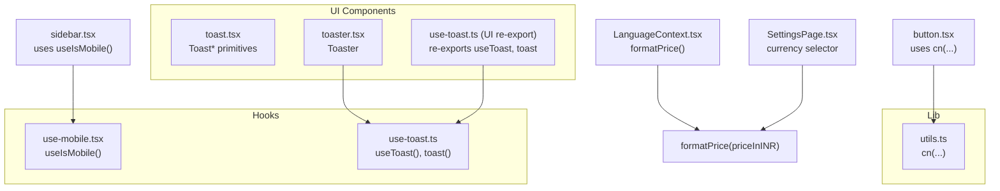
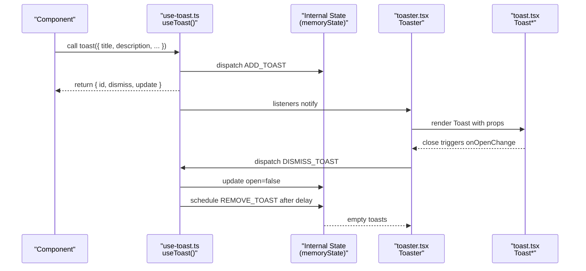
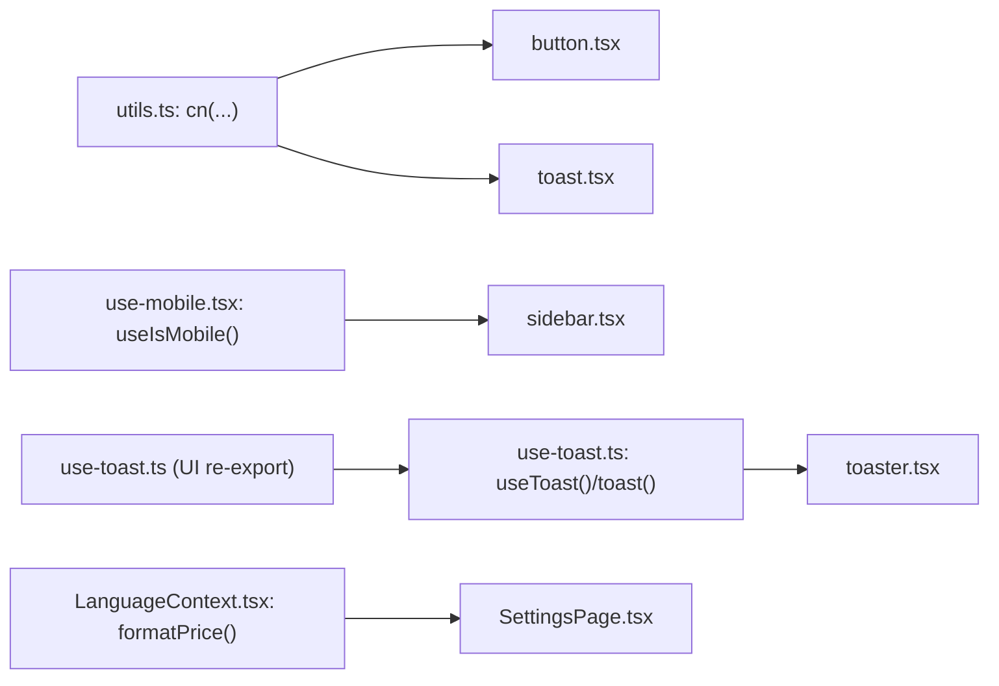

# Helper Functions & Hooks

<cite>
**Referenced Files in This Document**
- [utils.ts](file://src/lib/utils.ts)
- [use-mobile.tsx](file://src/hooks/use-mobile.tsx)
- [use-toast.ts](file://src/hooks/use-toast.ts)
- [toast.tsx](file://src/components/ui/toast.tsx)
- [toaster.tsx](file://src/components/ui/toaster.tsx)
- [use-toast.ts (UI re-export)](file://src/components/ui/use-toast.ts)
- [LanguageContext.tsx](file://src/context/LanguageContext.tsx)
- [button.tsx](file://src/components/ui/button.tsx)
- [sidebar.tsx](file://src/components/ui/sidebar.tsx)
- [SettingsPage.tsx](file://src/pages/SettingsPage.tsx)
</cite>

## Table of Contents
1. [Introduction](#introduction)
2. [Project Structure](#project-structure)
3. [Core Components](#core-components)
4. [Architecture Overview](#architecture-overview)
5. [Detailed Component Analysis](#detailed-component-analysis)
6. [Dependency Analysis](#dependency-analysis)
7. [Performance Considerations](#performance-considerations)
8. [Troubleshooting Guide](#troubleshooting-guide)
9. [Conclusion](#conclusion)
10. [Appendices](#appendices)

## Introduction
This document describes TIPPAY’s collection of helper functions and custom React hooks that support common application tasks. It focuses on:
- Utility functions for class name composition
- Responsive design detection via a custom hook
- Notification management and user feedback via a toast system
It also provides usage examples, parameter specifications, return values, integration patterns, performance considerations, and best practices for extending the utility library.

## Project Structure
The relevant parts of the codebase are organized as follows:
- Utilities: src/lib/utils.ts
- Custom hooks: src/hooks/use-mobile.tsx, src/hooks/use-toast.ts
- UI toast system: src/components/ui/toast.tsx, src/components/ui/toaster.tsx, src/components/ui/use-toast.ts
- Usage examples: src/components/ui/button.tsx, src/components/ui/sidebar.tsx, src/context/LanguageContext.tsx, src/pages/SettingsPage.tsx

**Diagram sources**
- [utils.ts:1-7](file://src/lib/utils.ts#L1-L7)
- [use-mobile.tsx:1-20](file://src/hooks/use-mobile.tsx#L1-L20)
- [use-toast.ts:1-187](file://src/hooks/use-toast.ts#L1-L187)
- [toast.tsx:1-112](file://src/components/ui/toast.tsx#L1-L112)
- [toaster.tsx:1-25](file://src/components/ui/toaster.tsx#L1-L25)
- [use-toast.ts (UI re-export):1-4](file://src/components/ui/use-toast.ts#L1-L4)
- [button.tsx:1-48](file://src/components/ui/button.tsx#L1-L48)
- [sidebar.tsx:1-60](file://src/components/ui/sidebar.tsx#L1-L60)
- [LanguageContext.tsx:68-159](file://src/context/LanguageContext.tsx#L68-L159)
- [SettingsPage.tsx:26-95](file://src/pages/SettingsPage.tsx#L26-L95)

**Section sources**
- [utils.ts:1-7](file://src/lib/utils.ts#L1-L7)
- [use-mobile.tsx:1-20](file://src/hooks/use-mobile.tsx#L1-L20)
- [use-toast.ts:1-187](file://src/hooks/use-toast.ts#L1-L187)
- [toast.tsx:1-112](file://src/components/ui/toast.tsx#L1-L112)
- [toaster.tsx:1-25](file://src/components/ui/toaster.tsx#L1-L25)
- [use-toast.ts (UI re-export):1-4](file://src/components/ui/use-toast.ts#L1-L4)
- [button.tsx:1-48](file://src/components/ui/button.tsx#L1-L48)
- [sidebar.tsx:1-60](file://src/components/ui/sidebar.tsx#L1-L60)
- [LanguageContext.tsx:68-159](file://src/context/LanguageContext.tsx#L68-L159)
- [SettingsPage.tsx:26-95](file://src/pages/SettingsPage.tsx#L26-L95)

## Core Components
- Class name composition utility: cn(...)
- Mobile detection hook: useIsMobile()
- Toast notification system: useToast(), toast(), Toaster, Toast*

Key capabilities:
- cn(...) merges Tailwind classes safely, resolving conflicts deterministically.
- useIsMobile() detects viewport width against a breakpoint and updates on resize.
- useToast()/toast() provide a lightweight, Redux-like state machine for notifications with dismissal and auto-removal.

**Section sources**
- [utils.ts:1-7](file://src/lib/utils.ts#L1-L7)
- [use-mobile.tsx:1-20](file://src/hooks/use-mobile.tsx#L1-L20)
- [use-toast.ts:1-187](file://src/hooks/use-toast.ts#L1-L187)
- [toast.tsx:1-112](file://src/components/ui/toast.tsx#L1-L112)
- [toaster.tsx:1-25](file://src/components/ui/toaster.tsx#L1-L25)

## Architecture Overview
The toast system is a small internal state container with actions and a reducer. Components subscribe via a hook and render via a provider component. The cn(...) utility is used across UI components to compose Tailwind classes.

**Diagram sources**
- [use-toast.ts:137-164](file://src/hooks/use-toast.ts#L137-L164)
- [toaster.tsx:4-24](file://src/components/ui/toaster.tsx#L4-L24)
- [toast.tsx:10-22](file://src/components/ui/toast.tsx#L10-L22)

## Detailed Component Analysis

### Utility: cn(...) — Class Name Composition
Purpose:
- Merge and deduplicate Tailwind classes while respecting Tailwind’s override order.

Parameters:
- Accepts any number of inputs compatible with clsx ClassValue.

Returns:
- A single merged class string.

Usage examples:
- Used in button.tsx to combine variants and sizes with incoming className.
- Used in toast.tsx to apply variant classes conditionally.

Integration pattern:
- Import cn from "@/lib/utils" and pass it to components that accept className.
- Combine with cva variant helpers for predictable overrides.

Best practices:
- Prefer passing variant props from component APIs rather than raw strings when possible.
- Keep dynamic classes minimal to avoid excessive recomputation.

**Section sources**
- [utils.ts:1-7](file://src/lib/utils.ts#L1-L7)
- [button.tsx:39-44](file://src/components/ui/button.tsx#L39-L44)
- [toast.tsx:40-46](file://src/components/ui/toast.tsx#L40-L46)

### Hook: useIsMobile() — Responsive Design Detection
Purpose:
- Detect whether the current viewport width is below a mobile breakpoint.

Behavior:
- Initializes state based on current window width.
- Subscribes to media query change events and updates state accordingly.
- Returns a boolean indicating mobile layout eligibility.

Parameters:
- None.

Returns:
- Boolean indicating mobile layout mode.

Usage examples:
- Used in sidebar.tsx to adapt sidebar behavior for mobile vs desktop.

Integration pattern:
- Call useIsMobile() inside components that need responsive rendering.
- Use the returned boolean to toggle conditional layouts, modals, or navigation patterns.

Performance considerations:
- Uses a single media query listener and cleans up on unmount.
- Avoids frequent reflows by relying on MediaQueryList events.

**Section sources**
- [use-mobile.tsx:1-20](file://src/hooks/use-mobile.tsx#L1-L20)
- [sidebar.tsx:45-55](file://src/components/ui/sidebar.tsx#L45-L55)

### Hook: useToast() and toast() — Notification Management
Purpose:
- Provide a simple, centralized way to show notifications with optional actions and automatic dismissal.

Core functions:
- useToast(): Returns current toasts and helper methods.
- toast(props): Creates a new toast with a generated id and returns dismiss/update handles.

Parameters:
- toast(props):
  - title?: React.ReactNode
  - description?: React.ReactNode
  - action?: React.ReactElement
  - duration?: number
  - variant?: "default" | "destructive"
  - Any ToastProps supported by the underlying primitive

Returns:
- toast(): { id, dismiss(), update() }
- useToast(): { toasts, toast(), dismiss(toastId?) }

Internals overview:
- Internal state tracks toasts and enforces a limit.
- Automatic removal after a long delay; dismiss clears and schedules removal.
- Provider renders toasts and viewport.

Integration pattern:
- Wrap your app with Toaster (from toaster.tsx) to enable the toast system.
- Import { toast } from "@/components/ui/use-toast" to call toast in components.

Usage examples:
- Trigger a success message after an action completes.
- Show an error toast with an action to retry.

**Section sources**
- [use-toast.ts:1-187](file://src/hooks/use-toast.ts#L1-L187)
- [toast.tsx:1-112](file://src/components/ui/toast.tsx#L1-L112)
- [toaster.tsx:1-25](file://src/components/ui/toaster.tsx#L1-L25)
- [use-toast.ts (UI re-export):1-4](file://src/components/ui/use-toast.ts#L1-L4)

### Currency Formatting Example (formatPrice)
While not a hook, the LanguageContext demonstrates practical currency formatting:
- Converts prices from a base currency to the selected currency using fixed rates.
- Applies appropriate rounding and symbol selection.

Parameters:
- priceInINR: number

Returns:
- Formatted string with currency symbol and value.

Integration pattern:
- Use LanguageContext’s formatPrice in components that display pricing.
- Allow users to select currency in SettingsPage.

**Section sources**
- [LanguageContext.tsx:137-144](file://src/context/LanguageContext.tsx#L137-L144)
- [SettingsPage.tsx:74-95](file://src/pages/SettingsPage.tsx#L74-L95)

## Dependency Analysis
The following diagram shows how utilities and hooks are consumed across the UI layer.

**Diagram sources**
- [utils.ts:1-7](file://src/lib/utils.ts#L1-L7)
- [button.tsx:1-48](file://src/components/ui/button.tsx#L1-L48)
- [toast.tsx:1-112](file://src/components/ui/toast.tsx#L1-L112)
- [use-mobile.tsx:1-20](file://src/hooks/use-mobile.tsx#L1-L20)
- [sidebar.tsx:1-60](file://src/components/ui/sidebar.tsx#L1-L60)
- [use-toast.ts:1-187](file://src/hooks/use-toast.ts#L1-L187)
- [toaster.tsx:1-25](file://src/components/ui/toaster.tsx#L1-L25)
- [use-toast.ts (UI re-export):1-4](file://src/components/ui/use-toast.ts#L1-L4)
- [LanguageContext.tsx:137-144](file://src/context/LanguageContext.tsx#L137-L144)
- [SettingsPage.tsx:74-95](file://src/pages/SettingsPage.tsx#L74-L95)

**Section sources**
- [utils.ts:1-7](file://src/lib/utils.ts#L1-L7)
- [button.tsx:1-48](file://src/components/ui/button.tsx#L1-L48)
- [toast.tsx:1-112](file://src/components/ui/toast.tsx#L1-L112)
- [use-mobile.tsx:1-20](file://src/hooks/use-mobile.tsx#L1-L20)
- [sidebar.tsx:1-60](file://src/components/ui/sidebar.tsx#L1-L60)
- [use-toast.ts:1-187](file://src/hooks/use-toast.ts#L1-L187)
- [toaster.tsx:1-25](file://src/components/ui/toaster.tsx#L1-L25)
- [use-toast.ts (UI re-export):1-4](file://src/components/ui/use-toast.ts#L1-L4)
- [LanguageContext.tsx:137-144](file://src/context/LanguageContext.tsx#L137-L144)
- [SettingsPage.tsx:74-95](file://src/pages/SettingsPage.tsx#L74-L95)

## Performance Considerations
- useIsMobile():
  - Uses a single MediaQueryList listener; cleanup occurs on unmount.
  - Avoids unnecessary renders by updating state only on media query changes.
- cn(...):
  - Efficiently merges class names; keep combined inputs minimal to reduce churn.
- useToast():
  - Maintains a bounded number of toasts.
  - Schedules removal after a long delay; dismiss clears timeouts promptly.
  - Subscribe/unsubscribe listeners efficiently to prevent memory leaks.

[No sources needed since this section provides general guidance]

## Troubleshooting Guide
Common issues and resolutions:
- Toasts not appearing:
  - Ensure Toaster is rendered at the app root so the provider is active.
  - Verify that toast() is imported from the UI re-export module to align with the provider.
- Toasts not dismissing:
  - Confirm that onOpenChange is not overridden to prevent automatic dismissal.
  - Use the returned dismiss() method to programmatically dismiss.
- Mobile layout not triggering:
  - Check that useIsMobile() is called in the component and that the window width crosses the breakpoint.
  - Ensure no parent styles override the intended responsive behavior.

**Section sources**
- [toaster.tsx:4-24](file://src/components/ui/toaster.tsx#L4-L24)
- [use-toast.ts (UI re-export):1-4](file://src/components/ui/use-toast.ts#L1-L4)
- [use-toast.ts:137-164](file://src/hooks/use-toast.ts#L137-L164)
- [use-mobile.tsx:8-16](file://src/hooks/use-mobile.tsx#L8-L16)

## Conclusion
TIPPAY’s helper utilities and hooks provide efficient, reusable building blocks:
- cn(...) streamlines Tailwind class composition.
- useIsMobile() enables responsive UI adaptation.
- useToast()/toast() deliver a compact, effective notification system.
Adopting these patterns consistently improves maintainability and reduces duplication across components.

[No sources needed since this section summarizes without analyzing specific files]

## Appendices

### API Reference

- cn(...inputs: ClassValue[]): string
  - Merges Tailwind classes with conflict resolution.
  - Typical usage: wrap variant classes with incoming className.
  - Returns: merged class string.

- useIsMobile(): boolean
  - Returns true when viewport width is below the mobile breakpoint.
  - Typical usage: conditionally render mobile layouts or dialogs.
  - Returns: boolean.

- useToast(): { toasts, toast(props), dismiss(toastId?) }
  - Provides access to current toasts and helper methods.
  - Typical usage: call toast() to show notifications; use dismiss() to remove.
  - Returns: object with toasts array and helper functions.

- toast(props): { id, dismiss(), update() }
  - Creates a new toast with a unique id and returns control methods.
  - Typical usage: toast({ title, description, variant }).
  - Returns: object with id and methods.

- formatPrice(priceInINR: number): string
  - Converts and formats a price based on the selected currency.
  - Typical usage: display prices in the user’s preferred currency.
  - Returns: formatted currency string.

**Section sources**
- [utils.ts:1-7](file://src/lib/utils.ts#L1-L7)
- [use-mobile.tsx:1-20](file://src/hooks/use-mobile.tsx#L1-L20)
- [use-toast.ts:137-164](file://src/hooks/use-toast.ts#L137-L164)
- [LanguageContext.tsx:137-144](file://src/context/LanguageContext.tsx#L137-L144)

### Integration Examples

- Using cn(...) in a UI component:
  - Import cn from "@/lib/utils".
  - Pass variant classes and incoming className to cn(...) before applying to DOM nodes.

- Using useIsMobile() in a layout component:
  - Import useIsMobile from "@/hooks/use-mobile".
  - Conditionally render mobile-specific UI when true.

- Using toast() in a form submission:
  - Import { toast } from "@/components/ui/use-toast".
  - On success, call toast({ title, description, variant: "default" }).
  - On failure, call toast({ title, description, variant: "destructive" }).

**Section sources**
- [button.tsx:39-44](file://src/components/ui/button.tsx#L39-L44)
- [sidebar.tsx:45-55](file://src/components/ui/sidebar.tsx#L45-L55)
- [use-toast.ts (UI re-export):1-4](file://src/components/ui/use-toast.ts#L1-L4)

### Best Practices for Extending the Utility Library
- Keep pure functions free of side effects; memoize expensive computations if needed.
- Export only what is necessary; re-export commonly used utilities from a central module.
- Document parameters and return types for clarity.
- Add unit tests for deterministic behavior (e.g., cn(...) combinations).
- Avoid global side effects in hooks; clean up listeners and timers on unmount.

[No sources needed since this section provides general guidance]