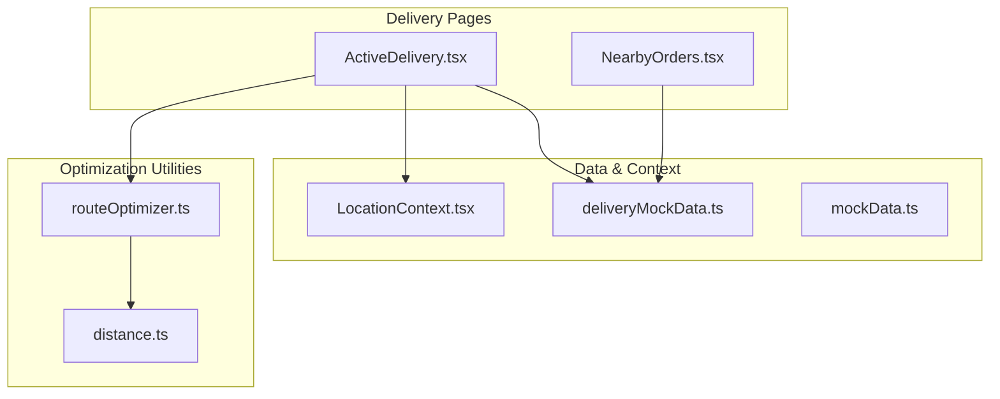
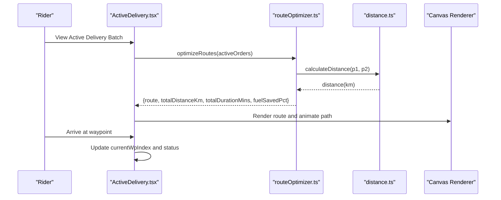
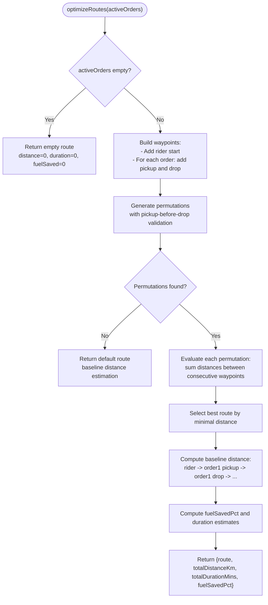
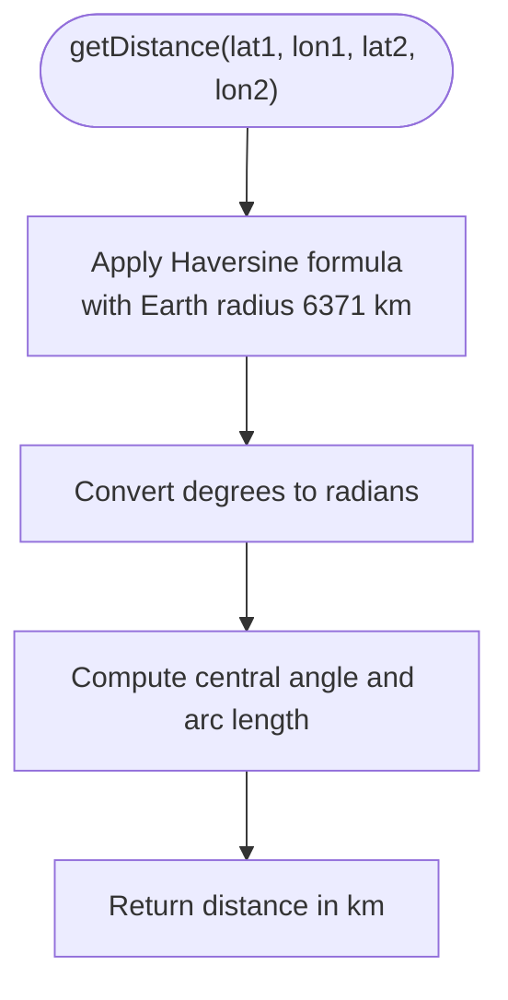
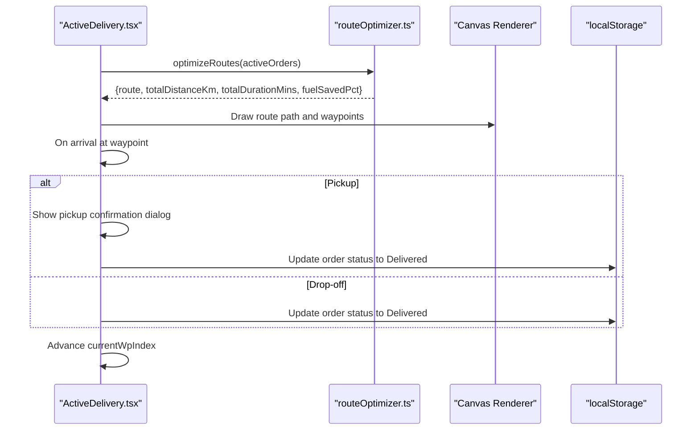
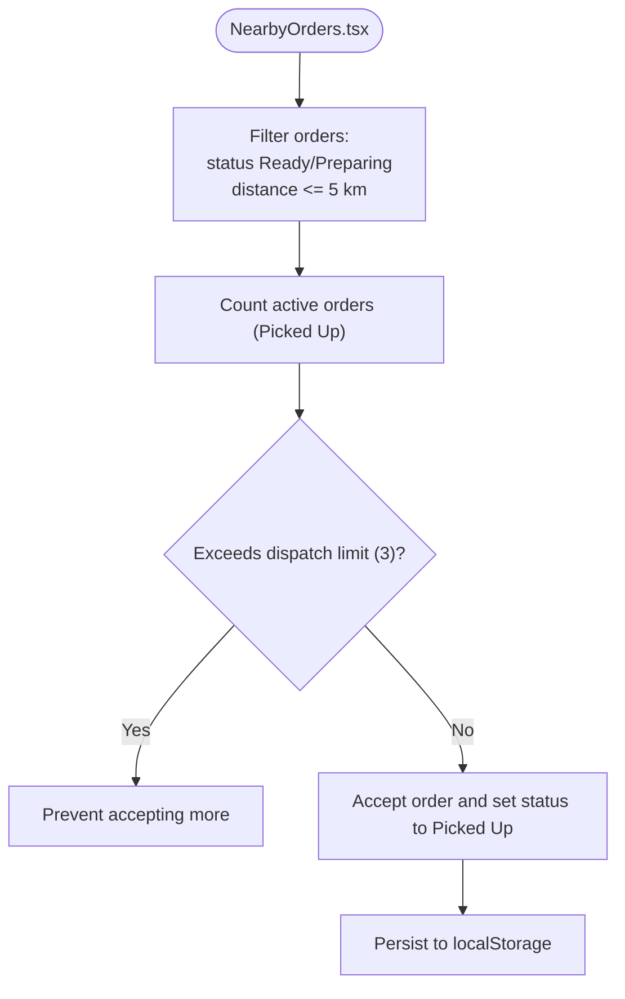
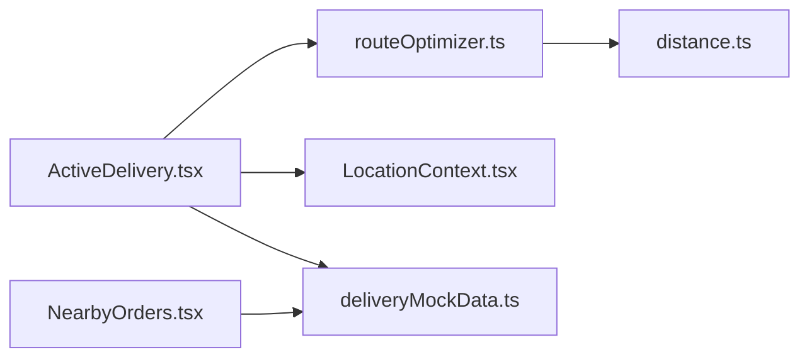

# Route Optimization

<cite>
**Referenced Files in This Document**
- [routeOptimizer.ts](file://src/utils/routeOptimizer.ts)
- [distance.ts](file://src/utils/distance.ts)
- [ActiveDelivery.tsx](file://src/pages/delivery/ActiveDelivery.tsx)
- [NearbyOrders.tsx](file://src/pages/delivery/NearbyOrders.tsx)
- [deliveryMockData.ts](file://src/data/deliveryMockData.ts)
- [LocationContext.tsx](file://src/context/LocationContext.tsx)
- [mockData.ts](file://src/data/mockData.ts)
</cite>

## Table of Contents
1. [Introduction](#introduction)
2. [Project Structure](#project-structure)
3. [Core Components](#core-components)
4. [Architecture Overview](#architecture-overview)
5. [Detailed Component Analysis](#detailed-component-analysis)
6. [Dependency Analysis](#dependency-analysis)
7. [Performance Considerations](#performance-considerations)
8. [Troubleshooting Guide](#troubleshooting-guide)
9. [Conclusion](#conclusion)

## Introduction
This document explains TIPPAY's route optimization algorithms for efficient delivery planning. It covers how routes are calculated, how delivery points are sequenced, and how optimization criteria minimize travel distance and time. It also documents the algorithmic approach for determining optimal delivery sequences, constraints like vehicle capacity limits, and how the system integrates with mapping services. Finally, it provides usage examples, performance considerations for large delivery batches, and scalability limitations.

## Project Structure
The route optimization system is primarily implemented in a dedicated utility module and integrated into the delivery workflow pages. Supporting utilities provide distance calculations, while mock data and contexts supply order and location information.

**Diagram sources**
- [ActiveDelivery.tsx:1-398](file://src/pages/delivery/ActiveDelivery.tsx#L1-L398)
- [NearbyOrders.tsx:1-170](file://src/pages/delivery/NearbyOrders.tsx#L1-L170)
- [routeOptimizer.ts:1-195](file://src/utils/routeOptimizer.ts#L1-L195)
- [distance.ts:1-34](file://src/utils/distance.ts#L1-L34)
- [deliveryMockData.ts:1-134](file://src/data/deliveryMockData.ts#L1-L134)
- [LocationContext.tsx:1-63](file://src/context/LocationContext.tsx#L1-L63)
- [mockData.ts:1-326](file://src/data/mockData.ts#L1-L326)

**Section sources**
- [ActiveDelivery.tsx:1-398](file://src/pages/delivery/ActiveDelivery.tsx#L1-L398)
- [NearbyOrders.tsx:1-170](file://src/pages/delivery/NearbyOrders.tsx#L1-L170)
- [routeOptimizer.ts:1-195](file://src/utils/routeOptimizer.ts#L1-L195)
- [distance.ts:1-34](file://src/utils/distance.ts#L1-L34)
- [deliveryMockData.ts:1-134](file://src/data/deliveryMockData.ts#L1-L134)
- [LocationContext.tsx:1-63](file://src/context/LocationContext.tsx#L1-L63)
- [mockData.ts:1-326](file://src/data/mockData.ts#L1-L326)

## Core Components
- Route optimizer utility: Generates optimized delivery sequences from active orders, validates pickup-before-drop constraints, and computes distance/time metrics.
- Distance utilities: Provides distance calculation helpers for coordinate-based routing.
- Delivery pages: Present active delivery batches, render optimized routes, and manage rider actions.
- Mock data and contexts: Supply order information and location detection capabilities.

Key responsibilities:
- OptimizeRoutes: Builds waypoints, generates valid permutations, selects the shortest route, and reports analytics.
- Distance helpers: Compute distances between coordinates for route evaluation.
- ActiveDelivery: Renders the optimized route, animates the map, and manages waypoint progression.
- NearbyOrders: Filters eligible orders and enforces dispatch limits.

**Section sources**
- [routeOptimizer.ts:53-194](file://src/utils/routeOptimizer.ts#L53-L194)
- [distance.ts:1-34](file://src/utils/distance.ts#L1-L34)
- [ActiveDelivery.tsx:26-246](file://src/pages/delivery/ActiveDelivery.tsx#L26-L246)
- [NearbyOrders.tsx:19-46](file://src/pages/delivery/NearbyOrders.tsx#L19-L46)

## Architecture Overview
The route optimization pipeline integrates order data, location context, and rendering components to produce actionable delivery plans.

**Diagram sources**
- [ActiveDelivery.tsx:26-246](file://src/pages/delivery/ActiveDelivery.tsx#L26-L246)
- [routeOptimizer.ts:46-51](file://src/utils/routeOptimizer.ts#L46-L51)
- [distance.ts:1-17](file://src/utils/distance.ts#L1-L17)

## Detailed Component Analysis

### Route Optimization Utility
The core optimization logic builds waypoints from active orders, ensures pickup-before-drop ordering, evaluates all valid permutations, and selects the shortest route. It also computes a baseline route to estimate fuel savings.

**Diagram sources**
- [routeOptimizer.ts:53-194](file://src/utils/routeOptimizer.ts#L53-L194)

Key implementation details:
- Waypoint model: Each waypoint includes id, type (rider/pickup/drop), name/address, coordinates, and associated order id.
- Constraint enforcement: A validity check ensures each drop occurs only after its corresponding pickup.
- Distance metric: Uses a simplified Euclidean approximation (scaled degrees to kilometers) for quick computation.
- Duration estimation: Combines distance with a rough speed assumption plus preparation time per order.
- Fuel savings: Compares optimized route distance to a baseline sequential route.

Optimization criteria:
- Minimizes total travel distance.
- Maintains strict pickup-before-drop ordering.
- Provides fuel savings percentage relative to a baseline.

Constraints:
- Vehicle capacity limit enforced at UI level (dispatch limit of 3 active orders).
- No explicit time-window constraints in the current implementation.

**Section sources**
- [routeOptimizer.ts:1-195](file://src/utils/routeOptimizer.ts#L1-L195)

### Distance Utilities
Provides distance calculation helpers used by the optimizer and potentially by mapping/rendering components.

**Diagram sources**
- [distance.ts:1-17](file://src/utils/distance.ts#L1-L17)

**Section sources**
- [distance.ts:1-34](file://src/utils/distance.ts#L1-L34)

### Active Delivery Page
Integrates the optimizer with a visual route display and interactive controls for riders.

**Diagram sources**
- [ActiveDelivery.tsx:26-246](file://src/pages/delivery/ActiveDelivery.tsx#L26-L246)

Highlights:
- Renders an animated route on a canvas with labeled waypoints.
- Tracks current waypoint index and updates UI state accordingly.
- Enforces dispatch limits at the UI level (max 3 active orders).
- Uses localStorage to persist order state.

**Section sources**
- [ActiveDelivery.tsx:1-398](file://src/pages/delivery/ActiveDelivery.tsx#L1-L398)

### Nearby Orders Page
Filters eligible orders and allows riders to accept up to a configured limit.

**Diagram sources**
- [NearbyOrders.tsx:19-46](file://src/pages/delivery/NearbyOrders.tsx#L19-L46)

**Section sources**
- [NearbyOrders.tsx:1-170](file://src/pages/delivery/NearbyOrders.tsx#L1-L170)

### Data and Context Integration
- Mock order data: Supplies order metadata used by the optimizer and UI.
- Location context: Provides geolocation detection for rider positioning.
- Restaurant data: Supports broader delivery ecosystem context.

**Section sources**
- [deliveryMockData.ts:1-134](file://src/data/deliveryMockData.ts#L1-L134)
- [LocationContext.tsx:1-63](file://src/context/LocationContext.tsx#L1-L63)
- [mockData.ts:1-326](file://src/data/mockData.ts#L1-L326)

## Dependency Analysis
The system exhibits clear separation of concerns with the optimizer as the central computation module and pages as consumers.

**Diagram sources**
- [ActiveDelivery.tsx:1-398](file://src/pages/delivery/ActiveDelivery.tsx#L1-L398)
- [NearbyOrders.tsx:1-170](file://src/pages/delivery/NearbyOrders.tsx#L1-L170)
- [routeOptimizer.ts:1-195](file://src/utils/routeOptimizer.ts#L1-L195)
- [distance.ts:1-34](file://src/utils/distance.ts#L1-L34)
- [deliveryMockData.ts:1-134](file://src/data/deliveryMockData.ts#L1-L134)
- [LocationContext.tsx:1-63](file://src/context/LocationContext.tsx#L1-L63)

Observations:
- ActiveDelivery depends on routeOptimizer for route computation and on LocationContext for rider location.
- NearbyOrders depends on deliveryMockData for order filtering and dispatch limits.
- routeOptimizer depends on distance utilities for distance calculations.

**Section sources**
- [ActiveDelivery.tsx:1-398](file://src/pages/delivery/ActiveDelivery.tsx#L1-L398)
- [NearbyOrders.tsx:1-170](file://src/pages/delivery/NearbyOrders.tsx#L1-L170)
- [routeOptimizer.ts:1-195](file://src/utils/routeOptimizer.ts#L1-L195)
- [distance.ts:1-34](file://src/utils/distance.ts#L1-L34)
- [deliveryMockData.ts:1-134](file://src/data/deliveryMockData.ts#L1-L134)
- [LocationContext.tsx:1-63](file://src/context/LocationContext.tsx#L1-L63)

## Performance Considerations
Current implementation characteristics:
- Permutation-based optimization: Generates all valid permutations of waypoints and selects the shortest route. This approach is computationally expensive and scales poorly with the number of orders.
- Complexity: With n orders, there are approximately n! permutations for waypoints (accounting for pickup-before-drop constraints). Even with pruning, this remains factorial in the worst case.
- Practical limits: The UI enforces a dispatch limit of 3 active orders, which keeps the optimization manageable for small batches.

Scalability limitations:
- Large delivery batches: As the number of orders increases, the time to compute permutations grows factorially, leading to slow or unresponsive UI.
- Real-time traffic integration: Not implemented; current distance calculations are static approximations.
- Vehicle capacity constraints: Enforced at UI level; no backend-aware capacity checks.

Recommendations:
- Replace exhaustive permutations with heuristic algorithms (nearest neighbor, 2-opt, or Lin-Kernighan) for larger batches.
- Integrate real-time traffic APIs to adjust distance/time estimates dynamically.
- Add time-window constraints and vehicle capacity checks in the optimizer.
- Cache frequently used routes and invalidate on significant changes.

[No sources needed since this section provides general guidance]

## Troubleshooting Guide
Common issues and resolutions:
- No permutations found: The optimizer falls back to a default route when valid permutations cannot be generated. Verify order data and waypoint construction.
- Exceeded dispatch limit: The UI prevents accepting more than 3 active orders. Complete current deliveries before accepting new ones.
- Invalid pickup confirmation: Ensure the entered order ID matches the current waypoint’s order ID.
- Location detection errors: Geolocation may fail due to browser permissions or unsupported environments. Check browser settings and retry.

**Section sources**
- [routeOptimizer.ts:139-147](file://src/utils/routeOptimizer.ts#L139-L147)
- [NearbyOrders.tsx:27-33](file://src/pages/delivery/NearbyOrders.tsx#L27-L33)
- [ActiveDelivery.tsx:218-234](file://src/pages/delivery/ActiveDelivery.tsx#L218-L234)
- [LocationContext.tsx:21-49](file://src/context/LocationContext.tsx#L21-L49)

## Conclusion
TIPPAY’s route optimization currently provides an educational, deterministic solution for small delivery batches by generating valid permutations and selecting the shortest path. It integrates well with the delivery UI, offering a visual route and progress tracking. For production-scale deployments, replacing exhaustive permutations with heuristics, integrating real-time traffic, and adding constraints like time windows and capacity limits will be essential for performance and robustness.