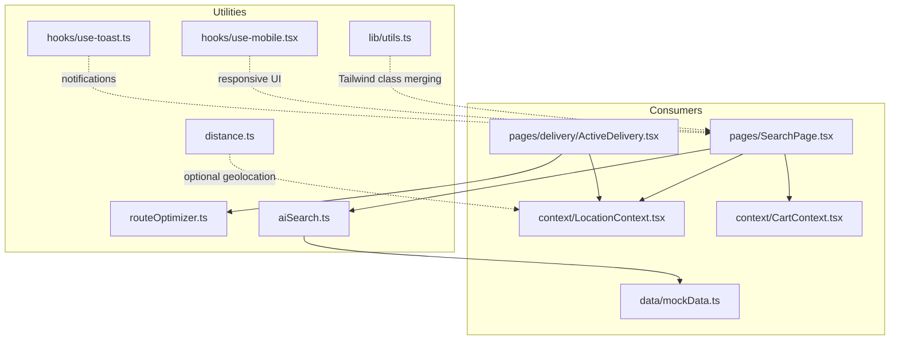
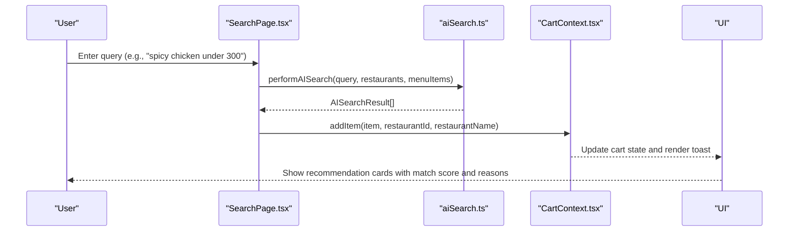
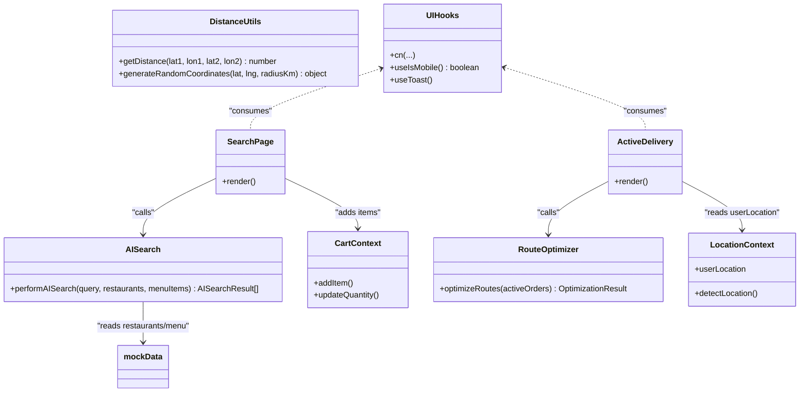
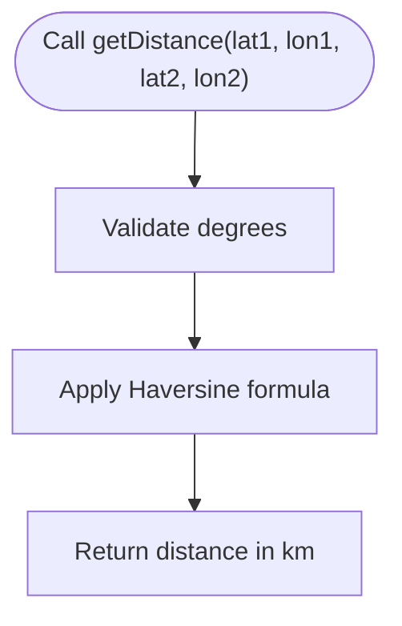
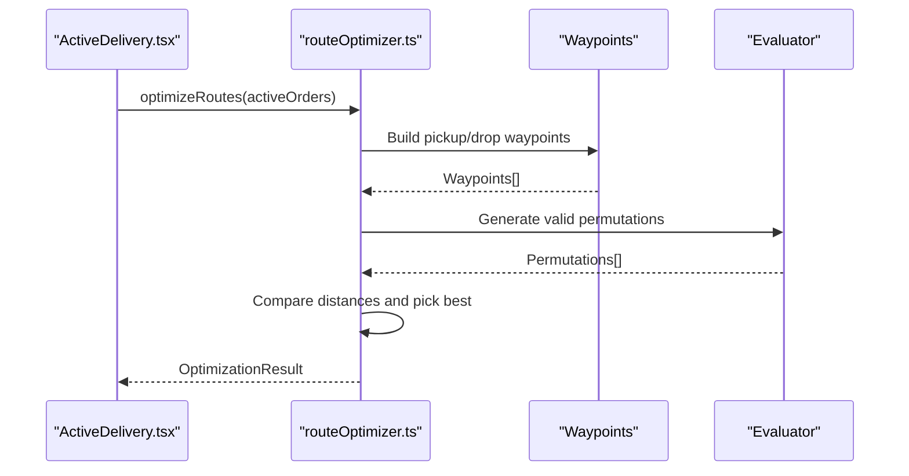
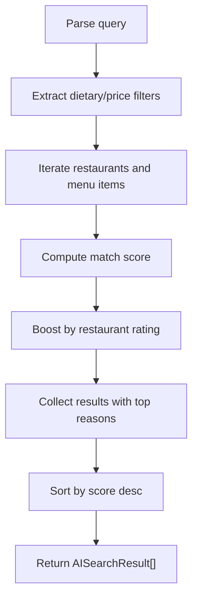
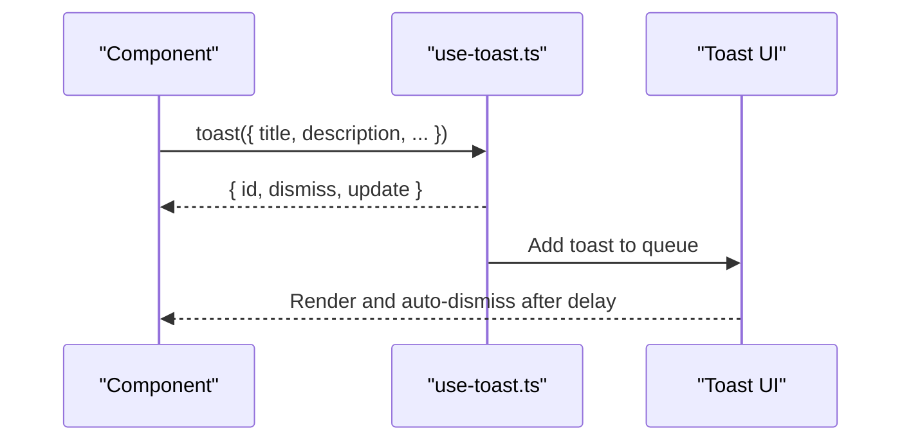
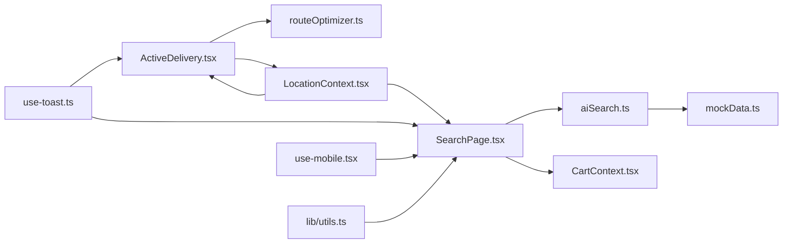

# Utility Functions

<cite>
**Referenced Files in This Document**
- [distance.ts](file://src/utils/distance.ts)
- [routeOptimizer.ts](file://src/utils/routeOptimizer.ts)
- [aiSearch.ts](file://src/utils/aiSearch.ts)
- [utils.ts](file://src/lib/utils.ts)
- [use-mobile.tsx](file://src/hooks/use-mobile.tsx)
- [use-toast.ts](file://src/hooks/use-toast.ts)
- [SearchPage.tsx](file://src/pages/SearchPage.tsx)
- [ActiveDelivery.tsx](file://src/pages/delivery/ActiveDelivery.tsx)
- [LocationContext.tsx](file://src/context/LocationContext.tsx)
- [CartContext.tsx](file://src/context/CartContext.tsx)
- [mockData.ts](file://src/data/mockData.ts)
</cite>

## Table of Contents
1. [Introduction](#introduction)
2. [Project Structure](#project-structure)
3. [Core Components](#core-components)
4. [Architecture Overview](#architecture-overview)
5. [Detailed Component Analysis](#detailed-component-analysis)
6. [Dependency Analysis](#dependency-analysis)
7. [Performance Considerations](#performance-considerations)
8. [Troubleshooting Guide](#troubleshooting-guide)
9. [Conclusion](#conclusion)

## Introduction
This document describes TIPPAY’s utility function library and helper modules that power:
- Geolocation distance calculations and random coordinate generation
- Delivery route optimization for batch pickups and drops
- AI-powered smart search for restaurants and dishes
- UI helpers and custom React hooks for mobile responsiveness and toast notifications

It provides parameter specifications, return value documentation, usage examples, performance considerations, edge cases, and integration patterns with the broader application.

## Project Structure
The utility modules live under dedicated folders and are consumed by page components and contexts:
- src/utils: distance calculation, route optimization, AI search
- src/lib: UI helper utilities
- src/hooks: custom React hooks (mobile detection, toasts)
- src/pages: consumers of these utilities
- src/context: shared state used alongside utilities
- src/data: mock data used by AI search

**Diagram sources**
- [distance.ts:1-34](file://src/utils/distance.ts#L1-L34)
- [routeOptimizer.ts:1-195](file://src/utils/routeOptimizer.ts#L1-L195)
- [aiSearch.ts:1-152](file://src/utils/aiSearch.ts#L1-L152)
- [utils.ts:1-7](file://src/lib/utils.ts#L1-L7)
- [use-mobile.tsx:1-20](file://src/hooks/use-mobile.tsx#L1-L20)
- [use-toast.ts:1-187](file://src/hooks/use-toast.ts#L1-L187)
- [SearchPage.tsx:1-264](file://src/pages/SearchPage.tsx#L1-L264)
- [ActiveDelivery.tsx:1-268](file://src/pages/delivery/ActiveDelivery.tsx#L1-L268)
- [LocationContext.tsx:1-63](file://src/context/LocationContext.tsx#L1-L63)
- [CartContext.tsx:1-64](file://src/context/CartContext.tsx#L1-L64)
- [mockData.ts:1-326](file://src/data/mockData.ts#L1-L326)

**Section sources**
- [distance.ts:1-34](file://src/utils/distance.ts#L1-L34)
- [routeOptimizer.ts:1-195](file://src/utils/routeOptimizer.ts#L1-L195)
- [aiSearch.ts:1-152](file://src/utils/aiSearch.ts#L1-L152)
- [utils.ts:1-7](file://src/lib/utils.ts#L1-L7)
- [use-mobile.tsx:1-20](file://src/hooks/use-mobile.tsx#L1-L20)
- [use-toast.ts:1-187](file://src/hooks/use-toast.ts#L1-L187)
- [SearchPage.tsx:1-264](file://src/pages/SearchPage.tsx#L1-L264)
- [ActiveDelivery.tsx:1-268](file://src/pages/delivery/ActiveDelivery.tsx#L1-L268)
- [LocationContext.tsx:1-63](file://src/context/LocationContext.tsx#L1-L63)
- [CartContext.tsx:1-64](file://src/context/CartContext.tsx#L1-L64)
- [mockData.ts:1-326](file://src/data/mockData.ts#L1-L326)

## Core Components
- Distance utilities: compute spherical distances and generate random nearby coordinates
- Route optimizer: build valid permutations of pickups/drops and minimize total travel
- AI search: natural-language-driven dish discovery with scoring and reasons
- UI helpers: Tailwind class merging utility
- Hooks: mobile breakpoint detection and toast notification manager

**Section sources**
- [distance.ts:1-34](file://src/utils/distance.ts#L1-L34)
- [routeOptimizer.ts:1-195](file://src/utils/routeOptimizer.ts#L1-L195)
- [aiSearch.ts:1-152](file://src/utils/aiSearch.ts#L1-L152)
- [utils.ts:1-7](file://src/lib/utils.ts#L1-L7)
- [use-mobile.tsx:1-20](file://src/hooks/use-mobile.tsx#L1-L20)
- [use-toast.ts:1-187](file://src/hooks/use-toast.ts#L1-L187)

## Architecture Overview
The utilities integrate with page components and contexts to deliver cohesive user experiences:
- SearchPage uses AI search to surface personalized dish recommendations
- ActiveDelivery consumes route optimization to compute efficient multi-stop itineraries
- LocationContext supplies geolocation data used by distance utilities and route planning
- CartContext integrates with AI search results to add items directly from recommendations
- UI hooks and helpers support responsive layouts and non-intrusive notifications

**Diagram sources**
- [SearchPage.tsx:1-264](file://src/pages/SearchPage.tsx#L1-L264)
- [aiSearch.ts:1-152](file://src/utils/aiSearch.ts#L1-L152)
- [CartContext.tsx:1-64](file://src/context/CartContext.tsx#L1-L64)

## Detailed Component Analysis

### Distance Utilities
Implements:
- Spherical distance calculation using the Haversine formula
- Random coordinate generation within a radius around a center point

Key functions:
- getDistance(lat1, lon1, lat2, lon2): returns distance in kilometers
- generateRandomCoordinates(centerLat, centerLng, radiusKm): returns { lat, lng }

Parameters:
- getDistance: four decimal degrees (lat/lon)
- generateRandomCoordinates: center latitude/longitude (degrees), radius in kilometers

Returns:
- getDistance: number (km)
- generateRandomCoordinates: object with numeric lat/lng keys

Usage examples:
- Compute distance between two geopoints for proximity checks
- Generate synthetic delivery locations for testing route optimization

Edge cases:
- getDistance assumes valid degrees; ensure inputs are within standard ranges
- generateRandomCoordinates approximates flat Earth near the center; accuracy degrades with larger radii

Integration pattern:
- Combine with LocationContext to compare user location against restaurants
- Use in route planning to estimate leg distances

**Section sources**
- [distance.ts:1-34](file://src/utils/distance.ts#L1-L34)

### Route Optimization
Implements:
- A constrained permutation engine that respects pickup-before-drop ordering
- Distance evaluation using a simplified Euclidean metric scaled to kilometers
- Baseline vs. optimized route comparison to compute “fuel saved” percentage

Key types:
- LatLng: { lat, lng }
- RouteWaypoint: { id, type, name, address, lat, lng, orderId }
- OptimizationResult: { route, totalDistanceKm, totalDurationMins, fuelSavedPct }

Core function:
- optimizeRoutes(activeOrders): returns OptimizationResult

Inputs:
- activeOrders: array of order objects with id, restaurantName, restaurantAddress, deliveryAddress

Processing logic:
- Builds waypoints per order (pickup and drop)
- Generates permutations respecting pickup-before-drop constraints
- Evaluates total distance for each valid sequence
- Picks the minimum-distance route
- Computes baseline distance by visiting orders sequentially and derives savings percentage

Outputs:
- OptimizationResult with route waypoints, total distance (km), estimated duration (minutes), and fuel savings percentage

Usage example:
- ActiveDelivery page calls optimizeRoutes(activeOrders) and renders analytics and a canvas map of the optimal route

Edge cases:
- Empty activeOrders returns empty route with zeros
- If no valid permutations exist, falls back to a default un-optimized sequence
- Savings percentage capped at 0%

Performance considerations:
- Permutation generation is factorial in the number of orders; practical limits apply
- Consider caching or sampling strategies for large batches

**Section sources**
- [routeOptimizer.ts:1-195](file://src/utils/routeOptimizer.ts#L1-L195)
- [ActiveDelivery.tsx:1-268](file://src/pages/delivery/ActiveDelivery.tsx#L1-L268)

### AI-Powered Search
Implements:
- Natural language parsing to extract dietary preferences, price constraints, and keywords
- Scoring algorithm that weights keyword matches, dietary alignment, flavor categories, price fit, and restaurant rating
- Returns ranked results with top reasons for match

Key types:
- AISearchResult: { item, restaurantId, restaurantName, score, reasons[] }

Core function:
- performAISearch(query, restaurants, menuItems): returns AISearchResult[] sorted by score

Inputs:
- query: string (e.g., "something spicy with chicken under 300")
- restaurants: array of restaurant objects
- menuItems: array of menu item objects

Processing logic:
- Tokenizes query and infers filters (dietary, price)
- Scores each menu item against inferred filters and textual matches
- Boosts scores for highly rated restaurants
- Limits reasons to top 3 and truncates score to 0–100

Outputs:
- Array of AISearchResult ordered by descending score

Usage example:
- SearchPage switches to AI mode and displays cards with match score and reasons
- Integrates with CartContext to add items directly from results

Edge cases:
- Empty query returns empty results
- Items below a minimal threshold are excluded from results
- Price extraction handles various formats (“under 200”, “below 500”, standalone numbers, currency symbols)

**Section sources**
- [aiSearch.ts:1-152](file://src/utils/aiSearch.ts#L1-L152)
- [SearchPage.tsx:1-264](file://src/pages/SearchPage.tsx#L1-L264)
- [mockData.ts:1-326](file://src/data/mockData.ts#L1-L326)

### UI Helpers and Hooks
- cn(...inputs): merges Tailwind classes using clsx and tailwind-merge
- useIsMobile(): detects mobile viewport and returns boolean
- useToast()/toast(): global toast manager with queue limits and dismissal

Usage examples:
- Apply cn(...) to conditionally merge component classes
- useIsMobile() to adapt layouts for smaller screens
- toast(...) to notify users of actions (e.g., adding items, location detection)

**Section sources**
- [utils.ts:1-7](file://src/lib/utils.ts#L1-L7)
- [use-mobile.tsx:1-20](file://src/hooks/use-mobile.tsx#L1-L20)
- [use-toast.ts:1-187](file://src/hooks/use-toast.ts#L1-L187)

## Architecture Overview

**Diagram sources**
- [distance.ts:1-34](file://src/utils/distance.ts#L1-L34)
- [routeOptimizer.ts:1-195](file://src/utils/routeOptimizer.ts#L1-L195)
- [aiSearch.ts:1-152](file://src/utils/aiSearch.ts#L1-L152)
- [utils.ts:1-7](file://src/lib/utils.ts#L1-L7)
- [use-mobile.tsx:1-20](file://src/hooks/use-mobile.tsx#L1-L20)
- [use-toast.ts:1-187](file://src/hooks/use-toast.ts#L1-L187)
- [SearchPage.tsx:1-264](file://src/pages/SearchPage.tsx#L1-L264)
- [ActiveDelivery.tsx:1-268](file://src/pages/delivery/ActiveDelivery.tsx#L1-L268)
- [LocationContext.tsx:1-63](file://src/context/LocationContext.tsx#L1-L63)
- [CartContext.tsx:1-64](file://src/context/CartContext.tsx#L1-L64)
- [mockData.ts:1-326](file://src/data/mockData.ts#L1-L326)

## Detailed Component Analysis

### Distance Utilities
- Purpose: Accurate and approximate geolocation math for matching and planning
- Complexity: getDistance O(1); generateRandomCoordinates O(1)
- Coupling: Low; pure functions suitable for reuse across modules
- Edge cases: Input validation recommended; use LocationContext for validated coordinates

**Diagram sources**
- [distance.ts:1-17](file://src/utils/distance.ts#L1-L17)

**Section sources**
- [distance.ts:1-34](file://src/utils/distance.ts#L1-L34)

### Route Optimization
- Purpose: Efficiently plan multi-stop deliveries respecting order constraints
- Complexity: Factorial in number of orders due to permutations; prune with constraints
- Coupling: Depends on order metadata and a fixed rider starting point
- Edge cases: Empty input handled; fallback route when no valid permutations exist

**Diagram sources**
- [routeOptimizer.ts:53-194](file://src/utils/routeOptimizer.ts#L53-L194)
- [ActiveDelivery.tsx:26-27](file://src/pages/delivery/ActiveDelivery.tsx#L26-L27)

**Section sources**
- [routeOptimizer.ts:1-195](file://src/utils/routeOptimizer.ts#L1-L195)
- [ActiveDelivery.tsx:1-268](file://src/pages/delivery/ActiveDelivery.tsx#L1-L268)

### AI-Powered Search
- Purpose: Intelligent discovery of restaurants and dishes based on natural language queries
- Complexity: O(R × M) where R is restaurants and M is menu items; dominated by scoring loop
- Coupling: Reads mock data and applies scoring heuristics; integrates with cart and translation contexts

**Diagram sources**
- [aiSearch.ts:11-151](file://src/utils/aiSearch.ts#L11-L151)
- [SearchPage.tsx:44-44](file://src/pages/SearchPage.tsx#L44-L44)

**Section sources**
- [aiSearch.ts:1-152](file://src/utils/aiSearch.ts#L1-L152)
- [SearchPage.tsx:1-264](file://src/pages/SearchPage.tsx#L1-L264)
- [mockData.ts:1-326](file://src/data/mockData.ts#L1-L326)

### UI Helpers and Hooks
- cn: Lightweight Tailwind class merging utility
- useIsMobile: Responsive hook with media query listener
- useToast: Global toast manager with queue and timeouts

**Diagram sources**
- [use-toast.ts:137-164](file://src/hooks/use-toast.ts#L137-L164)

**Section sources**
- [utils.ts:1-7](file://src/lib/utils.ts#L1-L7)
- [use-mobile.tsx:1-20](file://src/hooks/use-mobile.tsx#L1-L20)
- [use-toast.ts:1-187](file://src/hooks/use-toast.ts#L1-L187)

## Dependency Analysis

**Diagram sources**
- [SearchPage.tsx:1-264](file://src/pages/SearchPage.tsx#L1-L264)
- [ActiveDelivery.tsx:1-268](file://src/pages/delivery/ActiveDelivery.tsx#L1-L268)
- [routeOptimizer.ts:1-195](file://src/utils/routeOptimizer.ts#L1-L195)
- [aiSearch.ts:1-152](file://src/utils/aiSearch.ts#L1-L152)
- [LocationContext.tsx:1-63](file://src/context/LocationContext.tsx#L1-L63)
- [CartContext.tsx:1-64](file://src/context/CartContext.tsx#L1-L64)
- [mockData.ts:1-326](file://src/data/mockData.ts#L1-L326)
- [use-toast.ts:1-187](file://src/hooks/use-toast.ts#L1-L187)
- [use-mobile.tsx:1-20](file://src/hooks/use-mobile.tsx#L1-L20)
- [utils.ts:1-7](file://src/lib/utils.ts#L1-L7)

**Section sources**
- [SearchPage.tsx:1-264](file://src/pages/SearchPage.tsx#L1-L264)
- [ActiveDelivery.tsx:1-268](file://src/pages/delivery/ActiveDelivery.tsx#L1-L268)
- [routeOptimizer.ts:1-195](file://src/utils/routeOptimizer.ts#L1-L195)
- [aiSearch.ts:1-152](file://src/utils/aiSearch.ts#L1-L152)
- [LocationContext.tsx:1-63](file://src/context/LocationContext.tsx#L1-L63)
- [CartContext.tsx:1-64](file://src/context/CartContext.tsx#L1-L64)
- [mockData.ts:1-326](file://src/data/mockData.ts#L1-L326)
- [use-toast.ts:1-187](file://src/hooks/use-toast.ts#L1-L187)
- [use-mobile.tsx:1-20](file://src/hooks/use-mobile.tsx#L1-L20)
- [utils.ts:1-7](file://src/lib/utils.ts#L1-L7)

## Performance Considerations
- Route optimization: Permutations grow factorially; consider batching or heuristic approximations for large active order sets
- AI search: Scanning all restaurants and menu items is linear in dataset size; cache results for repeated queries
- Distance utilities: O(1) operations; negligible overhead
- Toast manager: Queue limits prevent memory growth; ensure cleanup of timeouts

[No sources needed since this section provides general guidance]

## Troubleshooting Guide
Common issues and resolutions:
- Geolocation errors: Verify browser permissions and network availability; LocationContext surfaces user-friendly toasts
- Empty AI results: Ensure query contains sufficient keywords or explicit filters; confirm mock data availability
- Route planner returns default: Occurs when no valid permutations exist; validate order metadata and IDs
- Toast not dismissing: Confirm useToast lifecycle and that toasts are added to the queue

**Section sources**
- [LocationContext.tsx:21-49](file://src/context/LocationContext.tsx#L21-L49)
- [use-toast.ts:53-69](file://src/hooks/use-toast.ts#L53-L69)
- [routeOptimizer.ts:140-147](file://src/utils/routeOptimizer.ts#L140-L147)

## Conclusion
TIPPAY’s utility library provides robust primitives for geolocation-aware matching, intelligent search, and efficient delivery planning. By combining pure functions, reactive hooks, and context-aware integrations, the system delivers a scalable and maintainable foundation for restaurant discovery and logistics orchestration.

[No sources needed since this section summarizes without analyzing specific files]